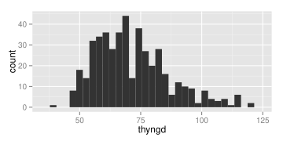
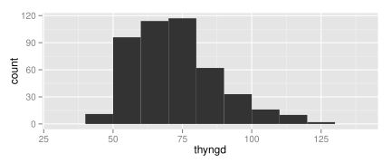
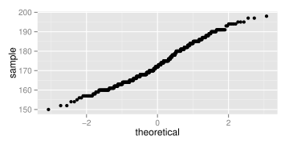
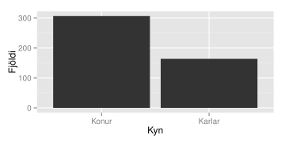
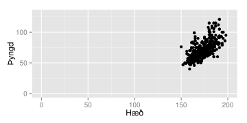
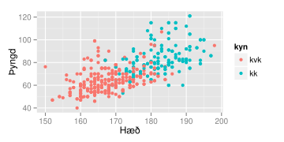
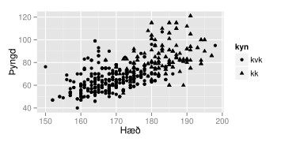
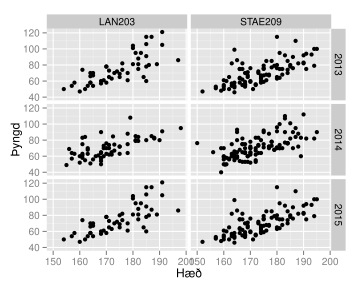
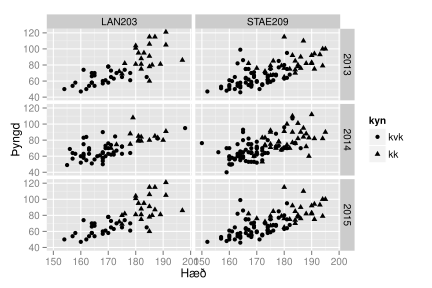
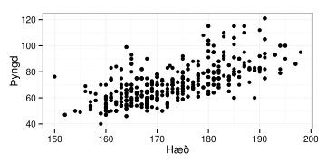

.. _c.myndraen:

Myndræn framsetning
===================

Myndræn framsetning er gífurlega mikilvæg á öllum stigum
tölfræðiúrvinnslu. Með nokkrum gröfum má fljótt fá tilfinningu fyrir
gögnum og því mælum alltaf með því fljótlega eftir innlestur gagna áður
en lengra er haldið með frekari tölfræðiúrvinnslu. Sömuleiðis eru gröf
oft og tíðum einstaklega heppileg til að setja fram niðurstöður
rannsókna og að lokum gegna þau einnig mikilvægu hlutverki við að kanna
hvort forsendur ýmissa tölfræðiprófa séu uppfylltar.

Í grunnpakkanum sem fylgir R má finna ýmsar aðferðir til að búa til gröf
(t.d. ``plot()``, ``barplot()``, ``boxplot()`` og ``histogram()``). Þær
eru mjög auðveldar í notkun en gröfin sem þær skila eru ekki sérlega
fögur. Það hefur færst mikið í vöxt að R-notendur noti aðferðir sem
tilheyra pakka sem kallast ``ggplot2`` til að búa til gröf. Með honum má
útbúa yndisfögur gröf og er hann umfjöllunarefni þessa kafla.

Ólíkt því sem gengur og gerist munum við einungis nota eina aðferð
``ggplot()`` en með henni fylgja ótalmargar viðbætur sem gera okkur
kleift að teikna fjölbreytt gröf.

ggplot()
^^^^^^^^

.. attention::

    **Inntak:** nafn á gagnatöflu og nöfn á aðalbreytum grafsins
    
    **Úttak:** graf
    
    **Helstu stillingar:** ótalmargar!

--------------

Skipunin ``ggplot()`` er ætíð mötuð á sama hátt. Fyrst kemur nafnið á
gagnatöflunni sem geymir gögnin, þá útlitsstillingin ``aes()`` og innan
hennar nöfnin á aðalbreytum grafsins. Þar fyrir aftan kemur viðbót sem
tilgreinir hvers konar graf skal teikna og einnig er hægt að bæta við
ótal fleiri viðbótum til að merkja og breyta ásum, lagskipta grafinu
eftir breytum og svo mætti lengi telja. Viðbætur bætast við með ``+`` í
stað þess að vera mataðar inn í fallið. Það mun sjást í hverju dæmi hér
fyrir neðan.

Í þessum kafla munum við teikna algengustu gerðir grafa með viðbótunum
``geom_point(), geom_bar(), geom_histogram(), geom_boxplot`` og
``stat_qq()``.

Algengustu gröf
---------------

Punktarit
~~~~~~~~~

Punktarit eru einföld og skýr leið til að setja fram gögn. Þau eru
smíðuð með viðbótinni ``+ geom_point()``. Eftirfarandi skipun gefur
okkur punktarit sem lýsir sambandi hæðar og þyngdar í gagnatöflunni
``puls``. Skýribreytan ``haed`` er á x-ás og svarbreytan ``thyngd`` á
y-ás, þær eru báðar tilgreindar inn í útlitsstillingunni ``aes()``.

::

   ggplot(data=puls, aes(x=haed,y=thyngd)) + geom_point()

.. figure:: myndir/unnamed-chunk-88-1.svg

Stöplarit
~~~~~~~~~

Stöplarit eru tilgreind með viðbótinni ``geom_bar``. Þar sem stöplarit
eru einungis notuð til að lýsa einni breytu er aðeins sú breyta
tilgreind inní ``aes()``.

::

   ggplot(data = puls, aes(kyn)) + geom_bar()

.. figure:: myndir/unnamed-chunk-89-1.svg

Stuðlarit
~~~~~~~~~

Viðbótin ``geom_histogram()`` teiknar stuðlarit. Viljum við teikna
stuðlarit af breytunni ``thyngd`` gerum við það með skipuninni:

::

   ggplot(data=puls, aes(thyngd)) + geom_histogram()

Stilla má breidd súlnanna með ``binwidth`` stillingunni:

::

   ggplot(data=puls, aes(thyngd)) + geom_histogram(binwidth=10)

Kassarit
~~~~~~~~

Kassarit eru mjög hentug til að bera saman dreifingu tveggja breyta. Þau
eru tilgreind með viðbótinni ``geom_boxplot()``. Viljum við teikna
kassarit af breytunni ``thyngd`` lagskipt eftir breytunni ``kyn`` gerum
við það með:

::

   ggplot(data=puls,aes(x=kyn,y=thyngd)) + geom_boxplot()

.. figure:: myndir/unnamed-chunk-92-1.svg

Hægt er að teikna kassarit af einni breytu án lagskiptingar með því að
setja ``factor(0)`` inn sem eins konar gervibreytu. Neðangreind skipun
teiknar kassarit af breytunni ``thyngd`` án lagskiptingar:

::

   ggplot(data=puls,aes(x=factor(0),y=thyngd)) + geom_boxplot()

.. figure:: myndir/unnamed-chunk-93-1.svg

Normaldreifingarrit
~~~~~~~~~~~~~~~~~~~

Normaldreifingarrit eru gerð með viðbótinni ``stat_qq()``.
Normaldreifingarrit fyrir breytuna ``haed`` fæst með:

::

   ggplot(data=puls, aes(sample=haed)) + stat_qq()

Takið eftir að nú stendur ``sample=`` í stað ``x=`` í ``aes()``
stillingunni.

Ásar
----

Nöfn ása
~~~~~~~~

Viðbætur má einnig nota til að merkja ása á gröfum. Viðbótin ``xlab()``
tilgreinir merkingu á x-ás á meðan viðbótin ``ylab()`` tilgreinir
merkingu á y-ás.

::

   ggplot(data = puls, aes(kyn)) + geom_bar() + xlab('Kyn') + ylab('Fjöldi')

.. figure:: myndir/unnamed-chunk-95-1.svg

Við getum enn fremur merkt og stillt kvarðana á hvorum ás fyrir sig að
vild. Séum við að merkja samfellda breytu á x-ás notum við viðbótina
``scale_x_continuous()`` en sé hún strjál notum við
``scale_x_discrete()``. Að sama skapi skiptum við ``x`` út fyrir ``y``
ef við viljum merkja og stilla kvarðana á y-ás.

Nöfn kvarða
~~~~~~~~~~~

Til að breyta heitum á kvörðum mötum við stillinguna ``labels`` með þeim
heitum sem við viljum nota. Þannig merkjum við sem dæmi flokkana á
stöplaritinu hér að ofan með viðbótinni:

::

   ggplot(data = puls, aes(kyn)) + geom_bar() + xlab('Kyn') + ylab('Fjöldi') +
   scale_x_discrete(labels = c("Konur","Karlar"))

Takið eftir einu til viðbótar. Hér skiptum við skipuninni upp í tvær
línur til að gera kóðann læsilegri. Þá þurfum við að passa okkur að hafa
plúsinn við enda línunnar. Ef plúsinn kemur í upphafi næstu línu er sú
lína hunsuð og við fáum jafnvel villu:

::

   ggplot(data = puls, aes(kyn)) + geom_bar() + xlab('Kyn') + ylab('Fjöldi')

.. figure:: myndir/unnamed-chunk-97-1.svg

::

   + scale_x_discrete(labels = c("Konur","Karlar"))
   ## Error in +scale_x_discrete(labels = c("Konur", "Karlar")): invalid argument to
   ## unary operator

Hök kvarða
~~~~~~~~~~

Að sama skapi má auðveldlega stilla hvar hök kvarðanna á x- og y-ás eru
með stillingunni ``breaks()``. Viljum við sem dæmi láta merkingarnar á
y-ás í punktaritinu hér fyrir ofan hlaupa á hverjum 10 kílóum í stað 20
gerum við það með skipuninni:

::

   ggplot(data=puls, aes(x=haed,y=thyngd)) + geom_point() +
   xlab("Hæð") + ylab("Þyngd")+
   scale_y_continuous(breaks = seq(40,120,10))

.. figure:: myndir/unnamed-chunk-98-1.svg

Mörk kvarða
~~~~~~~~~~~

Mörk kvarða eru stillt með viðbótunum ``xlim()`` og ``ylim()``. Þær eru
mataðar með endamörkum kvarðanna.

::

   ggplot(data=puls, aes(x=haed,y=thyngd)) + geom_point() +
   xlab("Hæð") + ylab("Þyngd") + ylim(0,130) + xlim(0,200)

Litir og tákn
-------------

Litir og tákn eru góðar leið til að lagskipta gröfum. Í ``ggplot()`` eru
tvenns konar leiðir til að lita. Annars vegar með að lita punktana eða
línurnar á grafinu sjálfu en þá er notuð stillingin ``color``. Hins
vegar má fylla upp í fleti á grafinu með stillingunni ``fill``.
Stillingarnar eru tilgreindar inní útlitsstillingunni ``aes()``.

Við getum lagskipt punktaritinu yfir hæð og þyngd nemenda eftir kynjum
nemendanna með því að lita punktana ólíkt eftir því hvoru kyninu nemandi
tilheyrir. Það er því gert með stillingunni ``color``.

::

   ggplot(data=puls, aes(x=haed,y=thyngd, color=kyn)) + geom_point() +
   xlab("Hæð") + ylab("Þyngd")

Viljum við hins vegar lagskipta stöplaritinu yfir fjölda nemenda af
hvoru kyni eftir því hvort þeir reykja eða ekki gerum við það með
stillingunni ``fill``, því þá viljum við lita fleti grafsins ólíkt.

::

   ggplot(data = puls, aes(kyn, fill=reykir)) + geom_bar() +
   xlab("Kyn") + ylab("Fjöldi")

.. figure:: myndir/unnamed-chunk-101-1.svg

Ef við bætum stillingunni ``position=’dodge’`` inní viðbótina
``geom_bar()`` koma stöplar grafsins hvor við hliðina á öðrum:

::

   ggplot(data = puls, aes(kyn, fill=reykir)) + geom_bar(position='dodge') +
   xlab("Kyn") + ylab("Fjöldi")

.. figure:: myndir/unnamed-chunk-102-1.svg

Gráu fletirnir eru þeir nemendur sem ekki gáfu upp hvort þeir reyktu eða
ekki, þ.e. mælingar sem vantar.

Oft eru tákn heppilegri en litir til að lagskipta gröfum. Til dæmis geta
litmyndir verið dýrar í tímaritum og svart-hvítar lausnir því heppilegri
kostur. Tilgreina má að skipta gröfum upp með því að nota ólík tákn með
því að nota ``shape`` á sama hátt og ``color`` var notað hér að ofan:

::

   ggplot(data=puls, aes(x=haed,y=thyngd, shape=kyn)) + geom_point()+
   xlab("Hæð") + ylab("Þyngd")

Gröfum skipt upp í reiti
------------------------

Önnur góð leið til að lagskipta gröfum er með því að skipta þeim upp í
reiti. Það er gert með skipuninni ``facet_grid()``. Hægt er að skipta
gröfunum hvort sem heldur eftir x-ás eða y-ás eða jafnvel báðum.

Viljum við skipta punktaritinu yfir hæð og þyngd nemenda upp eftir því
hvaða námskeiði þeir tilheyra gerum við það með skipuninni:

::

   ggplot(data=puls, aes(x=haed,y=thyngd)) + geom_point() +
   facet_grid(~namskeid) + xlab("Hæð") + ylab("Þyngd")

.. figure:: myndir/unnamed-chunk-104-1.svg

Viljum við skipta grafinu í reiti eftir því bæði hvaða námskeiði þeir
tilheyra og hvaða ár þeir sátu námskeiðið gerum við það með:

::

   ggplot(data=puls, aes(x=haed,y=thyngd)) + geom_point() +
   facet_grid(ar~namskeid) + xlab("Hæð") + ylab("Þyngd")

Það má hæglega lagskipta með bæði reitaskiptingu og táknum í sama
grafinu. Þannig er hægt að tákna punktana í grafinu að ofan eftir því
hvoru kyni nemendurnir tilheyra:

Viljum við skipta grafinu í reiti eftir því bæði hvaða námskeiði þeir
tilheyra og hvaða ár þeir sátu námskeiðið gerum við það með:

::

   ggplot(data=puls, aes(x=haed,y=thyngd, shape=kyn)) + geom_point() +
   facet_grid(ar~namskeid) + xlab("Hæð") + ylab("Þyngd")

Skipt um bakgrunn
-----------------

Grái, sjálfgefni, bakgrunnurinn á ggplot gröfum getur stundum verið
óviðeigandi og vilja margir hafa hvítan bakgrunn þess í stað. Til eru
tvær þægilegar stillingar til að breyta um bakgrunn. Sú fyrri er
``theme_bw()`` og gefur þessa niðurstöðu:

::

   ggplot(data=puls, aes(x=haed,y=thyngd)) + geom_point() +
   theme_bw() + xlab("Hæð") + ylab("Þyngd")

sú seinni er ``theme_classic()`` og gefur þessa niðurstöðu:

::

   ggplot(data=puls, aes(x=haed,y=thyngd)) + geom_point() +
   theme_classic() + xlab("Hæð") + ylab("Þyngd")

.. figure:: myndir/unnamed-chunk-108-1.svg

Myndir vistaðar
---------------

Myndir vistaðar
~~~~~~~~~~~~~~~

Til að geyma myndirnar sem við búum til, veljið ``Plots`` flipann í
neðra vinstra glugganum í RStudio myndina og veljið þar ``Export``. Þar
má velja ``.pdf`` eða ``.jpg/.png/.eps`` skrá.

ggsave()
^^^^^^^^

.. attention::

    **Inntak:** nafn grafsins
    
    **Inntak:** vistað graf á því sniði sem er búið að tilgreina
    
    **Helstu stillingar:** plot, width, height, dpi

--------------

Einnig vistar skipunin ``ggsave()`` það graf sem er á skjánum því sinni
undir því nafni sem þið gefið. Sú skipun er mjög handhæg t.d. þegar mörg
gröf eru teiknuð, þá eru engir músarsmellir nauðsynlegir. Skipunin hefur
m.a. stillinguna ``plot`` og þá vistar hún ekki grafið á skjánum, heldur
grafið sem er vistað undir því nafni sem við tilgreinum stillingunni. Ef
við viljum vista grafið á skjánum á ``.jpg`` sniði undir nafninu
``graf`` gefum við skipunina:

::

   ggsave('graf.jpg')

Ef við viljum vista grafið á ``.pdf`` sniði gefum við skipunina

::

   ggsave('graf.pdf')

og ef við viljum ekki vista grafið á skjánum, heldur graf sem við höfum
vistað sem hlut undir nafninu ``mynd1`` þá gefum við skipunina:

::

   ggsave('graf.pdf', mynd1)

Að lokum eru til aðrar aðferðir til að vista myndar, svo sem ``pdf()``,
``jpeg()``, ``postscript()`` og fleiri. Kannið hjálpina fyrir þessar
aðferðir.

Leiksvæði fyrir R kóða
----------------------

Hér fyrir neðan er hægt að skrifa R kóða og keyra hann. Notið þetta svæði til að prófa ykkur áfram með skipanir kaflans. Athugið að við höfum þegar sett inn skipun til að lesa inn ``puls`` gögnin sem eru notuð gegnum alla bókina.

.. datacamp::
    :lang: r

    # Gogn sott og sett i breytuna puls.
    puls <- read.table ("https://edbook.hi.is/gogn/pulsAll.csv", header=TRUE, sep=";")

    # Setjid ykkar eigin koda her fyrir nedan:
    # Sem daemi, skipunin head(puls) skilar fyrstu nokkrar radirnar i gognunum
    # asamt dalkarheitum.
    head(puls)