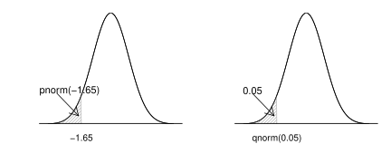

.. _c.likindafraedi:

Líkindafræðileg undirstaða
==========================

Góður skilningur á tölfræði krefst góðrar undirstöðu í líkindafræði. Í
kafla :numref:`%s <s.likindareikningur>` verða kynntar aðferðinar
``factorial()`` og ``choose()`` sem eru mjög gagnlegar í
líkindareikningi. Að því loknu kynnumst við skipunum sem gera okkur
kleift að herma, reikna líkur og finna viðmiðunargildi sem byggja á
algengustu líkindadreifingunum.

Við munum sjá tvo flokka af skipunum fyrir strjálar líkindadreifingar í
kafla :numref:`%s <s.strjalar>`. Annar flokkurinn hefur endingarnar
``\cdotbinom()`` en hinn ``\cdotpois()``. Í kafla :numref:`%s <s.samfelldar>`
munum við sjá sambærilegar skipanir fyrir samfelldar líkindadreifingar:
``\cdotnorm``, ``\cdotchisq``, ``\cdott`` og ``\cdotf``.

.. _s.likindareikningur:

Líkindareikningur
-----------------

Líkindareikningur
~~~~~~~~~~~~~~~~~

factorial()
^^^^^^^^^^^

.. attention::

    **Inntak:** tala sem við viljum reikna aðfeldi fyrir
    
    **Úttak:** aðfeldi tölunnar

--------------

Aðferðin ``factorial()`` reiknar aðfeldi (!) tölu. Við mötum aðferðina
með þeirri tölu sem við viljum finna aðfeldið að og fáum til baka
útkomuna. Viljum við sem dæmi finna :math:`5!` skrifum við:

::

   factorial(5)
   ## [1] 120

Munið að :math:`5! = 5\cdot4\cdot3\cdot2\cdot1`.

choose()
^^^^^^^^

.. attention::

    **Inntak:** tvær tölur sem við viljum reikna tvíliðustuðul fyrir
    
    **Úttak:** tvíliðustuðull talnanna

--------------

Aðferðin ``choose()`` gefur okkur tvíliðustuðulinn :math:`n \choose k`.
Við mötum aðferðina með tölunum :math:`n` og :math:`k` og fáum til baka
útkomuna. Viljum við finna :math:`\binom{4}{2}` skrifum við:

::

   choose(4,2)
   ## [1] 6

.. _s.strjalar:

Strjálar líkindadreifingar
--------------------------

Strjálar líkindadreifingar
~~~~~~~~~~~~~~~~~~~~~~~~~~

Í þessum hluta munum við kynnast aðferðunum ``dbinom()``, ``pbinom()``,
``dpois()`` og ``ppois()``. Föllin sem byrja á ``d`` gefa okkur
*massafallið* (e. probability mass function) en föllin sem byrja á ``p``
gefa okkur *dreififallið* (e. probability distribution funciton).

dbinom()
^^^^^^^^

.. attention::

    **Inntak:** útkoma úr tvíkostadreifingu, stikar tvíkostadreifingarinnar
    
    **Úttak:** líkur á útkomunni

--------------

``dbinom()`` aðferðin reiknar líkur á forminu þar sem :math:`X` er
slembistærð sem fylgir tvíkostadreifingunni. Við þurfum að mata
aðferðina með þremur tölum, :math:`k`, :math:`n` og :math:`p` þar sem
:math:`k` er fjöldi heppnaðra tilrauna, :math:`n` er fjöldi tilrauna og
:math:`p` eru líkurnar á jákvæðri útkomu í hverri tilraun fyrir sig:

::

   dbinom(k,n,p)

Viljum við reikna líkurnar á að fá tvo þorska þegar krónu er kastað upp
fjórum sinnum skrifum við:

::

   dbinom(2,4,0.5)
   ## [1] 0.375

Hægt er að mata aðferðina þannig að vigur er settur inn í stað tölu
fyrir :math:`k`. Ef við viljum reikna :math:`P(X=0)`, :math:`P(X=1)`,
:math:`P(X=2)`, :math:`P(X=3)` og :math:`P(X=4)` þar sem :math:`X`
fylgir tvíkostadreifingu með stika :math:`n = 4` og :math:`p = 0.5`
skrifum við:

::

   dbinom(c(0,1,2,3,4),4,0.5)
   ## [1] 0.0625 0.2500 0.3750 0.2500 0.0625

Aðferðin skilar þá fimm tölum, :math:`P(X=0)`, :math:`P(X=1)`,
:math:`P(X=2)`, :math:`P(X=3)` og :math:`P(X=4)`. Hægt er að skrifa
þetta á þægilegri máta með:

::

   dbinom(0:4,4,0.5)
   ## [1] 0.0625 0.2500 0.3750 0.2500 0.0625

pbinom()
^^^^^^^^

.. attention::

    **Inntak:** útkoma úr tvíkostadreifingu, stikar tvíkostadreifingarinnar
    
    **Úttak:** líkur

--------------

``pbinom()`` aðferðin reiknar líkur á forminu þar sem :math:`X` er
slembistærð sem fylgir tvíkostadreifingunni. Við þurfum að mata
aðferðina með þremur tölum, :math:`k`, :math:`n` og :math:`p` þar sem
:math:`k` er fjöldi heppnaðra tilrauna, :math:`n` er fjöldi tilrauna og
:math:`p` eru líkurnar á jákvæðri útkomu í hverri tilraun fyrir sig:

::

   pbinom(k,n,p)

Viljum við reikna líkurnar á að fá í mesta lagi tvo þorska (núll, einn
eða tvo) þegar krónu er kastað upp fjórum sinnum skrifum við:

::

   pbinom(2,4,0.5)
   ## [1] 0.6875

Munurinn á ``dbinom()`` og ``pbinom()`` er útskýrður á mynd
:numref:`%s <f.dpbinom>`. Sambærilega mynd mætti teikna fyrir ``dpois()`` og
``ppois()`` sem fjallað er um hér að neðan.

.. _f.dpbinom:

.. figure:: myndir/dpbinom-1.svg
    :align: center
    :alt: Mynd

dpois()
^^^^^^^

.. attention::

    **Inntak:** útkoma úr Poisson dreifingu, stiki Poisson dreifingarinnar
    
    **Úttak:** líkur

--------------

``dpois()`` aðferðin reiknar líkur á forminu þar sem :math:`X` er
slembistærð sem fylgir Poisson dreifingunni. Við þurfum að mata
aðferðina með tveimur tölum, :math:`k` og :math:`\lambda` þar sem
:math:`k` er fjöldi heppnaðra tilrauna og :math:`\lambda` er væntigildi
slembistærðarinnar :math:`X`:

::

   dpois(k,lambda)

Viljum við reikna líkurnar á að 3 kúnnar komi á kassann í Krónunni á
einni mínútu þar sem meðalfjöldi kúnna á mínútu er 1.5 skrifum við:

::

   dpois(3,1.5)
   ## [1] 0.1255107

Hægt er að mata aðferðina þannig að vigur er settur inn í stað tölu
fyrir :math:`k`. Ef við viljum reikna :math:`P(X=0)`, :math:`P(X=1)`,
:math:`P(X=2)` og :math:`P(X=3)` þar sem :math:`X` fylgir Poisson
dreifingu með :math:`\lambda = 1.5` skrifum við:

::

   dpois(c(0,1,2,3),1.5)
   ## [1] 0.2231302 0.3346952 0.2510214 0.1255107

Aðferðin skilar þá fjórum tölum, :math:`P(X=0)`, :math:`P(X=1)`,
:math:`P(X=2)` og :math:`P(X=3)`.

ppois()
^^^^^^^

.. attention::

    **Inntak:** útkoma úr Poisson dreifingu, stikar Poisson dreifingarinnar
    
    **Úttak:** líkur

--------------

``ppois()`` aðferðin reiknar líkur á forminu þar sem :math:`X` er
slembistærð sem fylgir Poisson dreifingunni. Við þurfum að mata
aðferðina með tveimur tölum, :math:`k` og :math:`\lambda` þar sem
:math:`k` er fjöldi heppnaðra tilrauna og :math:`\lambda` er væntigildi
slembistærðarinnar :math:`X`:

::

   ppois(k,lambda)

Viljum við reikna líkurnar á að í mesta lagi 3 kúnnar (núll, einn, tveir
eða þrír) komi á kassann í krónunni á einni mínútu þar sem meðalfjöldi
kúnna á mínútu er 1.5 skrifum við:

::

   ppois(3,1.5)
   ## [1] 0.9343575

.. _s.samfelldar:

Samfelldar líkindadreifingar
----------------------------

Samfelldar líkindadreifingar
~~~~~~~~~~~~~~~~~~~~~~~~~~~~

Í þessum hluta munum við kynnast aðferðunum sem byrja á ``p``, ``q`` og
``r``. Aðferðirnar sem byrja á ``p`` skila okkur *dreififalli* (e.
probability distribution funciton), aðferðirnar sem byrja á ``q`` skila
okkur *hlutfallsmörkum* (e. quantiles) og aðferðirnar sem byja á ``r``
skila okkur slembitölu úr dreifingunni.

pnorm()
^^^^^^^

.. attention::

    **Inntak:** viðmiðunargildi
    
    **Úttak:** líkur
    
    **Helstu stillingar:** meðaltal og staðalfrávik normaldreifingarinnar

--------------

Við mötum skipunina ``pnorm`` á tilteknu viðmiðunargildi :math:`x` en
hún reiknar líkurnar á því að slembistærð sem fylgir normaldreifingu
taki gildi minna en gefna viðmiðunargildið. Þ.e.a.s. reiknar
:math:`P(X \leq x)` þegar X fylgir normaldreifingu. Hún hefur einnig
fjórar sjálfgefnar stillingar en við munum aðeins nota tvær þeirra:

-  ``mean`` sem tilgreinir *meðaltal* (:math:`\mu`)
   normaldreifingarinnar.

-  ``sd`` sem tilgreinir *staðalfrávik* (:math:`\sigma`)
   normaldreifingarinnar.

Sjálfgefið er að ``mean`` = 0 og ``sd`` = 1, þ.e. að reiknað sé
dreififallið fyrir stöðluðu normaldreifinguna, :math:`\Phi(z)`. Skipunin

::

   pnorm(0.8)
   ## [1] 0.7881446

reiknar því líkurnar á því að slembistærð sem fylgir staðlaðri
normaldreifingu taki gildi sem er minna en 0.8 á meðan

::

   pnorm(0.8,2,1.2)
   ## [1] 0.1586553

reiknar því líkurnar á því að slembistærð sem fylgir normaldreifingu með
meðaltalið 2 og staðalfrávikið 1.2 taki gildi sem er minna en 0.8.

qnorm()
^^^^^^^

.. attention::

    **Inntak:** líkur
    
    **Úttak:** viðmiðunargildi
    
    **Helstu stillingar:** meðaltal og staðalfrávik normaldreifingarinnar

--------------

Við mötum skipunina ``qnorm`` á tilteknum líkum en hún finnur það
viðmiðunargildi :math:`x` sem er þannig að slembistærð sem fylgir
normaldreifingu hefur þær tilteknu líkur á að taka gildi sem er minna en
viðmiðunargildið. Þ.e.a.s. finnur það :math:`x` sem er þannig að
:math:`P(X \leq x)` er jafnt tilteknu líkunum.

Með :math:`z_{a}` táknum við það :math:`z`-gildi sem er þannig að
slembistærð sem fylgir stöðluðu normaldreifingunni hefur líkurnar
:math:`a` á að taka gildi sem er *minna* en :math:`z_a`. Við reiknum
:math:`z_{a}` með skipuninni:

::

   qnorm(a)

þar sem ``a`` eru tilteknu líkurnar.

Ef við erum að vinna með aðra normaldreifingu en þá stöðluðu þá þurfum
við að tilgreina meðaltalið og staðalfrávikið þegar við notum aðferðina.
Sem dæmi þá fáum við hvar við erum stödd á x-ásnum þegar 90% massans eru
okkur á vinstri hönd í normaldreifingu með meðaltal 165 og staðalfrávik
3 með skipuninni:

::

   qnorm(0.90,165,3)
   ## [1] 168.8447

Munurinn á ``pnorm()`` og ``qnorm()`` er útskýrður á mynd
:numref:`%s <f.pqnorm>`. Sambærilegar myndir mætti teikna fyrir aðrar dreifingar
sem fjallað er um hér að neðan.

.. _f.pqnorm:

rnorm()
^^^^^^^

.. attention::

    **Inntak:** fjöldi gilda sem skal herma
    
    **Úttak:** hermd gildi
    
    **Helstu stillingar:** meðaltal og staðalfrávik normaldreifingarinnar

--------------

``rnorm`` aðferðin býr til gildi sem fylgja normaldreifingu. Það er
einnig oft kallað að *herma* gildi. Við mötum aðferðina með hversu mörg
gildi við viljum (``n``), meðaltali (``mean``) og staðalfráviki (``sd``)
normaldreifingarinnar.

::

   rnorm(n, mean, sd)

Viljum við búa til 100 gildi sem fylgja normaldreifingu með meðaltal 162
og staðalfrávik 12 og geyma þær í breytunni ``y`` skrifum við:

::

   y <- rnorm(100, 162, 12)

pt()
^^^^

.. attention::

    **Inntak:** viðmiðunargildi, stiki t-dreifingar
    
    **Úttak:** líkur

--------------

Við mötum skipunina ``pt`` á tilteknu viðmiðunargildi og tilteknum
frígráðum en hún reiknar líkurnar á því að slembistærð sem fylgir
t-dreifingu með þann frígráðufjölda taki gildi minna en gefna
viðmiðunargildið. Þ.e.a.s. reiknar :math:`P(X \leq x)` þegar X fylgir
t-dreifingu. Skipunin

::

   pt(0.8,5)
   ## [1] 0.769993

reiknar líkurnar á því að slembistærð sem fylgir t dreifingu með 5
frígráður taki gildi sem er minna en 0.8.

qt()
^^^^

.. attention::

    **Inntak:** líkur, stiki t-dreifingar
    
    **Úttak:** viðmiðunargildi

--------------

Við mötum skipunina ``qt`` á tilteknum líkum og frígráðum en hún finnur
það viðmiðunargildi sem er þannig að slembistærð sem fylgir t-dreifingu
með þann frígráðufjölda hefur þær tilteknu líkur á að taka gildi sem er
minna en viðmiðunargildið. Þ.e.a.s. finnur það :math:`x` sem er þannig
að :math:`P(X \leq x)` er jafnt tilteknu líkunum.

Með :math:`t_{a, (k)}` táknum við það :math:`t`-gildi sem er þannig að
slembistærð sem fylgir t-dreifingu með :math:`k` frígráður hefur
líkurnar :math:`a` á að taka gildi sem er *minna* en :math:`t_{a, (k)}`.
Við reiknum :math:`t_{a, (k)}` með skipuninni

::

   qt(a,k)

þar sem ``a`` eru tilteknu líkurnar og ``k`` eru tilteknu frígráðurnar.

pchisq()
^^^^^^^^

.. attention::

    **Inntak:** viðmiðunargildi, stiki kí-kvaðratdreifingar
    
    **Úttak:** líkur

--------------

Við mötum skipunina ``pchisq`` á tilteknu viðmiðunargildi og tilteknum
frígráðum en hún reiknar líkurnar á því að slembistærð sem fylgir
kí-kvaðrat dreifingu með þann frígráðufjölda taki gildi minna en gefna
viðmiðunargildið. Þ.e.a.s. reiknar :math:`P(X \leq x)` þegar X fylgir
kí- kvaðrat dreifingu. Skipunin

::

   pchisq(0.8,5)

reiknar líkurnar á því að slembistærð sem fylgir kí-kvaðrat dreifingu
með 5 frígráður taki gildi sem er minna en 0.8.

qt()
^^^^

.. attention::

    **Inntak:** líkur, stiki kí-kvaðratdreifingar
    
    **Úttak:** viðmiðunargildi

--------------

Við mötum skipunina ``qchisq`` á tilteknum líkum og frígráðum en hún
finnur það viðmiðunargildi sem er þannig að slembistærð sem fylgir
kí-kvaðrat dreifingu með þann frígráðufjölda hefur þær tilteknu líkur á
að taka gildi sem er minna en viðmiðunargildið. Þ.e.a.s. finnur það
:math:`x` sem er þannig að :math:`P(X \leq x)` er jafnt tilteknu
líkunum.

Með :math:`\chi^2_{a, (k)}` táknum við það :math:`\chi^2`-gildi sem er
þannig að slembistærð sem fylgir kí-kvaðrat dreifingu með :math:`k`
frígráður hefur líkurnar :math:`a` á að taka gildi sem er *minna* en
:math:`\chi^2_{a, (k)}`. Við reiknum :math:`\chi^2_{a, (k)}` með
skipuninni

::

   qchisq(a,k)

þar sem ``a`` eru tilteknu líkurnar og ``k`` eru tilteknu frígráðurnar.

pf()
^^^^

.. attention::

    **Inntak:** viðmiðunargildi, stikar F-dreifingar
    
    **Úttak:** líkur

--------------

Við mötum skipunina ``pf`` á tilteknu viðmiðunargildi og tilteknum
frígráðum, :math:`v_1` og :math:`v_2`, en hún reiknar líkurnar á því að
slembistærð sem fylgir F-dreifingu með þann frígráðufjölda taki gildi
minna en gefna viðmiðunargildið. Þ.e.a.s. reiknar :math:`P(X \leq x)`
þegar X fylgir F dreifingu. Skipunin

::

   pf(0.8,5,8)
   ## [1] 0.4205391

reiknar líkurnar á því að slembistærð sem fylgir F-dreifingu með 5 og 8
frígráður taki gildi sem er minna en 0.8.

qf()
^^^^

.. attention::

    **Inntak:** líkur, stiki F-dreifingar
    
    **Úttak:** viðmiðunargildi

--------------

Við mötum skipunina ``qf`` á tilteknum líkum og frígráðum en hún finnur
það viðmiðunargildi sem er þannig að slembistærð sem fylgir F-dreifingu
með þann frígráðufjölda hefur þær tilteknu líkur á að taka gildi sem er
minna en viðmiðunargildið. Þ.e.a.s. finnur það :math:`x` sem er þannig
að :math:`P(X \leq x)` er jafnt tilteknu líkunum.

Með :math:`F_{a, (v_1,v_2)}` táknum við það :math:`F`-gildi sem er
þannig að slembistærð sem fylgir F dreifingu með :math:`v_1` og
:math:`v_2` frígráður hefur líkurnar :math:`a` á að taka gildi sem er
*minna* en :math:`F_{a, (v_1,v_2)}`. Við reiknum
:math:`F_{a, (v_1,v_2)}` með skipuninni

::

   qf(a,v1,v2)

þar sem ``a`` eru tilteknu líkurnar og ``v1`` og ``v2`` eru tilteknu
frígráðurnar.

Leiksvæði fyrir R kóða
----------------------

Hér fyrir neðan er hægt að skrifa R kóða og keyra hann. Notið þetta svæði til að prófa ykkur áfram með skipanir kaflans. Athugið að við höfum þegar sett inn skipun til að lesa inn ``puls`` gögnin sem eru notuð gegnum alla bókina.

.. datacamp::
    :lang: r

    # Gogn sott og sett i breytuna puls.
    puls <- read.table ("https://edbook.hi.is/gogn/pulsAll.csv", header=TRUE, sep=";")

    # Setjid ykkar eigin koda her fyrir nedan:
    # Sem daemi, skipunin head(puls) skilar fyrstu nokkrar radirnar i gognunum
    # asamt dalkarheitum.
    head(puls)