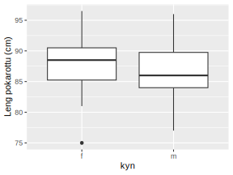
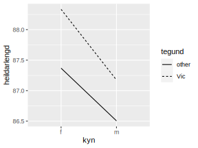

.. _c.fervikagreining:

Einþátta fervikagreining
========================

Einþátta fervikagreiningu notum við til að álykta hvort meðaltöl tveggja
eða fleiri hópa séu mismunandi. Við munum sýna hvernig má gera það með
``aov()`` og ``anova()`` skipununum. Einþátta fervikagreiningu má einnig
stilla upp sem línulegu líkani og leggja þannig grunnin að fjölþátta
fervikagreiningu. Eins og við munum sjá í kafla :numref:`%s <c.linulegtadhvarf>`
má smíða línuleg líkön með ``lm()`` aðferðinni en þá aðferð munum við
einnig nota um línulega aðhvarfsgreiningu í sama kafla.

Gera þarf ráð fyrir að dreifnin í hópunum sem bornir eru saman sé sú
sama og því skal ávallt skoða gögnin vel áður en fervikagreining er
framkvæmd og mögulega framkvæma tilgátupróf fyrir dreifni eins og lýst
var í kafla :numref:`%s <s.dreifni>`.

Ályktanir um tvö eða fleiri meðaltöl
------------------------------------

Ályktanir um tvö eða fleiri meðaltöl
~~~~~~~~~~~~~~~~~~~~~~~~~~~~~~~~~~~~

Hér á eftir gerum við ráð fyrir því að gögnin séu á löngu sniði (sjá
kafla :numref:`%s <s.umrodun>`). Önnur breytan er talnabreyta sem inniheldur
mælingarnar á viðfangsefnunum, hin breytan er flokkabreyta sem segir til
um það hvaða hópi hver mæling tilheyrir. Við skulum gera ráð fyrir að
fyrri breytan heiti ``maeling`` en hin ``hopur``.

aov()
^^^^^

.. attention::

    **Inntak:** nöfn á talnabreytu og flokkabreytu
    
    **Úttak:** fervikagreiningarhlutur

--------------

Þegar framkvæma á fervikagreiningu með ``aov()`` er skynsamlegt að vista
úttakið í hlut því eins og við sjáum hér að neðan er ýmislegt að finna í
úttakinu. Hér vistum við það undir nafninu *fervik*.

::

   fervik <- aov(maeling ~ hopur)

Það er mjög mikilvægt að breytan ``hopur`` sé skilgreind sem
flokkabreyta (ef hún er það ekki þarf að nota ``factor()`` aðferðina til
að breyta henni).

anova()
^^^^^^^

.. attention::

    **Inntak:** nafn á fervikagreiningarhlut
    
    **Úttak:** gildi á prófstærð, p-gildi, öryggisbil og fleira

    **Forkröfur prófs:** Dreifni sú sama

--------------

Til að fá fervikagreiningartöflu mötum við ``anova()`` aðferðina með
fervikagreiningarhlut:

::

   anova(fervik)

Snúum okkut nú að gagnasafninu ``pokarotta``. Sem inniheldur allskyns mælingar á pokarottum.
Í gagnasettinu eru meðal annars breyturnar: aldur, kyn, lengd dýrs og hvaðan dýrið kemur.
Könnum hvort munur sé á stærð pokarotta eftir kyni. Við reiknum meðallengd pokadýra
eftir kyni eins og gert í kafla :numref:`%s <s.adrargagnlegar>`. Nú getum við kannað með 
fervikagreiningu hvort munur sé á meðallend pokarotta eftir kyni. Byrjum á því að skoða 
kassarit af lengdarmælingum eftir kyni: 

::

   gogn <- na.omit(pokarotta) # sleppum NA gildum
   ggplot(data=gogn,aes(kyn, heildarlengd))+geom_boxplot() +
   xlab("kyn") + ylab("Lengd pokarotta (cm)")

Eins og sjá má myndinni virðist dreifni í hópunum vera nokkuð jöfn.
Því næst framkvæmum við Bartlett prófið fyrir dreifnina:

::

   bartlett.test(heildarlengd ~ kyn, data = pokarotta)
   ##
   ##  Bartlett test of homogeneity of variances
   ##
   ## data:  total_l by kyn
   ## Bartlett's K-squared = 0.06666, df = 1, p-value = 0.7963

Eins og sjá má er p-gildið = 0.7963 og getum því ekki hafnað
núlltilgátunni um að dreifnin sé sú sama. Við verðum þó að gæta okkur á
að hátt p-gildi þýðir ekki að við höfum sýnt fram á að dreifnin sé sú
sama til þess þyrfti að kanna styrk prófsins (við samþykkjum jú ekki
núlltilgátur). Í þessu tilviki er fjöldi mælinga hár og styrkur prófsins
því væntanlega sæmilegur. Við getum því litið á þetta háa p-gildi sem
vísbendingu um það að dreifnin í hópunum sé ekki misjöfn.

Við framkvæmum fervikagreiningu með eftirfarandi skipunum:

::

   fervik <- aov(heildarlengd ~ kyn, data = pokarotta)

Takið eftir að við tilgreinum fyrst nöfnin á breytunum og svo nafnið á
gagnatöflunni. Til að fá fervikasummutöfluna notum við ``anova()``
aðferðina.

::

   anova(fervik)
   ## Analysis of Variance Table
   ##
   ## Response: heildarlengd
   ##               Df  Sum Sq   Mean Sq  F value    Pr(>F)
   ## likamsraektf   1  49.12    49.116    2.6867     0.1043 ***
   ## Residuals    102  1864.71  18.281
   ## ---
   ## Signif. codes:  0 '***' 0.001 '**' 0.01 '*' 0.05 '.' 0.1 ' ' 1

Hér sjáum við SSTr = 49.12 og SSE = 1864.71 ásamt viðeigandi frígráðum (1
og 102).

Það er einnig búið að reikna meðalfervikasummurnar (49.116 og 18.281) og
finna hlutfall þeirra, sem er einmitt F-prófstærðin (2.68671). p-gildi
fyrir tilgátuprófið er svo lengst til hægri
(:math:`0.1043`). Eins og sjá má er ýmislegt annað að finna
í ``aov()`` úttakinu:

::

   names(fervik)
   ##  [1] "coefficients"  "residuals"     "effects"       "rank"
   ##  [5] "fitted.values" "assign"        "qr"            "df.residual"
   ##  [9] "na.action"     "contrasts"     "xlevels"       "call"
   ## [13] "terms"         "model"

Viljum við t.d. nálgast leifarnar gerum við það með:

::

   fervik$residuals

Eftiráprófanir
--------------

Eftiráprófanir
~~~~~~~~~~~~~~

Ef núlltilgátunni er hafnað í einþátta fervikagreiningu drögum við þá
ályktun að a.m.k. eitt meðaltal er frábrugðið hinum meðaltölunum. Ef við
viljum að lokum draga ályktanir um það hvaða meðaltöl eru frábrugðin
þurfum við að nota svo kölluð eftirápróf. Tukeys próf er eitt dæmi um
slíkt próf.

TukeyHSD()
^^^^^^^^^^

.. attention::

    **Inntak:** nafn á fervikagreiningarhlut
    
    **Úttak:** p-gildi, öryggisbil og fl.

--------------

Til að framkvæma prófið í R notum við skipunina ``TukeyHSD()`` og mötum
hana með fervikagreiningarhlut.

::

   TukeyHSD(fervik)
   ##   Tukey multiple comparisons of means
   ##     95% family-wise confidence level
   ##
   ## Fit: aov(formula = heildarlengd ~ kyn, data = pokarotta)
   ##
   ## $sex
   ##                     diff         lwr        upr     p adj
   ## m-f            -1.395501   -3.084208   0.2932054   0.104272

Það má líka skoð niðurstöðuna myndrænt með:

::

   plot(TukeyHSD(fervik))

.. figure:: myndir/mynd9_2.svg

Stikalaus próf\ :math:`^\ast`
-----------------------------

Stikalaus próf\ :math:`^\ast`
~~~~~~~~~~~~~~~~~~~~~~~~~~~~~

Ef skilyrði þess að hægt sé að framkvæma fervikagreiningu eru ekki
uppfyllt er í sumum tilvikum hægt að nota stikalaus próf þess í stað
(það er algengur misskilningur að það sé ávalt hægt að nota stikalaus
próf en svo er ekki). Algengasta stikalausa prófið er Kruskal Wallis
prófið sem hægt er framkvæma með skipuninni ``kruskal.test()``.

kruskal.test()
^^^^^^^^^^^^^^

.. attention::

    **Inntak:** nafn á talnabreytu og nafn á flokkabreytu
    
    **Úttak:** gildi á prófstærð, p-gildi

--------------

Aðferðin er mötuð á sama hátt og ``aov()`` aðferðin hér að ofan.

.. _s.aovfleiribreytur:

Fleiri en tveir þættir\ :math:`^\ast`
-------------------------------------

Hægt er að framkvæma fervikagreiningu með fleiri en einum þátt. Það er
margt sem þarf að gæta að, s.s. misjafn fjöldi mælinga í hópunum
(e. unbalanced design), *gruggun* (e. confounding) og margt fleira. Við
munum ekki taka á því hér, aðeins sýna hvaða tæki og tól eru til staðar.

Skoðum aftur dæmið hér að ofan þar sem kannað var hvort lengd pokarotta 
væri mismunandi eftir kyni. Hugsum okkur svo að þessi tilraun hafi einnig
verið framkvæmd til að kanna hvort munur væri á uppruna dýra í þessu 
tilliti. Við höfum nú tvo þætti, kyn og uppruna og notum því tveggja 
þátta fervikagreiningu til að kanna tengslin.

Til að kanna hvort kyn hafi misjöfn áhrif á stærð dýra eftir uppruna 
þurfum við að kanna hvort *víxlhrif* (e. interactions) séu til staðar á 
milli breytanna tveggja. Gott er að byrja á því að skoða gögnin myndrænt
til að kanna hvort víxlhrif séu til staðar. Við gerum það í R með
*víxlhrifamynd*. Við búum til víxlhrifamynd með ``stat_summary``
aðferðinni úr ``ggplot2``. Hún er viðkvæm fyrir vöntun mælinga á
flokkabreytum og búum við því til gagnasafn þar sem ekki vantar neinar
mælingar.

::

   puls.na<-na.omit(pokarotta)
   ggplot(puls.na,aes(kyn, heildarlengd, lty=tegund))+
   stat_summary(aes(group=tegund),fun.y=mean,geo='line')

Á myndinni sjáum við meðallengd pokarotta eftir uppruna dýra (kvenkyns 
pokarottur frá Victoria, karlkyns pokarottur frá Victoria, o.s.frv.). 
Við sjáum að kvenkyns pokarottur eru almennt stærri en karlkyns pokarottur, 
óháð því hvaðan dýrin koma.

Við metum svo líkanið með ``aov()`` aðferðinni. Séu víxlhrif til staðar
prófum við ekki hina þættina í líkaninu. Ef engin víxlhrif eru til
staðar þá fjarlægjum við víxlhrifin úr líkaninu, metum það upp á nýtt og
prófum hina þættina tvo.

::

   fervik.2<-aov(heildarlengd~kyn + tegund + kyn:tegund, data=pokarotta)
   anova(fervik.2)
   ## Analysis of Variance Table
   ##
   ## Response: total_l
   ##             Df    Sum Sq  Mean Sq  F value  Pr(>F)
   ## kyn          1    49.12   49.116   2.6480   0.1068 ***
   ## tegund       1    4.45    4.452    0.2400   0.62535 *
   ## kyn:tegund   1    5.43    5.426    0.2925   0.5898
   ## Residuals    100  1854.4  18.648  
   ## ---
   ## Signif. codes:  0 '***' 0.001 '**' 0.01 '*' 0.05 '.' 0.1 ' ' 1

Við notum svo ``anova()`` aðferðina til að fá fervikasummurnar, p-gildi
og prófstærð.

Úr úttakinu má lesa að p-gildið fyrir víxlhrifin er 0.5898 og höfum við
því ekki sýnt fram á að munur sé á áhrif stærð pokarottna eftir uppruna. Við
fjarlægjum því víxlhrifin úr líkaninu og metum það upp á nýtt.

::

   fervik.3<-aov(heildarlengd~kyn + tegund, data=pokarotta)
   anova(fervik.3)
   ## Analysis of Variance Table
   ##
   ## Response: heildarlengd
   ##               Df  Sum Sq   Mean Sq  F value    Pr(>F)
   ## kyn            1  49.12    49.116   2.6667     0.1056
   ## tegund         1  4.45     4.452    0.2417     0.6240 
   ## Residuals    101  1860.26  18.418
   ## ---
   ## Signif. codes:  0 '***' 0.001 '**' 0.01 '*' 0.05 '.' 0.1 ' ' 1

Takið eftir að ``anova()`` aðferðin skilar okkur fervikasummum af gerð I
(type I SS). ``drop1()`` skipunin skilar okkur fervikasummum af gerð III
(type III SS) og í ``car`` pakkanum má finna aðferðina ``Anova()`` en
með henni er hægt að fá fervikasummur af gerð II. Skoðum nú úttakið úr
``drop1()`` aðferðinni:

::

   drop1(fervik.3, test="F")
   ## Single term deletions
   ##
   ## Model:
   ## heildarlengd ~ kyn + tegund
   ##              Df  Sum of Sq   RSS     AIC      F value  Pr(>F)
   ## <none>                       1860.3  305.94
   ## kyn          1   41.725      1902.0  306.25   2.2654   0.1354 
   ## tegund       1   4.452       1864.7  304.19   0.2417   0.6340 
   ## ---
   ## Signif. codes:  0 '***' 0.001 '**' 0.01 '*' 0.05 '.' 0.1 ' ' 1

Sjá má á úttakinu að báðar breyturnar eru ekki marktækar. Hér höfum við því ekki 
sýnt fram á að marktækur munur sé á meðalstærð dýra eftir kyni eftir að búið 
er að leiðrétta fyrir breytunni ``pop``.

Eins og sagt var frá í upphafi þessa hluta er margt sem þarf að hafa í
huga þegar fjölþátta aðhvarfsgreining er framkvæmd. Hvernig á að velja
skýribreytur í líkaninu er stór þáttur og langt frá því að vera ein rétt
leið að því markmiði. Hér að ofan byrjuðum við með stærsta líkanið og
fjarlægðum svo eina breytu í einu (e. backward selection). Það má einnig
byrja með minnsta líkanið og bæta við einni breytu í einu (e. forward
selection) en hægt er að nota ``add1()`` aðferðina til þess. Að auki
eru til skref fyrir skref aðferðir (e. stepwise methods) en nota má fallið
``step()`` til þess.

Leiksvæði fyrir R kóða
----------------------

Hér fyrir neðan er hægt að skrifa R kóða og keyra hann. Notið þetta svæði til að prófa ykkur áfram með skipanir kaflans. Athugið að við höfum þegar sett inn skipun til að lesa inn ``puls`` gögnin sem eru notuð gegnum alla bókina.

.. datacamp::
    :lang: r

    # Gogn sott og sett i breytuna puls.
    puls <- read.table ("https://raw.githubusercontent.com/edbook/haskoli-islands/main/pulsAll.csv", header=TRUE, sep=";")

    # Setjid ykkar eigin koda her fyrir nedan:
    # Sem daemi, skipunin head(puls) skilar fyrstu nokkrar radirnar i gognunum
    # asamt dalkarheitum.
    head(puls)
