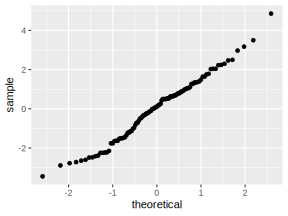

.. _c.linulegtadhvarf:

Línuleg aðhvarfsgreining
========================

Aðhvarfsgreining er notuð til að kanna samband milli einnar samfelldrar
svarbreytu og einnar eða fleiri skýribreyta sem geta hvort sem heldur
verið samfelldar eða strjálar. Í einfaldasta tilvikinu er eingöngu ein
samfelld skýribreyta og er þá talað um einfalt línulegt aðhvarf. Því
tilviki helgum við meginhluta kaflans en útfærslur með strjálli
skýribreytu sem og fleiri en einni skýribreytu eru ræddar undir lok
hans.

Í kafla :numref:`%s <s.likanmetid>` kynnum við skipunina ``lm()`` sem metur
einfalt línulegt aðhvarf og skoðum úttak hennar með ``summary()``. Þar
næst, í kafla :numref:`%s <s.lmoryggis>`, skoðum við hvernig skipunin
``confint()`` gefur okkur öryggisbil fyrir stuðla líkansins. Í kafla
:numref:`%s <s.lmleifar>` könnum við mátgæði líkansins með fallinu ``resid()``
og í kafla :numref:`%s <s.lmspa>` sjáum við hvernig framkvæma má spár með
fallinu ``predict()``. Að lokum fjallar kafli :numref:`%s <s.onnurprof>` um
hvernig framkvæma má tilgátupróf fyrir fylgnistuðul með ``cor.test()``.

.. _s.likanmetid:

Línulegt líkan smíðað
---------------------

Línulegt líkan smíðað
~~~~~~~~~~~~~~~~~~~~~

lm()
^^^^

.. attention::

    **Inntak:** formúlan sem við viljum meta, gögnin sem við byggjum á
    
    **Úttak:** metnir stuðlar, p-gildi, skýringarhlutfall ofl.

--------------

Einfalt línulegt aðhvarfsgreiningarlíkan er líkan á forminu:

.. math:: y = \beta_0 + \beta_1 x

Aðferðin ``lm()`` metur gildi stikanna :math:`\beta_0` og
:math:`\beta_1` ásamt ýmiss annars. Hún er mötuð með tvennu:

-  Formúlu með heitum breytanna sem lýsir sambandinu sem við viljum
   meta. Svarbreytan er vinstra megin við :math:`\sim` merkið, en hægra
   megin koma skýribreyturnar.

-  Gagnatöflunni sem geymir gögnin.

Munum að gildi á skýribreytu hefur áhrif á hvaða gildi svarbreyta mun taka, 
þ.e. svarbreytan er alltaf háða breytan og skýribreytan sú óháða.  Eins og 
til dæmis er hæð skýribreyta og þyngd svarbreyta. Magn áfengis í blóði er 
svarbreyta en fjöldi áfengra drykkja er skýribreyta.  

Þegar aðhvarfsgreining er framkvæmd margborgar sig að búa til hlut sem
inniheldur allt það sem hún skilar. Metum nú stuðla í líknai sem lýsir 
því hvaða áhrif lengd á skotti hefur á heildarlengd pokarottu og vistum
líknaið undir nafninu ``lm1``. Þar sem við metum áhrif lengd á skotti á 
heildarlengd pokarottu. Hér er svarbreytan ``tail_l`` og ``total_l`` 
skýribreytan.

::

   lm1<-lm(tail_l~total_l,data=possum)
   names(lm1)
   ##  [1] "coefficients"  "residuals"     "effects"       "rank"
   ##  [5] "fitted.values" "assign"        "qr"            "df.residual"
   ##  [9] "na.action"     "xlevels"       "call"          "terms"
   ## [13] "model"

Eins og þið sjáið eru þarna heilmargt að finna. Þar við bætist að
skipunina ``summary()`` má, líkt og svo oft áður, mata með
aðhvarfsgreiningarhlutnum ``lm1`` til að fá ýmsar upplýsingar:

::

   summary(lm1)
   ##
   ## Call:
   ## lm(formula = tail_l ~ total_l, data = possum)
   ##
   ## Residuals:
   ##     Min      1Q  Median      3Q     Max
   ## -3.4441  -1.2476  0.1131   1.0238  4.8560
   ##
   ## Coefficients:
   ##               Estimate Std. Error t value Pr(>|t|)
   ## (Intercept)    14.61613    3.23648  4.516   1.7e-05 ***
   ## haed           0.25713    0.03712   6.927   3.94e-10 ***
   ## ---
   ## Signif. codes:  0 '***' 0.001 '**' 0.01 '*' 0.05 '.' 0.1 ' ' 1
   ##
   ## Residual standard error: 1.624 on 102 degrees of freedom
   ## Multiple R-squared:  0.32, Adjusted R-squared:  0.3133
   ## F-statistic: 47.99 on 1 and 102 DF,  p-value:  3.935e-10

Ýmislegt má lesa út úr úttakinu. Þar ber helst að:

-  Matið á skurðpunktinum (:math:`b_0`) er 14.61613

-  Matið á hallatölunni (:math:`b_1`) er 0.25713.

-  Prófstærðin t = 4.516 kannar tilgátuprófið hvort :math:`\beta_0 = 0`.

-  Prófstærðin t = 6.927 kannar tilgátuprófið hvort :math:`\beta_1 = 0`.

-  Skýringarhlutfallið er :math:`R^2` = 0.3133.

-  Matið á :math:`\sigma` er :math:`s_e =` 1.624.

.. _s.lmoryggis:

Öryggisbil fyrir stuðla líkansins
---------------------------------

Öryggisbil fyrir stuðla líkansins
~~~~~~~~~~~~~~~~~~~~~~~~~~~~~~~~~

confint()
^^^^^^^^^

.. attention::

    **Inntak:** metið líkan
    
    **Úttak:** öryggisbil fyrir stuðla líkansins
    
    **Helstu stillingar:** level

--------------

Öryggisbil fyrir :math:`\beta_0` og :math:`\beta_1` má finna með
skipuninni ``confint()``. Hún er mötuð með aðhvarfsgreiningarhlutnum sem
við bjuggum til en skilar öryggisbili fyrir hvorn stuðul fyrir sig. Með
stillingunni ``level`` má tilgreina hvert öryggi bilsins er. Sjálfgefið
er að það sé 95%.

::

   confint(lm1)
   ##                    2.5 %      97.5 %
   ## (Intercept)       8.1965963   21.0356650
   ## total_l           0.1835114   0.3307585

Hér sést að:

-  Öryggisbil fyrir :math:`\beta_0` er :math:`[8.1965963, 21.0356650]`.

-  Öryggisbil fyrir :math:`\beta_1` er :math:`[0.1835114, 0.3307585]`.

.. _s.lmleifar:

Mátgæði líkansins könnuð
------------------------

Forsenda aðhvarfsgreiningar er að leifar hennar séu óháðar og
normaldreifðar, með sömu dreifni. Leifarnar má nálgast með:

::

   lm1$resid
   ##             1             2             4              5     
   ##  -1.501138677  -1.643975982  -0.172515669   -0.272543443   
   ##             6             7             8              9
   ##  -2.386841060  -1.629706138  -1.015408521   -1.143975982
   ##            10            11            12             13  
   ##  -0.129706138   1.370293862  -2.772543443   -1.629706138
   ....

Gott er að teikna normaldreifingarrit af leifunum. Takið eftir því að
hér mötum við skipunina ``ggplot()`` með aðhvarfsgreiningarhlutnum
``lm1``, en ekki gagnatöflunni ``puls``.

::

   ggplot(data=lm1, aes(sample=.resid)) + stat_qq()

.. _s.lmspa:

Spágildi og spábil
------------------

Spágildi og spábil
~~~~~~~~~~~~~~~~~~

predict()
^^^^^^^^^

.. attention::

    **Inntak:** metið líkan, gagnatafla með gildum skýribreytanna sem á að
    spá fyrir með
    
    **Úttak:** spá og spábil
    
    **Helstu stillingar:** level

--------------

Við getum spáð fyrir gildi á svarbreytunni fyrir ákveðið gildi á
skýribreytunni með aðferðinni ``predict()``. Mata þarf aðferðina með
nafninu á aðhvarfsgreiningarhlutnum, nafninu á skýribreytunni og
gagnatöflu sem inniheldur þau gildi á skýribreytunni sem við viljum fá
spá fyrir. Hér fyrir neðan reiknum við spá fyrir leng skotts á 90 cm 
langri pokarottu:

::

   predict(lm1,newdata=data.frame(total_l=90))
   ##        1
   ## 37.75827

Aðferðina má einnig nota til að fá spábil:

::

   predict(lm1,interval="prediction",newdata=data.frame(total_l=90))
   ##        fit      lwr         upr
   ## 1 37.75827  34.5149   41.00164

.. _s.onnurprof:

Próf á fylgnistuðli
-------------------

Tilgátupróf fyrir :math:`\rho` má framkvæma með ``cor.test()``
aðferðinni. Við þurfum að mata aðferðina með heitunum á breytunum sem
við ætlum að kanna fylgnina á milli. Viljum við kanna fylgnina á milli
breytanna ``tail_l`` og ``total_l`` notum við skipunina:

::

   cor.test(possum$tail_l,possum$total_l)
   ##
   ##  Pearson's product-moment correlation
   ##
   ## data:  possum$tail_l and possum$total_l
   ## t = 6.9275, df = 102, p-value = 3.935e-10
   ## alternative hypothesis: true correlation is not equal to 0
   ## 95 percent confidence interval:
   ##   0.4186653 0.6837485
   ## sample estimates:
   ##       cor
   ## 0.5656455 

Takið eftir að prófstærðin er t = 6.9275 sem er nákvæmlega það sama og
þegar við prófuðum núlltilgátuna :math:`H_0: \beta_1=0`.

.. _s.lmstrjal:

Strjál skýribreyta
------------------

Í kafla :numref:`%s <c.fervikagreining>` fjölluðum við um einþátta
fervikagreiningu en líta má á fervikagreiningu sem sértilfelli af
aðhvarfsgreiningu þegar skýribreyta er strjál. Einþátta fervikagreiningu
má skrifa sem línulegt líkan á eftirfarandi hátt:

.. math:: y_{ij}  = \mu + \tau_i  + \varepsilon_{ij}

þar sem :math:`i = 1,2,...,a` og :math:`j = 1,2,...,n`. Hér gerum við
ráð fyrir að við höfum jafn margar mælingar í hverjum flokki/hópi
(:math:`n`).

-  :math:`y_{ij}` er mæling nr. :math:`j` í hópi/flokki nr. :math:`i`.

-  :math:`\mu` er heildarmeðaltalið.

-  :math:`\tau_i` er frávik flokks nr. :math:`i` frá heildarmeðaltalinu :math:`\mu`.

-  :math:`\varepsilon_{ij}` eru frávik mælingar nr. :math:`j` frá
   gildinu :math:`\mu + \tau_i` sem henni tilheyrir, við köllum
   :math:`\varepsilon_{ij}` *leifar* (e. residuals).

Við sáum í kafla :numref:`%s <c.fervikagreining>` að nota má ``aov()`` aðferðina
og ``anova()`` aðferðirnar til að fá fervikagreiningartöfluna. Í stað
``aov()`` aðferðarinnar má nota ``lm()`` aðferðina líkt og við gerðum
hér að ofan fyrir línulegu aðhvarfsgreininguna. Skoðum aftur samband
``total_l`` og ``sex`` en notum nú ``lm()`` aðferðina:

::

   lm.possum <- lm(total_l ~ sex, data = possum)

Við getum fengið fervikasummutöfluna á sama hátt og áður með ``anova()``
aðferðinni:

::

   anova(lm.possum)
   ## Analysis of Variance Table
   ##
   ## Response: total_l
   ##               Df  Sum Sq  Mean Sq   F value   Pr(>F)
   ## sex            1  49.12   49.116    2.6867    0.1043
   ## Residuals    102 1864.71  18.281
   ## ---
   ## Signif. codes:  0 '***' 0.001 '**' 0.01 '*' 0.05 '.' 0.1 ' ' 1

en við getum einnig fengið möt á stikum líkansins með ``summary()``
aðferðinni:

::

   summary(lm.possum)
   ##
   ## Call:
   ## lm(formula = total_l ~ sex, data = possum)
   ##
   ## Residuals:
   ##     Min      1Q  Median      3Q     Max
   ## -12.907  -2.511   0.093   2.989   9.489 
   ##
   ## Coefficients:
   ##                      Estimate Std. Error   t value   Pr(>|t|)
   ## (Intercept)            87.9070     0.6520  134.819  <2e-16 ***
   ## sexm                   -1.3955     0.8514  -1.639    0.104
   ## ---
   ## Signif. codes:  0 '***' 0.001 '**' 0.01 '*' 0.05 '.' 0.1 ' ' 1
   ##
   ## Residual standard error: 4.276 on 102 degrees of freedom
   ##   (22 observations deleted due to missingness)
   ## Multiple R-squared:  0.02566,    Adjusted R-squared:  0.01611
   ## F-statistic: 2.687 on 1 and 102 DF,  p-value: 0.1043

Hægt er að stilla hvaða *samanburðarstuðla* (e. contrasts) eru notaðir en
sjálfgegna stillingin er að nota svo kallaða *contr.treatment* en þá er
lægsti flokkur flokkabreytu valinn sem viðmiðunarflokkur. Í einþátta
fervikagreiningu má lesa matið fyrir viðmiðunarflokkinn úr
``(Intercept)`` línunni og finna svo matið fyrir hina flokkana með að
leggja gildið á viðkomandi stika við matið fyrir viðmiðunarflokkinn.

Í dæminu hér að ofan má því lesa eftirfarandi:

- Matið á lengd kvenkyns pokarottu er 87.9070.

- Matið á lengd karlkyns pokarottu er 87.9070 + (-1.3955) = 86.5115.

.. _s.lmfleiribreytur:

Fleiri skýribreytur\ :math:`^\ast`
----------------------------------

Eins og fjallað var um í hluta :numref:`%s <s.aovfleiribreytur>` má mata
``aov()`` aðferðina með fleiri en einum þætti. Sömu sögu er að segja um
``lm()`` aðferðina. Mötum við hana með fleiri en einni samfelldri breytu
smíðum við fjölvítt aðhvarfsgreiningrlíkan, með fleiri en einni
flokkabreytu smíðum við fjölþátta fervikagreiningarlíkan en ef
skýribreyturnar eru sambland af samfeldum breytum og flokkabreytur
smíðum við samvikagreiningarlíkan (ANCOVA). Það er gríðarlega margt sem
hafa þarf í huga þegar líkön af þessum gerðum eru smíðuð og verður ekki
farið í það nánar hér en líkt og greint var frá í kafla
:numref:`%s <s.aovfleiribreytur>` geta ``add1()``, ``drop1()`` og ``step()``
aðferðirnar komið að góðum notum þegar velja á skýribreytur í líkanið.

Leiksvæði fyrir R kóða
----------------------

Hér fyrir neðan er hægt að skrifa R kóða og keyra hann. Notið þetta svæði til að prófa ykkur áfram með skipanir kaflans. Athugið að við höfum þegar sett inn skipun til að lesa inn ``puls`` gögnin sem eru notuð gegnum alla bókina.

.. datacamp::
    :lang: r

    # Gogn sott og sett i breytuna puls.
    puls <- read.table ("https://raw.githubusercontent.com/edbook/haskoli-islands/main/pulsAll.csv", header=TRUE, sep=";")

    # Setjid ykkar eigin koda her fyrir nedan:
    # Sem daemi, skipunin head(puls) skilar fyrstu nokkrar radirnar i gognunum
    # asamt dalkarheitum.
    head(puls)
