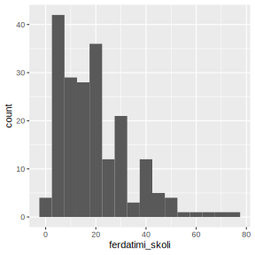
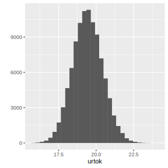
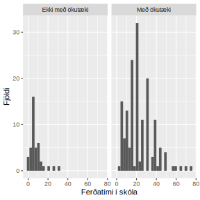
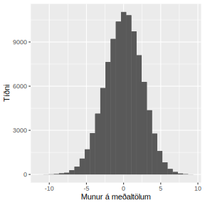

.. _c.endurvalsadferdir:

Endurvalsaðferðir
==================

Eins og var minnst á í fyrri köflum þá er hægt
að nota aðrar aðferðir til að reikna prófstærðir og öryggisbil
þegar forkröfur tilgátuprófa eru ekki uppfyllt. Hingað til hafið 
þið séð hvernig má reikna öryggisbil fyrir ýmsar lýsistærðir. 
Allar þær aðferðir gera ráð fyrir ákveðnum forsendum um líkindadreifingu
slembistærðarinnar sem lýsistærðin er reiknuð út frá. Í þessum kafla lærið þið 
öfluga og gífurlega mikið notaða aðferð sem hægt er að nota þegar þessar 
forsendur eru ekki til staðar.

Endurvalsaðferð (e. Bootstrap method)
--------------------------------------

Endurvalsaðferð er stikalaus aðferð til að meta úrtaksdreifingu lýsistærðar.
Það að hún sé stikalaus þýðir að hún gerir engar forsendur um 
líkindadreifingu breytunnar sjálfrar. Endurvalsaðferðin var fyrst lögð til af
Bradley Efron árið 1970. Hún byggist á að velja ný endurvalsúrtök úr úrtakinu 
sem við höfum í höndunum.

Öryggisbil reiknuð með endurvalsaðferð:
~~~~~~~~~~~~~~~~~~~~~~~~~~~~~~~~~~~~~~~

**1.**  Hermið endurvalsúrtök af breytunni ykkar, af sömu stærð og fjöldi
mælinganna sem þið hafið en með *ísetningu* það er það má 
velja sama gildið endurtekið.

**2.**  Reiknið mat á lýsistærðinni fyrir nýja úrtakið.

**3.**  Endurtakið lið 1 og 2 mjög oft t.d. 100.000 sinnum.

**4.**  Skoðið á hvaða bili 95% mælinganna lentu. Þetta bil er öryggisbilið ykkar!

Eftirfarandi R kóði er dæmi um hvernig þið getið notað endurvalsaðferðina til að 
reikna 95% öryggisbil.

::

   tmp <- replicate(100000, lýsistærð(sample(gogn$breyta=='gildi', replace=T), na.rm=T))
   quantile(tmp, c(0.025, 0.0975))

Sýnidæmi
^^^^^^^^^^

Skoðum hvernig við getum fundið öryggisbil fyrir meðaltal reiknað með endurvalsaðferð.
Veljum breytunna ``ferdatimi_skoli`` úr ``dat`` gagnasafninu. 
Byrjum að teikna viðeigandi mynd af breytunni.

::

   ggplot(dat, aes(ferdatimi_skoli))+geom_histogram(binwidth=5)

Næst skulum við herma endurvalsúrtök af breytunni ``ferdatimi_skoli`` fyrir meðaltalið 100.000 sinnum.

::

   urtok <- replicate(100000, mean(sample(dat$ferdatimi_skoli, replace=T), na.rm=T))

Teiknum mynd af urtokunum:

:: 

   qplot(urtok)+geom_histogram()

Sjáum að dreifingin lýkist normaldreifingu.... Lögmál mikils fjölda ... 

Reiknum svo loks öryggisbilið

::

   quantile(urtok, c(0.025, 0.975))
   ## 
   ## 2.5%        97.5%
   ## 17.52239    21.40796

Svo öryggisbilið okkar er :math:`[17.52239, 21.40796]`.

Endurvalsaðferð er einstaklega öflug aðferð til að reikna öryggisbil. 
Aðferðin er sérlega notadrjúg þegar forsendur fyrir klassískum 
aðferðum eru fjarri því að vera uppfylltar. Hinsvegar ef 
forsendurnar standast, þá eru öryggisbil reiknuð með 
endurvalsaðferð víðari en öryggisbil reiknað með klassískum 
tilgátuprófum. Í þeim tilfellum þar sem forkröfur tilgátuprófa
eru uppfylltar skal frekar nota tilgátupróf til að reikna öryggisbil
heldur en endurvalsaðferð.

Umraðanapróf (e. Permutation test)
-----------------------------------

Umraðanapróf eru eins og endurvalsaðferð, stikalaus aðferð til að framkvæma tilgátupróf.
Umraðanapróf eru notuð til að draga ályktanir um úrtaksdreifingu 
lýsistærðar. Þau byggja á eins og nafnið gefur til kynna að umraða
slembið mælingunum sem við höfum og rjúfa þannig samband breytanna sem við erum að skoða.
Lýsistærðin sem við höfum áhuga á að skoða er reiknuð í þessu tilviki
þegar samband breytanna er ekkert. Þetta er endurtekið oft til að fá mat á því 
hver úrtaksdreifingin væri ef núlltilgátan :math:`H_0` væri sönn. Þ.e. við höfnum 
ekki núltilgátunni og afsönnum gagntilgátuna.

Umraðanapróf má nota í nánast hvaða tilvikum sem er til að smíða tilgátupróf án þess að gera
forsendur um líkindadreifingu undirliggjandi breytu. Það má aðlaga þau til að koma í stað 
þeirra klassísku tilgátuprófa sem við höfum séð hingað til. Ef forsendur tilgátuprófa 
standast skal þó frekar nota þau því þá hafa umraðanapróf minna afl en klassísku tilgátuprófin. 

Núlltilgátan (:math:`H_0`) okkar er sú að það sé enginn munur á lýsistærðinni milli hópanna. 
Gagntilgátan (:math:`H_1`) er sú að lýsistærðin sé frábrugðin milli hópa. 

Í þessu námskeiði skoðum við einungis umraðanapróf þegar við erum með eina lýsistærð 
sem við ætlum að bera saman í tveimur hópum.

Tilgátupróf fyrir mismun tveggja lýsistærða reiknað með endurvalsaðferð:
~~~~~~~~~~~~~~~~~~~~~~~~~~~~~~~~~~~~~~~~~~~~~~~~~~~~~~~~~~~~~~~~~~~~~~~~~

*Höfum talnabreytu A og flokkbreytu B (sem hefur aðeins tvo flokka) sem segir til um 
hvorum hópi hver mæling tilheyrir.*

**1.**  Reiknið mismun lýsistærðanna í hópunm tveimur. 
Þessi mismunurinn er prófstærðin ykkar!

**2.**  Búið til nýja breytu B*, sem er handahófskennd umröðun á gildunum
í breytu B. Passið að umraða ekki breytu A í leiðinni! Með því að umraða gildunum rjúfum við 
sambandið milli breytanna tveggja, þ.e. líkjum eftir þegar tilvikinu þegar núlltilgátan er sönn.

**3.**  Reiknið mismuninn á lýsistærðinni miðað við hópaskiptinguna í breyu B*.
(Þannig reiknum við eina útkomu á prófstærðinni í því tilviki þegar núlltilgátan er sönn)

**4.**  Endurtakið lið 1 og 2 mjög oft, t.d. 100.000 sinnum.

**5.**  Skoðið á hvaða bili 95% mælinganna á mismuninum lentu. Það sem er utan þess bils er höfnunarsvæðið ykkar!

**6.**  Ef að mismunurinn á lýsistærðinni fyrir raunverulegu hópaskiptinguna fellur á það bil, 
þá er það gildi sennilegt og við höfnum ekki núlltilgátunni.

**7.**  Ef að mismunurinn á lýsistærðinni fyrir raunverulegu hópaskiptinguna fellur ekki á það bil, 
þá er það gildi ósennilegt og við höfnum núlltilgátunni.

Eftirfarandi kóði er dæmi um hvernig þið getið framkvæmt umraðanapróf. 
Þar sem breytunar A og B eru samkvæmt lýsingunni hér að ofan og lýsistærðin sem við ætlum 
að bera saman má vera hvaða lýsistærð sem er t.d. minnsta gildi, meðaltal, miðgildi o.s.frv.

::

   tapply(gogn$A, gogn$B, lýsistærð)
   diff(tapply(gogn$A, gogn$B, lýsistærð))
   tmp<-replicate(100000, diff(tapply(gogn$A, sample(gogn$B), lýsistærð)))
   hist(tmp)
   quantile(tmp, c(0.025, 0.975))

Sýnidæmi
^^^^^^^^^^

Höldum áfram að nota talnabreytuna ``ferdatimi_skoli`` og veljum flokkabreytuna 
``ferdamati_skoli_okutaeki`` sem við bjuggum til í kafla 2.6 sem segir til um hvort 
nemedur ferðist í skóla með ökutæki eða ekki. Byrjum að teikna graf:

:: 

   ggplot(dat, aes(x=ferdatimi_skoli)) + 
   geom_histogram() + 
   facet_grid(~ferdamati_skoli_okutaeki)+
    xlab("Ferðatími í skóla")+
    ylab("Fjöldi")

Ætlum að skoða muninn á meðaltölum eftir því hvort nemendur
ferðist með ökutæki í skóla eða ekki. Reiknum fyrst meðaltölin í hópunum.

:: 

   tapply(dat$ferdatimi_skoli, dat$ferdamati_skoli_okutaeki, mean, na.rm=T)
   ##
   ## Ekki með ökutæki     Með ökutæki
   ## 7.390244             22.512500

Reiknum mismuninn á meðaltölunum:

:: 

   diff(tapply(dat$ferdatimi_skoli, dat$ferdamati_skoli_okutaeki, mean, na.rm=T))
   ## 
   ## Með ökutæki
   ## 15.12226

Þessi tala er prófstærðin okkar. SKOÐA BETUR

Framkvæmum loks umraðanapróf:

::

   tmp <- replicate(100000, diff(tapply(dat$ferdatimi_skoli,
   sample(dat$ferdamati_skoli_okutaeki, replace=T), mean, na.rm=T)))

Teiknum

::

   qplot(tmp)+geom_histogram()+xlab("Munur á meðaltölum")+ylab("Tíðni")

Loks reyknum við öryggisbil

::

   quantile(tmp, c(0.025, 0.975))
   ##
   ## 2.5%        97.5%
   ## -5.026940   4.717172

SSKOÐA BETUR MEÐ PRÓFSTÆRÐ OG FLEIRA

