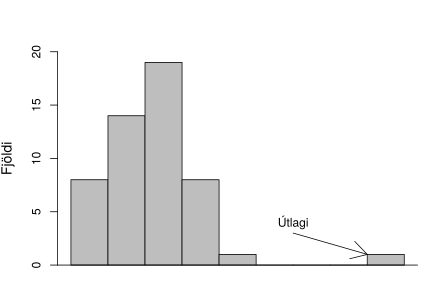
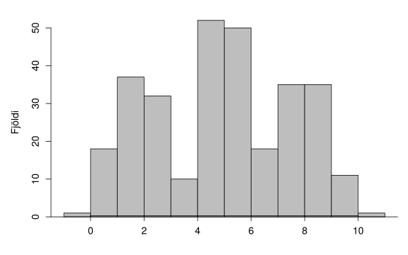

.. _c.myndraenframsetning:

Myndræn framsetning
===================

Ein mynd segir meira en þúsund orð. Þau eru vandfundin fræði þar sem
þessi setning á betur við en í tölfræði. Sama hvert markmið
rannsóknarinnar er, og hvers eðlis gögnin eru, er það nánast
ófrávíkjanleg regla að fyrsta skref í tölfræðiúrvinnslu ætti ætíð að
vera að skoða gögnin myndrænt. Í þessum kafla ætlum við að skoða
algengustu tegundir grafa sem notuð eru við myndræna framsetningu gagna.

Kjarni tölfræðiúrvinnslu er að átta sig sem best á eðli mælinganna sem
skoðaðar eru. Þar eru hugtök eins og breytileiki gagnanna lykilatriði.
Hversu mikinn mun sjáum við á útkomum viðfangsefna okkar? Hvernig
dreifast útkomurnar? Þetta köllum við einfaldlega dreifingu mælinganna
en myndræn framsetning er ein besta leiðin til að átta sig á dreifingu
mælinganna.

Í kafla :numref:`%s <s.myndraenastrjalumbreytum>` skoðum við algengustu tegundir
grafa fyrir strjálar breytur, stöplarit og kökurit. Þar á eftir, í
köflum :numref:`%s <s.myndraenasamfelldumbreytum>` og :numref:`%s <s.kassarit>`, taka
við algengustu tegundir grafa fyrir samfelldar breytur, stuðlarit og
kassarit. Að lokum fjöllum við um punktarit í kafla :numref:`%s <s.punktarit>`
en með þeim er gott að átta sig á sambandi tveggja samfelldra breyta.

.. _s.myndraenastrjalumbreytum:

Stöplarit og kökurit
--------------------

Algengustu tegundir grafa fyrir strjálar breytur eru *stöplarit* (e. bar
chart) og *kökurit* (e. pie chart). Kökurit eru mikið notuð í
viðskiptaheiminum og í fjölmiðlum en eru sjaldséð í tímaritum og bókum
um raunvísindi. Stöplarit má sjá víðsvegar og eru þau í nánast öllum
tilfellum betur til þess fallin að sýna gildi strjállar breytu myndrænt
en kökuritin. Skoðum nú hvernig búa má til stöplarit og kökurit.

.. _ss.stoplarit:

Stöplarit
~~~~~~~~~

Stöplarit er algengasta aðferðin til að sýna gildi strjállar breytu
myndrænt og á það jafnt við um flokkabreytur sem strjálar talnabreytur.
Áður en hafist er handa við að teikna stöplarit er gott að setja upp
litla töflu sem sýnir mögulegar útkomur breytunnar og hversu mörg
viðfangsefni hljóta hverja útkomu.

Stöplarit (bar chart)
^^^^^^^^^^^^^^^^^^^^^

.. attention::

    Með stöplariti teiknum við eina súlu fyrir hverja útkomu breytunnar og
    mega þær ekki liggja hvor að annarri. Hæð súlnanna sýnir tíðni eða
    hlutfall viðkomandi útkomu. Raða skal súlunum svo auðvelt sé að greina
    upplýsingarnar. Ef breytan er óröðuð flokkabreyta er súlunum oft raðað
    upp eftir stærðarröð tíðni útkomanna í hvort sem heldur vaxandi eða
    minnkandi röð. Ef breytan er röðuð flokkabreyta eða strjál talnabreyta
    er súlunum yfirleitt raðað upp í vaxandi stærðarröð útkomanna sjálfra,
    ekki tíðni þeirra.

--------------

.. _ex.erlendirgestir:

Sýnidæmi: Stöplarit
^^^^^^^^^^^^^^^^^^^

.. tip::

    Útlendingaeftirlitið annaðist talningar á erlendum gestum til og frá
    Íslandi frá árinu 1949 til ársins 2000 og náðu talningar yfir gesti með
    millilandaflugi og skipum. Ferðamálastofa hefur tekið saman þessar tölur
    og þar má meðal annars sjá að árið 2000 var heildarfjöldi erlendra gesta
    302913. Héðinn hefur mikinn áhuga á ferðamálafræði og ákvað hann að
    skoða þessar tölur nánar. Þær sjö þjóðir sem flestir gestirnir komu frá
    voru Bandaríkin með 53637 gesti, Bretland með 45106 gesti, Danmörk með
    28456 gesti, Frakkland með 14955 gesti, Noregur með 24280 gesti, Svíþjóð
    með 29488 gesti og Þýskaland með 32664 gesti. Teiknið stöplarit sem
    sýnir mismunandi þjóðerni erlendra gesta árið 2000.
    
    Breytan sem við höfum áhuga á að skoða hér er fjöldi erlendra gesta,
    flokkuð eftir þjóðerni. Tökum nú saman upplýsingarnar í litla töflu.
    
    +--------------+----------+
    | Þjóðerni     | Fjöldi   |
    +==============+==========+
    | Bandaríkin   | 53637    |
    +--------------+----------+
    | Bretland     | 45106    |
    +--------------+----------+
    | Danmörk      | 28456    |
    +--------------+----------+
    | Frakkland    | 14955    |
    +--------------+----------+
    | Noregur      | 24280    |
    +--------------+----------+
    | Svíþjóð      | 29488    |
    +--------------+----------+
    | Þýskaland    | 32664    |
    +--------------+----------+
    
    Við höfum nú val um að gera stöplarit sem sýnir þessi sjö lönd eða að
    bæta við einni súlu til viðbótar sem sýnir fjölda ferðalanga frá öðrum
    löndum en þessum sjö og mun þá stöplaritið okkar sýna heildarfjölda
    erlendra gesta árið 2000. Áður en við gerum það þurfum við að reikna út
    hversu margir gestir komu frá öðrum þjóðum en þessum sjö. Við vitum að
    heildarfjöldi gesta var 302913 og því fáum við fjölda gesta frá öðrum
    löndum með að draga fjöldann frá þessum sjö frá heildarfjöldanum.
    
    .. math::
       \begin{aligned}
       \text{Önnur lönd} &= 302913 - 53637 - 45106 - 28456 - 14955 - 24280 - 29488 - 32664 \\
       &= 74327\end{aligned}
    
    Búum nú til tvö stöplarit sem sýna skiptingu erlendra gesta eftir
    þjóðerni. Á fyrra stöplaritinu er súlunum raðað eftir stafrófsröð en á
    því seinna eftir stærðarröð. Auðveldara er að lesa úr því sem raðað er
    eftir stærðarröð.
    
    .. figure:: myndir/barplot_erlendir_gestir.svg
        :align: center
        :alt: Mynd

Við vinnum oft með gagnasöfn sem innihalda nokkrar flokkabreytur. Hægt
er að búa til stöplarit af tveimur flokkabreytum í einu með því að nota
mismunandi liti fyrir flokka annarrar flokkabreytunnar.

.. _ss.kokurit:

Kökurit
~~~~~~~

Áður en hafist er handa við að teikna kökurit er gott að gera litla
töflu sem sýnir flokka breytunnar, fjölda í hverjum flokki og hlutfall
viðfangsefna í hverjum flokki af heildinni.

Kökurit (pie chart)
^^^^^^^^^^^^^^^^^^^

.. attention::

    Þegar búa á til kökurit er mikilvægt að allir flokkar breytunnar sem
    verið er að skoða séu með á myndinni. Fjöldi sneiða í kökuritinu ræðst
    af fjölda flokka breytunnar. Stærð sneiðarinnar ræðst af hlutfallslegum
    fjölda í viðkomandi flokki af heildinni. Gætið þess að hlutföllin séu
    samanlagt 100%. Við gerum sjaldnast kökurit í höndunum heldur notum við
    tölfræðihugbúnað til verksins.

--------------

Sýnidæmi: Kökurit
^^^^^^^^^^^^^^^^^

.. tip::

    Skoðum aftur fjölda erlendra gesta árið 2000. Bætum nú við töfluna sem
    við bjuggum til í dæmi :numref:`%s <ex.erlendirgestir>` hlutfall gesta í hverjum
    flokki fyrir sig og fjölda gesta frá öðrum löndum.
    
    +--------------+----------+------------+
    | Þjóðerni     | Fjöldi   | Hlutfall   |
    +==============+==========+============+
    | Bandaríkin   | 53637    | 0.18       |
    +--------------+----------+------------+
    | Bretland     | 45106    | 0.15       |
    +--------------+----------+------------+
    | Danmörk      | 28456    | 0.09       |
    +--------------+----------+------------+
    | Frakkland    | 14955    | 0.05       |
    +--------------+----------+------------+
    | Noregur      | 24280    | 0.08       |
    +--------------+----------+------------+
    | Svíþjóð      | 29488    | 0.09       |
    +--------------+----------+------------+
    | Þýskaland    | 32664    | 0.11       |
    +--------------+----------+------------+
    | Önnur lönd   | 74327    | 0.25       |
    +--------------+----------+------------+
    
    Hlutfallstölurnar segja okkur hversu hátt hlutfall kökunnar á að
    tilheyra hverjum flokki. Við þyrftum á gráðuboga að halda ætluðum við að
    gera kökurit í höndunum en við látum okkur nægja að gera kökurit með
    hjálp tölfræðiforrits.
    
    .. figure:: myndir/pieplot_erlendir_gestir.svg
        :align: center
        :alt: Mynd
    
    Eins og sjá má á kökuritinu er erfitt að greina muninn á löndunum og enn
    erfiðara er að lesa úr kökuritinu um það bil hversu margir gestirnir eru
    frá hverju landi fyrir sig þó svo að við þekktum heildarfjölda gesta.
    Við mælum því eindregið með að stöplarit séu notuð frekar en kökurit.

.. _s.myndraenasamfelldumbreytum:

Stuðlarit
---------

Algengasta aðferðin til að skoða samfellda breytu myndrænt er stuðlarit.
Við munum skoða hvernig búa á til stuðlarit og kynna nokkur hugtök sem
notuð eru til að lýsa lögun stuðlarita. Kassarit eru einnig góð aðferð
til að skoða samfelldar breytur, en til að teikna þau þarf að reikna
fimm tölu samantekt, sem við kynnumst í kafla
:numref:`%s <ss.fimmtolusamantekt>`. Síðar, í kafla :numref:`%s <s.punktarit>`, munum
við einnig skoða punktarit en þau eru notuð til að kanna samband tveggja
talnabreyta. Öll þessi rit eru einnig oft notuð til að lýsa strjálum
talnabreytum sem taka *mjög* mörg gildi.

.. _ss.studlarit:

Stuðlarit
~~~~~~~~~

Stuðlarit er svipað stöplariti í útliti en helsti munur á útliti þeirra
er að ekkert bil er á milli súlnanna í stuðlariti (gott er að hugsa sér
stuðlaberg til að muna hvort bil eigi að vera á milli súlnanna í
stuðlariti). Það er örlítið snúnara að búa til stuðlarit en stöplarit
þar sem samfelldar breytur geta tekið óendanlega mörg gildi. Því þarf að
byrja á að mynda flokka áður en talið er hversu margar mælingar falla í
hvern flokk. Þegar flokkarnir hafa verið myndaðir er gott að búa til
töflu sem inniheldur flokkana ásamt fjölda mælinga í hverjum flokki
fyrir sig.

Stuðlarit (histogram)
^^^^^^^^^^^^^^^^^^^^^

.. attention::

    Stuðlarit samanstendur af súlum sem standa hver upp að annarri. Fjöldi
    súlna ræðst af fjölda flokka sem talnabreytunni er skipt upp í. Þegar
    flokkarnir eru myndaðir er gott að hafa eftirfarandi í huga.
    
    -  Neðri og efri mörk eiga að vera einföld og auðskilin
    
    -  Bilin mega ekki skarast og verða að ná yfir allar mælingar
    
    -  Bilin eiga að vera jafn breið
    
    -  Flokkarnir eiga að vera hæfilega margir. Engin ein rétt lausn er til
       en ágætt er að nota þumalputtaregluna að fjöldi flokka á að vera
       u.þ.b. 5 sinnum logaritminn af fjölda mælinga
    
       .. math:: \text{fjöldi flokka} = 5 \cdot \log(\text{fjöldi mælinga})
    
    Þegar flokkarnir hafa verið myndaðir er teiknuð ein súla fyrir hvern
    flokk og ræðst hæð súlunnar af fjölda (eða hlutfalli) mælinga í þeim
    flokki.

--------------

.. note::

    Þegar við tökum logaritma af tölu finnum við í hvaða veldi þarf að setja
    töluna 10 til að útkoman verði sú tala. Til dæmis er logaritminn af 100
    talan 2, því :math:`10^2 = 100`. Á flestum vasareiknum má finna takka
    sem tekur logaritma af tölu. Hann er yfirleitt merktur með ``log``.

--------------

Yfirleitt eru stuðlarit ekki teiknuð í höndunum, heldur er stuðst við
tölfræðihugbúnað til verksins. Hér fyrir neðan má þó sjá hvernig gera má
stuðlarit í höndunum.

Sýnidæmi: Stuðlarit
^^^^^^^^^^^^^^^^^^^

.. tip::

    Hagstofan hefur tekið saman meðalhitastig á Stykkishólmi frá árunum 1841
    til 1995. Mælingarnar má sjá hér að neðan.
    
    ::
    
        0.94 0.95 1.27 1.48 1.67 1.76 1.95 1.97 2.06 2.10 2.16 2.25
        2.27 2.32 2.37 2.38 2.41 2.44 2.47 2.48 2.50 2.55 2.56 2.58
        2.61 2.61 2.62 2.65 2.66 2.67 2.73 2.75 2.84 2.85 2.86 2.91
        2.92 2.95 2.97 2.98 2.98 3.01 3.03 3.03 3.04 3.04 3.05 3.07
        3.12 3.14 3.14 3.15 3.20 3.23 3.24 3.25 3.26 3.27 3.27 3.28
        3.28 3.30 3.31 3.32 3.33 3.33 3.34 3.35 3.36 3.37 3.38 3.40
        3.40 3.41 3.41 3.42 3.44 3.45 3.48 3.51 3.52 3.52 3.52 3.56
        3.56 3.58 3.58 3.58 3.60 3.62 3.62 3.64 3.65 3.67 3.68 3.71
        3.73 3.75 3.77 3.77 3.77 3.78 3.79 3.82 3.82 3.83 3.84 3.85
        3.86 3.87 3.88 3.92 3.92 3.92 3.94 3.94 3.97 3.97 3.97 3.98
        4.00 4.01 4.02 4.03 4.03 4.07 4.07 4.08 4.10 4.11 4.12 4.18
        4.19 4.19 4.23 4.28 4.28 4.33 4.34 4.43 4.44 4.45 4.45 4.55
        4.55 4.62 4.72 4.77 4.82 4.83 4.92 5.06 5.09 5.11 5.17
    
    Það er erfitt að gera sér grein fyrir því hvar gögnin liggja með því að
    skoða einungis tölurnar og því búum við til stuðlarit sem hjálpar til
    við að fá tilfinningu fyrir gögnunum. Við þurfum að byrja á að ákveða
    hversu marga flokka (súlur) við ætlum að nota. Þumalputtareglan segir að
    flokkarnir eigi að vera u.þ.b. 5 :math:`\cdot` logaritminn af fjölda
    mælinga. Við höfum 155 mælingar og því fæst
    
    .. math:: \text{Fjöldi flokka} = 5 \cdot \log(155) = 10.95
    
    Þumalputtareglan segir okkur því að 10 til 11 flokkar passa vel. Skoðum
    nú á hvaða bili gögnin okkar liggja. Við sjáum að lægsta gildið er 0.94
    og hæsta gildið er 5.17. Því væri eðlilegt að lægsti flokkurinn næði frá
    0.50 gráðum og sá efsti upp í 5.50 gráður (munið að efri og neðri mörk
    eiga að vera auðskilin). Þetta segir okkur að gögnin spanna um 5 gráður.
    Við sjáum því að eðlilegast væri að nota 10 flokka þar sem auðvelt er að
    skipta gráðunum 5 upp í 10 flokka.
    
    Búum nú til flokkana og teljum hversu margar mælingar falla í hvern
    flokk og reiknum hlutfallið. Hornklofi :math:`[` þýðir frá og með
    mælingunni, en svigi :math:`)` þýðir að mælingunni en ekki með henni.
    :math:`[0.5,1)` þýðir því allar mælingar frá og með 0.5 og að 1, þar sem
    1 er ekki talinn með.
    
    +-------------------+----------+
    | Flokkur           | Fjöldi   |
    +===================+==========+
    | :math:`[0.5,1)`   | 2        |
    +-------------------+----------+
    | :math:`[1,1.5)`   | 2        |
    +-------------------+----------+
    | :math:`[1.5,2)`   | 4        |
    +-------------------+----------+
    | :math:`[2,2.5)`   | 12       |
    +-------------------+----------+
    | :math:`[2.5,3)`   | 21       |
    +-------------------+----------+
    | :math:`[3,3.5)`   | 38       |
    +-------------------+----------+
    | :math:`[3.5,4)`   | 41       |
    +-------------------+----------+
    | :math:`[4,4.5)`   | 23       |
    +-------------------+----------+
    | :math:`[4.5,5)`   | 8        |
    +-------------------+----------+
    | :math:`[5,5.5)`   | 4        |
    +-------------------+----------+
    
    Á stuðlaritum er ýmist fjöldinn eða hlutfallið teiknað. Stuðlaritið hér
    að neðan sýnir fjöldann.
    
    .. figure:: myndir/studlarit_hitastig.svg
        :align: center
        :alt: Mynd
    
    Það er mun auðveldara að fá tilfinningu fyrir gögnunum með því að horfa á
    stuðlarit en ef gögnin sjálf eru skoðuð. Við sjáum að algengasti
    meðalhitinn er 3-4 gráður.

.. _ss.logundreifinga:

Lögun stuðlarita og útlagar
~~~~~~~~~~~~~~~~~~~~~~~~~~~

Fyrsta skrefið í nær allri tölfræðiúrvinnslu er að fá tilfinningu fyrir
dreifingu mælinganna sem við erum að vinna með. Besta leiðin til þess er
að teikna stuðlarit. Þá horfum við sérstaklega á eftirfarandi atriði sem
notuð eru til að lýsa dreifingu gagna.

Lögun dreifinga (Shape of distributions)
^^^^^^^^^^^^^^^^^^^^^^^^^^^^^^^^^^^^^^^^

.. attention::

    Eftirfarandi hugtök eru oft notuð til að lýsa dreifingum mælinga.
    
    -  Dreifingu minnstu mælinganna köllum við *vinstri hala* (e. left-tail)
       dreifingarinnar. Dreifingu stærstu mælinganna köllum við *hægri hala*
       (e. right-tail) dreifingarinnar.
    
    -  Dreifing er *samhverf* (e. symmetric) ef hægri hlið hennar dreifist eins
       og spegilmynd vinstri hliðarinnar.
    
    -  Dreifing sem ekki er samhverf er *skekkt* (e. skewed). Dreifing er
       *skekkt til hægri* (e. skewed to the right) ef hægri hali hennar er
       lengri en sá vinstri og *skekkt til vinstri* (e. skewed to the left) ef
       sá vinstri er lengri en sá hægri.
    
    -  Ef dreifingin hefur einn topp er talað um *einkryppudreifingu*
       (e. unimodal).
    
    -  Ef dreifingin hefur tvo toppa er talað um *tvíkryppudreifingu*
       (e. bimodal).
    
    -  Ef dreifing hefur fleiri en tvo toppa er talað um
       *fjölkryppudreifingu* (e. multimodal).
    
    Hugtökin eru útskýrð frekar á mynd :numref:`%s <g.logunstudlarita>`.

--------------

.. _g.logunstudlarita:

.. figure:: myndir/dreifingar.svg
    :align: center
    :alt: Lögun stuðlarita 

    Lögun stuðlarita 

Stuðlarit eru einnig góð til að koma auga á svokallaða útlaga
(e. outliers).

.. _em.utlagar:

Útlagar (Outliers)
^^^^^^^^^^^^^^^^^^

.. attention::

    *Útlagar* eru mæligildi sem eru mjög ólík öðrum mæligildum í sama
    gagnasafni. Ýmsar ástæður geta verið fyrir útlögum og er mjög mikilvægt
    að skoða þá sérstaklega og hugleiða ástæðu þeirra. Útlagar munu koma
    fyrir aftur í bókinni t.d. í köflum :numref:`%s <s.kassarit>` og
    :numref:`%s <s.einfaltadhvarf>`

--------------

Á mynd :numref:`%s <g.utlagistudlarit>` má sjá stuðlarit af mælisafni sem
inniheldur útlaga. Útlagar geta komið í samhverfum dreifingum jafnt og
skekktum og fjölkryppudreifingum.

.. _g.utlagistudlarit:

    Stuðlarit af mælisafni sem inniheldur útlaga 

Í kafla :numref:`%s <c.likindafraedi>` munum við koma með formlegri
skilgreiningu á hugtakinu *líkindadreifing* breyta. Þar verða helstu
líkindadreifingar strjálla breyta sem og samfelldra teknar fyrir.

.. _s.kassarit:

Kassarit
--------

Kassarit
~~~~~~~~

*Kassarit* er notað til að skoða staðsetningu og dreifingu mælinga. Þau
endurspegla gögnin vel, sýna glöggt hvort dreifingin er samhverf eða
skekkt og eru auk þess góð til að bera kennsl á útlaga. Kassarit má nota
hvort heldur til að skoða dreifingu einnar talnabreytu sem og að kanna
samband talnabreytu og flokkabreytu. Til að teikna kassarit þarf að
reikna fyrst fimm tölu samantekt sem er sýnt í kafla
:numref:`%s <ss.fimmtolusamantekt>`, sem gefur okkur gildin :math:`Q_1`,
:math:`Q_2` og :math:`Q_3`.

Til eru nokkrar útfærslur af kassaritum. Útgáfan sem við skoðum hér að
neðan er sú einfaldasta en við skoðum einnig flóknari útgáfu í lok
kaflans.

Kassarit (Boxplot)
^^^^^^^^^^^^^^^^^^

.. attention::

    -  Kassarit samanstendur af kassa og tveimur línum sem ganga út frá
       endum kassans. Þessar línur eru oft kallaðar skegg (e. whiskers).
    
    -  Kassinn má liggja (láréttur) eða standa (lóðréttur) en í þessari bók
       látum við kassana standa. Í því tilfelli skal y-ásinn hafa gildi sem
       nær frá neðsta gildi gagnasafnsins (eða rétt þar fyrir neðan) og upp
       í hæsta gildi gagnasafnsins (eða rétt þar fyrir ofan).
    
    -  Neðri endi kassans skal standa í :math:`Q_1` og efri hluti kassans í
       :math:`Q_3`. Draga skal línu í gegnum kassann í :math:`Q_2`.
    
    -  Neðra skeggið skal ná í minnsta mæligildið (e. min) og efra skeggið skal
       ná í það hæsta (e. max).

--------------

Ef að kassaritið er samhvert um :math:`Q_2` er dreifing breytunnar
samhverf. Ef að það er minni munur á minnsta gildinu, :math:`Q_1` og
:math:`Q_2` en á milli :math:`Q_2`, :math:`Q_3` og stærsta gildisins er
dreifingin hægri skekkt, en vinstri skekkt ef því er öfugt farið.

Sýnidæmi: Kassarit
^^^^^^^^^^^^^^^^^^

.. tip::

    Höfum eftirfarandi mælingar: ``1, 2, 3, 5, 9, 9, 15, 17``. Búið til
    kassarit fyrir mælingarnar. Er dreifing mælinganna samhverf?
    
    Við munum sjá í dæmi :numref:`%s <ex.fjordungsmork>` að fimm-tölu samantekt
    gagnasafnsins er:
    :math:`\text{min} = 1, \ Q_1 = 2.5, \ Q_2 = 7, Q_3 = 12 \ \text{og max} = 17.`
    
    .. figure:: myndir/boxplot1.svg
        :align: center
        :alt: Mynd
    
    Dreifing þessara mælinga er hægri skekkt.

Kassarit eru einnig nytsamleg til að bera saman dreifingu tveggja eða
fleiri hópa mælinga. Á mynd :numref:`%s <g.kassaritsamanburdur>` má sjá kassarit
af mælingum þriggja hópa. Dreifing mælinga hóps 1 er skekkt til vinstri,
dreifing mælinga hóps 2 er samhverf og dreifing mælinga hóps 3 er skekkt
til hægri.

.. _g.kassaritsamanburdur:

.. figure:: myndir/boxplot2.svg
    :align: center
    :alt: Kassarit 

    Kassarit 

.. _ss.iqrfyrirutlaga:

1.5 :math:`\!\ast\!` IQR reglan fyrir útlaga
~~~~~~~~~~~~~~~~~~~~~~~~~~~~~~~~~~~~~~~~~~~~

Útlagar (e. outliers) eru mæligildi sem eru mjög ólík öðrum mæligildum (sjá
kassa :numref:`%s <em.utlagar>`) og því er mikilvægt að finna þá. Ein leið til
að átta sig á hvort um útlaga sé að ræða er að bera saman fjarlægð frá
gildinu sem sker sig úr og í næsta fjórðungamark (:math:`Q_1` eða
:math:`Q_3`).

1.5 :math:`\!\ast\!` IQR reglan fyrir útlaga
^^^^^^^^^^^^^^^^^^^^^^^^^^^^^^^^^^^^^^^^^^^^

.. attention::

    -  Byrjum á að reikna út fjarlægð mælingarinnar sem sker sig úr frá
       næsta fjórðungamarki (:math:`Q_1` eða :math:`Q_3`).
    
    -  Þessi fjarlægð er síðan borin saman við fjórðungaspönnina . Ef
       fjarlægð mæligildisins frá næsta fjórðungamarki er meiri en
       :math:`1.5 \!\ast\! IQR` er litið á mælinguna sem útlaga.

--------------

.. _ss.iqrkassarit:

1.5 :math:`\!\ast\!` IQR reglan og kassarit
~~~~~~~~~~~~~~~~~~~~~~~~~~~~~~~~~~~~~~~~~~~

Mörg tölfræðiforrit nota 1.5 :math:`\!\ast\!` IQR regluna þegar teiknuð
eru kassarit og eru þau oft kölluð *breytt kassarit* (e. modified boxplot).
Línurnar sem ganga út frá kassanum, skeggið, eru þá látnar ná allt að
einni og hálfri kassalengd frá brúnum kassans en ekki að hæsta og lægsta
gildinu eins og gert er í einföldustu útgáfunni. Mæligildi sem eru utan
við skeggið eru útlagar og merktir inn á ritið með hring.

.. _g.breyttkassarit:

.. figure:: myndir/boxplotmodified.svg
    :align: center
    :alt: Breytt kassarit 

    Breytt kassarit 

.. _s.punktarit:

Punktarit
---------

Punktarit
~~~~~~~~~

Punktarit (scatter plot)
^^^^^^^^^^^^^^^^^^^^^^^^

.. attention::

    Við notum *punktarit* (e. scatter plot) til að skoða samband milli tveggja
    talnabreyta. Gildi annarrar breytunnar eru á y-ásnum (lóðréttur) og
    hinnar á x-ásnum (láréttur). Þegar önnur breytan er skýribreyta og hin
    er svarbreyta er svarbreytan alltaf á y-ásnum og skýribreytan á x-ásnum.

--------------

.. _ex.bjor:

Sýnidæmi: Punktarit
^^^^^^^^^^^^^^^^^^^

.. tip::

    Þorgerður og Birna eru miklar áhugakonur um bjór. Þær ákváðu því að
    framkvæma tilraun þar sem samband á milli áfengismagns í blóði og fjölda
    drukkinna bjóra var kannað. 16 nemendur tóku þátt í tilrauninni. Gögnin
    má sjá hér að neðan.
    
    +--------+----------+---------------+--------+----------+---------------+
    | Nemi   | Fjöldi   | Alkóhólmagn   | Nemi   | Fjöldi   | Alkóhólmagn   |
    +--------+----------+---------------+--------+----------+---------------+
    |        | bjóra    | í blóði       |        | bjóra    | í blóði       |
    +--------+----------+---------------+--------+----------+---------------+
    | 1      | 5        | 0.100         | 9      | 8        | 0.120         |
    +--------+----------+---------------+--------+----------+---------------+
    | 2      | 2        | 0.030         | 10     | 3        | 0.040         |
    +--------+----------+---------------+--------+----------+---------------+
    | 3      | 9        | 0.190         | 11     | 5        | 0.060         |
    +--------+----------+---------------+--------+----------+---------------+
    | 4      | 7        | 0.095         | 12     | 5        | 0.050         |
    +--------+----------+---------------+--------+----------+---------------+
    | 5      | 3        | 0.070         | 13     | 6        | 0.100         |
    +--------+----------+---------------+--------+----------+---------------+
    | 6      | 3        | 0.020         | 14     | 7        | 0.090         |
    +--------+----------+---------------+--------+----------+---------------+
    | 7      | 4        | 0.070         | 15     | 1        | 0.010         |
    +--------+----------+---------------+--------+----------+---------------+
    | 8      | 5        | 0.085         | 16     | 4        | 0.050         |
    +--------+----------+---------------+--------+----------+---------------+
    
    Teiknið punktarit af gögnunum. Eru breyturnar talnabreytur eða
    flokkabreytur? Má flokka aðra breytuna sem skýribreytu og hina sem
    svarbreytu?
    
    Breyturnar eru báðar talnabreytur. Alkóhólmagn i blóði er svarbreyta og
    fjöldi bjóra er skýribreyta. Punktarit af gögnunum má sjá hér að neðan.
    Fyrsti punkturinn í mælisafninu er merktur sérstaklega.
    
    .. figure:: myndir/bjor1.svg
        :align: center
        :alt: Mynd

Við vinnum oft með gagnasöfn sem innihalda bæði talnabreytur og
flokkabreytur. Hægt er að búa til punktarit af tveimur talnabreytum og
einni flokkabreytu í einu. Talnabreyturnar fara þá hvor á sinn ás eins
og áður og mismunandi litir/tákn notaðir fyrir flokka flokkabreytunnar.

Sýnidæmi: Punktarit með flokkabreytu
^^^^^^^^^^^^^^^^^^^^^^^^^^^^^^^^^^^^

.. tip::

    Við höfum gögn yfir heimsmetstíma í 1500m hlaupi frá árinu 1912.
    Breyturnar í gagnasafninu eru þrjár: Ár, tími og kyn. Hverjar af
    breytunum eru talnabreytur og hver er flokkabreyta?
    
    Ár og tími eru talnabreytur og kyn er flokkabreyta. Hér að neðan má sjá
    punktarit þar sem talnabreyturnar eru hvor á sínum ás og flokkabreytan
    er sýnd með mismunandi táknum.
    
    .. figure:: myndir/hlaup2.svg
        :align: center
        :alt: Mynd

Gott er að nota punktarit til að koma auga á útlaga sem voru
skilgreindir í kassa :numref:`%s <em.utlagar>`. Á mynd :numref:`%s <g.punktaritutlagi>`
má sjá punktarit þar sem útlagi er í gagnasafninu en í hluta
:numref:`%s <s.einfaltadhvarf>` munum við skoða betur hvaða áhrif útlagar geta
haft í aðhvarfsgreiningu. Punktarit eru einnig mikilvæg til að kanna
hvort samband tveggja breyta sé *línulegt* og ef svo er, átta sig á
*stefnu* og *styrkleika* sambandsins. Þessum hugtökum kynnumst við í
hluta :numref:`%s <s.fylgni>`.

.. _g.punktaritutlagi:

.. figure:: myndir/utlagi3.svg
    :align: center
    :alt: Punktarit þar sem útlagi er í gagnasafninu 

    Punktarit þar sem útlagi er í gagnasafninu 

Dæmi
----

Dæmi
~~~~

Hver af eftirfarandi lýsingum passar við myndina að ofan?

a) Stuðlarit af hægri skekktri einkryppudreifingu.

#) Stöplarit af vinstri skekktri einkryppudreifingu.

#) Stuðlarit af vinstri skekktri tvíkryppudreifingu.

#) Stöplarit af hægri skekktri tvíkryppudreifingu.

Dæmi
~~~~

Héðinn hefur mælt þyngd 100 barna og ætlar hann að sýna mælingarnar með
stuðlariti. Hversu margar súlur er æskilegt að séu á stuðlaritinu?

Dæmi
~~~~

Á hvaða bili liggja flestar mælingarnar á stuðlaritinu hér að neðan?

.. figure:: myndir/histdaemi.svg

Dæmi
~~~~

Hver af eftirfarandi lýsingum passar við lögun dreifingarinnar á
myndinni hér að neðan?

a) Hægri skekkt einkryppudreifing.

#) Vinstri skekkt einkryppudreifing.

#) Fjölkryppudreifing

#) Tvíkryppudreifing.

Dæmi
~~~~

Á myndinni hér að neðan má sjá kassarit mælisafns. Lesið af grafinu
minnsta gildi, hæsta gildi, :math:`Q_1`, :math:`Q_2` og :math:`Q_3`.

.. figure:: myndir/boxplotdaemi.svg
