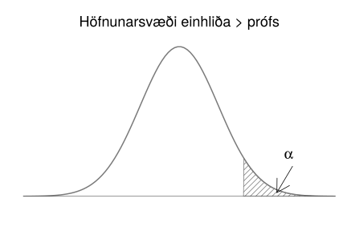
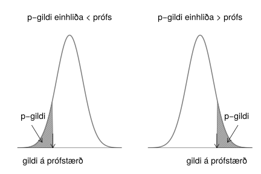

.. _c.alyktunartolfraedi:

Ályktunartölfræði
=================

Ályktunartölfræði er samheiti yfir allar þær aðferðir sem nota úrtak til
að draga ályktanir um allt þýðið. Ályktunartölfræði er þarf af leiðandi
eingöngu hægt að framkvæma á *slembiúrtökum*. Því leyfum við okkur,
þegar við fjöllum um ályktunartölfræði, að tala um úrtök þegar við eigum
í raun eingöngu við slembiúrtök. Í þessum kafla lýsum við þeirri
hugmyndafræði sem ályktunartölfræði byggir á og munum við notast við þau
hugtök sem hér eru kynnt í hverjum einasta kafla héðan frá.

Nú þegar við höfum fengið góð kynni af slembistærðum má sjá
*lýsistærðir*, sem við kynntumst í kafla :numref:`%s <c.lysanditolfraedi>`, í
nýju ljósi. Við gerum ráð fyrir að mælingar á breytu séu gildi sem
slembistærð hefur tekið og um leið áttum við okkur á því að þau gildi
breytast sennilega ef nýtt úrtak er valið. Lýsistærðir verða reiknaðar
út frá mælingunum okkar og þegar mælingarnar breytast þá er að sama
skapi líklegt að lýsistærðirnar breytist um leið. Þar af leiðandi eru
lýsistærðir í raun slembistærðir!

Við byrjum á að fjalla um hvaða áhrif líkindadreifing slembistærða hefur
á þær mælingar sem við munum sjá sem og lýsistærðirnar sem út frá þeim
eru reiknaðar. Í kafla :numref:`%s <s.urtaksdreifinglysistaerdar>` kynnumst við
*úrtaksdreifingu lýsistærðar* og veitum úrtaksdreifingu meðaltals
sérstaka athygli í kafla :numref:`%s <s.lysistaerdinmedaltal>`. Þannig leggjum
við grunninn fyrir *höfuðsetningu tölfræðinnar*, en henni kynnumst við í
kafla :numref:`%s <s.hofudsetningtolfraedinnar>`.

Í ályktunartölfræði reiðum við okkur á lýsistærðir, sér í lagi *metla*
og *prófstærðir*. Þeim kynnumst við í kafla :numref:`%s <s.metlar>`. Í kafla
:numref:`%s <s.oryggisbil>` reiknum við *öryggisbil* fyrir gildi stikanna sem
segja okkur hvaða önnur gildi en matið sjálft eru líkleg. Að lokum notum
við prófstærðir í kafla :numref:`%s <s.tilgatuprof>` þegar við framkvæmum
*tilgátupróf* sem leyfa okkur stundum að fullyrða um ákveðna eiginleika
gagnanna.

.. _s.urtaksdreifinglysistaerdar:

Úrtaksdreifing lýsistærðar
--------------------------

Úrtaksdreifing lýsistærðar
~~~~~~~~~~~~~~~~~~~~~~~~~~

Rifjum upp skilgreininguna á lýsistærð í kassa :numref:`%s <em.lysistaerd>`. Þar
stendur að lýsistærð sé tala sem verður reiknuð með einhverjum ákveðnum
hætti út frá mælingunum okkar. Nú þegar höfum áttað okkur á að þessar
tölur eru í raun útkomur slembistærðar þá er næsta skref að skoða
dreifingu þessarar slembistærðar. Hana köllum við *úrtaksdreifingu
lýsistærðar* (e. sampling distribution).

Úrtaksdreifing lýsistærðar (sampling distribution)
^^^^^^^^^^^^^^^^^^^^^^^^^^^^^^^^^^^^^^^^^^^^^^^^^^

.. attention::

    Sérhver lýsistærð er slembistærð og hefur þar af leiðandi einhverja
    líkindadreifingu. Þá líkindadreifingu köllum við *úrtaksdreifingu
    lýsistærðarinnar*.

--------------

Úrtaksdreifing lýsistærðar er bæði háð stærð úrtaksins sem og
líkindadreifingu mælinganna sem notaðar eru til að reikna lýsistærðina,
sem einnig er kölluð líkindadreifing þýðisins. Síðar í kaflanum munið
þið reyndar sjá að þegar við vinnum með lýsistærðina meðaltal þurfum við
ekki að vita líkindadreifingu upphaflegu mælinganna ef fjöldi mælinga í
úrtakinu okkar er nógu mikill. Það gefur *höfuðsetning tölfræðinnar*
(e. central limit theorem), mikilvægust allra tölfræðisetninga.

Eins og áður gerum við ráð fyrir að eingöngu sé unnið með *slembiúrtök*
og því þurfi ekki að hafa áhyggjur af *úrtaksbjaga*. Ef úrtaksbjagi er
til staðar þá hefur hann að sjálfsögðu áhrif á mælingarnar okkar og þar
af leiðandi lýsistærðirnar sem við reiknum út frá þeim. Það er hins
vegar oft erfitt, ef ekki ómögulegt, að segja til um hvaða áhrif
úrtaksbjaginn mun hafa og því munum við ekki ræða þau áhrif frekar. Hins
vegar verður góð vísa ekki of oft kveðin: Ef ekki er nægjanlega vel
staðið að úrtakshöguninni verður frekari tölfræðiúrvinnsla marklaus.

Lýsistærðin sem leggur saman útkomuna úr tveggja teninga kasti er á
margan hátt góð til að kanna úrtaksdreifingu lýsistærðar. Hér fyrir
neðan höfum við skrifað möguleg gildi sem lýsistærðin getur tekið í
neðstu línuna en þær útkomur úr teningakastinu sem gefa viðeigandi gildi
koma beint fyrir ofan gildið.

+---------+---------+---------+---------+---------+---------+---------+---------+---------+---------+---------+
|         |         |         |         |         | (6,1)   |         |         |         |         |         |
+---------+---------+---------+---------+---------+---------+---------+---------+---------+---------+---------+
|         |         |         |         | (5,1)   | (5,2)   | (6,2)   |         |         |         |         |
+---------+---------+---------+---------+---------+---------+---------+---------+---------+---------+---------+
|         |         |         | (4,1)   | (4,2)   | (4,3)   | (5,3)   | (6,3)   |         |         |         |
+---------+---------+---------+---------+---------+---------+---------+---------+---------+---------+---------+
|         |         | (3,1)   | (3,2)   | (3,3)   | (3,4)   | (4,4)   | (5,4)   | (6,4)   |         |         |
+---------+---------+---------+---------+---------+---------+---------+---------+---------+---------+---------+
|         | (2,1)   | (2,2)   | (2,3)   | (2,4)   | (2,5)   | (3,5)   | (4,5)   | (5,5)   | (6,5)   |         |
+---------+---------+---------+---------+---------+---------+---------+---------+---------+---------+---------+
| (1,1)   | (1,2)   | (1,3)   | (1,4)   | (1,5)   | (1,6)   | (2,6)   | (3,6)   | (4,6)   | (5,6)   | (6,6)   |
+---------+---------+---------+---------+---------+---------+---------+---------+---------+---------+---------+
| 2       | 3       | 4       | 5       | 6       | 7       | 8       | 9       | 10      | 11      | 12      |
+---------+---------+---------+---------+---------+---------+---------+---------+---------+---------+---------+

.. _g.teningakast:

.. figure:: myndir/summateningakasta.svg
    :align: center
    :alt: Hermun á 10000 teningaköstum 

    Hermun á 10000 teningaköstum 

Sérhver útkomanna í teningakastinu hér að ofan er jafnlíkleg en hins
vegar gefa mismargar þeirra sömu summuna. Til dæmis gefur einungis
útkoman (1,1) gildið 2, en á móti gefa útkomurnar (4,6), (5,5) og (6,4)
allar gildið 10. Á mynd :numref:`%s <g.teningakast>` má sjá útkomu úr hermun á
10000 teningaköstum. Það er engin tilviljun að lögun stuðlaritsins
líkist myndinni hér að ofan, það lýsir úrtaksdreifingu lýsistærðarinnar
,,summa tveggja teninga“.

.. _s.lysistaerdinmedaltal:

Lýsistærðin meðaltal
--------------------

Lýsistærðin meðaltal
~~~~~~~~~~~~~~~~~~~~

Þar sem *meðaltal* er bæði ein algengasta lýsistærðin sem við notum og
hefur auk þess marga ánægjulega eiginleika, þá ætlum við að skoða hana
aðeins nánar.

Hugsum okkur að við viljum kanna sem dæmi meðalþyngd Íslendinga. Við
tökum slembiúrtak 10 Íslendinga, mælum þyngd hvers og eins og reiknum út
frá því meðaltal mælinganna okkar. Hér eru upphaflegu mælingarnar þyngd
hvers og eins af Íslendingunum tíu en lýsistærðin sem verður reiknuð er
meðaltal þessara 10 mælinga.

Við gætum endurtekið tilraunina og valið upp á nýtt 10 manna
slembiúrtak. Þá myndu aðrir 10 einstaklingar veljast í úrtakið og því er
sennilegt að meðalþyngd þeirra 10 einstaklinga verði önnur en þeirra 10
sem valdir voru í fyrsta skiptið. Það er, lýsistærðin meðaltal tekur
nýtt gildi.

Þar sem við höfum, í þessu dæmi, eingöngu áhuga á því að kanna
meðalþyngd Íslendinga þá er þyngd hvers og eins einstaklings ekki
áhugaverð, heldur eingöngu meðalþyngd allra viðfangsefnanna. Því viljum
við oft vita: Hvaða útkomur myndum við búast við að sjá ef meðaltalið
yrði reiknað aftur og aftur fyrir nýtt og nýtt úrtak? Góð leið til að
lýsa því er með því að reikna *væntigildi* og *dreifni meðaltalsins*.

Eins og þið vitið þá fæst meðaltal með því að einfaldlega leggja saman
útkomur slembistærðar og deila með fjölda mælinga. Þá er gott að hafa
eftirfarandi reglur í huga.

Reiknireglur fyrir væntigildi slembistærða
^^^^^^^^^^^^^^^^^^^^^^^^^^^^^^^^^^^^^^^^^^

.. attention::

    Ef :math:`X` og :math:`Y` eru tvær slembistærðir, þá er
    
    .. math::
       \begin{aligned}
       E[X+Y] = & E[X] + E[Y]\end{aligned}
       :label: eq.vaentigildisumma
    
    .. math::
       \begin{aligned}
       E[X-Y] = & E[X] - E[Y]\end{aligned}
       :label: eq.vaentigildimismunur

--------------

.. note::

    Efri jafnan segir að væntigildi af summu tveggja slembistærða sé sú sama
    og summan af væntigildum slembistærðanna tveggja. Sú neðri segir að
    væntigildi mismunar tveggja slembistærða sé jafnt mismun væntigilda
    slembistærðanna tveggja.

--------------

Reiknireglur fyrir dreifni slembistærða
^^^^^^^^^^^^^^^^^^^^^^^^^^^^^^^^^^^^^^^

.. attention::

    Ef :math:`X` og :math:`Y` eru tvær óháðar slembistærðir er
    
    .. math::
       \begin{aligned}
       Var[X+Y] = Var[X] + Var[Y]\end{aligned}
       :label: eq.dreifnisumma
    
    .. math::
       \begin{aligned}
       Var[X-Y] = Var[X] + Var[Y]\end{aligned}
       :label: eq.dreifnimismunur

--------------

.. note::

    Efri jafnan segir að dreifni summu tveggja slembistærða sé jöfn summu
    dreifni hvorrar slembistærðar fyrir sig. Neðri jafnan segir að dreifni
    mismunar tveggja slembistærða sé jöfn summu dreifni hvorrar
    slembistærðar fyrir sig.

--------------

Sýnidæmi: Væntigildi summu tveggja slembistærða
^^^^^^^^^^^^^^^^^^^^^^^^^^^^^^^^^^^^^^^^^^^^^^^

.. tip::

    Væntigildi útkomunnar þegar tening er kastað er 3.5 með dreifnina 2.92.
    Hvert er væntigildi og dreifni summu útkomunnar þegar tveimur teningum
    er kastað?
    
    Setjum sem svo að :math:`X_1` og :math:`X_2` séu bæði slembistærðir sem
    lýsa einföldu teningakasti. Þá er væntigildi summu :math:`X_1` og
    :math:`X_2` talan :math:`E[X_1 + X_2]` sem samkvæmt jöfnu
    :eq:`eq.vaentigildisumma` er jöfn :math:`E[X_1]` + :math:`E[X_2]` sem
    bæði eru jöfn 3.5. Við fáum því að
    
    .. math:: E[X_1+X_2] = E[X_1] + E[X_2] = 3.5 + 3.5 = 7
    
    Við getum reiknað dreifni :math:`X_1+X_2`, eða tvöfalda teningakastsins
    með jöfnu :eq:`eq.dreifnisumma`:
    
    .. math:: Var[X_1+X_2] = Var[X_1] + Var[X_2] = 2.92+2.92 = 5.84,
    
    svo dreifni útkoma úr tvöföldu teningakasti er 5.84.

Þessar reglur má með einföldum hætti útvíkka til að finna væntigildi og
dreifni meðaltals.

.. _em.vogdmedal:

Væntigildi og dreifni meðaltals (Expected value and variance of the mean)
^^^^^^^^^^^^^^^^^^^^^^^^^^^^^^^^^^^^^^^^^^^^^^^^^^^^^^^^^^^^^^^^^^^^^^^^^

.. attention::

    Ef :math:`X_1, \ldots, X_n` eru óháðar og einsdreifðar slembistærðir með
    væntigildi :math:`E[X_i] = \mu` og dreifni :math:`Var[X_i] = \sigma^2`
    þá gildir um meðaltal þeirra, :math:`\bar X` að:
    
    .. math::
       \begin{aligned}
       E[\bar X] = \mu\end{aligned}
       :label: eq.vaentigildimedaltal
    
    .. math::
       \begin{aligned}
       Var[\bar X] = \frac{\sigma^2}{n}\end{aligned}
       :label: eq.dreifnimedaltal

--------------

.. note::

    Væntigildi meðaltals er því það sama og væntigildi slembistærðanna sem
    það er reiknað af en dreifnin minnkar í réttu hlutfalli við fjölda
    mælinga.

--------------

Þar sem lýsistærðin meðaltal er svo mikið notuð hefur staðalfrávik
hennar sérstakt heiti, sem kallast *staðalskekkja* (e. standard error).

Staðalskekkja (standard error)
^^^^^^^^^^^^^^^^^^^^^^^^^^^^^^

.. attention::

    Ef :math:`\bar X` er meðaltal :math:`X_1, \ldots, X_n`, óháðra og
    einsdreifðra slembistærða með dreifni :math:`Var[X_i] = \sigma^2`, þá er
    *staðalskekkja* þeirra
    
    .. math:: \sigma / \sqrt n
    
    Hún er staðalfrávik meðaltals mælinganna.

--------------

.. note::

    Takið eftir að
    
    .. math:: \frac{\sigma}{\sqrt{n}} = \sqrt{\frac{\sigma^2}{n}} = \sqrt{Var[\bar{X}]}
    
    svo staðalskekkjan er kvaðratrótin af dreifni meðaltalsins, eins og við
    er að búast.

--------------

Gætið ykkar að í daglegu tali táknar orðið meðaltal yfirleitt tiltekna
útkomu, en ekki lýsistærðina meðaltal. Því viljum við ítreka að í þessum
kafla á orðið meðaltal við lýsistærðina (og þar af leiðandi
slembistærðina) meðaltal. Lýsistærðin meðaltal **mun** verða reiknuð út
frá mælingunum okkar, en við vitum ekki enn hverjar mælingarnar okkar
verða og þar af leiðandi ekki heldur hver útkoma meðaltals þeirra
verður. Rithátturinn er einnig ágætis áminning: Við notum hástafi þegar
við ræðum um lýsistærðir en lágstafi þegar við ræðum um útkomur þeirra.

Sýnidæmi: Væntigildi og dreifni meðaltals
^^^^^^^^^^^^^^^^^^^^^^^^^^^^^^^^^^^^^^^^^

.. tip::

    Guðrún Helga er ansi lunkin að brugga hvítvín og á orðið dágott safn af
    flöskum. Vínið hennar inniheldur að meðaltali 12% alkóhól, með
    staðalfrávikið 1.5%. Næsta laugardag mun hún halda fjölmenna veislu þar
    sem hún ætlar að bjóða upp á 20 flöskur af víni. Hún hefur hins vegar
    áhyggjur af því að alkóhólmagnið verði mjög breytilegt eftir flöskum.
    Því grípur hún til þess ráðs að blanda saman víni úr 20 flöskum og hella
    í jafnmargar könnur. Finnið væntigildi og dreifni áfengisprósentu könnu
    sem valin er af handahófi.
    
    Þegar Guðrún blandar öllu víninu saman og hellir aftur í könnur
    inniheldur sérhver kanna sama vínið, sem er ,,meðalvín“ allra 20
    flasknanna. Látum slembistærðina :math:`X` tákna áfengisprósentu vínsins
    hennar Guðrúnar en slembistærðina :math:`\bar X` tákna áfengisprósentu
    meðalvínsins. Vínið hennar Guðrúnar inniheldur að meðaltali 12% alkóhól,
    svo :math:`\mu = 0.12`. Notum nú jöfnu :eq:`eq.vaentigildimedaltal` til
    að reikna væntigildi áfengisprósentu ,,meðalvínsins“. Væntigildið
    verður því
    
    .. math:: E[\bar X ] = \mu = 0.12
    
    eða það sama og væntigildi upphaflega vínsins. Meðalvínið er hins vegar
    búið til úr 20 flöskum af víni með staðalfrávik 1.5 svo :math:`n=20` og
    :math:`\sigma = 1.5`. Notum nú jöfnu :eq:`eq.dreifnimedaltal` til að
    reikna dreifni meðalvínsins. Dreifnin verður þá
    
    .. math:: Var[\bar X ] = \frac{\sigma^2}{n} = \frac{1.5^2}{20} = 0.1125

Ef við búum svo vel að þýðið okkar sé normaldreift, það er að
mælingarnar fylgi sömu normaldreifingunni, þá verður úrtaksdreifing
meðaltalsins líka normaldreifð. Meðaltalið verður það sama en
staðalskekkjan tekur við hlutverki staðalfráviksins.

.. _em.likmedal:

Líkindadreifing meðaltals normaldreifðra slembistærða
^^^^^^^^^^^^^^^^^^^^^^^^^^^^^^^^^^^^^^^^^^^^^^^^^^^^^

.. attention::

    Ef :math:`X_1, \ldots, X_n` eru slembistærðir úr normaldreifingu með
    væntigildi :math:`\mu` og dreifni :math:`\sigma^2` þá fylgir
    :math:`\bar X` einnig normaldreifingu, með væntigildi :math:`\mu` og
    dreifni :math:`\sigma^2/n`.
    
    .. math::
       \text{Það er ef } \ X_i \sim N(\mu,\sigma^2) \ \text{ þá } \ \bar X \sim N(\mu ,\sigma^2/n)
       :label: eq.medaltalnorm

--------------

Framkvæmum nú litla tilraun. Búum til þýði sem samanstendur af 10000
mælingum sem fylgja stöðluðu normaldreifingunni. Í efra vinstra horninu
á mynd :numref:`%s <g.urtaksdreifingmedaltals>` má sjá stuðlarit af þýðinu.

Tökum nú 10000 sinnum slembiúrtak af stærð 2 (:math:`n`\ =2) úr þýðinu
og finnum meðaltal þessara tveggja mælinga. Teiknum svo stuðlarit af
þessum 10000 tölum sem hver og ein er útkoma meðaltals tveggja mælinga.
Stuðlaritið má sjá í efra hægra horninu á mynd
:numref:`%s <g.urtaksdreifingmedaltals>`.

Þetta endurtökum við tvisvar til viðbótar en stækkum nú slembiúrtökin
sem við veljum og tökum slembiúrtak af stærð 5 í fyrra skiptið og að
lokum slembiúrtök af stærð 10. Stuðlaritin þegar :math:`n` = 5 og
:math:`n` = 10 má sjá á neðri helming myndar
:numref:`%s <g.urtaksdreifingmedaltals>`.

Séu stuðlaritin skoðuð má sjá að í öllum tilfellum fylgir dreifingin
normaldreifingu með meðaltal 0 en dreifnin er ekki sú sama. Hún minnkar
eftir því sem stærð slembiúrtakanna stækkar eins og jafna
:eq:`eq.medaltalnorm` segir til um.

Hér sjáum við svart á hvítu hvernig úrtaksdreifing :math:`\bar{X}` er
bæði háð fjölda mælinga (í gegnum :math:`n`) og dreifingu þýðisins (í
gegnum :math:`\mu` og :math:`\sigma`).

.. _g.urtaksdreifingmedaltals:

    Úrtaksdreifing meðaltals 

Sýnidæmi: Líkindadreifing meðaltals normaldreifðra slembistærða
^^^^^^^^^^^^^^^^^^^^^^^^^^^^^^^^^^^^^^^^^^^^^^^^^^^^^^^^^^^^^^^

.. tip::

    Einkunn nemenda í samræmdu könnunarprófi í íslensku er normaldreifð með
    :math:`\mu = 5` og :math:`\sigma=2`. Hver er líkindadreifing
    meðaleinkunnar 10 nemenda sem valdir eru af handahófi?
    
    Samkvæmt kassa :numref:`%s <em.likmedal>` er meðaleinkunn 10 nemenda líka
    normaldreifð með stikana :math:`\mu = 5` og
    :math:`\sigma^2/n = 4/10 = 0.4`. Svo meðaleinkunn 10 nemenda fylgir
    :math:`N(5,0.4)`.

.. _s.hofudsetningtolfraedinnar:

Höfuðsetning tölfræðinnar
-------------------------

Höfuðsetning tölfræðinnar
~~~~~~~~~~~~~~~~~~~~~~~~~

Nú er komið að sjálfri *höfuðsetningu tölfræðinnar* en hún ber svo
sannarlega nafn með rentu og útskýrir í raun hví svo mikil áhersla er
lögð á normaldreifingu í tölfræði og líkindafræði. Höfuðsetningin
fjallar um úrtaksdreifingu meðaltals og segir að sú úrtaksdreifing verði
normaldreifð ef það eru nægjanlega margar mælingar í úrtakinu.

.. _em.hofudsetn:

Höfuðsetning tölfræðinnar (Central limit theorem)
^^^^^^^^^^^^^^^^^^^^^^^^^^^^^^^^^^^^^^^^^^^^^^^^^

.. attention::

    Ef :math:`X_1, \ldots, X_n` eru óháðar og einsdreifðar slembistærðir þá
    fylgir :math:`\bar X` normaldreifingu með væntigildi :math:`\mu` og
    dreifni :math:`\sigma^2/n`
    
    .. math:: \bar X \sim N(\mu, \sigma^2/n)
    
    óháð dreifingu :math:`X_1, \ldots, X_n` **ef** :math:`n` er nógu stórt.

--------------

Þetta þýðir að ef við tökum meðaltal nógu margra mælinga þá mun það
meðaltal fylgja normaldreifingu sama hver dreifing upprunalegu
mælinganna er. Það sem meira er, þá vitum við stika dreifingarinnar.
Gætið ykkar að þetta gildir eingöngu ef mælingarnar eru óháðar og fylgja
allar sömu dreifingu.

Takið eftir að ef :math:`X_i` eru normaldreifðar gildir reglan fyrir öll
:math:`n`. Því meira sem dreifing :math:`X_i` víkur frá normaldreifingu,
því stærra :math:`n` er þörf. Þetta getum við líka orðað sem svo: Ef
upprunalegu mælingarnar eru normaldreifðar gildir reglan alltaf, því
meira sem upphaflegu mælingarnar víkja frá normaldreifingu, því fleiri
mælingar þurfum við til að meðaltal þeirra verði normaldreift.

Þessi eiginleiki er sýndur myndrænt á myndum :numref:`%s <g.clt1>` og
:numref:`%s <g.clt2>`. Á myndunum má sjá stuðlarit af þýði og stuðlarit af
úrtaksdreifingu meðaltals fyrir :math:`n=5`, :math:`n=10` og
:math:`n=30`. Á mynd :numref:`%s <g.clt1>` er dreifing þýðisins mjög skekkt til
hægri en þýðið á mynd :numref:`%s <g.clt2>` er nær því að fylgja
normaldreifingu.

.. _g.clt1:

.. figure:: myndir/clt1.svg
    :align: center
    :alt: Úrtaksdreifing meðaltals þar sem þýðið fylgir mjög skekktri dreifingu 

    Úrtaksdreifing meðaltals þar sem þýðið fylgir mjög skekktri dreifingu 

.. _g.clt2:

.. figure:: myndir/clt2.svg
    :align: center
    :alt: Úrtaksdreifing meðaltals þar sem þýðið fylgir lítið skekktri dreifingu 

    Úrtaksdreifing meðaltals þar sem þýðið fylgir lítið skekktri dreifingu 

Ágætis viðmið er að fjöldi mælinga, :math:`n`, sé stærri en 30 en það er
ekki algilt. Gætið þess einnig að eins og alltaf þurfa mælingarnar að
vera óháðar og einsdreifðar annars getum við ekkert fullyrt!

.. _s.metlar:

Metlar og prófstærðir
---------------------

Metlar og prófstærðir
~~~~~~~~~~~~~~~~~~~~~

Í ályktunartölfræði er aðallega stuðst við tvo flokka af lýsistærðum.
Annar flokkurinn inniheldur *metla* en það eru lýsistærðir sem gefa mat
á stikum líkindadreifingarinnar sem upphaflegu mælingarnar fylgja. Hinn
flokkurinn hefur að geyma *prófstærðir*. Þær notum við til að framkvæma
tilgátupróf sem geta mögulega hrakið fullyrðingar um ákveðna eiginleika
mælinganna. Tilgátupróf eru betur kynnt til sögunnar í kafla
:numref:`%s <s.tilgatuprof>`.

Eins og við fjölluðum um í :numref:`%s <c.likindafraedi>`. kafla, lítum við svo
á að mælingarnar okkar séu útkomur sem slembistærð hefur tekið. Því er
líkindadreifing slembistærðarinnar oft kölluð líkindadreifing þýðisins.
Í raun vitum við nær aldrei hver sú líkindadreifing er nákvæmlega en við
getum oft leyft okkur að áætla að hún sé af tiltekinni gerð.

Við sáum að ef við vitum gerð líkindadreifingar, þá gefa *stikar*
dreifingarinnar okkur allar þær upplýsingar sem hægt er að fá um
líkindadreifinguna. Þar af leiðandi er öll sú vitneskja sem hægt er að
fá um eðli mælinganna fólgin í gildunum á stikunum sem lýsa
líkindadreifingu þeirra.

Eitt af verkefnum ályktunartölfræði er að nota mælingarnar okkar til að
meta hver gildin á stikum líkindadreifingar þeirra eru. Þær útkomur sem
við munum fá þegar við metum gildi stikanna eru háðar mælingunum okkar
og geta breyst í hvert sinn sem nýtt úrtak er valið. Þær eru því
lýsistærðir og við köllum þær *metla* (e. estimators).

Metill (estimator)
^^^^^^^^^^^^^^^^^^

.. attention::

    *Metill* er lýsistærð sem metur stika tölfræðilíkans.

--------------

Í þessari bók verður fjallað um metla á stikum normaldreifingar, Poisson
dreifingar og tvíkostadreifingar. Þeir stikar voru táknaðir með
:math:`\mu`, :math:`\sigma`, :math:`\lambda` og :math:`p`. Í raun vitum
við ekki gildin á þessum stikum, heldur notum metla til að finna þá.
Þegar við höfum reiknað gildi metils fyrir eitthvað tiltekið úrtak
köllum við útkomuna *mat* (e. estimate).

Til að skerpa á muninum á sönnu gildi stika annars vegar og matinu á
honum hins vegar er sanna gildið táknað með grískum bókstaf en matið á
því gildi táknað með latneska stafrófinu. Undantekning á þeirri reglu er
þó :math:`p` og er það vegna þess að gríska p-ið er :math:`\pi` sem
hefur verið frátekið fyrir töluna :math:`\pi`.

Sömuleiðis gætum við þess að tákna metla með stórum staf en útkomur
þeirra með litlum staf í samræmi við það að slembistærðir eru táknaðar
með stórum staf en útkomur þeirra með litlum. Hér á eftir munum við sjá
þrjá metla. Metillinn :math:`\bar X` metur :math:`\mu` eða
:math:`\lambda`, eftir því sem við á. Útkoma hans er matið
:math:`\bar x`. Metillinn :math:`S^2` metur :math:`\sigma^2` og er matið
:math:`s^2`. Loks metur metilinn :math:`P` stikann :math:`p` en þá
táknum við matið með :math:`\hat p`.

Metill á meðaltal slembistærðar
^^^^^^^^^^^^^^^^^^^^^^^^^^^^^^^

.. attention::

    Metillinn sem við notum til að meta meðaltal slembistærðar er
    
    .. math:: \bar X = \sum_{i=1}^n \frac{X_i}{n}
    
    þar sem :math:`n` er heildarfjöldi mælinga. :math:`\bar X` er
    einfaldlega meðaltal allra mælinganna.

--------------

Við notum metilinn :math:`\bar X` þegar gögnin fylgja normaldreifingu
eða Poisson dreifingu. Í fyrra tilvikinu metur metillinn :math:`\mu` í
því seinna metur hann :math:`\lambda`. Mötin táknum við með
:math:`\bar x`.

Sýnidæmi: Metlar - :math:`\bar{X}`
^^^^^^^^^^^^^^^^^^^^^^^^^^^^^^^^^^

.. tip::

    Það er talið að fjöldi barna sem handleggsbrjóta sig á hverjum degi
    fylgi Poisson dreifingu. Eggert, læknir á slysadeild, vill meta hversu
    mörg börn handleggsbrjóta sig að meðaltali á hverjum degi. Hann hefur í
    höndum fjölda handleggsbrota síðustu 10 daga, en þau reyndust 2, 0, 1,
    7, 3, 3, 6, 4, 4, 1. Hvert metur Eggert meðalfjölda handleggsbrota vera
    á hverjum degi?
    
    Þar sem fjöldi barna sem handleggsbrjóta sig lýtur Poisson dreifingu þá
    gefur stikinn :math:`\lambda` meðalfjölda barna sem brjóta sig á hverjum
    degi. Metillinn fyrir þann stika er :math:`\bar X`, sem er meðaltal
    mælinganna. Eggert metur því fjöldann
    
    .. math:: \bar x =  \frac{2+0+1+7+3+3+6+4+4+1}{10} = \frac{31}{10} = 3.1
    
    Hann áætlar því að 3.1 barn handleggsbrjóti sig að meðaltali á dag.

.. _em.s2:

Metill á dreifni slembistærðar
^^^^^^^^^^^^^^^^^^^^^^^^^^^^^^

.. attention::

    Metillinn sem við notum til að meta dreifni slembistærðar er
    
    .. math:: S^2 = \sum_{i=1}^n \frac{(X_i - \bar X)^2}{n-1}
    
    þar sem :math:`\bar X` er metill á meðaltal mælinganna og :math:`n` er
    heildarfjöldi mælinga.

--------------

.. note::

    Formúluna að ofan reiknum við með eftirfarandi hætti:
    
    #) Fyrst finnum við meðaltal mælinganna.
    
    #) Síðan drögum við hverja mælingu frá meðaltalinu.
    
    #) Þar næst setjum við sérhverja stærð úr lið 2 í annað veldi.
    
    #) Við leggjum saman allar stærðirnar úr lið 3.
    
    #) Að lokum deilum við með n-1.

--------------

Við notum metilinn :math:`S^2` þegar gögnin lúta normaldreifingu, þá
metur hann :math:`\sigma^2`. Matið táknum við með :math:`s^2`.

Sýnidæmi: Metlar - :math:`S^2`
^^^^^^^^^^^^^^^^^^^^^^^^^^^^^^

.. tip::

    Helga telur að skóstærð kvenna sé normaldreifð. Hún ætlar að stofna
    skóverslun og vill því vita hver dreifnin er á skóstærð kvenna til að
    meta hversu mikið hún þarf að kaupa af hverju númeri. Hún mælir skóstærð
    8 kvenna af handahófi og fær eftirfarandi gildi: 40, 36, 37, 39, 38, 39,
    40, 38. Hverja metur hún dreifnina?
    
    Þar sem gögnin lúta normaldreifingu notar Helga metilinn :math:`S^2` í
    kassa :numref:`%s <em.s2>`.
    
    #) Meðaltal mælinganna er
       :math:`\frac{40+36+37+39+38+39+40+38}{8} = 38.375`.
    
    #) Frávik hverrar mælingar frá meðaltalinu er: 1.625, -2.375, -1.375,
       0.625, -0.375, 0.625, 1.625, -0.375.
    
    #) Stærðirnar í 2, hafnar í annað veldi eru: 2.641, 5.641, 1.891, 0.391,
       0.141, 0.391, 2.641, 0.141.
    
    #) Summa stærðanna í 3 er 13.878.
    
    #) :math:`\frac{13.878}{8-1} = \frac{13.878}{7} = 1.983`
    
    Hún metur því að dreifnin sé :math:`s^2 = 1.983`.

.. _em.phat:

Metill á hlutfalli slembistærðar
^^^^^^^^^^^^^^^^^^^^^^^^^^^^^^^^

.. attention::

    Metillinn sem við notum til að meta hlutfall slembistærðar er
    
    .. math:: P = \frac{X}{n}
    
    þar sem :math:`X` er fjöldi heppnaðra tilrauna og :math:`n` er
    heildarfjöldi tilrauna.

--------------

Við notum metilinn :math:`P` þegar gögnin lúta tvíkostadreifingu, þá
metur hann :math:`p`. Matið táknum við með :math:`\hat p`.

Sýnidæmi: Metlar - :math:`P`
^^^^^^^^^^^^^^^^^^^^^^^^^^^^

.. tip::

    Það er talið að fjöldi skemmdra mandarína í hverjum kassa sem inniheldur
    20 mandarínur lúti tvíkostadreifingu. Anna Hera vill tryggja að hún
    kaupi nægjanlega margar óskemmdar mandarínur og vill því meta hvert
    hlutfall þeirra skemmdu sé. Hún kaupir kassa með 20 mandarínum, þar af
    eru 2 skemmdar. Hvert metur hún hlutfallið vera?
    
    Þar sem gögnin eru tvíkostadreifð má nota metilinn :math:`P` úr kassa
    :numref:`%s <em.phat>`. Hún hefur 20 mandarínur, svo :math:`n=20`. Tvær þeirra
    eru skemmdar svo :math:`x=2`. Hún metur því hlutfallið
    
    .. math:: \hat p = \frac{x}{n} = \frac{2}{20} = 0.1
    
    Þ.e. að 10% mandarína séu skemmdar að meðaltali.

.. _s.oryggisbil:

Öryggisbil
----------

Öryggisbil
~~~~~~~~~~

Nú hafið þið séð hvernig við notum metla til að meta hvert gildið á
stika þýðis er. Það mat sem við reiknum er hins vegar útkoma lýsistærðar
og getur þar af leiðandi breyst ef nýtt úrtak er valið, þó svo að rétta
gildið á stikanum sé ávallt það sama. Hversu áreiðanlegt er þá matið
okkar? Eru einhverjar líkur á því að við höfum hitt á nákvæmlega rétta
gildið? Ef ekki, eru þá ekki önnur gildi líka sennileg?

Hugsum okkur að Arndís og Guðrún Birna vilji báðar meta meðalfjölda
lakkrísmynta í hverju boxi. Arndís kaupir 5 box og meðalfjöldi mynta í
þeim boxum reyndist vera 34. Mat hennar á meðalfjölda mynta var þá 34.
Guðrún Birna kaupir líka 5 box en meðalfjöldi myntanna reyndist 36, hún
fékk annað mat. Hvor þeirra hefur þá rétt fyrir sér? Hafa þær kannski
báðar rangt fyrir sér?

Í langflestum tilvikum eru engar líkur á því að matið okkar á stika
líkindadreifingar sé raunverulega sanna gildið á stikanum. Þess vegna
viljum við vita hvaða önnur gildi eru einnig líkleg. Það skiptir ef til
vill ekki öllu máli hvort meðalfjöldi lakkrísmynta sé 34 eða 36, en við
teljum kannski sennilegt að hann sé ,,á því reiki“. Til að leggja mat á
það hvaða önnur gildi eru sennileg möt á stikunum sem við erum að meta
notum við *öryggisbil* (e. confidence intervals). Öryggisbil mun með
ákveðnu *öryggi* (e. confidence level) innihalda sanna gildið á stikanum
sem við erum að reyna að meta.

Öryggisbil (confidence interval)
^^^^^^^^^^^^^^^^^^^^^^^^^^^^^^^^

.. attention::

    1 - :math:`\alpha` öryggisbil er talnabil sem inniheldur sanna gildi
    stikans með örygginu 1 - :math:`\alpha`.

--------------

Öryggi (confidence level)
^^^^^^^^^^^^^^^^^^^^^^^^^

.. attention::

    Öryggi er það hlutfall tilvika þar sem öryggisbilið inniheldur
    raunverulegt gildi stikans, þegar tilraunin er endurtekin mjög oft.

--------------

Ímyndum okkur að hver einasti af þúsund nemendum í tölfræðinámskeiði
myndi mæla þyngd 10 karlmanna til að áætla hver meðalþyngd karlmanna á
Íslandi væri. Stikinn sem þau vilja meta er raunveruleg meðalþyngd
karlmanna á Íslandi. Við vitum ekki hvert gildi hans er. Ímyndum okkur
líka að hver einasti nemandi reikni 95% öryggisbil fyrir stikann. Þá
munu um það bil 95% nemendanna, eða í kringum 950 nemendur, reikna
öryggisbil sem inniheldur raunverulega meðalþyngd karlmanna á Íslandi.

Öryggismörk eða vikmörk (confidence limits)
^^^^^^^^^^^^^^^^^^^^^^^^^^^^^^^^^^^^^^^^^^^

.. attention::

    *Öryggismörk* eru endapunktar öryggisbilsins. Efra öryggismarkið er efri
    endapunktur bilsins (stærsta gildið sem er tekið á bilinu) en neðra
    öryggismarkið er neðri endapunkturinn (minnsta gildið sem er tekið á
    bilinu).

--------------

Alveg eins og við tölum um öryggi þá þurfum við ekki síður að tala um
andstæðu þess eða *villulíkurnar*.

Villulíkur (Type I error)
^^^^^^^^^^^^^^^^^^^^^^^^^

.. attention::

    *Villulíkur*, táknaðar :math:`\alpha`, eru það hlutfall tilvika þar sem
    öryggisbil metilsins inniheldur ekki raunverulega gildið á stikanum sem
    hann metur, ef tilraunin er endurtekin mjög oft.

--------------

Ef við skoðum aftur dæmið að ofan, þá myndum við búast við því að í
kringum 5% nemendanna, eða í kringum 50 nemendur, myndu reikna
öryggisbil sem inniheldur ekki raunverulega gildið á stikanum. Algengast
er að velja villulíkurnar :math:`\alpha = 0.05`, sem svarar til þess að
finna 1- 0.05, eða 0.95 öryggisbil. Athugið að yfirleitt er talað um
öryggisbil í prósentum. Þannig segjum við 95% öryggisbil, í stað 0.95
öryggisbils.

Við viljum ítreka að öryggisbil er alltaf jafn ,,öruggt“. Það skiptir
engu hvað við höfum margar mælingar í úrtakinu okkar, 95% öryggisbil mun
alltaf innihalda rétta gildi stikans í 95% tilvika þegar tilraunin er
framkvæmd. Hins vegar, eftir því sem við höfum fleiri mælingar í
úrtakinu okkar, því þrengra (minna) verður öryggisbil lýsistærðanna sem
við erum að meta, þ.e. bilið á milli efri og neðri öryggismarka minnkar.
Það er í samræmi við innsæi okkar, eftir því sem úrtakið stækkar, þeim
mun meiri vitneskju höfum við um þýðið sem við erum að lýsa.

.. _s.tilgatuprof:

Tilgátupróf
-----------

Tilgátupróf
~~~~~~~~~~~

Nú erum við búin að sjá hvernig við finnum mat á stika líkindadreifingar
mælinganna og öryggisbil fyrir það mat. Þá er kominn tími til að taka
næsta skref, að nota mælingarnar til að fullyrða um tiltekna eiginleika
þýðisins. Til þess notum við tilgátupróf. Þegar við framkvæmum
tilgátupróf stillum við upp tveimur *tilgátum* þar sem önnur er neitun
hinnar. Ef gögnin leyfa, hrekjum við aðra tilgátuna og fullyrðum þá um
leið hina.

Þegar við framkvæmum tilgátupróf reiðum við okkur á lýsistærðir sem
kallast *prófstærðir* og notum útkomur þeirra til að fullyrða um
líkindadreifingu þýðisins eða þýðanna sem verið er að skoða. Hér á eftir
má sjá stutta samantekt um hugmyndafræði tilgátuprófa. Verkefni kaflans
er að útskýra nánar skrefin hér að neðan og þá röksemdafærslu sem þau
byggja á.

Hugmyndafræði tilgátuprófa
^^^^^^^^^^^^^^^^^^^^^^^^^^

.. attention::

    Sett er fram ein tilgáta sem lýsir því sem við viljum sýna fram á og
    önnur sem lýsir hlutlausu tilviki.
    
    Fundin er lýsistærð sem hefur þekkta líkindadreifingu í hlutlausa
    tilvikinu. Þessi lýsistærð er prófstærðin okkar.
    
    Skilgreint er hvaða gildi á prófstærðinni eru ,,ósennileg“ miðað við
    líkindadreifinguna í hlutlausa tilvikinu.
    
    Ef útkoma prófstærðarinnar flokkast sem ,,ósennileg“ þá höfnum við
    tilgátunni um hlutlausa ástandið og fullyrðum tilgátuna sem við viljum
    sýna fram á.
    
    Ef útkoman er ekki ,,ósennileg“ er ekkert fullyrt.

--------------

Tilgátur
~~~~~~~~

Tilgáta er fullyrðing sem við getum fullyrt eða hrakið með gögnunum
okkar, eftir því hvert eðli tilgátunnar og útkoma gagnanna eru.
Yfirleitt er tilgátan fullyrðing um stika þýðisins eða þýðanna sem
gögnin koma úr. Sem dæmi má nefna fullyrðingu um :math:`\mu`, ef breytan
er normaldreifð eða fullyrðingu um :math:`p` ef breytan fylgir
tvíkostadreifingu.

Sérhvert tilgátupróf hefur tvær tilgátur, núlltilgátu og gagntilgátu.
Þær eru ætíð háðar hvor annarri og eru smíðaðar þannig að gagntilgátan
er sú fullyrðing sem gildir ef núlltilgátan er röng.

Núlltilgáta (null hypothesis)
^^^^^^^^^^^^^^^^^^^^^^^^^^^^^

.. attention::

    *Núlltilgáta* er fullyrðing sem getur verið afsönnuð með fyrirliggjandi
    gögnum. Hún verður hins vegar aldrei sönnuð. Hún er yfirleitt táknuð með
    :math:`H_0`.

--------------

Yfirleitt er núlltilgáta fullyrðing um hlutlaust ástand, til dæmis að
hópar séu jafnir, að það sé ekki fylgni á milli breyta og svo framvegis.
Dæmi um núlltilgátu er: Magn kólesteróls í blóði er það sama hjá
einstaklingum sem taka lyf og þeim sem taka lyfleysu.

Gagntilgáta (alternative hypothesis)
^^^^^^^^^^^^^^^^^^^^^^^^^^^^^^^^^^^^

.. attention::

    *Gagntilgáta* er sú fullyrðing sem við viljum staðfesta með
    rannsókninni. Hún er eingöngu sönnuð en ekki afsönnuð. Hún er ýmist
    táknuð með :math:`H_1` eða :math:`H_a`.

--------------

Dæmi um gagntilgátu er: Magn kólesteróls í blóði er meira hjá
einstaklingum sem taka lyf heldur en þeim sem taka lyfleysu.

Áttanir tilgátuprófa
~~~~~~~~~~~~~~~~~~~~

Til eru tvær gerðir tilgátuprófa, *tvíhliða tilgátupróf* (e. two-sided
test) og *einhliða tilgátupróf* (e. one-sided test). Munurinn á þessum
tveimur gerðum tilgátuprófa liggur í eðli gagntilgáta þeirra.

Einhliða próf (one-sided tests)
^^^^^^^^^^^^^^^^^^^^^^^^^^^^^^^

.. attention::

    Til eru tvær gerðir *einhliða tilgátuprófa*:
    
    Þau sem fullyrða að einn stiki gagnanna sé **stærri** en annar stiki eða
    eitthvað ákveðið gildi, ef gögnin leyfa.
    
    Þau sem fullyrða að einn stiki gagnanna sé **minni** en annar stiki eða
    eitthvað ákveðið gildi, ef gögnin leyfa.

--------------

Ímyndum okkur að við höfum eftirfarandi tvær tilgátur:

-  Kólesterólmagnið er það **sama** í báðum hópum.

-  Kólesterólmagnið er **minna** hjá þeim sem taka lyfið.

Þetta er dæmi um einhliða próf. Gagntilgátan tiltekur að
kólesterólmagnið sé **minna** hjá þeim sem taka lyfið.

Tvíhliða próf (two-sided tests)
^^^^^^^^^^^^^^^^^^^^^^^^^^^^^^^

.. attention::

    Ef gögnin leyfa þá fullyrðir *tvíhliða tilgátupróf* að einn stiki
    gagnanna sé **annað hvort stærri eða minni** en annar stiki eða eitthvað
    ákveðið gildi, ef gögnin leyfa.

--------------

Dæmi um tvíliða tilgátupróf væri:

-  Kólesterólmagnið er það **sama** í báðum hópum.

-  Kólesterólmagnið er **ekki það sama** í báðum hópum.

Hér gerir gagntilgátan ekki ráð fyrir því að kólesterólmagnið sé minna í
hópnum sem tekur lyfið. Munurinn gæti allt eins verið í hina áttina.

Tvíhliða tilgátupróf hafa þann stóra kost fram yfir einhliða tilgátupróf
að við þurfum ekki að tilgreina fyrir fram hvort við munum fullyrða að
stiki gagnanna sé stærri eða minni en viðmiðið. Þar af leiðandi skal
ávallt nota tvíhliða tilgátupróf þegar við teljum að við getum hafnað
núlltilgátunni en við erum ekki viss um hvort munurinn sé jákvæður eða
neikvæður. Reynist munurinn vera jákvæður getum við fullyrt sem svo og
einnig ef hann reynist neikvæður. Í einhliða tilgátuprófi þurfum við að
ákveða fyrirfram í hvora átt mismunurinn liggur. Þetta sjáum við betur
þegar við skoðum *höfnunarsvæði tilgátuprófa* í kassa
:numref:`%s <em.hofnunarsvaedi>`

Prófstærðir
~~~~~~~~~~~

Prófstærð (test statistic)
^^^^^^^^^^^^^^^^^^^^^^^^^^

.. attention::

    *Prófstærð* er lýsistærð sem má nota til að hrekja núlltilgátu, ef
    gögnin leyfa.

--------------

Dæmi um algengar prófstærðir eru :math:`\bar X` (meðaltal) og
:math:`\frac{\bar X}{S / \sqrt{n}}` (meðaltal deilt með staðalskekkju).
Algengustu tilgátuprófin byggja á prófstærðum sem hafa þekkta
líkindadreifingu þegar núlltilgátan er sönn. Í kafla
:numref:`%s <s.hofudsetningtolfraedinnar>` gaf sem dæmi Höfuðsetning
tölfræðinnar að dreifing :math:`\bar X` líkist normaldreifingu ef
nægilega margar mælingar eru í úrtakinu. Á þeim eiginleika byggja nokkur
tilgátupróf.

Í þessari bók munu prófstærðinar byggja á samfelldu líkindadreifingunum
sem við kynntumst í kafla :numref:`%s <c.likindafraedi>`. Við kennum
prófstærðinar okkar oft við þær líkindadreifingar sem þær fylgja. Þannig
tölum við um :math:`z`-gildi ef hún fylgir normaldreifingu,
:math:`t`-gildi ef hún fylgir :math:`t`-dreifingu, :math:`F`-gildi ef
hún fylgir :math:`F`-dreifingu og :math:`\chi^2` gildi ef hún fylgir
kí-kvaðrat dreifingu. Að sama skapi kennum við tilgátuprófin oft við
líkindadreifingu prófstærðanna sem þau byggja á. Þannig er oft talað um
:math:`t`-próf, :math:`F`-próf og svo framvegis.

Höfnunarsvæði og :math:`\alpha`-stig
~~~~~~~~~~~~~~~~~~~~~~~~~~~~~~~~~~~~

Það að prófstærðir hafi þekkta líkindadreifingu ef núlltilgátan væri
sönn gefur okkur valaðferð sem stýrir því hvenær við höfnum
núlltilgátunni.

Höfnun núlltilgátu (rejection of null hypothesis)
^^^^^^^^^^^^^^^^^^^^^^^^^^^^^^^^^^^^^^^^^^^^^^^^^

.. attention::

    Við *höfnum* núlltilgátu ef prófstærðin okkar hefur ósennilegt gildi
    miðað við þá líkindadreifingu sem hún ætti að hafa ef núlltilgátan væri
    sönn.

--------------

Við segjum að gildi sé ósennilegt ef það lendir annað hvort í öðrum
hvorum eða báðum hölum líkindadreifingarinnar. Þau svæði eru kölluð
*höfnunarsvæði* tilgátuprófsins. Hversu langt út í halanum
höfnunarsvæðið er fer eftir :math:`\alpha` *-stigi* tilgátuprófsins en
hvort hún geti lent í hvorum halanum sem er eða eingöngu öðrum þeirra
fer eftir *áttun* tilgátuprófsins. Þessi hugtök eru útskýrð nánar hér á
eftir.

.. _em.hofnunarsvaedi:

Höfnunarsvæði tilgátuprófa (rejection areas)
^^^^^^^^^^^^^^^^^^^^^^^^^^^^^^^^^^^^^^^^^^^^

.. attention::

    *Höfnunarsvæði tilgátuprófa* eru nákvæmlega þau bil sem innihalda þau
    gildi á prófstærðum sem við höfnum núlltilgátunni fyrir.
    
    Ef prófstærðin fellur á höfnunarsvæði tilgátuprófsins þá höfnum við
    núlltilgátunni og fullyrðum gagntilgátuna.
    
    Ef hún fellur ekki á höfnunarsvæðið, höfnum við ekki núlltilgátunni og
    drögum enga ályktun.
    
    Höfnunarsvæði tvíhliða og einhliða prófa má sjá á myndum
    :numref:`%s <g.hofnunarsvaeditvihlida>`, :numref:`%s <g.hofnunarsvaediminna>` og
    :numref:`%s <g.hofnunarsvaedistaerra>`.

--------------

.. _g.hofnunarsvaeditvihlida:

.. figure:: myndir/tvihlida_hofnunarsvaedi.svg
    :align: center
    :alt: Höfnunarsvæði tvíhliða prófs 

    Höfnunarsvæði tvíhliða prófs 

.. _g.hofnunarsvaediminna:

.. figure:: myndir/einhlidam_hofnunarsvaedi.svg
    :align: center
    :alt: Höfnunarsvæði einhliða minna en prófs 

    Höfnunarsvæði einhliða minna en prófs 

.. _g.hofnunarsvaedistaerra:

    Höfnunarsvæði einhliða stærra en prófs 

Tölfræðingar þurfa, eins og allir aðrir, að sætta sig við mistök stöku
sinnum. Alvarlegustu villurnar sem við gerum eru yfirleitt að fullyrða
gagntilgátu, sem er í raun ósönn. Það gerist þegar við höfnum
núlltilgátu sem við áttum ekki að hafna. Við viljum stýra því að
hlutfall þessara mistaka sé ekki of hátt. Til þess höfum við hugtakið
:math:`\alpha`-*stig* tilgátuprófa.

:math:`\alpha`-stig (:math:`\alpha`-level)
^^^^^^^^^^^^^^^^^^^^^^^^^^^^^^^^^^^^^^^^^^

.. attention::

    :math:`\alpha` *stig* tilgátuprófs eru mestu ásættanlegu líkur þess að
    hafna núlltilgátunni þegar hún er í raun sönn.

--------------

Líkurnar á því að prófstærð falli á höfnunarsvæði þegar núlltilgátan er
sönn eru nákvæmlega :math:`\alpha`-stig tilgátuprófsins. Til að
skilgreina höfnunarsvæði þurfum við því að ákveða:

-  Hver er stefna tilgátuprófsins? (einhliða/tvíhliða próf)

-  Hvað er ásættanlegt :math:`\alpha`-stig tilgátuprófsins?

Höfnunarsvæði fyrir einhliða próf er eingöngu í öðrum hala
líkindadreifingarinnar á meðan höfnunarsvæði tvíhliða prófa dreifist
jafnt á báða halana. Þetta veldur því að höfnunarsvæði einhliða prófs er
nær meðaltalinu, en þó eingöngu úr annarri áttinni. Það veldur því aftur
að einhliða próf getur hafnað núlltilgátu sem tvíhliða próf myndi ekki
hafna. Við megum því aldrei taka ákvörðun um að nota einhliða próf eftir
að hafa skoðað gögnin. Það veldur því að líkurnar á að hafna réttri
núlltilgátu verða meiri en :math:`\alpha`. Hins vegar kemur það niður á
*styrk* prófsins, hugtaki sem þið munuð kynnast í næsta undirkafla, að
nota tvíhliða próf þegar rök hefði mátt færa fyrir því að nota einhliða
próf.

Skoðum lítið dæmi. Baldur framkvæmir tvíhliða tilgátupróf þar sem hann
hafnar :math:`H_0` ef prófstærðin hans er lítil eða stór. Prófstærðin
sem Baldur notar fyrir prófið fylgir staðlaðri normaldreifingu og hann
hefur :math:`\alpha`-stigið 10%. Baldur skilgreinir því að gildi
prófstærðarinnar sé ósennilegt ef það er minna eða jafnt
:math:`z_{0.05} = -1.64` eða stærra eða jafnt :math:`z_{0.95} = 1.64`.
Hann segir því að öll gildi sem eru annað hvort minni en -1.64 eða
stærri en 1.64 séu ólíkleg. Höfnunarsvæðin má sjá á mynd
:numref:`%s <g.atlitvihlida>`. Prófstærð Baldurs hlaut gildið -1.4 í tilrauninni
hans. Hann hafnar því ekki tilgátuprófinu og fullyrðir því ekki neitt.

.. _g.atlitvihlida:

.. figure:: myndir/tvihlida_hofnunarsvaedi2.svg
    :align: center
    :alt: Höfnunarsvæði tvíhliða prófs 

    Höfnunarsvæði tvíhliða prófs 

Ímyndum okkur nú að Jóhannes hafi framkvæmt einhliða tilgátupróf með
sams konar gögn og sömu prófstærð. Jóhannes skilgreinir því að gildi
prófstærðarinnar sé ósennilegt ef það er minna eða jafnt
:math:`z_{0.10} = -1.28`. Hann segir því að öll gildi sem eru minni en
-1.28 séu ólíkleg. Höfnunarsvæðin má sjá á mynd :numref:`%s <g.atlieinhlida>`.
Prófstærð Jóhannesar hlaut gildið -1.4 í tilrauninni hans. Hann hafnar
því tilgátuprófinu og fullyrðir :math:`H_1`. Ef að Jóhannes hafði ekki
forsendur til að áætla að að eingöngu lítil gildi væru ósennileg, er
allt eins víst að hann hefði fullyrt að eingöngu stór gildi væru
ósennileg ef niðurstöðurnar hefðu verið sem svo. Því voru villulíkur
hans í raun 20% en ekki 10%, þ.e. tvöfalt líklegra en hann áætlaði að
villa af gerð I hafi átt sér stað.

.. _g.atlieinhlida:

.. figure:: myndir/einhlidam_hofnunarsvaedi2.svg
    :align: center
    :alt: Höfnunarsvæði einhliða prófs 

    Höfnunarsvæði einhliða prófs 

:math:`p`-gildi
~~~~~~~~~~~~~~~

Annað dæmi um lýsistærðir eru :math:`p`-gildi. :math:`p`-gildi hafa
yfirleitt ekki jafnþekktar líkindadreifingar og aðrar lýsistærðir og oft
er æði erfitt eða jafnvel ómögulegt að reikna þau í höndunum. Hins vegar
er bæði fljótlegt og auðvelt að túlka :math:`p`-gildi.

:math:`p`-gildi (:math:`p`-value)
^^^^^^^^^^^^^^^^^^^^^^^^^^^^^^^^^

.. attention::

    :math:`p`-gildi eru líkurnar á því að fá jafn ósennilega niðurstöðu eða
    ósennilegri og fengin er ef núlltilgátan er sönn. Hafna skal :math:`H_0`
    sé p-gildið minna en :math:`\alpha`. Sé p-gildið stærra en
    :math:`\alpha` er ekki hægt að hafna núlltilgátunni.

--------------

P-gildið finnum við út frá gildinu á prófstærðinni. Séum við að vinna
með einhliða minna en tilgátupróf er p-gildið flatarmálið undir
þéttiferlinum frá vinstri hala að gildinu á prófstærðinni. Það er,
útkoma dreififallsins í gildinu á prófstærðinni. Séum við aftur á móti
að vinna með einhliða stærra en próf er p-gildið flatarmálið frá hægri
hala að gildinu á prófstærðinni. Þetta má sjá myndrænt á mynd
:numref:`%s <g.pgildi>`. Myndin sýnir p-gildi fyrir prófstærð sem fylgir
stöðluðu normaldreifingunni. Séum við að vinna með tvíhliða tilgátupróf
förum við eins að og í einhliða prófunum nema p-gildið er tvöfalt stærra
en flatarmálið sem fundið er.

.. _g.pgildi:

    P-gildi einhliða tilgátuprófa þar sem prófstærðin fylgir stöðluðu normaldreifingunni 

Nær allur tölfræðihugbúnaður reiknar p-gildi í hvert sinn sem
tilgátupróf er framkvæmt, enda er túlkun þeirra einföld og skýr, sama
hvert tölfræðiprófið er. Því birtum við nánast án undantekningar p-gildi
þegar við reiknum tilgátupróf í tölvum. Þegar við reiknum í höndunum
reiðum við okkur hins vegar á útkomur prófstærðanna sjálfra, enda oft
ómögulegt að finna p-gildin. Í þessari bók er reglan sú að við getum
reiknað p-gildi með einföldum hætti ef prófstærðin fylgir stöðluðu
normaldreifingunni, annars ekki.

.. _k.pgildiz:

:math:`p`-gildi prófstærða sem fylgja stöðluðu normaldreifingunni
^^^^^^^^^^^^^^^^^^^^^^^^^^^^^^^^^^^^^^^^^^^^^^^^^^^^^^^^^^^^^^^^^

.. attention::

    Áður en p-gildið er fundið þurfum við að reikna út gildið á
    prófstærðinni og átta okkur á hvort við séum að vinna með einhliða eða
    tvíhliða próf.
    
    **Einhliða minna en próf:**
    
    Við leitum að gildinu á prófstærðinni í :math:`z`-dálkinum í töflu
    stöðluðu normaldreifingarinnar í kafla :ref:`T.1 <a.normaltafla>`. P-gildið er
    jafnt gildinu í :math:`\Phi(z)`-dálkinum því á hægri hlið.
    
    **Einhliða stærra en próf:**
    
    Við leitum að gildinu á prófstærðinni í :math:`z`-dálkinum í töflu
    stöðluðu normaldreifingarinnar í kafla :ref:`T.1 <a.normaltafla>` og lesum
    gildið úr :math:`\Phi(z)`-dálkinum því á hægri hlið. P-gildið er jafnt
    :math:`1 - \Phi(z)`.
    
    **Tvíhliða próf:**
    
    Sé gildið á prófstærðinni okkar neikvætt förum við eins að og þegar við
    vinnum með einhliða minna en próf en við þurfum að margfalda gildið með
    2.
    
    Sé gildið á prófstærðinni okkar jákvætt förum við eins að og þegar við
    vinnum með einhliða stærra en próf en við þurfum að margfalda gildið með
    2.

--------------

Sýnidæmi: P-gildi prófstærðar sem fylgir stöðluðu normaldreifingunni
^^^^^^^^^^^^^^^^^^^^^^^^^^^^^^^^^^^^^^^^^^^^^^^^^^^^^^^^^^^^^^^^^^^^

.. tip::

    Finnið p-gildi eftirfarandi tilgátuprófa og segið til um hvort hafna
    megi núlltilgátunni (:math:`\alpha = 0.05`).
    
    #) Einhliða stærra en tilgátupróf þar sem prófstærðin fylgir stöðluðu
       normaldreifingunni. Gildið á prófstærðinni er 2.09.
    
    #) Tvíhliða tilgátupróf þar sem prófstærðin fylgir stöðluðu
       normaldreifingunni. Gildið á prófstærðinni er -1.55.
    
    Við förum eftir leiðbeiningunum í kassa :numref:`%s <k.pgildiz>`
    
    #) Við finnum 2.09 í töflu stöðluðu normaldreifingarinnar í kafla
       :ref:`T.1 <a.normaltafla>`. :math:`\Phi(z)`-gildið því á hægri hlið er
       0.9817. Þar sem við erum að vinna með einhliða stærra en próf er
       p-gildið = 1 - 0.9817 = 0.0183. P-gildið er minna en :math:`\alpha`
       svo við höfnum núlltilgátunni.
    
    #) Við finnum -1.55 í töflu stöðluðu normaldreifingarinnar í kafla
       :ref:`T.1 <a.normaltafla>`. :math:`\Phi(z)`-gildið því á hægri hlið er
       0.0606. Þar sem við erum að vinna með tvíhliða tilgátupróf þar sem
       gildið á prófstærðinni er jákvætt er p-gildið =
       :math:`2 \cdot 0.0606` = 0.1212. P-gildið er stærra en :math:`\alpha`
       svo við getum ekki hafnað núlltilgátunni.

.. _ss.styrkur:

Styrkur prófa og villur af gerð I og II
~~~~~~~~~~~~~~~~~~~~~~~~~~~~~~~~~~~~~~~

.. _k.styrkur:

Styrkur (power)
^^^^^^^^^^^^^^^

.. attention::

    *Styrkur* tilgátuprófs eru líkurnar á því að hafna núlltilgátu sem er í
    raun ósönn. Hann er oft táknaður með :math:`1-\beta`.

--------------

Það getur verið ansi snúið að reikna styrk ýmissa prófa og stundum
verðum við að láta gróft mat nægja. Þó gilda ætíð tvær meginreglur.
Annars vegar að eftir því sem breytileiki mælinganna sem tilgátuprófið
byggir á eykst, þá minnkar styrkurinn. Hins vegar að með auknum fjölda
endurtekninga, þá eykst styrkurinn. Við höfum engar leiðir til að minnka
breytileika gagnanna, en hins vegar getum við aukið úrtaksstærðina. Mat
á styrk er þannig oft notað til að ákvarða hversu margar mælingar þarf
að framkvæma í tilraun, þ.e. gerðar eru nægjanlega margar mælingar til
að tryggja að ákveðnum styrk sé náð.

Nú þegar við vitum bæði hvað :math:`\alpha`-stig og styrkur eru, getum
við fjallað um þær tvær gerðir villa sem við getum gert þegar við
framkvæmum tilgátupróf.

Villa af gerð I (Type I Error)
^^^^^^^^^^^^^^^^^^^^^^^^^^^^^^

.. attention::

    *Villa af gerð I* er sú villa að hafna núlltilgátu sem er í raun sönn.
    Líkurnar á villu af gerð I eru :math:`\alpha`-stig prófsins.

--------------

Villa af gerð II (Type II error)
^^^^^^^^^^^^^^^^^^^^^^^^^^^^^^^^

.. attention::

    *Villa af gerð II* er sú villa að hafna ekki núlltilgátu sem er í raun
    ósönn. Líkurnar á villu af gerð II eru :math:`\beta`, þar sem
    :math:`1-\beta` er styrkur prófsins.

--------------

+--------------------------+-----------------------------+---------------------------+
|                          | :math:`H_0` er sönn         | :math:`H_0` er röng       |
+==========================+=============================+===========================+
| Hafna :math:`H_0`        | Villa af gerð I             | Rétt ályktun              |
+--------------------------+-----------------------------+---------------------------+
|                          | Líkur: :math:`\alpha`       | Líkur: :math:`1- \beta`   |
+--------------------------+-----------------------------+---------------------------+
| Hafna ekki :math:`H_0`   | Rétt ályktun                | Villa af gerð II          |
+--------------------------+-----------------------------+---------------------------+
|                          | Líkur: 1-\ :math:`\alpha`   | Líkur: :math:`\beta`      |
+--------------------------+-----------------------------+---------------------------+

Athugið að þegar við höfnum ekki tilgátuprófi drögum við yfirleitt enga
ályktun. Það geta margvíslegar ástæður legið að baki því að tilgátuprófi
er ekki hafnað:

-  Fjöldi mælinga var of lítill og þar af leiðandi hafði prófið lítinn
   styrk.

-  Núlltilgátan er í raun sönn.

-  Líkanið okkar hæfir ekki gögnunum - þær forsendur sem við gerum ráð
   fyrir að gögnin uppfylli standast ekki.

Við megum aldrei fullyrða hvert ofangreindra atriða er ástæðan! Við
megum þó færa rök fyrir því að ein ofangreindra ástæða sé sú
sennilegasta.

Skoðum annað lítið dæmi. Brynhildur og Hóffý Lára kanna báðar hvort það
sé samband á milli súkkulaðineyslu og frjósemi kvenna. Þær safna báðar
gögnum á sama hátt og framkvæma sams konar tilgátupróf. Brynhildur
safnaði 50 mælingum, en Hóffý Lára 40.

-  Brynhildur fær :math:`p`-gildið 0.045 og dregur þá ályktun að samband
   sé á milli súkkulaðineyslu og frjósemi kvenna.

-  Hóffý Lára fær :math:`p`-gildið 0.055 og dregur enga ályktun.

Hvernig getur staðið á þessu? Ein líkleg skýring er sú að Hóffý Lára var
með færri mælingar en Brynhildur og hafði því ekki nægan styrk til að
sýna fram á sambandið.

Framkvæmd tilgátuprófa
~~~~~~~~~~~~~~~~~~~~~~

Við ljúkum kaflanum með því að sýna, í réttri röð, þau skref sem þarf að
taka þegar tilgátupróf eru framkvæmd og rifja upp um leið hvað felst í
þeim skrefum.

Framkvæmd tilgátuprófa
^^^^^^^^^^^^^^^^^^^^^^

.. attention::

    #) Ákveða hvaða tilgátupróf er viðeigandi fyrir gögnin okkar.
    
    #) Ákveða hæstu ásættanlegu villulíkur.
    
    #) Setja fram núlltilgátu og ákveða um leið áttun prófsins
       (einhliða/tvíhliða).
    
    #) Reikna prófstærðina sem svarar til tilgátuprófsins.
    
    #) Kanna hvort prófstærðin falli á höfnunarsvæði tilgátuprófsins.
    
    #) Kanna p-gildi tilgátuprófsins.
    
    #) Draga ályktun.

--------------

1. Ákveða hvaða tilgátupróf er viðeigandi fyrir gögnin okkar.
   Fyrsta skrefið sem við tökum þegar við framkvæmum tilgátupróf er
   jafnframt það mikilvægasta. Það er til sægur af alls kyns tilgátuprófum
   sem hægt er að nota til að svara nánast hvaða tölfræðilegu spurningum
   sem er. Til að velja rétt tilgátupróf þurfum við að svara tveimur
   spurningum:
    
       1. Prófar tilgátuprófið þá tilgátu sem við viljum að það prófi? Með
          öðrum orðum, svarar tilgátuprófið þeirri spurningu sem við viljum fá
          svar við?
          
          Sérhvert tilgátupróf prófar tilgátur af ákveðinni gerð. Sum fjalla um
          meðaltöl, önnur um dreifni og svo mætti lengi telja. Í þessari bók er
          þetta spurning um að gæta þess að við séum að skoða tilgátupróf í
          réttum kafla.

       :math:`\text{ }` \2. Uppfylla gögnin okkar þær forsendur sem tilgátuprófið krefst?
         
          Sérhvert tilgátupróf krefst þess að gögnin sem þeim er beitt á
          uppfylli ákveðin skilyrði. Þessi skilyrði geta náð allt frá óhæði og
          einsdreifni mælinga, til krafna um að dreifni sé jöfn í tveimur hópum
          sem verið er að bera saman, svo einhver dæmi séu nefnd. Í þessari bók
          snýst þetta um að velja rétt tilvik innan kaflans sem við erum að
          skoða.
    
\2. Ákveða hæstu ásættanlegu villulíkur.
   
   Það er eilítið misjafnt eftir fagsviðum hvaða :math:`\alpha`-stigs er
   krafist, en algengast er að miða við 0.05.
    
\3. Setja fram núlltilgátu og ákveða um leið áttun prófsins (einhliða/tvíhliða).
    
   Þetta skref getur að sama skapi verið vandasamt. Hér þurfum við líkt og
   í fyrsta skrefinu að gæta þess að tilgátuprófið muni svara þeirri
   spurningu sem við viljum að það svari. Viljum við sem dæmi fullyrða um
   að meðaltal eins hóps sé stærra en annars og hvors hópsins þá? Eða nægir
   okkur að fullyrða að meðaltölin séu ólík?
   
\4. Reikna prófstærðina sem svarar til tilgátuprófsins.
    
   Þetta getum við oft gert í höndunum, en stundum eru prófstærðirnar það
   flóknar að það er lítið vit annað en að reikna þær í tölvu. Ef við
   reiknum prófstærðina í höndunum förum við næst í skref 5a, annars í
   skref 5b.
   
5a. Kanna hvort prófstærðin falli á höfnunarsvæði tilgátuprófsins.
    
    Ef prófstærðin fellur á höfnunarsvæðið, þá höfnum við. Ef hún er fyrir utan það, höfnum við ekki.
   
5b. Kanna p-gildi tilgátuprófsins.
    
    Ef p-gildið er minna en :math:`\alpha`, þá höfnum við. Annars ekki. Svo einfalt er það!
   
\6. Draga ályktun.
   
   Höfnum við núlltilgátunni og fullyrðum gagntilgátuna? Eða getum við ekkert fullyrt?

Samband öryggisbila og tilgátuprófa
~~~~~~~~~~~~~~~~~~~~~~~~~~~~~~~~~~~

Að lokum viljum við benda á samspil öryggisbila og tilgátuprófa. Það er
engin tilviljun að við notum bókstafinn :math:`\alpha` bæði þegar við
tölum um tilgátupróf og öryggisbil. Í næstu köflum munum við oftar en
ekki sjá aðferðir til að reikna bæði öryggisbil fyrir ákveðnar
lýsistærðir sem og tilgátupróf sem kanna tilgátur um þessar sömu
lýsistærðir. Þá mun reglan vera sú að ef gildið á :math:`\alpha` er það
sama fyrir bæði öryggisbilið og tilgátuprófið þá **höfnum** við
núlltilgátunni um að tiltekin lýsistærð hljóti ákveðið gildi ef og
aðeins ef öryggisbilið sem við reiknum fyrir lýsistærðina inniheldur
**ekki** það gildi.

Ef við framkvæmum, sem dæmi, tilgátupróf með 5% villulíkur og reiknum
95% öryggisbil þá höfnum við núlltilgátunni að lýsistærðin sé jöfn
tölunni 1 ef talan 1 lendir ekki í öryggisbilinu og sömuleiðis lendir
talan 1 ekki í öryggisbilinu ef við höfnum núlltilgátunni að lýsistærðin
sé jöfn tölunni 1.

Fyrir öll helstu hefðbundu tilgátuprófin lýsir núlltilgátan hlutlausu
ástandi, eins og t.d. að ekki sé munur á meðaltali tveggja hópa. Ef
markmið okkar er að *álykta* að raunin sé sú, þá má ekki byggja þá
ályktun á því að núlltilgátunni hafi ekki verið hafnað, því ástæða þess
gæti verið lítill styrkur, en ekki að meðaltölin séu í raun svipuð. Hins
vegar getum við reiknað öryggisbil fyrir mismuninn og skoðað hversu
langt öryggismörkin víkja frá núlli. Ef öryggisbilið liggur þröngt um
gildið núll getum við réttilega ályktað að munur meðaltalanna sé ekki
verið meiri en efri- eða neðri mörk öryggisbilsins (hvort heldur sem
víkur lengra frá núllinu). Á þessari hugmyndafræði byggja
*sístverripróf* (e. non-inferiority tests) og *jafngildispróf* (e.
equivalence tests) sem eru utan efnis þessarar bókar en mikið notuð í
lyfjarannsóknum.

Dæmi
----

Dæmi
~~~~

Ef að væntigildi slembistærðarinnar :math:`X` er 3 og væntigildi
slembistærðarinnar :math:`Y` er -2, hvað er þá væntigildi
lýsistærðarinnar :math:`X+Y`?

Dæmi
~~~~

Gerum ráð fyrir að þyngd kjúklingabringna frá kjúklingabúinu Kjúlla sé
normaldreifð með meðaltal 200 grömm og staðalfrávik 30 grömm. Kolbeinn
kokkur rekur veitingahús hér í bæ þar sem gómsætur kjúklingabringuréttur
eru á matseðlinum. Kjúklingabringuréttur Kolbeins samanstendur af einni
kjúklingabringu og ýmsu meðlæti. Kolbeinn pantar alltaf kjúklingabringur
frá Kjúlla.

a) Sé pantaður kjúklingabringuréttur hjá Kolbeini, hvaða dreifingu
   fylgir þyngd kjúklingabringunnar og hvert er gildið á stikum þeirrar
   dreifingar?

#) Kolbeinn fær dag hvern sendar 100 kjúklingabringur frá Kjúlla sem
   valdar hafa verið að handahófi. Hvaða dreifingu fylgir meðalþyngd
   bringna í hverri sendingu (sem inniheldur 100 bringur) og hvert er
   gildið á stikum þeirrar dreifingar?

#) Vinsælasti eftirrétturinn á matseðlinum hjá Kolbeini eru bláber með
   sykri og rjóma. Bláberin eru dýr í innkaupum og leggur Kolbeinn mikið
   upp úr því að hver réttur innihaldi 40 bláber, hvorki meira né minna.
   Kolbeinn veit að hvert bláber er að meðaltali 3 grömm af þyngd og
   hefur staðalfrávikið 1 gramm en hann hefur engar frekari upplýsingar
   um þyngdardreifingu berjanna. Lítum nú á bláberjarétt sem slembiúrtak
   bláberja af stærð 40. Hvað er hægt að segja um dreifingu meðalþyngdar
   bláberja í hverjum rétti (sem inniheldur 40 bláber). Rökstyðjið svar
   ykkar.

Dæmi
~~~~

Lási lögga hefur undanfarið verið að kanna meðalfjölda farþega í
bifreiðum sem aka eftir Suðurgötunni. Hann mælir farþegafjöldann nokkra
handahófsvalda daga í nóvember en hefur það fyrir reglu að stöðva ætíð
nákvæmlega 40 bíla hvern mælingadag. Að meðaltali reynast 1.2 farþegar í
hverjum bíl. Hvaða líkindadreifingu er eðlilegt að áætla að
meðalfarþegafjöldinn sem Lási mælir á hverjum mælingadegi fylgi?
(Ábending: Hugsið fyrst um hvaða líkindadreifingu er eðlilegt að áætla
að farþegafjöldi í bílum fylgi. Hér er ekki einungis átt við fólksbíla.)

Dæmi
~~~~

Sé barn valið af handahófi er magn tómatsósu sem það kýs að setja út á
spaghettíið sitt normaldreift, með stikana :math:`\mu = 15`\ ml og
:math:`\sigma^2 = 9`\ ml\ :math:`^2`. Nenni níski hefur þróað nýja
tómatsósuuppskrift og hefur valið 25 börn af handahófi til að setja
tómatsósuna út á staðlaðan spaghettískammt og gefa umsagnir um
bragðgæðin. Nenna er mikið í mun um að vita sem nákvæmast hvað þessi 25
börn munu nota mikla tómatsósu að meðaltali svo sem minnst sósa fari til
spillis. Hvaða líkindadreifingu fylgir meðaltómatsósunotkun þessara 25
barna og hver eru gildi stika hennar?

Dæmi
~~~~

Bruggverksmiðja á Suðurlandi er mikið í mun að hafa sem stöðugast
áfengisinnihald í bjórnum sem hún bruggar. Alls er bjórinn látinn
gerjast í 8 jafnstórum gerjunarkerjum en að gerjun lokinni er öllum
bjórnum blandað saman og tappað á flöskur. Vitað er að bjórinn í hverju
gerjunarkeri hefur að meðaltali áfengisprósentuna 5.4% með
staðalfrávikið 1%.

a) Hver má búast við að áfengisprósentan í hverri og einni flösku verði
   að meðaltali?

#) Hvert er staðalfrávik áfengisprósentu bjórsins sem er tappað á
   flöskurnar?

Dæmi
~~~~

Gefum okkur að hæð íslenskra karlmanna sé normaldreifð með væntigildið
180 cm og staðalfrávikið 10 cm. Steinar mælir 10 karlmenn af handahófi
og finnur meðaltal þeirra mælinga.

a) Hvert er væntigildið á meðaltalinu sem hann reiknar?

#) Hver er dreifnin á meðaltalinu sem hann reiknar?

#) Hver er staðalskekkja meðaltalsins sem hann reiknar?

#) Hver er líkindadreifing meðaltalsins sem hann reiknar?

Dæmi
~~~~

Hugsum okkur að magn fisks sem einstaklingar torga í einni kvöldmáltíð
sé normaldreift með væntigildið 200 gr. og staðalfrávik 50 gr.
Bergsteinn Ólafur býður 6 manns í mat. Hver er líkindadreifing á
meðalmagni fisksneyslu þessara 6 einstaklinga.

Dæmi
~~~~

Bensíneyðsla leigubíla á ónefndri leigubílastöð fylgir normaldreifingu
með meðaltalið 15 lítrar/100km og staðalfrávikið 5 lítrar/100km. Nonni
hressi velur 12 leigubíla af stöðinni af handahófi og kannar hver
meðaleyðsla þessara 12 bíla er.

a) Hver er líkindadreifing meðaleyðslu bílanna 12?

#) Hver er staðalskekkja meðaleyðslunnar?

Dæmi
~~~~

Vísindamenn nokkrir framkvæmdu tilgátupróf og út kom p-gildi sem var
0.23. Þeir ákváðu að hæstu ásættanlegu villulíkurnar væru :math:`5\%`.

a) Hverjar eru líkurnar á að þeir hafni núlltilgátunni sé hún í raun
   sönn?

#) Geta vísindamennirnir hafnað núlltilgátunni?

Dæmi
~~~~

Láki ætlar að finna :math:`90\%` öryggisbil fyrir meðaltal þýðis.
Hverjar eru villulíkurnar?

Dæmi
~~~~

Vísindamenn voru að kanna hvort munur sé á meðalþyngd karlkyns og
kvenkyns antilópa og ákváðu þeir að hæstu ásættanlegu villulíkurnar væru
:math:`5\%`. Þeir framkvæmdu viðeigandi tilgátupróf og fengu að p-gildið
væri 0.007. Geta vísindamennirnir ályktað að munur sé á meðalþyngd
karlkyns og kvenkyns antilópa?

Dæmi
~~~~

Jarþrúður jarðfræðingur er að kanna muninn á meðallandsigi á tveimur
stöðum á Norðurlandi. Hún framkvæmdi tilgátupróf og fékk p-gildi =
0.012. Jarþrúður ætlar að nota :math:`\alpha = 0.05`. Hver af
eftirfarandi fullyrðingunum er sönn?

a) Líkurnar á að núlltilgáta Jarþrúðar sé sönn eru 0.012.

#) Líkurnar á að Jarþrúður hafni ekki núlltilgátu sem er röng eru 0.05.

#) Líkurnar á að Jarþrúður hafni núlltilgátu sem er sönn eru 0.012.

#) Engin af fullyrðingunum hér að ofan er sönn.

Dæmi
~~~~

Palli og Jói vilja báðir meta meðalfiskneyslu Íslendinga. Palli hringir
í 100 manns og innir þá eftir því hversu oft í viku þeir borði fisk og
reiknar út frá því 90% öryggisbil fyrir meðalfiskneyslu Íslendinga. Jói
framkvæmir sömu athöfn, nema hann hringir í eingöngu 40 manns. Hver
verður helsti munurinn á öryggisbilunum sem Jói og Palli reikna?

Dæmi
~~~~

Þjóðhildur framkvæmir tvíhliða tilgátupróf þar sem hún kannar hvort
meðaleyðsla þjóðarinnar hafi haldist óbreytt milli áranna 2005 og 2011.
Hún framkvæmir tvíhliða tilgátupróf og fær p-gildið 0.08.

a) Hvaða ályktun dregur Þjóðhildur ef hún sættir sig við 5% villulíkur?

#) Hvaða ályktun dregur Þjóðhildur ef hún sættir sig við 10% villulíkur?

Dæmi
~~~~

Ragnar telur að umferð um Suðurgötuna sé meiri í mars en í apríl. Hann
framkvæmir því litla könnun þar sem hann telur fjölda bíla sem aka eftir
götunni nokkra handahófsvalda daga í hvorum mánuði. Hann framkvæmir
lítið tilgátupróf þar sem núlltilgátan er að umferðin sé óbreytt.
Tilgátuprófið gefur honum p-gildið 0.04.

a) Hvaða ályktun dregur Ragnar ef hann sættir sig við 5% villulíkur?

#) Hvaða ályktun dregur Ragnar ef hann sættir sig við 10% villulíkur?

#) Nú kemur í ljós að vegagerðin hefur staðsett sjálfvirka teljara við
   Suðurgötuna sem sýna að umferðin hefur í raun ekki minnkað heldur
   aukist lítillega. Hvers konar villa átti sér stað þegar Ragnar
   framkvæmti tilgátuprófið sitt?

Dæmi
~~~~

Regluleg laun á almennum vinnumarkaði voru 334 þúsund krónur að
meðaltali á mánuði árið 2009. 200 manna bekkur kannar mánaðarlaun 25
handahófsvalinna einstaklinga það árið og reiknar 95% öryggisbil fyrir
meðallaunin.

a) Hvað má búast við því að um það bil margir nemendur muni reikna
   öryggisbil sem inniheldur ekki töluna 334 þúsund?

#) Hvað má búast við því að um það bil margir nemendur muni reikna 95%
   öryggisbil sem inniheldur ekki töluna 334 þúsund, ef hver nemandi
   myndi kanna mánaðarlaun 500 einstaklinga?

#) En ef 95% öryggisbil væri reiknað þar sem hver nemandi kannar
   eingöngu 5 einstaklinga?

Dæmi
~~~~

Egill kannar hvort það vatnsmagn í Þjórsá hafi aukist frá árinu 2000 til
ársins 2010. Hann hefur reglubundnar mælingar frá hvoru ári og reiknar
út frá þeim öryggisbil fyrir mismun vatnsmagnsins milli áranna. Að
meðaltali er mismunur vatnsmagnsins 0.9 metrar með 95% öryggisbilið
[-0.3m,1.5m].

a) Mun Egill geta hafnað núlltilgátunni að vatnsmagnið sé óbreytt milli
   ára með 5% villulíkum?

#) Mun hann geta hafnað sömu núlltilgátu með 1% villulíkum?

#) Getum við, út frá þessum upplýsingum, fullyrt um hvort hann geti
   hafnað núlltilgátunni með 10% villulíkum?

Dæmi
~~~~

Finnið p-gildi eftirfarandi tilgátuprófa og segið til um hvort hafna
megi núlltilgátunni (:math:`\alpha = 0.05`).

a) Einhliða stærra en tilgátupróf þar sem prófstærðin fylgir stöðluðu
   normaldreifingunni. Gildið á prófstærðinni er 1.05.

#) Einhliða minna en tilgátupróf þar sem prófstærðin fylgir stöðluðu
   normaldreifingunni. Gildið á prófstærðinni er -1.99.

#) Tvíhliða tilgátupróf þar sem prófstærðin fylgir stöðluðu
   normaldreifingunni. Gildið á prófstærðinni er -2.12.

#) Tvíhliða tilgátupróf þar sem prófstærðin fylgir stöðluðu
   normaldreifingunni. Gildið á prófstærðinni er 1.35.
