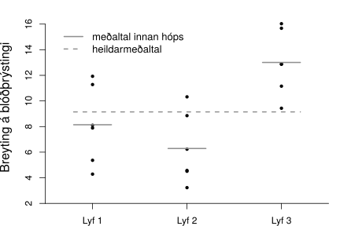

.. _c.fervikagreining:

Fervikagreining
===============

Þið hafið séð ýmsar leiðir til að framkvæma tilgátupróf um meðaltöl
þýða. Í kafla :numref:`%s <c.alyktanirumtalnabreytur>` voru skoðaðar ályktanir
um meðaltal eins þýðis sem og hvernig bera má saman meðaltöl tveggja
þýða. Við skulum aðeins rifja upp tvíhliða tilgátuprófin í seinna
tilvikinu. Þá prófuðum við núlltilgátuna hvort meðaltal hópanna tveggja
sé ólíkt. Eðlileg útvíkkun á þeirri athugun væri að spyrja sig: Hvað ef
hóparnir væru fleiri? Í þeim tilvikum getum við ekki notað
:math:`t`-próf heldur styðjumst við við aðferð sem kallast
*fervikagreining* (e. analysis of variance eða ANOVA).

Fervikagreining er ein af mest notuðu aðferðunum innan tölfræðinnar og
til eru mörg tilbrigði hennar sem má laga að gífurlega mörgum ólíkum
tilfellum. Í þessari bók munum við einungis skoða eitt tilbrigði hennar
sem kallast *einhliða fervikagreining* (e. one-sided ANOVA). Henni beitum
við á gögn sem eru úrtök úr tveimur eða fleiri þýðum og er algengt að
nota orðið hópar þegar talað er um úrtökin. Aðferðin gengur út á að bera
saman breytileika á gildum mælinga milli hópa annars vegar og innan hópa
hins vegar. Út frá því er ályktað hvort meðaltölin séu ólík eða ekki.
Fervikagreining gerir ráð fyrir að úrtökin séu slembiúrtök, að þau séu
valin úr þýðum sem fylgja normaldreifingu og að dreifnin sé sú sama í
öllum þýðum.

Einþátta fervikagreining
------------------------

Við skulum byrja á því að skoða lítið dæmi þar sem fervikagreining er
framkvæmd til að draga ályktanir um blóðþrýstingslyf.

Lyfjafyrirtæki nokkurt er að þróa ný blóðþrýstingslyf og í því samhengi
var lítil tilraun framkvæmd. Átján einstaklingar tóku þátt í tilrauninni
og var þeim skipt tilviljunakennt upp í þrjá hópa. Hópur eitt fékk lyf
1, hópur tvö lyf 2 og hópur þrjú fékk lyf 3. Blóðþrýstingur fólksins var
mældur fyrir inntöku lyfsins og aftur eftir inntöku. Breytan sem við
höfum áhuga á er breyting á blóðþrýstingi fyrir og eftir inntöku
lyfsins. Meðalbreyting á blóðþrýstingi í hópunum þremur var reiknaður. Í
öllum hópunum hafði blóðþrýstingurinn lækkað að meðaltali.

.. math::
   \begin{aligned}
   \text{Meðalbreyting hópur 1:  } & \bar{x}_1 = 8.14\\
   \text{Meðalbreyting hópur 2:  } & \bar{x}_2 = 6.28\\
   \text{Meðalbreyting hópur 3:  } & \bar{x}_3 = 13.01\\\end{aligned}

Spurningin er nú hvort munur sé á lyfjunum. Það er hvort
blóðþrýstingurinn lækki mismikið milli hópa. Við sjáum auðveldlega að
meðaltölin hér að ofan eru ólík en eru þau nógu ólík til að við getum
fullyrt að lyfin valdi mismikilli lækkun?

Byrjum á að skoða mælingarnar okkar myndrænt, sjá mynd
:numref:`%s <g.fervikgogn>`. Á þeirri mynd má, auk mælinganna, sjá meðaltal
hvers hóps (heilar línur) og sameiginlegt meðaltal allra mælinganna
(brotalínur). Það er mikilvægt að dreifni hvers hóps fyrir sig sé ekki
mjög ólík þar sem aðferðin gerir ráð fyrir að hún sé sú sama. Í þessu
tilviki virðist dreifnin vera svipuð og því er viðeigandi að nota
einhliða fervikagreiningu.

.. _g.fervikgogn:

    Gögn fyrir fervikagreiningu 

Fervikagreining gengur út á að skipta heildarbreytileika á gildum
mælinganna upp í breytileika milli hópanna annars vegar og breytileika
innan hópanna hins vegar. Til þess reiknum við út svokallaðar
*fervikasummur*.

Fervikasummur
~~~~~~~~~~~~~

Áður en við skoðum fervikasummurnar þurfum við að kynna nýjan rithátt
til sögunnar sem algengt er að nota þegar unnið er með fervikagreiningu.

Ritháttur notaður í fervikagreiningu
^^^^^^^^^^^^^^^^^^^^^^^^^^^^^^^^^^^^

.. attention::

    Eftirfarandi ritháttur er algengur í kennslubókum og ritum sem fjalla um
    fervikagreiningu.
    
        | :math:`y_{ij}:` Við notum vísinn :math:`i` til að tákna númer hóps og vísinn :math:`j` til að tákna númer mælingu
        |       innan hóps. :math:`y_{ij}` er því mæling númer :math:`j` úr hópi :math:`i`.
        
        | :math:`a:` Við notum :math:`a` til að tákna fjölda hópa.
        
        | :math:`n_i:` Við notum :math:`n_i` til að tákna fjölda mælinga í hópi :math:`i`.
        
        | :math:`N:` Við notum :math:`N` til að tákna heildarfjölda mælinga

        .. math:: N = n_1 + n_2 + ... + n_a
        
        | :math:`\bar{y}_{i.}:` Við notum :math:`\bar{y}_{i.}` til að tákna meðaltal fyrir hóp :math:`i`
        
        .. math::
           \bar{y}_{i.} = \frac{\sum_{j=1}^{n_i} y_{ij}}{n_i}
           :label: eq.medaltalinnanhopa
        
        | :math:`\bar{y}_{..}:` Við notum :math:`\bar{y}_{..}` til að tákna meðaltal allra mælinga (úr öllum hópum)
        
        .. math::
           \bar{y}_{..} = \frac{\sum_{i=1}^{a}\sum_{j=1}^{n_i}y_{ij}}{N}
           :label: eq.heildamedaltal

--------------

Við þurfum að reikna þrjár fervikasummur og eru þær táknaðar með
:math:`SS_T`, :math:`SS_{Tr}` og :math:`SS_E`. :math:`SS_{T}` er
heildarfervikasumman og er hún mælikvarði á heildarbreytileika gagnanna
(e. total variation). :math:`SS_{Tr}` er mælikvarði á breytileika milli
hópanna (e. between treatments) þ.e. hversu breytileg eru meðaltöl hópanna.
:math:`SS_E` er mælikvarði á breytileika innan hópanna (e. within
treatments eða error) það er að segja hversu mikið víkja mælingar innan
hvers hóps frá meðaltali hópsins.

Fervikasummur í einhliða fervikagreiningu (Sums of squares in one-sided ANOVA)
^^^^^^^^^^^^^^^^^^^^^^^^^^^^^^^^^^^^^^^^^^^^^^^^^^^^^^^^^^^^^^^^^^^^^^^^^^^^^^

.. attention::

    Fervikasummurnar eru reiknaðar með
    
    .. math::
       \begin{aligned}
       SS_T = & \sum_{i = 1}^{a}  \sum_{j = 1}^{n_i} (y_{ij} - \bar{y}_{..})^2\end{aligned}
       :label: eq.sst
    
    .. math::
       \begin{aligned}
       SS_{Tr} = & \sum_{i = 1}^{a} n_i (\bar{y}_{i.} - \bar{y}_{..})^2\end{aligned}
       :label: eq.sstr
    
    .. math::
       \begin{aligned}
       SS_E = & \sum_{i = 1}^{a}  \sum_{j = 1}^{n_i} (y_{ij} - \bar{y}_{i.})^2\end{aligned}
       :label: eq.sse
    
    Heildarbreytileikanum má skipta upp í breytileika milli hópanna annars
    vegar og breytileika innan hópanna hins vegar eða
    
    .. math::
       SS_T = SS_{Tr} + SS_E
       :label: eq.anovauppskipting

--------------

Til að skilja jöfnur :eq:`eq.sst` - :eq:`eq.sse` betur skulum við skoða
mynd :numref:`%s <g.fervikasummur>`. Á grafinu efst í vinstra horninu má sjá
mælingarnar, :math:`y_{ij}`, meðaltöl innan hópanna,
:math:`\bar{y}_{i.}`, (heilar línur) og heildarmeðaltalið,
:math:`\bar{y}_{..}`, (brotalína). Hinar myndirnar þrjár lýsa myndrænt
hvernig reikna á :math:`SS_T, SS_{Tr}` og :math:`SS_E`. Þeir liðir sem
jöfnurnar innihalda eru teiknaðir svartir en hinir liðirnir, sem
jöfnurnar innihalda ekki, eru gráir.

.. _g.fervikasummur:

.. figure:: myndir/SSutskyringar.svg
    :align: center
    :alt: Fervikasummur 

    Fervikasummur 

Sé jafna :eq:`eq.sst` og myndin efst í hægra horninu skoðuð má sjá að
:math:`SS_T` inniheldur fjarlægðir mælinganna okkar frá
heildarmeðaltalinu og er því mælikvarði á heildarbreytileika mælinganna.
Sé jafna :eq:`eq.sstr` og myndin neðst í vinstra horninu skoðuð má sjá
að :math:`SS_{Tr}` inniheldur fjarlægðir meðaltala hópanna frá
heildarmeðaltalinu og er því mælikvarði á breytileika meðaltalanna milli
hópanna. Sé að lokum jafna :eq:`eq.sse` skoðuð og myndin neðst í hægra
horninu má sjá að :math:`SS_E` inniheldur fjarlægðir mælinganna frá
meðaltali þess hóps sem þær tilheyra og er því mælikvarði á breytileika
mælinganna innan hvers hóps.

Algengt er að setja kvaðratsummurnar upp í svokallaða
*fervikagreiningartöflu* (e. ANOVA table). Sú tafla samanstendur af þremur
dálkum og þremur línum. Fyrsti dálkurinn inniheldur fervikasummurnar
(reiknaðar með jöfnum :eq:`eq.sst` - :eq:`eq.sse`). Annar dálkurinn
inniheldur fjölda *frígráða* fyrir hverja fervikasummu fyrir sig en það
heiti bera stærðirnar :math:`a-1`, :math:`N-a` og :math:`N-1`. Þriðji
dálkurinn inniheldur svokallaðar meðalfervikasummur. Þær reiknum við með
því að deila viðkomandi fervikasummu með fjölda frígráða sem henni
tilheyra (í sömu línu). Dæmigerða fervikasummutöflu má sjá hér að neðan.

+-------------------+-----------------+-------------------------------------------+
| Fervikasummur     | Frígráður       | Meðalfervikasummur                        |
+===================+=================+===========================================+
| :math:`SS_{Tr}`   | :math:`a - 1`   | :math:`MS_{Tr} = \frac{SS_{Tr}}{a - 1}`   |
+-------------------+-----------------+-------------------------------------------+
| :math:`SS_E`      | :math:`N - a`   | :math:`MS_E = \frac{SS_E}{N - a}`         |
+-------------------+-----------------+-------------------------------------------+
| :math:`SS_T`      | :math:`N - 1`   |                                           |
+-------------------+-----------------+-------------------------------------------+

Tilgátupróf í fervikagreiningu
~~~~~~~~~~~~~~~~~~~~~~~~~~~~~~

Tilgátuprófið sem við notum í fervikagreiningu gerir ráð fyrir að
dreifnin í hópunum sé sú sama. Áður en við framkvæmum prófið þurfum við
því að kanna hvort gögnin okkar uppfylli það skilyrði. Það eru til próf
sem kanna þetta formlega, svo sem Levene próf en hér munum við láta
okkur nægja að skoða gögnin myndrænt og út frá því álykta hvort gera
megi ráð fyrir að dreifni hópanna sé sú sama.

Tilgátupróf fyrir einhliða fervikagreiningu
^^^^^^^^^^^^^^^^^^^^^^^^^^^^^^^^^^^^^^^^^^^

.. attention::

    Tilgátan sem við viljum kanna er almennt
    
    .. math:: H_0: \mu_1 = \mu_2 = ... =  \mu_a
    
    á móti gagntilgátunni
    
    .. math:: H_1: \text{Að minnsta kosti eitt meðaltal er frábrugðið hinum}
    
    Prófstærðin er
    
    .. math::
       F = \frac{SS_{Tr}/(a-1)}{SS_{E}/(N-a)} = \frac{MS_{Tr}}{MS_E}
       :label: eq.anovaprof
    
    þar sem :math:`SS_{Tr}` og :math:`SS_{E}` má reikna með jöfnum
    :eq:`eq.sstr` og :eq:`eq.sse`. Sé núlltilgátan sönn fylgir prófstærðin
    F-dreifingu með :math:`a-1` og :math:`N-a` fjölda fríráða, eða
    :math:`F \sim F_{(a-1,N-a)}`, þar sem :math:`a` er fjöldi hópa og
    :math:`N` er heildarfjöldi mælinga.
    
    Hafna skal :math:`H_0` ef :math:`F > F_{1-\alpha,(a-1,N-a)}`.
    
    Sé núlltilgátunni hafnað er a.m.k. eitt meðaltalanna frábrugðið hinum.

--------------

Eins og sjá má hér að ofan er gagntilgátan sú að að minnsta kosti eitt
meðaltal sé frábrugðið hinum. Það eru því einu upplýsingarnar sem við
fáum þegar núlltilgátunni er hafnað. Við vitum ekki hvert meðaltalanna
er frábrugðið hinum eða hvort þau séu mögulega öll frábrugðin hvort
öðru. Það þarf að framkvæma frekari greiningu til að komast að því.
Algeng próf eru Tukey’s próf og Duncan’s próf en ekki verður fjallað um
þau hér.

Í upphafi kaflans sögðum við að fervikagreining gengi út á að bera saman
breytileika milli hópa og breytileika innan hópa. Sé jafna
:eq:`eq.anovaprof` skoðuð má sjá að teljari prófstærðarinnar (fyrir ofan
strik) er mælikvarði á breytileika milli hópanna og nefnarinn (fyrir
neðan strik) er mælikvarði á breytileika innan hópanna. Sé þetta
hlutfall nægilega hátt, fellur það á höfnunarsvæðið og við ályktum að
meðaltölin séu ólík.

Sýnidæmi: Fervikagreining
^^^^^^^^^^^^^^^^^^^^^^^^^

.. tip::

    Skoðum dæmið um blóðþrýstingslyfin. Gögnin má sjá hér að neðan.
    
    +---------+---------+---------+
    | Lyf 1   | Lyf 2   | Lyf 3   |
    +=========+=========+=========+
    | 4.29    | 10.32   | 12.89   |
    +---------+---------+---------+
    | 11.28   | 3.23    | 15.68   |
    +---------+---------+---------+
    | 5.37    | 4.51    | 16.03   |
    +---------+---------+---------+
    | 7.89    | 4.57    | 9.43    |
    +---------+---------+---------+
    | 8.10    | 8.85    | 12.86   |
    +---------+---------+---------+
    | 11.93   | 6.23    | 11.15   |
    +---------+---------+---------+
    
    Kannið með viðeigandi tilgátuprófi hvort munur sé á meðalblóðþrýstingi
    eftir lyfjum.
    
    Förum nú eftir samantektinni um framkvæmd tilgátuprófa.
    
    #) Við ætlum að álykta um mun á meðaltölum þriggja þýða. Úrtökin eru
       **óháð**. Sé mynd :numref:`%s <g.fervikgogn>` skoðuð má sjá að dreifni
       hópanna er svipuð og því óhætt að nota fervikagreiningu.
    
    #) Við notum :math:`\alpha = 0.05` að venju.
    
    #) Tilgáturnar eru
    
       .. math:: H_0: \mu_1 = \mu_2 = \mu_3
    
       og
    
       .. math:: H_1: \text{a.m.k. eitt meðaltal er frábrugðið hinum.}
    
    #) Áður en við reiknum prófstærðina þurfum við að reikna
       fervikasummurnar.
    
       Þar sem hóparnir eru 3 er :math:`a = 3`. Það eru sex mælingar í
       hverjum hóp og því er :math:`n_1 = n_2 = n_3 = 6` og því er
       :math:`N = 6 + 6 + 6 = 18`. Reiknum nú heildarmeðaltalið með jöfnu
       :eq:`eq.heildamedaltal`
    
       .. math:: \bar{y}_{..} = \frac{\sum_{i=1}^{a}\sum_{j=1}^{n_i}y_{ij}}{N} = \frac{4.29+10.32+12.89+11.28+...+11.15}{18} = 9.15
    
       og meðaltöl innan hópanna með jöfnu :eq:`eq.medaltalinnanhopa`
    
       .. math:: \bar{y}_{1.} = \frac{\sum_{j=1}^{n_1} y_{1j}}{n_1} = \frac{4.29+11.28+...+11.93}{6} = 8.14,
    
       .. math:: \bar{y}_{2.} = \frac{\sum_{j=1}^{n_2} y_{2j}}{n_2} = \frac{10.32+3.23+...+6.23}{6} = 6.29,
    
       .. math:: \bar{y}_{3.} = \frac{\sum_{j=1}^{n_3} y_{3j}}{n_3} = \frac{12.89+15.68+...+11.15}{6} = 13.01
    
       Þá erum við tilbúin til að reikna fervikasummurnar. Við byrjum á að
       reikna :math:`SS_T` með jöfnu :eq:`eq.sst`
    
       .. math::
          \begin{aligned}
          SS_T = & \sum_{i = 1}^{a}  \sum_{j = 1}^{n_i} (y_{ij} - \bar{y}_{..})^2 \\
          = & (4.29-9.15)^2 + (11.28-9.15)^2 + ... + (11.15-9.15)^2 =  262.16 \end{aligned}
    
       Reiknum svo :math:`SS_{Tr}` með jöfnu :eq:`eq.sstr`
    
       .. math::
          \begin{aligned}
          SS_{Tr} = & \sum_{i = 1}^{a} n_i (\bar{y}_{i.} - \bar{y}_{..})^2 \\
          = & 6\cdot(8.14 - 9.15)^2 + 6\cdot(6.29 - 9.15)^2 + 6\cdot(13.01 - 9.15)^2 = 144.53 \end{aligned}
    
       Að lokum getum við reiknað :math:`SS_E` með hjálp jöfnu
       :eq:`eq.anovauppskipting`
    
       .. math:: SS_E = SS_{T} - SS_{Tr} = 117.63
    
       Setjum nú fervikasummurnar í fervikagreiningartöflu:
    
       +----------------------------+----------------------+---------------------------+
       | Fervikasummur              | Frígráður            | Meðalfervikasummur        |
       +============================+======================+===========================+
       | :math:`SS_{Tr}` = 144.53   | :math:`a - 1` = 2    | :math:`MS_{Tr} = 72.27`   |
       +----------------------------+----------------------+---------------------------+
       | :math:`SS_E` = 117.63      | :math:`N - a` = 15   | :math:`MS_E = 7.84`       |
       +----------------------------+----------------------+---------------------------+
       | :math:`SS_T` = 262.16      | :math:`N - 1` = 17   |                           |
       +----------------------------+----------------------+---------------------------+
    
       Til að kanna tilgátuna setjum við inn í prófstærðina í jöfnu
       :eq:`eq.anovaprof`
    
       .. math:: f = \frac{72.27}{7.84} = 9.21
    
    #) Við þurfum að finna höfnunarsvæðið og notum við til þess F-töflu. Við
       flettum upp eftir :math:`a - 1` = 2 og :math:`N - a` = 15 frígráðum.
       :math:`F_{1-\alpha,((a-1),(N-a))}` = :math:`F_{0.95,(2,15)}` = 3.68.
       Við sjáum að :math:`f > 3.68` og því lendir prófstærðin á
       höfnunarsvæði.
    
    #) Við höfnum núlltilgátunni og ályktum að a.m.k. eitt lyfjanna sé
       frábrugðið hinum.

Dæmi
----

Dæmi
~~~~

Tóti tölfræðingur ætlar að bera saman meðaltöl fjögurra hópa með því að
nota fervikagreiningu. Hann hefur 8 mælingar í hverjum hópi. Hann ætlar
að nota :math:`\alpha = 0.05`. Hvert er höfnunarsvæðið?

Dæmi
~~~~

Neytendasamtökin ákváðu að standa fyrir rannsókn þar sem þrjár
mismunandi tegundir af lyftidufti voru bornar saman í þeim tilgangi að
athuga hvort munur væri á lyftiduftunum. Rannsóknin fór þannig fram að
fimm mismunandi uppskriftir voru notaðar sem allar innihéldu lyftiduft
og voru þær allar bakaðar með mismunandi lyftiduftstegundum. Rúmmál
kakanna var í lokinn mælt og skráð í töflu. Niðurstöðurnar voru
eftirfarandi:

+---------------+---------------+---------------+
| Lyftiduft 1   | Lyftiduft 2   | Lyftiduft 3   |
+===============+===============+===============+
| 83            | 65            | 92            |
+---------------+---------------+---------------+
| 90            | 82            | 102           |
+---------------+---------------+---------------+
| 96            | 90            | 106           |
+---------------+---------------+---------------+
| 83            | 65            | 82            |
+---------------+---------------+---------------+
| 77            | 72            | 97            |
+---------------+---------------+---------------+

Eftirfarandi stærðir voru einnig reiknaðar: :math:`SS_{T} = 2149.73` og
:math:`SS_{Tr} = 1103.33`. Kannið með viðeigandi tilgátuprófi hvort
munur sé á lyftiduftunum. Notið :math:`\alpha = 0.05`.

Dæmi
~~~~

Kennslufræðingur nokkur ákvað að gera könnun á hvort munur sé á lærdómi
eftir bakgrunnshljóðum. Hún skipti 24 nemendum tilviljunarkennt upp í
þrjá hópa og fengu þeir allir texta til að lesa í 30 mínútur. Fyrsti
hópurinn las textann á meðan spilaður var tónn við sama styrk í þessar
30 mínútur. Hópur númer tvö las textann á meðan hljóð við misjafnan
styrk var spilað. Þegar þriðji hópurinn las textann var ekkert
bakgrunnshljóð. Að loknum þessum 30 mínútum var lagt próf fyrir
nemendurna og niðurstöðurnar skráðar. Að þessu loknu reiknaði
kennslufræðingurinn fervikasummurnar út en náði ekki að klára að fylla
út fervikasummutöfluna. Kannið hvort munur sá á lærdómi eftir
bakgrunnshljóðum. Notið :math:`\alpha = 0.05`.

+--------------+----------------+-------------+---------------------+
|              | Fervikasumma   | Frígráður   | Meðalfervikasumma   |
+==============+================+=============+=====================+
| Milli hópa   | 30.08          |             |                     |
+--------------+----------------+-------------+---------------------+
| Innan hópa   |                |             |                     |
+--------------+----------------+-------------+---------------------+
| Heild        | 117.96         |             |                     |
+--------------+----------------+-------------+---------------------+

Dæmi
~~~~

Linda lífefnafræðingur ætlar að bera saman meðaltöl 3 hópa og ákvað því
að framkvæma fervikagreiningu. Linda byrjaði á að fylla út
fervikasummutöflu en náði ekki að klára hana. Töfluna má sjá hér að
neðan.

+--------------+----------------+-------------+---------------------+
|              | Fervikasumma   | Frígráður   | Meðalfervikasumma   |
+==============+================+=============+=====================+
| Milli hópa   | 112.17         |             |                     |
+--------------+----------------+-------------+---------------------+
| Innan hópa   |                |             | xxx                 |
+--------------+----------------+-------------+---------------------+
| Heild        | 223.91         | 23          |                     |
+--------------+----------------+-------------+---------------------+

a) Hvaða gildi á að standa þar sem stendur xxx í töflunni?

#) Hvert er gildið á prófstærð Lindu lífefnafræðings?
