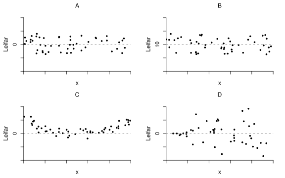
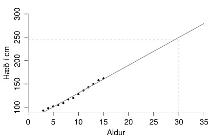

.. _c.adhvarfsgreining:

Aðhvarfsgreining
================

Umfjöllunarefni þessa kafla er *aðhvarfsgreining* (e. regression).
Aðhvarfsgreining er gífurlega almenn aðferð sem er notuð til að kanna
samband *háðrar breytu* (e. dependent variable) og einnar eða fleiri
*óháðra breyta* (e. independent variables). Sé óháða breytan aðeins ein er
talað um *einfalt línulegt aðhvarf* (e. simple linear regression) en séu
þær fleiri er talað um *fjölþætt línulegt aðhvarf* (e. multiple linear
regression). Við munum einungis fjalla um einfalt línulegt aðhvarf í
þessari bók.

Með einföldu línulegu aðhvarfi viljum við finna jöfnu þeirra línu (sjá
kassa :numref:`%s <em.jafnabeinnarlinu>` í kafla :numref:`%s <c.lysanditolfraedi>`) sem
lýsir best sambandi tveggja breyta og metur hversu gott það mat er.
Stundum má áætla að orsakasamband sé á milli breytanna tveggja og þá er
svarbreytan alltaf háða breytan en skýribreytan sú óháða (sjá kassa
:numref:`%s <em.svarbreyturogskyribreytur>` í kafla :numref:`%s <s.breytur>`). Það er
umdeilt að nota línulega aðhvarfsgreiningu þegar ekki er orsakasamband
milli breytanna og munum við því ekki taka dæmi um slíkt. Við munum gera
ráð fyrir að það sé orsakasamband á milli breytanna og því getum við
talað um háðu breytuna sem svarbreytu og þá óháðu sem skýribreytu.

Það gefur að skilja að það er lítið vit í að framkvæma línulegt aðhvarf
nema sambandi breytanna sé yfir höfuð hægt að lýsa með beinni línu.
Fyrsta skrefið í allri aðhvarfsgreiningu ætti því ætíð að vera að skoða
*punktarit* af breytunum (kafli :numref:`%s <s.punktarit>`) til að kanna hvort
svo sé. Ef okkur sýnast punktarnir þyrpast í kringum einhverja beina
línu er sambandið línulegt. Ef við sjáum skýr merki um sveigjur í
punktaritinu getur sambandið ekki verið línulegt.

.. _s.einfaltadhvarf:

Einfalt línulegt aðhvarf
------------------------

Einfalt línulegt aðhvarf
~~~~~~~~~~~~~~~~~~~~~~~~

Byrjum á því að rifja aftur upp dæmi :numref:`%s <ex.bjor>` þar sem Þorgerður og
Birna könnuðu samband bjórdrykku og áfengismagns í blóði. Markmið
línulegrar aðhvarfsgreiningar væri að meta jöfnu línu sem lýsir sambandi
bjórdrykku og áfengismagnsins í blóðinu sem og að meta hversu
áreiðanlegt þetta samband sé.

.. figure:: myndir/bjor1.svg
    :align: center
    :alt: Mynd

Í einföldu línulegu aðhvarfi göngum við út frá því að skýribreytan sé
*föst* (e. fixed), það er að segja að skýribreytan sé ekki slembin
(e. random). Við getum líka orðað það sem svo að við trúum því að það sé
engin óvissa í mælingum okkar á skýribreytunni. Svarbreytan er hins
vegar slembin og dreifing hennar er háð :math:`x`. Við notum :math:`Y`
til að tákna svarbreytuna og :math:`x` til að tákna skýribreytuna. Í
dæminu um bjórdrykkjuna útleggst það svo að engin óvissa sé fólgin í því
hversu marga bjóra hver og einn einstaklingur drakk, en hins vegar geti
verið óvissa fólgin í því hversu mikið áfengismagn í blóði mælist í
kjölfarið.

Aðhvarfslína (e. regression line) er bein lína sem lýsir því hvernig
svarbreytan :math:`Y` breytist þegar skýribreytan :math:`x` breytist.
Aðhvarfslínan er oft notuð til að *spá* (e. predict) fyrir um það hvaða
gildi :math:`Y` mun taka fyrir gefið gildi á :math:`x`. Þegar við notum
aðhvarfslínuna til að spá fyrir um gildi á :math:`Y` þá táknum við
spágildin með :math:`\hat{y}`, lesið :math:`y`-hattur. Í dæminu okkar
spáir aðhvarfslínan fyrir um hve mikið áfengismagn mun mælast í blóði
eftir að tiltekinn fjöldi bjóra hefur verið drukkinn.

Aðhvarfsgreiningarlíkanið (simple linear regression model)
^^^^^^^^^^^^^^^^^^^^^^^^^^^^^^^^^^^^^^^^^^^^^^^^^^^^^^^^^^

.. attention::

    *Einfalda aðhvarfsgreiningarlíkanið* (e. simple linear regression model) má
    skrifa sem
    
    .. math::
       Y = \beta_0 + \beta_1 x + \varepsilon
       :label: eq.adhvarfslikan
    
    þar sem :math:`\beta_0` og :math:`\beta_1` eru óþekktir stikar og
    :math:`\varepsilon` er normaldreifð slembistærð með meðaltal 0.

--------------

Skoðum nú aftur jöfnu :eq:`eq.adhvarfslikan`. Við sjáum að
:math:`\beta_0` er skurðpunktur línunnar við y-ásinn og :math:`\beta_1`
er hallatala línunnar. Þetta eru hin sanna hallatala og skurðpunktur sem
við ekki þekkjum og eru stikarnir oft kallaðir þýðishallatala og
þýðisskurðpunktur. Við getum aftur á móti tekið úrtak og notað gögnin
til að meta þá. Til að meta stikana :math:`\beta_0` og :math:`\beta_1`
framkvæmum við því tilraun og söfnum saman gögnum fyrir :math:`Y` og
:math:`x` og notum þau til að meta stikana.

Skoðum nú aftur bjórdæmið. Þar var safnað saman gögnum um áfengismagn í
blóði og fjölda drukkinna bjóra. Út frá þessum gögnum má meta stikana í
aðhvarfslíkani sem lýsir sambandi áfengismagns í blóði og fjölda
drukkinna bjóra. Á mynd :numref:`%s <g.beinarlinur>` má sjá gögnin úr dæminu en
á myndina er einnig búið að setja nokkrar línur sem hafa ólíka
skurðpunkta og hallatölur.

.. _g.beinarlinur:

.. figure:: myndir/linur.svg
    :align: center
    :alt: Margar línur en hvaða lína er best? 

    Margar línur en hvaða lína er best? 

Með því að skoða myndina er alls ekki augljóst hvaða línu er best að
nota til að lýsa sambandi :math:`Y` og :math:`x`. Við þurfum því
eitthvert viðmið til að ákveða hvaða lína er best. Það viðmið sem við
notum er *aðferð minnstu kvaðrata*.

Aðferð minnstu kvaðrata
~~~~~~~~~~~~~~~~~~~~~~~

Aðferð minnstu kvaðrata er algengasta aðferðin til að meta stikana í
aðhvarfsgreiningar líkaninu. Aðferðin finnur línunni stað þar sem summa
lóðréttar fjarlægðar milli einstakra punkta og línunar í öðru veldi er
lágmörkuð. Þessi fjarlægð er kölluð *leifar* (e. residuals) . Á mynd
:numref:`%s <g.leifar>` má aftur sjá gögnin frá dæmi :numref:`%s <ex.bjor>` ásamt línu
minnstu kvaðrata og leifunum sem merktar eru inn á myndina með örvum.

.. _g.leifar:

.. figure:: myndir/leifar.svg
    :align: center
    :alt: Aðferð minnstu kvaðrata 

    Aðferð minnstu kvaðrata 

Jafna aðhvarfslínu minnstu kvaðrata (least squares equation)
^^^^^^^^^^^^^^^^^^^^^^^^^^^^^^^^^^^^^^^^^^^^^^^^^^^^^^^^^^^^

.. attention::

    Gerum ráð fyrir að við höfum :math:`n` paraðar mælingar
    :math:`(x_i,y_i)` þar sem gera má ráð fyrir að aðhvarf :math:`Y` á
    :math:`x` sé línulegt. Táknum meðaltal og staðalfrávik :math:`x`
    breytunnar með :math:`\bar{x}` og :math:`s_x` og :math:`y` breytunnar
    með :math:`\bar{y}` og :math:`s_y`. Fylgnina á milli :math:`x` og
    :math:`y` táknum við með :math:`r`. Notum :math:`b_0` til að tákna mat á
    :math:`\beta_0` og :math:`b_1` til að tákna mat á :math:`\beta_1`. Þá
    reiknum við :math:`b_0` og :math:`b_1` með
    
    .. math::
       b_1 = r \frac{s_y}{s_x}
       :label: eq.beta1
    
    og
    
    .. math::
       b_0 = \bar{y} -  b_1 \bar{x}
       :label: eq.beta0
    
    Við notum stikana :math:`b_0` og :math:`b_1` til að smíða jöfnuna
    
    .. math::
       \hat{y} =  b_0 +  b_1x
       :label: eq.spay
    
    sem við notum til að *spá* (e. predict) fyrir um hvert gildið á :math:`y`
    verður fyrir þekkt gildi á :math:`x`.

--------------

.. _ex.bjorjafna:

Sýnidæmi: Einfalt línulegt aðhvarf
^^^^^^^^^^^^^^^^^^^^^^^^^^^^^^^^^^

.. tip::

    Skoðum aftur gögnin úr dæmi :numref:`%s <ex.bjor>`. Finnið jöfnu
    aðhvarfslínunnar með því að nota aðferð minnstu kvaðrata.
    
    Út frá gögnunum má reikna:
    
    .. math::
       \bar{x} = 4.813, \; \; s_x = 2.198, \; \; \bar{y} = 0.074, \; \; s_y = 0.044, \; \;
       r = 0.894
    
    Þá getum við reiknað
    
    .. math:: b_1 = r\frac{s_y}{s_x} = 0.894 \cdot \frac{0.044}{2.198} = 0.018
    
    og
    
    .. math:: b_0 = \bar{y} -  \beta_1 \bar{x} = 0.074 - (0.018 \cdot 4.813) = - 0.013
    
    Jafna minnstu kvaðrata er þá
    
    .. math:: \hat{y} = -0.013 + 0.018x

Leifar
~~~~~~

Leifar (residuals)
^^^^^^^^^^^^^^^^^^

.. attention::

    Lóðrétta fjarlægðin frá mælingunum okkar að aðhvarfslínunni köllum við
    *leifar* og táknum með :math:`e`. Stærð leifa má reikna með
    
    .. math:: e_i = y_i - \hat{y}_i
    
    Punktar ofan aðhvarfslínunnar hafa jákvæða leif en punktar neðan hennar
    neikvæða.

--------------

.. note::

    Ef punktur lendir ofan við aðhvarfslínuna er :math:`y` gildið stærra en
    aðhvarfslínan spáir fyrir um. Þá er leifin jákvæð. Ef punktur lendir
    neðan við aðhvarfslínuna er :math:`y` gildið minna en aðhvarfslínan
    spáir fyrir um. Þá er leifin neikvæð.

--------------

Leifar segja okkur hversu vel aðhvarfslínan lýsir gögnunum. Því skal
alltaf skoða leifarnar að lokinni aðhvarfsgreiningu en til þess notum
við *leifarit* (e. residual plot). Leifaritið sýnir leifarnar á y-ásnum og
skýribreytuna á x-ásnum. Fleiri tegundir leifarita eru til en við látum
þetta nægja hér. Vinstra megin á mynd :numref:`%s <g.leifarit>` má sjá punktarit
af gögnunum úr dæmi :numref:`%s <ex.bjor>` ásamt aðhvarfslínunni. Hægra megin á
myndinni má sjá leifarit fyrir sömu gögn. Takið eftir að x-ásinn er því
sá sami og er á punktaritinu en y-ásinn ekki.

.. _g.leifarit:

.. figure:: myndir/bjor2.svg
    :align: center
    :alt: Punktarit af gögnum og leifarit 

    Punktarit af gögnum og leifarit 

Dreifing leifanna á að vera tilviljunarkennd umhverfis 0. Enga reglu á
að sjá í leifunum. Séu þessi skilyrði brotin skal ekki nota
aðhvarfslíkanið til að lýsa gögnunum. Skoðum nú mynd :numref:`%s <g.leifarit2>`
þar sem sjá má fjögur leifarit.

A. Hér eru leifarnar dreifðar tilviljunarkennt kringum núll.
   Allt er eins og það á að vera.

B. Hér eru leifarnar dreifðar tilviljunarkennt en ekki kringum núll.
   Ekki ásættanlegt.

C. Hér fylgja leifarnar bogadregnu mynstri. Það bendir til þess að samband :math:`Y` og :math:`x` sé ekki línulegt.
   Ekki ásættanlegt.

D. Leifarnar eru ekki dreifðar tilviljunarkennt. Dreifni leifanna virðist aukast með hærri gildum á :math:`x`.
   Ekki ásættanlegt.

.. _g.leifarit2:

    Leifarit 

Brúun og bryggjun
~~~~~~~~~~~~~~~~~

Við getum notað jöfnu aðhvarfslínunnar, jöfnu :eq:`eq.spay`, til að spá
fyrir um hvaða gildi :math:`Y` mun taka fyrir ákveðið gildi á :math:`x`.
Áður en það er gert skal skoða á hvaða bili :math:`x`-gildin sem við
notuðum til að meta líkanið liggja. Það getur nefnilega verið mjög
vafasamt að nota jöfnu aðhvarfslínunnar til að spá fyrir um gildi á
:math:`Y` fyrir gildi á :math:`x` sem eru ekki á sama reki og
:math:`x`-gildin sem notuð voru til að meta stikana í líkaninu.

Brúun (interpolation)
^^^^^^^^^^^^^^^^^^^^^

.. attention::

    Sé aðhvarfslíkan notað til að spá fyrir um gildi á :math:`Y` fyrir
    eitthvert gildi á :math:`x` sem er á sama reki og :math:`x`-gildin sem
    notuð voru til að meta stikana í líkaninu er talað um að *brúa*.

--------------

Sýnidæmi: Brúun
^^^^^^^^^^^^^^^

.. tip::

    Skoðum nú aftur gögnin úr dæmi :numref:`%s <ex.bjor>`. Spáið fyrir um
    áfengismagn í blóði einstaklings sem drukkið hefur 6.5 bjóra.
    
    Við sáum í dæmi :numref:`%s <ex.bjorjafna>` að jafna minnstu kvaðrata er
    
    .. math:: \hat{y} = -0.013 + 0.018x
    
    Enginn í rannsókninni drakk 6.5 bjóra en rannsóknin náði yfir
    einstaklinga sem drukkið höfðu frá einum og upp í níu bjóra. 6.5 liggur
    á því bili og því erum við að brúa þegar við notum aðhvarfslínuna til að
    spá fyrir um áfengismagnið. Við setjum 6.5 inn í stað :math:`x` í
    jöfnunni hér að ofan og fáum að
    
    .. math:: \hat{y} = -0.013 + (0.018 \cdot 6.5) = 0.104
    
    Við spáum því að manneskja sem drekki 6.5 bjóra mælist með alkohólmagn
    0.104.
    
    .. figure:: myndir/bruun.svg
        :align: center
        :alt: Mynd

Bryggjun (extrapolation)
^^^^^^^^^^^^^^^^^^^^^^^^

.. attention::

    Sé aðhvarfslíkan notað til að spá fyrir um gildi á :math:`Y` fyrir
    eitthvert gildi á :math:`x` sem er **fjarri** þeim :math:`x`-gildum sem
    notuð voru til að meta stikana í líkaninu er talað um að *bryggja*.
    Þetta svarar til að lengja aðhvarfslínuna. Það getur verið mjög vafasamt
    að bryggja!

--------------

Á mynd :numref:`%s <g.bryggjun>` má sjá niðurstöður mælinga á hæð drengja á
aldrinum 3-15 ára. Sjá má á myndinni að aðhvarfslínan lýsir vel sambandi
hæðar og aldurs drengja á bilinu 3-15 ára og væri því hægt að nota
líkanið til að spá fyrir um hæð drengja á þeim aldri. Hins vegar væri
rangt að nota líkanið til að spá fyrir um hæð drengja á aldri sem ekki
liggur á bilinu 3-15 ára. Sé myndin skoðuð má til dæmis sjá að líkanið
okkar spáir því að 30 ára gamall maður sé tæplega 250 cm á hæð! Hér erum
við að nota líkanið til að spá fyrir um :math:`Y`-gildi fyrir
:math:`x`-gildi sem liggur fjarri upphaflegu :math:`x` gildanna. Því
erum við að bryggja og það ber ávallt að varast!

.. _g.bryggjun:

    Bryggjun 

Skýringarhlutfall
~~~~~~~~~~~~~~~~~

Munið að fylgni segir okkur til um stefnu og styrkleika línulegs
sambands tveggja breyta en ekki hvert sambandið milli breytanna er.
Fylgnistuðull hefur hins vegar beina tengingu inn í línulega
aðhvarfsgreiningu, því með honum má reikna *skýringarhlutfall* (e. R
squared).

.. _em.skyringarhlutfall:

:math:`r^2` í aðhvarfsgreiningu
^^^^^^^^^^^^^^^^^^^^^^^^^^^^^^^

.. attention::

    Sé fylgnistuðullinn settur í annað veldi, :math:`r^2`, er talað um
    skýringarhlutfall. :math:`r^2` stendur fyrir hlutfallslegan breytileika
    í :math:`Y` sem er hægt að skýra út með breytingum á :math:`x`.

--------------

Sýnidæmi: Skýringarhlutfall
^^^^^^^^^^^^^^^^^^^^^^^^^^^

.. tip::

    Skoðum aftur dæmi :numref:`%s <ex.bjorjafna>`. Hversu mikið af breytileika í
    áfengismagni má skýra út með fjölda drukkinna bjóra?
    
    Við sáum áður að í tilrauninni var fylgnistuðullinn :math:`r` = 0.894.
    Því fáum við að :math:`r^2 = 0.894^2 = 0.799.` Því má segja að um 80% af
    breytileika í alkóhólmagni megi skýra með fjölda drukkinna bjóra.

Útlagar og áhrifamikil mæligildi
~~~~~~~~~~~~~~~~~~~~~~~~~~~~~~~~

Útlagi (kassi :numref:`%s <em.utlagar>`) er mæligildi sem er ólíkt öðrum
mæligildum í safninu. Mæligildi þar sem :math:`y` gildið er frábrugðið
hinum :math:`y` gildunum hefur háa leif. Aðrir útlagar eru ekki endilega
með háa leif . Á mynd :numref:`%s <g.utlagarogleifar>` má sjá tvo útlaga.
Útlaginn á myndinni til vinstri er með háa leif en útlaginn hægra megin
ekki.

.. _g.utlagarogleifar:

.. figure:: myndir/utlagarleif.svg
    :align: center
    :alt: Útlagar og leifar þeirra 

    Útlagar og leifar þeirra 

Mæligildi er sagt *áhrifaríkt* (e. influential) ef útkoma útreikninga
breytist mikið við það að fjarlægja það úr gagnasafninu. Mæligildi þar
sem :math:`x` gildið er frábrugðið hinum :math:`x` gildunum (og er þar
af leiðandi útlagi) er oft áhrifaríkt.

Skoðum nú mynd :numref:`%s <g.ahrifamikil>`. Á myndinni vinstra megin má sjá
útlaga. Gráa brotalínan er aðhvarfslínan sem fæst þegar allar
mælingarnar eru notaðar til að meta hana en svarta heila línan fæst ef
útlaganum er sleppt. Það sést að ekki er mikill munur á línunum og því
er útlaginn ekki áhrifamikill. Skoðum við aftur á móti myndina hægra
megin sést að mikill munur er á línunum og því er útlaginn þeim megin
áhrifamikill.

.. _g.ahrifamikil:

.. figure:: myndir/ahrifamikil.svg
    :align: center
    :alt: Áhrifamikil mæligildi 

    Áhrifamikil mæligildi 

Það er ekki alltaf augljóst hvað gera á við útlaga og áhrifamikil
mæligildi. Ágætt er að hafa eftirfarandi í huga þegar áhrifamikil
mæligildi og/eða útlagar leynast í gagnasafni:

#) Það á alltaf að skoða útlaga og áhrifamikil mæligildi sérstaklega.

#) Ef mistök hafa átt sér stað skal fjarlæga mæligildið úr safninu.

#) Ef ekki er hægt að sýna fram á að um mistök hafi verið að ræða er oft
   gott að sýna útreikninga með og án þessara gilda.

#) Í sumum tilfellum er eðlilegast að byggja útreikninga á mælisafninu
   án útlaga/áhrifamikilla mæligilda en í þeim tilfellum verður að taka
   fram að líkanið gildi ekki fyrir mæligildi utan þess ramma mæligilda
   sem notuð voru við gerð líkansins.

Ályktanir í aðhvarfsgreiningu
-----------------------------

Nú er kominn tími til að setja aðhvarfsgreiningu í samhengi við það sem
við höfum áður lært um ályktunartölfræði. Mælingarnar okkar eru
einhverri slembni háðar og því getum við fengið aðrar niðurstöður ef við
endurtökum tilraunina og þar af leiðandi annað mat á aðhvarfslínunni
okkar. Því er eðlilegt að reikna öryggisbil og tilgátupróf í einföldu
línulegu aðhvarfi líkt og þið hafið séð svo mörg dæmi um hingað til.

Til að kanna hvaða tilgátupróf og öryggisbil eru viðeigandi skulum við
skoða aftur aðhvarfsgreiningarlíkanið frá jöfnu :eq:`eq.adhvarfslikan`.
Ef við gerum ráð fyrir að við höfum :math:`n` paraðar mælingar
:math:`(x_1,y_1), \ldots, (x_n,y_n)`, má skrifa líkanið sem

.. math:: Y_i = \beta_0 + \beta_1 x_i + \varepsilon_i

Í þessari jöfnu er :math:`\beta_0` hinn sanni skurðpunktur sem við ekki
þekkjum, þýðisskurðpunkturinn, og :math:`\beta_1` hin sanna hallatala,
þýðishallatalan. :math:`\beta_0` og :math:`\beta_1` eru því lýsistærðir
sem við viljum bæði meta og draga ályktanir um. Við sáum hér að framan
að hægt er að meta :math:`\beta_0` og :math:`\beta_1` með því að safna
saman gögnum og nota aðferð minnstu kvaðrata. Við köllum mötin
:math:`b_0` og :math:`b_1` (jöfnur :eq:`eq.beta0` og :eq:`eq.beta1`).
Síðar í þessum kafla munum við sjá fjölmörg öryggisbil og tilgátupróf
sem varða þessa stika. Við eigum hins vegar enn eftir að skoða eina
breytu í jöfnunni nánar en það eru stærðinar :math:`\varepsilon_i`.

Slembistærðin :math:`\varepsilon`
~~~~~~~~~~~~~~~~~~~~~~~~~~~~~~~~~

Við notum slembistærðina :math:`\varepsilon` til að lýsa þeirri óvissu
sem er til staðar í mælingum okkar á :math:`Y`. Við gerum ráð fyrir að
:math:`\varepsilon_i` séu einsdreifðar óháðar slembistærðir sem fylgja
normaldreifingu með meðaltal 0 og dreifni :math:`\sigma^2`. Við
krefjumst þess að :math:`\varepsilon_i` séu óháðar og einsdreifðar, til
að tryggja að það sé engin kerfisbundin óvissa í mælingunum okkar og við
krefjumst þess að meðaltal þeirra sé 0, því annars værum við markvisst
að van- eða ofmeta aðhvarfslínuna.

Líkt og með allar slembistærðir, gefur gildi stika líkindadreifingar
:math:`\varepsilon` allar þær upplýsingar sem hægt er að fá um
slembistærðina. Munið að normaldreifingin hefur stikana :math:`\mu` og
:math:`\sigma^2`. Í þessu tilviki vitum við að :math:`\mu = 0` en við
vitum ekki hvert gildi :math:`\sigma^2` er. Mat á :math:`\sigma^2` fæst
með því að finna kvaðratsummu leifanna og deila í hana með
(:math:`n-2`).

Mat á :math:`\sigma^2` í einföldu línulegu aðhvarfi (estimate of :math:`\sigma^2` in simple linear regression)
^^^^^^^^^^^^^^^^^^^^^^^^^^^^^^^^^^^^^^^^^^^^^^^^^^^^^^^^^^^^^^^^^^^^^^^^^^^^^^^^^^^^^^^^^^^^^^^^^^^^^^^^^^^^^^

.. attention::

    Mat á :math:`\sigma^2` í einföldu línulegu aðhvarfi táknum við með
    :math:`s_e^2` og reiknum með
    
    .. math::
       s_e^2 = \frac{\sum_{i=1}^n (y_i-\hat{y}_i)^2}{n-2}
       :label: eq.sigmaest

--------------

Öryggisbil fyrir :math:`\beta_0` og :math:`\beta_1`
~~~~~~~~~~~~~~~~~~~~~~~~~~~~~~~~~~~~~~~~~~~~~~~~~~~

Þar sem mælingarnar okkar eru slembni háðar, geta allar ályktanir
dregnar út frá þeim breyst í hvert sinn sem tilraunin er endurtekin.
Markmið okkar í aðhvarfsgreiningu er að meta stikana :math:`\beta_0` og
:math:`\beta_1` í aðhvarfslínunni og því er eðlilegast að skoða hversu
nákvæm þau möt eru. Besta leiðin til þess er að skoða öryggisbil fyrir
stikana.

Öryggisbil fyrir :math:`\beta_0` (confidense interval for :math:`\beta_0`)
^^^^^^^^^^^^^^^^^^^^^^^^^^^^^^^^^^^^^^^^^^^^^^^^^^^^^^^^^^^^^^^^^^^^^^^^^^

.. attention::

    Neðra mark :math:`1 - \alpha` öryggisbils fyrir :math:`\beta_0` er:
    
    .. math:: b_0 - t_{1-\alpha/2,(n-2)} \cdot s_e \sqrt{\frac{1}{n} + \frac{(\bar{x})^2}{s_x^2\cdot(n-1)}}
    
    Efra mark :math:`1 - \alpha` öryggisbils er:
    
    .. math:: b_0 + t_{1-\alpha/2,(n-2)} \cdot s_e \sqrt{\frac{1}{n} + \frac{(\bar{x})^2}{s_x^2\cdot(n-1)}}
    
    Öryggisbilið má því skrifa:
    
    .. math::
       b_0 - t_{1-\alpha/2,(n-2)} \cdot s_e \sqrt{\frac{1}{n} + \frac{(\bar{x})^2}{s_x^2\cdot(n-1)}}
       < \beta_0  <
       b_0 + t_{1-\alpha/2,(n-2)} \cdot s_e \sqrt{\frac{1}{n} + \frac{(\bar{x})^2}{s_x^2\cdot(n-1)}}
    
    þar sem :math:`b_0` má reikna með jöfnu :eq:`eq.beta0`, :math:`n` er
    fjöldi paraðra mælinga, :math:`\bar{x}` er meðaltal skýribreytunnar,
    :math:`s_x` er staðalfrávik skýribreytunnar og
    :math:`t_{1-\alpha/2,(n-2)}` má finna í t-töflu í kafla :ref:`T.2 <a.ttafla>`.

--------------

Öryggisbil fyrir :math:`\beta_1` (confidence interval for :math:`\beta_1`)
^^^^^^^^^^^^^^^^^^^^^^^^^^^^^^^^^^^^^^^^^^^^^^^^^^^^^^^^^^^^^^^^^^^^^^^^^^

.. attention::

    Neðra mark :math:`1 - \alpha` öryggisbils fyrir :math:`\beta_1` er:
    
    .. math:: b_1 - t_{1-\alpha/2,(n-2)} \cdot s_e \frac{1}{\sqrt{s_x^2 \cdot (n-1)}}
    
    Efra mark :math:`1 - \alpha` öryggisbils er:
    
    .. math:: b_1 + t_{1-\alpha/2,(n-2)} \cdot s_e \frac{1}{\sqrt{s_x^2 \cdot (n-1)}}
    
    Öryggisbilið má því skrifa:
    
    .. math::
       b_1 - t_{1-\alpha/2,(n-2)} \cdot s_e \frac{1}{\sqrt{s_x^2 \cdot (n-1)}}
       < \beta_1  <
       b_1 + t_{1-\alpha/2,(n-2)} \cdot s_e \frac{1}{\sqrt{s_x^2 \cdot (n-1)}}
    
    þar sem :math:`b_1` má reikna með jöfnu :eq:`eq.beta1`, :math:`n` er
    fjöldi paraðra mælinga, :math:`s_x` er staðalfrávik skýribreytunnar og
    :math:`t_{1-\alpha/2,(n-2)}` má finna í t-töflu í kafla :ref:`T.2 <a.ttafla>`.

--------------

Spábil fyrir framtíðarmælingar
~~~~~~~~~~~~~~~~~~~~~~~~~~~~~~

Við höfum séð að við getum notað aðhvarfslíkanið til að spá fyrir um
gildi á :math:`Y`. Þessi spá er slembni háð, bæði vegna slembni í
:math:`Y` og óvissu í matinu okkar á stikunum. Hér að neðan má sjá
hvernig reikna má spábil fyrir framtíðarmælingu á :math:`Y` (það er að
segja mælingu sem ekki hefur verið framkvæmd) fyrir eitthvert gildi
:math:`x = x_0`.

Spábil fyrir framtíðarmælingar (prediction interval for future observations)
^^^^^^^^^^^^^^^^^^^^^^^^^^^^^^^^^^^^^^^^^^^^^^^^^^^^^^^^^^^^^^^^^^^^^^^^^^^^

.. attention::

    Neðra mark :math:`1 - \alpha` spábils fyrir framtíðarmælingu á
    :math:`Y`:
    
    .. math:: (b_0 + b_1x_0) - t_{1-\alpha/2,(n-2)} \cdot s_e \sqrt{1 + \frac{1}{n} + \frac{(x_0 - \bar{x})^2}{s_x^2(n-1)}}
    
    Efra mark :math:`1 - \alpha` spábils er:
    
    .. math:: (b_0 + b_1x_0) + t_{1-\alpha/2,(n-2)} \cdot s_e \sqrt{1 + \frac{1}{n} + \frac{(x_0 - \bar{x})^2}{s_x^2(n-1)}}
    
    þar sem :math:`b_0` og :math:`b_1` má reikna með jöfnum :eq:`eq.beta0`
    og :eq:`eq.beta1`, :math:`n` er fjöldi paraðra mælinga, :math:`\bar{x}`
    er meðaltal skýribreytunnar, :math:`s_x` er staðalfrávik skýribreytunnar
    og :math:`t_{1-\alpha/2,(n-2)}` má finna í t-töflu í kafla :ref:`T.2 <a.ttafla>`.

--------------

Próf á fylgnistuðli (:math:`\rho`)
~~~~~~~~~~~~~~~~~~~~~~~~~~~~~~~~~~

Við höfum nú séð að :math:`b_0` og :math:`b_1` eru möt á
:math:`\beta_0` og :math:`\beta_1` sem við gátum reiknað út frá úrtakinu
okkar. Að sama skapi lítum við svo á að fylgnistuðullinn :math:`r` sem
við reiknum út (sjá kassa :numref:`%s <em.fylgnistudull>`) sé eingöngu mat á
sanna fylgnistuðli þýðisins. Við táknum sanna fylgnistuðulinn með
:math:`\rho` sem er bókstafurinn r í gríska stafrófinu. Yfirleitt höfum
við áhuga á því að sýna fram á að það sé fylgni á milli breytanna sem
við erum að skoða. Það er við viljum geta fullyrt að fylgnin sé ekki 0.
Því er núlltilgátan sú að :math:`\rho = 0`.

Tilgátupróf fyrir :math:`\rho`
^^^^^^^^^^^^^^^^^^^^^^^^^^^^^^

.. attention::

    Núlltilgátan er:
    
    .. math:: H_0: \rho = 0
    
    Prófstærðin er:
    
    .. math::
       T = \frac{r\sqrt{n-2}}{\sqrt{1-r^2}}
       :label: eq.rhoprof
    
    Ef núlltilgátan er sönn fylgir prófstærðin t dreifingu með n-2
    frígráður, eða :math:`T \sim t_{(n-2)}`.
    
    +----------------------------+--------------------------------------------------------------------------+
    | Gagntilgáta                | Hafna :math:`H_0` ef:                                                    |
    +============================+==========================================================================+
    | :math:`H_1: \rho < 0`      | :math:`T < -t_{1-\alpha,(n-2)}`                                          |
    +----------------------------+--------------------------------------------------------------------------+
    | :math:`H_1: \rho > 0`      | :math:`T > t_{1-\alpha,(n-2)}`                                           |
    +----------------------------+--------------------------------------------------------------------------+
    | :math:`H_1: \rho \neq 0`   | :math:`T < -t_{1-\alpha/2,(n-2)}` eða :math:`T > t_{1-\alpha/2,(n-2)}`   |
    +----------------------------+--------------------------------------------------------------------------+

--------------

Sýnidæmi: Próf á fylgnistuðli
^^^^^^^^^^^^^^^^^^^^^^^^^^^^^

.. tip::

    Atli elskar ís. Af einskærum áhuga gerði hann rannsókn þar sem hann
    kannaði fylgni veltu ísbúða á einum tilteknum degi við hitastigið úti
    þann dag. Alls skoðaði hann útkomur fyrir 38 daga sem hann valdi af
    handahófi yfir árið. Fylgnin milli hitastigs og seldra ísa reyndist vera
    0.5 fyrir þetta úrtak. Getur Atli fullyrt að það sé í raun fylgni milli
    hitastigs og ísáts? Notið :math:`\alpha = 0.05`
    
    Förum eftir leiðbeiningunum um framkvæmd tilgátuprófa:
    
    #) Við ætlum að álykta um fylgni tveggja breyta og notum því tilgátupróf
       fyrir :math:`\rho`.
    
    #) Notum :math:`\alpha = 0.05` eins og gefið er í textanum.
    
    #) Við ætlum að kanna hvort fylgnin sé önnur en núll.
    
       .. math::
          \begin{aligned}
          H_0&:& \rho= 0\\
          H_1&:& \rho \neq 0 \end{aligned}
    
    #) Prófstærðina reiknum við með jöfnu :eq:`eq.rhoprof`:
    
       .. math:: t = \frac{r\sqrt{n-2}}{\sqrt{1-r^2}}
    
       Við höfum að :math:`n=38` og :math:`r = 0.5`. Við setjum þessar tölur
       inn í jöfnurnar og fáum
    
       .. math::
          \begin{aligned}
          t &= \frac{0.5\sqrt{38 -2}}{\sqrt{1-0.5^2}} = \frac{0.5\sqrt{36}}{\sqrt{1-0.25}}\\
          &= \frac{0.5\cdot 6}{\sqrt{0.75}} = \frac{3}{\sqrt{0.75}} = 3.46 \end{aligned}
    
    #) Við þurfum að finna höfnunarsvæðið og notum til þess t-töflu. Við
       flettum upp eftir :math:`n - 2 = 36` frígráðum.
       :math:`t_{1-\alpha/2, (n-2)}` = :math:`t_{0.975, (36)}` = 2.028, svo
       við höfnum núlltilgátunni ef :math:`t > 2.028` eða
       :math:`t < -2.028`.
    
       Við sjáum að :math:`t = 3.46 > 2.028` svo prófstærðin fellur á
       höfnunarsvæðið.
    
    #) Við höfnum núlltilgátunni að fylgni milli hitastigs og ísáts sé núll
       og fullyrðum að það sé fylgni á milli ísáts og hitastigs úti.
    
       .. figure:: myndir/t36.svg
           :align: center
           :alt: Mynd

Fervikagreining í aðhvarfsgreiningu
-----------------------------------

Fervikagreining í aðhvarfsgreiningu
~~~~~~~~~~~~~~~~~~~~~~~~~~~~~~~~~~~

Nota má fervikagreiningu til að draga ályktanir í línulegri
aðhvarfgreiningu. Uppsetningin er á margan hátt svipuð og í kafla
:numref:`%s <c.fervikagreining>` þegar við notum fervikagreiningu til að draga
ályktanir um meðaltöl, en fervikasummurnar eru reiknaðar á örlítið annan
hátt. Fyrir sérhverja mælingu :math:`y_i` gildir að

.. math:: (y_i - \bar y_.) = (\hat y_i - \bar y_.) + (y_i -\hat y_i)

þar sem :math:`\bar y_.` er meðaltal :math:`y`-mælinganna og
:math:`\hat y_i` er spágildið fyrir :math:`y_i`.

Þegar aðhvarfsgreiningarlíkan er metið með jöfnu minnstu kvaðrata gildir
enn fremur að

.. math:: \sum_{i=1}^n (y_i - \bar y_.)^2 = \sum_{i=1}^n (\hat y_i - \bar y_.)^2 + \sum_{i=1}^n (y_i - \hat y_i)^2

Út frá þessu reiknum við fervikasummur í einföldu línulegu aðhvarfi.

Fervikasummur í einföldu línulegu aðhvarfi (sums of squares in a simple linear regression ANOVA)
^^^^^^^^^^^^^^^^^^^^^^^^^^^^^^^^^^^^^^^^^^^^^^^^^^^^^^^^^^^^^^^^^^^^^^^^^^^^^^^^^^^^^^^^^^^^^^^^

.. attention::

    Fervikasummurnar eru reiknaðar með
    
    .. math::
       \begin{aligned}
       SS_T= & \sum_{i = 1}^{n} (y_{i} - \bar{y}_{.})^2\end{aligned},
       :label: eq.sst.r
    
    .. math::
       \begin{aligned}
       SS_R = & \sum_{i = 1}^{n} (\hat y_i - \bar y_.)^2\end{aligned},
       :label: eq.ssr
    
    .. math::
       \begin{aligned}
       SS_E = & \sum_{i = 1}^{n} (y_i - \hat y_i)^2\end{aligned}
       :label: eq.sse.r
    
    Heildarbreytileikanum má skipta upp í breytileika metnu gildanna annars
    vegar og breytileika leifanna hins vegar eða
    
    .. math::
       SS_T = SS_{R} + SS_E
       :label: eq.anovauppskiptingk9

--------------

Algengt er að setja kvaðratsummurnar upp í svokallaða
*fervikagreiningartöflu* (e. ANOVA table). Sú tafla samanstendur af þremur
dálkum og þremur línum. Fyrsti dálkurinn inniheldur fervikasummurnar
(reiknaðar með jöfnum :eq:`eq.sst.r` - :eq:`eq.sse.r`). Annar dálkurinn
inniheldur fjölda *frígráða* fyrir hverja fervikasummu fyrir sig en það
heiti bera stærðirnar :math:`1`, :math:`N-2` og :math:`N-1`. Þriðji
dálkurinn inniheldur svokallaðar meðalfervikasummur. Þær reiknum við með
því að deila viðkomandi fervikasummu með fjölda frígráða sem henni
tilheyra (í sömu línu). Dæmigerða fervikasummutöflu má sjá hér að neðan.

+-----------------+-----------------+-------------------------------------+
| Fervikasummur   | Frígráður       | Meðalfervikasummur                  |
+=================+=================+=====================================+
| :math:`SS_R`    | :math:`1`       | :math:`MS_R = SS_R`                 |
+-----------------+-----------------+-------------------------------------+
| :math:`SS_E`    | :math:`N - 2`   | :math:`MS_E = \frac{SS_E}{N - 2}`   |
+-----------------+-----------------+-------------------------------------+
| :math:`SS_T`    | :math:`N - 1`   |                                     |
+-----------------+-----------------+-------------------------------------+

Fervikasummurnar má einnig nota til að reikna skýringarhlutfall með
öðrum hætti. Sú framsetning útskýrir jafnvel enn betur hvers vegna
:math:`r^2` stendur fyrir hlutfallslegan breytileika í :math:`Y` sem er
hægt að skýra með breytingum á :math:`x`.

.. _em.skyringanova:

Skýringarhlutfall (:math:`R^2`)
^^^^^^^^^^^^^^^^^^^^^^^^^^^^^^^

.. attention::

    Skýringarhlutfall má reikna með jöfnunni
    
    .. math:: r^2 = \frac{SSR}{SST}
    
    Það stendur fyrir hlutfallslegan breytileika í :math:`Y` sem er hægt að
    skýra með breytingum á :math:`x`.

--------------

Tilgátupróf í fervikagreiningu fyrir aðhvarfsgreiningu
~~~~~~~~~~~~~~~~~~~~~~~~~~~~~~~~~~~~~~~~~~~~~~~~~~~~~~

Tilgátuprófið sem við notum í fervikagreiningu gerir ráð fyrir að
frávikin frá aðhvarfslínunni séu i.i.d. normaldreifð. Það skilyrði má
kanna með því að teikna normaldreifingarrit af leifunum.

.. _em.anovalm:

Tilgátupróf fyrir einhliða fervikagreiningu
^^^^^^^^^^^^^^^^^^^^^^^^^^^^^^^^^^^^^^^^^^^

.. attention::

    Tilgátan sem við viljum kanna er
    
    .. math:: H_0: \beta_1 = 0
    
    á móti gagntilgátunni
    
    .. math:: H_1: \beta_1 \neq 0
    
    Prófstærðin er
    
    .. math::
       F = \frac{SS_{R}/(1)}{SS_{E}/(N-2)} = \frac{MS_{R}}{MS_E}
       :label: eq.anovaprofk9
    
    þar sem :math:`SS_R` og :math:`SS_{E}` má reikna með jöfnum :eq:`eq.ssr`
    og :eq:`eq.sse`. Sé núlltilgátan sönn fylgir prófstærðin F-dreifingu með
    :math:`1` og :math:`N-2` fjölda fríráða, eða :math:`F \sim F_{(1,N-2)}`,
    þar sem :math:`N` er heildarfjöldi mældra para.
    
    Hafna skal :math:`H_0` ef :math:`F > F_{1-\alpha,(1,N-2)}`.
    
    Sé núlltilgátunni hafnað er :math:`\beta_1` frábrugðið núlli.

--------------

Þetta tilgátupróf er illframkvæmanlegt í höndunum en má reikna á
einfaldan hátt í öllum helstu tölfræðiforritum.

Dæmi
----

Dæmi
~~~~

Jöfnu beinnar línu má skrifa sem

.. math:: y = b_0 + b_1x

Hver eru gildin á :math:`b_0` og :math:`b_1` fyrir línuna á myndinni hér
að neðan?

.. figure:: myndir/beinlina.jpg

Dæmi
~~~~

Eftirfarandi tölur sýna aldur lamba (í dögum) og þunga þeirra við vigtun
að hausti.

+---------+---------+---------+---------+
| aldur   | þungi   | aldur   | þungi   |
+=========+=========+=========+=========+
| 135     | 39      | 120     | 33      |
+---------+---------+---------+---------+
| 125     | 37      | 133     | 36      |
+---------+---------+---------+---------+
| 130     | 38      | 123     | 34      |
+---------+---------+---------+---------+
| 129     | 38      | 126     | 35      |
+---------+---------+---------+---------+
| 121     | 34      | 130     | 39      |
+---------+---------+---------+---------+
| 125     | 35      | 126     | 38      |
+---------+---------+---------+---------+
| 137     | 38      | 140     | 41      |
+---------+---------+---------+---------+
| 129     | 36      | 132     | 40      |
+---------+---------+---------+---------+
| 121     | 34      | 137     | 44      |
+---------+---------+---------+---------+
| 137     | 41      | 137     | 43      |
+---------+---------+---------+---------+

Meðalaldur er 129.65 dagar og staðalfrávik 6.18. Meðalþyngd er 37.65 kg
og staðalfrávik 3.10. Fylgnin milli aldurs og þunga er 0.86.

a) Finnið jöfnu aðhvarfslínu fyrir aldur lambanna og þunga þeirra.

#) Hversu mikið af breytileikanum í þunga má skýra með aldri?

#) Hversu mikið breytist þyngdin á 30 dögum skv. aðhvarfsgreiningunni?

#) Spáið fyrir um þyngd lambs sem er 136 daga gamalt og gefið 95%
   öryggisbil fyrir spána, notið :math:`s_e = 1.64`.

Dæmi
~~~~

Sigrún tölfræðingur er að hugsa um að kaupa sér íbúð í 101 Reykjavík.
Hún hefur áhuga á íbúðum á bilinu 40 til 100 fermetrar af stærð. Sigrún
ákveður því að taka slembiúrtak af stærð 50 af fasteignavef nokkrum. Hún
skráir svo niður ``verð`` (í milljónum króna) og ``stærð`` (í fermetrum)
íbúðanna í þeim tilgangi að skoða sambandið milli verðs og stærðar
íbúðanna. Á myndinn hér að neðan má sjá punktrit af gögnunum.

.. _g.Sigrun:

.. figure:: myndir/ibudir1.svg
    :align: center
    :alt: Mynd

Þið getið stuðst við eftirfarandi við útreikningana:

+-------------+--------------+----------------+
| Breyta      | Meðaltal     | Staðalfrávik   |
+=============+==============+================+
| ``Verð``    | **20.376**   | **3.526**      |
+-------------+--------------+----------------+
| ``Stærð``   | **71.040**   | **16.975**     |
+-------------+--------------+----------------+

Fylgnin (e. correlation) á milli verðs og stærðar er **0.756**.

a) Sigrún ákveður að framkvæma aðhvarfsgreiningu. Er breytan ``verð``
   skýribreyta eða svarbreyta?

#) Hvert er gildið á :math:`b_1` í jöfnu aðhvarfslínu minnstu kvaðrata
   fyrir gögnin hennar Sigrúnar?

#) Hvert er gildið á :math:`b_0` í jöfnu aðhvarfslínu minnstu kvaðrata
   fyrir gögnin hennar Sigrúnar?

#) Hversu stóran hluta af breytileikanum í verði íbúðanna má skýra með
   stærð?

#) Sigrún hefur nú áhuga á að spá fyrir hversu mikið íbúð kostar sem er
   150 fermetrar af stærð. Væri Sigrún að brúa eða bryggja noti hún
   aðhvarfslínuna sem hún mat út frá gagnapunktunum 50?

#) Eftir að hafa skoðað íbúðirnar 50 aðeins nánar fellur Sigrún
   kylliflöt fyrir íbúð á Haðarstíg. Sú íbúð er 96 fermetrar og kostar
   28.9 milljónir (sú dýrasta í gagnasafninu). Er leif þeirrar íbúðar
   jákæð eða neikvæð?

   Óli tölfræðingur er uppalinn í Breiðholtinu. Hann og Sigrún eru
   miklir vinir svo Óli vill eiga Sigrúnu sem nágranna. Óli tekur ekki í
   mál að búa í 101 Reykjavík svo hann ákveður að kanna samband milli
   verðs og stærðar íbúða í Breiðholtinu með það markmið að lokka
   Sigrúnu í Breiðholtið. Óli metur eftirfarandi aðhvarfslíkan út frá 50
   íbúðum á bilinu 40 til 100 fermetrar að stærð. Eins og í líkani
   Sigrúnar þá er verðið í milljónum króna og stærðin í fermetrum.

   .. math:: \hat{y} = 7.30 + 0.13x

#) Spáið fyrir um verð á 60 fermetra íbúð í Breiðholtinu.

#) Hversu mikið hækkar verð íbúða í Breiðholtinu með hverjum fermetra
   samkvæmt líkaninu.

#) Af íbúðunum 50 sem Óli hefur skoðað líst honum best á íbúð í
   Dúfnahólum 10. Hún er 80 fermetrar að stærð og kostar 16.5 milljónir.
   Hver er gildið á leif þeirrar íbúðar?

#) Óli er mjög fær tölfræðingur. Því getum við gert ráð fyrir að
   aðhvarfslíkanið hans uppfylli öll skilyrði sem það þarf að uppfylla.
   Á mynd :numref:`%s <g.Oli>` má sjá fjögur leifarit. Hvert leifaritanna er
   leifarit aðhvarfslíkans Óla?

   .. _g.Oli:

   .. figure:: myndir/ibudir2.jpg
       :align: center
       :alt: Hvert er leifarit Óla?

       Hvert er leifarit Óla?

Dæmi
~~~~

Til að rannsaka hljóðmengun á svæðinu í kringum Miklubraut var
hljóðmælum komið fyrir með 20 metra millibili frá gatnamótunum
Miklabraut - Langahlíð. Tvær breytur eru i gagnasafninu,
``Hljóðstyrkur`` og ``Fjarlægð``.

.. figure:: myndir/hljod1.svg
    :align: center
    :alt: Mynd

Þið getið stuðst við eftirfarandi við útreikningana:

+----------------+-------------+----------------+
| Breyta         | Meðaltal    | Staðalfrávik   |
+================+=============+================+
| Hljóðstyrkur   | **71.35**   | **7.35**       |
+----------------+-------------+----------------+
| Fjarlægð       | **90.00**   | **46.41**      |
+----------------+-------------+----------------+

Fylgnin (e. correlation) á milli hljóðstyrks og fjarlægðar er **-0.94**.

a) Á myndinni hér að ofan má sjá punktrit af gögnunum. Á myndina er
   einnig búið að teikna línu minnstu kvaðrata (e. least square line). Hver
   er jafna þessarar línu? Gefið stikana (e. parameters) með tveimur
   aukastöfum (þið eigið að reikna út stærð stikana í jöfnunni ekki lesa
   þá út frá grafinu).

#) Notið líkanið sem þið fenguð í lið a) til að spá (e. predict) fyrir um
   hljóðstyrk 90 metra annars vegar og hins vegar 500 metra frá
   gatnamótunum. Eru báðar þessar spár áreiðanlegar? Rökstyðjið svar
   ykkar.

#) Hversu mikinn hluta af breytilekanum í hljóðstyrknum má skýra með
   fjarlægð frá gatnamótunum?

#) Á myndinni hér að neðan má sjá samsvarandi gögn en frá tveimur öðrum
   stöðum í borginni. Á hvorum staðnum er sambandið milli hljóðstyrks og
   fjarlægðar sterkara? Rökstyðjið svarið ykkar.

Dæmi
~~~~

Umskrifið jöfnuna fyrir skýringarhlutfall í kassa
:numref:`%s <em.skyringarhlutfall>` til að sýna að hún sé jafngild jöfnunni
fyrir skýringarhlutfall í kassa :numref:`%s <em.skyringanova>`.
