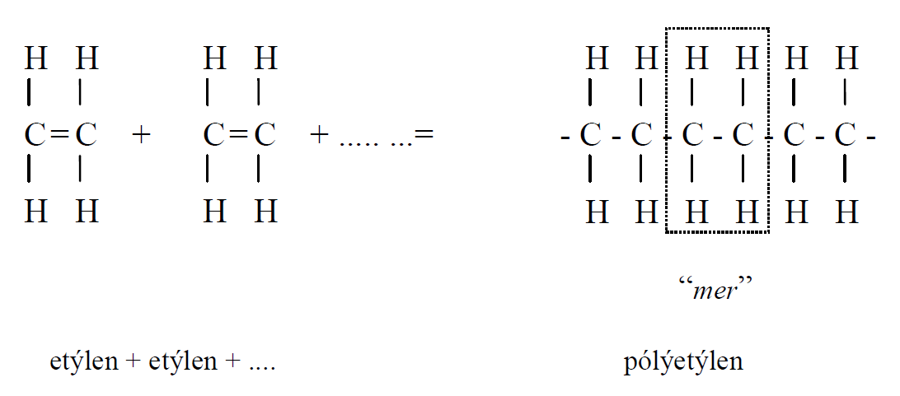
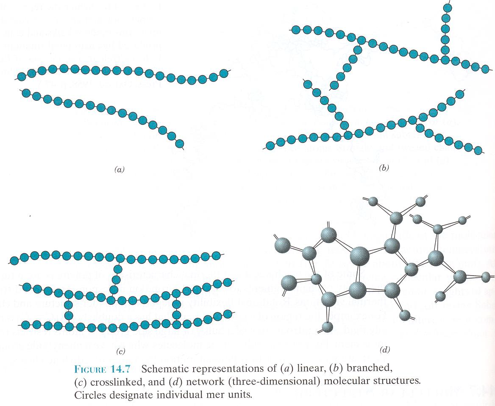
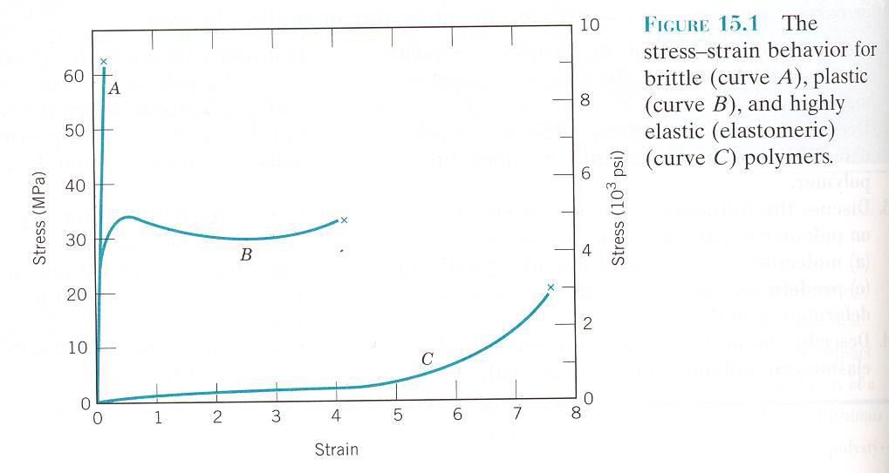
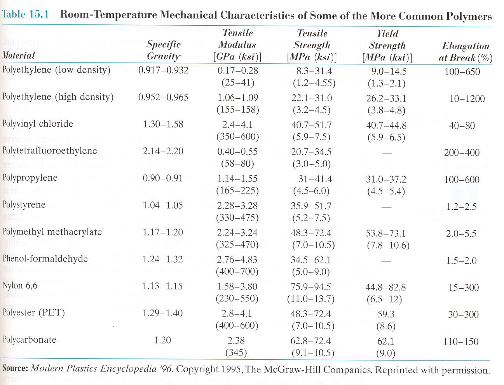
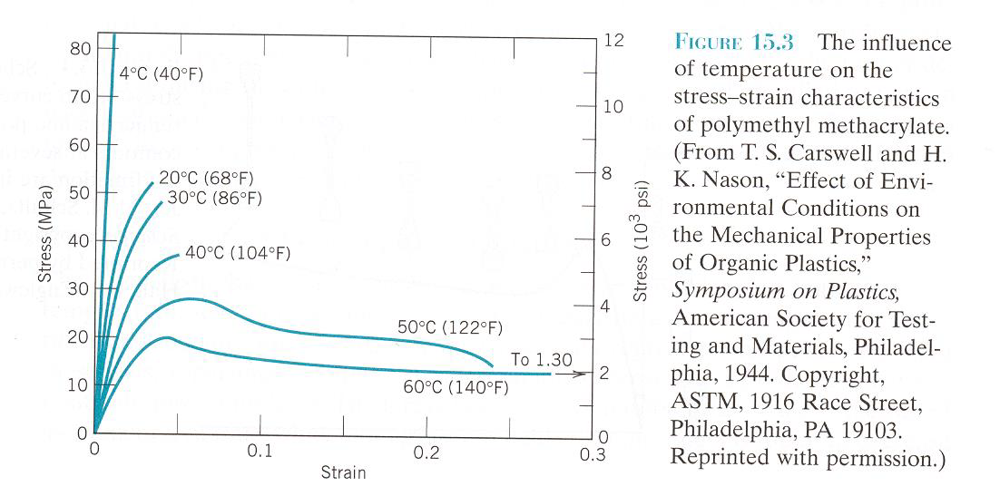

Kafli - Fjölliður
=================
(byggt á S. G. Bergström et al., 1970, P. G. Burström, 2001, Páll Árnason, 2001, ofl.)

:math:`\require{\mhchem}` Efni sem hafa uppbyggingu sem byggist á fjölliðum eru stór og mikilvægur efnisflokkur.
Efnin hafa það sameiginlegt að byggjast upp af lífrænum fjölliðum, sem á einhverju
skeiði framleiðslunnar eru seig (“plastískt”) formanlegar í fast efni. 

Fjölliður eru tiltölulega nýr efnisflokkur, aðalþróun þeirra hófst á tíma seinni
heimsstyrjaldarinnar en saga þeirra hefst þó á nítjándu öldinni. Fyrsta fjölliðuefnið,
celluloid, uppgötvaðist uppúr 1860 og fyrsta verksmiðjan hóf rekstur 1872. Á tímabilinu
1905-1910 framleiddi Belginn Baekeland fyrsta al-gerfiefnið, byggt á formaldehýði og
fenól, þekkt undir nafninu bakelit. Fjölliðuefnum fjölgaði síðan hratt,
pólýmetýlmetakrýlat (stytt í Akrýlplast) kom til sögunnar 1928, pólývinýlklóríð (PVC)
og pólývinýlasetat 1932-33, pólýamið og pólýester 1938, pólýeten 1940, sílikon 1945 og
epoxíplast upp úr 1950. Stöðugt bætast ný efni á markaðinn, og notkun plastefna vex
hratt, á heimsmarkaði ráða þrjár tegundir, *pólýeten (PE), pólýstýren (PS) og
pólývinýlkloríð (PVC).*

Fjölliðum má skipta í þrjá flokka (skilin eru þó ekki alltaf greinileg);
Hitadeigt plast (e: thermoplastic polymers, thermoplasts), hitafast plast (e:thermosetting
polymer, thermosets) og gúmmí (e:rubber). 

Framleiðsla  
~~~~~~~~~~~

Fjölliður (e::polymers) eru langar keðjur myndaðar af tengingu fjölda minni eininga
einliða (e: monomer), gott dæmi um slíkt er t.d. ethýlen hópurinn og myndun
pólýethýlen:

Etýlen hópurinn (:math:`\ce{C2H4}`) samanstendur af tveim kolvetnisfrumeindum og fjórum
vetnisfrumeindum; milli kolvetnisfrumeindanna er tvöfaldur kovalentbindingur (merktur með
tveim strikum á mynd) en einfaldur kovalentbindingur bindur vetnis- og kolefnisfrumeindir
saman. Þegar bindingur er tvö- eða þrefaldur þá er hann sagður ómettaður og færsla getur orðið
á bindingum, ný efni tekið yfir bindinga, við heppilegar aðstæður (samsvarandi er einfaldur
bindingur sagður mettaður, hann er stöðugur í samanburði við ómettaða bindinga sömu
frumeinda). Etýlen er lofttegund við venjulegar hita- og þrýstingsaðstæður, en með hækkuðum
hita og þrýstingi þá má mynda fjölliður úr þessum grunneiningum.

Mynd; Etýlen hópar (einliður, e: monomer) tengjast í fjölliðu (e: polymer); póýetýlen

Ferlið er kallað fjölliðun (e: polymerization, sjá Örn og Örlyg) og er stærð hverrar
fjölliðu sem myndast (þetta er háð tegund ) iðulega gefin með upp fjölliðunargráðunni (e:
degree of polimerization) sem gefur upp meðalfjölda “mer” eininga í fjölliðukeðju.
Fjölliður eru ekki endilega byggðar upp úr einliðum sem allar eru sömu gerðar, þegar
tengjast mismunandi einliður þá kallast slík keðja samfjölliða (e: co-polymer).

Fjölliður tengjast innbyrðis á mismunandi vegu, og er tengingin háð tegund fjölliðanna,
sjá mynd. 

**Hitadeigt plast** er fremur deigt og mýkist enn frekar við hitun (og flýtur loks) en harðnar á
ný við kælingu, ferlið er fullkomlega afturkræft (e:totally reversible) án þess að
eiginleikar breytist, ef hitun er ekki mjög mikil. Efnin hafa ekki skýrt skilgreint
bræðsluhitastig. Þessi tegund plasts er almennt framleidd undir samverkandi hita og
þrýstingi. Efnið getur verið ókristallað eða krystallað að hluta (e: semi-crystalline).
Krosstengingar milli fjölliða eru óalgengar.

**Hitafast plast** verður hart við framleiðsluhitun, þegar krosstengingar myndast milli
fjölliða. Krosstengingin er umfangsmikil, þannig að 10 – 50 % af grunneiningunum (e:
mers) eru tengdar, og bindur þannig fjölliður saman og takmarkar hreyfigetu við hátt
hitastig. Efnið brotnar niður við of mikla hitun, en er við nothitastig almennt með meiri
hörku, styrk og formheldnara heldur en hitadeigt plast. Flest efni úr krosstengdum eða
nettengdum fjölliðum, m.a. gúmmí, epoxý-, phenól- og pólýesterblöndur eru hitaföst.

Uppbygging   
~~~~~~~~~~

Efni úr fjölliðum er iðulega samsett úr nokkrum efnisþáttum, s.s. trefjum, fylliefnum og
aukaefnum, auk sjálfrar fjölliðunnar, en heitið er dregið af þeirri grunneiningu
fjölliðunnar sem er ráðandi. 

*Fylliefni*; minnka sjálfa fjölliðuþörfina, einnig til að hafa áhrif á eðlisþéttleika og
aflfræðilega eiginleika.

*Trefjar*; bending efnislags til að bæta aflfræðilega eiginleika

*Aukaefnin*; geta verið allt að 2% af lokaþyngdinni hvert fyrir sig og eru notuð til að hafa
áhrif á efniseiginleika og auka endingu lokavörunnar;

- mýkingarefni; gera efnið mýkra og ekki eins stökkt
- brunavarnarefni; draga úr eldfimi, t.d. gera það brunatregt (ekki lengur eldfæðandi)
- “rafhleðsluvarnandi”; (e: anti- static) draga rafhleðsluvirkni
- andoxunarefni; til að koma í veg fyrir að aðalefnið hvarfist við súrefni
- ljósþolniefni; auka ljósþol (einkum UV þol)

Styrkeiginleikar fjölliðu efna    
~~~~~~~~~~~~~~~~~~~~~~~~~~~~~~

Formbreytingarferlar fjölliða eru þrennskonar, háð tegund. Stökk efni, seig (e: plastic)og
mjög seig (e: highly plastic, elastomeric), sjá mynd. Efnin sem sýna mesta
seigjueiginleika nefnast “elastomerar” (e: elastomers).

Mynd: Formbreytingarferlar fjölliða (Callister, 2001)

Fjölliður hafa mjög breytilega aflfræðilega eiginleika, sjá töflu, þau spanna allan skalann
ef svo má segja- en eru almennt veikari, sveigjanlegri hafa mun meiri brotlengingu heldur
gildir um málma. 

Tafla: Aflfræðilegir eiginleikar fjölliða við stofuhita (Callister, 2001)

Aflfræðilegir eiginleikar eru jafnframt mjög háðir hitastigi, sjá línurit.

Línurit: Aflfræðilegir eiginleikar fjölliða, háð hitastigi (Callister, 2001)

Nokkrar mikilvægar tegundir plastefna   
~~~~~~~~~~~~~~~~~~~~~~~~~~~~~~~~~~~~~
Hitadeigt plast (e: thermoplastic polymer, s:termoplast)
--------------------------------------------------------

**Pólýester**

Hitadeigur pólýester er til í fjölda mismunandi gerða; 

* polýkarbonat (PC) sem er gagnsætt, með gott högg- og hitaþol og nærir ekki eld.
* pólýetýlenteretalat (PET) hefur takmarkað efnaþol og stuttan líftíma. Notað í plastflöskur.
* gerðirnar PBT og PEN. 

**Pólýeten (PE)**

Þrjár gerðir til; LD polyeten (lítill efnisþéttleiki), PEM (skammstöfun notuð á Íslandi)
fyrir miðlungsþungt efni og loks HD-polyeten (mikill þéttleiki). LD efnið er mjúkt
og notað í plastfilmur, m.a. rakavarnarlög, plastpoka og pakkningar. HD efnið er
stífara og notað í heimilisvörur, bakka, flöskur ofl.

Það er ennfremur til krosstengt PE og nefnist þá PEX, efnið er notað í rör.
PE er hérlendis m.a. notað í stofnæðar vatns- og fráveitukerfa (svart á lit) og
rakavarnarlög, og í síðara tilvikinu helst gert öldrunarþolið (t.d. Þolplast frá
Plastprent).

Hlífðarkápa röra fyrir heitt vatn frá SET (þegar stálrör er einangrað með polýúrethan).
PEM er notað í snjóbræðslukerfi (SET á Selfossi) og affall hitaveitukerfa, þessi rör
eru ekki eins hitaþolin og rör úr PP og PB.

Reykjalundur framleiðir rör úr PE , undir nafninu Weholit.

**Pólýprópýlen (PP)**

Efnið er til í nokkrum mismunandi gerðum, hreint hefur efnið lágt höggþol í frosti en
með íblöndun má breyta eiginleikum nokkuð. PP er til sem sampólýmer (oft með
PE). PP hefur hátt hitaþol og hérlendis er efnið notað í snjóbræðslurör og fyrir
geislahitun (grá að lit), efnið einnig notað í frárennslislagnir innanhúss (gráar að lit).

**Pólýbútýlen (PB)**

Svipar um margt til PE og PP en er dýrara í framleiðslu. Efnið er notað í t.d. rör
þegar þörf er fyrir mikinn hönnunarstyrk fyrir í snjóbræðslur og geislahitun,
iðnaðarnot, skip og báta.

**Pólýstýren (PS)**

Hart og stökkt efni, en með íblöndun af gúmmí fjölliðum má auka slaghörku efnisins.
Notað í hnífapör, einnota drykkjarílát og frauðplasteinangrun.

**ABS-plast**

Notað í rör.

**Pólýmetýlmetakrýlat (PMMA, akrýlplast)**

Mikilvægasta akrýlplastið, oft selt undir heitinu plexigler. Hefur mikla ljóshleypni
(betri heldur en venjulegt gler), gott veðrunarþol og hlutfallslega góða
yfirborðshörku. Er notað í þakkúpla, og í stað glers í t.d. garðskála og gróðurhús.

**Pólývinýlklóríð (PVC)**

PVC fjölliðan er stíf og hornótt, efn úr PVC eru þó bæði til í mjúkri og stífri útfærslu.
Til að mýkja PVC er alltaf notað mýkingarefni (íblöndun allt upp í 40 %). Stíft PVC
er notað í gluggakarma, rör og þakrennur, mjúkt PVC í gólfefni, plastfilmur,
veggfóður og slöngur. Hérlendis notað í frárennslisrör innanhúss og í jörðu (rauðbrún
á lit).

**Pólývinýlasetat (PVAc)**

Mikið notað sem bindiefni í málningar.

**Polýtetraflúoretan (PTFE)**

Þekkist best undir söluheitinu “teflon”. Efnið hefur sérlega gott efna-, hita- og
veðrunarþol, og lágan viðnámsstuðul (:math:`\mu = 0,01 – 0,05`). Nothitastig er -200 til 260
°C, efnið er dýrt og því helst notað í legur, slöngur og sem húðun á steikarpönnur
o.þ.h.

Hitafast plast (e:thermosetting polymer, s: härdplast)
------------------------------------------------------
**Epoxý (EP)**

Fremur dýrt, en með góða eiginleika. Mest notað í trefjaplast ásamt gler-, kolefniseða Kevlar þráðum. Bindiefni í málningar og lím.

**Pólýúretan (PUR)**

Hægt er að framleiða efnið með mjög breytilegum eiginleikum, allt frá mjúkum
gúmmíefnum og í hart, hitafast plast. Notað í frauðeinangrun, mikilvægt bindiefni í
málningu og lím og í fúguefni.

**Pólýester (UP)**

Mikilvægasta notkunin fyrir hitafastan polýester er sem glertrefjastyrkt plast í t.d.
báta, í ljóshleypna þakkúpla og þakefni.

**Fenólformaldehýð (PF)**

Mikilvægasta notkunarsviðið er sem bindiefni í rakaþolin lím og sem hluti af
“lamineruðum” plötum, t.d. Perstorp, en lamineraðar plötur eru algengt gólfefni (og
innréttingum þegar mikið mæðir á).

**Karbamíðformaldehýð (UF) - karbamíðharts**

Notað í lím og bindiefni í krossvið og trjákenndum plötum almennt sem ekki er ætlað
að ver arakaþolnum.

**Melamínformaldehýð (MF) - melamínharts**

Einkum notað sem yfirborðshúð á trjákenndar plötur (góðir litamöguleikar)

Gúmmí
-----
Gúmmí er fjölliðað með vúlkaníseringu (e: vulcanize, sjá Örn og Örlyg), þ.e.
brennisteinsmeðhöndlun til að skapa krosstengi og gera efnið fjaðurmagnað.
Krossbindingar eru færri og lengri heldur en gildir fyrir hitafast plast.

Nokkrar gúmmítegundir:

**Etenprópan (EPDM)**

Brotnar rekki niður vegna ósonáhrifa og með gott varma- og efnaþol. Mest notað
utanhúss í þétti- og glerjunarlista og hylki utan um kapla.

**Klórópren (CR)**

Gott veðrunarþol. Notað í þétti- og glerjunarlista, einnig í legur til að gefa
byggingarhlutum hreyfanleika. Bindiefni í lím (þá kallað “kontaktlím” hérlendis t.d.
Jötungrip). Algengt söluheiti er “Neopren”.

**Butýl (IIR)**

Mjög há flæðimótstaða fyrir lofttegundir og þessvegna notað í hjóla- og bílslöngur en
einnig í þéttidúka fyrir vatnstanka, þök og brýr.

**Silikon (Si)**

Gott veðrunar- og osonþol, og heldur aflfræðilegum eiginleikum yfir stórt
hitastigssvið; eða um -100 til 250 °C. Í byggingariðnaði einkum notað sem bindiefni
í fúguefni.

**Náttúrulegt gúmmí (NR)**

Unnið úr gúmmítrénu og enn eitt af mikilvægustu gúmmíefnunum. Notað í bíldekk,
en vegna takmarkaðs þols gegn hita og oson þá er efnið lítið notað í byggingariðnaði. 

Fjölliður eru, eiginleika sinna vegna, algengar í byggingariðnaði;

.. list-table:: 
  :widths: 5 5
  :header-rows: 1

  * - Notkunarsvið
    - Umfang
  * - einangrunarefni 
    - algengt
  * - festifrauð 
    - allsráðandi
  * - rör 
    - algengt
  * - dúkar (rakavarnarlög, þéttidúkar,...) 
    - allsráðandi sem aðalefni eða trefjastyrking
  * - fúguefni 
    - allsráðandi
  * - fylliefni í málningar 
    - svo til allsráðandi
  * - lím 
    - svo til allsráðandi