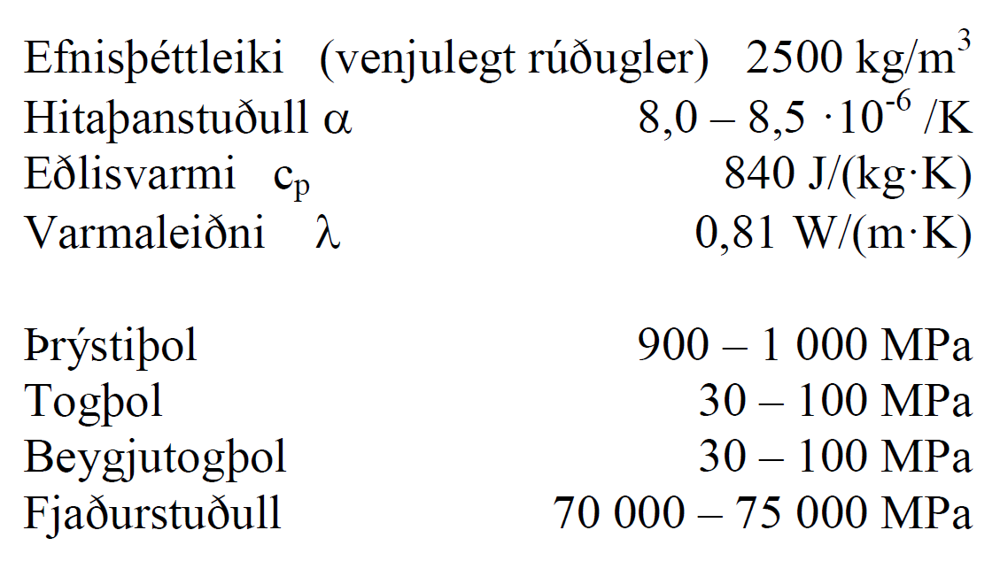
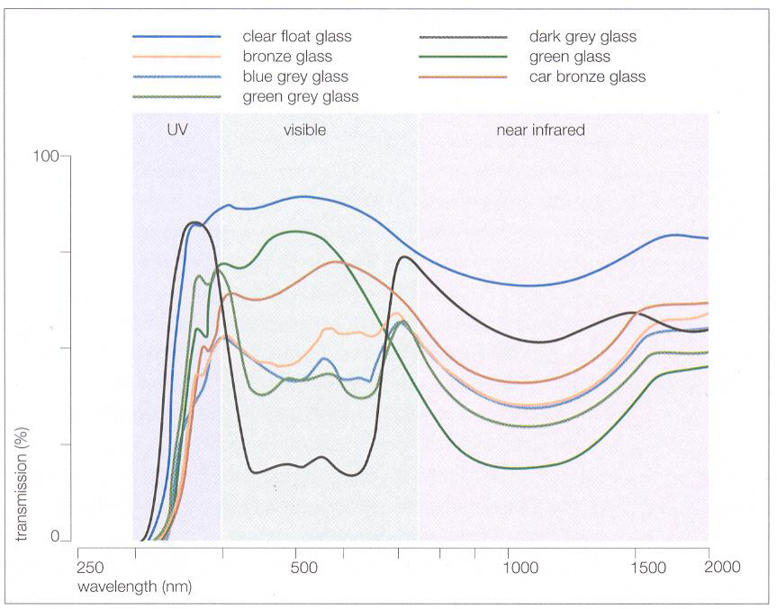
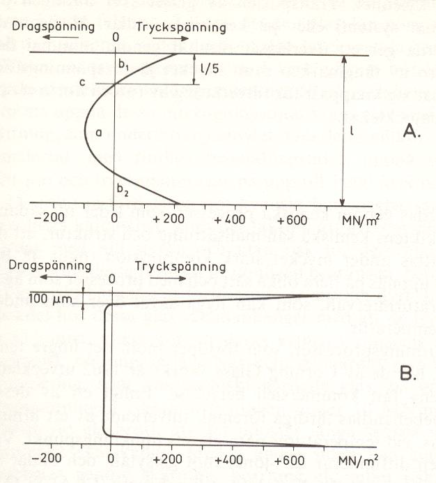

Kafli - Gler
============
(byggt á Burström, 2001, ofl.)

Gler er algengt byggingarefni og ber mest á því sem rúðugleri, en er einnig notað í
glerjung á ýmsa hluti s.s. hreinlætistæki.

Samsetning 
~~~~~~~~~~
:math:`\require{\mhchem}` Gler samanstendur af glermyndunarefni (oxíð sem krystallast ekki við kælingu),
algengast er kísiloxíð (:math:`\ce{SiO2}`) og bóroxíð (:math:`\ce{B2O3}`), það síðarnefnda er þó vatnsleysanlegt og
því aðeins notað með kísiloxíði. Kísiloxíð er um 70 % þyngdar í gleri, og er unnið úr
kvartssandi. Þar sem bræðsluhiti sandsins er um 1700 :math:`^{\circ}C` þá er bætt við öðrum oxíðum,
flússefnum, til að lækka bræðsluhitann (fæst með lækkun á seigju bráðinnar). Flússefnin,
t.d. :math:`\ce{Na2O}`, sem slík mynda ekki gler. Einnig er bætt við öðrum efnum til að auka rakaog efnaþol, venjulegust eru :math:`\ce{CaO}` og :math:`\ce{Al2O3}`.

Eiginleikar  
~~~~~~~~~~~
Gler er “amorft”, þ.e. myndar ekki kristalla (sbr. kafla 2 í kennslubókinni). Við upphitun
þá breytist það úr stökku ástandi í teygjanlegt (plastískt) án þess að fara í gegnum
skilgreind bræðslumörk. Í þessu tilliti hefur gler því svipaða eiginleika eins og
undirkældur vökvi, seigja við venjulegt hitastig er hinsvegar mjög há og efnið tekur mjög
litlum tímaháðum formbreytingum (nema á mjög löngum tíma).

Gler getur tekið miklum formbreytingum undir álagi og þetta, ásamt því að um stökkt
efni er að ræða, gera útreikninga snúna. Útbeygjur geta verið af stærðargráðunni 5-10
sinnum glerþykktin, en ákvörðun á styrk plötu með mikla útbeygju fer eftir aðferð sem
Timoshenko setti fram (Timoshenko and Woinowsky-Krieger, 1959). Stökkir
eiginleikarnir ger að verkum að hönnunin þarf að taka mið af líkindafræði og til
einföldunar er ákvörðun glerþykktar því almennt gerð útfrá línuriti þar sem tekið er tillit
til leyfilegrar svignunar, sjá t.d. Rb-blað Rb(31).104.2 eða upplýsingar glerframleiðanda
(línuritin eru byggð á “empírískum” grunni).

Rúðugler - framleiðsla   
~~~~~~~~~~~~~~~~~~~~~~
(byggt á B. Adamson og H. Backman, 1975, ofl.)

Lengi vel var aðeins hægt að blása gler. Þegar gera átti rúðugler var það í fyrstu blásið
þannig að mynduð var hnöttótt flaska, síðan var festur stafur í botninn, stúturinn skorinn
BYG302G Efnisfræði Háskóli Íslands
Björn Marteinsson Umhverfis og byggingarverkfræðideild
Ýmis efni 2
af og kringlótt rúða mótuð með snúningi á opinni “flöskunni”. Rétthyrnd rúðan var loks
skorin útúr hringlaga fletinum, og í henni miðri sást greinilega miðjugáran þar sem
stafurinn hafði verið, slíkar rúður eru stundum nefndar á ensku “bulls eye”. Þessar rúður
gátu framleiðslunnar vegna ekki orðið stórar og mikil vinna fór í hverja um sig, varan var
því hlutfallslega dýr. Um árið 1000 eru menn að ná tökum á því að blása aflanga flösku
(sívalning) sem botn og toppur var skorinn af meðan glerið var enn deigt og belgurinn
síðan ristur upp og rétt út í slétta rúðu. Árið 1688 var byrjað að valsa gler og 1867 er
byggður fyrsti ofninn sem var í stöðugri framleiðslu á flotgleri, þá er glerbráðinni fleytt út
yfir bráðið tin og þannig fást alveg sléttar rúður í mun meiri stærð heldur en áður var
gerlegt að fá.

Í rúðugleri skipta ljóseiginleikar miklu máli (sjá skilgreiningu á ljóshleypni og endurkasti
m.m. í kafla 4 í kennslubókinni), en með lit glersins og filmum má hafa mjög mikil áhrif
á þessa eiginleika.

Orkuhleypni glers, háð bylgjulengd geislunar og lit glers (heimild: Wiggington, 1996)

Hert gler  
~~~~~~~~~
Með jafnri hitun á flotgleri upp í rúmlega 600 °C og síðan snöggri kælingu á yfirborðinu
má mynda þrýstispennur í yfirborðinu, en samtímis togspennur í miðjuhluta glersins.
Hliðstæðum áhrifum má ná með efnameðferð, og þá þarf glerþykkt ekki að vera jafn
mikil og er nauðsynlegt fyrir hitaherslu. Með herslunni fæst hagstæðari spennudreifing í
glerinu þar sem herslan bætir upp annars lélegt togþol glersins (áhrifunum má líkja við
það sem gildir fyrir eftirspennta steypu). Áhrifin auka beygjutogþol glersins um 5 falt á
við venjulegt gler, og rúðan þolir betur en áður snöggar hitabreytingar.

Mynd: Spennudreifing í hertu gleri (B. Adamsson og
H. Backman, 1975)
Efri myndin (A) sýnir hitahert gler, sú neðri (B)
efnahert gler.

Öryggisgler  
~~~~~~~~~~~
Þráðgler er gert þannig að þráðnet er valsað inn í hálfdeigt glerið, rúðurnar hafa ekki
sama styrk og venjulegt gler. Kosturinn við þessar rúður er að ef glerið brotnar (vegna
högga eða springur í hita) þá falla glerstykkin ekki niður.
Samlímt gler dugir ágætlega sem öryggisgler, ef einungis er hugsað um höggáraun. Tvær
glerrúður eru límdar saman með plasti sem myndar filmu á milli glerjanna (“laminerað”
gler), en þær gefa sig í bruna miklu fyrr heldur en þráðglerið.

Ending  
~~~~~~
Gler hefur almennt ágætt efnaþol, nema gagnvart flúor- og alkalískum samböndum.

