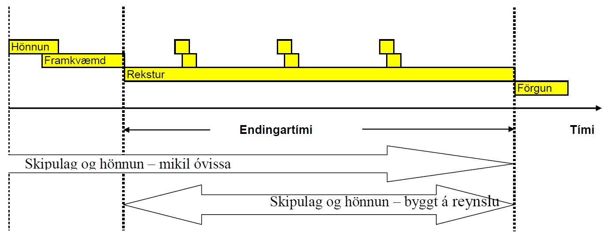

Inngangur
=========

Kafli 1 – Kennsluefni, kaflaskipti m.m.
Kennslubókinni er skipt upp eftir þessum meginþáttum;
* Holrýmd og þéttleiki
* Varmi og einangrunareiginleikar
* Raki og rakaeiginleikar
* Styrkur og stífleiki
* Stærðarstöðugleiki
* Ending
* Hitaháðar breytingar og bruni

Bókin er því almenn umfjöllun um grundvallarhugtök.
Kennsluefni vegna umfjöllunar um einstakar efnistegundir verður dreift sérstaklega.

Umfang sviðsins

Umfang “Efnisfræði” ræðst af notkun efna og þeirri áraun sem þau kunna að verða fyrir,
og þeim efniseiginleikum sem máli skipta.

Efnisnotkun í íslensku fjölbýli alls; nýbygging og 50 ára viðhald og endurnýjun;

.. figure:: ./myndir/Efnisnotkun_isl.png
  :align: center
  :width: 70%

Sement, steypa, pússning og fylliefni alls 3322 kg/m2 íbúðarrýmis

Efnisnotkun til nýbyggingar og viðhalds í 50 ár (Heimild: Björn Marteinsson, 2002)