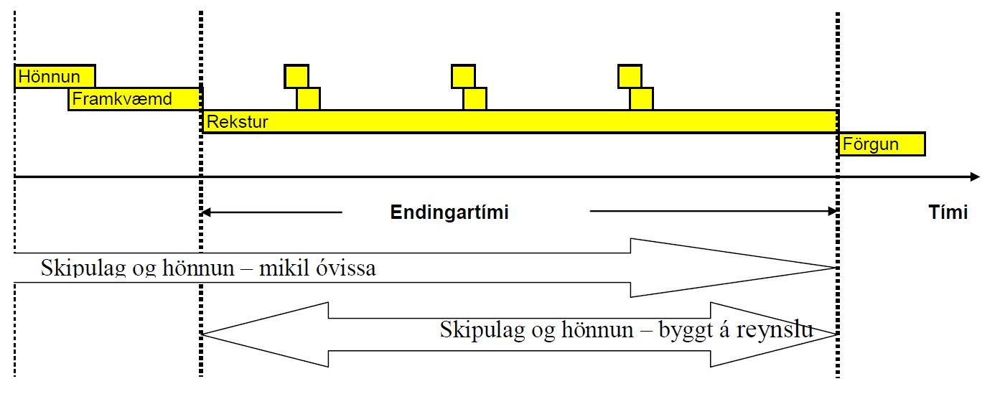
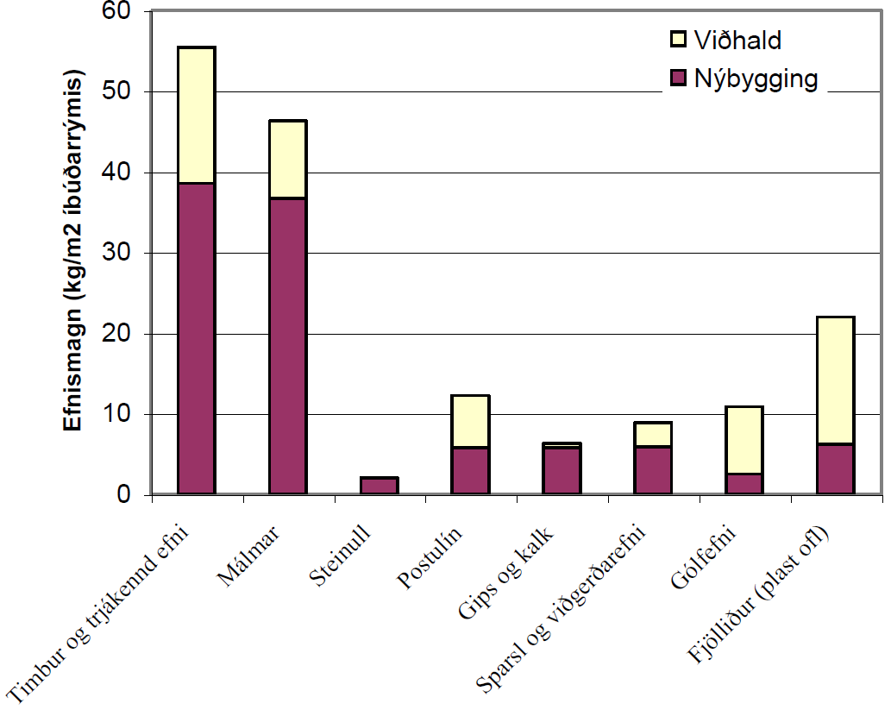
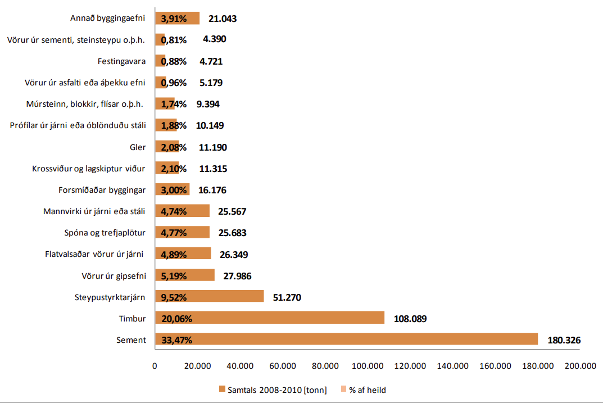

Kafli – Kynning 
===============
Textinn í þessari Edbook er unninn upp úr kennsluheftinu "Efnisfræði" eftir dr. Björn Marteinsson fyrrverandi dósent við Umhverfis- og Byggingarverkfræðideild Háskóla Íslands.

Fyrstu 9 kaflarnir eru samantekt upp úr kennslubók eftir F. R. Gottfredsen og A. Nielsen og heitir Bygningsmaterialer – grundlæggende egenskaber. :cite:`2000:Gottfredsen`.

Efninu er skipt upp eftir þessum meginþáttum;

#. Kynning
#. Gerð og uppbygging efna
#. Holrýmd og þéttleiki
#. Varmi og einangrunareiginleikar
#. Raki og rakaeiginleikar
#. Styrkur og stífleiki
#. Stærðarstöðugleiki
#. Ending
#. Hitaháðar breytingar og bruni
#. Stál
#. Gler 
#. Fjölliður 
#. Lím 

.. 
  #. Fylliefni 
.. 
  #. Sement 
.. 
  #. Steypa 
.. 
  #. Timbur

Fyrsti hlutinn er almenn umfjöllun um grundvallarhugtök og í kjölfarið er umfjöllun um einstakar efnistegundir.

Umfang sviðsins
---------------

Umfang efnisfræðinnar ræðst af notkun efna og þeirri áraun sem þau kunna að verða fyrir,
og þeim efniseiginleikum sem máli skipta. 

Í þróuðu iðnarðarlandi eru til tugir þúsunda af byggingarvörum. Engin leið er að læra eiginleika hverrar vörutegundar. 
Þess vegna hlutum við hverja vöru niður í efni og könnum eiginleika hvers og eins. 

Tökum glugga sem dæmi. Hvaða kröfur setjum við til glugga?

* Þéttleiki

  #. vindur
  #. vatn

* Sterkur, öruggur
* Ljóshleypinn
* Opnanlegur?
* Ending - hagkvæmt viðhald
* Umhverfisvæn framleiðsla + förgun 
* Möguleiki á endurnýtingu?

Hér koma við sögu efni eins og gler, timbur, ál, plast og kítti.

Byggingarverkfræðingur þarf að skilja stífni, styrkleika og endingu efna, líka hvernig efni skríða og spennulosun með tíma. 
Hvernig þreytast undir síendurteknu álagi? Hvernig vinna efni saman? Hvað gerist þegar þau hitna og kólna eða verða fyrir vatnsþrýstingi? 
Hvað mótar efni? Hvernig verða þau til og hvaða ferlar hafa áhrif á eiginleika þeirra? Hvað gerist þegar efni brennur?

Tímalínan sýnir mismunandi tímabil í ævi mannvirkis. Á hverju stigi kemur að þekking á efnifræðilegum eiginleikum efnanna sem mannvirkið er samsett úr. 

Hvaða byggingarefni eru notuð á íslandi? Grafið hér að neðan sýnir niðurstöður úr könnun sem var gerð árið 2002. Þar sést efnisnotkun í íslensku fjölbýli alls; 
nýbygging og 50 ára viðhald og endurnýjun. Efnisnotkun til nýbyggingar og viðhalds í 50 ár :cite:`2002:Marteinsson`. Inn á myndina vantar sement, steypu, 
pússningu og fylliefni en þessi efni eru alls 3322 kg/m2 íbúðarrýmis.

Árð 2011 var gerð könnun á magni og uppruna innfluttra byggingarefna á Íslandi :cite:`2011:Breidfjord`. Niðurstöður úr þeirri könnun er sýnd hér. 

Gagnlegur orðskýringalisti: https://www.princeton.edu/~maelabs/mae324/glos324/index.htm

.. 
   Heimildir
   .. bibliography::

