Kafli - Gerð og uppbygging efna
===============================

Viðeigandi efnisnotkun er háð þekkingu á grunneiginleikum efnanna.  Allir eiginleikar efna byggja á gerð þeirra og uppbyggingu, sérstaklega gildir að styrkur, stífleiki, rafleiðni og ending eru beint háðir grunnuppbyggingu þeirra.  Við getum skoðað uppbyggingu efna á mismunandi skölum, frumeindaskala, kristaluppbyggingu á míkróskala og póruuppbyggingu á makróskala. Í þessum kafla verður fjallað um frumeindabyggingu, tengigerðir og kristalbyggingu en holrýmd og póruuppbyggingu er lýst nánar í 3. kafla.

Frumeindir
----------

Öll efni eru byggð upp af **frumeindum** (e. *atoms*). Frumeind er minnsta eining frumefnis sem heldur efnafræðilegum eiginleikum þess.

Frumeindir eru byggðar upp úr þremur tegundum einda:

* **róteindum** (e. *protons*), sem hafa jákvæða rafhleðslu,
* **nifteindum** (e. *neutrons*), sem eru óhlaðnar,
* **rafeindum** (e. *electrons*), sem hafa neikvæða rafhleðslu.

Róteindir og nifteindir mynda **kjarna** (e. *nucleus*) frumeindarinnar en rafeindirnar eru umhverfis kjarnann. Rafeindir eru miklu léttari en róteindir og nifteindir og því er nánast allur massi frumeindarinnar í kjarnanum.

Fjöldi róteinda í kjarna er kallaður **sætistala**, :math:`Z`, og ákvarðar um hvaða frumefni er að ræða. Í óhlaðinni frumeind er fjöldi rafeinda sá sami og fjöldi róteinda og heildarhleðsla frumeindarinnar því núll.

Ef frumeind tekur til sín eða gefur frá sér rafeindir myndast **jón**. Frumeind sem tekur til sín rafeindir verður neikvætt hlaðin en frumeind sem gefur frá sér rafeindir verður jákvætt hlaðin.

Rafeindahvel
~~~~~~~~~~~~

Í einföldu Bohr-líkani frumeindarinnar er gert ráð fyrir að rafeindir raðist á mismunandi rafeindahvel (e. *electron shells*) umhverfis kjarnann.

Rafeindir í ysta hveli frumeindarinnar kallast **gildisrafeindir** (e. *valence electrons*). Þær hafa mikil áhrif á efnafræðilega eiginleika frumefnisins og hvernig það myndar efnatengi við önnur atóm. Við komum aftur að þessu þegar fjallað verður um efnatengi síðar í kaflanum.

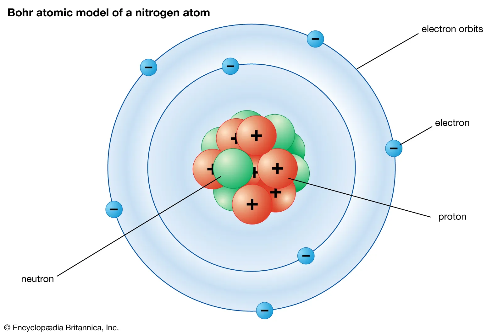

   Einfalt Bohr-líkan af köfnunarefnisfrumeind.

Frumefni og lotukerfið
~~~~~~~~~~~~~~~~~~~~~~

**Frumefni** er efni sem eingöngu er gert úr frumeindum með sama fjölda róteinda. Frumefnunum er raðað í **lotukerfið** eftir sætistölu.

Frumefni í sama dálki lotukerfisins hafa oft svipaða efnafræðilega eiginleika. Það tengist meðal annars fjölda gildisrafeinda þeirra.

Í lotukerfinu má finna ýmsar upplýsingar um frumefnin, meðal annars sætistölu, frumeindamassa og efnafræðilegt tákn.

.. button::
   :text: Gagnvirkt lotukerfi á íslensku
   :link: https://ptable.com/?lang=is#Eiginleikar

Samsætur
~~~~~~~~

Frumeindir sama frumefnis hafa alltaf sama fjölda róteinda en geta haft mismunandi fjölda nifteinda. Slíkar frumeindir kallast **samsætur** (e. *isotopes*).

Kolefni er dæmi um frumefni sem hefur fleiri en eina samsætu. Kolefni-12, kolefni-13 og kolefni-14 hafa öll sex róteindir og eru því öll kolefni, en þau hafa mismunandi fjölda nifteinda og þar með mismunandi massa.

Frumeindamassi, mól og Avogadros-talan
~~~~~~~~~~~~~~~~~~~~~~~~~~~~~~~~~~~~~~

.. youtube:: wPGVQu3UXpw
   :width: 100%
   :height: 400

Massi einstakrar frumeindar er mjög lítill, af stærðargráðunni :math:`10^{-27}` kg. Því er hentugra að nota **frumeindamassaeininguna**, :math:`u`.

Ein frumeindamassaeining er skilgreind sem :math:`1/12` af massa kolefnis-12 frumeindar:

.. math::

   1u = 1,6605 \cdot 10^{-27}\,\textrm{kg}

Hlutfallslegur frumeindamassi, :math:`A_r`, er skilgreindur sem:

.. math::

   A_r = \frac{m}{m_u}

þar sem :math:`m` er massi frumeindarinnar og :math:`m_u` er frumeindamassaeiningin.

Frumeindamassi frumefnis sem gefinn er upp í lotukerfinu er yfirleitt vegið meðaltal massa þeirra samsæta frumefnisins sem finnast í náttúrunni. Þess vegna er gildið ekki endilega heil tala.

Mól
~~~

Frumeindir og sameindir eru svo smáar að jafnvel í mjög litlu sýnilegu magni efnis er gríðarlegur fjöldi einda. Til þess að lýsa slíku efnismagni er einingin **mól** notuð.

Eitt mól inniheldur

.. math::

   N_A = 6,022 \cdot 10^{23}

eindir. Talan :math:`N_A` kallast **Avogadros-talan**.

**Mólmassi**, :math:`M`, segir til um massa eins móls af efni og er yfirleitt gefinn upp í g/mól.

.. admonition:: Vísbending
   :class: hint

   Tölugildi frumeindamassa frumefnis í :math:`u` er það sama og tölugildi mólmassa þess í g/mól.

   Kolefni með frumeindamassann :math:`12u` hefur því mólmassann um 12 g/mól.

.. admonition:: Gott að vita: Hversu smátt getum við séð?
   :class: hint

   Þegar fjallað er um uppbyggingu efna er gagnlegt að hafa tilfinningu fyrir
   þeim stærðargráðum sem um ræðir.

   .. line-block::

      :math:`1\,\mu\textrm{m} = 10^{-6}\,\textrm{m}` (míkrómetri)
      :math:`1\,\textrm{nm} = 10^{-9}\,\textrm{m}` (nanómetri)
      :math:`1\,\textrm{Å} = 10^{-10}\,\textrm{m}` (ångström)
      :math:`1\,\textrm{pm} = 10^{-12}\,\textrm{m}` (píkómetri)

   Algengar frumeindir hafa radíus af stærðargráðunni 0,5–2 Å, eða um
   50–200 pm. Sameindir eru einnig á þessum mjög smáa skala.

   Vatnssameind er aðeins nokkrir ångström að stærð.

   Til samanburðar er þvermál mannshárs af stærðargráðunni tugir míkrómetra.
   Frumeindir og sameindir eru því mörgum stærðargráðum minni en það sem
   hægt er að sjá með berum augum.

   **Ljóssmásjá** getur stækkað sýni um það bil þúsundfalt og greint smáatriði
   niður undir brot úr míkrómetra.

   **Rafeindasmásjár** geta greint mun smærri byggingu og gera okkur kleift
   að rannsaka efni niður á nanómetrakvarða.

Sameindir
---------

Frumeindir geta tengst saman og myndað **sameindir** (e. *molecules*). Sameind er því samsett úr tveimur eða fleiri frumeindum sem tengjast saman. Frumeindirnar geta verið af sama frumefni eða mismunandi frumefnum.

Til dæmis er súrefnissameind, :math:`O_2`, gerð úr tveimur súrefnisfrumeindum. Vatnssameind, :math:`H_2O`, er hins vegar gerð úr tveimur vetnisfrumeindum og einni súrefnisfrumeind.

Efnaformúla sameindar segir þannig bæði til um **hvaða frumefni** mynda sameindina og **hversu margar frumeindir** eru af hverju frumefni.

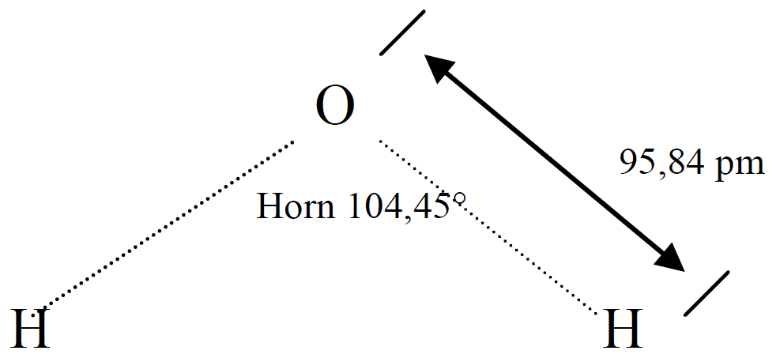

   Vatnssameind, :math:`H_2O`, er gerð úr tveimur vetnisfrumeindum og einni súrefnisfrumeind.

Sameindamassi
~~~~~~~~~~~~~

**Sameindamassi** fæst með því að leggja saman frumeindamassa allra frumeindanna sem mynda sameindina.

Vatn, :math:`H_2O`, inniheldur tvær vetnisfrumeindir og eina súrefnisfrumeind. Frumeindamassi vetnis er um :math:`1,008\,u` og frumeindamassi súrefnis um :math:`16,00\,u`.

Sameindamassi vatns er því

.. math::

   2 \cdot 1,008 + 16,00 = 18,016\,u

eða um :math:`18,02\,u`.

Á sama hátt fæst **mólmassi** vatns:

.. math::

   M(H_2O) \approx 18,02\,\textrm{g/mól}

Tölugildi sameindamassa í :math:`u` og mólmassa í g/mól eru því þau sömu.

.. admonition:: Dæmi: Mólmassi gifs
   :class: example

   Reiknum mólmassa gifs, kalsíumsúlfat-tvíhýdrats,

   .. math::

      CaSO_4 \cdot 2H_2O

   Mólmassinn fæst með því að leggja saman mólmassa allra
   frumeindanna í efnasambandinu.

   .. list-table::
      :widths: 5 5 5 5
      :header-rows: 1

      * - Frumefni
        - Mólmassi [g/mól]
        - Fjöldi
        - Alls [g/mól]
      * - Ca
        - 40,08
        - 1
        - 40,08
      * - S
        - 32,06
        - 1
        - 32,06
      * - O
        - 16,00
        - 6
        - 96,00
      * - H
        - 1,008
        - 4
        - 4,032
      * -
        -
        -
        - **172,17**

   Mólmassi gifs er því um

   .. math::

      M = 172,17\,\textrm{g/mól}

   Massi einnar sameindar fæst síðan með því að deila mólmassanum
   með Avogadros-tölunni:

   .. math::

      m = \frac{172,17}{6,022\cdot10^{23}}
        \approx 2,86\cdot10^{-22}\,\textrm{g}

Orka í bindingum og kraftar milli frumeinda
-------------------------------------------
Kraftar milli frumeinda og sameinda
-----------------------------------

Frumeindir og sameindir hafa jákvæðar og neikvæðar hleðslur. Vegna dreifingar
þessara hleðslna verka bæði **aðdráttarkraftar** og **fráhrindikraftar** milli einda.

Þegar tvær eindir eru langt hvor frá annarri eru kraftarnir milli þeirra litlir.
Þegar þær nálgast hvor aðra verður aðdráttur milli þeirra meiri. Ef þær koma
hins vegar mjög nálægt hvor annarri verða fráhrindikraftar ráðandi.

Því myndast ákveðin **jafnvægisfjarlægð**, :math:`r_0`, þar sem aðdráttar- og
fráhrindikraftarnir vega hvor annan upp. Við þessa fjarlægð er kerfið í stöðugu
jafnvægi og stöðuorka þess er í lágmarki.

Lennard–Jones líkanið
~~~~~~~~~~~~~~~~~~~~~

.. panopto:: 24fb07ae-23e9-4068-9002-b04d00a47940
    :width: 100%
    :height: 400

Samband stöðuorku tveggja einda og fjarlægðarinnar milli þeirra má lýsa með
svokölluðu **Lennard–Jones líkani**.

.. math::

   \Phi_r =
   \Phi_0
   \left[
   \left(\frac{r_0}{r}\right)^{12}
   -
   2\left(\frac{r_0}{r}\right)^6
   \right]

þar sem :math:`r` er fjarlægðin milli eindanna, :math:`r_0` er
jafnvægisfjarlægðin og :math:`\Phi_0` lýsir dýpt orkudalsins.

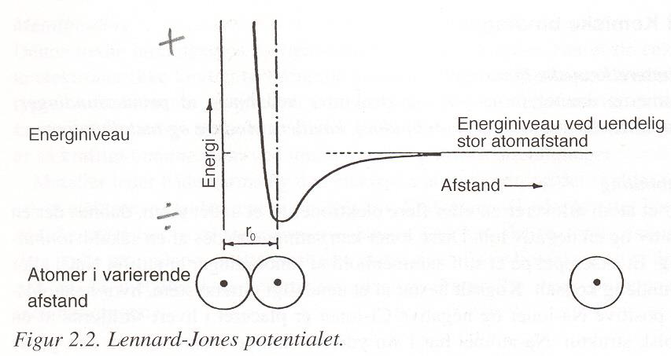

   Stöðuorka sem fall af fjarlægð milli einda samkvæmt Lennard–Jones líkaninu.

Lágmark ferilsins samsvarar jafnvægisfjarlægðinni :math:`r_0`. Til þess að
færa eindirnar í sundur frá þessari stöðu þarf að leggja til orku. Dýpt
orkudalsins gefur því vísbendingu um hversu sterk tengslin milli eindanna eru.

Kraftar milli einda
~~~~~~~~~~~~~~~~~~~

Krafturinn milli eindanna tengist breytingu stöðuorkunnar með fjarlægð:

.. math::

   F_r = -\frac{d\Phi_r}{dr}

Við jafnvægisfjarlægðina :math:`r_0` er krafturinn núll. Ef eindirnar færast
aðeins lengra í sundur verður aðdráttarkraftur ráðandi og leitast við að færa
þær aftur í jafnvægisstöðu. Ef þær færast nær hvor annarri verður
fráhrindikraftur ráðandi.

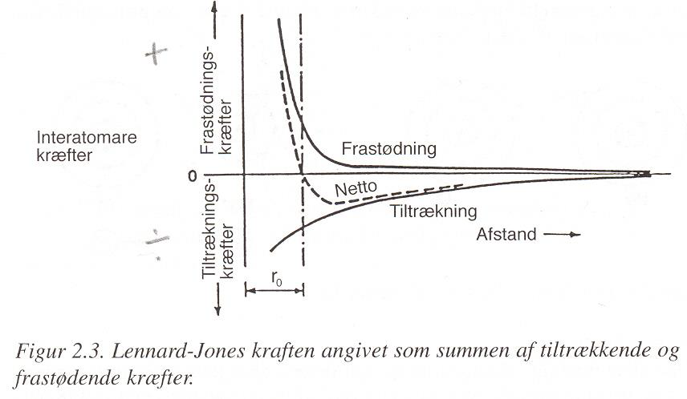

   Aðdráttar- og fráhrindikraftar milli einda sem fall af fjarlægð.

.. admonition:: Tengingin við eiginleika efna
   :class: important

   Kraftar og bindingar milli einda hafa bein áhrif á eiginleika efna.

   * **Sterkari bindingar** þýða að meiri orku þarf til að aðskilja eindirnar.
     Efni með sterkar bindingar hafa því almennt hærra bræðsluhitastig.

   * **Lögun orkudalsins** tengist stífleika efnisins. Því brattari sem
     orkukúrfan er í kringum jafnvægisstöðuna, því meiri kraft þarf til að
     breyta fjarlægðinni milli eindanna og því stífara er efnið.
  

Efnafræðilegir bindingar
------------------------
Gerð efnafræðilegra bindinga hefur mikil áhrif á eiginleika efna. Bindingarnar
ráða meðal annars hvernig frumeindir raðast saman og hversu auðvelt er að færa
þær úr jafnvægisstöðu.

Efnafræðilegum bindingum má skipta í tvo meginflokka:

* **fyrsta stigs efnafræðilegar bindingar**, sem eru sterkar bindingar milli frumeinda. Í þessum bindingum eru það rafeindirnar á ysta hvelinu (valenshvelinu) sem leika höfuðhlutverk. Bindingarnar verða til vegna viðleitni frumeindanna til þess að gera valenshvelið stöðugt, þ.e. fylla það rafeindum.
* **annars stigs efnafræðilegar bindingar**, sem eru veikari og verka meðal annars milli sameinda. Annars stigs bindingar eru veikari en fyrsta stigs bindingar. Van der Waal bindingar og vetnisbindingar eru algengustu annars stigs bindingarnar.

Fyrsta stigs efnafræðilegar bindingar
~~~~~~~~~~~~~~~~~~~~~~~~~~~~~~~~~~~~~

Fyrsta stigs efnafræðilegar bindingar (e. *primary chemical bonds*) myndast
með þátttöku rafeinda í ysta rafeindahveli frumeindanna, þ.e.
gildisrafeindanna.

Þær skiptast í þrjár megingerðir:

* jónatengi,
* samgild tengi,
* málmtengi.

Jónatengi
^^^^^^^^^
**Jónatengi** (e. *ionic bond*) myndast þegar ein eða fleiri rafeindir flytjast
frá einni frumeind til annarrar. Við það myndast jákvætt og neikvætt hlaðnar
jónir. Gagnstæðar rafhleðslur jónanna dragast að hvor annarri og mynda
bindinguna.

Matarsalt, :math:`NaCl`, er dæmi um efni þar sem jónatengi eru ráðandi.
Natríumfrumeind, :math:`Na`, gefur frá sér eina gildisrafeind og verður að
jákvæðri :math:`Na^+` jón. Klórfrumeind, :math:`Cl`, tekur við rafeindinni
og verður að neikvæðri :math:`Cl^-` jón.

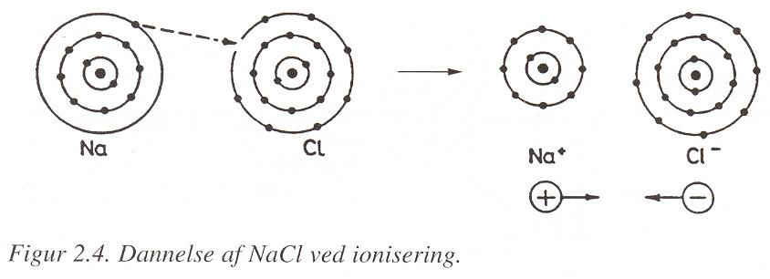

  Myndun jónatengis.

.. youtube:: 6DtrrWA5nkE
    :width: 100%
    :height: 400

Samgild tengi
^^^^^^^^^^^^^

**Samgilt tengi** (e. *covalent bond*) myndast þegar tvær frumeindir deila
einum eða fleiri rafeindapörum. Þannig geta frumeindirnar náð stöðugri
rafeindaskipan í ysta rafeindahveli (kallað valenshvel).

Samgild tengi eru til dæmis milli frumeindanna í sameindum vetnis,
súrefnis og köfnunarefnis.

Efni þar sem sterk samgild tengi mynda samfellda byggingu geta haft mikinn
styrk en eru oft stökk.

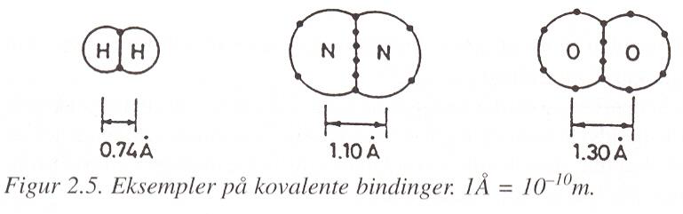

  Samgild tengi myndast þegar frumeindir deila rafeindum.

.. youtube:: 5I_1jRGSR9E
    :width: 100%
    :height: 400

Málmbindingar
~~~~~~~~~~~~~
Málmtengi
^^^^^^^^^

**Málmtengi** (e. *metallic bond*) eru einkennandi fyrir málma. Í málmi eru
gildisrafeindirnar ekki bundnar við einstakar frumeindir heldur geta þær
hreyfst tiltölulega frjálst milli jákvætt hlaðinna málmjóna.

Oft er þessu lýst þannig að jákvæðar málmjónir séu umkringdar sameiginlegu
**rafeindaskýi**. Aðdráttur milli jákvæðu jónanna og neikvæða
rafeindaskýsins heldur efninu saman.

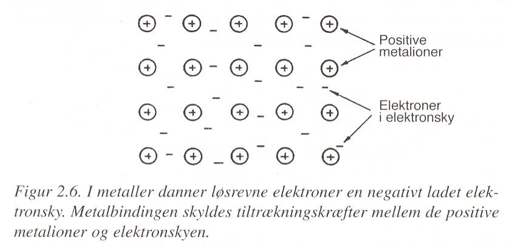

  Í málmtengi eru gildisrafeindir ekki bundnar við eina ákveðna frumeind.

Þessi uppbygging skýrir ýmsa mikilvæga eiginleika málma. Frjáls hreyfing
rafeindanna stuðlar að góðri **rafleiðni og varmaleiðni**. Jafnframt geta
frumeindalög í málmgrindinni færst til án þess að bindingar rofni varanlega;
ný tengsl myndast þegar frumeindirnar færast. Þetta á þátt í því að margir
málmar geta **formbreyst plastískt** án þess að brotna.

.. youtube:: b1y2Q6YX1bQ
    :width: 100%
    :height: 400

Annars stigs efnafræðilegar bindingar
~~~~~~~~~~~~~~~~~~~~~~~~~~~~~~~~~~~~~

**Annars stigs efnafræðilegar bindingar** eru almennt mun veikari en fyrsta
stigs bindingar. Þær byggjast á aðdráttarkröftum milli jákvæðra og neikvæðra
hleðslusvæða í frumeindum eða sameindum.

Tvær mikilvægar gerðir eru:

* van der Waals-bindingar,
* vetnistengi.

van der Waals-bindingar
^^^^^^^^^^^^^^^^^^^^^^^

Rafeindir eru á stöðugri hreyfingu og dreifing þeirra um frumeind eða
sameind getur því tímabundið orðið ósamhverf. Þá getur myndast tímabundin
hleðsluskipting, eða **tvískaut** (e. *dipole*).

Slík hleðsluskipting getur haft áhrif á nærliggjandi eindir og valdið
aðdráttarkröftum milli þeirra. Þessir kraftar kallast **van der
Waals-kraftar**.

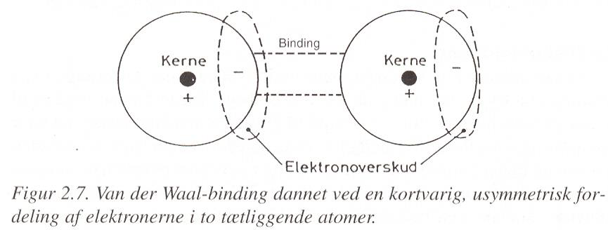

   van der Waals-binding vegna hleðsludreifingar milli nálægra einda.

Vetnistengi
^^^^^^^^^^^

**Vetnistengi** (e. *hydrogen bond*) er annars stigs binding sem getur
myndast milli sameinda þegar vetni er bundið við mjög rafneikvæða frumeind.

Vatn er mikilvægt dæmi. Innan hverrar vatnssameindar eru vetnis- og
súrefnisfrumeindir tengdar með samgildum tengjum. Hleðslan dreifist hins
vegar ekki jafnt um sameindina. Súrefnishluti hennar verður lítillega
neikvæður en vetnishlutinn lítillega jákvæður.

Þessi hleðsluskipting veldur aðdrætti milli nálægra vatnssameinda og þar
myndast vetnistengi.

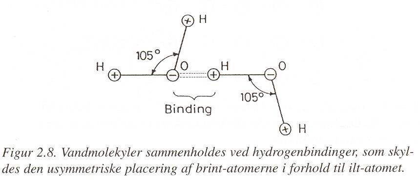

   Vetnistengi milli vatnssameinda.

Yfirlit yfir efnafræðilegar bindingar
~~~~~~~~~~~~~~~~~~~~~~~~~~~~~~~~~~~~~

Efnafræðilegar bindingar hafa mismunandi styrk og eðli og hafa því
mismunandi áhrif á eiginleika efna. Gerð bindinganna er einn af þeim
grunnþáttum sem tengja saman innri byggingu efnis og eiginleika
þess.

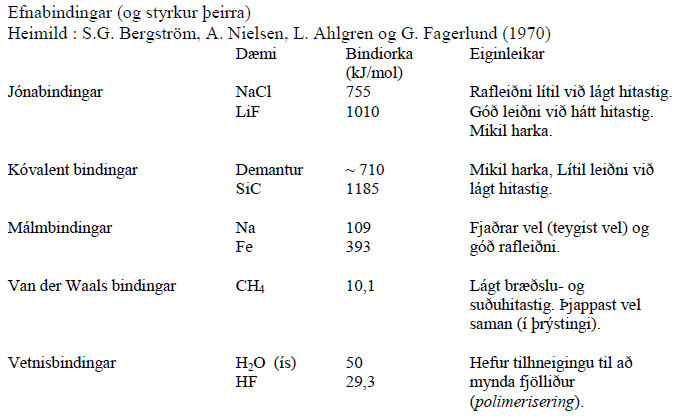

   Yfirlit yfir helstu gerðir efnafræðilegra bindinga.

Uppbygging efna
---------------

Föst efni geta haft mismunandi innri uppbyggingu. Í kristölluðum efnum
raðast frumeindir, jónir eða sameindir reglulega, en í ókristölluðum
efnum er röðunin minni.

Hér verður fjallað um kristalbyggingu, galla í kristalgrindinni og
ókristölluð efni.

Kristalbygging
~~~~~~~~~~~~~~

Í **kristölluðum efnum** raðast frumeindir, jónir eða sameindir reglulega
í þrívíðu mynstri. Þessa reglulegu uppröðun má lýsa með
**kristalgrind** (e. *crystal lattice*).

Minnsta eining kristalgrindarinnar sem hægt er að endurtaka í þrjár
víddir þannig að hún myndi alla kristalgrindina kallast **kristaleining**
(e. *unit cell*).

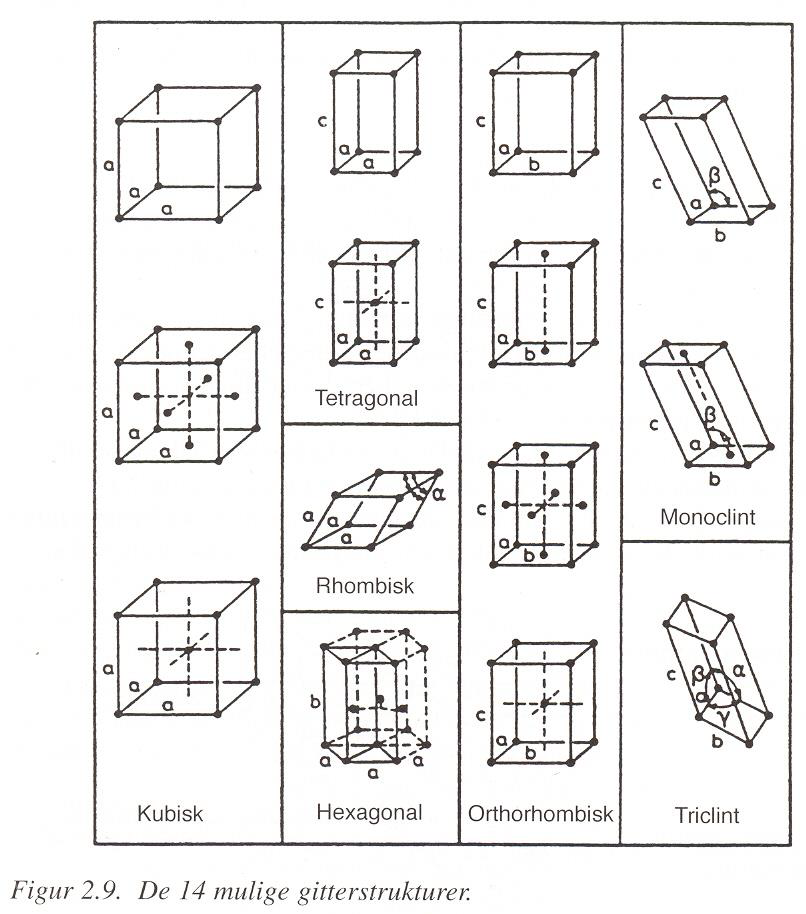

   Regluleg uppröðun einda í kristölluðu efni.

Stöðug kristalbygging leitast við að hafa sem lægsta mögulega orku.
Við uppröðun eindanna þarf jafnframt að vera rafhlutleysi og pökkun
þeirra verður eins þétt og aðstæður leyfa.

Margar mismunandi kristalgrindur eru mögulegar. Alls eru skilgreindar
14 mismunandi grindargerðir, sem byggjast á mismunandi lögun
kristaleiningarinnar og uppröðun einda innan hennar.

Meðal þekktustu og algengustu kristalbygginganna eru þrjár
teningslaga grindur:

* **einföld teningsgrind** (e. *simple cubic*, SC),
* **rúmmiðjuð teningsgrind** (e. *body-centered cubic*, BCC),
* **hliðmiðjuð teningsgrind** (e. *face-centered cubic*, FCC).

Í einfaldri teningsgrind, SC, eru frumeindir staðsettar í hornum
kristaleiningarinnar.

Í rúmmiðjaðri teningsgrind, BCC, eru frumeindir í hornunum og auk þess ein
frumeind í miðju kristaleiningarinnar.

Í hliðmiðjaðri teningsgrind, FCC, eru frumeindir í hornunum og í miðju
hvers flatar kristaleiningarinnar.

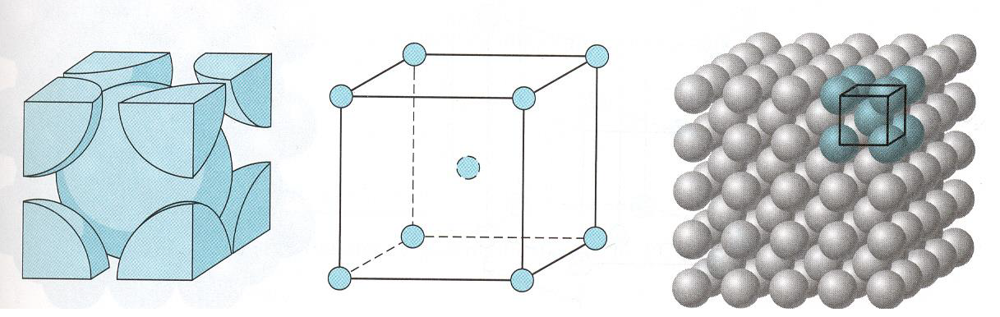

   BCC kristaleining (Rúmmiðjuð teningsgrind).

.. youtube:: F7e_iWCUfI4
    :width: 100%
    :height: 400

.. youtube:: ku6u7yqNwAc
    :width: 100%
    :height: 400

Fjöldi frumeinda í kristaleiningu
^^^^^^^^^^^^^^^^^^^^^^^^^^^^^^^^^

Frumeindir á mörkum kristaleiningar tilheyra fleiri en einni
kristaleiningu. Frumeind sem er í horni tenings tilheyrir átta
aðliggjandi kristaleiningum og telst því sem :math:`1/8` frumeindar
í hverri þeirra. Frumeind sem er í miðju flatar tilheyrir tveimur
kristaleiningum og telst því sem :math:`1/2` frumeind.

Því tilheyrir að meðaltali:

* **1 frumeind** einfaldri teningsgrind (SC) (n=8*1/8=1),
* **2 frumeindir** rúmmiðjaðri teningsgrind (BCC) (n=1+8*1/8=2),
* **4 frumeindir** hliðmiðjaðri teningsgrind (FCC) (n=6*1/2+8*1/8=4).

Rúmmiðjaðar og hliðmiðjaðar teningsgrindur eru algengar í málmum.
Kristalbygging sama efnis getur jafnvel breyst með hitastigi. Járn er
dæmi um efni sem getur tekið bæði BCC- og FCC-kristalbyggingu við
mismunandi hitastig.

.. youtube:: Rm-i1c7zr6Q
   :width: 100%
   :height: 400

Grindargallar
~~~~~~~~~~~~~

Raunveruleg kristölluð efni hafa ekki fullkomna kristalbyggingu. Í
kristalgrindinni eru ýmiss konar **grindargallar** (e. *lattice defects*),
þ.e. frávik frá reglulegri uppröðun frumeindanna.

Grindargallar hafa mikil áhrif á eiginleika efna og þá sérstaklega
aflfræðilega eiginleika þeirra. Þeir hafa meðal annars áhrif á hvernig
kristölluð efni formbreytast þegar þau verða fyrir álagi.

Grindargöllum má meðal annars skipta í:

* punktgalla,
* línugalla eða misgengi.

Punktgallar
^^^^^^^^^^^

**Punktgallar** (e. *point defects*) eru staðbundin frávik í
kristalgrindinni. Þeir geta meðal annars myndast þegar frumeind vantar,
auka frumeind kemur fyrir á milli reglulegra grindarstaða eða þegar
frumeind af annarri gerð tekur sæti í kristalgrindinni.

Helstu dæmi um punktgalla eru:

* **eyða** (e. *vacancy*), þegar frumeind vantar á grindarstað,
* **innskotsfrumeind** (e. *interstitial atom*), þegar aukafrumeind
  situr á milli reglulegra grindarstaða,
* **staðgengilsfrumeind** (e. *substitutional atom*), þegar frumeind
  af annarri gerð kemur í stað frumeindar í kristalgrindinni.

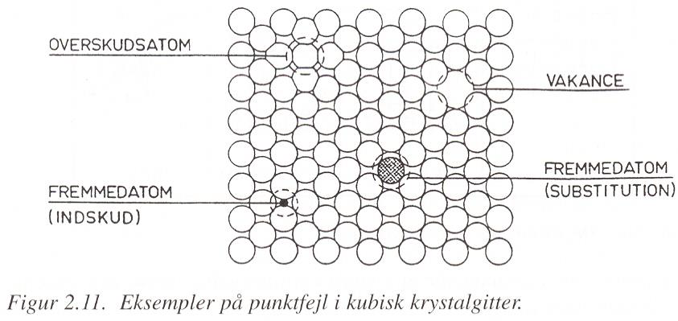

   Dæmi um punktgalla í kristalgrind.

Línugallar – misgengi
^^^^^^^^^^^^^^^^^^^^^

**Línugallar**, einnig kallaðir **misgengi** (e. *dislocations*), eru
gallar sem ná eftir línu í kristalgrindinni.

Einfalt dæmi er þegar aukalegt hálft frumeindaplan liggur inni í
kristalgrindinni. Regluleg uppröðun frumeindanna raskast þá í kringum
enda hálfplansins.

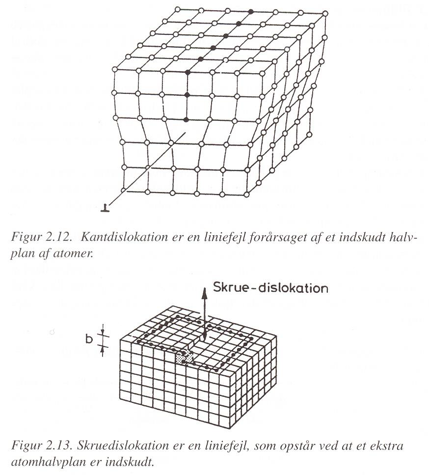

   Línugalli í kristalgrind.

Misgengi skipta miklu máli fyrir aflfræðilega eiginleika kristallaðra efna.
Hreyfing misgengja gerir frumeindaplönum kleift að færast hvert miðað
við annað án þess að öll tengi milli tveggja heilla frumeindaplana
þurfi að rofna samtímis.

Þetta er ein af meginforsendum þess að málmar geti formbreyst plastískt.

Skrið og skriðkerfi
^^^^^^^^^^^^^^^^^^^

Þegar misgengi færist eftir kristalgrindinni geta frumeindaplön færst
hvert miðað við annað. Slík hreyfing kallast **skriðhreyfing** (e. *slip*).

Skriðhreyfing verður helst eftir ákveðnum flötum og í ákveðnar stefnur innan
kristalgrindarinnar. Samsetning skriðflatar og skriðstefnu kallast
**skriðkerfi** (e. *slip system*).

Skriðhreyfing á auðveldast með að eiga sér stað þar sem frumeindirnar liggja
þétt saman.  Því hefur kristalbygging efnisins áhrif á hversu auðveldlega
það getur formbreyst plastískt. Skriðkerfi er háð kristaluppbyggingu efnisins. 
Skriðplanið þéttpakkaðasta planið innan kristalsins og skriðstefnan er 
þéttpakkaðasta stefnan innan skriðplansins. Skriðplan í FCC kristan hefur þrjár 
skriðstefnur. Innan kristaleiningarinnar eru fjögur slík plön. 
Þess vegna eru 4x3 = 12 einstök skriðkerfi í FCC kristal. 

Hreyfing misgengja og virkni skriðkerfa eru þannig mikilvægur hluti af
skýringu á sveigjanleika og plastískri formbreytingu málma. Málmar sem eru með FCC eða BCC kristalbyggingu eru með töluvert mörg 
skriðkerfi (amk. 12). Slíkir málmar eru seigir (e. ductile), þ.e. 
þeir geta formbreyst mikið áður en þeir brotna, vegna þess að 
skriðkerfi gera efninu kleift að formbreytast plastískt. 
Málmar byggðir HCP kristaleiningar með fáum skriðkerfum eru oftast 
stökkir (e. brittle).

Þegar við setjum álag á efni sem er byggt upp sem kristall 
þá mun efnið formbreytast eftir þéttsetnustu stefnunni í 
þéttsetnasta planinu, því í skriðkerfinu eru stystar bindingar 
og auðveldast að mynda nýjar.  Því fleiri slík plön sem eru í 
kristallinum þeim mun seigara er efnið, því hver eind hefur 
fleiri "undankomu" leiðir til að tengjast nýjum eindum undir álagi.

Ókristölluð efni
~~~~~~~~~~~~~~~~

Ekki eru öll föst efni kristölluð. Í **ókristölluðum efnum**
(e. *non-crystalline materials*) er ekki regluleg langdræg uppröðun
frumeinda eða sameinda eins og í kristölluðum efnum.

Það getur þó verið ákveðin staðbundin röðun milli næstu einda. Uppbyggingin
er því ekki algerlega tilviljanakennd, en mynstrið endurtekur sig ekki
reglulega um allt efnið.

Ókristölluð efni geta meðal annars verið byggð úr löngum sameindakeðjum
eða óreglulegu þrívíðu neti.

Dæmi um ókristölluð efni eru meðal annars:

* gler,
* ýmis plastefni,
* gúmmí,
* lífræn efni á borð við timbur.

Ókristölluð efni hafa almennt ekki eitt skýrt bræðslumark. Við hitun
mýkjast þau oft yfir ákveðið hitastigsbil, öfugt við kristölluð efni þar
sem bráðnun á sér stað við ákveðnara hitastig.

Fjölliður
^^^^^^^^^

Mörg ókristölluð efni eru byggð úr **fjölliðum** (e. *polymers*).
Fjölliða er stór sameind sem samanstendur af mörgum minni byggingareiningum
sem tengjast saman í langar keðjur.

Innan fjölliðukeðjunnar eru yfirleitt sterk fyrsta stigs efnatengi en
milli keðjanna geta verið veikari annars stigs bindingar, svo sem
van der Waals-bindingar og vetnistengi.

Uppröðun keðjanna er oft óregluleg og því myndast ekki regluleg
kristalgrind um allt efnið.

.. youtube:: EP0zfm_FVqc
   :width: 100%
   :height: 400

Timbur
^^^^^^

**Timbur** er náttúrulegt efni sem er að stórum hluta byggt úr
fjölliðum.

Helstu fjölliðurnar í viði eru:

* **beðmi** (e. *cellulose*),
* **hálfbeðmi** (e. *hemicellulose*),
* **tréni** (e. *lignin*).

Þessar fjölliður raðast saman í flókna innri byggingu sem hefur mikil
áhrif á styrk, stífleika og rakaeiginleika timburs.

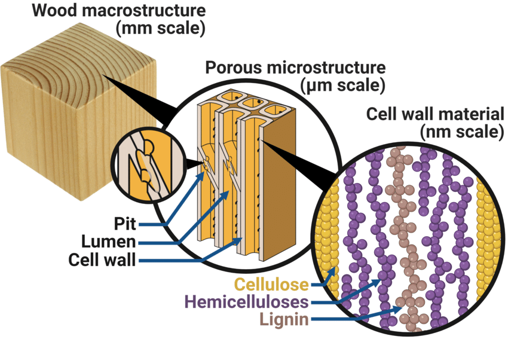

   Uppbygging timburs úr náttúrulegum fjölliðum.

:cite:`2021:Thybring`

Plastefni
^^^^^^^^^

**Plastefni** eru að mestu byggð úr manngerðum fjölliðum.

Eiginleikar plastefna ráðast meðal annars af gerð fjölliðukeðjanna,
lengd þeirra, tengingum milli keðja og því hvernig keðjurnar raðast
saman.

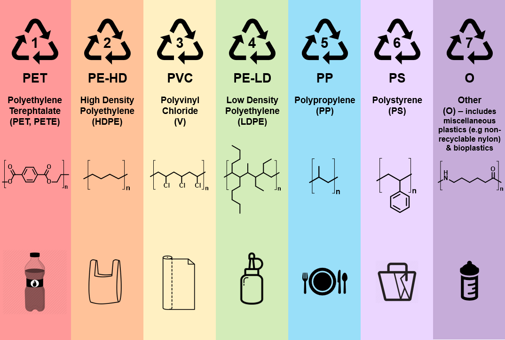

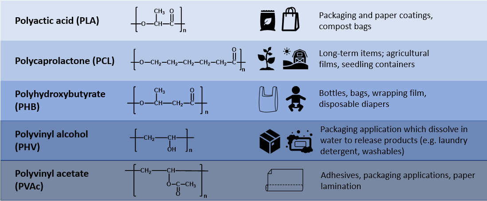

:cite:`2019:GreenChemUofT`

Gúmmí
^^^^^

**Gúmmí** (e. *rubber* eða *elastomer*) er fjölliðuefni þar sem
sameindakeðjurnar geta aflagast mikið og færst til innbyrðis.

Gúmmí getur verið náttúrulegt eða framleitt með efnasmíði. Náttúrulegt
gúmmí er unnið úr latexi gúmmítrjáa en margar gerðir gervigúmmís eru
framleiddar með fjölliðun hráefna úr jarðolíu.

Sveigjanleiki og teygjanleiki gúmmís tengist því að langar
fjölliðukeðjurnar geta rétt úr sér við álag og tekið aftur upp
fyrri lögun þegar álaginu er létt af.

Blandefni
---------

Einsleit og misleit efni
~~~~~~~~~~~~~~~~~~~~~~~~

Efni sem aðeins samanstendur af einu efni er sagt vera **einsleitt**
(e. *homogeneous*). Þetta á þó fyrst og fremst við þegar efnið er skoðað
á stórsæjum skala. Efni sem virðist einsleitt með berum augum getur haft
mun flóknari uppbyggingu þegar það er skoðað í smásjá.

Mörg byggingarefni eru samsett úr fleiri en einu efni og eru því
**misleit** (e. *heterogeneous*).

Dæmi um misleit efni eru:

* steinsteypa, sem samanstendur meðal annars af sementsefju, sandi og möl,
* plastefni sem innihalda fylliefni
* trefjaplast, sem samanstendur af glertrefjum og fjölliðum

Einsleitir hlutar misleits efnis kallast **fasar** (e. *phases*).
Fasi hefur sömu efnafræðilegu og eðlisfræðilegu eiginleika alls staðar
innan síns svæðis.

Steinsteypa er gott dæmi um fjölfasa efni. Í henni má meðal annars
greina sementsefju og steinefni sem mismunandi fasa.

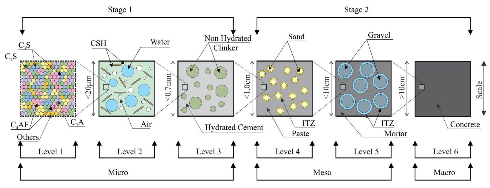

  Uppbygging steinsteypu á mismunandi stærðarskölum, frá efnisþáttum
  sements og sementsefju á míkróskala yfir í steinefni, múr og
  steinsteypu á stærri skala.

:cite:`2023:Silva2023`

Trefjaplast er annað dæmi um misleitt efni. Það er **samsett efni**
(e. *composite material*) þar sem glertrefjar eru umluktar
fjölliðum (plasti).

Fasarnir tveir gegna mismunandi hlutverkum. Glertrefjarnar veita efninu
styrk og stífleika en plastið heldur trefjunum saman og flytur
krafta á milli þeirra.

Fasar og dreifð efni
~~~~~~~~~~~~~~~~~~~~

Ef efni samanstendur af tveimur fösum getur annar fasinn verið
fíndreifður í hinum. Slíkt efni kallast **dreift efni**
(e. *disperse system*).

Fasinn sem er dreifður kallast **dreifður fasi** en fasinn sem myndar
samfellda umhverfið kallast **samfelldur fasi**.

Báðir fasarnir geta verið fast efni, vökvi eða gas og því geta myndast
margar mismunandi gerðir dreifikerfa.

.. list-table:: Dæmi um tveggja fasa dreifð efni
   :widths: 18 18 25 39
   :header-rows: 1

   * - Dreifður fasi
     - Samfelldur fasi
     - Heiti
     - Dæmi
   * - Fast efni
     - Fast efni
     - Föst lausn
     - Sumar málmblöndur og gler
   * - Fast efni
     - Vökvi
     - Sviflausn
     - Málning fyrir hörðnun eða þornun
   * - Fast efni
     - Gas
     - Reykur
     - Ryk í lofti
   * - Vökvi
     - Fast efni
     - Föst þeyta
     - Steinsteypa í hörðnun
   * - Vökvi
     - Vökvi
     - Þeyta
     - Málning
   * - Vökvi
     - Gas
     - Úði
     - Þoka í andrúmslofti
   * - Gas
     - Fast efni
     - Föst froða
     - Frauðplast
   * - Gas
     - Vökvi
     - Froða
     - Frauðplast í framleiðslu

Í raunverulegum byggingarefnum er ekki alltaf hægt að greina skýrt á milli
dreifða fasans og samfellda fasans.

Í frauðplasti má til dæmis líta bæði á plastið og loftið sem samfelldan fasa,
eftir því hvernig uppbyggingin er skoðuð. Á sama hátt getur verið erfitt að
ákvarða hvort fasti eða fljótandi fasinn sé samfelldur meðan sement er að
harðna.

Þeytur
~~~~~~

**Þeyta** (e. *emulsion*) myndast þegar tveimur vökvum, sem leysast ekki
upp hvor í öðrum, er blandað saman þannig að annar vökvinn dreifist sem
smáir dropar í hinum.

Vökvinn sem myndar dropana er **dreifði fasinn** en vökvinn sem umlykur
dropana myndar **samfellda fasann**.

Þeytur hafa tilhneigingu til að skiljast aftur í tvo fasa. Til þess að
gera þær stöðugri má nota efni sem safnast á mörkum fasanna og draga úr
tilhneigingu dropanna til að sameinast.

Dæmi um þeytu er málning.

Kvoðulausnir
~~~~~~~~~~~~

**Kvoðulausn** (e. *colloid*) er blanda þar sem mjög smáar agnir eins efnis
eru dreifðar í öðru efni.

Stærð agnanna skiptir máli fyrir hegðun blöndunnar. Í kvoðulausn eru
agnirnar yfirleitt á stærðarbilinu frá um :math:`1` nm upp í
:math:`1000` nm.

Ef agnirnar eru minni en um :math:`1` nm er frekar talað um **lausn**.
Ef þær eru stærri en um :math:`1000` nm verður til grófari blanda þar sem
agnirnar geta með tímanum fallið til botns.

Þessu má lýsa á einfaldan hátt:

* **lausn:** agnir minni en um :math:`1` nm,
* **kvoðulausn:** agnir um :math:`1`–:math:`1000` nm,
* **grófari blanda:** agnir stærri en um :math:`1000` nm.

Í kvoðulausn eru agnirnar því nógu smáar til að haldast dreifðar í
samfellda fasanum í langan tíma.

Agnum í kvoðulausn er haldið í stöðugri hreyfingu vegna árekstra við
sameindir umhverfisins. Þessi óreglulega hreyfing kallast
**Brown-hreyfing** (e. *Brownian motion*).

Yfirborð agnanna getur einnig verið rafhlaðið. Agnir með sömu hleðslu
hrinda hver annarri frá sér og það getur komið í veg fyrir að þær
sameinist í stærri agnir og falli til botns.

Gel
~~~

**Gel** myndast þegar agnir í kvoðulausn tengjast saman og mynda
samhangandi þrívítt net. Vökvinn verður þá bundinn innan netsins og
efnið fær fasta eða hálffasta lögun.

Gel er því kerfi þar sem bæði fastur og fljótandi fasi eru samfelldir.
Fasti fasinn myndar grind eða net en vökvinn fyllir rýmið innan þess.

Myndun gels úr kvoðulausn kallast **gelmyndun**.

Gel eru mikilvæg í byggingarefnum. Við hvörf sements við vatn myndast
til dæmis efni með gelkennda byggingu. Sú bygging hefur afgerandi áhrif
á eiginleika harðnaðrar sementsefju.

Heimildir
---------
.. bibliography::
