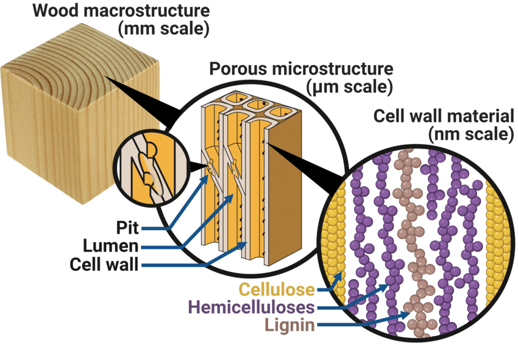
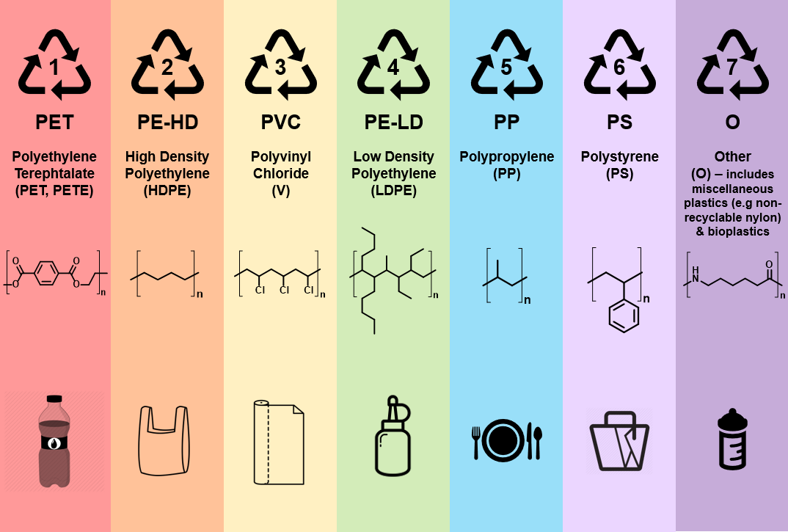
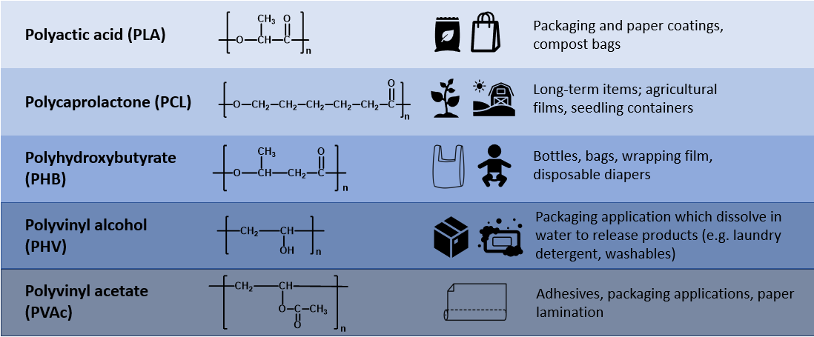
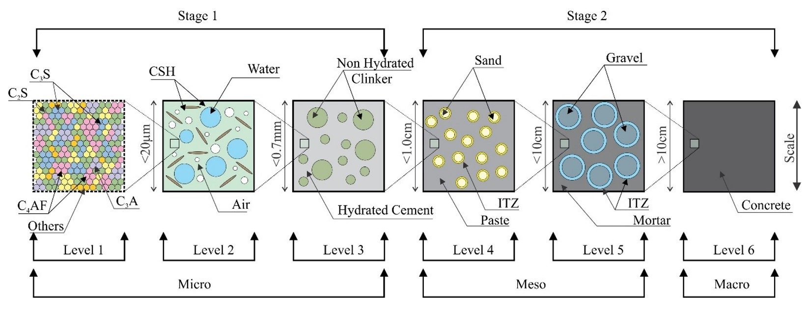

Kafli - Gerð og uppbygging efna
===============================

Viðeigandi efnisnotkun er háð þekkingu á grunneiginleikum efnanna.  Allir eiginleikar efna byggja á gerð þeirra og uppbyggingu, sérstaklega gildir að styrkur, stífleiki, rafleiðni og ending eru beint háðir grunnuppbyggingu þeirra.  Við getum skoðað uppbyggingu efna á mismunandi skölum, frumeindaskala, kristaluppbyggingu á míkróskala og póruuppbyggingu á makróskala. Í þessum kafla verður fjallað um frumeindabyggingu, tengigerðir og kristalbyggingu en holrýmd og póruuppbyggingu er lýst nánar í 3. kafla.

Aðeins skal líta á kaflann hér sem samantekt á nauðsynlegum hugtökum.

Frumeindir (e. atom)
--------------------

Frumeindir eru byggðar upp úr þremur tegundum einda; jákvætt hlaðin róteind (e. proton), óhlaðin nifteind (e. neutron) og neikvætt hlaðin rafeind (e. electron).
Kjarninn (e. nucleus) er iðulega samsettur úr jafnmörgum róteindum (fjöldi; Z) og nifteindum (fjöldi; N) –
vetni og mismunandi ísótópar eru undantekning frá þessu. Í frumeind sem er óhlaðin útávið þá er fjöldi rafeinda sá sami og róteinda (Z).
Í módeli Bohr's er gert ráð fyrir að rafeindirnar raðist á sammiðja hvel (e. electron shell) um kjarnann.
Hvert rafeindahvel getur innihaldið mest :math:`2\cdot n^2` rafeindir, þar sem :math:`n` er númer hvels innanfrá.

.. list-table:: Heiti rafeindahvels talið innanfrá
   :widths: 15 5 5 5 5 5 5 5
   :header-rows: 1

   * - Hver nr. (n)
     - 1
     - 2
     - 3
     - 4
     - 5
     - 6
     - 7
   * - Heiti
     - K
     - L
     - M
     - N
     - O
     - P
     - Q

Ysta hvelið hverju sinni (valenshvelið) getur þó mest haft 8 rafeindir, og er einungis stöðugt ef það er fullsetið. :math:`\require{\mhchem}`

.. figure:: ./myndir/kafli02/bohr-model-nitrogen-atom.png
  :align: center
  :width: 70%

Frumeinda massi, mól og Avogadros-talan
~~~~~~~~~~~~~~~~~~~~~~~~~~~~~~~~~~~~~~~

.. youtube:: wPGVQu3UXpw
    :width: 100%
    :height: 400

Frumeind vegur mjög lítið, eða stærðargráðan :math:`10^{-27}` kg, því er til einföldunar iðulega
notaður hlutfallslegur frumeindamassi, :math:`A_r`; :math:`\require{\mhchem}`

.. math:: 
    A_r = \frac{m}{m_u}

þar sem 

.. list-table:: 
  :widths: 5 5 5
  :header-rows: 0

  * - :math:`m`
    - frumeindamassi
    - kg
  * - :math:`m_u`
    - frumeinda-massa-einingin (atomic mass unit) 
    
      = 1/12 af massa :math:`\ce{C12}` frumeindar, eða :math:`m_u = 1,6605 \cdot 10^{-27} \textrm{kg}`
    - 

massi frumeinda er iðulega gefinn upp í fjölda frumeinda-massa-eininga, :math:`u`, :math:`1u = m_u`

Mól er það efnismagn sem hefur jafnmargar grunneiningar eins og eru í 12 g af :math:`\ce{C12}`
frumeindum, þessi tala er nefnd Avogadros-talan;
:math:`N_A = 6,022 \cdot 10^{23} \textrm{einingar}`.

.. admonition:: Vísbending
  :class: hint
  
  Athuga skal að uppgefinn hlutfallslegur frumeindamassi efnis, :math:`A_r`, fyrir eitt mól af efninu
  er jafngildir mólmassa í einingunni g/mól.

Til að finna massa frumefnis í grömmum þegar massinn er gefinn í frumeinda-massaeiningum
(u), þá gildir

.. math::
    m_{grömm} = \frac{m_{amu}}{N_A}

Lotukerfið (skipting þess í svið og upplýsingar um eiginleika). Í góðri töflu má finna ýmis konar efnisupplýsingar.

.. button::
  :text: Gagnvirkt lotukerfi á íslensku
  :link: https://ptable.com/?lang=is#Eiginleikar

.. admonition:: Dæmi (2.3 í bókinni)
  :class: tip 

  Dæmi (2.3 í bókinni):
  Ákvarðið sameindamassann (molekylmassen) fyrir gifs (“calciumsulfat, dihydrat”)
  :math:`\ce{CaSO4, 2H2O}`

  Lausn: Ekki ljóst hvort beðið er um mólmassa eða massa á einni sameind (sbr. Dæmi 2.4!); reikna bæði:

  * Mólmassinn fæst þegar lagður er saman hlutfallslegur frumeindamassi (atomvægt)- tafla 15, fyrir allar einingarnar.
  * Sameindamassinn = mólmassi/Avogadrostalan,

  .. list-table:: Lausn á dæmi 2.3 í bókinni
     :widths: 5 5 5 5
     :header-rows: 1

     * - Frumefni
       - Massi/mól [g/mól]
       - Fjöldi móla
       - Alls [g]
     * - Ca
       - 40,08
       - 1
       - 40,08
     * - S
       - 32,064
       - 1
       - 30,064
     * - O
       - 16
       - 6
       - 96
     * - H
       - 1,008
       - 4
       - 4,032
     * - 
       - 
       - mólmassi =
       - 172,176

  :math:`\text{sameindamassi} = \frac{\text{mólmassi}}{N_A} = \frac{172,176 \text{g/mól}}{6,02\cdot10^{23}\text{eindir}/\text{mól}} = 2,86\cdot10^{-22}\text{g}/\text{eind}`

Innskot: Hvað má sjá smáa hluti ? (eða stækkun í mismunandi gerðum af smásjám).
~~~~~~~~~~~~~~~~~~~~~~~~~~~~~~~~~~~~~~~~~~~~~~~~~~~~~~~~~~~~~~~~~~~~~~~~~~~~~~~
.. line-block::
  :math:`1 \mu \textrm{m} = 10^{-6} \textrm{m}` (míkrómeter)
  :math:`1 \textrm{nm} = 10^{-9} \textrm{m}` (nanómeter)
  :math:`1 \textrm{Å} = 10^{-10} \textrm{m}` (Ångström)
  :math:`1 \textrm{pm} = 10^{-12} \textrm{m}` (píkómeter)

Stærðargráður „smárra“ eininga;

Algeng frumefni hafa frumefnaradía á bilinu 0,5-2 Å (1 Ångström = :math:`10^{-10}` m) eða 50-200 pm.

Stærð vatnssameindar (sjá t.d. Wikipedia; water);

.. figure:: ./myndir/kafli02/vatn.png
  :align: center
  :width: 40%

Mannshár er með þvermál á bilinu 17-181 :math:`\mu \textrm{m}` (1 :math:`\mu \textrm{m}` = :math:`10^{-6}` m), eða 0,017-0,181 mm.
(http://hypertextbook.com/facts/1999/BrianLey.shtml).

Uppleysni; minnsta stærð sem greina má

Með berum augum getur maður með venjulega sjón greint á milli grófgerðs hárs og
fíngerðs hárs, uppleysni augans gæti því verið um 0,02 mm?

Ljóssmásjá (Holland 1590 – 1608);

Stækkun allt að 1 000 X, og uppleysni þá allt að 0,2 :math:`\mu` m. Stafræn ljóssmásjá (sjá t.d. www.lsw.com), dæmigerð stækkun 400 X, uppleysni allt
að 0,5 :math:`\mu` m.

Rafeindasmásjá (e: scanning electron microscope, SEM);
Stækkun 1 000 – 1 000 000 X, og uppleysni allt að 10 nm (100 Å)

Orka í bindingum og kraftar milli frumeinda
-------------------------------------------

.. panopto:: 24fb07ae-23e9-4068-9002-b04d00a47940
    :width: 100%
    :height: 400

Lennard- Jones (Breti, setti tilgátuna fram 1931) ;

Orkan er 

.. math::
    \Phi_r = \Phi_0\cdot\left[\left(\frac{r_0}{r}\right)^{12}-2\cdot\left(\frac{r_0}{r}\right)^{6}\right]

Krafturinn

.. math::
    F_r = -\frac{\delta\Phi_r}{\delta r} = 12\cdot\frac{\Phi_r}{r_0} \cdot \left[\left(\frac{r_0}{r}\right)^{13}-\left(\frac{r_0}{r}\right)^{7}\right]

.. figure:: ./myndir/kafli02/LennardJonesKraften.png
  :align: center
  :width: 70%

Jafnframt gildir (almennt);

* Efni með háa bindiorku (:math:`\Phi_0`) hafa hátt bræðsluhitastig, og mynda fast efni við stofuhita..
* Fjaðurstuðull :math:`E_{mod}=\frac{\delta F_r}{\delta r}`, .. því dýpri og krappari sem “dældin” á :math:`\Phi-r` línuritinu
  er, því stífara er efnið..

Efnafræðilegir bindingar (myndun sameinda)
------------------------------------------
Frumeindir mynda sameindir og kristalla með fyrsta stigs efnafræðilegum bindingum (e. primary chemical bonds). Þrjár efnafræðilegar bindingar eru skilgreindar sem frumbindingar; 1) Jónabiningar (e. ionic bond), 2) Kóvalentbindingar (e. covalent bond) og 3) málmbindingar (e. metalic bond). Í öllum þessum bindingum eru það rafeindirnar á ysta hvelinu (valenshvelinu) sem leika höfuðhlutverk. Bindingarnar verða til vegna viðleitni frumeindanna til þess að gera valenshvelið stöðugt, þ.e. fylla það rafeindum.

Auk þessara frysta stigs bindinga eru skilgreindar annars stigs bindingar. Annars stigs bindingar eru veikari en fyrsta stigs bindingar. Van der Waal bindingar og vetnisbindingar eru algengustu annars stigs bindingarnar. 

Jónabindingar
~~~~~~~~~~~~~

.. youtube:: 6DtrrWA5nkE
    :width: 100%
    :height: 400

Kóvalentbindingar
~~~~~~~~~~~~~~~~~

.. figure:: ./myndir/kafli02/kovalentbinding.png
  :align: center
  :width: 70%

.. youtube:: 5I_1jRGSR9E
    :width: 100%
    :height: 400

Málmbindingar
~~~~~~~~~~~~~

.. figure:: ./myndir/kafli02/malmbinding.png
  :align: center
  :width: 70%

  
.. youtube:: b1y2Q6YX1bQ
    :width: 100%
    :height: 400

van der Waal bindingar
~~~~~~~~~~~~~~~~~~~~~~

.. figure:: ./myndir/kafli02/VanDerWaalbinding.png
  :align: center
  :width: 70%

Vetnisbindingar
~~~~~~~~~~~~~~~

.. figure:: ./myndir/kafli02/vetnisbinding.png
  :align: center
  :width: 70%

Yfirlit yfir efnabindingar
~~~~~~~~~~~~~~~~~~~~~~~~~~

.. figure:: ./myndir/kafli02/Efnabindingar.png
  :align: center
  :width: 70%

Kristallar
----------

Frumeindir geta tengst þannig að þær myndi reglulega, samfellda kristalla og er innbyrðis
röðun þeirra þá með ýmsu móti. Efnið mun taka minnstu pökkun sem það ræður við, það er minnsta orkan. Minnsta kerfið eða kristaleiningin lýsir kristallinum. Það eru til 14 mismunandi kristaleiningar.

BCC (“Body center cubic”) eining (myndin fengin úr Callister, 2003)

Kristallagerð er iðulega lýst með samtals fjölda frumeinda sem eru í einingunni, fyrir
BCC einingu er talan n=8*1/8 +1=2. Útfrá frumeindaradíus má reikna kantstærðir
einingar og þannig reikna út m.a. þéttleika efnis byggt á grunnuppbyggingu þess.
Kristallauppbyggingin er sjaldnast gallalaus;

.. youtube:: Rm-i1c7zr6Q
    :width: 100%
    :height: 400

.. figure:: ./myndir/kafli02/punktfejl.png
  :align: center
  :width: 70%

Útfrá kristalgerð efnis má reikna út “op” í kristalnum og þannig sjá hvaða innskotsefni
geta komist fyrir án þess að valda spennu í efninu.
Línu- og “skrúfu” gallar í efni valda innri spennu, sem gerir að verkum að efnið gefur sig
frekar útfrá slíkum göllum;

.. figure:: ./myndir/kafli02/liniefejl.png
  :align: center
  :width: 70%

Það ber síðan að hafa í huga að þegar efni, jafnvel kristallað, er samsett úr mismunandi
frumefnum (eða sama frumefni með mismunandi kristallagerð) þá er efnið ekki endilega
eins kristallað í heild sinni.

.. figure:: ./myndir/kafli02/smasjarmynd.png
  :align: center
  :width: 70%

Smásjármynd af steypujárni með mismunandi uppbyggingu (myndin tekin úr : W. D.
Callister (2003) Materials Science and Engineering – an Introduction)

Skriðkerfi (e. slip system)
~~~~~~~~~~~~~~~~~~~~~~~~~~~

Gallar (e. dislocation) í kristalgerðinni geta hreyfst til innan kristalsins. Þessi hreyfing er ekki jafn auðveld í allar áttir. Oftast er eitthvað ákveðið plan sem gallinn á auðveldar með að hreyfast eftir. Slíkt plan er kallað skriðplan (e. slip plane), áttin sem gallinn hreyfist eftir kallast þá skriðstefna (e. slip direction). Saman mynda skriðplanið og skriðstefnan svokallað skriðkerfi (e. slip system). Skriðkerfi er háð kristaluppbyggingu efnisins. Skriðplanið þéttpakkaðasta planið innan kristalsins og skriðstefnan er þéttpakkaðasta stefnan innan skriðplansins. Myndin sýnir skriðkerfi fyrir FCC kristal. Þetta skriðplan hefur þrjár skriðstefnur. Innan kristaleiningarinnar eru fjögur slík plön. Þess vegna eru 4x3 = 12 einstök skriðkerfi í FCC kristal. Sjá töflu.

Málmar sem eru með FCC eða BCC kristalbyggingu eru með töluvert mörg skriðkerfi (amk. 12). Slíkir málmar eru seigir (e. ductile), þ.e. þeir geta formbreyst mikið áður en þeir brotna, vegna þess að skriðkerfi gera efninu kleift að formbreytast plastískt. Málmar byggðir HCP kristaleiningar með fáum skriðkerfum eru oftast stökkir (e. brittle).

Þegar við setjum álag á efni sem er byggt upp sem kristall þá mun efnið formbreytast eftir þéttsetnustu stefnunni í þéttsetnasta planinu, því í skriðkerfinu eru stystar bindingar og auðveldast að mynda nýjar.  Því fleiri slík plön sem eru í kristallinum þeim mun seigara er efnið, því hver eind hefur fleiri "undankomu" leiðir til að tengjast nýjum eindum undir álagi.

.. youtube:: F7e_iWCUfI4
    :width: 100%
    :height: 400

.. button::
  :text: Annað myndband um FCC og HCP
  :link: https://www.youtube.com/watch?v=ku6u7yqNwAc&list=RDCMUCkFj-5ptpNAk3JDN4_vwiVQ&index=2

Efni sem ekki mynda kristalla
-----------------------------

Efni eru uppbyggð úr fjölliðum
~~~~~~~~~~~~~~~~~~~~~~~~~~~~~~~~~~~~~~

Hver fjölliða er keðja af frumefnum, en fjölliður tengjast innbyrðis lauslega og óreglulega
með t.d. vetnisbindingum.

.. youtube:: EP0zfm_FVqc
    :width: 100%
    :height: 400

Dæmi:

* Timbur
* Plastefni
* Gúmmí

**Timbur**

Timbur er byggt úr mismunandi náttúrulegum fjölliðum (e. polymer). Fjölliðurnar eru kallaðar beðmi (e. cellulose), hálfbeðmi (e. hemicellulose) og tréni (e. lignin).

:cite:`2021:Thybring`

**Plastefni**

Plastefni eru manngerðar fjölliður.

:cite:`2019:GreenChemUofT`

**Gúmmí**

Gúmmí (e. rubber or elastomer) getur ýmist verið náttúrlegt gúmmí eða gerviefni. Náttúrulegt gúmmí er fengið úr gúmmítrjám, gervigúmmí er búið til með fjölliðun á jarðolíuefnum. 

Blandefni (disperse material) og þeytur (kolloider)
~~~~~~~~~~~~~~~~~~~~~~~~~~~~~~~~~~~~~~~~~~~~~~~~~~~

Efni geta verið uppbyggð sem blanda tveggja eða fleiri ólíkra efna sem ekki tengjast
einhverju af áður nefndum efnafræðilegum böndum heldur fremur eðlisfræðilega
(“læsast” saman), blandefni, eða að fast efni er hrært upp í leysiefni (þeyta)
Í þessum tilvikum er iðulega aðeins eitt efni sem myndar samfelldan fasa
(dispersionsmidlet) og hin efnin eru dreifð, (dispergeret) í samfellda fasanum.

Dæmi:

* Trefjaplast (plast; samfelldi fasinn + trefjar)
* Steypa (Hörðnuð; hörðnuð sementsefja; samfelldi fasinn + fylliefni)
* Málning (blaut; leysiefni; samfelldi fasinn + fylliefni)

**Steypa**

:cite:`2023:Silva2023`

Gel
~~~

Sambland vökva og fasts efnis, þar sem bæði efnin mynda samfelldan fasa
(kerfisuppbygging eins og í vatnsfylltum svampi).
Gelið getur tekið upp vökva og eykur þá rúmmál sitt, en rýrnar á ný við vökvatap.

Dæmi;

* Alkalí-kísil gel

Heimildir
---------
.. bibliography::
