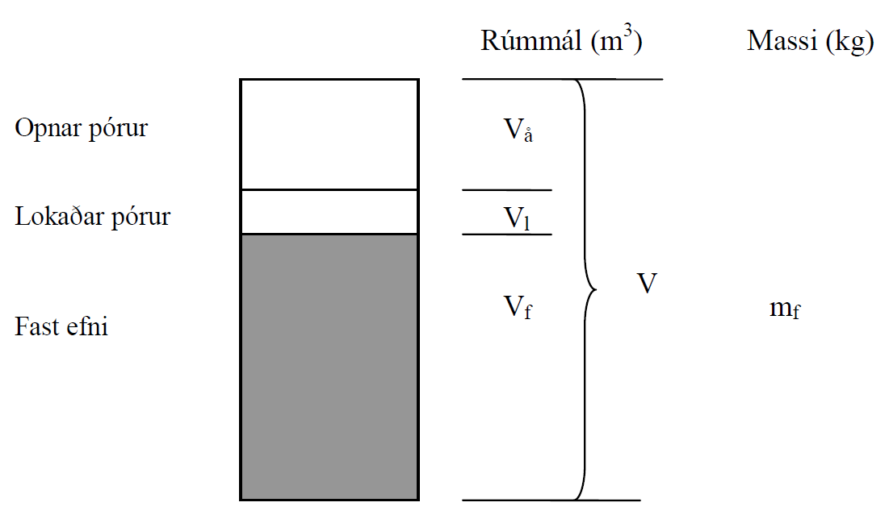
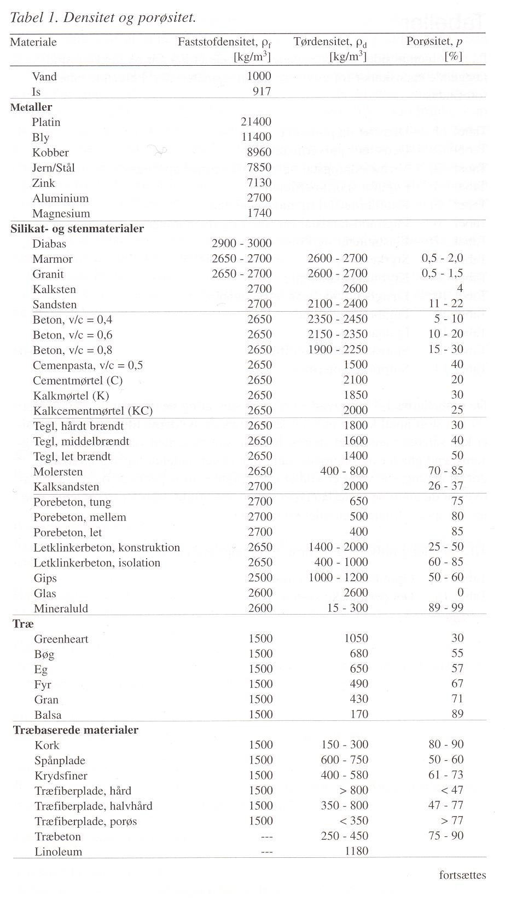
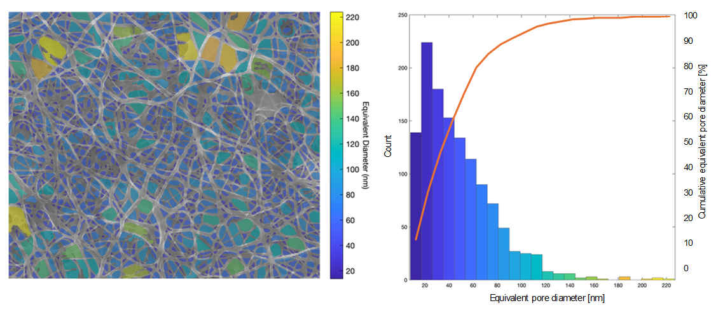
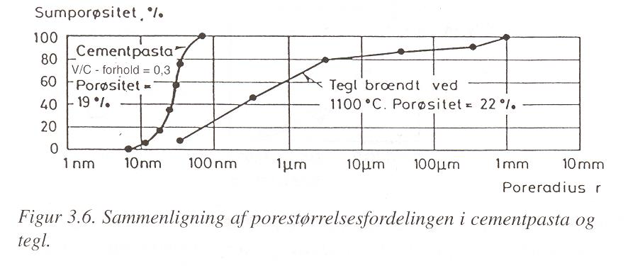

Kafli - Holrýmd og efnisþéttleiki
=================================
Þéttleiki og pórur
~~~~~~~~~~~~~~~~~~

Fjöldi efna, að málmum undanskyldum, eru ekki fullkomlega þétt heldur eru loftbólur,
pórur, í efninu. Pórurnar geta ýmist verið opnar (fyrir vatni) eða lokaðar, og í síðarnefnda
tilvikinu þá gert ráð fyrir að vatn komist ekki í þær pórur. Slík efni eru sögð pórótt, og
heildarrúmmál póranna, sem hlutfall af heildarrúmmáli efnisins, er kallað holrýmd
(stundum póruhlutfall, porøsitet).

.. figure:: ./myndir/kafli03/porottefni.png
  :align: center
  :width: 70%

Heildarrúmmál:

.. math:: 
  V = V_f + V_l + V_å

Fyrir kornótt efni er skilgreint kornarúmmál, :math:`V_k`, sem er heildarrúmmál korna og póra í
kornum, en rými milli korna ekki meðtalið.
Orðið “density” var áður þýtt sem rúmþyngd, en nú sem þéttleiki (sem er réttara). Gamla
hugtakið er þó enn til í heitinu kornarúmþyngd.

.. panopto:: 5ad66baa-2db4-4802-8bce-b04b00d2f1f9
    :width: 100%
    :height: 400

Holrýmd (porøsitet)

.. math::
  p = p_å = \frac{V_å}{V}

Fastefnisþéttleiki (faststofdensitet)

.. math::
  \rho_f = \frac{m_f}{V_f}

Sýndar-fastefnisþéttleiki (tilsyneladende faststofdensitet)

.. math::
  \rho_{tf} = \frac{m_f}{V_{tf}} = \frac{m_f}{V_f+V_l}=\frac{m_f}{V-V_å}

Þurr sýndarþéttleiki (tilsyneladende tørdensitet)

.. math:: 
  \rho_d = \frac{m_f}{V} = \frac{m_f}{V_f+V_l+V_å}

Vatnsmettuð kornarúmþyngd, yfirborðsþurr (korndensitet i vandmættet, overfladetør tilstand)

.. math::
  \rho_{ssd} = \frac{m_f+V_å\cdot \rho_w}{V} = \frac{m_f+V_å\cdot \rho_w}{V_f+V_l+V_å}

.. line-block::  
  :math:`\rho_w` = eðlisþéttleiki vatns 
  :math:`\rho_w = 998,2 kg/m^3` við :math:`20 ^{\circ}C`

Kornarúmþyngd, ofnþurr (korndensitet)

.. math::
  \rho_k = \frac{m_f}{V_k}

:math:`V_k` kornarúmmál, þ.e. rúmmál korna og póra í kornum, en rými milli korna ekki meðtalið

Fyrir efni sem innihalda skilgreind op eða göt, t.d. hleðslusteina er hægt að skilgreina;

* Heildarþéttleika; efnismassi á móti ytra rúmmáli steins (með götum)
* Nettóþéttleika; efnismassi á móti efnisrúmmáli steins (götin ekki reiknuð með)

Ýmis hugtök er varða þéttleika og holrýmd (mismunandi aðilar nota mismunandi hugtök og hugtökin talsvert á reiki – og ekki bara hérlendis!);

.. list-table:: Hugtök er varða þéttleika og holrýmd
   :widths: 15 15 15
   :header-rows: 1

   * - Íslenska
     - Danska
     - Enska skv. ASTM C127-81
   * - holrýmd
     - porøsitet
     - porosity
   * - fastefnisþéttleiki
     - faststofdensitet
     - 
   * - sýndar-fastefnisþéttleiki
     - tilsyneladende faststofdensitet
     - Apparent Specific Gravity
   * - þurr sýndarþéttleiki
     - tilsyneladende tørdensitet
     - Bulk Specific Gravity
   * - vatnsmettuð kornarúmþyngd, yfirborðsþurr
     - korndensitet i vandmættet, overfladetør tilstand
     - Bulk Specific Gravity (sat.surf. dry)
   * - kornarúmþyngd
     - korndensitet
     - 
   * - heildarþéttleiki
     - bruttodensitet
     - 
   * - nettó þéttleiki
     - nettodensitet
     - 

Pórótt efni eru sögð gleypin (e. hygroscopic). Rakahegðun gleypinna efna verður tekin ítarlega fyrir í kafla 5.

.. youtube:: oBXgIEIbfIA
    :width: 100%
    :height: 400

Pórudreifing og pórufjarlægð
~~~~~~~~~~~~~~~~~~~~~~~~~~~~

Holrýmd segir til um heildar póruinnihald efnis, en ekkert um stærðardreifingu.
Pórustærð og stærðardreifing er mjög mismunandi eftir efnum.

Á myndinni er smásjármynd af þversniði úr efni notuð til þess að telja fjölda póra með ákveðna stærð.

Pórudreifingu verður ekki lýst með einni tölu, en þættir sem eru áhugaverðir eru;

* stærðardreifing
* fjarlægð milli póra (og þá iðulega póra yfir ákveðinni stærð)
* heildarflatarmál póruyfirborðs (specifikke overflade, e:specific surface area)

Þessir þættir hafa m.a. áhrif á

* styrk efnis (bæði háð holrýmd og pórudreifingu, þó svo jafna Ryschkewitch, :math:`\sigma_p = \sigma_0 \cdot e^{-B\cdot p}`, taki einungis mið af holrýmdinni)
* rakaeiginleika (rakadrægni og vatnsdrægni)
* frostþol (t.d. steypu).
* hæfni til að binda efni, bæði vökva (t.d. rakadrægni) og lofttegundir (notað í efnafíltrun)

Mælingar á þéttleika, holrýmd, pórudreifingu og vatnsdrægni
~~~~~~~~~~~~~~~~~~~~~~~~~~~~~~~~~~~~~~~~~~~~~~~~~~~~~~~~~~~

*Efnisþéttleiki og holrýmd*
Eins og sjá má af jöfnum og skilgreiningum hér að framan þá byggja mælingar iðulega á
vigtun efnis við mismunandi rakaástand (þurrt, yfirborðsþurrt, rakamettað).

Með vigtun í lofti annarsvegar og í vatni hinsvegar má fá efnismassa (í mismunandi
ástandi) og ákvarða rúmmál efnishluta sýnisins. Til að ákvarða heildarrúmmál
(sýndarrúmmál) þá er sýnið ýmist stærðarmælt með mælistokk (málband, skífmál,
mikrometer mæli) eða rúmtak mælt í íláti.

Útfrá slíkum mæliniðurstöðum má ákvarða holrýmd og efnisþéttleika fyrir mismunandi
rakaástand.

*Vatnsdrægni*
Heildar vatnsdrægni (rakamettun, mettivatn) má ákvarða útfrá mæliniðurstöðum sem fást
að ofan. Stundum er áhugavert að skoða hvernig vatnsdrægni er háð tíma þar til mettun
næst og er þá sýninu komið í snertingu við vatn og þyngdaraukning skráð á tíma yfir
eitthvert tímabil.

*Pórudreifing*
Stærðardreifing á pórum er almennt mæld með því að athuga hversu mikið af vökva með
þekkta eiginleika gengur inn í sýnið við mismunandi mismunaþrýsting (milli sýnis og
vökva)

* áður var yfirleitt notað kvikasilfur og settur yfirþrýstingur á kvikasilfrið
* nú er gjarnan notað t.d. vatn og settur undirþrýstingur á sýnið (e:suction)

Pórustærð og fjarlægð milli póra er í steypu almennt ákvarðað með athugun á sýni í
smásjá, upplýsingar má fá með beinni talningu og mælingu, eða myndgreiningu.

Dæmi:

Mæla skal efnisþéttleika, og holrýmd steypusýnis:

1. Sýnið vegið þurrt í lofti -> gefur efnismassann :math:`m_f`
2. Sýnið vatnsmettað (opnar pórur fyllast af vatni) og vegið a) í lofti, b) í vatni

  a) :math:`m_{2a}-m_f` gefur mettivatnið og þar með rými opinna póra, :math:`V_å`
  b) :math:`m_{2a}-m_{2b}` gefur rúmmálið sem sýnið ryður frá sér og því heildarrúmmál sýnisins V (1 g samsvarar 1 :math:`cm^3`)

Til þess að ákvarða fastefnisþéttleikann, :math:`\rho`, þarf að mala sýnið og ákvarða síðan rúmmál
malaða hlutans, :math:`V_f`.

Eftirfarandi mæliniðurstöður fengust úr mælingum;

.. list-table:: Mælingar
   :widths: 15 15
   :header-rows: 1

   * - Sýni vegið þurrt í lofti
     - :math:`m_f = 2200 g`
   * - Sýni vatnsmettað og vegið
        a) í lofti
        b) í vatni
     - _
        a) :math:`m_{2a} = 2260 g`
        b) :math:`m_{2b} = 1260 g`

Ákvarðið útfrá þessum niðurstöðum eftirfarandi stærðir fyrir umrætt steypusýni;

* Heildarrúmmál, :math:`V`
* Rúmmál opinna póra, :math:`V_å`
* Holrýmd, :math:`p`
* Sýndar-fastefnisþéttleikann, :math:`\rho_{tf}`
* Þurran sýndarþéttleika, :math:`\rho_d`
