Kafli - Varmi og einangrun
==========================

Varmaflutningur getur verið eftir þrem leiðum;

* Geislun
* Streymi
* Leiðni

Varmaflutningsþéttleiki, q er ákvarðaður fyrir hverja flutningsleið (eða sambland af
leiðum). Fyrir þekktan varmaflutningsþéttleika má auðveldlega reikna orkuna Q yfir
ákveðið tímabil (og öfugt) útfrá jöfnu 4.1;

.. admonition:: Jafna 4.1
    :class: jafna

      .. math:: 
        Q = \Phi \cdot \Delta t = q\cdot A \cdot \Delta t

þar sem 

.. list-table:: 
  :widths: 5 5 5
  :header-rows: 0

  * - :math:`Q`
    - orka 
    - J
  * - :math:`\Phi`
    - varmaflutningur
    - W
  * - :math:`\Delta t`
    - tími
    - s 
  * - :math:`q`
    - varmaflutningsþéttleiki
    - :math:`W/m^2`
  * - :math:`A`
    - þverskurðarflatarmál varmaflutningsleiðar
    - :math:`m^2`

Geislun
~~~~~~~
Varmaflutningsþéttleiki vegna geislunar, :math:`q_s`, frá yfirborði er gefin sem;

.. admonition:: Jafna 4.2
    :class: jafna

      .. math::
        q_s = \sigma \cdot \varepsilon \cdot T^4

þar sem 

.. list-table:: 
  :widths: 5 5 5
  :header-rows: 0

  * - :math:`q_s`
    - varmaflutningsþéttleiki vegna geislunar 
    - :math:`W/m^2`
  * - :math:`\sigma`
    - Stefan-Boltzmann fastinn :math:`5,6697\cdot 10^{-8}` 
    - :math:`W/(m2\cdot K^4)`
  * - :math:`\varepsilon`
    - útgeislunartala yfirborðs
    - --
  * - :math:`T`
    - aflfræðilegt hitastig
    - K

Útgeislunartalan, :math:`\varepsilon`, er háð yfirborðseiginleikum;

.. list-table:: 
  :widths: 5 5
  :header-rows: 1

  * - Yfirborð
    - Útgeislunartala, :math:`\varepsilon`
  * - "svart" (e. black)
    - 1 
  * - Algeng byggingarefni
    - 0,8-0,9
  * - Fægt stál eða ál
    - 0,02-0,04

Orkugeislun sem fellur á yfirborð, skiptist í þrennt;

.. line-block::
  :math:`\alpha` tekin upp sem varmi (d: absorberet)
  :math:`\rho` endurkastast (d: reflekteret)
  :math:`\tau` hleypt í gegn (d: transmitteret)

og þá gildir vitaskuld að

.. admonition:: Jafna 4.3
    :class: jafna

      .. math::
        \alpha + \rho + \tau = 1

Þegar varmi flyst með geislun milli yfirborða þá hafa yfirborðseiginleikar beggja efna
áhrif á hverju þetta nemur, jafna 4.2 er þá iðulega umskrifuð þannig fyrir nettó
varmaflutnings-þéttleika frá fleti 1 til flatar 2, jafna 4.4;

.. admonition:: Jafna 4.4
    :class: jafna

      .. math::
        q_{s1-2} = C \cdot \left(T_1^4 - T_2^4\right)

þar sem 

.. list-table:: 
  :widths: 5 5 5
  :header-rows: 0

  * - :math:`q_{s1-2}`
    - nettó varmaflutningsþéttleiki vegna geislunar frá 1 til 2 
    - :math:`W/m^2`
  * - :math:`C`
    - stuðull sem tekur tillit til yfirborðseiginleika og Stefan-Boltzmann fastans
    - --
  * - :math:`T_1`
    - aflfræðilegt hitastig yfirborðs 1
    - K
  * - :math:`T_2`
    - aflfræðilegt hitastig yfirborðs 2
    - K

.. admonition:: Vísbending
    :class: hint

      :math:`C = F_{12}\cdot \sigma \cdot \varepsilon` fjallað verður um :math:`F_{12}` stuðulinn í „Húsagerð“

Streymi
~~~~~~~

Varmaflutningur vegna efnisstreymis (lofttegundar eða vökva) sem ber með sér varma
milli staða; streymið er alltaf orsakað af þrýstingsmun, sem getur átt sér tvær mismunandi
orsakir;

.. line-block::
  *Óþvingað streymi* (d: naturlig konvektion, e: natural convection)
  Streymið orsakast af hitamun, heitt efni (lofttegundir og vökvi) léttara en kalt.

.. line-block::
  *Þvingað streymi* (d: tvungen konvektion, e: forced convection).
  Ytri þrýstingsmunur, t.d. vindur

Leiðni
~~~~~~
Efnishiti er til marks um óreglulega hreyfingu efniseinda, orkuflutningur á sér stað þegar
eindir með hærri hraða rekast á eindir með lægri hraða (varmi flyst frá heitari stað til
kaldari).

Varmaleiðniþéttleika í gegnum efnislag má ákvarða samkvæmt jöfnu 4.5;

.. admonition:: Jafna 4.5
    :class: jafna

      .. math::
        q_{l} = \frac{\lambda}{d} \cdot \left(T_1 - T_2 \right)

þar sem 

.. list-table:: 
  :widths: 5 5 5
  :header-rows: 0

  * - :math:`q_{l}`
    - varmaleiðniþéttleiki
    - :math:`W/m^2`
  * - :math:`\lambda`
    - leiðnitala efnis
    - :math:`W/(m\cdot K)`
  * - :math:`d`
    - þykkt efnislags
    - m
  * - :math:`T_n`
    - hitastig yfirborðanna 1 og 2
    - K eða :math:`^{\circ}C`

*Eðlisvarmi* (d: varmekapacitet) og varmadreifð (d: varmediffusivitet)

Eðlisvarminn (d: specifikk varmekapacitet, varmefylde), :math:`c_p`, segir til um orkuþörf sem
þarf til að hækka hitastig af 1 kg efnis um eina gráðu Celsíus (eða Kelvin), einingin er
J/(kg·K)

Stundum er notuð afleidd stærð, :math:`c_p’`, sem er nauðsynleg orkuþörf til að hækka hitastig 1
:math:`m^3` efnis um 1 gráðu Celsíus;

.. math::
    c_p’=\rho \cdot c_p

þar sem 

.. list-table:: 
  :widths: 5 5 5
  :header-rows: 0

  * - :math:`c_p’`
    - rúmmáls eðlisvarmi
    - :math:`J/(m^3 \cdot K)`
  * - :math:`\rho`
    - efnisþéttleiki
    - :math:`J/(kg \cdot K)`
  * - :math:`c_p`
    - eðlisvarmi
    - :math:`J/(kg\cdot K)`

Hraði hitastigsbreytinga er mjög áhugaverður, sérstaklega í útreikningum á tímaháðum
hitabreytingum, en einnig sem mat á varmatapshraða t.d. yfirborðs. Varmadreifð, a, er til
mats um þennan hraða, en hún er háð leiðnitölu efnis, efnisþéttleika og eðlisvarma;

.. math::
  a = \frac{\lambda}{\rho \cdot c_p} [m^2/s]

Við snertingu virðist efni með háa varmadreifð kaldara (varminn leiðist hraðar burt)
heldur en efni með lága varmadreifð. Dæmi um varmadreifð nokkurra efna;

.. figure:: ./myndir/kafli04/varmadreifd.png
  :align: center
  :width: 100%

*Varmaflutningur í samsettu efnislagi* (gildir ekki bara fyrir pórótt efnslög)

Fæst efni eru alveg einsleit, og að auki eru efnislög (byggingarhlutar) iðulega samsettir úr
tveim eða fleiri efnum. Í umfjöllun kennslubókar eru byggt á hlutfallskiptingu rúmmáls
eftir mismunandi efnafösum (þar sem aðallega er verið að tala um áhrif holrýmdar), en í
útreikningum þarf þverskurðarflatarmál varmaflutnings, og lengd að vera þekkt, jafna
4.1.

Hægt er að líta á samsett efnislag sem **samsíðatengt/hliðtengt** eða **raðtengt**, en í reynd er það
eitthvað sambland af þessu tvennu.

Þar sem rúmmál efnisfasa fæst sem margfeldi af þverskurðarflatarmáli :math:`A_i` og lengd
varmaflutnings í fasa, :math:`d_i`, þá gildir

.. math::
  V_i = A_i \cdot d_i

Í umfjölluninni, fyrir samsíða/hlið tengt líkan, er d=fasti og gert ráð fyrir að
þverskurðarflatarmál varmaflutnings, A, fyrir einstaka efnisfasa sé í sama hlutfalli af
heildarflatarmálinu eins og rúmmálssamsetning efnisins;

.. math::
  A_1 \cong V_1 

o.s.frv.

Hliðstæða gildir fyrir raðtengt módel, þverskurðarflatarmál A=fasti, þá gildir fyrir
“lengd” varmaflutnings, d;

.. math::
  d_1 \cong V_1 

o.s.frv.

Þetta má þó einnig setja upp eins og sýnt er hér á eftir;

Samsíðatengt/hliðtengt líkan
----------------------------

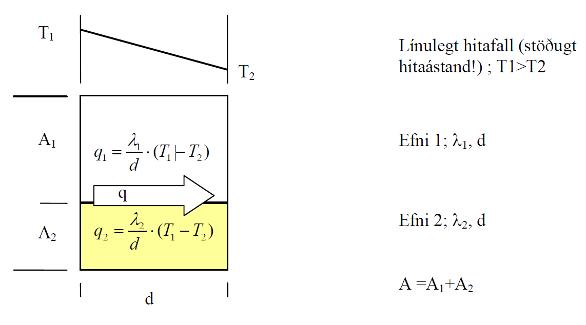

Hér gildir:

.. admonition:: Jafna 4.6
    :class: jafna

    .. math::
      q = \frac{\Phi}{A} = \frac{\Phi_1 + \Phi_2}{A} =  \frac{A_1\cdot q_1 + A_2\cdot q_2}{A} = \frac{A_1}{A} \cdot \frac{\lambda_1}{d} \cdot \left(T_1-T_2\right) + \frac{A_2}{A} \cdot \frac{\lambda_1}{d} \cdot \left(T_1-T_2\right) 

    .. math::
      = \left(\frac{A_1}{A}\cdot \lambda_1 + \frac{A_2}{A}\cdot \lambda_2 \right) \cdot \frac{\left(T_1-T_2 \right)}{d} = \frac{\lambda_{vegið}}{d} \cdot \left(T_1-T_2 \right)

Raðtengt líkan
--------------

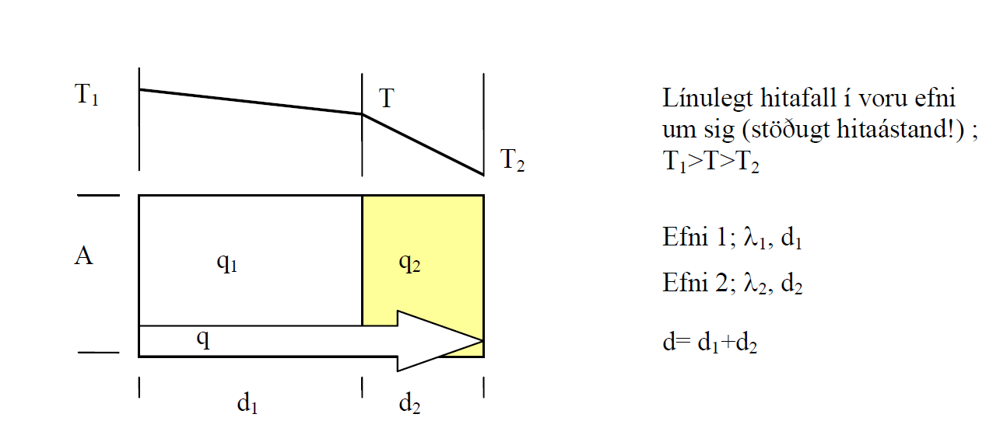

Hér gildir;

i) :math:`q = \frac{\Phi}{A} = \frac{\Phi_1}{A} = \frac{\Phi_2}{A} = q_1 = q_2`
ii) :math:`q_1 = \frac{\lambda_1}{d_1} \cdot \left(T_1-T \right)` 
iii) :math:`q_2 = \frac{\lambda_2}{d_2} \cdot \left(T-T_2 \right)` 

Jöfnurnar þrjár gefa (eftir smá umskrift; T einangrað úr t.d. ii og sett inn í iii) jöfnu 4.7;

.. admonition:: Jafna 4.7
    :class: jafna

    .. math::
      q = \frac{1}{\left( \frac{d_2 \cdot \lambda_1 + d_1 \cdot \lambda_2}{\lambda_1 \cdot \lambda_2} \right)} \cdot (T_1-T_2)

Þegar brotið, í sviga neðan striks, er skoðað sést að það má umskrifa (og innfærðar
stærðir R) þannig;

.. admonition:: Jafna 4.8
    :class: jafna

    .. math::
      \left( \frac{d_2 \cdot \lambda_1 + d_1 \cdot \lambda_2}{\lambda_1 \cdot \lambda_2} \right) = \frac{d_1}{\lambda_1} + \frac{d_2}{\lambda_2} = R_1 + R_2 = R

Þannig hafa verið skilgreindar nýjar stærðir, mótstöðutölur :math:`R_i`, fyrir hvort efnislag, og
heildarmótstaða fyrir samsetta efnislagið (samsvörun við samlagningaraðferð fyrir
raðtengdar mótstöður í rafmagnsfræði er augljós!)- aðferðin hefur almennt gildi, óháð
fjölda eða tegund efnislaganna.

Til samræmis við jöfnu 4.6 má útfrá jöfnu 4.8 skilgreina :math:`\lambda_{vegið}` fyrir raðtengt líkan, jafna
4.9;

.. admonition:: Jafna 4.9
    :class: jafna

    .. math::
      R = \frac{d}{\lambda_{vegið}} = \frac{d_1}{\lambda_1} + \frac{d_2}{\lambda_2} = V_1 \cdot \frac{d}{\lambda_1} + V_2 \cdot \frac{d}{\lambda_2} = \frac{d}{\left( \frac{\lambda_1 \cdot \lambda_2}{\left( \lambda_1 \cdot V_2 + \lambda_2 \cdot V_1 \right)}\right)}

Andhverfa stærðin við R er skilgreind sem kólnunartala, U-gildi. Jafnan 4.7 er þá
endurskrifuð sem 4.10;

.. admonition:: Jafna 4.10
    :class: jafna

    .. math::
      q = \frac{1}{R} \cdot \left( T_1-T_2 \right) = U \cdot \left( T_1-T_2 \right)

Í reynd gefur samsíðatengda líkanið efri mörk fyrir heildarleiðnitölu samsetta
efnislagsins, raungildi, en raðtengda líkanið gefur neðri mörk;

.. math::
  \lambda_{vegið-rað} < \lambda_{raungildi} < \lambda_{vegið-samsíða}

Leiðnitala efnis er augljóslega mjög háð holrýmd efnisins, en einnig efnisþéttleika;
Varmaflutningur

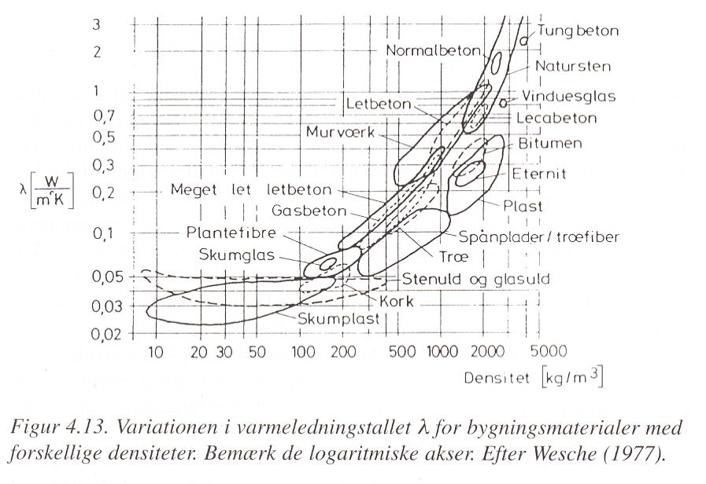

Varmaflutningur er háður geislun, streymi og leiðni, en iðulega eru þessir liðir sameinaðir
í leiðnitölu efnisins, sem þá er breytileg eftir m.a. efnisþéttleika og rakastigi.Dæmigerð
áhrif þessara leiða fyrir trefjakennt einangrunarefni, háð efnisþéttleika, eru sýnd á mynd
4.1

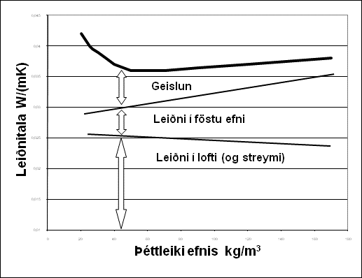

Mynd 4.1. Áhrif leiðni og geislunnar á leiðnitölu trefjakennds einangrunarefnis.

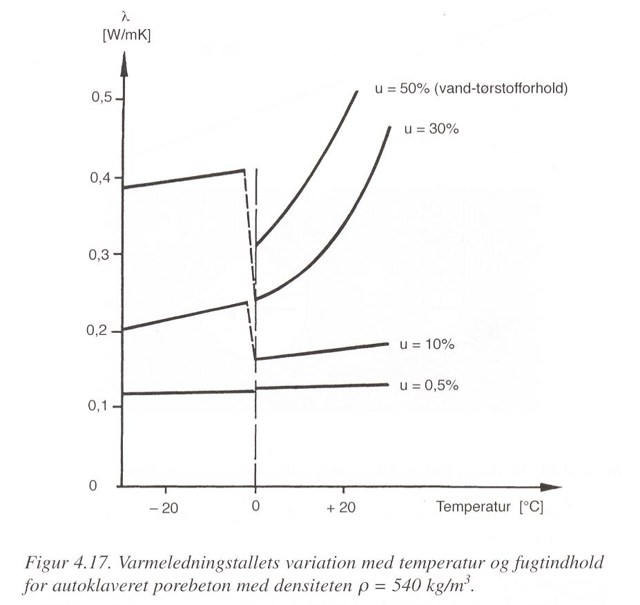

Varmaleiðnitala efnis er háð vatnsinnihaldi og ástandi vatnsfasans (vatn eða ís).

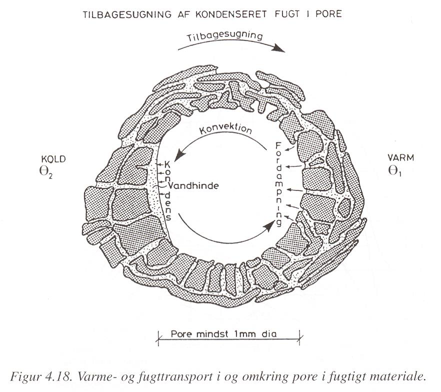

Varmi flyst með leiðni, geislun og streymi, og má þá ekki gleyma áhrifum
uppgufunarvarmans sem er margfalt hærri heldur en eðlisvarminn;

+ Eðlisvarmi vatns :math:`c_{p_w} = 4,23 kJ/(kg \cdot K)`
+ Uppgufunarvarmi vatns :math:`h_{fg}  = 2257 kJ/kg`

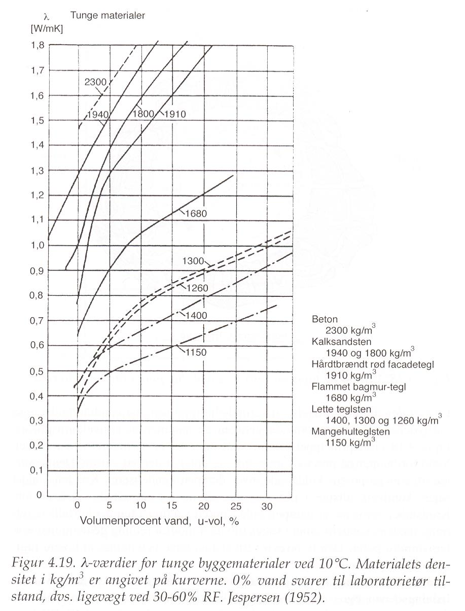

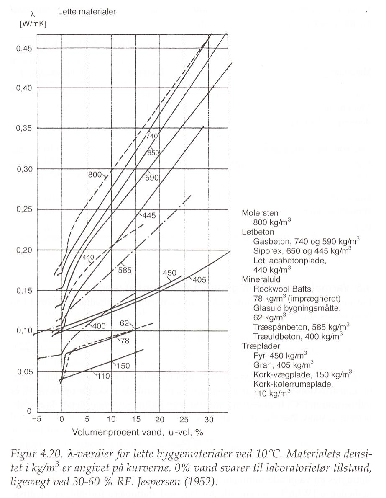

Mæling leiðnitölu
~~~~~~~~~~~~~~~~~
Leiðnitala efnis er mæld með þrennu móti;
a) Orkuþörf mæld
Tvö sýni mæld samtímis til að fá samhverfu í mæliuppsetninguna, tekið meðaltal
mælinganna. Uppbyggingin er :

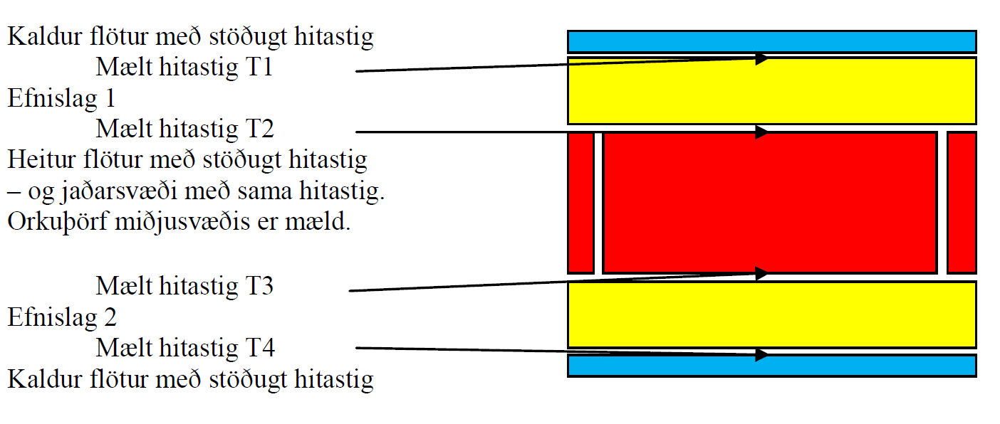

b) Hitafall yfir mælisýni og þekkt viðmiðunarsýni mælt
Eitt sýni mælt – og þá skiptir máli í hvaða átt varmaflutningurinn er! Uppbyggingin er:

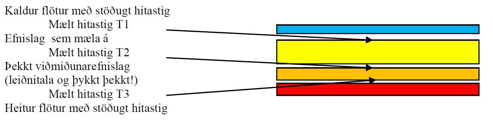

c) Varmaflutningur í gegnum sýnið mældur (þetta er keimlíkt og í lið b). Eitt sýni
mælt – og þá skiptir máli í hvaða átt varmaflutningurinn er! Uppbyggingin er:

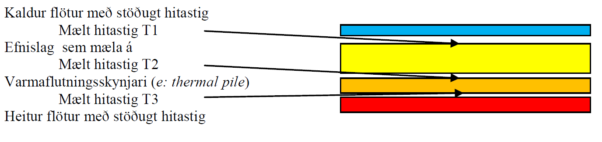

Óháð aðferð þá er varmaleiðnitala einangrunarefna almennt mæld við :math:`10^{\circ}C` meðalhita í
sýninu, og mæligildið nefnt :math:`\lambda_{10}`.

Mælda gildið er leiðrétt fyrir eftirfarandi áhrifsþáttum;

* Dreifingu í mæligildum
* Öðrum efnisraka í reynd heldur en í rannsóknastofu
* Öðrum meðalhita í reynd heldur en :math:`10^{\circ}C`
* Frágangi efnislags í byggingarhluta

og leiðrétta gildið nefnt “uppgefin leiðnitala” (deklareret værdi, e: declared value).

Einangrunarefni – tegundir og framleiðsluaðferðir
~~~~~~~~~~~~~~~~~~~~~~~~~~~~~~~~~~~~~~~~~~~~~~~~~

Algengustu einangrunarefnin hérlendis eru nú

* Steinull
* Frauðplast (þanið)
* Frauðplast (freytt)

En áður tíðkuðust einnig

* Vikurplötur og laus vikur
* Korkur
* Wellit (bylgjupappi)
* Dagblöð, sementspokar, hefilspænir, mosi.....

*Frauðplast (þanið) – framleiðsluferli (e: expanded polystyren, EPS)*
Plastkúlur (innfluttar) eru gjarnan forþandar með heitu lofti (gufu), þannig að kúlan er
þunnveggja skel utanum loftbólu, og geymdar þannig í síló (þetta var iðulega ekki gert
svona áður fyrr!). Kúlurnar eru svo settar í mót, gufu hleypt í gegnum mótið þannig að
kúlurnar þenjast aðeins og klessast þá saman í klump (oft um 1 x 1x 2m).
Klumpurinn er látinn jafna sig (ná eðlilegum efnishita og gjarnan látinn þorna ef þörf er
á) og síðan sagaður niður í plötur, sjá t.d. www.varmamot.is/fraud.htm
Freytt frauðplast (e:extruded polystyren, XPS)

*Steinull – framleiðsluferli (Ísland)*
Basaltsandur (aðalefnið, efnisþörf um 1200 kg pr. tonn einangrunar) og skeljasandur
bræddur á ofni við tæplega 1600 :math:`^{\circ}C`, þá fellur járn til botns og er því tappað frá. Bráðinni
er hellt á “spinner” (fjögur stálhjól sem snúast í sama plani) og þegar bráðin þeytist af
hjólunum þá lenda droparnir í loftblæstri sem dregur þá út í þræði, rakafælu og bindiefni
(hvorutveggja innflutt) er úðað á þræðina og loftstraumurinn feykir þeim á færiband.
“Mottan” á færibandinu fer í hersluofn þar sem einangrunin er pressuð saman og hert við
250 °C, (sjá t.d. www.steinull.is / vöruskrá /bls. 2).

Uppgefnar leiðnitölur algengra einangrunarefna

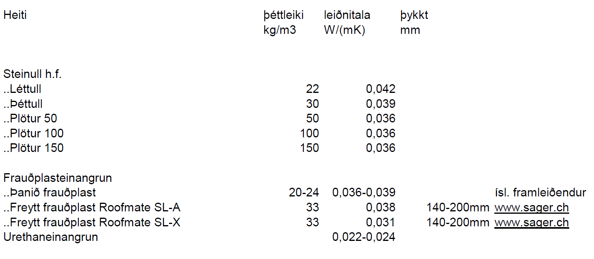