Kafli - Raki
============

Raki hefur mjög mikil áhrif á byggingarefni og eiginleika þeirra, og einnig á bygginguna
sem slíka og umhverfi. Það er í vaxandi mæli talað um nauðsyn “rakahönnunar” samfara
öðrum hönnunarferlum (útlit og fyrirkomulag, burðarkerfi, hita-og kælikerfi, vatn og
frárennsli).

Rakaálag stafar frá;

* Byggingarraka
* Veðurfari
* Innilofti
* Jarðraki
* Lekum lögnum

Áhrif raka á byggingarefni, **með hækkandi efnisraka**;

* Vex rakur efnisþéttleiki (og þar með eigið álag byggingarefna)
* Breytast stærðir breytast (efni þrútna eða lengjast)
* Minnkar styrkur og stífleiki
* Vex skrið (d: krybning, þ.e. tímaháð formbreyting)
* Hækkar varmaleiðni efna (leiðnitalan vex)
* Aukast líkur á niðurbroti og ending styttist (fúi í timbri, niðurbrot plastefna, frost og alkalískemmdir í steypu...)

Fyrir flest efni gildir að ef efnisrakinn nær “krítískum” mörkum (háð efnistegund) þá vex
hætta á niðurbroti og skemmdum mjög (þó þurfa önnur skilyrði iðulega að vera uppfyllt
einnig);

* fúi í timbri eða myglusveppir (:math:`HR>70 \%, \theta>5 ^{\circ}C`)
* niðurbrot plastefna (rakafilma á yfirborði og UV geislun)
* frost- og alkalískemmdir í steypu (frost: skrit og frost-þýðusveiflur)
* tæring málma (:math:`HR>65 \%`)

Rakaþrýstingur og rakainnihald lofts
~~~~~~~~~~~~~~~~~~~~~~~~~~~~~~~~~~~~
Andrúmsloft samanstendur af fjölda gastegunda; ca. 78% köfnunarfeni (N), 21% súrefni
(O) og 1% eðalgös, til viðbótar er almennt einhver raki til staðar.

Loftþrýstingurinn er summa hlutþrýstings allra loftegundanna (Lögmál Daltons);

.. admonition:: Jafna 5.1
    :class: jafna

    .. math::
        p_{tot} = \sum_i p_i

Fyrir hverja og eina af gastegundunum má nota eðalgasjöfnuna sem nálgunarfall;

.. admonition:: Jafna 5.2
    :class: jafna

    .. math::
        p \cdot V = \frac{m}{M} \cdot R \cdot T 

þar sem

.. list-table:: 
  :widths: 5 5 5
  :header-rows: 0

  * - :math:`p`
    - þrýstingur (hlutþrýstingur)
    - :math:`Pa`
  * - :math:`V`
    - rúmmál
    - :math:`m^3`
  * - :math:`m`
    - massi efnis
    - kg
  * - :math:`M`
    - mólmassinn
    - kg/mól
  * - :math:`R`
    - almenni gasfastinn
    - :math:`8,314 J/(mól \cdot K)`
  * - :math:`T`
    - aflfræðilegt hitastig
    - K

.. list-table:: Áhugaverðir fastar og kennitölur
  :widths: 5 5 5
  :header-rows: 0

  * - Almenni gasfastinn R
    - 8,314
    - :math:`J/(mól \cdot K)`
  * - Þurr loft, mólmasi
    - :math:`28,96 \cdot 10^-3`
    - :math:`kg/mól`
  * - Vatnsgufa, mólmassi
    - :math:`18,02 \cdot 10^-3`
    - :math:`kg/mól`
  * - Yfirborðsspenna vatns við :math:`20^{\circ}C`
    - 0,0728
    - N/m
  
Við gefið hitastig og þrýsting getur andrúmsloft innihaldið ákveðið hámarksmagn
vatnsgufu, :math:`c_s (kg/m^3)`, samsvarandi gufuþrýstingur (hlutþrýstingur vatnsgufu í
andrúmslofti), :math:`p_s (Pa)` kallast mettunarþrýstingur vatnsgufu (tafla 5.1).

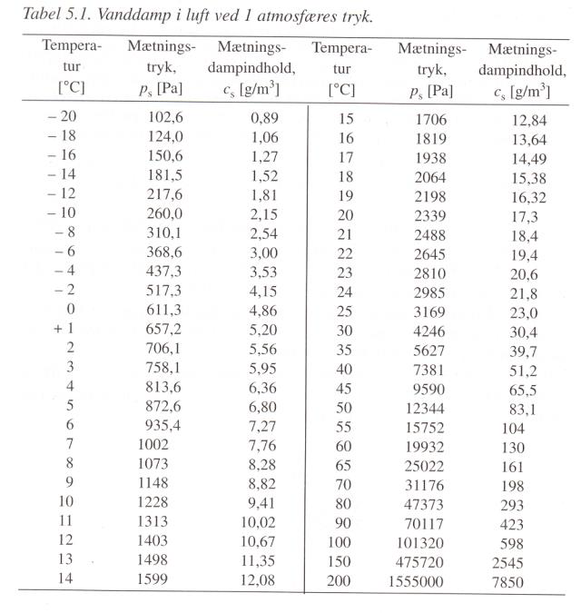

Mollierlínurit:

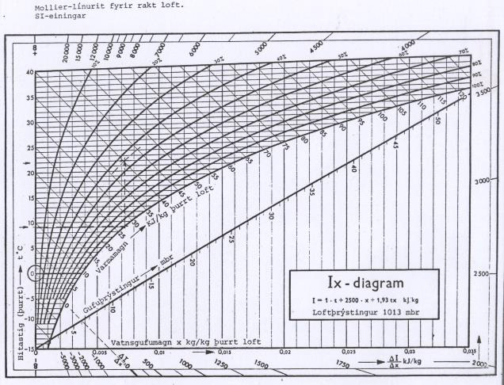

Fyrir loft sem inniheldur loftraka :math:`c`, með hlutþrýstingi :math:`p`, er skilgreindur hlutfallsraki, :math:`HR (\%)` eða :math:`\varphi (-)`

.. admonition:: Jafna 5.3
    :class: jafna

    .. math::
        \varphi = \frac{c}{c_s} = \frac{p}{p_s}
    
    og :math:`HR(\%) = 100 \cdot \varphi`

Hitastigið þegar rakaþétting á sér stað, fyrir loft með gefið rakainnihald (eða
hlutfallsraka), er nefnt **daggarmark**.

Dæmi:
Inniloft; lofthiti :math:`20^{\circ}C`, hlutfallsraki :math:`35 \%HR`

a) Hvert er rakainnihald loftsins :math:`(g/m^3)`?
b) Hvert er daggarmark loftsins :math:`(^{\circ}C)`?

Svar:

a) Mettunarraki lofts við :math:`20^{\circ}C` er :math:`c_s= 17,3 g/m^3`. Rakainnihald við :math:`35 \%HR` er þá; :math:`c=(35/100)\cdot 17,3 = 6,05 g/m^3`
b) Mettunarrakinn :math:`c_s=6,05 g/m^3` samsvarar hitastigi :math:`\theta`; :math:`\theta = 3,3 ^{\circ}` (fæst með brúun á töflugildum)

.. admonition:: Aðgát
    :class: caution

        það fæst ekki rétt niðurstaða ef þessir reikningar eru gerðir útfrá rakaþrýstingi; ástæðan er sú að rakainnihald lofts :math:`(g/m^3)` breytist ekki þó svo hitastigi þess sé breytt, en það gerir rakaþrýstingurinn hins vegar.

Væting yfirborðs; vatnssækin (d:hydrofil, e hydrophilic) efni og vatnsfælin (d:hydrofob, e: hydrophobic) 
– ath. Fig 5.3 í bók; „snertihornið alltaf mælt milli flatar og yfirborðs vökva, mælt í gegnum vökvann“

Vatnsyfirborð í hárpípu, eða póru, mun alltaf hafa sveigt (íhvolft) yfirborð—sem kallast vökvakúpull (d. menisk).

Undirþrýstingur í póru (hárpípu)
--------------------------------

Í hárpípu gildir

.. admonition:: Jafna 5.4
    :class: jafna

    .. math::
        r_m = r_k \cdot \cos(\theta)

og ekki gildir endilega að radíus vökvakúpulsins, :math:`r_m`, sé jafn
radíus pórunnar, :math:`r_p`, þetta ræðst af því hvort vatn er bundið
fyrir við póruvegginn.

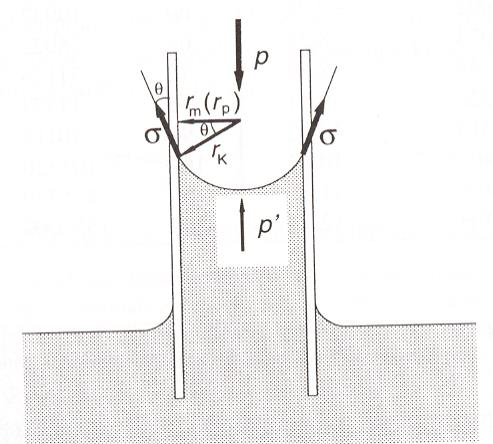

Þegar tekið er tillit til ytri loftþrýstings á annan enda
pípunnar, þá fæst undirþrýstingurinn p’ sem

.. admonition:: Jafna 5.5
    :class: jafna

    .. math::
        p \cdot \pi \cdot r_m^2 = p’ \cdot \pi \cdot r_m^2 + 2 \cdot \pi \cdot r_m \cdot \sigma \cdot \cos(\theta)

.. admonition:: Jafna 5.6
    :class: jafna

    .. math::
        p’ = p - \frac{2 \cdot \sigma \cdot \cos(\theta)}{r_m} = p - \frac{2 \cdot \sigma}{r_k}

Undirþrýstingurinn í póruvatninu minnkar fría orku vatnsins og þar með er
gufuþrýstingur í pórunni (yfir sveigðu vatnsyfirborðinu) lægri heldur en
mettunarþrýstingur yfir sléttu vatnsyfirborði (eins og sjá má ef :math:`r_k \to \infty` í jöfnunni..)

Líking Kelvins;

.. admonition:: Jafna 5.7
    :class: jafna

    .. math::
        \ln(\varphi) = \ln \left( \frac{p}{p_s} \right) = - \frac{ 2 \cdot \sigma \cdot M \cdot \cos(\theta)}{r \cdot \rho_w \cdot R \cdot T} = - \frac{2 \cdot \sigma \cdot M}{r_k \cdot \rho_w \cdot R \cdot T}

.. list-table:: 
  :widths: 5 5 5
  :header-rows: 0

  * - :math:`\varphi`
    - hlutfallsraki lofts í pórunni
    - --
  * - :math:`p`
    - rakaþrýstingur lofts
    - Pa
  * - :math:`p_s`
    - mettunarþrýstingur lofts við hitastig T
    - Pa
  * - :math:`\sigma`
    - yfirborðsspenna vatns við hitastig T
    - N/m
  * - :math:`M`
    - mólmassi vökvans
    - :math:`kg/(mól)`
  * - :math:`\theta`
    - snertihorn vökvans
    - --
  * - :math:`r`
    - radíi hárpípunnar
    - m
  * - :math:`\rho_w`
    - eðlisþéttleiki vökvans við hitastig T
    - :math:`kg/m^3`
  * - :math:`R`
    - almenni gasfastinn
    - :math:`J/(mól \cdot K)`
  * - :math:`T`
    - aflfræðilegt hitastig
    - K
  * - :math:`r_k`
    - radíi vökvakúpulsins, Kelvin radíi
    - m

Af líkingu Kelvins má sjá að fyrir grannar hárpípur þá er lækkun rakaþrýstings í pórunni
veruleg (sjá töflu í kennslubókinni).

Iðulega er gert ráð fyrir að snertihornið :math:`\theta = 0` (gildir þokkalega fyrir vatn í snertingu við
flest byggingarefni) :math:`\Rightarrow r_m = r_k`

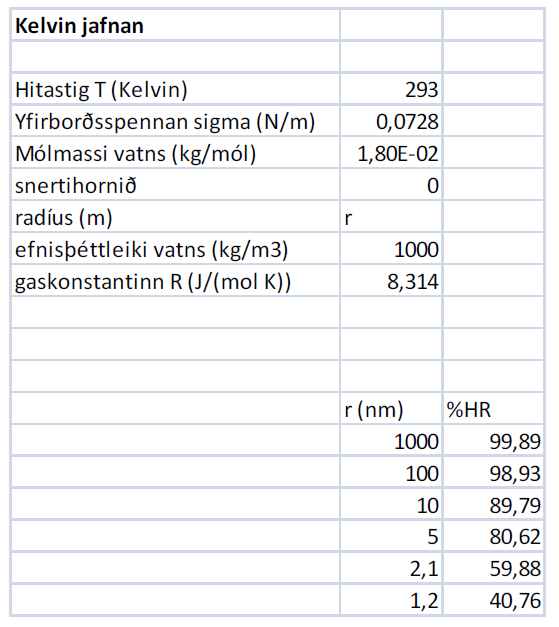

Fyrir t.d. sementsefju þá er póruradíi á bilinu 10-100 nm (sbr kafla 3)

Rishæð, H, í hárpípu
--------------------

Gert er ráð fyrir að sami ytri loftþrýstingur verki á báða
enda pípunnar, þá gildir um kraftajafnvægi fyrir hárpípu
(mynd 5.1), sem er í snertingu við vatnsyfirborð, gefur
jöfnu 5.8;

.. admonition:: Jafna 5.8
    :class: jafna

    .. math::
        \pi \cdot r^2 \cdot \rho \cdot g \cdot H =  2 \cdot \pi \cdot r \cdot \sigma \cdot \cos(\theta)
    .. math::
        H = \frac{2 \cdot \sigma}{r \cdot \rho \cdot g} \cdot \cos(\theta)

.. list-table:: 
  :widths: 5 5 5
  :header-rows: 0

    * - :math:`r`
      - radíus hárpípu
      - m
    * - :math:`\rho`
      - eðlisþéttleiki vökvans
      - :math:`kg/m^3`
    * - :math:`H`
      - vökvahæð í pípunni
      - m
    * - :math:`\sigma`
      - yfirborðsspenna vatns við hitastig T
      - N/m
    * - :math:`\theta`
      - snertihorn vökvans við pípuna
      - --

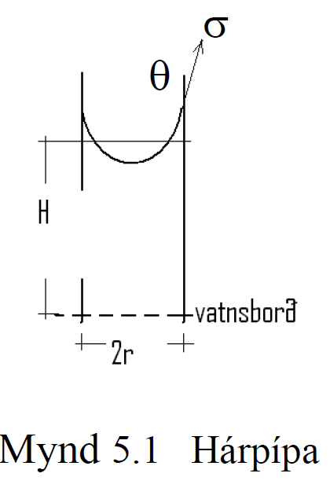

Uppgufun frá saltlausn er alltaf minni heldur en frá hreinu vatni, sjá töflu í bókinni.

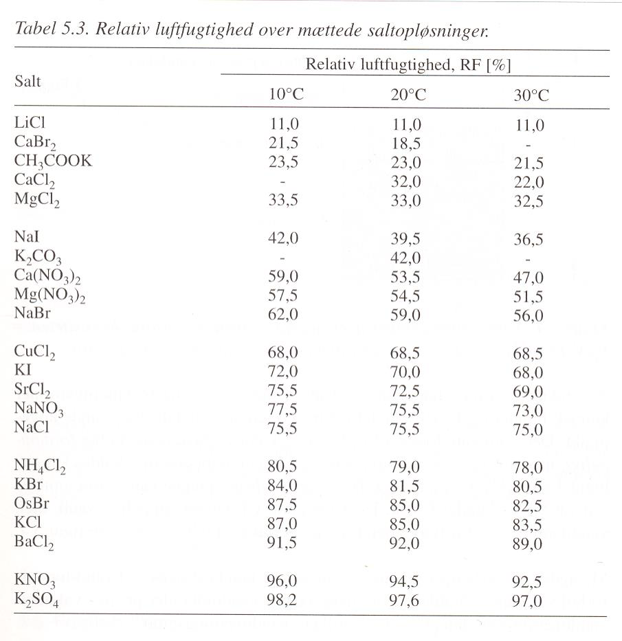

Vatn í byggingarefnum
~~~~~~~~~~~~~~~~~~~~~
Vatn er með ýmsu móti í byggingarefnum;

.. line-block::
    Bundið efnafræðilega (d:kemisk bundet) - t.d. í sementsefju og gifsi
    Bundið eðlisfræðilega (d:fysisk bundet) – vatnsfilma innan á póruveggjum
    Í pórum (d:fysisk fastholdt) – vatn í pórum og háræðum
    Frítt vatn (d:frit vand) – í stærri glufum og yfirborðsvatn

Vatn sem telst til síðari flokkanna tveggja getur gufað upp við venjulegan efnishita
(nothita) en til að losna við vatn í fyrri flokkunum tveim þá þarf verulega hækkun á
hitastigi.
- iðulega er þó bara talað um fatsbundið vatn og frítt vatn, þar sem síðarnefnda vatnið fer
við upphitun í :math:`105^{\circ}` (þá er efnafræðilega bundna vatnið eftir- og hugsanlega eitthvað af
því eðlisfræðilega bundna).

Vatn í efnum .. jöfnur 5.11 og 5.12, gerður greinarmunur á því hvort efnið er algerlega
vatnsmettað eða mettað með hárpípukröftum einungis (sbr. það sem áður var rætt í kafla
um holrýmd).

Rakaupptaka efna
----------------
Raki binst við yfirborð póra – en þetta er háð hitastigi og umhverfisraka. Efni í
rakajafnvægi við umhverfið: rakaþrýstingur í pórum sá sami og er í umhverfinu (lofti
utan við sýnið).

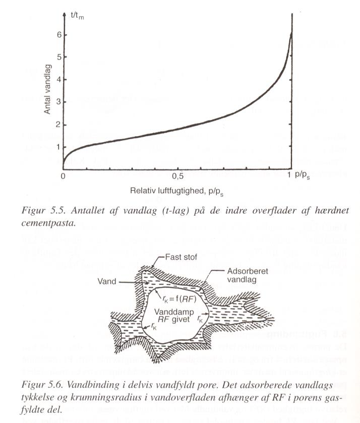

Jafnvægisrakinn er mismunandi eftir því hvort
efnið er að bæta við sig raka, eða að þorna út
(d:Adsorption – desorption).. .. og hver er
eiginlega rakinn í sýninu í reynd ?

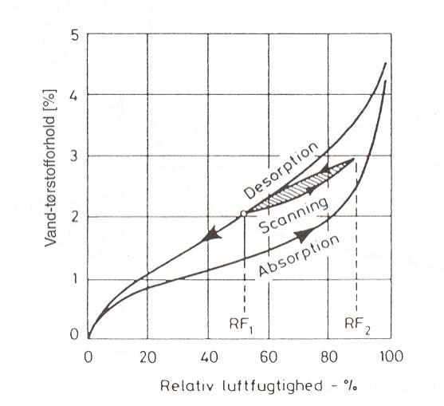

Jafnvægisrakalínurit timburs;

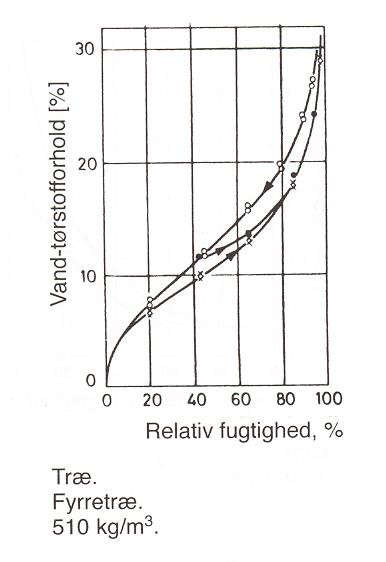

Dæmi:

Hver er jafnvægisraki timburs innanhúss þar sem loftraki er 60 %HR?

Svar: 

12-14 %, háð því hvort efnið er að taka upp raka eða losa sig við raka

Rakaupptaka efna
----------------
Jafnvægisrakalínan er illa skilgreind við mjög háan efnisraka...
 og þá stundum notuð “suctions” kúrfa í staðinn... á milli þessara kúrfa er þó samband:
Útfrá jöfnu 5.6 er mismunaþrýstingurinn :math:`p_{suc}` skilgreindur sem

.. admonition:: Jafna 5.9
    :class: jafna

    .. math::
        p_{suc} = p'-p = -\frac{2 \cdot \sigma}{r_k}

Jafna 5.9 og líking Kelvins (5.7) gefa saman;

.. admonition:: Jafna 5.10
    :class: jafna

    .. math::
        p_suc = -\frac{2 \cdot \sigma}{r_k} = \frac{\ln(\varphi) \cdot R \cdot \rho_w \cdot T}{M}

skýring tákna sem fyrr.

Í kennslubókinni er talað um að reikna “suctions”kúrfuna útfrá mældri
jafnvægisrakakúrfu, en í reynd gerist hið andstæða, það þarf að mæla “suctions”kúrfuna
þar sem sviðið sem er áhugavert (við hátt RF) fæst ekki út úr jafnvægisrakalínuritinu með
nægri nákvæmni. Enn sem komið er eru “suctions”kúrfur aðeins til fyrir fáein efni..
Samanburður á jafnvægisrakalínu og “suctions”kúrfu fyrir frauðsteypu (d:gasbeton) sýnir
vel hve miklar upplýsingar fást úr “suctions”kúrfunni á bilinu 98-100 %HR og hvað
jafnvægisrakalínan gefur rangar hugmyndir varðandi efnisraka á þessu rakabili.

Frauðsteypa; jafnvægisrakalínurit og „suctions“ kúrfa

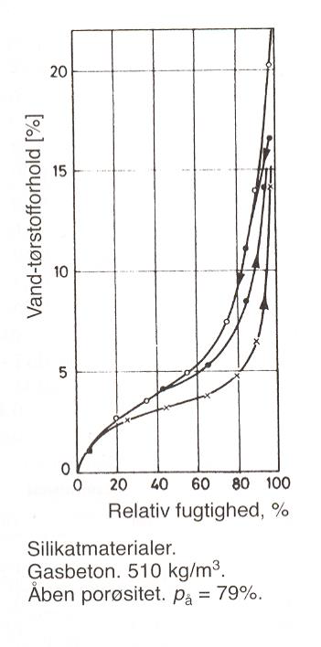

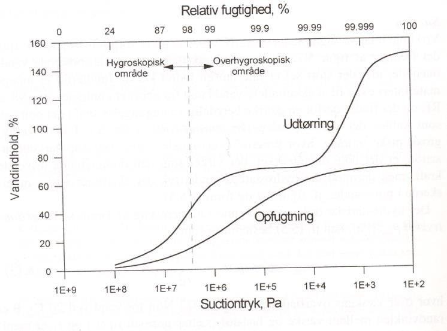

Rakaflutningur
~~~~~~~~~~~~~~

Rakaflutningur verður með þrennu móti;

* Vatnsflutningur (v. vatnsþrýstings eða hárpípukrafta)
* Rakaflæði
* Rakastreymi

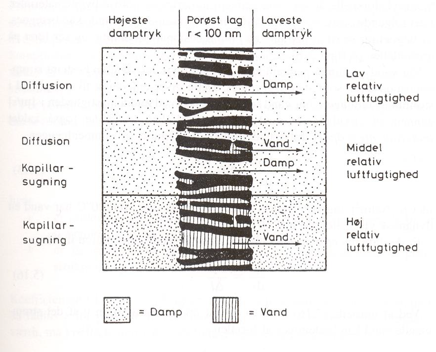

Skoðuð eru einfölduð, afmörkuð tilvik, í reynd samverka þau eitthvað en háð aðstæðum.

Vatnsflutningur vegna mismunaþrýstings í vatni
---------------------------------------------

Einfaldað líkan: Vatnsflutningur í pípu
Meðalvökvahraða í sívalri pípu má ákvarða ef þrýstistigullinn (d:gradient) er þekktur
(búið að taka tillit til eðlilegrar hrýfni fyrir umræðuna);

.. admonition:: Jafna 5.12
    :class: jafna

    .. math::
        \frac{\delta p}{\delta x} = 8 \mu \cdot \frac{v}{r^2}

þar sem 

.. list-table:: 
  :widths: 5 5 5
  :header-rows: 0

  * - :math:`\delta p / \delta x`
    - þrýstistigull 
    - Pa/m
  * - :math:`\mu`
    - kvik seigja vökvans
    - :math:`Pa \cdot s`
  * - :math:`v`
    - meðalhraði vökvans
    - m/s
  * - :math:`r`
    - radíi pípunnar
    - m

við stöðug skilyrði má skrifa stigulinn sem

.. admonition:: Jafna 5.13
    :class: jafna

    .. math::
        \frac{\delta p}{\delta x} = \frac{dp}{dx} = \frac{\Delta p}{\Delta x} 

þar sem :math:`\Delta p` er þrýstifall (Pa) yfir lengdina :math:`\Delta l` (m).

jöfnuna 5.13 má þá skrifa þannig (einangrað fyrir meðalhraðanum);

.. admonition:: Jafna 5.13
    :class: jafna

    .. math::
        v = \frac{r^2}{8 \cdot \mu}\cdot\frac{\Delta p}{\Delta l} = k \cdot \frac{\Delta p}{\Delta l}