Kafli - Styrkur og stífleiki
============================

Einása spennuástand
~~~~~~~~~~~~~~~~~~~

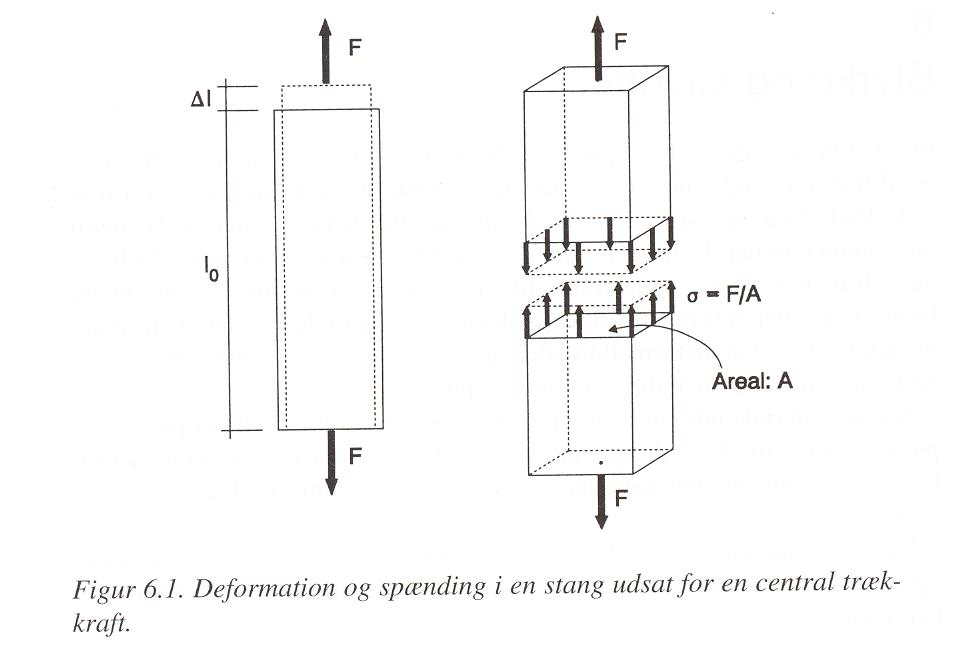

Formbreyting undir togáraun (eða þrýstiáraun); :math:`\varepsilon = \frac{\Delta l}{l_0}`

Tog og þrýstispennur; :math:`\sigma = \frac{F}{A}=E\cdot\varepsilon`

þar sem 

.. list-table:: 
  :widths: 5 5 5
  :header-rows: 0

  * - :math:`\sigma`
    - tog eða þrýstispenna
    - :math:`N/m^2`
  * - :math:`F`
    - tog eða þrýstiáraun
    - :math:`N`
  * - :math:`A`
    - þverskurðarflatarmál
    - :math:`m^2`
  * - :math:`E`
    - fjaðurstuðull
    - :math:`N/m^2`
  * - :math:`\varepsilon`
    - streita
    - :math:`-`
  * - :math:`\Delta l`
    - lenging í stefnu áraunar F
    - :math:`m`
  * - :math:`l_0`
    - upphafslengd
    - :math:`m`
  
Poisson's hlutfall

.. math::
  \nu = \frac{\varepsilon_{þvert}}{\varepsilon_{langs}}

Vinnulína og brotorka
---------------------

Vinnulína er samband áraunar og formbreytingar

.. admonition:: Aðgát
    :class: caution

        Vinnulína getur verið hvort sem er (i) samband krafts og lengingar, eða (ii) vægis og hornbreytingar!

Breyting í orku vegna formbreytingar er t.d. skilgreind sem (tákn eins og á meðfylgjandi
línuriti – Fig. 6.5 6.6);

.. math::
  dW = F \cdot d(\Delta l)

þar sem 

.. list-table:: 
  :widths: 5 5 5
  :header-rows: 0

  * - :math:`dW`
    - breyting í vinnu
    - :math:`Nm`
  * - :math:`F`
    - áraun
    - :math:`N`
  * - :math:`d(\Delta l)`
    - breyting í formbreytingu
    - :math:`m`

Þetta má umskrifa (og þá miðað við t.d. upphafs sniðflatarmál :math:`A_0` !) :

.. math::
  dW = F \cdot d(\Delta l)=(A_0 \cdot \sigma) \cdot d \varepsilon \cdot l_0 = V_0 \cdot \sigma \cdot d \varepsilon

og með tegrun má fá út heildar vinnu (orku) vegna formbreytingar, þetta samsvarar því
að taka flatarmál undir :math:`F-\Delta l` vinnulínunni.

Brotorkan er iðulega reiknuð á rúmmmetra efnis; :math:`\overline{W} = \frac{W}{V_0}`

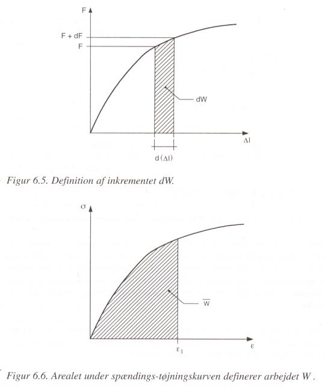

Venjuleg áraun gefur upplýsingar um styrk undir álagi, en síður hversu vel efni standast
mikið álag í mjög stuttan tíma (jarðskjálftar..)

.. youtube:: BHZALtqAjeM

.. admonition:: Hugtök í myndbandi
    :class: tip

      **stiff / stiffness** : stíft / stífleiki

      **strong / strength** : sterkt / styrkur  

      **ductile / ductility** : seigt / seigla

      **brittle** : stökkt 

      **toughness** : seigluorka

      **hard / hardness** : hart / harka

Formbreytingar og formbreytingarferlar
--------------------------------------

Ferillinn skiptist í (línulega) fjaðrandi og flot svið (fæst efni hafa í reynd alveg línulega
fjaðrandi svið!);

.. admonition:: Hugtök
    :class: tip

      **fjaðrandi** (d. elastisk, e. elastic): hæfileiki efna til að ná aftur fyrra formi eftir að áraun sem veldur formbreytingu er tekin af efninu
      
      **seig** (d. plastisk, e. plastic): hæfileiki efna til að halda varanlegri formbreytingu eftir að áraun sem olli formbreytingunni er tekin af efninu
      
      **hlutfallsmörk** (d. proportionalitetsgrænse) þegar línulega fjaðrandi ástandi líkur
      
      **fjaðurmörk** (d. elasticitestgrænse, e. elastic limit) – mörkin milli fjaður- og flotástands
      
      **flotspenna** (d. flydespænding, e. yield stress) - þegar flotmörkum er náð

Spennu-formbreytingarferillinn er almennt reiknaður miðað við upphafsþversnið sýnis
(:math:`A_0`), þess vegna virðist spennan falla í lokin (í reynd hækkar hún upp í brotástand- sbr.
umfjöllun í kennslubókinni!)

Spennu-formbreytingaferlar;
Styrkur, stífleiki og hámarks formbreyting er mjög háð efnum og ákvörðun fjaðurstuðuls, sem má ákvarða með tveim aðferðum (sem eru þó tengdar);

- “sekant” aðferð
- snertil aðferð

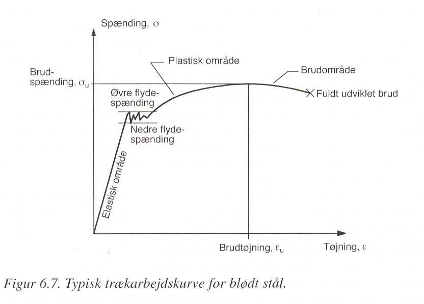

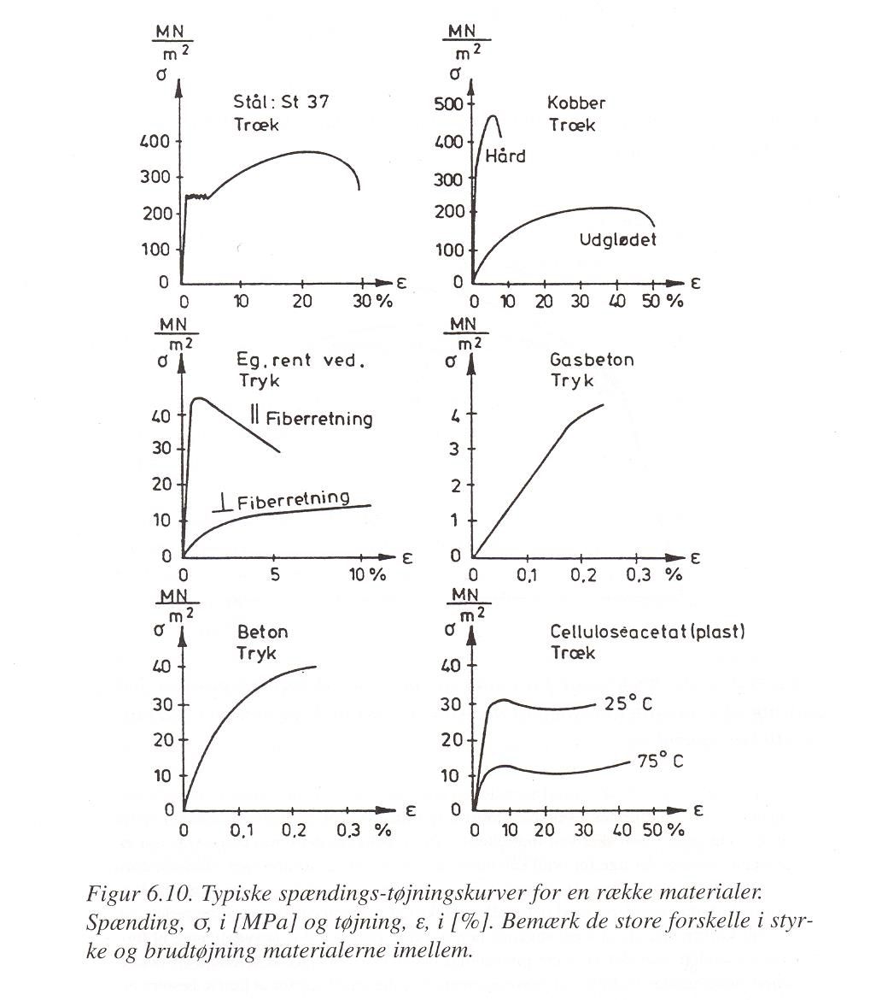

Skeráraun
---------

Á sama hátt og tog- og þrýstispennur eru háðar breytingu í lengd þá er skerspenna háð
formbreytingu (skælingu);

Formbreyting undir skúfáraun; :math:`\gamma = \frac{\Delta h}{h}` 

.. math::
  \tau = \frac{T}{A} = G \cdot \gamma

þar sem 

.. list-table:: 
  :widths: 5 5 5
  :header-rows: 0

  * - :math:`\tau`
    - skúfspenna
    - :math:`Pa`
  * - :math:`T`
    - skúfáraun
    - :math:`N`
  * - :math:`G`
    - skúfstuðull
    - :math:`Pa`
  * - :math:`\gamma`
    - formbreyting
    - :math:`-`
  * - :math:`\Delta h`
    - færsla í stefnu áraunar
    - :math:`m`
  * - :math:`h`
    - upphafslengd þvert á stefnu áraunar
    - :math:`m`

Höfuðspennur
------------
Spennur sem eru hornrétt hver á aðra og lýsa spennuástandi í sniði á fullnægjandi hátt
nefnast höfuðspennur (sbr. mynd í bókinni);

Í ein-ása áraun koma upp normalspennur (þvert á brotflöt) og skúfspennur samsíða
fletinum- auðvelt er að sýna að hámarks skúfáraun verður í plani sem hallar 45 ° frá
lengdarstefnu...

Almennt er efnisbrot skýrt þannig (á sérstaklega við málma) að fyrst myndist örsprunga
undir árauninni, þeim fjölgi og loks bresti þversniðið.. og skýra hversvegna brotsár í togi
er eins og það er!

Seigja; stökk eða seig efni
---------------------------
Skilin milli þess að efni sé seigt eða stökkt eru ekki skýr..

- brotlenging stáls í togprófun er til marks um mismunandi seigju mismunandi stálgerða..
- brotöryggi; stökk og seig efni..

Hersla málma
------------

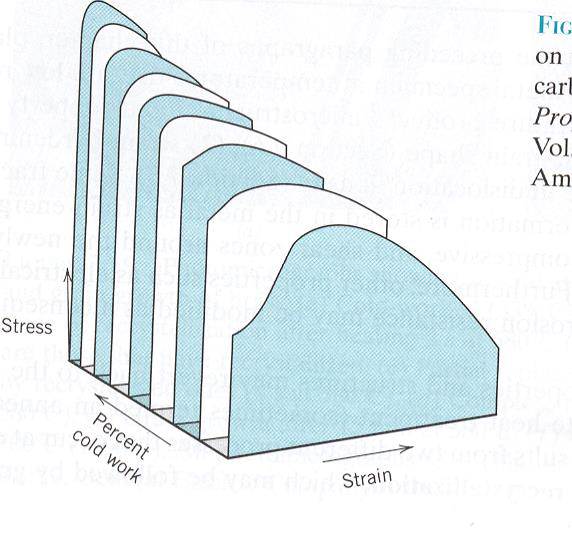

Þegar efni verður fyrir áraun yfir
hlutfallsmörkin og álagið er síðan tekið af,
þá herðist efnið. Með síendurtekinni áraun
má auka hersluna. Í bókinni er sagt frá
þessu eins og formbreytingarferillinn
breytist eingöngu þannig að hlutfallsmörkin
flytjist til, þ.e. fjaðrandi sviðið verður
umfangsmeira en hámarksspennur breytist
ekki. Í reynd má með réttum aðferðum
breyta kristallagrindinni og eiginleikar
breytast í samræmi við það, sjá mynd úr
Callister að ofan.

Einsátta (isotrop) og misátta (anisotrop) efni
----------------------------------------------

Mörg efni, t.d. málmar almennt og steypa, eru með eins eiginleika í ólíkar stefnur
höfuðása (þrýstiþol t.d. óháð stefnu), slík efni nefnast einsátta (isotrop). Önnur efni, s.s.
timbur, er með mjög ólíka eiginleika eftir mismunandi höfuðstefnum og er því misátta
(anisotrop).

Óháð því hvort efni eru eins- eða misátta þá eru gildi á mismunandi eiginleikum iðulega
mjög mismunandi, t.d. togþol ólíkt þrýstiþoli; þetta gildir fyrir steypu og timbur svo
dæmi séu tekin. Í öðrum tilvikum er munurinn óverulegur, t.d. í málmum.

Vegna þess hve auðvelt er að framkvæma einása prófun þá er þetta langalgengasta
prófunaraðferðin sem tog-, þrýsti- eða skerprófun..

Tvíása spennuástand
~~~~~~~~~~~~~~~~~~~

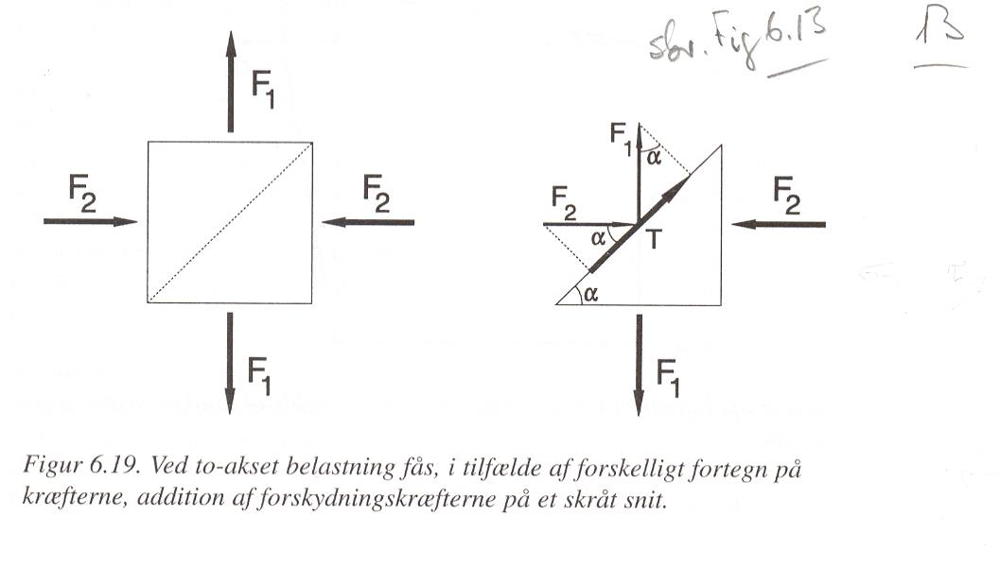

Tvíása áraun hefur áhrif á höfuðspennur; og háð
innbyrðis stefnu þá getur skúfspenna ýmist hækkað
eða lækkað miðað við einása spennu ástand fyrir kraftastefnur samkv.
Mynd sem jákvæðar fæst;

.. math::
  T = F_1 \cdot \sin{(\alpha)} + F_2 \cdot \cos{(\alpha)}

von Mises og Tresca ferlar fyrir tvíása
spennur og leyfilegar samsetningar af
spennum... Spennusamsetningar innan
markanna eru “öruggar” aðrar
samsetningar ekki !

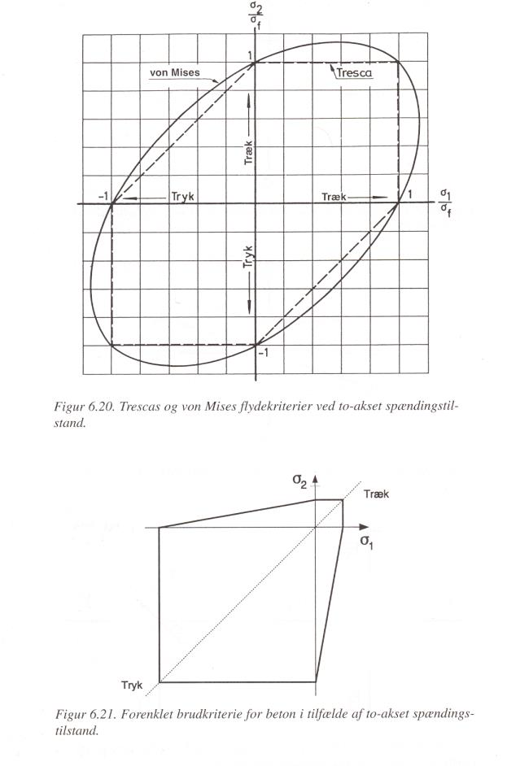

Tímaháð áhrif (e. rheology)
~~~~~~~~~~~~~~~~~~~~~~~~~~~

Formbreyting er alltaf tímaháð; þ.e. skipta má henni upp í skeið sem stýrast af tveim
einkennum;

- Skyndibreyting (d: momentan...)
- Tímaháð breyting

Í hvoru tilviki um sig er formbreytingin almennt samsett úr annarsvegar fjaðrandi- og
hinsvegar fljótandi formbreytingu..

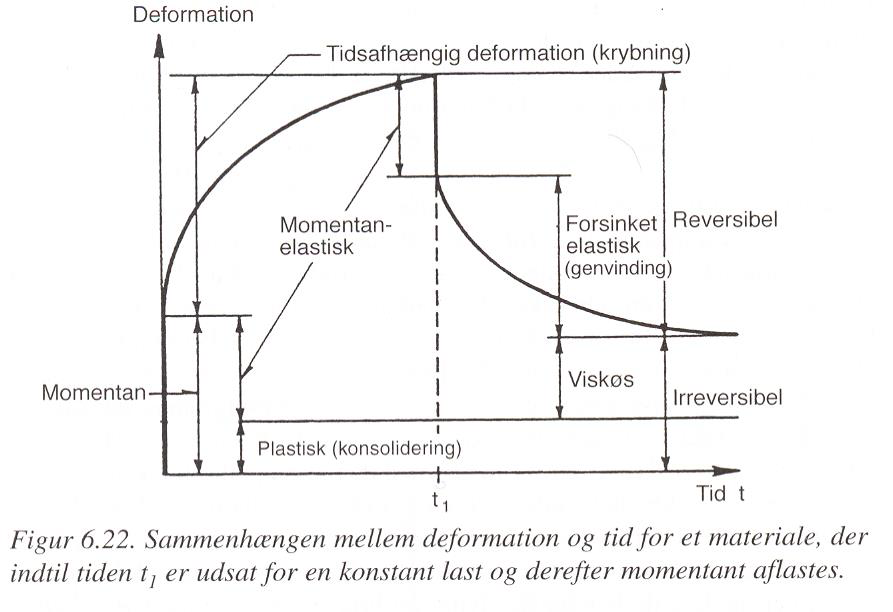

Langtímaformbreyting undir stöðugu álagi er nefnd skrið (krybning).
Formbreytingin (undir álagi) er samsett úr tveim þáttum; upphafsformbreytingu, 0, og
tímaháðri formbreytingu, c(t) og þegar innfært er hlutfall stærðanna og gert ráð fyrir
stöðugri spennu (þverskurðarflatarmálið óbreytt undir árauninni) þá fæst:

.. math::
  \varepsilon(t) = \varepsilon_0 + \varepsilon_c(t) = \varepsilon_0(1 + \phi(t)) = \frac{\sigma}{E}(1+\phi(t))

(stundum er skilgreint skriðfallið :math:`c(t)=\frac{\varepsilon(t)}{\sigma}`)

Síðasti hluti umskriftarinnar gerir þó ráð fyrir að skriðbreytistærðin :math:`\phi(t)` sé óháð
spennunni, en það gildir einungis fyrir línulega seig-fjaðrandi (linear visko-elastic) efni.

Fyrir mörg byggingarefni má nálga skriðbreytistærðina með fallinu;

.. math::
  \phi(t) = \left ( \frac{t}{\tau} \right)^b

þar sem 

.. list-table:: 
  :widths: 5 5 5
  :header-rows: 0

  * - :math:`\phi(t)`
    - skriðbreytistærðin
    - :math:`-`
  * - :math:`t`
    - tími
    - :math:`sólarhringur`
  * - :math:`\tau`
    - efnisháð gildi
    - :math:`sólarhringur`
  * - :math:`b`
    - efnisháð gildi
    - :math:`-`

Gildið :math:`b` er einingarlaust en :math:`\tau` hefur sömu einingu og :math:`t`, oft sólarhringar. Stærðin :math:`\tau`
nefnd spennulosunartíminn (relaksationstiden) – sjá aftar.

Langtímaformbreytingar geta verið háð fleiri þáttum en álaginu; fyrir timbur skiptir t.d.
efnisrakinn mjög miklu máli (meira skrið við hærri efnisraka) þetta gildir einnig fyrir
steypu, en í minna mæli þó.

Langtímaformbreytingar eru langt í frá línulegar með tíma, og þetta hefur orðið
uppspretta að allskyns líkanagerð vegna útreikninga (sjá mynd úr Markestad og Maage).

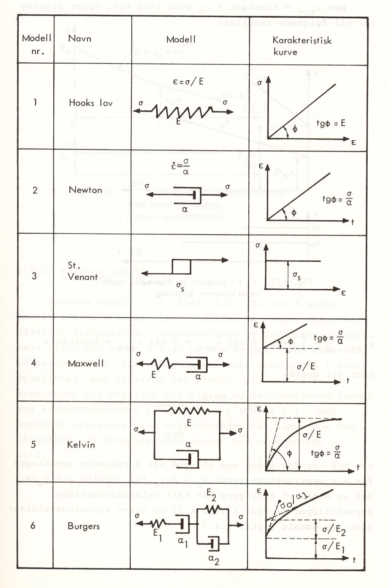

Tímaháð formbreytingarlíkön – úr Markestad og Maage (1975)

.. admonition:: Samlagningarregla Boltzmanns (Boltzmanns superpositionsprincip)
    :class: important

      Formbreytingar (eða spennur) frá mismunandi áhrifum má leggja saman (vel þekkt úr þolhönnun)..

Spennulosun (relaksation)
-------------------------

Þegar formbreytingu (t.d. lengingu) efnis er haldið stöðugri yfir lengri tíma þá á sér stað
spennulosun, þ.e. upphafsspennan lækkar.. (þetta er vel þekkt úr for- og eftirspenntum
burðarvirkjum).

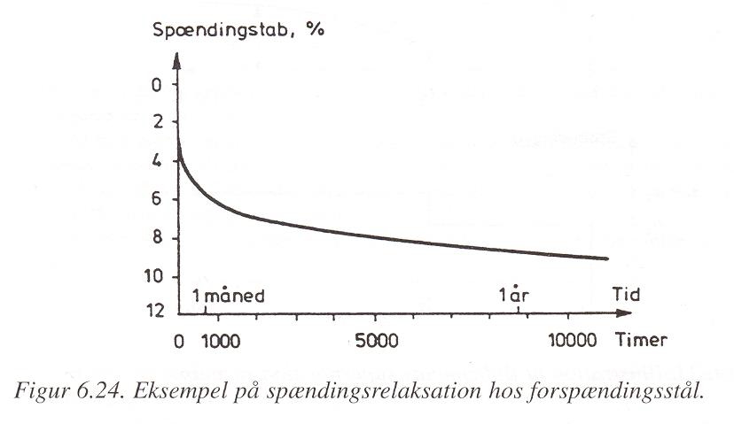

Fyrir spennulosun er skilgreint spennulosunarfall, :math:`r(t)`

.. math:: 
  \sigma(t) = \varepsilon \cdot r(t)

Spennulosun og skrið stafa af hliðstæðri (sömu) breytingu í efninu, en þessi áhrif eru lítt
kunn enn sem komið er..það verða því tengsl milli skriðfallsins, :math:`c(t)`, og
spennulosunarfallsins, :math:`r(t)` og í þeim tilfellum sem skrifa má skriðbreytistærðina :math:`\phi(t)` sem
veldisfall, þá gildir fyrir :math:`b<0,3` ;

.. math::
  r(t)=\frac{1}{c(t)} =\frac{E}{\left( 1 + \left( \frac{t}{\tau} \right)^b  \right)}

Atriði sem hafa áhrif:
Skrið er háð uppbyggingu og ytri áhrifum (það er ekki augljóst hvort öll atriðin eru
innbyrðis óháð?!);

Uppbygging

* Efnistegund (málmur, steypa,...)
* Efnisgerð (holrýmd,...)
* Efnisgæðum (styrkur, stífleiki,...)

Ytri þættir

* Tími
* Spennuástand
* Forsaga (hvernig og hvenær)
* Hitastig
* Efnisraki
* Efnisstærðir

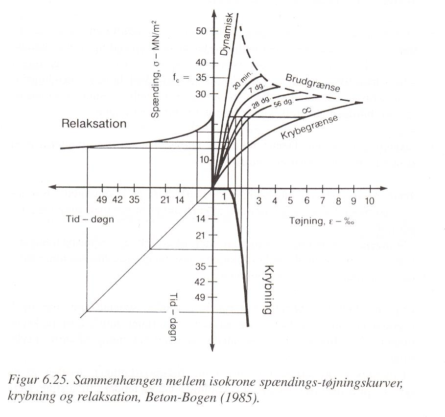

“Isokrone” spennu-formbreytingar línuritið sýnir sambandið milli augnabliks brotstyrks,
skriðs og spennulosunar fyrir steypu.
Skýringar;

1- fjórðungur “Dynamisk” línan sýnir niðurstöður fyrir prófun sem er keyrð mjög hratt
(ekkert skrið !)
“20 min” línan sýnir niðurstöður fyrir dæmigerða skammtímaprófun
Aðrar línur fyrir prófun í tiltekinn dagafjölda og loks skriðmörkin við
óendanlegan tíma (efri mörk skriðs)

2- fjórðungur sýnir tímaháða spennulosun við gefna (sömu) formbreytingu í efni

4- fjórðungur sýnir tímaháð skrið fyrir gefna (sömu) spennu í efni

Þreyta (udmattelse)
~~~~~~~~~~~~~~~~~~~

Þegar efni verður fyrir síendurteknu álagi (álagshrinum) þá getur slíkt framkallað
þreytubrot (þetta er almennt skýrt þannig að örsprungur (e:microcracks) séu til staðar í
efni, eða myndist, og þær vaxi með hverri álagshrinu þar til brotstyrkur efnis er minni en brotáraunin). Þreytubrot getur þannig orðið við lægri spennur heldur en sem samsvarar
uppgefnum kennistyrk efnis..
Brotspenna í þreytu reynist vera háð

.. math::
  \textrm{Fjölda álagshrina    } N
.. math:: 
  \textrm{Meðalspennu    } \sigma_m = \frac{\sigma_{max} + \sigma_{min}}{2}

.. math::
  \textrm{Sveifluútslagi (amplitud)    }\sigma_a = \frac{\sigma_{max} - \sigma_{min}}{2}

(Ath..fyrir stál eru spennurnar iðulega látnar sveiflast um 0, og þá miðað allan mun á
hæstu og lægstu spennu, reiknað með formerki)..
Prófun á þreytuþoli efnis er gerð með mismunandi áraun stöðuga sveiflutíðni,
niðurstaðan er sýnd sem Wöhler kúrfur eða Smith graf (í báðum tilvikum sjást áhrif
sveifluútslags og meðalspennu, sem fall af sveiflufjölda);

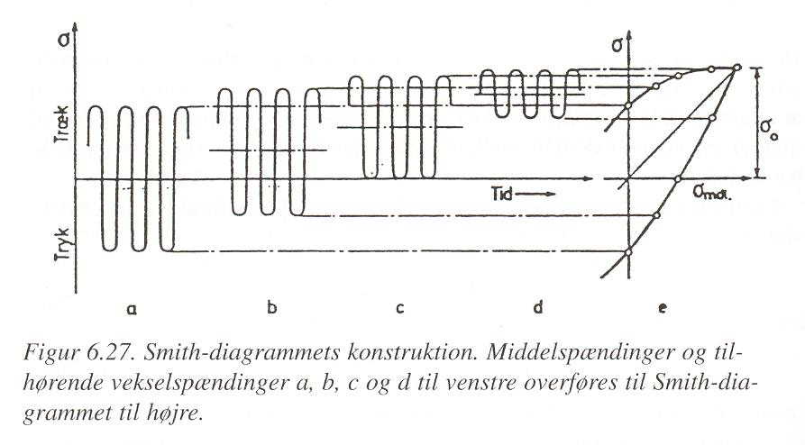

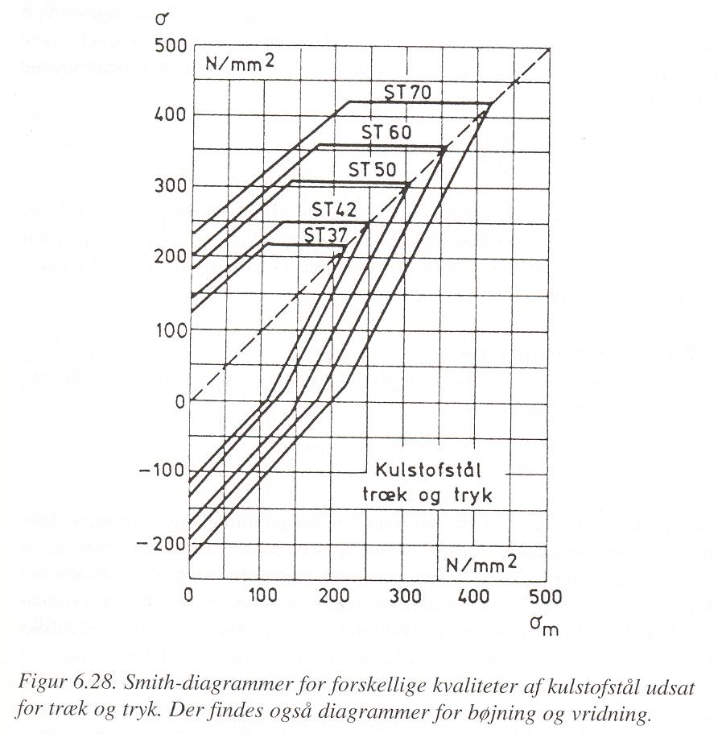

Smith graf er gert fyrir ákveðinn fjölda sveiflna, oft :math:`N=2 \cdot 10^6`, og sýnir allar
samsetningar af sveifluútslagi (y-ás) og meðalspennu (x-ás) sem eru leyfilegar
(svæðið innan línuumslags hverrar stálgerðar).
ATH: Hlutskaðakenninguna (delskadehypotes); lögð eru saman áhrif mismunandi
gerða álagshrina, n1, n2, n3 með hámarkssveiflufjöldann hver um sig N1, N2, N3,...

Viðnám og slitstyrkur
~~~~~~~~~~~~~~~~~~~~~

Skilgreindur viðnámsstuðull, :math:\mu (mismunandi fyrir kyrrstætt ástand eða ástand á
hreyfingu..)

.. math::
  \mu = \textrm{þverkraftur/normalkraftur}

(þverkraftur ákvarðast af álaginu sem þarf til að hreyfa normalkraftinn; þ.e. hlutinn)
Skriðöryggi... (á íþróttagólfum er það snúningur sem er ákvarðandi..!)
Slitstyrkur; hvað þolir efni mikinn núning..

Efnisprófanir (styrkprófanir)
~~~~~~~~~~~~~~~~~~~~~~~~~~~~~

Algengar efnisprófanir;

* Togþol - og fjaðurstuðull
  Mælt í togbekk; kraftur og lenging, oft einnig brotlenging
* Þrýstiþol - og fjaðurstuðull
  Mælt í álagspressu; kraftur og samþjöppun, oft einnig stærðarbreyting þvert á
  álagsstefnu
* Beygjutogþol - og fjaðurstuðull
  Mælt í álagspressu; ýmist sem eitt miðjuálag eða tvö..; kraftur og niðurbeygja
* Kleyfni
  Mælt í álagspressu; hámarkskraftur
* Harka..
  Hlut þrýst í efnið og -
  
  “þvermál” fars mælt;
  
  - Brinell
  - Vicker

  Dýpt fars mæld
  
  - Rockwell (málmar)
  - Shore (fjölliður)
  - Brinell eða Janka (timbur)
  - Bring (gólfefni)

* Slagharka
  Þetta er í reynd mæling á brotorku efnis og nýtist því til að meta getu efnis til að
  taka við höggum, og er iðulega notað sem prófun í tengslum við þróun og eftirlit:

* Slitþol (e: abrasion test)
  Mælt með núningi... ýmsar útfærslur (hjól, sléttur flötur,.. )

  .. figure:: ./myndir/kafli06/slagharka.png
    :align: center
    :width: 50%

Atriði sem hafa áhrif á mat á prófunarniðurstöðum
-------------------------------------------------

* Dreifing í niðurstöðum (Björn et al. 1992)

  .. figure:: ./myndir/kafli06/dreifing.png
    :align: center
    :width: 50%

* Lögun sýnis .. þetta skiptir verulegu máli og er því almennt skilgreint í viðeigandi prófunarstaðli!

* Álagshraði
  Mældur brotstyrkur er verulega háður álagshraðanum; stuttur tími -> hlutfallslega
  hátt gildi (lítill hraði og áhrif skriðs koma inn í mæliniðurstöðuna!)

* Stærð sýnis (stærðaráhrif) (Björn et al. 1992)

  .. figure:: ./myndir/kafli06/staerdarahrif.png
    :align: center
    :width: 50%

* Hitastig og raki
  Hitastig skiptir oftast litlu máli, undantekning er helst nema fyrir plastefni
  Raki skiptir alltaf verulegu máli þegar rakadræg efni eiga í hlut; efnisstyrkur og
  stífleiki t.d. timburs er mjög háður efnisraka (sbr. umfjöllun um timbur síðar!).