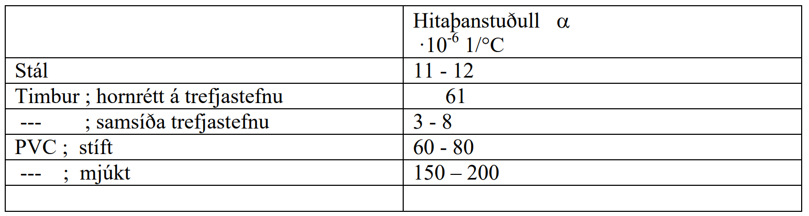
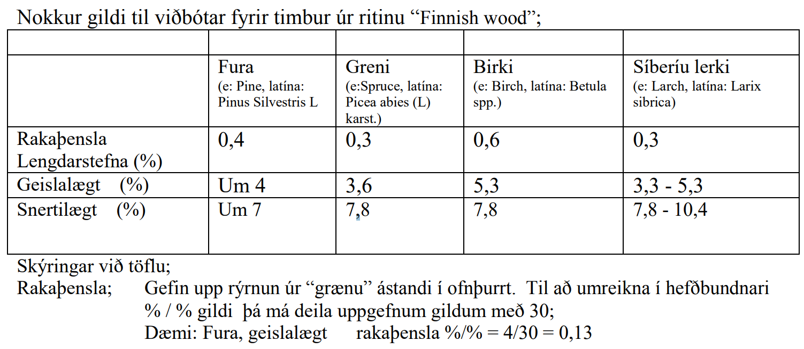
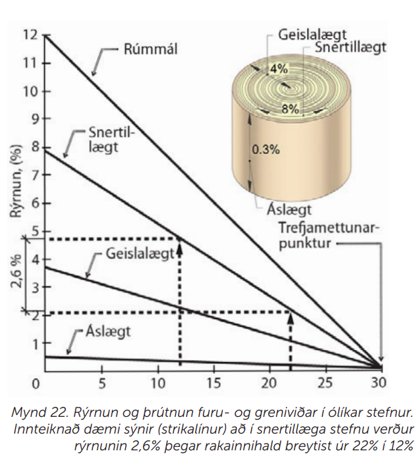
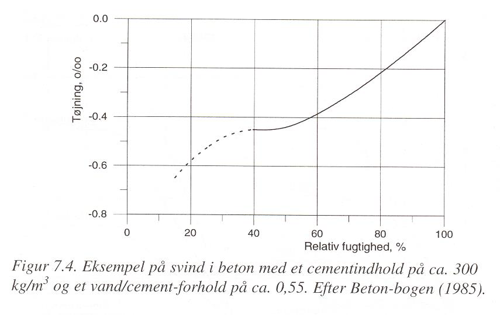
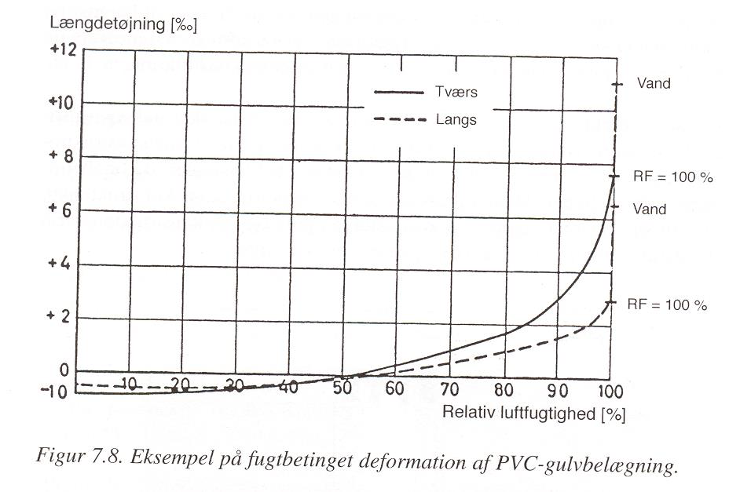

Kafli - Rúmmálsstöðugleiki
==========================

Í kafla 6 var getið um hlutfallsstærðarbreytingar, :math:`\varepsilon_1`, :math:`\varepsilon_2`, (í lengdar- og þverstefnu) vegna
álags. Hlutfallslegar stærðarbreytingar geta einnig orðið vegna hita- eða rakaáhrifa, og
samfara þessum stærðarbreytingum verður vitaskuld einnig rúmmálsbreyting, :math:`\Delta V` og
hægt er að skilgreina hlutfallslega rúmmálsbreytingu :math:`\varepsilon_V`;

.. math::
    \varepsilon_V = \frac{\Delta V}{V}

þá fæst rúmmál eftir stærðarbreytingu sem

.. math::
    V_1 = V_0 + \Delta V = V_0 \cdot (1+\varepsilon_V)

Fyrir upphafsstærðirnar :math:`l_{x,0}`, :math:`l_{y,0}` og :math:`l_{z,0}` og samsvarandi stærðarbreytingar :math:`\varepsilon_x`, :math:`\varepsilon_y`,  :math:`\varepsilon_z`, fæst

.. math::
    V_1 = l_x \cdot l_y \cdot l_z = l_{x,0} \cdot (1+\varepsilon_x) \cdot l_{y,0} \cdot (1+\varepsilon_y) \cdot l_{z,0} \cdot (1+\varepsilon_z)
.. math::
    = V_0 \cdot (1+\varepsilon_x) \cdot (1+\varepsilon_y) \cdot (1+\varepsilon_z)
    \approx V_0 \cdot (1+\varepsilon_x+\varepsilon_y+\varepsilon_z)

(gildir þokkalega fyrir hlutfallsbreytingar <1%)

Hitaháðar stærðarbreytingar 
~~~~~~~~~~~~~~~~~~~~~~~~~~~

Hitabreyting í efni veldur almennt einhverri stærðarbreytingu; aukið hitastig veldur
aukinni hreyfingu rafeinda í efninu, stærð frumeindanna vex og meðalfjarlægð þeirra
innbyrðis einnig.

Hitaþensla er fundin þannig;

.. math::
    \Delta l = \alpha \cdot \Delta T \cdot l_0

þar sem 

.. list-table:: 
  :widths: 5 5 5
  :header-rows: 0

  * - :math:`\Delta l`
    - stærðarbreyting
    - m
  * - :math:`\alpha`
    - hitaþanstuðull
    - :math:`\textrm{1}/^{\circ} C` eða 1/K
  * - :math:`\Delta T`
    - hitabreyting
    - :math:`^{\circ} C` eða K
  * - :math:`l_0`
    - upphafslengd
    - m

útfrá skilgreiningu á hlutfallslengingu fæst;

.. math::
    \varepsilon = \frac{\Delta l}{l_0} = \alpha \cdot \Delta T 

og fyrir línulega fjaðrandi efni, þar sem lengdarfærslan er hindruð (!), fæst spenna, :math:`\sigma`,
vegna hitabreytingar sem

.. math::
    \sigma = E \cdot \varepsilon = E \cdot \alpha \cdot \Delta T

.. Tafla 10 í bókinni gefur gildi á hitaþanstuðlinum :math:`\alpha` fyrir nokkur algeng efni. 

Vert er að athuga að;

* varmaþenslustuðull margra plastefna er mjög hár samanborið við önnur byggingarefni
* varmaþenslustuðull timburs er mjög mismunandi eftir stefnu í efninu.

Dæmi:

Hitaþanstuðull fyrir stál er :math:`\alpha = 12 \cdot 10^{-6} 1/^{\circ}C`, hvað þenst stálstöng á hvern
lengdarmetra við það að hitna um :math:`50 ^{\circ}C` ?

Svar:

.. math::
    \Delta l = \alpha \cdot \Delta T \cdot l_0 = 12 \cdot 10^{-6} \cdot 50 \cdot 1 = 6 \cdot 10^{-4} \textrm{m}

.. ggb:: tdcu8tvq

Rakaháðar stærðarbreytingar 
~~~~~~~~~~~~~~~~~~~~~~~~~~~

Þegar rakadræg efni taka rakabreytingu, þá veldur slíkt almennt einhverri
stærðarbreytingu; efnin skreppa saman við minnkandi efnisraka, en þrútna út við aukinn
raka.

Ástæður stærðarbreytinganna má rekja til

* Þrýstings í vatnsfilmu á póruveggjum
* Þrýstingsaukningar (í smáum pórum)
* Undirþrýstings í háræðum (gildir einungis fyrir háan hlutfallsraka)

Rakaþenslur efna eru því mjög háðar stærðardreifingu póra í efninu og styrkeiginleikum.
Rakaþensla í timbri er vegna þess að vatns kemst inn á milli fjölliðukeðja í efninu, sem
veldur rúmmálsaukningu (mest þvert á keðjurnar). Við vaxandi rakainnihald (yfir
trefjamettunarmörkum) byrjar vatn að safnast saman í holrými frumanna en þetta vatn
hefur engin áhrif til rúmmálsbreytinga í efninu.

Rakaþenslur eru fundnar á hliðstæðan hátt við hitaþenslur;,

.. math::
    \Delta l = \alpha \cdot \Delta u \cdot l_0 / 100

þar sem 

.. list-table:: 
  :widths: 5 5 5
  :header-rows: 0

  * - :math:`\Delta l`
    - stærðarbreyting
    - m
  * - :math:`a`
    - rakaþenslustuðull
    - %/%
  * - :math:`\Delta u`
    - breyting í efnisraka
    - %
  * - :math:`l_0`
    - upphafslengd 
    - m

Rakaþenslustuðull efna er alltaf gefinn upp fyrir einhverja breytingu í efnisraka, en þessi
breyting getur verið af mismunandi stærð. Fyrir timbur sjást iðulega gildi fyrir
rakabreytingu úr “blautu” ástandi í þurrt (þ.e. :math:`\Delta u \approx 30 \%`).

.. Í töflu 11 í kennslubókinni eru gefin gildi fyrir nokkur efni, og mismunandi
.. rakabreytingu. 

Myndin fengin úr Rb-blaði :cite:`2016:Sigurjonsson`

Steypa tekur allnokkrum stærðarbreytingum háð rakabreytingu – það má vænta þess að
rakaþensla sé svipuð og rýrnunin á línuritinu 7.4

Plast hefur miklar rakahreyfingar.. og einnig miklar hitahreyfingar eins og áður getur.

