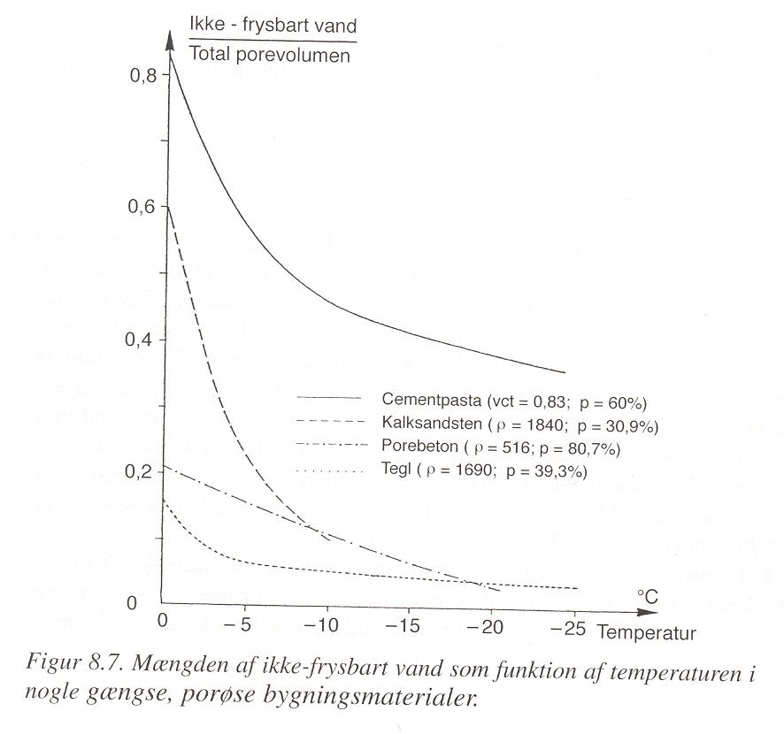

Kafli - Niðurbrot efna og ending
================================

Öll efni verða fyrir áraun á notkunartímanum sem veldur niðurbroti efnanna, hæfileiki
efnis til að standast niðurbrotsáraunina nefnist ending (holdbarhed, e:durability).
Tæknilegur nottími (levetid) efnis eða mannvirkis er sá tími sem efnið heldur
nægjanlegum gæðum..
Áraunin sem veldur niðurbroti má skipta upp í flokka eftir tegund; 

.. figure:: ./myndir/kafli08/nidurbrotsflokkar.png
  :align: center
  :width: 100%

Efnafræðilegt ferli
~~~~~~~~~~~~~~~~~~~

Algeng áraun er t.d.:

* Upplausn efna (t.d. í vatni)
    Dæmi: kalk þvæst úr steypu
* Efnabreyting (nýtt efni myndast)
    Dæmi:
      - Oxun málma; :math:`2 Fe + 3/2 O_2 \rightarrow Fe_2O_3`
      
      .. admonition:: Vísbending
        :class: hint

        Málmurinn oxast frá yfirborði (aðgengi að súrefni) og í þeim tilfellum sem oxuð
        málmfilman hindrar áframhald oxunar(súrefni kemst ekki í gegnum filmuna) þá
        er sagt að málmurinn sé orðinn “passífur” – þetta gerist t.d. á áli og riðfríu
        stáli, annars nefnist ástandið “aktíft”
      
      - Alkalí-kísil efnahvörf;
      - Kolsýring steypu; :math:`Ca(OH)_2 + CO_2 \rightarrow CaCO_3 + H_2O` 
        
      .. admonition:: Vísbending
        :class: hint

        Kolsýring eykur styrk steypunnar (þetta er helsta ástæðan fyrir því að steypa
        eykur styrk sinn með tímanum) – en breytir jafnframt sýrustigi hennar, sjá
        síðar!

Hraði breytingarinnar (niðurbrots) er háður;

+ Samsetningu efnisins
+ Þéttleika
+ Hversu hratt efni berast burt
+ Hitastigi (þumalfingursregla: hraðinn tvöfaldast fyrir :math:`10^{\circ}C` hitastigshækkun)

Raf-efnafræðilegt ferli
~~~~~~~~~~~~~~~~~~~~~~~

Flestir málmar finnast í náttúrunni í einhverjum efnasamböndum; súlföt, oxíð, klóríð,
karbónöt,... og eru hreinsaðir í einhverju orkukræfu framleiðsluferli. Hreinir málmarnir
hafa tilhneigingu til að hvarfast til að ná orkurýrara ástandi á ný...
Tæring málma er raf-efnafræðilegt ferli sem getur verið tvenns konar;

- Gastæring (þurr, krefst almennt að hitastig sé hátt)
- Vökvatæring (elektrolyt)

Vökva-raftæring járns

.. figure:: ./myndir/kafli08/taeringjarns.png
  :align: center
  :width: 100%

Dæmi:

Rafeindir eru teknar upp af rafleiðandi vökva sem rafeindaþyggjanda (elektronacceptor)
sem inniheldur súrefni og eða vetni, hvort um ræðir ræðst m.a. af súrleika lausnarinnar;

.. math::
  \textrm{Súrefni} (O_2); \qquad \frac{1}{2}O_2 + 2e^- + H_2O \rightarrow 2OH^-

.. math::
  \textrm{Vetni} (H^+); \qquad 2H^+ + 2e^- \rightarrow H_2(g)

Fyrir járn, og súrefni sem rafeindaþyggjanda

.. math::
  \textrm{Anóða}; \qquad Fe \rightarrow Fe^{2+} + 2e^-

.. math::
  \textrm{Katóða}; \qquad \frac{1}{2}O_2 + 2e^- + H_2O \rightarrow 2OH^-

.. math::
  Fe^{2+} + 2OH^- \rightarrow Fe(OH)_2

Járn, og vetnisjónir sem rafeindaþyggjanda;

.. math::
  FeCO_3, FeCl_2, FeSO_4, FeS_2, Fe_4N

.. admonition:: Aðgát
    :class: caution

      Katóðan tærist ekki

Forsendur tæringar eru;

- rafleiðara (elektrolyt), oftast vatn, sem tengir anóðu og katóðu
- spennumunur milli anóðu og katóðu (annars er engin anóða né katóða!)
- rafeindaþyggjandi ferli

Rafstraumur í málmi getur verið tilkominn vegna (i) ytri áhrifa (t.d. spennu), eða (ii)
snertingar mismunandi málma

Tæringarvörn og spennuröðin

Rafleiðandi vökvi getur verið svo þunnt lag á yfirborði málma að málmurinn virðist þurr,
tæring stáls verður t.d. merkjanleg þegar loftraki fer yfir :math:`60%HR`..

Almennt þarf að verja málma fyrir tæringu; þetta er gert með fórnarvörn (t.d.
galvanhúðun) og yfirborðsmeðhöndlun (t.d. málun).

.. admonition:: Vísbending
  :class: hint

    Báraðar stálklæðningar eru almennt með 0,4 – 0,5mm þykkan kjarna úr stáli og
    tæringarvörnin er gerð með heitgalvanhúðun; Z275 eða Z350 (zink 275 eða 350 :math:`\textrm{g}/\textrm{m}^2`, samtals beggja vegna). :math:`\rho_{zink} = 7,133 \textrm{g}/\textrm{cm}^3`, sem gefur :math:`38,6 \mu \textrm{m}` þykka zinkhúð á stálið.

Tæring málma í andrúmslofti er mjög mismunandi eftir tegund málms og ytri aðstæðum,
á Íslandi eru áhrif seltu mikil en :math:`SO_2` lítil (Björn og Jón, 2002); 

.. figure:: ./myndir/kafli08/corrosionrate.png
  :align: center
  :width: 100%

Eðlisfræðilegt ferli
~~~~~~~~~~~~~~~~~~~~

Innri, tímaháðar, spennur eða spennubreyting sem skemmir efni...
Osök spennu getur verið;

* Bein áraun (kraftur)
* Hiti
* Raki

Dæmi um eðlisfræðilegt niðurbrot;

* Núningur
* Þreyta undir breytilegu álagi (málmar) eða rakabreytingu (timbur)
* “Þreyta” timburs undir langtímaálagi
* Yfirborðsflögnun stökkra efna (vegna hitaáraunar)
* Hita- eða rakahreyfingar geta valdið sprungum í efni; sem opnar leið fyrir raka
  inn í efnið, og orsakar raf-efnafræðilegt niðurbrot (t.d. ryðmyndun) og loks
  eðlisfræðilega áraun á efnið (vegna þenslu)
* Frostþol steypu

Frostþol steypu

Vatn, a.m.k. hluti þess, í steypu getur frosið, umfang þessa hluta vatnsins fer eftir
pórudreifingu og hitastigi (sjá línurit)

Frostsprenging – fræðilega ”krítisk” mettunargráða

.. figure:: ./myndir/kafli08/rummalsskipting.png
  :align: center
  :width: 70%

“Krítísk” mettunarmörk (þannig að steypa skemmist ekki þótt hún frjósi) -> vatn sem frýs
verður að fá að þenjast út sem nemur rúmmálsbreytingu vatn-> ís:

.. math::
  S_{crit}^{teor} = \frac{\textrm{uppgufanlegt vatn}}{\textrm{heildar rúmmál}} = \frac{V_{frost}}{V_{frost} + 0,09V_{frost}} = 0,917 

í reynd liggja mörkin neðar þar sem jafnan að ofan gerir ráð fyrir að allt loftrúmmálið
nýtist, en svo er ekki í reynd, sbr. tilgátu Fagerlund um áhrif **vatnsþrýstings** í pórunum..

Nauðsynlegar forsendur eðlisfræðilegs niðurbrotsferlis;
*Kraftáraun, hiti, raki*

Líffræðilegt ferli
~~~~~~~~~~~~~~~~~~
Hér er átt við lífverur sem valda niðurbroti; þ.e. skordýr, veirur og sveppir (einnig
smádýr, trjárætur..)

Sveppir brjóta niður timbur, niðurbrotið (og nauðsynleg mörk) eru raka- og hitaháð..
jafnframt sýnir sig að þau eru “kúmúlatíf”.. 

Niðurbrot timburs (fúasveppir); tími sem þarf svo þyngdartap nemi 5 % (Viitanen 1996)

Steypa í frárennslisrörum getur grotnað vegna veira sem gefa frá sér :math:`H_2S` og aðrar veirur
sem umbreyta :math:`H_2S` í :math:`H_2SO_4` (sjá dæmið í bókinni)

Geislun
~~~~~~~

Rafsegulbylgjur: ljós, varmageislun, útvarpsbylgjur, :math:`\gamma`- og röntgengeislun
Eindir: róteindir, nifteindir, rafeindir (:math:`\beta`) ..

UV geislun brýtur niður fjölliður (og þar með lignin í timbri)
Varmageislun; Hækkar hitastig -> efnafræðilegir- og eðlisfræðilegir ferlar byrja

Samantekt
~~~~~~~~~

Niðurbrotsferlar og mikilvægar forsendur:

.. list-table:: 
  :widths: 5 5
  :header-rows: 0

  * - Efnafræðilegir
    - vatn / raki, hiti, pH
  * - Raf-efnafræðilegir
    - rafleiðari (vatn/raki), :math:`O_2`, vetnisjónir (pH), hiti
  * - Eðlisfræðilegir
    - kraftáraun, hiti, raki
  * - Lífrænir
    - hiti, raki
  * - Geislun 
    - UV

.. admonition:: Mikilvægt
  :class: important

    **Samlagningaráhrif (superposition)**
      Almennt er gengið út frá því að samlagningarreglan gildi; þ.e. heildaráhrif jöfn summu
      hlutáhrifa
    
    **Samlegðaráhrif (synergi)**
      Samanlögð áhrif tveggja eða fleiri ferla stærri heldur en summa einstakra þátta; t.d.
      tæring vegna áhrifa :math:`O_3 + NO_2` fyrir suma málma og áhrifin vaxa hratt með hækkandi
      loftraka..
      Fjölliður brotna almennt hraðar niður í UV ef þau eru rök..(hraðar en sem nemur summu
      áhrifaþáttanna hvors í sínu lagi)..