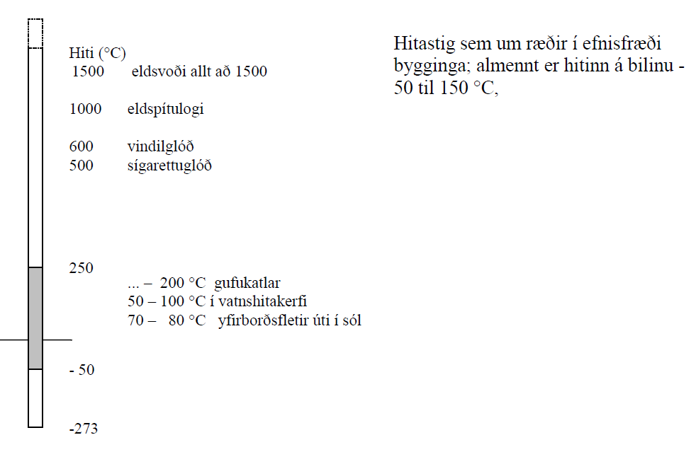
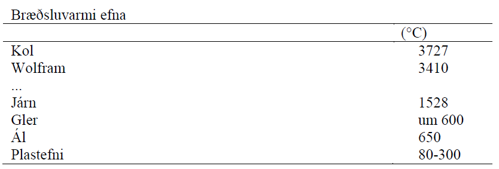
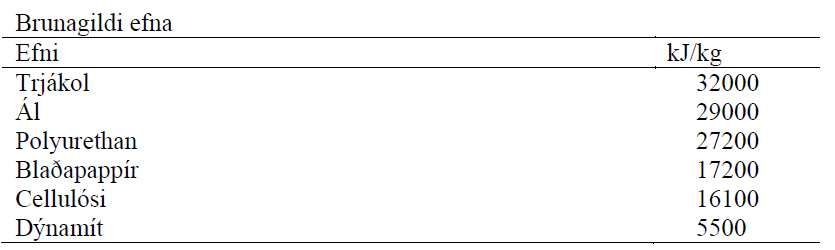
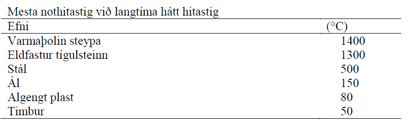

Kafli - Hitastigsháðar breytingar og bruni
==========================================

Efni sem eru notuð í byggingariðnaði eru flest á föstu formi, hitastig þegar efni bráðnar er
nefnt bræðsluhiti (sjá töflu 9.1 í “bókinni”):

Sum efni bráðna ekki heldur brenna, önnur efni bráðna fyrst og brenna við enn hærra
hitastig (tendrunarhitatsig), bruni efna er ýmist orkukræfur (þarf orku til að halda bruna
gangandi) eða orkugæfur (orkan sem verður til við brunann nægir til að viðhalda
brunanum).

Til þess að bruni geti átt sér stað þarf;

* Brennanlegt efni
* Súrefni
* Varma (til að hækka efnishita upp að tendrunarhitastigi)

Tendrunarhitastig efna er mjög mismunandi;

- Timbur á bilinu :math:`250 - 280 ^{\circ}C`
- Blaðapappír :math:`180 ^{\circ}C` 

Varmatregða efna (d: termisk træghed) hefur áhrif á hversu hratt, eða auðveldlega,
efnishiti breytist;

.. math::
  \textrm{Varmatregða} =  \sqrt{c_p \cdot \rho \cdot \lambda}

þar sem 

.. list-table:: 
  :widths: 5 5 5
  :header-rows: 0

  * - :math:`c_p`
    - eðlisvarmi
    - :math:`\textrm{J}/(\textrm{kg} \cdot \textrm{K})`
  * - :math:`\rho`
    - eðlisþéttleiki
    - :math:`\textrm{kg}/(\textrm{m}^3)`
  * - :math:`\lambda`
    - leiðnitala
    - :math:`\textrm{W}/(\textrm{m} \cdot \textrm{K})`

*Brunahraði* efna skiptir einnig mjög miklu máli (atriði í brunahönnun);
Barrviður brennur (samkvæmt “bókinni”) 0,8 mm/mín (oft er miðað við 0,5 mm/mín í
brunahönnun)..

Brunahraði efna fer eftir aðgangi að súrefni, og þá jafnframt yfirborðinu sem súrefni
kemst að.. hægt er að auka brunahraða með því að mala efni niður..
Brunahraði timburs er svo hægur sem raun ber vitni vegna þess m.a. að gas sem leitar
útúr efninu heldur súrefni frá yfirborðinu..

Efnisraki hefur áhrif á brunahraða.. !

Breyting efniseiginleika við hátt hitastig
------------------------------------------

.. figure:: ./myndir/kafli09/hitahadirefniseiginleikar.png
  :align: center
  :width: 70%

Almennt breytast allir styrk og stífleikaeiginleikar efna með hækkuðu hitastigi, gott dæmi
um þetta er stál;

Við :math:`600^{\circ}C` er flotspenna stáls = 0.. og brotstyrkur lítillega hærri..

Við :math:`600^{\circ}C` er þrýstiþol steypu helmingur af þrýstiþoli við :math:`20^{\circ}C`, og við :math:`100^{\circ}C` er þrýstiþolið svo til ekkert..

Ástæður breytinga í þrýstiþoli steypu eru (bls. 207);

* Aukinn gufuþrýstingur
* Hitaspennur vegna hitahreyfinga
* Breyting í gerð fylliefnis
* Breyting í gerð sementsefjunnar

Skrið efna vex með hækkandi hitastigi ..
Hæsta nothitastig efna stýrist af eiginleikum við hátt hitastig, tímalengd sem hiti stendur
yfir; breyting í eiginleikum, brunahættu ofl. (tafla 9.4)

Niðurbrot efna
--------------

Við snögga hitabreytingu, sérstaklega snögga kælingu eftir upphitun, hættir (stökkum)
efnum til að springa... til marks um þessa hættu er 

.. math:: 
  \textrm{"hitasjokk" stuðullinn} = \frac{\lambda \cdot f_t}{E \cdot \alpha}

þar sem 

.. list-table:: 
  :widths: 5 5 5
  :header-rows: 0

  * - :math:`\lambda`
    - leiðnitala
    - :math:`\textrm{W}/(\textrm{m} \cdot \textrm{K})`
  * - :math:`f_t`
    - togþol
    - :math:`\textrm{Pa}`
  * - :math:`\alpha`
    - hitaþanstuðull
    - :math:`\textrm{1/}^{\circ}\textrm{C}`
  * - :math:`E`
    - fjaðurstuðull
    - :math:`\textrm{Pa}`

... því stærri sem sjokk stuðullinn er, því betur þolir efnið snöggar hitabreytingar