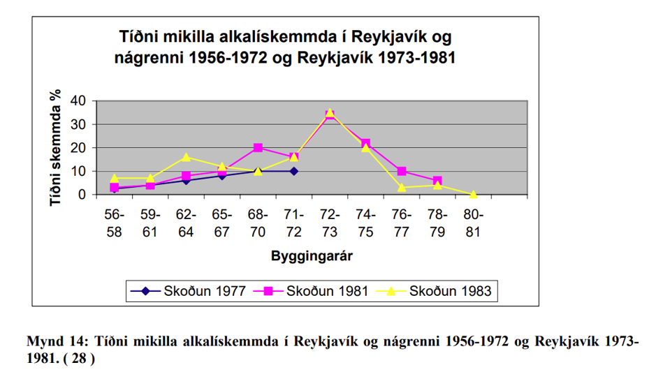

Kafli - Fylliefni 
=================

Samsetning steypu

.. figure:: ./myndir/kafli14/samsetning.png
  :align: center
  :width: 80%  

* Bindiefni (Sement / eða önnur bindiefni)
* Vatn
* Fylliefni (Steinefni)
    * Sandur 0-8 mm
    * Möl 8-50 mm
* Önnur efni
    * Íblendiefni
        * Loftblendi, þjálni- og flotefni o.fl.
    * Íaukar
        * Kísilryk, slagg, flugaska, malað líparít, malað kalk, litarefni o.fl.
    * Trefjar í steypu
        * Plast-, stál-, gler-, kol-, og basalt o.fl.

Steinefni
~~~~~~~~~

Steinefni eru óvirk (hvarfast t.d. ekki við sement í steypu), kornótt, ólífræn efni oftast möl og sandur. Steinefni eru notuð í m.a. vegagerð og steypu.
Sterk hefð er fyrir því að nota orðið fylliefni um steinefni sem ætlað til að nota í steinsteypu (e. aggregate).
Steinefni/fylliefni eru um 70-80% rúmmáls steinsteypu og stýra styrk steinsteypunnar. Ef steypan væri eingöngu sementsefja
væri mun hærra rúmmetraverð, mun meiri rýrnun og einnig hærra kolefnisspor. 

.. figure:: ./myndir/kafli14/youngsmodulus_concreteandcement.png
  :align: center
  :width: 80%  

Sementsefjan er veikari fasinn, fylliefnin eru sterkari fasinn og "þriðji fasinn" er fasaskil sementsefju og fylliefna.

 .. list-table::
   :widths: 100 100
   :header-rows: 0

   * - .. image:: ./myndir/kafli14/fasaskil.png
         :width: 100%
     - .. image:: ./myndir/kafli14/fasaskil1.png
         :width: 100%

Áður var komið inn á skrið steinsteypu en á myndum að neðan má sjá hvernig mismunandi gerð steinefna/fylliefna geta haft áhrif á skrið steinsteypu.

.. list-table::
   :widths: 100 100
   :header-rows: 0

   * - .. image:: ./myndir/kafli14/skrid.png
         :width: 100%
     - .. image:: ./myndir/kafli14/skrid2.png
         :width: 100%

**Algengasta tegund steinefna á Íslandi er basalt.** 
Mismunandi er þó hvaðan steinefnin koma. Á Íslandi eru til námur sem moka efni hugsað fyrir steinsteypu, námur eins og 
Björgun, Harðikambur og Vatnsskarð.

Steinefni á Íslandi þurfa að standast miklar kröfur og því eru 
ýmis próf og tilraunir framkvæmdar á steinefunum til að ákvarða hvort hægt sé að nota þau í steypu.
Próf á steinefnum á að koma í veg fyrir að fram komi skemmdir á mannvirkinu.
Helstu prófanirnar eru:

* Kornastærðardreifing
* Húmus og slamm
* Berggreining
* Saltmæling 
* AlkalípróF
* Raki 
* Mettivatn
* Kornarúmþyngd
* Frostþolspróf 

En fjallað verður um hvert próf fyrir sig í þessum kafla.

Prófunarferlið sem steinefnin fara í gegnum má sjá hér að neðan:

.. figure:: ./myndir/kafli14/berggreining.png
  :align: center
  :width: 70%  

Kornastærðardreifing
~~~~~~~~~~~~~~~~~~~~

Mæling á dreifingu kornastærða í sýni byggist á því að sigta sýnið á sigtarseríu þar sem grófasta sigtið er efst og það fínasta er neðst. 
Efni sem situr á hverju sigti er vigtað. Út úr þessu fæst kornakúrfa.Kornakúrfan sýnir hversu stórt hlutfall efnisins fór í gegnum hvert sigti.

.. figure:: ./myndir/kafli14/kornastaerd.png
  :align: center
  :width: 70% 

Ef sýnið er mjög gróft (mikið af kornum > 16 mm) er það fyrst grófsigtað (á 90, 64, 32, 22.4 og 16 mm sigtum).
Efnið sem fór í gegnum 16 mm sigtið er svo skipt niður í minna sýni, sem er notað til að klára prófunina:

Ferlið er svona...

* Sýnið er vigtað

* Þurrkað

* Vigtað
* Votsigtað á 0.063 mm sigti
* Þurrkað
* Vigtað
* Sigtað á sigtaseríu (11.2, 8, 4, 2, 1, 0.5, 0.25, 0.125 og 0.063 mm, ef sýnið var ekki grófsigtað er 16 mm sigti sett ofan á 11.2 mm sigtið) 
* Efni sem situr á hverju sigti vigtað
* Kornastærðardreifing sett fram.

Hér að neðan má sjá dæmi um kornastærðardreifingar. Þ.e. eina einsleita, eina samfellda og eina þar sem vantar korn af ákveðinni stærð.

.. list-table::
   :widths: 100 100
   :header-rows: 0

   * - .. image:: ./myndir/kafli14/einsleit.png
         :width: 100%
     - .. image:: ./myndir/kafli14/korn.png
         :width: 100%

 
 
Lífræn óhreinindi
~~~~~~~~~~~~~~~~~

Lífræn óhreinindi (rotnaðar jurtaleifar) í fylliefnum geta haft áhrif á styrkleika steypunnar með því að hamla eðlilegum efnahvörfum sementsins.

**Húmus**  

Steinefni sem nota á í steinsteypu skal vera laust við lífræn óhreinindi. Yfirleitt er sjónmat á niðurstöðum látið nægja.

Húmuspróf:

* 130 ml af sandi hellt í mæliglas. NaOH (vítissódi) lausn bætt út í mæliglasið þar til NaOH + sandur = 200 ml.
* Mæliglasið hrist vel.
* Látið standa í sólarhring.
* Ef lífræn óhreinindi eru í sandinum lita þau lausnina.
* Litur lausnarinnar borinn saman við litaskala (eða staðallausnir með þekktum húmusstyrk), húmusstigið lesið af skalanum.

**Slam og slammpróf**

Mikið af örfínum efniskornum er ekki æskilegt í fylliefnum í steinsteypu.
Þau auka vatnsþörf steypunnar og geta veikt bindingu milli korna og sementsefju því þau loða gjarnan við stærri fylliefnakorn.

Slammpróf:

* 125 ml af vatni hellt í mæliglas. Sandinum bætt út í mæliglasið þar til vatn+sandur = 200ml
* Mæliglasið hrist vel
* Látið standa í sólarhring
* Lesið á mæliglasið; hvað er sandurinn margir ml og hvað er slammið margir ml. Út frá því fæst rúmmálsprósenta slammsins af sandinum

Berggreining
~~~~~~~~~~~~

Berggreining veitir upplýsingar um samsetningu efnis. Hún er framkvæmd af jarðfræðingi og flokkar hann bergið
í þrjá gæðaflokka eftir bergtegund, ummyndun, þéttleika o.fl.

Berggreining:

* Eftir þvott og sigtun sýnis er kornastærð valin til greiningar (oftast 8-11.2 mm)
* Sýninu skipt niður í ca 200 korn
* Kornin brotin með hamri (viljum skoða fersk brotsár, ekki veðrunarkápuna)
* Kornin skoðuð í víðsjá og flokkuð skv. berggreiningarkerfi Rb
* Vandamál: byggist að hluta til á mati þess sem berggreinir

Dæmi úr niðurstöðu berggreiningar:

.. list-table::
   :widths: 100 100
   :header-rows: 0

   * - .. image:: ./myndir/kafli14/berg1.png
         :width: 100%
     - .. image:: ./myndir/kafli14/berg2.png
         :width: 100%
  
Saltmæling
~~~~~~~~~~

Saltmæling er framkvæmd til að mæla magn salts í steinefnasýni sem hefur verið í beinni snertingu við saltvatn (t.d. sjávarmöl).
Samkvæmt byggingarreglugerð er saltmæling gerð til þess að meta hættu á alkalívirkni og tæringu bendistáls eða 
annara málma. Samkvæmt reglugerð skal steinefni til notkunar í járnbenta steinsteypu hafa minna saltinnihald í hverju
kg af þurrum sandi (kornastærð < 4 mm ) en 0,036% af klóríði og minna en 0,012% af klóríði í hverju kg af þurrum sandi
til notkunar í steypu með spenntu bendistáli. Samsetning fylliefna skal vera þannig að hámark 10% lendi í flokki 3
þegar flokkað er eftir berggreiningarkerfi skv. ÍST EN 932-3 og Rb blaði um  berggreiningu í samræmi við þann staðal,
nema prófanir sýni fram á að veðrunarþol sé í lagi.

Framkvæmd á saltmælingu:

* Klóríðjónir losaðar frá steinefninu með silfurnítrati
* Lausnin títruð með thiocynate. Ammonium járn (III) súlfat lausn er notuð sem vísir (e. indicator)
* Klóríðinnihald gefið upp sem þyngdarhluti af steinefni

Alkalípróf 
~~~~~~~~~~
Prófið er gert til þess að athuga hvort fylliefni séu alkalívirk.
Fylliefni er sagt alkalívirkt ef það inniheldur ókristallaða eða lítið kristallaða kísilsýru sem veldur því að steinefnið verður fyrir efnaáhrifum frá alkalísamböndum í sementinu
Alkalískemmdir: við efnaskipti milli steinefnis og sementsefju myndast alkalí-kísilhlaup sem þenst út ef það kemst í snertingu við vatn -> sprungur geta myndast í steypunni.

**Alkalí-kísil efnahvörf**
Til að efnahvörfin geti átt sér stað þá þarf:

* Nægilegt magn alkalía (Na2O natrínoxíð (e. sodium oxide) og K2O kalínoxíð (e.potassium oxide)) í sementinu
* Lausbundin, hvarfagjörn kísilsýra (SiO2) í fylliefninu
* Vatn í steypunni

Ef þetta er til staðar getur myndast gel sem þenst út og rúmmálsaukningin getur valdið sprungum í steypunni

Dæmi um alkalískemmdir

.. list-table::
   :widths: 100 100
   :header-rows: 0

   * - .. image:: ./myndir/kafli14/forsendur.png
         :width: 100%
     - .. image:: ./myndir/kafli14/hvítárbrú.png
         :width: 100%

Í Rb blaði frá 1983 stendur eftirfarandi um alkalívirkni:

Í byrjun 7. áratugsins leiddu rannsóknir við Rb (Rannsóknastofnun byggingariðnaðarins) í ljós, að sum fylliefni, sem notuð eru til steypugerðar á Íslandi, eru alkalívirk þ.e.a.s. geta myndað skaðleg efnasambönd í steypunni. Mikið af alkalíoxíðum (Na₂O, K₂O) í íslensku sementi, sem byrjað var að framleiða 1958, eykur hættu á þessum skaðlegu efnasamböndum.

Staðfesting á stórkostlegum skemmdum af völdum alkalí-kísil efnahvarfa lá ekki fyrir fyrr en 1978, en þá hafði verið gerð rannsókn á fjölda húsa á Stór-Reykjavíkursvæðinu og voru niðurstöður birtar 1979. Í kjölfar þessarar vitneskju voru sett ströng ákvæði um notkun virkra fylliefna í byggingasamþykkt fyrir allt landið 1979. Rannsóknir á ýmsum áhrifafáttum voru einnig auknar

Blöndunarhlutfall alkalívirkra steinefni skiptir miklu máli. Á myndinni að neðan má sjá hvaða blöndunarhlutföll skapa mestu 
hættuna á alkalí-kísil efnahvörfum.

**Alkalíprófin** sjálf byggjast á því að mæla þenslu strendinga yfir ákveðinn tíma. Á Íslandi er þessar tvær aðferðir mest notaðar: múrstrendingaaðferð og hraðprófun með múrstrendingum.

**Múrstrendingaraðferðin** er framkvæmd á eftirfarandi hátt:

* Múrstrendingar steyptir úr viðkomandi fylliefni
* Lengd þeirra mæld
* Strendingarnir geymdir við 98% raka og 38 ℃
* Lengd strendinganna mæld eftir 1, 3, 6 og 12 mánuði
* Lengdaraukning eftir 6 og 12 mánuði er mælikvarði á alkalívirkni

**Hraðprófun með múrstrendingum** byggist á því sama en geymsluaðferðirnar eru frábrugðnar.

* Strendingarnir eru geymdir í sterkri NaOH lausn við 80 ℃. Þessar aðstæður kalla fram mun hraðari þenslu.
* Þensla eftir 14 daga er notuð sem mælikvarði á alkalívirkni

Raki
~~~~

Framkvæmd:

* Sýnið vigtað rakt
* Þurrkað í ofni yfir nótt (ofninn er ca. 105 ℃; allur raki fer úr sýninu)
* Vigtað þurrt
* Raki reiknaður út sem þyngdarprósenta
* Raki = (rakt – þurrt)/þurrt  

Mettivatn
~~~~~~~~~

Mettivatn og kornarúmþyngd eru yfirleitt mæld samtímis. Mettivatn er það þegar kornin eru mettuð af vatni (öll holrými inni í kornunum er full af vatni) en yfirborð kornanna er þurrt.

Framkvæmd:

* Sýnið er látið ná vatnsmettun (látið liggja í vatnsbaði í sólarhring)
* Sýnið er yfirborðsþurrkað 
* Sýnið er vigtað yfirborðsþurrt
* Þurrkað
* Vigtað þurrt
* Mettivatn reiknað eins og raki

.. figure:: ./myndir/kafli14/mettivatn.png
  :align: center
  :width: 70% 

Skýringar:

1. Sýni vatnsmettað
2. Tekið úr vatnsbaði og yfirborðsþerrað.
3. Vigtað yfirborðsþurrt og vatnsmettað og þyngd skráð.
4. Sett í mæliflösku, fyllt að marki með vatni, vigtað og þyngd skráð.
5. Pyknometer með vatni, en án sýnis vigtaður og þyngd skráð.
6. Þurrkað við 110°C í 24 klst eða þar til þyngdarbreyting er hverfandi.
7. Vigtað og þyngd skráð með einum aukastaf.

Kornarúmþyngd
~~~~~~~~~~~~~

Kornarúmþyngd segir til um hversu mörg grömm eru í einum rúm-sentimetra.

Mælingar á kornarúmþyngd eru mismunandi og miðast við tegund jarðvegs sem er fyrir hendi.

Fyrir **Sand** er Pyknometer-aðferð notuð:

* Pyknometer (= flaska með þekktu rúmmáli) settur á vigtina og vigtin núllstillt.
* Yfirborðsþurru efni hellt í pyknometerinn og vigtað (vigtin sýnir þá bara þyngd efnisins því búið er að núllstilla með pyknometernum á)
* Pyknometerinn er svo fylltur af vatni, allt loft hrist úr honum og settur aftur á vigtina (vigtin sýnir þá þyngd efnisins í þekktu rúmmáli af vatni)

Fyrir **Möl** er Vírkörfuaðferð notuð:

* Efni vigtað í vatni (mölinni hellt í vírkörfu sem er hengd neðan í vigt; vatnsbali hafður undir vigtinni)
* Mölin er yfirborðsþurrkuð og svo vigtuð yfirborðsþurr
* Mölin er þurrkuð í ofni og svo vigtuð ofnþurr

Frostþol
~~~~~~~~
Í byggingarreglugerð stendur:
Steypuframleiðandi skal auk þess sem greinir í 1. mgr. sýna fram á að steypan uppfylli kröfur um frostþol samkvæmt 7. gr. í staðlinum SS 13 72 44. Meðalflögnun sýna skal vera minni en 1,00 kg/m² eftir 56 frostþýðusveiflur (m₅₆) jafnframt því sem hlutfallið m₅₆/m₂₈ skal vera minna en 2.

.. figure:: ./myndir/kafli14/frostþol.png
  :align: center
  :width: 70% 

