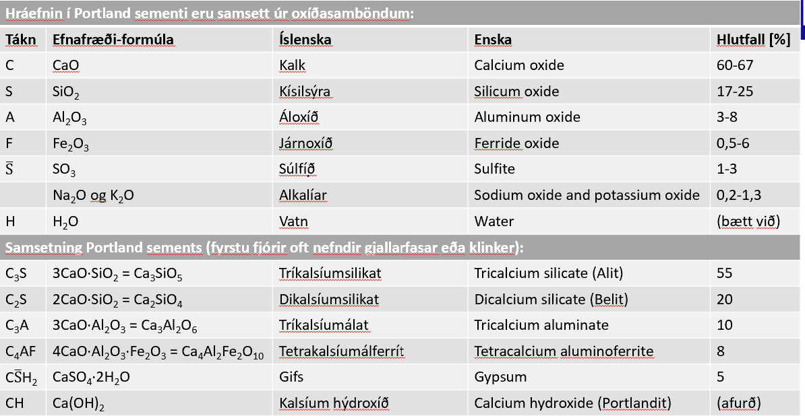
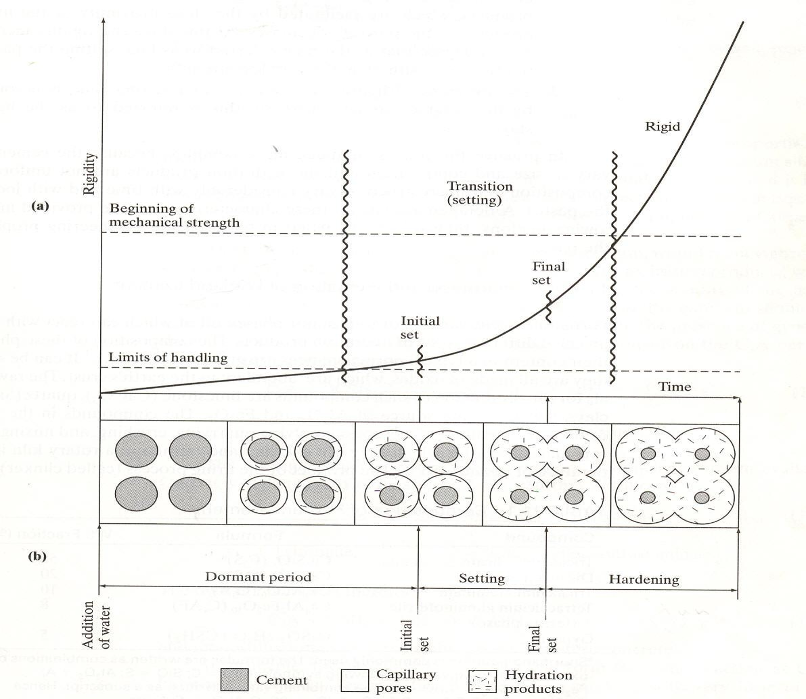
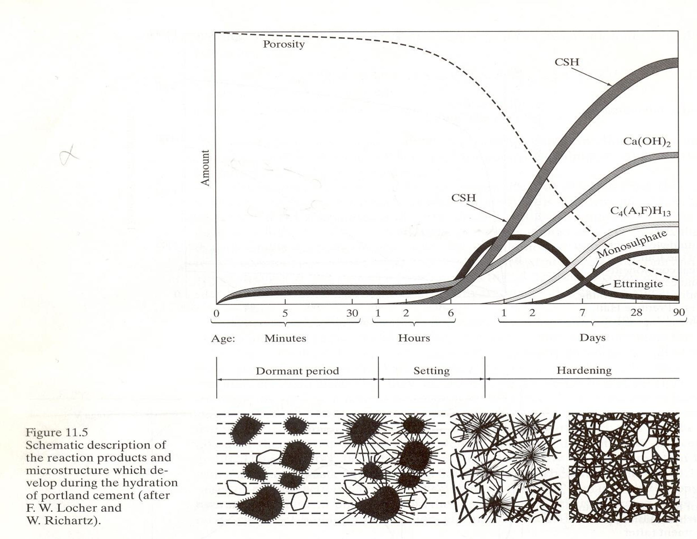
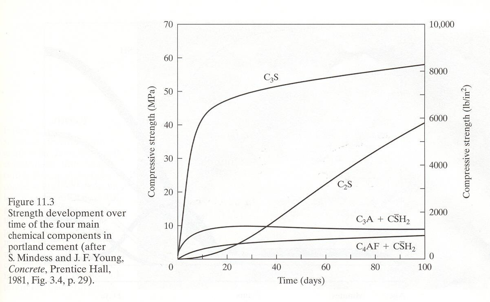
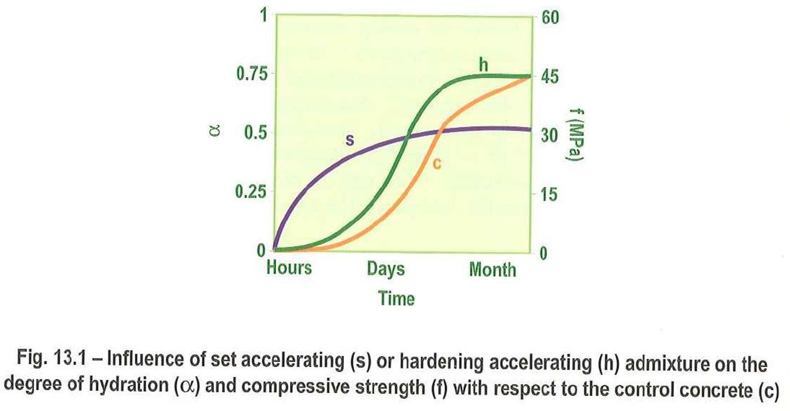

Kafli - Sement
==============

Sement er fínmalað bindiefni sem hvarfast þegar það blandast vatni og harðnar. 
Lýsa má sementi sem líminu í steinsteypu þar sem það límir saman fylliefnakornin. 
En áður að við förum að fjalla meira um sement eru nokkur hugtök sem eru gott að þekkja.

----

Portland sement og framleiðsla
~~~~~~~~~~~~~~~~~~~~~~~~~~~~~~

**Portland sement er langalgengasta tegundin af sementi í byggingariðnaðinum.**

Portland sement fellur undir visst skilgreint framleiðsluferli með ákveðnum hráefnum.
Portland sement er framleitt úr:

* Kalkstein (CaO) og leir (SiO2, Al2O3, Fe2O3) venjulega
* Skeljasandi (CaO) og líparíti (SiO2, Al2O3, Fe2O3) hér áður fyrr

Svo er það brennt í ofni, allt að 1500°C (rotarofni), og malað:

* Klinker 3-25 mm :math:`\rightarrow` malaður + gifs :math:`\rightarrow` sement
* Kornastærð 1-100 μm, meðalstærð 10 :math:`\mu m`

Tvær aðferðir eru til við vinnslu sements. Þessar aðferðir nefnast **Þurr- og votaðferð**.
En það hvernig efnið er meðhöndlað áður en það er sett inn í ofninn stýrir því hvaða aðferð er notuð, þ.e.

* Þurraðferð þá er efnið sett **þurrt í ofninn**
* Votaðferð þá er efnið í **leðjuformi** þegar það er sett í ofninn

.. list-table::
   :widths: 100 100
   :header-rows: 0

   * - .. image:: ./myndir/kafli15/þurraðferð.png
         :width: 100%
     - .. image:: ./myndir/kafli15/votaðferð.png
         :width: 100%

**ATH fyrri myndin sýnir Þurraðferð en seinni Votaðferð.**

Áður fyrr var sementsframleiðsla á Íslandi í sementsverksmiðjunni á Akranesi, en þar var notast við votaðferðina (Líparítið sem
var notað í framleiðsluna mátti finna í súru gosbergi). Í dag er þó allt sement innflutt.

Hvörfun sements
~~~~~~~~~~~~~~~

Sement samanstendur af fjórum meginþáttum sem nefndir eru klinkerfasar en þeir eru hluti af sementsgjallinu sem
verður til við brennslu í sementsofninum.

Klinkerfasarnir eru:

* :math:`C_3S` Tríkalsíumsilikat (Alit)
* :math:`C_2S` Díkalsíumsilikata (Belit)
* :math:`C_3A` Tríkalsíumálat
* :math:`C_4AF` Tetrakalsíumálferrít

Hvörfun sements á sér stað í þessar röð:

1. Sementsefjan er fljótandi svo lengi sem sementskornin snertast ekki. 

2. Hvörfunarafurðirnar taka meira pláss en upprunalegu sementskornin og þess vegna fyllist upp í holrýmin.

3. Á fyrstu stigum hvörfunarinnar, þegar næg snerting er á milli hvörfunarafurðanna missir efjan floteiginleikana og storknun hefst (e. setting).

4. Eftir því sem á hvörfunina líður eftir fyrstu storknun hefst styrkaukningin sem kemur til af því að hvörfunarafurðirnar tengjast stekari böndum og holrýmd minnkar. Við lokastorknun (e. final set) er efjan orðin stíft, fast efni með lítinn styrk.

5. Eftir lokastorkun hefst hörðnunartímabilið (e. hardening) þar sem hin raunverulega styrkauking á sér stað.

Hvörfunarafurðir
~~~~~~~~~~~~~~~~

Hvörfun sements og vatns er útvermið efnahvarf þar sem mesta hitamyndunin verður vegna hvörfunar :math:`C_3S` og :math:`C_3A`. Stærð sementskorna
hefur áhrif á hitamyndunina þar sem fínara sement (minni korn) hefur meiri hitamyndun heldur en grófara vegna heildar yfirborðsflatarmál kornanna.

.. figure:: ./myndir/kafli15/hitamyndum.png
  :align: center
  :width: 70% 

Þegar sement og vatn hvarfast verða til hvörfunarafurðirnar (e. hydration products):

**C-S-H hlaup** 

* Er sá þáttur sementsefjunnar sem er hvað þéttastur og stöðugastur
* Gefur mestan styrk
* Er u.þ.b. 65% af rúmmáli í harðnaðri sementsefju

**CH (Kalsíum hýdroxíð, portlandit)**

* Mun veikara og óþéttara en C-S-H
* Stórir kristallar
* Gengur í samband við :math:`CO_2` í andrúmsloftinu og þá lækkar pH gildi steypunnar
* Hætta á að steypustyrktarjárn ryðgi ef kolsýringin nær inn að járnum
* Er u.þ.b. 20% af rúmmáli í harðnaðri sementsefju

Kalkkísilefnasambönd (:math:`C_3S` og :math:`C_2S`) + vatn (:math:`H_2O`) → C-S-H hlaup + kalsíumhýdroxíð (CH)

**Monosulfoaluminat**, :math:`C_4A \bar{S} H_{12}`

* Svipað og CH hvað varðar styrk
* Er u.þ.b. 10% af rúmmáli í harðnaðri sementsefju

Tríkalsíumálat (:math:`C_3A`) + gifs (:math:`C \bar{S} H_2`) + vatn (:math:`H_2O`) → ettringít (:math:`C_6 A \bar{S} H`)

Ettringít (:math:`C_6 A \bar{S} H`) + tríkalsíumálat (:math:`C_3A`) + vatn (:math:`H_2O`) → monosulfoaluminat (:math:`C_4 A \bar{S} H_{12}`)

**Tetracalcium aluminat hydrate**, :math:`C_4(A,F)H_{13}` 

* Skylt monosulfoaluminati að uppbyggingu
* Veitir ekki styrk

Ferrít (:math:`C_4AF`) + kalísum hydroxíð (:math:`CH`) + vatn (:math:`H_2O`) → tetracalcium aluminat hydrate (:math:`C_4(A,F)H_{13}`) + ferric-aluminum hydroxíð :math:`(A,F)H_3`

**Ettringít**, :math:`C_6A \bar{S} _3H`

**Það er þó nær alltaf til staðar óhvarfað sement í sementsefjunni**

------

Kalsíumsamböndin :math:`C_3S` og :math:`C_2S` standa aðallega fyrir þróun styrks steypunnar. Þó er þróun styrks frá þessum klinkerfösum mjög mismunandi.

**Hátt hlutfall** :math:`C_3S`:  

* Lægri endanlegur styrkur
* Hærri skammtíma styrkur og hitamyndun

**Hátt hlutfall**:math:`C_2S`:

* Langtímastyrkur
* Lengur að hvarfast

------

Hvörfun C3S er mikilvægt við myndun klinkerfasa á brennslustigi klinkersins. Þó skal ekki gleyma að það er 
nauðsynlegt að hafa gifs í blöndunni. Því ef ekkert gifs væri til staðar þá mundi C3S byrja að hvarfast strax (ekki æskilegt að steypan harðni í steypubílunum). 

Munum:

* Tríkalsíum aluminat (C3A) + gifs (CS ̅H2) + vatn (H2O)      → ettringít (C6AS ̅H)

* Ettringít (C6AS ̅H) + tríkalsíum aluminat (C3A) + vatn (H2O)    → monosulfoaluminat (C4AS ̅H12)

C4AF Hefur líkt og C3A þýðingu við myndun klinkersins. C4AF hvarfast þó mun hægar en C3A en C4AF gefur sementinu gráa litinn.

Á myndunum hér að neðan má sjá á myndinni til vinstri sement eftir 7 daga og til hægri sement eftir 28 daga.

.. list-table::
   :widths: 100 100
   :header-rows: 0

   * - .. image:: ./myndir/kafli15/7dagat.png
         :width: 100%
     - .. image:: ./myndir/kafli15/28dagar.png
         :width: 100%

Sementsgerðir
~~~~~~~~~~~~~~

Til eru mismunandi sementsgerðir og ráðast þær m.a. af:

* Mismunandi samsetningu klinkerfasa

* Mismunandi fínleika

* Mismunandi íaukum

  * Með possolönum (e. Pozzolans)

    * Kísilryk (e. Silica fume)

    * Flugösku (e. Fly Ash)

    * Malað líparít

  * Með slaggi (e. Blast-furnace slag)

  * Með möluðu kalki

**Hraðharðnandi Portland sement**

Er ætlað til nota þar sem hár byrjunarstyrkur er æskilegur. Svona sement getur verið sniðugt að nota í sprautusteypu í jarðgöngum.
Ekki æskilegt að hafa hraðharðnandi sement þegar um massasteypur (mikið af rúmmetrum dælt í einu) er að ræða. 
Oft með meira C3S (alit) og kornin eru fínmalaðri sem þýðir að meiri hitamyndun á sér stað.

**Lághita Portland sement**

Er ætlað til nota þar sem hitamyndun er mikil það er í massasteypum. Oft með lítið C3S og C3A, en meira af C2S (belit).
Sementskornin eru oft grófari (há kornastærð).

Hér á landi voru tvær tegundir lághitasements:

* Blöndusement 

* Sigöldusement

**Sulfatþolið sement**

Ætlað til nota þar sem sulfat (brennisteinn) er til staðar í umhverfinu. Sulfatþolið sement hefur lágt hlutfall C3A (3,5% eða minna).
Sulfatþolið sement var framleitt hér á landi.

**Hvítt og litað Portland sement**

Hvítt sement er gert úr sérstökum hráefnum með litlu járn- og  magnesíum oxíðum.
Í lituðu sementi er bætt í litarefni, fínmöluðu dufti, getur haft áhrif á gæði steypunnar, styrk o.fl.

Mikilvægi v/s tölunnar
~~~~~~~~~~~~~~~~~~~~~~

Þessi tala skiptir gríðarlegu máli þegar það kemur að steypu.
v/s talan er skilgreint sem hlutfall milli vatns og sements í blöndu.
v/s talan hefur áhrif á:

* Vinnanleiki ferskrar steypu

* Styrkur

* Þrýsti-, tog og beygjutogþol

* Rýrnun

* Skrið

* Fjaðurstuðull

* Frostþol

* Þol gagnvart ýmsum efnum s.s. klór, brennisteinssamböndum, alkalí/kísil- efnahvörfum, oxun (carbonatisering)

Einnig hefur v/s talan áhrif á holrýmd steypunnar, en það má sjá á myndunum hér að neðan.

.. list-table::
   :widths: 100 100 100
   :header-rows: 0

   * - .. image:: ./myndir/kafli15/porur.png
         :width: 100%
     - .. image:: ./myndir/kafli15/holrymi.png
         :width: 100%
     - .. image:: ./myndir/kafli15/holrymd2.png
         :width: 100%

Íblendiefni og íaukar efni
~~~~~~~~~~~~~~~~~~~~

**Íblendiefni** eru efni sem sett eru í steypuna í *litlum skömmtum*, algengast 1-3% af þunga sements, til að hafa áhrif á hegðun hennar.
Yfirleitt í fljótandi formi en þó er það ekki einhlítt. Íblendiefni geta haft áhrif á steypu bæði í fersku ástandi og á storknunar- og hörðnunarskeiðinu. 
Oft er hægt að velja milli þess að nota misjafnar sementstegundir eða íblendiefni sem gera sama gagn.
Dæmi um íblendiefni eru:

* Loftblendi. Notað til að gera steypuna frostþolna. Loft í steypu bætir einnig þjálni ferskrar steypu. Loftblendin efni eru yfirborðsvirk efni sem valda því að það myndast örsmáar loftbólur í  steypunni (stærð frá 0,01-0,05 mm). Dæmi:
  
  * Vinsol resin (grunnefni: trjákvoða, harpix)
  * Tallolía (unnin úr fitusýrum sem eru aukaafurðir úr pappírsframleiðslu)
  * Tensider (unnið úr olíu)
*Þess ber að geta að fyrir hvert 1% af loftblendi í steypu tapast 5% brotstyrkur steypunnar*

.. list-table::
   :widths: 100 100
   :header-rows: 0

   * - .. image:: ./myndir/kafli15/loftblendni1.png
         :width: 100%
     - .. image:: ./myndir/kafli15/loftblendni2.png
         :width: 100%
      

* Vatnssparar/Flotefni, Vatnssparar eru notaðir í þrennum tilgangi, þ.e. auka styrk með því að minnka v/s-töluna en halda sama vinnanleika steypunnar, notuð til að minnka hitamyndun í massasteypum og til þess að auka vinnanleika til að auðvelda niðurlögn steypunnar. 
Fyrsta kynslóð þessara efna voru vatnssparar, en hún kom upp úr 1930 og voru það efnasamsetningar eins oglLignosulfonatefni og hydroxycarboxylic sýrur.
Önnur kynslóðin voru flotefni, en þau komu fyrst upp úr 1960 og var þá notað Melamin og naftalen efni.
Í dag er notast við svokallað hágæðaflotefni sem er þriðja kynslóð. Hágæðaflotefni kom eftir 1980 og hefur mikil þróun átt sér stað síðustu 10 árin. Þetta eru efni sem eru mun virkari en flotefni.

  * Vatnssparar eru yfirborðsvirk efni. Virkni þeirra er á eftirfarandi hátt:
    
    * Sementskornin hafa bæði plús og mínushlaðna hluta
    * Vatnsspararnir hafa mínushleðslu
    * Þeir dragast að plúshlöðnu yfirborði sementskornanna og gera það mínushlaðið
    * Þannig að sementskornin hrinda hvort öðru frá sér í stað þess að dragast að hvort öðru
    * Á þennan hátt losnar um innilokað vatn og það nýtist betur við myndun sementsefju

  * Flotefni eru nýrri efni en vatnsspararnir. Þau eru einnig mun virkari en vatnssparar og því stundum kölluð „High Range Water Reducers“ (HRWR).
    Vegna virkni sinnar er hægt að ná mun betra flæði í steypuna með flotefnum (flotsteypa, sjálfútleggjandi). Flotefni eru notuð í gólf og bita og þar sem erfitt er að koma venjulegri steypu. Hægt að gera steypu með mjög háan styrk, hástyrkleikasteypur með því að minnka v/s-töluna allt niður í 0,28 og nota flotefni til að gera steypuna vinnanlega.

.. list-table::
   :widths: 100 100
   :header-rows: 0

   * - .. image:: ./myndir/kafli15/vatnspararar.png
         :width: 100%
     - .. image:: ./myndir/kafli15/flot.png
         :width: 100%

-------

* Storknunar-seinkarar. 
  Storknunarseinkarar eru mikið notaðir þar sem hiti er mikill. Þeir eru notaðir til að lengja þann tíma sem steypan er vinnanleg. Storknunarseinkarar eru t.d.: Sykur, afleiður kolvetnis, bórsýru salt og zink salt.

  Storknunarseinkarar:

  * Minnka skammtímastyrk
  * Hafa ekki áhrif á langtímastyrk
  * Auka plastíska rýrnun vegna lengingar plastíska tímabils steypunnar
  * Hafa ekki áhrif á þurrkrýrnun

------

* Hvörfunar-hraðarar. 
  Hraðarar flýta fyrir þróun skammtímastyrks. Þeir þurfa ekki að hafa áhrif á storknunartímann, en þó gera þeir það stundum.  Einnig eru til hraðarar sem aðallega flýta fyrir storknun steypunnar. Notað einkum í viðgerðarefni í steypu. Þetta er gert með því að flýta efnahvörfum fyrstu tímana eftir íblöndun vatns

------

* Aðrir flokkar íblendiefna:

  * Rýrnunarvarar
  * Þykkingarefni
  * Klóríðsperra
  * Frostvari

  Til eru ótal efni sem ætluð eru til að bæta múr og steinsteypu. Hafa ber í huga að ef nota á efni sem eru ekki vel þekkt, þarf alltaf að prófa þau í prufusteypu áður en þau eru notuð í mannvirki.
  Dæmi:

  * Corrosion inhibitors
  * ASR inhibitors
  * Hydrophobic admixtures
  * Viscosity modifying agent
  * Shrinkage reducing admixtures
-------

**Íaukar**

Íaukar eru efni sem sett eru í steypu í *stærri skömmtum*, oft á bilinu 5% og allt upp í 95% af þunga sements. Yfirleitt í duftformi en þó er það ekki einhlítt, kornastærðir svipaðar og sements.

Íaukar hafa áhrif á gæði og eiginleika sements. Hægt er að notast við íauka í sparnaðarskyni þar sem þetta efni er oft ódýrara en sement og einnig má nota þetta til að minnka kolefnisspor steypunnar.
Oft eru þetta efni (aukaafurðir) sem verða til við vinnslu kísiljárns, stáls, brennslu kola, o.fl. Það vill svo til að þessi sement hvarfast oft hægar og hentar því vel til notkunar í massasteypum þar sem hitamyndun er lág.

Algengustu íaukanir eru:

* Kísilryk (e. Silica fume)
* Flugaska (e. Pulverized fuel/fly ash, PFA) (aukaafurð við kolabrennslu)
* Líparít, malað
* Slagg (e. Blast-furnace slag) (aukaafurð við stálframleiðslu)
* Kalk, malað

Íaukar eru notaðir í mismiklu mæli í sementi.

