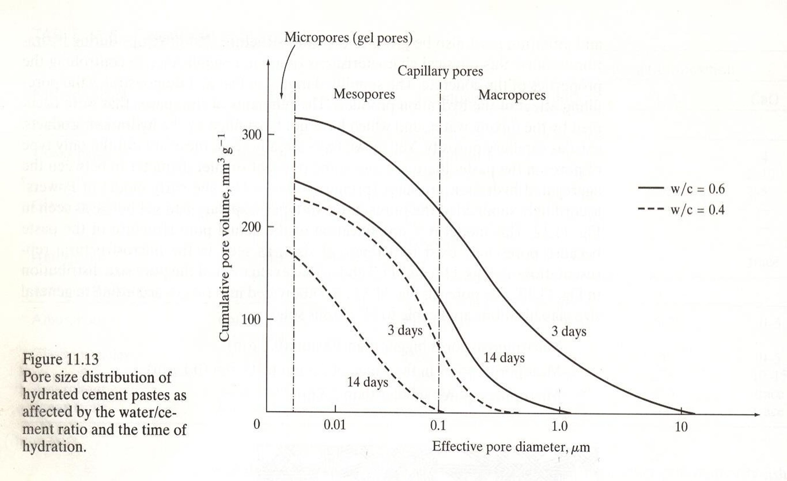
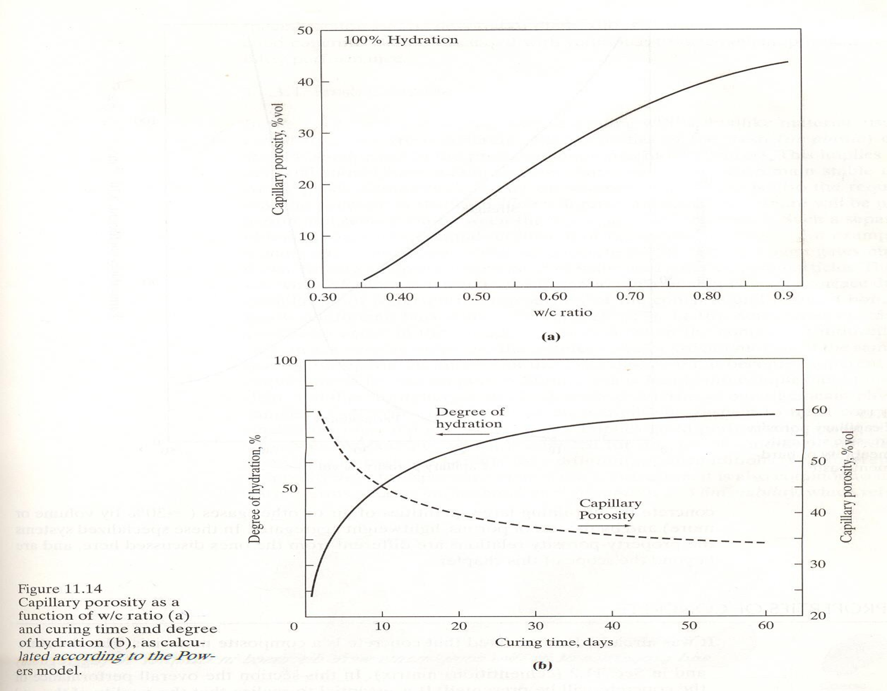
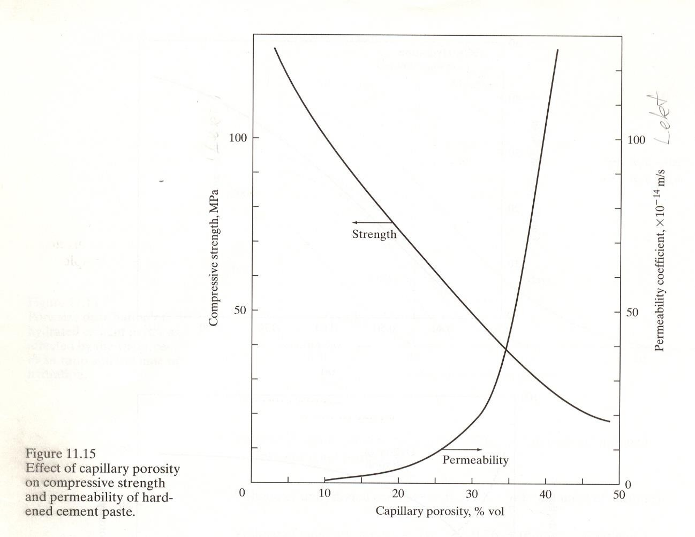

Kafli - Sement og bindiefni
===========================

Sement er fínmalað bindiefni sem hvarfast við vatn og harðnar. Þegar sementi 
og vatni er blandað saman myndast sementsefja. Við hvörfun sementsins breytist 
sementsefjan smám saman úr mótanlegu efni í fast efni.

Sement er eitt af grunnefnum steinsteypu. Þar myndar sementið ásamt vatni 
sementsefju sem umlykur steinefnin og bindur þau saman þegar hún harðnar. 
Til þess að skilja eiginleika steinsteypu er því mikilvægt að þekkja hvað 
sement er, hvernig það er framleitt og hvað gerist þegar sement hvarfast 
við vatn.

Portland sement og framleiðsla
~~~~~~~~~~~~~~~~~~~~~~~~~~~~~~

Portland sement er algengasta tegund sements sem notuð er í byggingariðnaði. 
Það er framleitt úr hráefnum sem veita þau oxíð sem þarf til myndunar 
klinkerfasa sementsins. Helstu hráefnin eru:

* kalksteinn, sem veitir CaO,
* leir, sem veitir meðal annars SiO₂, Al₂O₃ og Fe₂O₃.

Á Íslandi voru áður notuð önnur hráefni við sementsframleiðslu. Þá var 
skeljasandur uppspretta CaO og líparít uppspretta SiO₂, Al₂O₃ og Fe₂O₃.

Við sementsframleiðslu eru hráefnin möluð og blönduð í réttum hlutföllum 
áður en þau eru brennd í ofni. Hitastig í ofninum getur orðið um 
1500 °C. Við brennsluna hvarfast hráefnin og mynda svokallaðan 
**klinker** (sementsgjall).

Klinkerinn kemur úr ofninum sem kornótt efni, gjarnan með kornastærð um 
3–25 mm. Hann er síðan malaður mjög fínt og gifsi bætt við. Við það fæst 
Portland sement. Kornastærð sements er á bilinu um 1–100 µm og meðalstærð 
um 10 µm.

Tvær meginleiðir hafa verið notaðar við undirbúning hráefnanna fyrir 
brennslu: **þurraðferð** og **votaðferð**. Munurinn felst fyrst og fremst 
í því í hvaða formi hráefnin fara inn í ofninn. Við þurraðferð eru þau 
þurr, en við votaðferð eru þau í leðjuformi.

.. list-table::
   :widths: 100 100
   :header-rows: 0

   * - .. image:: ./myndir/kafli15/þurraðferð.png
         :width: 100%
     - .. image:: ./myndir/kafli15/votaðferð.png
         :width: 100%

   * - **Þurraðferð**
     - **Votaðferð**

Á Íslandi var sement áður framleitt í Sementsverksmiðjunni á Akranesi. 
Þar var votaðferðin notuð og meðal hráefna voru skeljasandur og líparít. 
Sementsframleiðslu á Íslandi hefur nú verið hætt og sement er flutt inn.

Samsetning Portland sements
~~~~~~~~~~~~~~~~~~~~~~~~~~~

Við brennslu hráefnanna í ofninum myndast svokallaðir 
**klinkerfasar** (gjallarfasar). Fjórir klinkerfasar eru meginuppistaðan í Portland 
sementi:

* :math:`C_3S` – tríkalsíumsilikat (alit)
* :math:`C_2S` – tvíkalsíumsilikat (belit)
* :math:`C_3A` – tríkalsíumálat
* :math:`C_4AF` – tetrakalsíumálferrít

Í sementsefnafræði er algengt að nota stytt tákn fyrir þau oxíð sem 
mynda sementið. Til dæmis táknar :math:`C` CaO, :math:`S` SiO₂, 
:math:`A` Al₂O₃ og :math:`F` Fe₂O₃. Þannig er til dæmis hægt að rita 
tríkalsíumsilikat, :math:`3CaO \cdot SiO_2`, sem :math:`C_3S`.

Algeng tákn í sementsefnafræði
------------------------------

.. list-table::
   :header-rows: 1
   :widths: 15 30 55

   * - Tákn
     - Efnaformúla
     - Efni
   * - :math:`C`
     - :math:`CaO`
     - Kalsíumoxíð
   * - :math:`S`
     - :math:`SiO_2`
     - Kísildíoxíð
   * - :math:`A`
     - :math:`Al_2O_3`
     - Áloxíð
   * - :math:`F`
     - :math:`Fe_2O_3`
     - Járnoxíð
   * - :math:`H`
     - :math:`H_2O`
     - Vatn

Helstu klinkerfasar Portland sements eru:

.. list-table::
   :header-rows: 1
   :widths: 20 35 45

   * - Tákn
     - Efnaformúla
     - Heiti
   * - :math:`C_3S`
     - :math:`3CaO \cdot SiO_2`
     - Tríkalsíumsilikat (alit)
   * - :math:`C_2S`
     - :math:`2CaO \cdot SiO_2`
     - Díkalsíumsilikat (belit)
   * - :math:`C_3A`
     - :math:`3CaO \cdot Al_2O_3`
     - Tríkalsíumálat
   * - :math:`C_4AF`
     - :math:`4CaO \cdot Al_2O_3 \cdot Fe_2O_3`
     - Tetrakalsíumálferrít

Hvörfun sements
~~~~~~~~~~~~~~~

Þegar sementi er blandað við vatn hefjast efnahvörf milli vatnsins og 
klinkerfasa sementsins. Þessi efnahvörf nefnast **hvörfun sements** 
(e. *hydration*). Við hvörfunina myndast ný efnasambönd, svokallaðar 
hvörfunarafurðir (e. *hydration products*).

Myndin hér að neðan sýnir hvernig sementsefjan breytist eftir því sem 
hvörfuninni vindur fram. Ferlinu má lýsa í nokkrum skrefum:

1. Í upphafi er sementsefjan fljótandi og sementskornin eru aðskilin hvert 
   frá öðru með vatni.

2. Hvörfunarafurðir byrja að myndast við yfirborð sementskornanna og vaxa 
   út í rýmið á milli þeirra.

3. Þegar næg tenging hefur myndast milli hvörfunarafurðanna missir 
   sementsefjan floteiginleika sína og **storknun** (e. *setting*) hefst.

4. Eftir því sem hvörfuninni vindur fram tengjast hvörfunarafurðirnar 
   betur saman og sementsefjan verður stífari. Við **lokastorknun** 
   (e. *final set*) er sementsefjan orðin að föstu efni, en styrkur 
   hennar er enn lítill.

5. Eftir lokastorknun heldur hvörfunin áfram. Þá tekur við **hörðnun** 
   (e. *hardening*) og styrkur sementsefjunnar eykst eftir því sem 
   hvörfuninni vindur fram.

.. figure:: ./myndir/kafli15/hvörfun.png
  :align: center
  :width: 100%

Hvörfunarafurðir
~~~~~~~~~~~~~~~~

Klinkerfasarnir hvarfast við vatn á mismunandi hátt og mynda mismunandi
hvörfunarafurðir. Mikilvægustu hvörfunarafurðirnar eru C-S-H hlaup, 
kalsíumhýdroxíð (CH), ettringít og monosulfoaluminat.

.. admonition:: Gott að hafa í huga
   :class: tip

   Hlutföll hvörfunarafurðanna eru ekki föst. Þau ráðast meðal annars
   af samsetningu sementsins og hversu langt hvörfunin er gengin.
   Tölurnar hér að neðan eru dæmigerð gildi sem sýna hlutfallslegt
   vægi helstu hvörfunarafurðanna.

C-S-H hlaup og kalsíumhýdroxíð
------------------------------

Kalsíumsilikötin :math:`C_3S` og :math:`C_2S` hvarfast við vatn og mynda
aðallega **C-S-H hlaup** og **kalsíumhýdroxíð (CH)**.

C-S-H hlaup er mikilvægasta hvörfunarafurðin með tilliti til styrks 
sementsefjunnar. Það myndar þéttan massa sem tengir saman upphaflegu
sementskornin eftir því sem hvörfuninni vindur fram. Í harðnaðri sementsefju er C-S-H hlaup
um 65% af rúmmálinu.

Kalsíumhýdroxíð, (CH), er einnig nefnt **portlandit**. Það
myndast sem stærri kristallar og er mun veikara en C-S-H. 
Kalsíumhýdroxíð er um 20% af rúmmáli harðnaðrar sementsefju.

Einfaldað má lýsa hvörfun kalsíumsilikatanna þannig:

.. math::

   C_3S + H \rightarrow C\text{-}S\text{-}H + CH

.. math::

   C_2S + H \rightarrow C\text{-}S\text{-}H + CH

þar sem :math:`H` táknar vatn í styttu táknmáli sementsefnafræðinnar.

.. admonition:: Athugið
   :class: tip

   Jöfnurnar eru einfölduð framsetning á hvörfuninni. Þær sýna hvaða
   meginhvörfunarafurðir myndast en eru ekki stilltar efnajöfnur.
   C-S-H hefur ekki eina fasta efnasamsetningu.

Ettringít og monosulfoaluminat
------------------------------

Tríkalsíumálat, :math:`C_3A`, hvarfast hratt við vatn. Gifs, sem bætt er
við klinkerinn við mölun sementsins, tekur þátt í hvörfun :math:`C_3A`.

Við upphaf hvörfunarinnar myndast **ettringít**. Eftir því sem hvörfuninni
vindur fram getur ettringít síðan hvarfast áfram við :math:`C_3A` og
myndað **monosulfoaluminat**.

Í harðnaðri sementsefju er monosulfoaluminat um 10% af rúmmálinu.

Hvörfun :math:`C_4AF`
---------------------

Ferrítfasinn, :math:`C_4AF`, tekur einnig þátt í hvörfun sementsins.
Hvörfunarafurðir hans eru skyldar aluminathvörfunarafurðunum að
uppbyggingu. Framlag þeirra til styrks er lítið.

Eftir því sem hvörfuninni vindur fram minnkar magn óhvarfaðs sements og
magn hvörfunarafurða eykst. Þó er yfirleitt eitthvað óhvarfað sement eftir
í harðnaðri sementsefju. Á myndinni hér að neðan má sjá magn hvörfunarafurða
á mismunandi stigum hvörfunar. Takið eftir hvernig ettringít myndast en hvarfast 
síðan og hverfur þegar monosulfoaluminat fer að myndast.

.. figure:: ./myndir/kafli15/hvörfunogtími.png
  :align: center
  :width: 100%

Hraði hvörfunar og hitamyndun
~~~~~~~~~~~~~~~~~~~~~~~~~~~~~

Hvörfun sements við vatn er útvermið efnahvarf, það er að segja að við
hvörfunina losnar varmi. Klinkerfasarnir hvarfast misjafnlega hratt og
framlag þeirra til hitamyndunar er því mismunandi.

Myndin hér að neðan sýnir hitamyndun sements eftir að vatni hefur verið
bætt við. Hitamyndunin breytist verulega með tíma og endurspeglar
mismunandi stig hvörfunarinnar.

.. figure:: ./myndir/kafli15/hitamyndum.png
  :align: center
  :width: 70%

Eftir fyrstu hröðu hvörfunina tekur við tímabil þar sem hvörfunarhraðinn
er lítill. Þetta tímabil er mikilvægt í framkvæmd þar sem sementsefjan
helst þá enn mótanleg áður en storknun hefst.

Áhrif :math:`C_3S` og :math:`C_2S`
-----------------------------------

Kalsíumsilikötin :math:`C_3S` og :math:`C_2S` hafa mikil áhrif á
styrkþróun sementsefjunnar, en þau hvarfast mishratt.

:math:`C_3S` hvarfast hraðar og hefur því sérstaklega áhrif á
styrkþróun fyrstu dagana. Hvörfun þess veldur jafnframt meiri
hitamyndun.

:math:`C_2S` hvarfast hægar og framlag þess til styrks kemur því fram
á lengri tíma.

.. figure:: ./myndir/kafli15/C3SogC2S.png
  :align: center
  :width: 100%

Fínleiki sements hefur einnig áhrif á hraða hvörfunarinnar. Eftir því
sem sementskornin eru fínni verður samanlagt yfirborðsflatarmál þeirra
meira og hvörfunin getur því gengið hraðar. Fínna sement tengist því
hraðari hitamyndun en grófara sement.

Áhrif :math:`C_3A`
-------------------

:math:`C_3A` hvarfast mjög hratt. Gifs er því mikilvægt í Portland
sementi þar sem það hefur áhrif á hvörfun :math:`C_3A` og þar með
storknunarferlið.

Án gifs getur hvörfun :math:`C_3A` orðið mjög hröð og sementsefjan
storknað á mjög skömmum tíma.

Ferrítfasinn :math:`C_4AF` hvarfast hægar en :math:`C_3A`. Járninnihald
hans tengist jafnframt gráum lit Portland sements.

Hvörfun sements heldur áfram eftir storknun og örbygging
sementsefjunnar breytist því áfram með tíma. Á myndunum hér að neðan
má bera saman sementsefju eftir 7 daga og 28 daga.

.. list-table::
   :widths: 100 100
   :header-rows: 0

   * - .. image:: ./myndir/kafli15/7dagat.png
         :width: 100%
     - .. image:: ./myndir/kafli15/28dagar.png
         :width: 100%

   * - **7 dagar**
     - **28 dagar**

V/s-tala og holrýmd sementsefju
~~~~~~~~~~~~~~~~~~~~~~~~~~~~~~~

Magn vatns í sementsefju hefur mikil áhrif á uppbyggingu hennar eftir
hörðnun. Hlutfall vatns og sements er gefið upp með svokallaðri
**v/s-tölu**, sem er hlutfall massa vatns og massa sements:

.. math::

   v/s = \frac{m_v}{m_s}

þar sem :math:`m_v` er massi vatns og :math:`m_s` er massi sements.

Vatnið í sementsefjunni gegnir mikilvægu hlutverki í hvörfun sementsins.
Ekki verður þó allt upphaflegt rúmmál vatnsins að föstu efni við
hvörfunina. Eftir því sem hvörfuninni vindur fram myndast
hvörfunarafurðir, en jafnframt verða eftir holrými í sementsefjunni.

Því hærri sem v/s-talan er, því meiri verður holrýmd harðnaðrar
sementsefju. Á myndinni hér að neðan má sjá dreifingu holrýmis í
sementsefju með v/s-tölu 0,4 og 0,6 eftir 3 og 14 daga. Bæði v/s-talan
og tími hvörfunar hafa áhrif á magn og stærð póranna.

  Áhrif v/s-tölu og tíma hvörfunar á dreifingu holrýmis í sementsefju.

Eftir því sem hvörfun sementsins heldur áfram eykst magn
hvörfunarafurða og holrýmd sementsefjunnar minnkar. Sambandið milli
v/s-tölu, hvörfunar og holrýmdar má sjá á myndinni hér að neðan.

  Áhrif v/s-tölu og hvörfunar á holrýmd sementsefju.

Holrýmd og eiginleikar sementsefju
----------------------------------

Holrýmd sementsefjunnar hefur mikil áhrif á eiginleika hennar. Myndin
hér að neðan sýnir samband holrýmdar annars vegar og þrýstistyrks og
lektar hins vegar. Með aukinni holrýmd minnkar þrýstistyrkur, en lekt
eykst.

  Áhrif holrýmdar á þrýstistyrk og lekt harðnaðrar sementsefju.

V/s-talan hefur því áhrif á eiginleika efnisins í gegnum þá holrýmd sem
myndast í sementsefjunni. Lág v/s-tala tengist minni holrýmd, en há
v/s-tala meiri holrýmd.

Þegar sementsefjan er hluti af steinsteypu hefur þetta síðan áhrif á
eiginleika steinsteypunnar. Fjallað verður nánar um þau áhrif í næsta
kafla.

.. admonition:: Gott að muna
   :class: tip

   **Hærri v/s-tala → meiri háræðaholrýmd → minni styrkur og meiri lekt.**

   V/s-talan hefur því áhrif á eiginleika steinsteypu í gegnum
   örbyggingu sementsefjunnar.

Sementsgerðir
~~~~~~~~~~~~~

Eiginleikar sements ráðast meðal annars af samsetningu klinkerfasanna,
fínleika sementsins og þeim efnum sem bætt er við það. Með því að breyta
þessum þáttum er hægt að framleiða sement með mismunandi eiginleika og
fyrir mismunandi notkun.

Hraðharðnandi Portland sement
------------------------------

Hraðharðnandi Portland sement er ætlað til notkunar þar sem mikill
byrjunarstyrkur er æskilegur. Það getur meðal annars verið hentugt við
sprautusteypu í jarðgöngum.

Hraðharðnandi sement hefur gjarnan hátt hlutfall :math:`C_3S` og er
fínmalað. Hvort tveggja tengist hraðari hvörfun og meiri hitamyndun.
Af þeim sökum er slíkt sement síður hentugt í massasteypu þar sem mikil
hitamyndun getur verið óæskileg.

Lághita Portland sement
-----------------------

Lághita Portland sement er ætlað til notkunar þar sem mikilvægt er að
takmarka hitamyndun, til dæmis í massasteypu. Það hefur minna hlutfall
:math:`C_3S` og :math:`C_3A` en meira hlutfall :math:`C_2S`.
Sementskornin geta einnig verið grófari.

Hér á landi voru áður framleiddar tvær tegundir lághitasements:

* Blöndusement
* Sigöldusement

Súlfatþolið sement
------------------

Súlfatþolið sement er ætlað til notkunar þar sem súlföt eru til staðar
í umhverfinu. Í slíku sementi er hlutfall :math:`C_3A` lágt.

Súlfatþolið sement var áður framleitt á Íslandi.

Hvítt og litað Portland sement
------------------------------

Hvítt Portland sement er framleitt úr hráefnum með litlu magni járn- og
magnesíumoxíða.

Litað sement er framleitt með því að bæta fínmöluðum litarefnum við
sementið. Litarefnin geta haft áhrif á eiginleika efnisins og þarf því
að taka tillit til þeirra við notkun.

Íaukar og önnur bindiefni
~~~~~~~~~~~~~~~~~~~~~~~~~

Portland sement er ekki eina efnið sem getur tekið þátt í myndun
bindiefnis í steinsteypu. Ýmis önnur efni má nota ásamt Portland sementi
og draga þannig úr því magni Portland sements sem þarf í bindiefnið.
Slík efni eru oft kölluð **íaukar** eða *supplementary cementitious
materials* (SCM).

Dæmi um slík efni eru:

* **kísilryk** (e. *silica fume*),
* **flugaska** (e. *fly ash*),
* **slagg** (e. *blast-furnace slag*),
* **malað líparít eða aðrir possolanar**,
* **malað kalk**.

Íaukar hafa mismunandi uppruna og eiginleika. Sumir eru aukaafurðir frá
öðrum iðnaði, til dæmis kísilryk, flugaska og slagg, en einnig er hægt
að nýta náttúruleg efni með hentuga eiginleika. 
Sumir þeirra hvarfast hægar en Portland sement. Slík efni geta því
meðal annars hentað þegar æskilegt er að draga úr hitamyndun, til dæmis
í massasteypu.

Possolanar hafa ekki sömu bindieiginleika og Portland sement einir og sér.
Þeir geta hins vegar hvarfast við kalsíumhýdroxíð (CH), sem myndast við
hvörfun sementsins, og myndað frekari bindandi hvörfunarafurðir, meðal
annars C-S-H.

Kolefnisspor sements
--------------------

Framleiðsla Portland sements hefur töluvert kolefnisspor. Stór hluti
losunarinnar tengist framleiðslu klinkers. Þar kemur losunin bæði frá
orkunni sem þarf til þess að hita hráefnin upp í hátt hitastig og frá
efnahvörfum hráefnanna við framleiðslu klinkers.

Ein leið til þess að draga úr kolefnisspori bindiefnis er því að minnka
magn klinkers með því að nota önnur bindiefni eða íauka samhliða
Portland sementi. Með því er hægt að minnka það magn Portland sements
sem þarf án þess að hætta að nýta eiginleika þess sem bindiefnis.

Hvaða efni henta sem íaukar ræðst meðal annars af eiginleikum þeirra og
aðgengi. Hefðbundnir íaukar á borð við flugösku og slagg eru
aukaafurðir tiltekinnar iðnaðarstarfsemi og framboð þeirra er því háð
þeirri starfsemi. Af þeim sökum er einnig leitað að öðrum efnum sem
geta að hluta komið í stað Portland sements.

Breyttar áherslur í kröfum til steinsteypu
-------------------------------------------

Aukin notkun íauka og annarra bindiefna endurspeglast einnig í breytingum
á kröfum til steinsteypu. Áherslan færist í auknum mæli frá því að líta
eingöngu á magn Portland sements yfir í að líta á bindiefnið í heild.

Í íslensku byggingarreglugerðinni eru til dæmis settar kröfur um
**lágmarksbindiefnainnihald** steinsteypu, gefið upp í kg/m³, fyrir
mismunandi áreitisflokka. Með bindiefni er þannig hægt að taka tillit
til fleiri efna en Portland sements eins og sér.

Svipaða þróun má sjá í nýjustu útgáfu steypustaðalsins
ÍST EN 206-1:2026. Þar er bindiefni (e. *binder*) skilgreint sem sement,
samsetning sementstegunda eða samsetning sements og íauka. Hlutfall
vatns og bindiefnis er þá gefið með **v/b-tölu** (e. *water/binder
ratio*) í stað þess að horfa eingöngu til v/s-tölu.

Þessi breyting er mikilvæg þegar hluta Portland sements er skipt út fyrir
önnur bindiefni. Þá lýsir v/s-talan ekki lengur ein og sér hlutfalli
vatns og þeirra efna sem taka þátt í myndun bindiefnisins.

.. admonition:: Gott að muna
   :class: tip

   **v/s-tala** miðar við vatn og sement.

   **v/b-tala** miðar við vatn og bindiefnið í heild, þegar fleiri
   efni en Portland sement eru hluti af bindiefninu.

Íslenskir possolanar
--------------------

Náttúrulegir possolanar eru eitt dæmi um efni sem hægt er að nota sem íauka.
Á Íslandi er sérstakur áhugi á þessum möguleika vegna þess að hér finnast
gosafurðir sem geta haft possolanska eiginleika.

Rannsóknir hafa verið gerðar á notkun íslenskra eldfjallapossolana
(e. *Icelandic volcanic pozzolan*) sem íauka í bindiefni. Markmiðið er
meðal annars að nýta staðbundið hráefni til að minnka hlutfall Portland
sements og þar með kolefnisspor bindiefnisins.

Frá sementi til steinsteypu
~~~~~~~~~~~~~~~~~~~~~~~~~~~

Í þessum kafla hefur verið fjallað um hvernig Portland sement er
framleitt, úr hvaða klinkerfösum það er samsett og hvernig það hvarfast
við vatn. Við hvörfunina myndast hvörfunarafurðir sem byggja smám saman
upp fasta sementsefju.

Samsetning sementsins, hraði hvörfunarinnar og v/s-talan hafa áhrif á
uppbyggingu og holrýmd sementsefjunnar. Sementsefjan er síðan sá hluti
steinsteypunnar sem bindur steinefnin saman.

Í næsta kafla er byggt á þessum grunni og fjallað um ferska og harðnaða
steinsteypu og eiginleika hennar.

