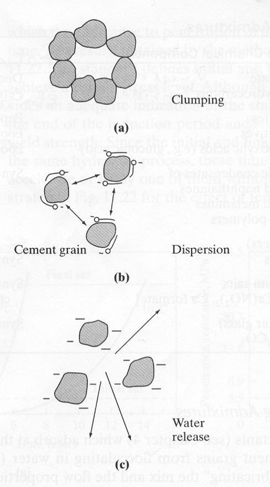
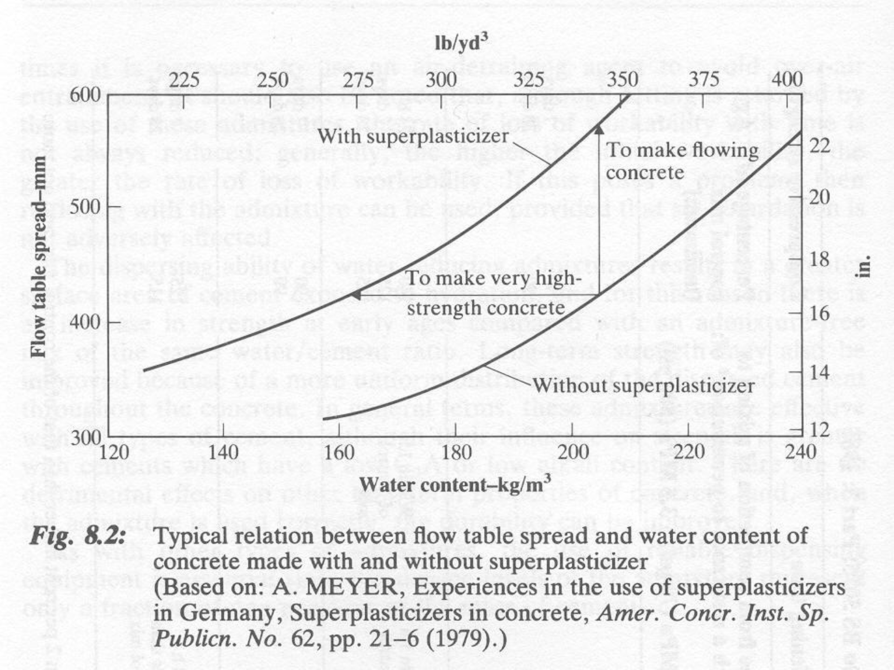
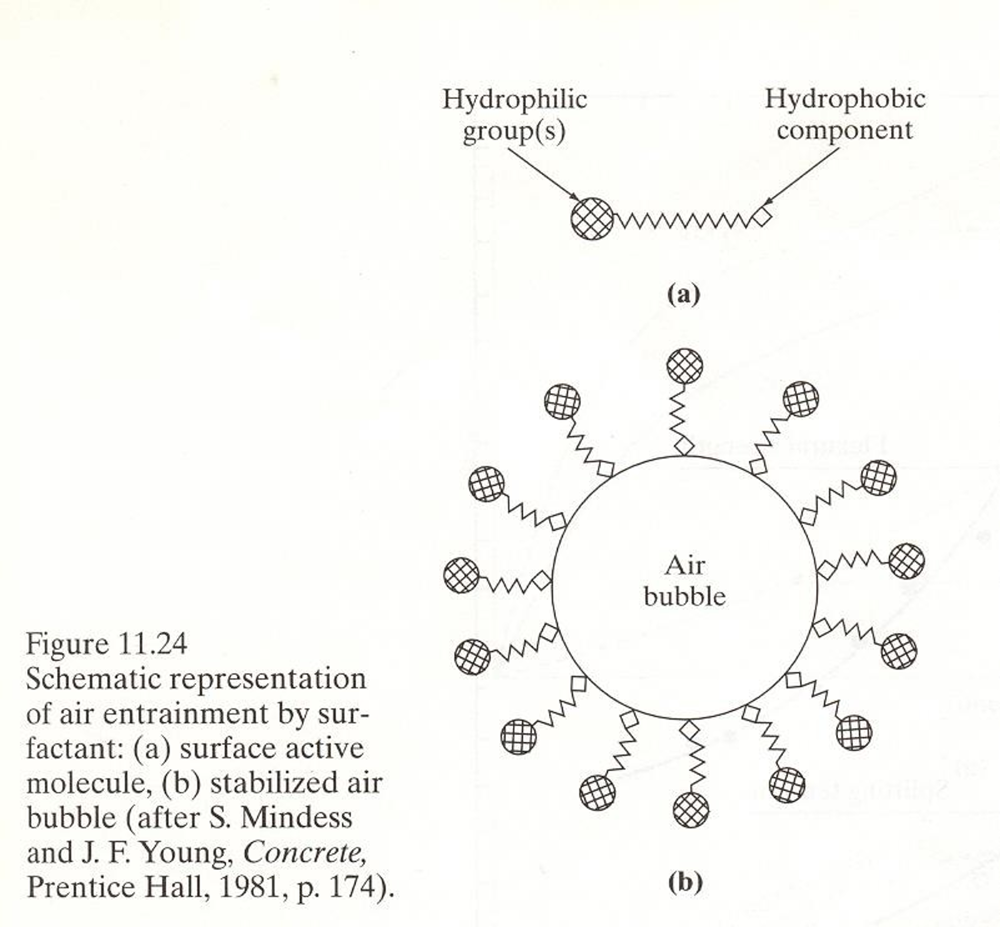
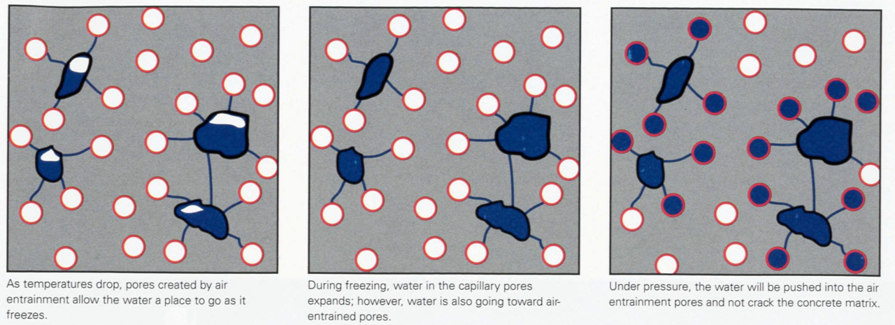

Kafli – Steinsteypa
==============

Steinsteypa er samsett efni úr sementsefju og fylliefnum. Auk þess eru
oft notuð íblendiefni til þess að stjórna eiginleikum steypunnar.

Í kaflanum um sement og bindiefni var fjallað um hvörfun sements,
v/s-tölu og uppbyggingu harðnaðrar sementsefju. Þessir þættir hafa
mikil áhrif á eiginleika steinsteypu.

Í þessum kafla verður sjónum hins vegar beint að steinsteypunni sjálfri:
hvernig hún hegðar sér í fersku ástandi, hvernig eiginleikar hennar
þróast við hörðnun og hvaða eiginleikar skipta máli eftir að hún hefur
harðnað.

Fyrst verður fjallað um ferska steinsteypu og þær kröfur sem þarf að
uppfylla svo hægt sé að flytja hana, leggja hana niður og þjappa henni
án þess að hún aðskiljist.

Fersk steinsteypa
-----------------

Frá því að steinsteypa er blönduð og þar til hún byrjar að storkna þarf
að vera hægt að flytja hana, leggja hana niður í mót og þjappa henni.
Eiginleikar steypunnar á þessu tímabili eru kallaðir eiginleikar
**ferskrar steinsteypu**.

Mikilvægur eiginleiki ferskrar steinsteypu er **vinnanleiki**
(e. *workability*). Vinnanleiki lýsir því hversu auðvelt er að vinna
með steypuna þannig að hún fylli mótið og umlyki bendistál án þess að
aðskilnaður verði.

Góður vinnanleiki þýðir þó ekki einfaldlega að steypan eigi að vera
sem mest fljótandi. Steypan þarf að vera nægilega vinnanleg fyrir þá
aðferð sem notuð er við flutning, niðurlögn og þjöppun, en jafnframt
þarf hún að haldast einsleit.

Vinnanleiki steypu ræðst meðal annars af:

* vatnsmagni og v/s-tölu,
* magni og eiginleikum sementsefju,
* magni, kornastærðardreifingu, lögun og yfirborðsáferð fylliefna,
* íaukum og íblendiefnum,
* loftinnihaldi.

Þessir þættir hafa ekki aðeins áhrif á eiginleika ferskrar steypu.
Breyting á samsetningu til þess að bæta vinnanleika getur jafnframt
haft áhrif á eiginleika steypunnar eftir að hún harðnar.

Þjöppun steinsteypu
~~~~~~~~~~~~~~~~~~~

Þegar steinsteypa er lögð niður í mót lokast loft inni á milli
hlutefna hennar. Þetta loft þarf að fjarlægja eins og kostur er með
**þjöppun** (e. *compaction*) þannig að steypan fylli mótið og umlyki
fylliefni og bendistál.

Ef steypan er ekki nægilega vel þjöppuð verða eftir loftfyllt holrými
í henni. Slík holrými draga meðal annars úr styrk og þéttleika
steypunnar og geta aukið lekt hennar.

.. centered:: **Ófullnægjandi þjöppun → aukin holrýmd → lakari eiginleikar**

Vinnanleiki og þjöppun tengjast því náið. Steypa þarf að vera nægilega
vinnanleg til þess að hægt sé að þjappa henni með þeirri aðferð sem
notuð er við niðurlögn.

Algengasta aðferðin við þjöppun hefðbundinnar steinsteypu er
**víbrun**. Við víbrun minnkar innri mótstaða steypunnar tímabundið,
fylliefniskornin geta færst til og loftbólur leita upp úr steypunni.
Steypan getur þannig lagst þéttar saman og fyllt mótið betur.

Víbrun má meðal annars framkvæma með stafvíbrator sem stungið er niður
í steypuna eða með víbrun móta.

Markmiðið er þó ekki að víbra steypuna sem mest. Ófullnægjandi víbrun
getur skilið eftir loftfyllt holrými en óhófleg víbrun getur stuðlað að
aðskilnaði í steypunni.

.. figure:: ./myndir/kafli16/stafvibrator_og_vibrun.png
    :align: center
    :width: 35%

    Þjöppun steinsteypu með stafvíbrator.

.. figure:: ./myndir/kafli16/vibrandi_mot.png
    :align: center
    :width: 35%

    Þjöppun steinsteypu með víbrandi mótum.

Þjálni og sigmál
~~~~~~~~~~~~~~~~

**Þjálni** (e. *consistency*) lýsir því hversu auðveldlega fersk
steinsteypa formbreytist og flæðir. Þjálni er einn þeirra þátta sem hafa
áhrif á vinnanleika steypunnar en hugtökin vinnanleiki og þjálni hafa
ekki nákvæmlega sömu merkingu.

Til þess að lýsa eiginleikum ferskrar steinsteypu þarf að geta metið
hversu auðveldlega hún flæðir og aflagast. Einn algengasti mælikvarðinn
er **sigmál** (e. *slump*).

Sigmál er mælt með sigmálsprófi. Stöðluð keila er fyllt af ferskri
steypu og síðan lyft lóðrétt upp. Steypan sígur þegar keilan er
fjarlægð og **sigmálið** er mælt sem lóðrétt lækkun steypunnar.

.. figure:: ./myndir/kafli16/sigmalskeila.png
    :align: center
    :width: 50%

    Sigmálskeila.

.. figure:: ./myndir/kafli16/sigmalsprof.png
    :align: center
    :width: 90%

    Mæling sigmáls ferskrar steinsteypu.

.. youtube:: jDUQO-bn8pU
    :width: 100%
    :height: 400

Hátt sigmál gefur almennt til kynna að steypan sé auðveldari í
niðurlögn en lágt sigmál að hún sé stífari. Sigmál eitt og sér gefur
þó ekki fullkomna lýsingu á vinnanleika steypu. Tvær steypublöndur
geta til dæmis haft svipað sigmál en hegðað sér ólíkt við niðurlögn
og þjöppun.

Aukið vatnsmagn eykur almennt sigmál steypu. Það er þó ekki æskileg
leið til þess að auka vinnanleika ef viðbótarvatnið hækkar v/s-töluna.
Eins og fjallað var um í kaflanum um sement og bindiefni hefur
v/s-talan áhrif á uppbyggingu harðnaðrar sementsefju og þar með
eiginleika steinsteypunnar.

Þegar þörf er á miklum vinnanleika án þess að auka v/s-töluna er
hægt að nota viðeigandi íblendiefni, svo sem flot- eða þjálniefni.

Þjálnitap
~~~~~~~~~

Eiginleikar ferskrar steinsteypu breytast með tíma. Eftir blöndun
hefst hvörfun sementsins og steypan verður smám saman stífari. Þjálni
minnkar því almennt eftir því sem lengri tími líður frá blöndun.

Þessi breyting er kölluð **þjálnitap** (e. *slump loss*). Þjálnitap
skiptir máli við framkvæmd þar sem nægur vinnanleiki þarf að haldast
á meðan steypan er flutt, lögð niður og þjöppuð.

.. figure:: ./myndir/kafli16/thjalnitap_m_tima.png
    :align: center
    :width: 70%

    Þjálni steinsteypu minnkar með tíma frá blöndun.

Hraði þjálnitaps getur meðal annars ráðist af samsetningu steypunnar,
hitastigi og þeim íblendiefnum sem notuð eru. Því þarf að taka tillit
til þess tíma sem líður frá blöndun þar til niðurlögn og þjöppun er
lokið.

Aðskilnaður
~~~~~~~~~~~

Steinsteypa er samsett úr efnum sem hafa ólíka kornastærð og
eðlisþyngd. Til þess að steypan verði einsleit þurfa þessir efnisþættir
að haldast jafnt dreifðir við flutning, niðurlögn og þjöppun.

**Aðskilnaður** (e. *segregation*) verður þegar efnisþættir
steypunnar skiljast að þannig að samsetning hennar verður ekki lengur
einsleit.

Aðskilnaður getur meðal annars orðið þegar gróf fylliefni skiljast frá
sementsefjunni og safnast á ákveðin svæði. Hann getur einnig orðið þegar
sementsefjan skilur sig frá grófari efnisþáttum steypunnar.

.. figure:: ./myndir/kafli16/adskilnadur.png
    :align: center
    :width: 45%

    Aðskilnaður í harðnaðri steinsteypu.

Hætta á aðskilnaði eykst ef samloðun steypunnar er lítil. Mjög
þunnfljótandi steypa getur til dæmis verið viðkvæm fyrir aðskilnaði.
Óhófleg víbrun getur einnig stuðlað að aðskilnaði.

Aðskilnaður er óæskilegur vegna þess að eiginleikar harðnaðrar
steypu verða þá ekki einsleitir í byggingarhlutanum.

Vatnsblæðing
~~~~~~~~~~~~

**Vatnsblæðing** (e. *bleeding*) er sérstök tegund aðskilnaðar þar
sem vatn leitar upp á yfirborð ferskrar steinsteypu.

Eftir niðurlögn hafa föstu efnisþættir steypunnar tilhneigingu til að
setjast. Ef sementsefjan getur ekki haldið öllu blendivatninu dreifðu
getur hluti vatnsins leitað upp í gegnum steypuna og safnast á
yfirborðinu.

.. figure:: ./myndir/kafli16/vatnsblaeding_2.png
    :align: center
    :width: 70%

    Vatnsblæðing í ferskri steinsteypu.

.. figure:: ./myndir/kafli16/vatnsblaeding_3.png
    :align: center
    :width: 70%

    Vatnsblæðing í ferskri steinsteypu.

Vatnsblæðing minnkar eftir því sem storknun steypunnar líður.
Mikil vatnsblæðing getur hins vegar haft neikvæð áhrif á uppbyggingu
steypunnar. Vatn getur til dæmis safnast undir stærri fylliefniskornum
eða bendistáli og myndað veik svæði eftir að steypan harðnar.

.. figure:: ./myndir/kafli16/vatnsblaeding.png
    :align: center
    :width: 70%

    Vatn getur safnast undir fylliefniskornum og myndað veik svæði
    í steinsteypunni.

Samsetning steypunnar hefur áhrif á vatnsblæðingu. Almennt dregur
aukið magn fínefna og góð samloðun sementsefjunnar úr tilhneigingu
til vatnsblæðingar. Íblendiefni og íaukar geta einnig haft áhrif á
vatnsblæðingu með því að breyta eiginleikum ferskrar steypu.

Íblendiefni
~~~~~~~~~~~

**Íblendiefni** (e. *chemical admixtures*) eru efni sem bætt er í
steypu í litlu magni til þess að breyta eiginleikum hennar. Þau geta
haft áhrif á steypuna meðan hún er fersk, á storknun hennar og á
eiginleika hennar eftir hörðnun.

Með íblendiefnum er hægt að stjórna ákveðnum eiginleikum steypunnar án
þess að þurfa að breyta grunnefnasamsetningu hennar að sama skapi.
Þannig má til dæmis auka vinnanleika án þess að auka v/s-töluna eða
breyta því hversu hratt steypan storknar og styrkur hennar þróast.

Vatnsspararar og flotefni
^^^^^^^^^^^^^^^^^^^^^^^^^

Aukið vatnsmagn eykur almennt þjálni steinsteypu. Ef vatni er bætt
í steypublöndu án þess að sementsmagnið sé aukið hækkar hins vegar
v/s-talan. Það getur haft neikvæð áhrif á eiginleika steypunnar eftir
hörðnun.

**Vatnsspararar** (e. *plasticizers* eða *water reducers*) eru
íblendiefni sem dreifa sementskornum betur í sementsefjunni. Við það
minnkar vatnsþörf steypunnar og hægt er að ná tilteknum vinnanleika
með minna vatnsmagni.

Vatnssparara má því meðal annars nota til þess að:

* minnka vatnsmagn og lækka v/s-tölu við óbreyttan vinnanleika,
* auka vinnanleika við óbreytta v/s-tölu,
* auðvelda niðurlögn og þjöppun steypu.

   Vatnssparar dreifa sementskornum og draga þannig úr vatnsþörf
   steypunnar.

**Flotefni** (e. *superplasticizers*) eru öflug vatnssparandi
íblendiefni. Þau hafa sömu grundvallarvirkni og vatnsspararar en geta
gefið mun meiri aukningu í vinnanleika eða meiri lækkun á vatnsmagni.

Með flotefnum er því hægt að framleiða mjög þjála steinsteypu án þess
að hækka v/s-töluna. Einnig er hægt að nota þau til þess að ná mjög
lágri v/s-tölu án þess að steypan verði of stíf til niðurlagnar og
þjöppunar.

Flotefni eru meðal annars mikilvæg við gerð hástyrkleikasteypu og
sjálfútleggjandi steypu.

   Áhrif flotefnis á þjálni steinsteypu.

Loftblendi
^^^^^^^^^^

**Loftblendi** (e. *air-entraining admixtures*) eru yfirborðsvirk
efni sem mynda mikinn fjölda smárra loftbóla í sementsefjunni.

Loftblöndun getur bætt vinnanleika ferskrar steinsteypu. Mikilvægasta
hlutverk hennar er þó að auka frostþol harðnaðrar steinsteypu. Smáu
loftbólurnar veita rými sem dregur úr þrýstingi þegar vatn í
holrýmakerfi steypunnar frýs.

Loftinnihald hefur jafnframt áhrif á styrk steinsteypu. Aukið
loftinnihald dregur almennt úr styrk og því þarf að stjórna
loftinnihaldi með tilliti til þeirra eiginleika sem krafist er.

    Virkni loftblendis.

Storknunarseinkarar og hvörfunarhraðarar
^^^^^^^^^^^^^^^^^^^^^^^^^^^^^^^

Með íblendiefnum er einnig hægt að hafa áhrif á storknun og
styrkþróun steinsteypu.

**Storknunarseinkarar** (e. *retarders*) hægja á storknun og lengja
þann tíma sem steypan helst vinnanleg. Þeir geta til dæmis verið
gagnlegir þegar langur tími líður milli blöndunar og niðurlagnar eða
þegar hátt hitastig flýtir fyrir storknun.

**Hvörfunarhraðarar** (e. *accelerators*) eru notaðir til þess að flýta
storknun eða styrkþróun. Þeir geta meðal annars verið gagnlegir þegar
þörf er á hraðri styrkaukningu, til dæmis við ákveðnar
viðgerðaraðgerðir.

Önnur íblendiefni
^^^^^^^^^^^^^^^^^

Til eru fjölmargir aðrir flokkar íblendiefna sem eru notaðir til
sérhæfðari verkefna. Þar má meðal annars nefna rýrnunarvara,
seigjubreyta og efni sem draga úr tæringu bendistáls eða öðrum
niðurbrotsferlum.

Val á íblendiefnum fer eftir þeim eiginleikum sem óskað er eftir og
þeim aðstæðum sem steypan verður fyrir. Íblendiefni geta jafnframt
haft áhrif á fleiri eiginleika en þann sem fyrst og fremst er verið
að stjórna og því þarf að taka tillit til heildaráhrifa þeirra.

Hörnuð steinsteypa
------------------

Eftir niðurlögn og þjöppun tekur steinsteypan að storkna og harðna.
Hvörfun sementsins heldur áfram og eiginleikar steypunnar þróast með
tíma.

Eins og fjallað var um í kaflanum um sement og bindiefni hefur
uppbygging sementsefjunnar mikil áhrif á eiginleika harðnaðrar
steinsteypu. Eiginleikar steinsteypunnar ráðast þó ekki eingöngu af
sementsefjunni heldur einnig af fylliefnunum, hlutföllum efnisþáttanna
og samspili þeirra.

Meðal mikilvægustu eiginleika harðnaðrar steinsteypu eru styrkur,
stífleiki, tímaháðar formbreytingar og ending.

Styrkur steinsteypu
~~~~~~~~~~~~~~~~~~~

Steinsteypa hefur mikið **þrýstiþol** en mun minna **togþol**.
Þessi munur er grundvallareiginleiki steinsteypu og ein helsta ástæða
þess að bendistál er notað með steinsteypu í burðarvirkjum.

Styrk steinsteypu má meðal annars lýsa með:

* **þrýstiþoli** (e. *compressive strength*),
* **togþoli** (e. *tensile strength*),
* **beygjutogþoli** (e. *flexural strength*).

.. figure:: ./myndir/kafli16/thrysti_tog_beygjuthol.png
    :align: center
    :width: 80%

    Uppsetning á mælitækjum til þess að ákvarða þrýsti-, tog- og beygjutogþol steinsteypu.

Þrýstiþol er langalgengasti mælikvarðinn á styrk steinsteypu. Það er
tiltölulega einfalt að mæla þrýstiþol og það hefur sterk tengsl við marga aðra
eiginleika steypunnar. (Sjá töflu með þrýstiþoli, :math:`f_{ck}` og togþoli :math:`f_{ctm}`. 
Taflan sýnir að meðaltogþolið er u.þ.b. 10% af þrýstiþolinu.)

Þrýstiþol er ákvarðað með því að setja álag á steypusýni í þrýstingi þar til
brot verður. Styrkurinn er reiknaður út frá mesta álagi sem sýnið ber
og þverskurðarflatarmáli þess:

.. math::

    f_c = \frac{F}{A}

þar sem :math:`F` er mesta álag fyrir brot og :math:`A` er
þverskurðarflatarmál sýnisins.

.. list-table:: Samband þrýstiþols og togþols steinsteypu skv. Evrópustaðli
    :header-rows: 1
    :widths: 25 25 25

    * - :math:`f_{ck}` [MPa]
      - :math:`f_{ctm}` [MPa]
      - :math:`f_{ctm}/f_{ck}` [%]
    * - 12
      - 1,6
      - 13
    * - 16
      - 1,9
      - 12
    * - 20
      - 2,2
      - 11
    * - 25
      - 2,6
      - 10
    * - 30
      - 2,9
      - 10
    * - 35
      - 3,2
      - 9
    * - 40
      - 3,5
      - 9
    * - 45
      - 3,8
      - 8
    * - 50
      - 4,1
      - 8

Þrýstiþol steinsteypu er háð aldri hennar og því þarf alltaf að miða
styrk við ákveðinn aldur. Algengt er að miða flokkun steinsteypu við
þrýstiþol við 28 daga aldur.

Þættir sem hafa áhrif á styrk
^^^^^^^^^^^^^^^^^^^^^^^^^^^^^

Styrkur steinsteypu ræðst af samsetningu hennar, uppbyggingu og
aðstæðum við niðurlögn og hörðnun. Margir þessara þátta tengjast
því hversu mikið holrými er í steypunni og hvernig sementsefjan
þróast við hvörfun.

V/s-tala
""""""""

V/s-talan er einn mikilvægasti þátturinn sem hefur áhrif á styrk
steinsteypu. Eins og fjallað var um í kaflanum um sement og bindiefni
hefur v/s-talan áhrif á holrýmd harðnaðrar sementsefju.

Hærri v/s-tala leiðir almennt til meiri háræðaholrýmdar og þar með
minni styrks. Lægri v/s-tala getur hins vegar leitt til þéttari
sementsefju og meiri styrks, að því gefnu að steypan sé nægilega
vinnanleg og aðstæður til hvörfunar séu góðar.

.. figure:: ./myndir/kafli16/thrystithol_vs_vstala.png
    :align: center
    :width: 70%

    Áhrif v/s-tölu á þrýstiþol steinsteypu.

Þjöppun
"""""""

Við niðurlögn getur loft lokast inni í steypunni. Eins og fjallað var
um í kaflanum um ferska steinsteypu er markmið þjöppunar að fjarlægja
þetta loft og tryggja að steypan fylli mótið.

Ef þjöppun er ófullnægjandi verða eftir loftfyllar holur (hreiður). Holurnar
minnka þann hluta þversniðsins sem getur borið álag og draga því úr
styrk steypunnar.

.. figure:: ./myndir/kafli16/thrystithol_vs_vibrun.png
    :align: center
    :width: 70%

    Áhrif þjöppunar á þrýstiþol steinsteypu.

Loftinnihald
""""""""""""

Loftblendi myndar smáar loftbólur (pórur) í sementsefjunni. Loftbólurnar hafa
mikilvægu hlutverki að gegna varðandi frostþol steinsteypu en aukið
loftinnihald dregur jafnframt úr styrk hennar.

    Margar litlar pórur myndaðar með loftblendi auka frostþol steypunnar.

Þetta er dæmi um að breyting á samsetningu steinsteypu getur haft bæði
jákvæð og neikvæð áhrif. Við loftblöndun þarf því að tryggja nægilegt
loft til þess að ná tilætluðu frostþoli án þess að styrkur minnki meira
en ásættanlegt er.

.. figure:: ./myndir/kafli16/thrystithol_vs_loft.png
    :align: center
    :width: 70%

    Áhrif loftinnihalds á þrýstiþol steinsteypu.

Aldur, hitastig og aðhlúun
""""""""""""""""""""""""""

Styrkur steinsteypu þróast með tíma eftir því sem hvörfun sementsins
gengur lengra. Steinsteypa heldur því áfram að auka styrk sinn eftir að hún
hefur harðnað.

Hitastig hefur áhrif á hraða hvörfunar og þar með á styrkþróun.
Hærra hitastig getur hraðað styrkþróun á fyrstu stigum en samband
hitastigs og langtímastyrks er flóknara.

Til þess að hvörfun geti haldið áfram þarf jafnframt nægilegt vatn.
**Aðhlúun** (e. *curing*) felst í því að skapa aðstæður sem stuðla að
áframhaldandi hvörfun og koma meðal annars í veg fyrir að steypan
þorni of hratt.

Góð aðhlúun er sérstaklega mikilvæg nálægt yfirborði steypunnar, þar
sem vatnstap til umhverfisins getur annars stöðvað eða hægt á hvörfun.

.. figure:: ./myndir/kafli16/thrystithol_vs_hitastigogadhluun.png
    :align: center
    :width: 70%

    Áhrif hitastigs og aðhlúunar á styrkþróun steinsteypu.

Spennu–streitu hegðun steinsteypu
^^^^^^^^^^^^^^^^^^^^^^^^^^^^^^^^^

.. admonition:: Gott að muna
   :class: tip

   **Spenna** lýsir álagi á flatarmál, **streita** hlutfallslegri
   formbreytingu og **fjaðurstuðull** lýsir stífleika efnis.

   Fyrir línulega fjaðrandi efni gildir:

   .. math::

       E = \frac{\sigma}{\varepsilon}

   Fjallað var nánar um spennu, streitu og fjaðurstuðul í kafla um styrk og stífleika.

Steinsteypa er ekki fullkomlega línulega fjaðrandi efni. Spennu–streitu
ferill hennar verður ólínulegur eftir því sem álagið eykst.

.. figure:: ./myndir/kafli16/spennu_streitu_ferill.png
    :align: center
    :width: 100%

    Spennu–streitu ferill steinsteypu.

Ólínuleg hegðun steinsteypu tengist meðal annars sprungumyndun í
efninu. Smásprungur eru til staðar í steinsteypu áður en
hámarksstyrk er náð og þeim fjölgar og þær stækka eftir því sem
álagið eykst.

Við þrýstiálag eykst streitan fyrst tiltölulega jafnt með spennunni.
Með auknu álagi verður sprungumyndun meiri og ferillinn verður
ólínulegri. Að lokum næst hámarksspenna og brot þróast í steypunni.

Lögun spennu–streitu ferilsins er því bæði lýsing á stífleika
steypunnar og því hvernig skemmdir þróast í henni fram að broti.

Álagshraði
""""""""""

Mældur styrkur steinsteypu er einnig háður álagshraða. Við hraða
álagsaukningu mælist almennt meiri styrkur en þegar sama álagi er
beitt hægar.

Þegar styrkgildi eru borin saman þarf því að hafa í huga að
prófunaraðferð og álagshraði geta haft áhrif á niðurstöðuna.

.. figure:: ./myndir/kafli16/alagshradi.png
    :align: center
    :width: 70%

    Áhrif álagshraða á mældan styrk steinsteypu.

Stífleiki steinsteypu
~~~~~~~~~~~~~~~~~~~~~

Þar sem spennu–streitu ferill steinsteypu er ekki línulegur er
fjaðurstuðull hennar ekki eitt fast gildi sem fæst sem halli alls
ferilsins. Hægt er að skilgreina fjaðurstuðul út frá mismunandi
hlutum spennu–streitu ferilsins.

.. figure:: ./myndir/kafli16/fjadurstudull_1.png
    :align: center
    :width: 60%

.. figure:: ./myndir/kafli16/fjadurstudull_2.jpg
    :align: center
    :width: 60%

    Mismunandi leiðir til þess að ákvarða fjaðurstuðul steinsteypu
    út frá spennu–streitu ferli hennar.

Í verkfræðilegum útreikningum er meðal annars notaður
**sniðilsstuðull** (e. *secant modulus*), þar sem stífleikinn er
ákvarðaður út frá halla línu milli tveggja punkta á
spennu–streitu ferlinum.

Samsett uppbygging og stífleiki
^^^^^^^^^^^^^^^^^^^^^^^^^^^^^^^^

Steinsteypa er samsett efni. Við fyrstu sýn mætti því ætla að
spennu–streitu hegðun hennar væri einfaldlega sambland af hegðun
fylliefna og sementsefju. Raunin er þó flóknari.

Fylliefni hafa almennt háan fjaðurstuðul og sýna nær línulega
spennu–streitu hegðun við það álag sem hér er til skoðunar.
Sementsefjan hefur mun lægri fjaðurstuðul en getur einnig sýnt
nokkurn veginn línulega hegðun.

Steinsteypan sjálf hefur fjaðurstuðul sem liggur á milli
fjaðurstuðuls fylliefnanna og sementsefjunnar. Spennu–streitu
ferill hennar er hins vegar greinilega ólínulegur.

.. figure:: ./myndir/kafli16/spennu_streitu_ferill_2.png
    :align: center
    :width: 70%

    Spennu–streitu hegðun fylliefna, sementsefju og steinsteypu.

Til þess að skýra þessa hegðun þarf að líta á steinsteypu sem efni
sem samanstendur af **þremur fösum**:

* fylliefnum,
* sementsefju,
* fasaskil milli fylliefna og sementsefju.

Svæðið við fasaskil fylliefna og sementsefju er oft kallað
**þriðji fasinn** (e. *interfacial transition zone*, ITZ).
Uppbygging sementsefjunnar á þessu svæði er frábrugðin uppbyggingu
hennar fjær fylliefnunum og svæðið er almennt veikari hluti
steypunnar.

Vegna mismunandi stífleika fylliefna og sementsefju myndast
spennuþéttingar við fasaskilin þegar steinsteypa verður fyrir álagi.
Smásprungur geta því myndast og þróast á fasaskilunum áður en
hámarksstyrk steypunnar er náð.

Eftir því sem álagið eykst fjölgar smásprungum og þær breiðast út.
Þessi stigvaxandi sprungumyndun er ein helsta ástæða þess að
spennu–streitu ferill steinsteypu verður ólínulegur þótt hegðun
einstakra efnisþátta hennar sé mun nær línulegri.

Skrið
~~~~~

Þegar steinsteypa verður fyrir álagi verður strax formbreyting sem
ræðst meðal annars af stífleika hennar. Ef álaginu er haldið föstu
heldur formbreytingin hins vegar áfram að aukast með tíma.

Þessi tímaháða formbreyting undir viðvarandi álagi kallast **skrið**
(e. *creep*).

.. figure:: ./myndir/kafli16/skrid.png
    :align: center
    :width: 70%

    Formbreyting steinsteypu eykst með tíma þegar hún verður fyrir
    viðvarandi álagi.

Þegar álag er sett á steinsteypu kemur því fyrst fram skyndileg upphafsformbreyting 
og síðan viðbótarformbreyting vegna skriðs.

Ef álagið er fjarlægt gengur hluti formbreytingarinnar til baka.
Formbreytingin gengur þó ekki endilega öll til baka og hluti hennar getur orðið
varanlegur.

Hvað ræður skriði?
^^^^^^^^^^^^^^^^^^

Skrið á sér fyrst og fremst stað í **sementsefjunni**. Fylliefnin
skríða mun minna og hamla því formbreytingum sementsefjunnar.

Steinsteypa með miklu hlutfalli stífra fylliefna hefur því almennt
minna skrið en steinsteypa með miklu hlutfalli sementsefju. Stífleiki
fylliefnanna skiptir einnig máli; því stífari sem fylliefnin eru, því
meira halda þau aftur af skriði sementsefjunnar.

Þetta sýnir aftur mikilvægi þess að líta á steinsteypu sem samsett
efni. Sementsefjan hefur tilhneigingu til að formbreytast með tíma en
fylliefnin takmarka þessar formbreytingar.

.. figure:: ./myndir/kafli16/skrid_fylliefni_2.png
    :align: center
    :width: 70%

    Skriðþróun fyrir steypu með mismunandi fylliefnum. Því hærri sem fjaðurstuðullinn er þeim mun minna verður skriðið.

.. figure:: ./myndir/kafli16/skrid_fylliefni.png
    :align: center
    :width: 70%

    Skriðþróun fyrir steypu með mismunandi fylliefnum. Basalt er algengasta íslenska fylliefnið.

Aldur og hvörfun
^^^^^^^^^^^^^^^^

Skrið steinsteypu er háð því hversu langt hörðnun hennar er komin.
Eftir því sem hvörfun sementsins gengur lengra verður sementsefjan
stífari og tilhneiging hennar til skriðs minnkar.

Aldur steypunnar þegar álag er sett á skiptir því miklu máli.
Ung steinsteypa skríður meira undir viðvarandi álagi en eldri
steinsteypa sem hefur náð meiri hörðnun.

.. figure:: ./myndir/kafli16/skrid_alagstimi.png
    :align: center
    :width: 70%

    Áhrif aldurs steinsteypu við upphaf álags á skrið.

Raki
^^^^

Rakastig umhverfisins hefur mikil áhrif á skrið. Skrið verður almennt
meira þegar steinsteypa er í þurru umhverfi en þegar hlutfallsraki
umhverfisins er hár.

Þurrkun og skrið eiga sér þá stað samtímis og samspil þeirra eykur
tímaháðar formbreytingar steypunnar.

.. figure:: ./myndir/kafli16/skrid_loftraki.png
    :align: center
    :width: 70%

    Áhrif hlutfallsraka umhverfis á skrið steinsteypu.

.. admonition:: Gott að muna
   :class: tip

   Skrið þróast yfir langan tíma en stór hluti þess kemur fram
   tiltölulega snemma. Ef miðað er við skrið eftir 20 ár má gróflega
   gera ráð fyrir að:

   * um 25% komi fram á fyrstu tveimur vikunum,
   * um 50% komi fram á fyrstu þremur mánuðunum,
   * um 75% komi fram á fyrsta árinu.

Rýrnun
~~~~~~

**Rýrnun** (e. *shrinkage*) er rúmmálsminnkun sem verður í
steinsteypu án utanaðkomandi álags.

Rýrnun sementsefju getur stafað af því að vatn tapast úr steypunni
til umhverfisins eða vegna breytinga sem verða inni í sementsefjunni
við áframhaldandi hvörfun.

Fylliefnin rýrna hins vegar mun minna og hamla því rýrnun
sementsefjunnar. Eins og við skrið hefur því bæði magn og stífleiki
fylliefna áhrif á heildarformbreytingu steinsteypunnar.

Rýrnun verður sérstaklega mikilvæg þegar steypan getur ekki dregist saman. 
Þá myndast togspennur í henni. Þar sem togþol
steinsteypu er lágt geta þessar spennur leitt til sprungumyndunar.

.. centered:: **Hindruð rýrnun → togspennur → hætta á sprungumyndun**

Rýrnun steinsteypu má meðal annars greina í:

* **plastíska rýrnun**,
* **þurrkrýrnun**,
* **sjálfútþornunarrýrnun**.

Þessar gerðir rýrnunar eiga sér stað við mismunandi aðstæður og
orsakir þeirra eru ekki þær sömu.

Plastísk rýrnun
^^^^^^^^^^^^^^^

**Plastísk rýrnun** (e. *plastic shrinkage*) verður mjög snemma,
á meðan steypan er enn plastísk og hefur ekki öðlast umtalsverðan
styrk.

Eftir niðurlögn getur vatn gufað upp af yfirborði steypunnar. Ef
uppgufunin verður hraðari en vatn getur borist að yfirborðinu úr
steypunni lækkar vatnsborðið í yfirborðslaginu og sementsefjan
dregst saman.

Á þessu stigi hefur steypan mjög lítið togþol. Ef samdrátturinn er
hindraður geta því myndast sprungur í yfirborði hennar.

Hætta á plastískri rýrnun eykst þegar aðstæður stuðla að hraðri
uppgufun, meðal annars við:

* mikinn vind,
* lágan hlutfallsraka,
* hátt hitastig steypu,
* hátt hitastig umhverfis.

Mikilvægt er því að verja yfirborð nýlagðrar steypu gegn of hraðri
uppgufun. Það má meðal annars gera með yfirbreiðslu og viðeigandi
aðhlúun.

.. list-table::
   :widths: 50 50
   :header-rows: 0

   * - .. image:: ./myndir/kafli16/ryrnun_varnir.png
         :width: 100%
     - .. image:: ./myndir/kafli16/vokva_steypu.png
         :width: 100%

.. centered:: **Dæmi um aðhlúun steinsteypu með yfirbreiðslu og vökvun.**

Þurrkrýrnun
^^^^^^^^^^^

**Þurrkrýrnun** (e. *drying shrinkage*) verður eftir að steypan
hefur storknað og hörðnun er hafin.

Ef hlutfallsraki umhverfisins er lægri en rakinn í steypunni leitar
vatn úr pórukerfi hennar til umhverfisins. Við þurrkun myndast
kraftar í háræðakerfi sementsefjunnar sem valda því að hún dregst
saman.

Þurrkun hefst við yfirborð steypunnar og færist smám saman inn í
byggingarhlutann. Stærð og lögun byggingarhlutans hafa því áhrif á
hraða þurrkunar og rýrnunar. Þunnir byggingarhlutar eða hlutir með
stórt yfirborð miðað við rúmmál þorna almennt hraðar.

Umhverfisaðstæður skipta einnig miklu máli. Þurrkrýrnun verður
almennt meiri við lágan hlutfallsraka en minni þegar steypan er í
röku umhverfi.

Sjálfútþornunarrýrnun
^^^^^^^^^^^^^^^^^^^^^

**Sjálfútþornunarrýrnun** (e. *autogenous shrinkage*) verður án þess
að vatn þurfi að tapast úr steypunni til umhverfisins.

Við hvörfun sementsins er vatn bundið í hvörfunarefni. Þegar
hvörfunin gengur áfram minnkar því magn lauss vatns í pórukerfi
sementsefjunnar. Þetta getur lækkað innri hlutfallsraka og valdið
samdrætti sementsefjunnar.

Sjálfútþornunarrýrnun er yfirleitt lítil í hefðbundinni steinsteypu
með tiltölulega háa v/s-tölu en verður mikilvægari þegar v/s-talan
er mjög lág, svo sem í hástyrkleikasteypu.

Ólíkt þurrkrýrnun stafar sjálfútþornunarrýrnun ekki fyrst og fremst
af uppgufun vatns af yfirborði. Hefðbundnar aðgerðir sem koma í veg
fyrir þurrkun geta því ekki komið í veg fyrir hana á sama hátt.

.. admonition:: Gott að muna
   :class: tip

   Rýrnun steinsteypu ræðst af samspili sementsefju, fylliefna,
   rakaflutnings og umhverfisaðstæðna.

   * **Sementsefjan rýrnar mest.** Aukið hlutfall sementsefju leiðir
     því almennt til meiri rýrnunar.

   * **Fylliefnin hamla rýrnun.** Mikið magn fylliefna og stíf
     fylliefni draga almennt úr rýrnun steinsteypu.

   * **Rakaástand og umhverfi ráða miklu um þurrkrýrnun.**
     Lágur hlutfallsraki og aðstæður sem auka uppgufun stuðla að
     meiri þurrkun og rýrnun.

   * **Stærð og lögun byggingarhlutans skipta máli.** Byggingarhlutar
     með stórt yfirborð miðað við rúmmál þorna almennt hraðar.

   * **V/s-talan hefur ekki sömu áhrif á allar gerðir rýrnunar.**
     Við mjög lága v/s-tölu verður sjálfútþornunarrýrnun mikilvægari,
     jafnvel þótt þurrkrýrnun sé ekki endilega mikil.

Ending steinsteypu
------------------

Í kaflanum um niðurbrot efna og endingu var fjallað um mismunandi
niðurbrotsferli og þær aðstæður sem þurfa að vera fyrir hendi til þess
að þeir geti átt sér stað.

Fyrir steinsteypu gegna **raki og flutningur efna** sérstaklega
mikilvægu hlutverki. Vatn og uppleyst efni þurfa að geta komist inn í
steypuna til þess að mörg niðurbrotsferli geti átt sér stað.

Holrýmd, lekt og ending
~~~~~~~~~~~~~~~~~~~~~~~

Hörnuð sementsefja inniheldur holrými af mismunandi stærðum. Fyrir
endingu skiptir ekki aðeins máli hversu mikið holrými er í steypunni,
heldur einnig hvort pórurnar tengjast saman þannig að vatn og uppleyst
efni geti flust um þær.

V/s-talan hefur þar mikil áhrif. Hærri v/s-tala leiðir almennt til
opnara háræðakerfis og auðveldar þannig flutning vatns og efna um
sementsefjuna.

.. centered:: **Hærri v/s-tala → opnara pórukerfi → meiri lekt → aukin hætta á niðurbroti**

Góð þjöppun og aðhlúun skipta einnig máli. Ófullnægjandi þjöppun
skilur eftir holrými í steypunni og ófullnægjandi aðhlúun getur leitt
til þess að yfirborðslag hennar verði opnara og viðkvæmara fyrir
áhrifum umhverfisins.

Sprungur geta jafnframt myndað greiðar leiðir fyrir vatn og önnur efni
inn í steypuna. Sprungumyndun vegna rýrnunar getur því haft bein áhrif
á endingu hennar.

Þétt og vel þjöppuð steinsteypa með lága lekt er almennt betur í stakk
búin til þess að standast umhverfisáraun en steinsteypa með opið
holukerfi eða sprungur.

.. admonition:: Tenging við kafla 8
   :class: tip

   Í kafla 8 var meðal annars fjallað um frostskemmdir, kolsýringu,
   alkalí-kísil efnahvörf og tæringu málma.

   **Samsetning og uppbygging steinsteypunnar
   ræður því hversu auðveldlega vatn og önnur efni komast inn í hana
   og þar með hversu viðkvæm hún er fyrir mörgum þessara
   niðurbrotsferla.**

Kröfur til steinsteypu
----------------------

Þegar steinsteypa er valin fyrir byggingarhluta þarf að skilgreina
þá eiginleika sem hún á að hafa. Kröfurnar ráðast meðal annars af
hlutverki byggingarhlutans, aðstæðum við framkvæmd og þeirri
umhverfisáraun sem mannvirkið verður fyrir.

Kröfur til steinsteypu geta komið fram í stöðlum, reglugerðum og
verklýsingum. Til dæmis eru gerðar kröfur til steinsteypu í
byggingarreglugerð og verkkaupar geta sett frekari kröfur fyrir
tiltekin mannvirki, svo sem í verklýsingum Vegagerðarinnar.

Steinsteypa er því ekki skilgreind með einum eiginleika. 

Dæmi um lýsingu á steinsteypu er:

.. centered:: **C25/30 XF2 D22 S4 Ae**

Táknin lýsa mismunandi eiginleikum og kröfum:

**C25/30 — Styrkleikaflokkur**
    Kennistyrkur steinsteypunnar við 28 daga aldur. Fyrri talan
    vísar til þrýstiþols sívalnings og sú síðari til þrýstiþols
    tenings, hér 25 MPa og 30 MPa.

**XF2 — Áreitisflokkur**
    Áreitisflokkurinn hefur áhrif á þær kröfur sem gerðar eru til 
    steinsteypunnar með tilliti til endingar. Áreitisflokkur getur 
    verið fyrir rygðmyndun vegna kolsýringar eða fyrir frost-þíðuáhrif. 
    XF flokkarnir lýsa umhverfisáraun vegna frosts og þíðu. 

**D22 — Hámarks kornastærð fylliefna**
    Hámarks kornastærð fylliefna er 22 mm. Val á kornastærð þarf meðal
    annars að taka mið af stærð byggingarhlutans og þéttleika
    bendingar.

**S4 — Sigmál**
    Lýsir þjálni ferskrar steinsteypu og er hér ákvarðaður út frá
    sigmáli. Þjálnin þarf að henta niðurlögn og þjöppun steypunnar.

**Ae — Loftblöndun**
    Loftblendin steinsteypa. Loftblöndun er meðal annars notuð
    til þess að auka frostþol steinsteypu.

Aðrir eiginleikar geta einnig verið tilgreindir eftir því sem við á,
til dæmis sementsmagn, v/s-tala, loftinnihald, magn íauka, þéttleiki
og fjaðurstuðull.

Kröfur ráðast af notkun
~~~~~~~~~~~~~~~~~~~~~~~

Sama steinsteypa hentar ekki við allar aðstæður. Kröfur til
steypunnar ráðast af því hvar og hvernig hún verður notuð.

Byggingarhluti innanhúss í þurru umhverfi verður til dæmis fyrir
annarri áraun en brú sem verður fyrir vatni, frosti og söltum.
Kröfur um samsetningu og eiginleika steypunnar geta því verið
mismunandi þótt burðarþörfin sé sambærileg.

Auk almennra krafa í stöðlum og reglugerðum geta verkkaupar sett
sérstakar kröfur til steinsteypu fyrir tiltekin mannvirki. Vegagerðin
setur til dæmis kröfur til steinsteypu sem notuð er í
samgöngumannvirki.

Tilgangurinn með slíkum kröfum er ekki aðeins að tryggja nægilegan
styrk heldur einnig að steypan henti framkvæmdinni og hafi
nægilega endingu við þær aðstæður sem mannvirkið verður fyrir.

Samspil eiginleika
~~~~~~~~~~~~~~~~~~

Lýsing eins og

.. centered:: **C25/30 XF2 D22 S4 Ae**

er því ekki aðeins safn óháðra tákna. Hún lýsir mismunandi kröfum sem
steypan þarf að uppfylla samtímis.

Til þess að ná tilteknum eiginleikum þarf að velja samsetningu
steypunnar og framleiðslu hennar með tilliti til þess hvernig
efnisþættirnir hafa áhrif hver á annan.

Til dæmis getur aukið vatnsmagn bætt þjálni en jafnframt hækkað
v/s-töluna. Flotefni geta aukið þjálni án sömu aukningar á
vatnsmagni. Loftblendi getur aukið frostþol en jafnframt dregið úr
styrk. Ófullnægjandi þjöppun getur síðan aukið holrýmd jafnvel þótt
samsetning steypunnar hafi verið rétt.

Hönnun steinsteypu felst því í að finna samsetningu sem uppfyllir
kröfur um bæði ferska og harðnaða steinsteypu og hentar þeirri
umhverfisáraun sem mannvirkið verður fyrir.

.. admonition:: Gott að muna
   :class: tip

   Eiginleikar steinsteypu ráðast ekki af einum þætti heldur af
   samspili samsetningar, framleiðslu, niðurlagnar og aðhlúunar.

   **Fersk steinsteypa**
       þarf að hafa nægilegan vinnanleika til þess að hægt sé að
       leggja hana niður og þjappa án aðskilnaðar.

   **Hörnuð steinsteypa**
       þarf að uppfylla kröfur um meðal annars styrk, stífleika,
       formbreytingar og endingu.

   **Samsetning og framkvæmd tengja þetta tvennt saman.**
       V/s-tala, fylliefni, íblendiefni, loftinnihald, þjöppun og
       aðhlúun hafa áhrif á þá eiginleika sem steypan fær eftir
       hörðnun.

