Kafli – Steypa
==============

Steinsteypa
-----------

Steinsteypa er eitt mikilvægasta byggingarefni nútímans og er notuð í fjölbreytt mannvirki, allt frá húsum og brúm til hafnarmannvirkja og stíflna. Eiginleikar steinsteypu ráðast meðal annars af samsetningu hennar, framleiðslu, niðurlögn og aðhlúun.

Skilgreining á steinsteypu
--------------------------

Steinsteypa er yfirleitt skilgreind með stuttri táknun sem lýsir helstu eiginleikum hennar. Dæmi um slíka skilgreiningu er:

**C25/30 XF2 D22 S4 Ae**

Þessi táknun hefur eftirfarandi merkingu:

* **C25/30** – þrýstiþol steypunnar í MPa. Fyrri talan táknar þrýstiþol sívalnings en sú síðari þrýstiþol tenings.
* **XF2** – áreitisflokkur samkvæmt staðli.
* **D22** – hámarks kornastærð fylliefna.
* **S4** – sigmál (þjálni) steypunnar.
* **Ae** – loftblendin steinsteypa.

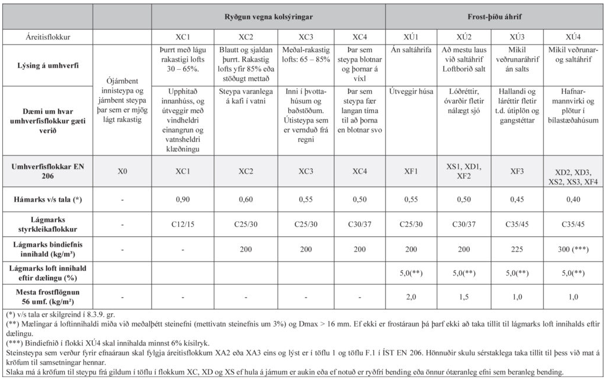

   Kröfur Byggingarreglugerðar

Við skilgreiningu steinsteypu eru jafnframt oft tilgreindir fleiri eiginleikar, svo sem:

* sementsmagn,
* vatns/sements-hlutfall (v/s-tala),
* fjaðurstuðull,
* loftmagn,
* magn íauka,
* þéttleiki,
* og aðrir eiginleikar eftir því sem við á.

Kröfur og staðlar
-----------------

Samsetning og eiginleikar steinsteypu þurfa að uppfylla kröfur gildandi reglna og staðla.

Á Íslandi eru meðal annars stuðst við:

* Byggingarreglugerð.
* Kröfur Vegagerðarinnar fyrir steypumannvirki.

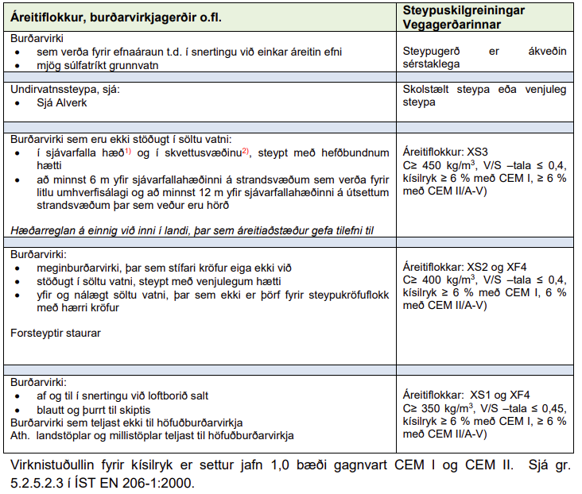

   Kröfur Vegagerðarinnar.

Þessar reglur skilgreina meðal annars kröfur um styrk, endingu, áreitisflokka og önnur gæðaviðmið sem steinsteypa þarf að uppfylla eftir notkunarsviði.

Vinnanleiki steypu
------------------

Steypa þarf að vera nægilega vinnanleg til að hægt sé að blanda hana, flytja, leggja í mót og þétta án þess að aðskilnaður verði í blöndunni.

Vinnanleiki (e. *workability*) er skilgreindur sem sú innri vinna sem þarf til að steypan verði fullpökkuð á notkunarstað.

Góð pökkun hefur veruleg áhrif á eiginleika harðnaðrar steypu. Með aukinni pökkun minnkar holrými í steypunni og þar með batna meðal annars:

* styrkur,
* þéttleiki,
* lekt,
* ending,
* og fleiri eiginleikar.

Því er mikilvægt að velja steypu með vinnanleika sem hentar bæði mannvirkinu og framkvæmdaraðferðinni.

Þættir sem hafa áhrif á vinnanleika
-----------------------------------

Vinnanleiki steypu ræðst af samspili margra efnisþátta.

**Vatn**

* vatnsmagn í steypunni.

**Fylliefni**

* kornaform,
* yfirborðsáferð,
* holrýmd,
* grófleiki,
* kornakúrfa,
* gerð fylliefna.

**Sement**

* grófleiki,
* sementsgerð,
* hlutfall fylliefna og sements.

**Íaukar og íblendiefni**

* kísilryk,
* flugaska,
* slagg,
* kalkfiller,
* loftblendiefni,
* flot- og þjálniefni,
* trefjar.

Rétt samsetning þessara efnisþátta hefur afgerandi áhrif á hversu auðvelt er að leggja steypuna og ná góðri pökkun.

Fullpökkun steypu
-----------------

Til þess að steinsteypa nái þeim styrk og endingu sem ætlast er til þarf hún að pakkast vel í mótið. Við fulla pökkun fyllir steypan öll holrými milli steypustyrktarjárna og móts og loftlokur verða sem fæstar.

Ófullnægjandi pökkun getur leitt til:

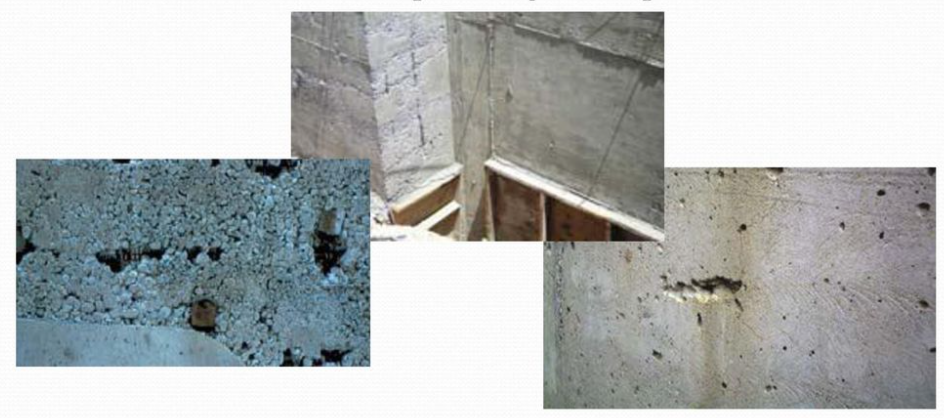

   Dæmi um lélega pökkun.

* aukins holrýmis,
* minni styrks,
* aukinnar lektar,
* lakari endingar,
* óásjálegs yfirborðs.

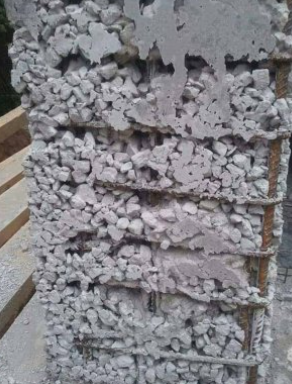

   Dæmi um lélega pökkun.

Steypumót
---------

Steypumót þurfa að vera nægilega sterk og stíf til að standast þrýsting ferskrar steypu án þess að aflagast. Mótin þurfa jafnframt að halda lögun sinni meðan steypan harðnar og tryggja að endanlegur byggingarhluti fái rétt mál og yfirborð.

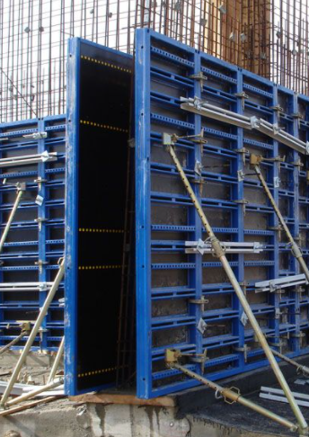

   Dæmi um steypumót.

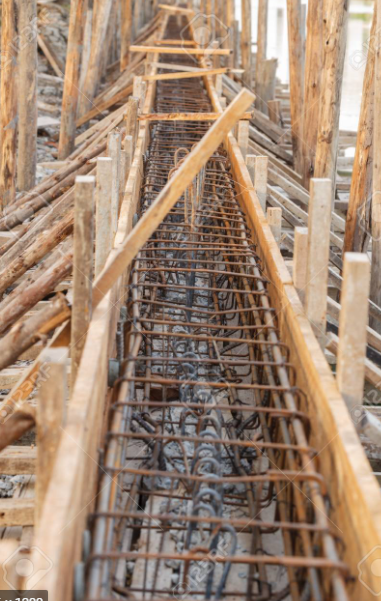

   Dæmi um steypumót.

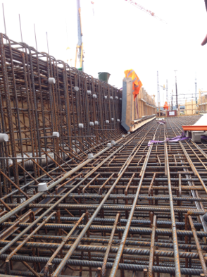

   Dæmi um steypumót.

Víbrun steypu
-------------

Algengasta aðferðin til að þétta steinsteypu er víbrun. Við víbrun minnkar innri núningur steypunnar tímabundið þannig að hún flæðir betur og fyllir holrými í mótinu.

Algengar aðferðir eru:

* stafvíbrator,
* víbrun móta,
* víbrunarborð fyrir forsteypta hluti.

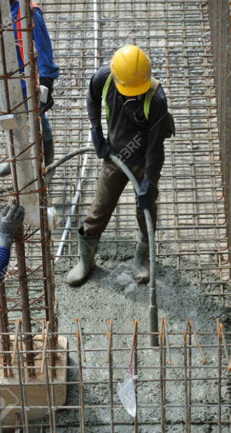

   Víbrun steypu með stafvíbrator.

Rétt framkvæmd víbrun fjarlægir loftlokur og tryggir góða pökkun. Of mikil víbrun getur hins vegar valdið aðskilnaði í steypunni.

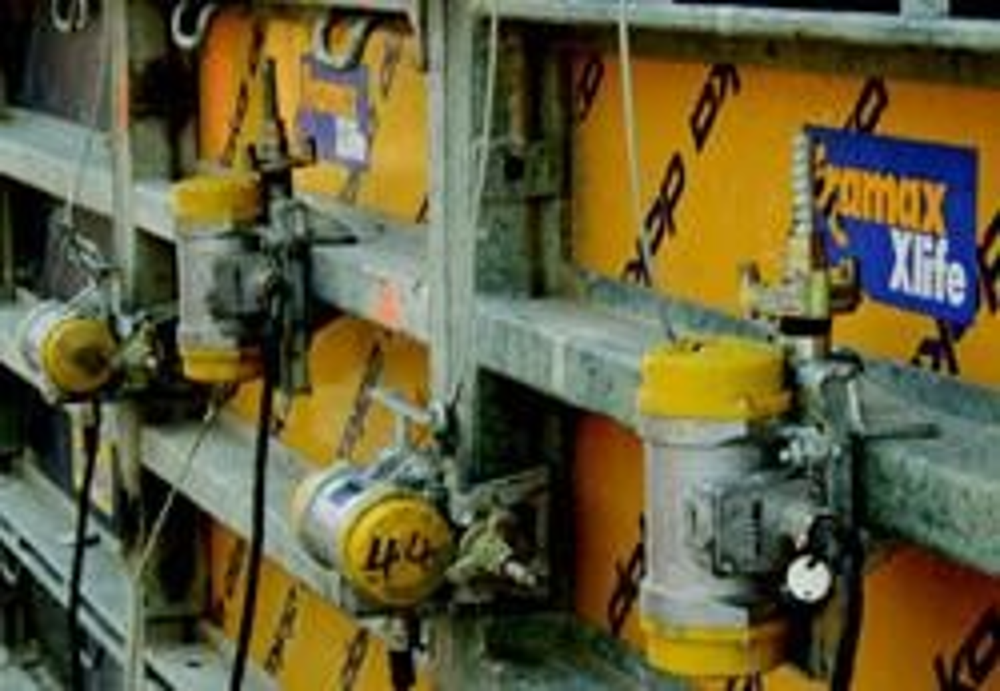

   Víbrun steypu með víbrandi mótum.

Þjálni steypu
-------------

Þjálni lýsir því hversu auðvelt er að vinna með ferska steypu. Hún þarf að vera nægileg til að hægt sé að leggja steypuna og þétta hana, en jafnframt má hún ekki vera svo mikil að hætta sé á aðskilnaði.

Þjálni ræðst meðal annars af:

* vatnsmagni,
* v/s-tölu,
* gerð og magni fylliefna,
* sementsmagni,
* notkun flotefna og annarra íblendiefna.

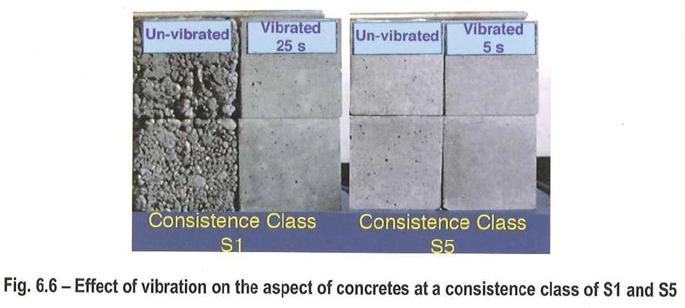

   Dæmi um mismunandi þjálni steypu.

Mæling á þjálni
---------------

Þjálni steinsteypu er metin með stöðluðum prófunum sem gefa vísbendingu um hversu auðvelt er að leggja og þétta steypuna. Algengasta prófið er sigmálsprófið (*slump test*), sem er einfalt í framkvæmd og mikið notað við gæðaeftirlit á byggingarstað.

Sigmálspróf
-----------

Algengasta aðferðin til að meta þjálni steinsteypu er sigmálspróf (*slump test*).

Framkvæmd prófsins er í meginatriðum eftirfarandi:

1. Sigmálskeilan er sett á sléttan og stífan flöt.
2. Keilan er fyllt í þremur lögum.
3. Hvert lag er stappað 25 sinnum með staðlaðri 16 mm stöng.
4. Umframsteypa er fjarlægð þannig að keilan verði sléttfull.
5. Keilunni er lyft lóðrétt upp.
6. Sig steypunnar er mælt og gefur sigmálið til kynna þjálni hennar.

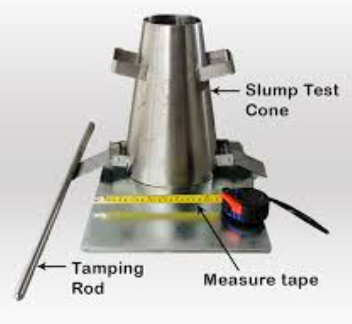

   Sigmálskeila.

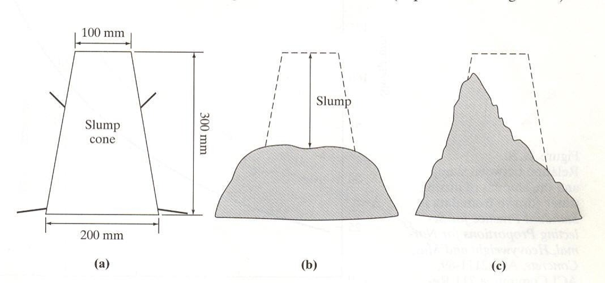

   Framkvæmd sigmálsprófs.

Túlkun sigmáls
--------------

Sigmálið gefur vísbendingu um vinnanleika steypunnar.

* Lítið sigmál bendir til stífrar steypu sem getur verið erfið í niðurlögn og pökkun.
* Mikið sigmál bendir til fljótandi steypu sem auðveldara er að leggja, en of hátt sigmál getur aukið hættu á aðskilnaði og vatnsblæðingu.

Sigmálið eitt og sér segir þó ekki allt um gæði steypunnar og verður ávallt að meta í samhengi við samsetningu hennar og fyrirhugaða notkun.

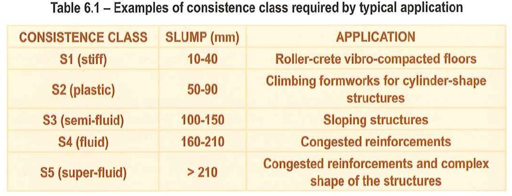

   Niðurstöður úr sigmálsprófi.

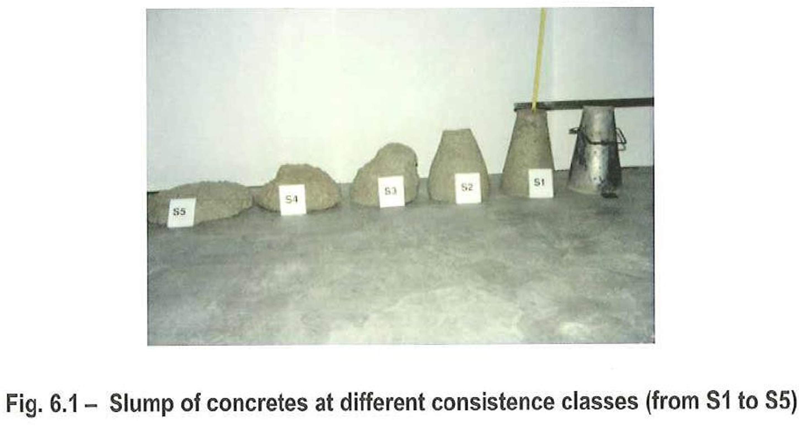

   Dæmi um steypu með mismunandi sigmál.

Áhrif vatnsinnihalds
--------------------

Vatnsmagn hefur mjög mikil áhrif á sigmál steypunnar. Þegar vatnsmagn eykst verður steypan almennt vinnanlegri og sigmálið hækkar.

Hins vegar hefur aukið vatnsmagn einnig áhrif á aðra eiginleika steypunnar, meðal annars:

* hærri v/s-tölu,
* minni styrk,
* meiri lekt,
* lakari endingu.

Því þarf að velja vatnsmagn þannig að jafnvægi náist milli góðs vinnanleika og æskilegra eiginleika harðnaðrar steypu.

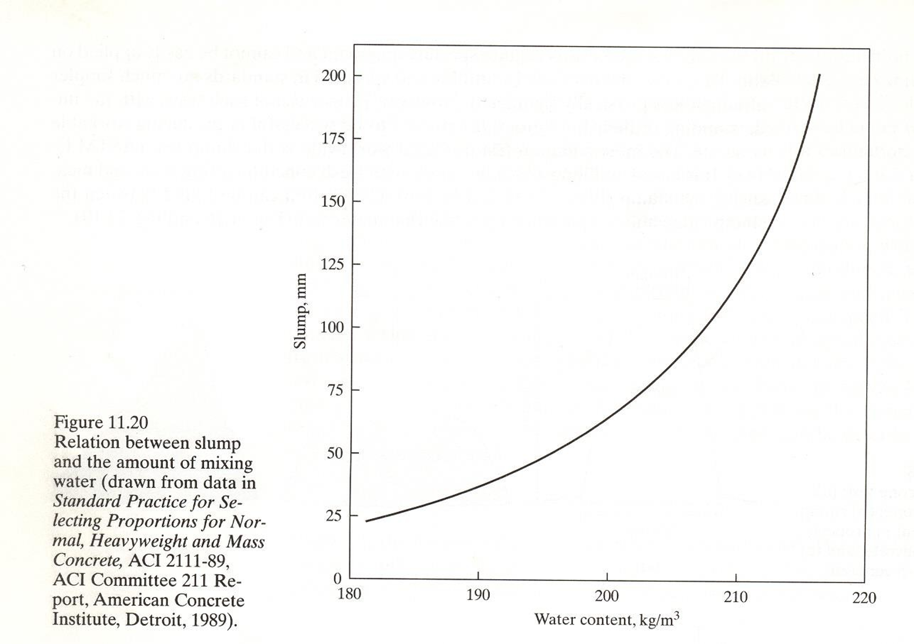

   Tengsl vatnsinnihalds og sigmáls.

Þjálnitap með tíma
------------------

Þjálni steypu helst ekki óbreytt eftir blöndun. Með tímanum minnkar vinnanleikinn og sigmálið lækkar. Þetta er nefnt **þjálnitap** (*slump loss*).

Helstu ástæður þjálnitaps eru:

* hvörfun sements hefst,
* vatn bindst í sementsefjunni,
* uppgufun vatns,
* áhrif hitastigs og umhverfisaðstæðna.

Þegar flutningur eða niðurlögn tekur langan tíma þarf að taka tillit til þjálnitaps við hönnun steypublöndunnar.

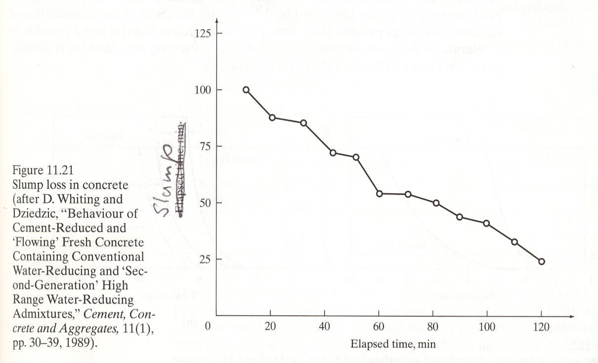

   Þjálnitap steypu með tíma.

Aðskilnaður steypu
------------------

Við flutning, niðurlögn og þéttingu steypu er mikilvægt að blandan haldist einsleit. Ef einstakir efnisþættir skiljast að verður samsetning steypunnar ójöfn, sem getur haft neikvæð áhrif á bæði vinnanleika og eiginleika harðnaðrar steypu.

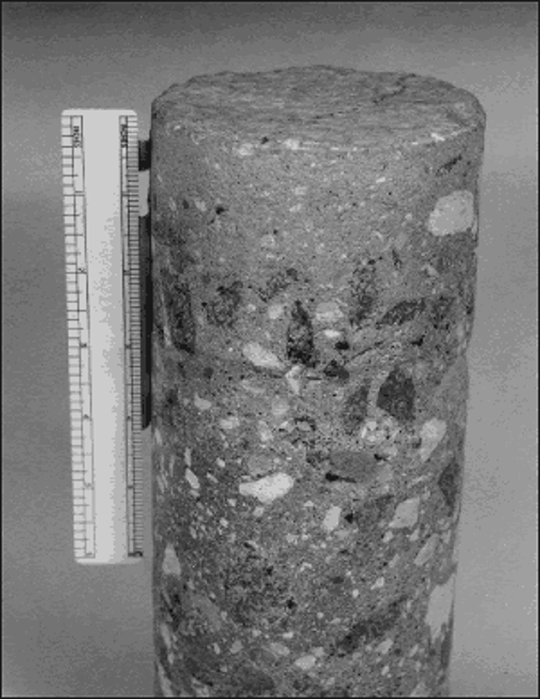

   Aðskilnaður í steypusýni.

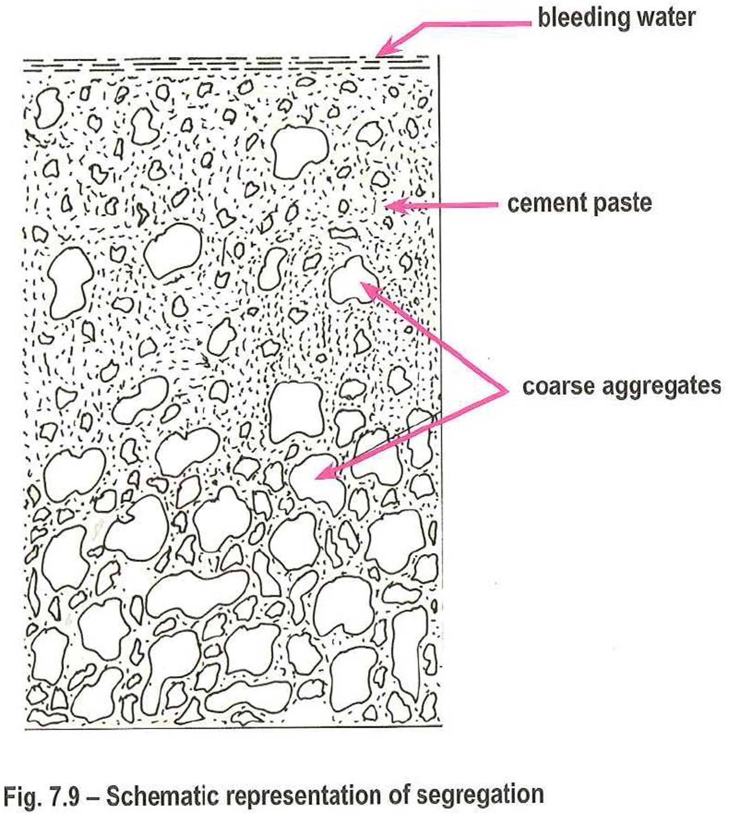

   Skissa af aðskilnaði.

Aðskilnaður (*segregation*) getur orðið með tveimur meginhætti:

* gróf fylliefni setjast til botns vegna þess að þau eru þyngri en sementsefjan,
* sementsefjan og vatnið leita upp á yfirborðið.

Fyrri gerðin verður helst í rýrum steypublöndum með litlu sementsmagni, en sú síðari getur komið fram þegar steypan er of þunnfljótandi.

Afleiðingar aðskilnaðar geta meðal annars verið:

* ójöfn dreifing fylliefna,
* lakari styrkur,
* aukin holrýmd,
* verri ending,
* ójafnt yfirborð steypunnar.

Vatnsblæðing
------------

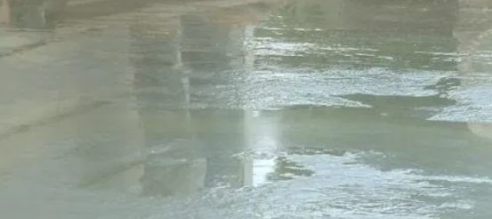

   Vatnsblæðing á yfirborði ferskrar steinsteypu.

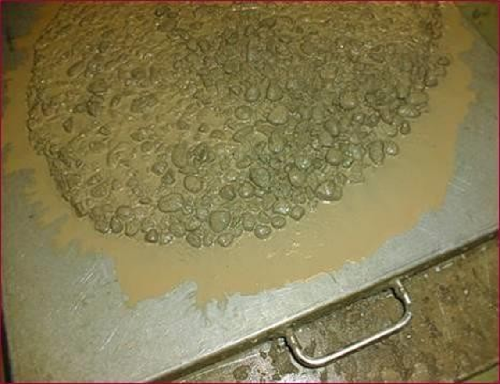

   Vatnsblæðing.

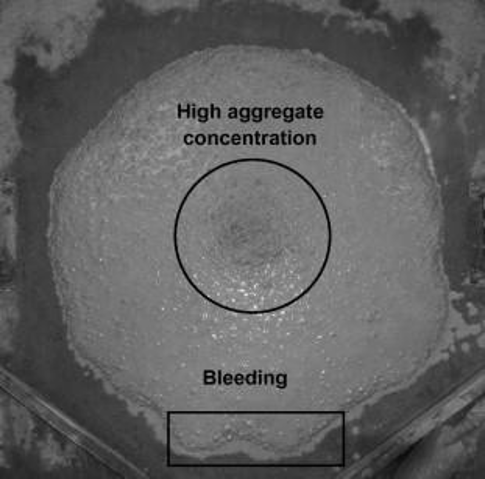

   Vatnsblæðing.

Vatnsblæðing (*bleeding*) er sérstök tegund aðskilnaðar þar sem vatn skilur sig frá steypublöndunni og safnast á yfirborði hennar.

Þetta gerist þegar föstu efnin í steypunni geta ekki bundið allt blendivatnið. Vatnið leitar þá upp á yfirborðið þar til steypan hefur náð nægilegum storknun.

Vatnsblæðing getur haft ýmsar óæskilegar afleiðingar, svo sem:

* veikara yfirborð,
* aukna hættu á sprungum,
* lakari viðloðun milli steypulaga,
* aukna lekt.

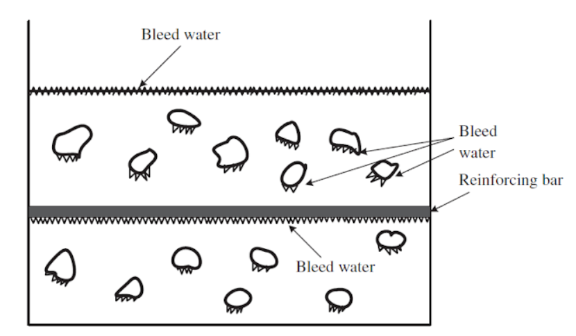

   Vatnsblæðing undir járnum og fylliefnum.

Þættir sem hafa áhrif á vatnsblæðingu
-------------------------------------

Vatnsblæðing verður minni þegar steypan hefur meiri getu til að halda vatninu bundnu í sementsefjunni.

Meðal þátta sem draga úr vatnsblæðingu eru:

* fínmalað sement,
* hátt alkalímagn í sementi,
* hátt hlutfall C₃A í sementinu,
* notkun hvörfunarflýtis, svo sem calcium chloride,
* aukið sementsmagn,
* notkun pozzolana, til dæmis flugösku,
* loftblendi.

Þessir þættir hafa þó einnig áhrif á aðra eiginleika bæði ferskrar og harðnaðrar steypu og þarf því að velja samsetningu steypunnar með hliðsjón af öllum kröfum til mannvirkisins.

Kröfur um pökkun steypu við bendistál
------------------------------------

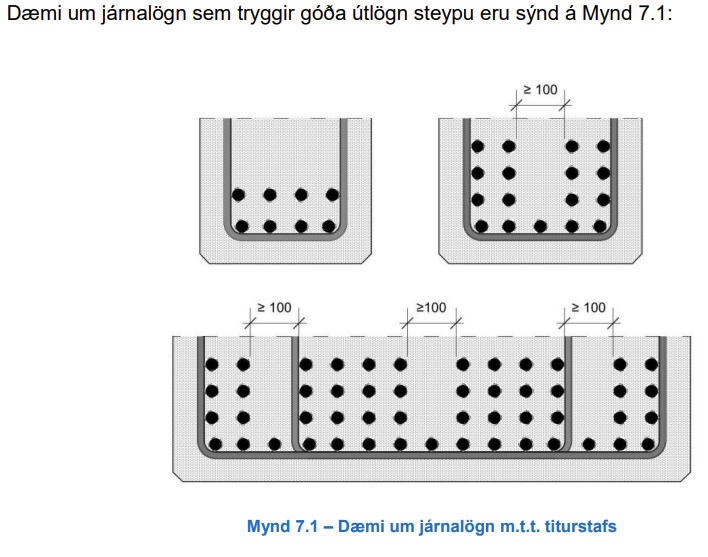

   Bil milli bendistáls, úr leiðbeiningum Vegagerðarinnar.

Við hönnun járnbentrar steinsteypu þarf að tryggja að ferska steypan geti flætt á milli bendistáls og fyllt mótið án þess að myndast holrými.

Ef of lítið bil er milli stanga getur steypan átt erfitt með að komast á milli þeirra. Afleiðingin getur verið:

* ófullnægjandi pökkun,
* aukið holrými,
* minni ending,
* lakari viðloðun milli steypu og bendistáls.

Bæði Eurocode og Vegagerðin setja því fram kröfur um lágmarksfjarlægðir milli bendistáls með hliðsjón af meðal annars:

* þvermáli bendistáls,
* hámarks kornastærð fylliefna,
* möguleikum til fullnægjandi víbrunar.

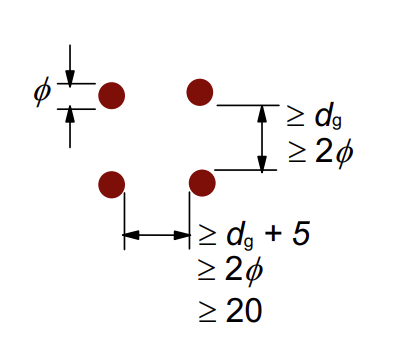

   Kröfur um bil milli bendistáls samkvæmt Evrópustöðlum.

Steypuhula
----------

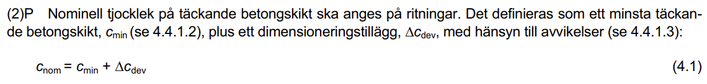

   Steypuhula.

Steypuhula er minnsta fjarlægð frá yfirborði steypunnar að ysta bendistáli.

Megintilgangur steypuhulu er að:

* verja bendistálið gegn tæringu,
* tryggja nægilegt brunavarnir,
* stuðla að góðri viðloðun milli steypu og bendistáls,
* tryggja endingu mannvirkisins.

Samkvæmt Eurocode 2 ræðst lágmarks steypuhula meðal annars af:

* áreitisflokki,
* þvermáli bendistáls,
* hámarks kornastærð fylliefna,
* framkvæmdarvikmörkum.

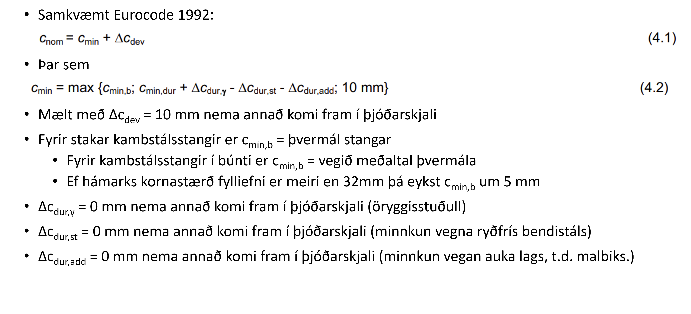

   Skýring á steypuhulu.

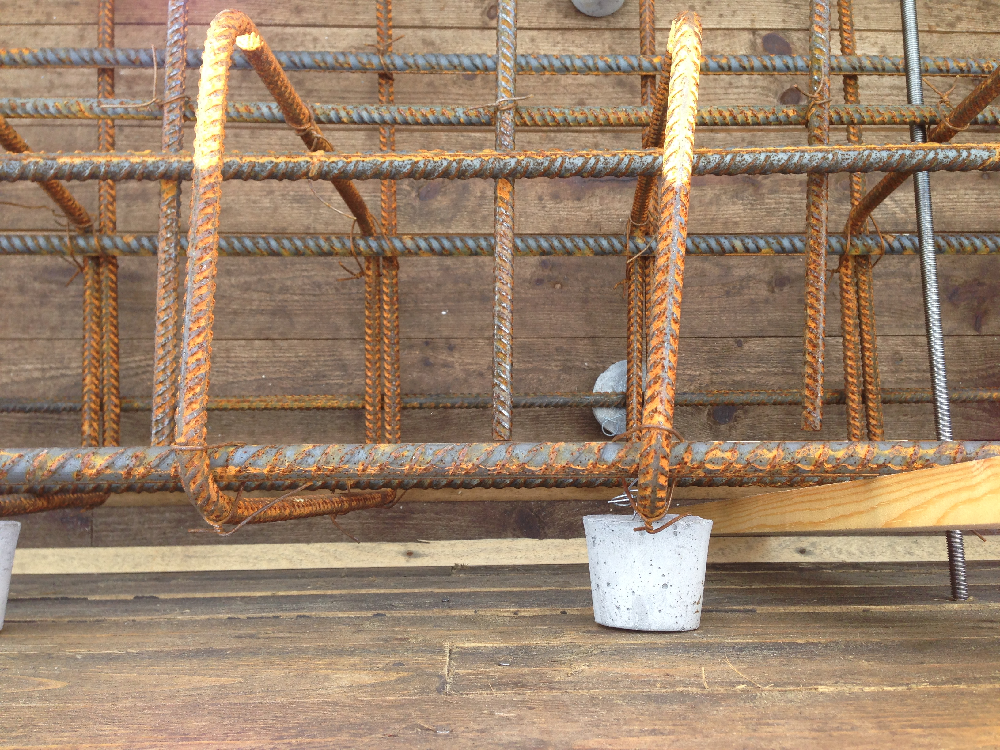

   Dæmi um steypuhulu í byggingarhluta.

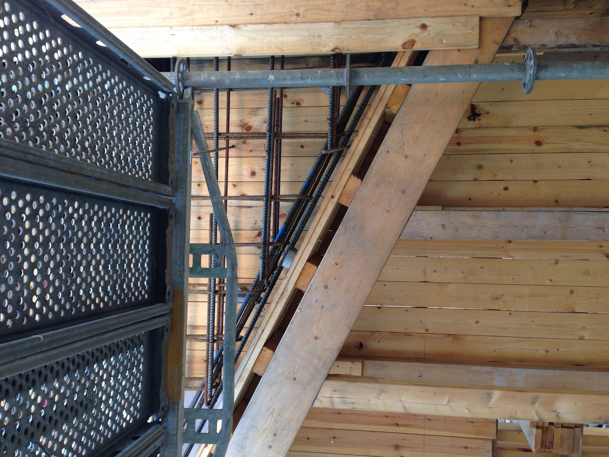

   Dæmi um steypuhulu í byggingarhluta.

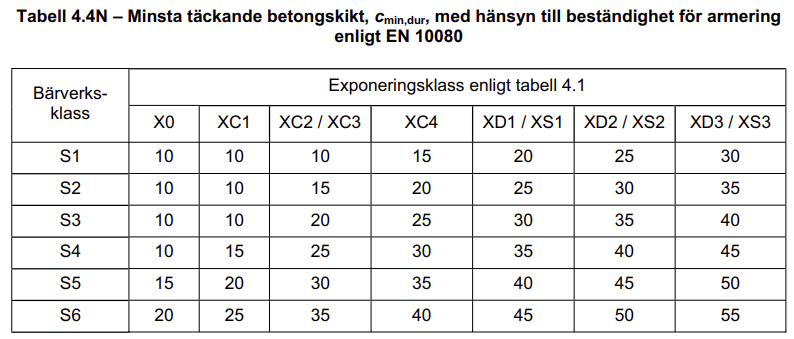

   Minnsta steypuhula.

Styrkur steinsteypu
-------------------

Steinsteypa hefur mjög mismunandi eiginleika í þrýstingi og togi.

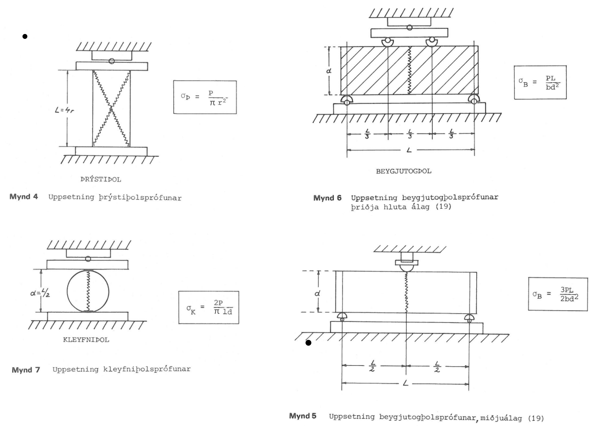

   Þrýsti-, tog- og beygjuþol steinsteypu.

Helstu styrkleikaeiginleikar eru:

* þrýstiþol,
* togþol,
* beygjuþol.

Þrýstiþolið er langmikilvægasti hönnunarþátturinn og er það yfirleitt notað til flokkunar steinsteypu.

Togþol steypu er hins vegar aðeins lítið brot af þrýstiþolinu og því er bendistál notað til að taka við togkröftum í járnbentri steinsteypu.

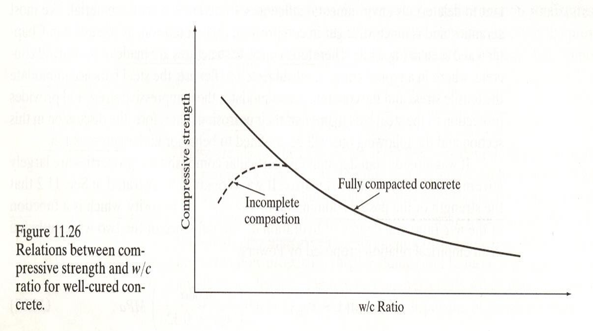

   Þrýstiþol sem fall af vatnssementstölu.

Samband þrýstiþols og togþols
-----------------------------

Þegar þrýstiþol steinsteypu eykst hækkar togþolið einnig, en hlutfallslega hægar.

Því verður hlutfall togþols af þrýstiþoli lægra eftir því sem steypan verður sterkari.

.. table:: Dæmigert samband þrýstiþols og togþols.

   +------------------+---------------+----------------+
   | fck [MPa]        | fctm [MPa]    | fctm/fck [%]   |
   +==================+===============+================+
   | 12               | 1,6           | 13             |
   +------------------+---------------+----------------+
   | 16               | 1,9           | 12             |
   +------------------+---------------+----------------+
   | 20               | 2,2           | 11             |
   +------------------+---------------+----------------+
   | 25               | 2,6           | 10             |
   +------------------+---------------+----------------+
   | 30               | 2,9           | 10             |
   +------------------+---------------+----------------+
   | 35               | 3,2           | 9              |
   +------------------+---------------+----------------+
   | 40               | 3,5           | 9              |
   +------------------+---------------+----------------+
   | 45               | 3,8           | 8              |
   +------------------+---------------+----------------+
   | 50               | 4,1           | 8              |
   +------------------+---------------+----------------+

Þessar niðurstöður sýna að steinsteypa er mjög sterk í þrýstingi en tiltölulega veik í tog. Því er togstyrkurinn yfirleitt tryggður með bendistáli í burðarvirkjum.

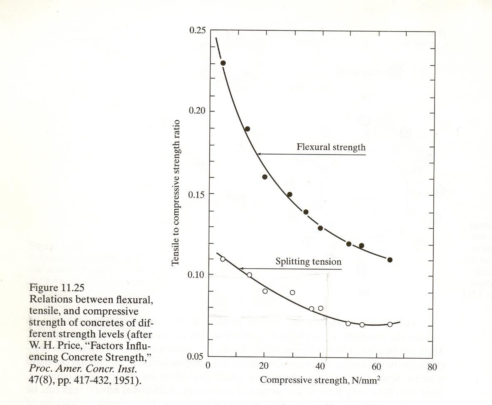

   Hlutfall togþols af þrýstiþoli sem fall af þrýstiþoli.

.. Styrkur steinsteypu ræðst af fjölmörgum þáttum, meðal annars samsetningu steypunnar, þéttingu hennar, aðhlúun og aldri. Þótt þrýstiþol sé oft notað sem helsti mælikvarði á gæði steinsteypu hafa aðrir vélrænir eiginleikar einnig mikla þýðingu við hönnun mannvirkja.

Áhrif víbrunar á þrýstiþol
~~~~~~~~~~~~~~~~~~~~~~~~~~

Rétt víbrun tryggir að steypan pakkist vel og loftlokur fjarlægist. Því meiri sem holrýmd steypunnar er, þeim mun lægra verður þrýstiþol hennar.

Ófullnægjandi víbrun getur því leitt til:

* minni styrks,
* meiri lektar,
* lakari endingar.

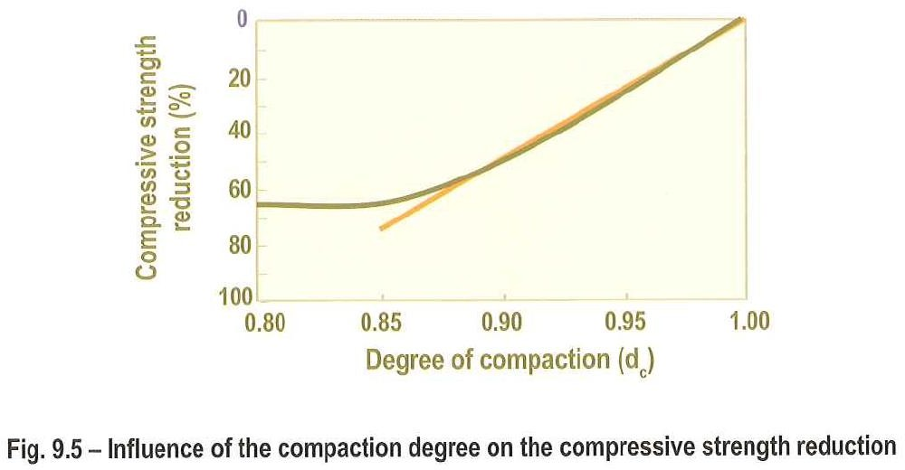

   Áhrif víbrunar á þrýstiþol steinsteypu.

Áhrif vatns/sements-hlutfalls
~~~~~~~~~~~~~~~~~~~~~~~~~~~~~

Vatns/sements-hlutfallið (v/s-talan) hefur afgerandi áhrif á styrk steinsteypu.

Lág v/s-tala leiðir almennt til:

* meiri styrks,
* minni gljúpleika,
* betri endingu.

Of lág v/s-tala getur þó gert steypuna erfiða í vinnslu ef ekki eru notuð hentug íblendiefni.

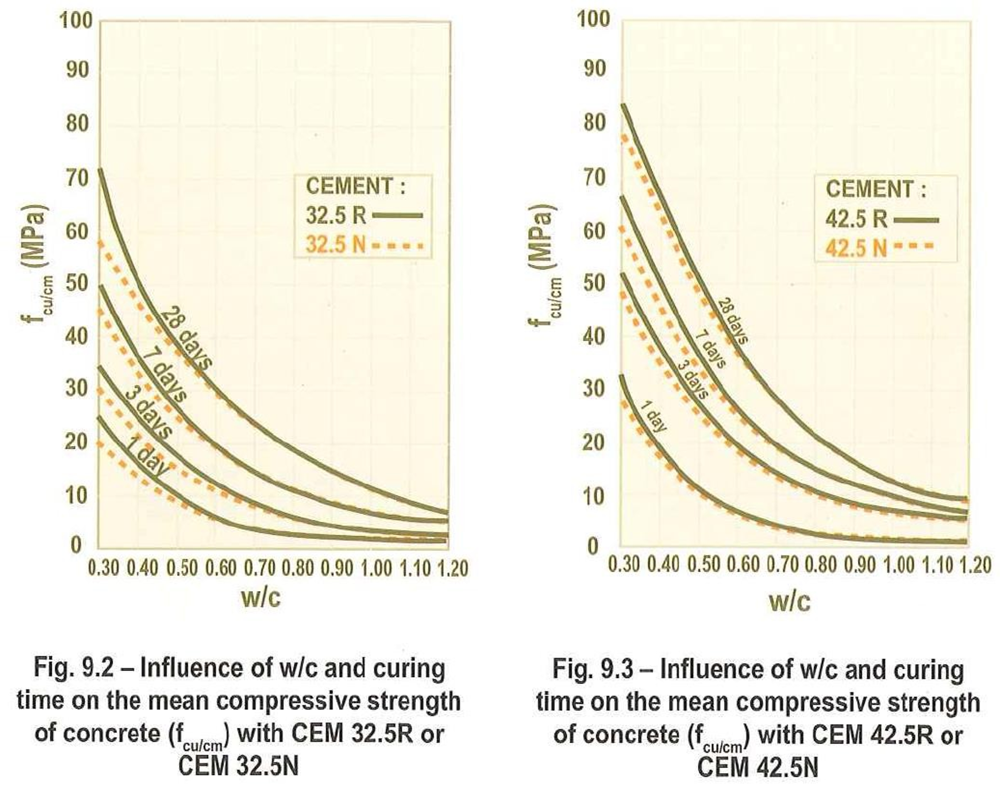

   Samband v/s-tölu og þrýstiþols.

Áhrif loftblendis
~~~~~~~~~~~~~~~~~

Loftblendi er einkum notað til að bæta frostþol steinsteypu. Loftbólurnar sem myndast auðvelda vatni að þenjast út við frost.

Á móti kemur að aukið loftmagn leiðir almennt til lægra þrýstiþols.

Við hönnun steypu þarf því að finna jafnvægi milli endingarkrafna og styrks.

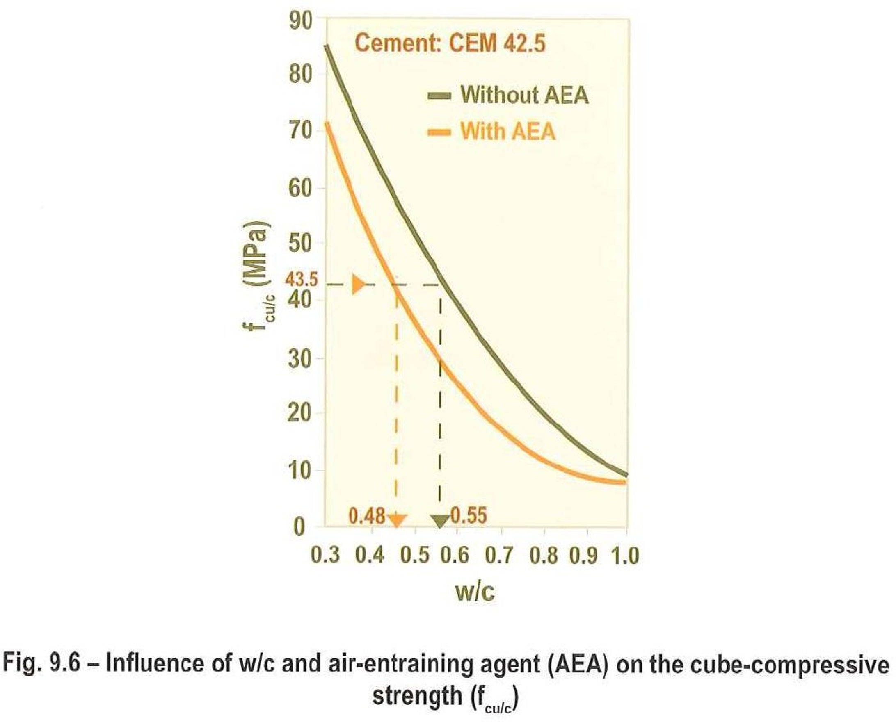

   Áhrif loftmagns á þrýstiþol.

Áhrif hitastigs og aðhlúunar
~~~~~~~~~~~~~~~~~~~~~~~~~~~~

Þróun styrks steinsteypu ræðst af hvörfun sements við vatn.

Hitastig og rakaskilyrði við aðhlúun hafa mikil áhrif á hraða hvörfunarinnar og þar með styrkþróun steypunnar.

Rétt aðhlúun:

* stuðlar að meiri lokastyrk,
* dregur úr hættu á sprungum,
* bætir endingu mannvirkisins.

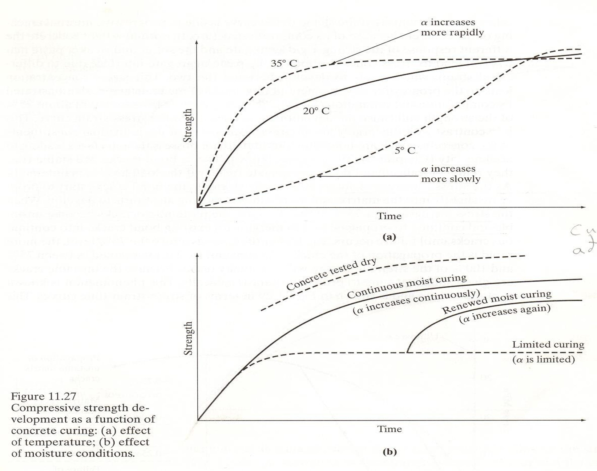

   Áhrif hitastigs og aðhlúunar á styrk.

Spennu–streituferill
~~~~~~~~~~~~~~~~~~~~

Steinsteypa hagar sér ekki eins og fullkomlega teygjanlegt efni.

Við þrýstiálag verður fyrst nær línulegt samband milli spennu og streitu. Þegar álagið eykst fer efnið að sýna ólínulega hegðun þar til hámarksstyrk er náð og brot verður.

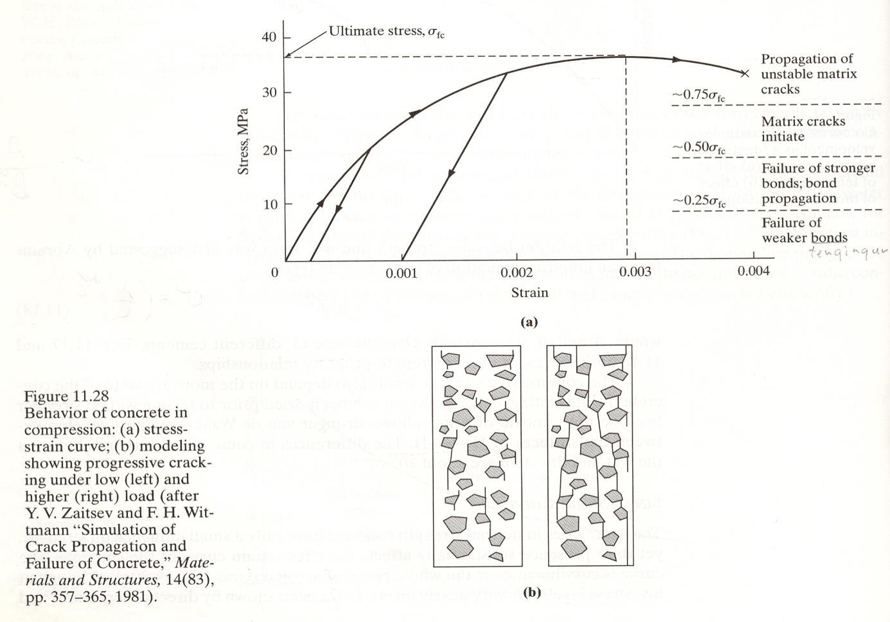

   Dæmigerður spennu–streituferill steinsteypu.

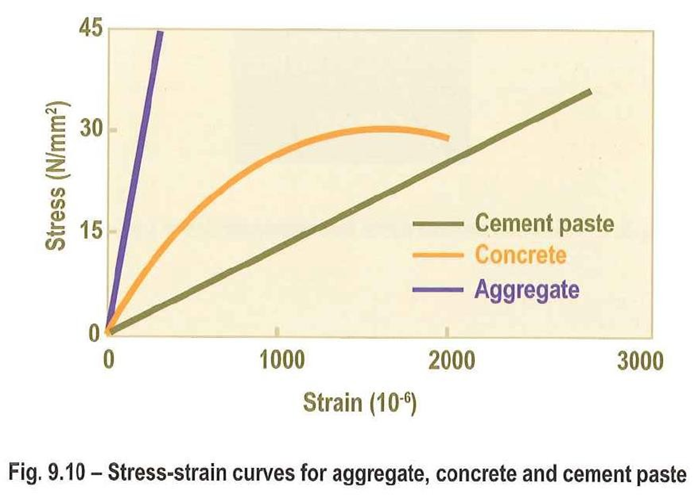

   Spennustreituferill mismunandi hlutefna í steinsteypu.

Áhrif álagshraða
~~~~~~~~~~~~~~~~

Mældur styrkur steinsteypu ræðst einnig af því hversu hratt álag er aukið.

Við hraðara álag mælist styrkur yfirleitt hærri en við hæga álagsaukningu. Þetta þarf að hafa í huga við túlkun prófaniðurstaðna og samanburð á mismunandi rannsóknum.

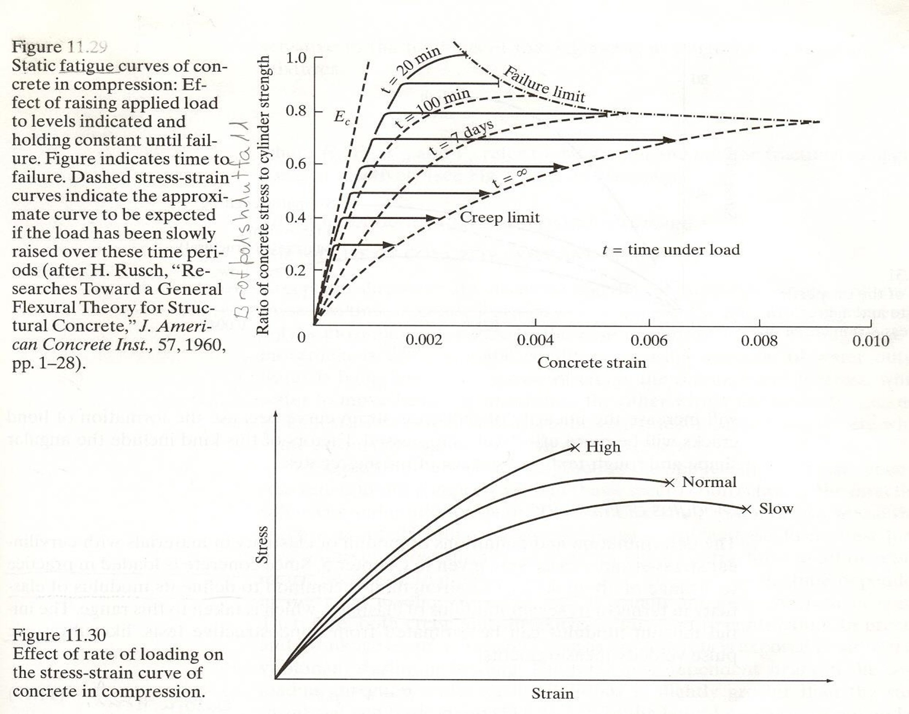

   Áhrif álagshraða á styrk steinsteypu.

Mismunandi styrkur steypu
~~~~~~~~~~~~~~~~~~~~~~~~~

Styrkur steinsteypu getur verið mismunandi eftir:

* gerð steypunnar,
* aldri,
* rakastigi,
* prófunaraðferð,
* stærð sýna,
* og álagsstefnu.

Því er mikilvægt að bera einungis saman niðurstöður sem fengnar eru með sambærilegum prófunaraðferðum.

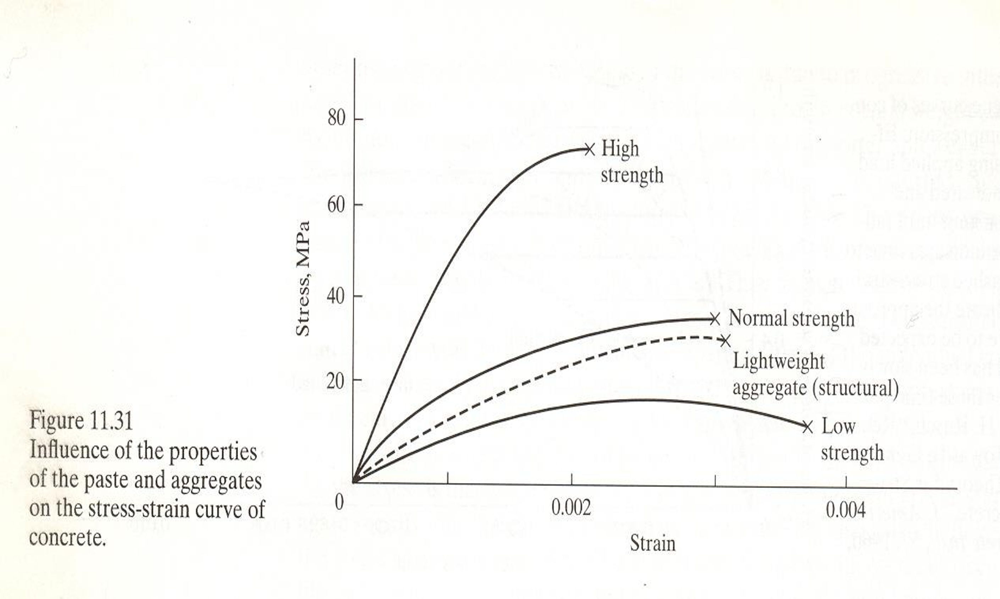

   Mismunandi styrkur steinsteypu.

Fjaðurstuðull steinsteypu
-------------------------

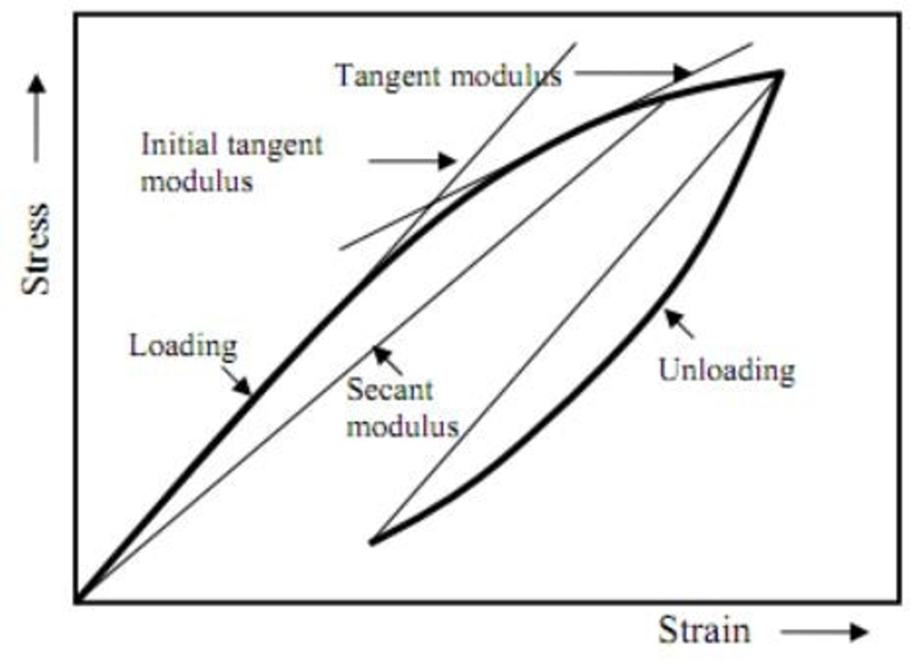

   Fjaðurstuðull steinsteypu.

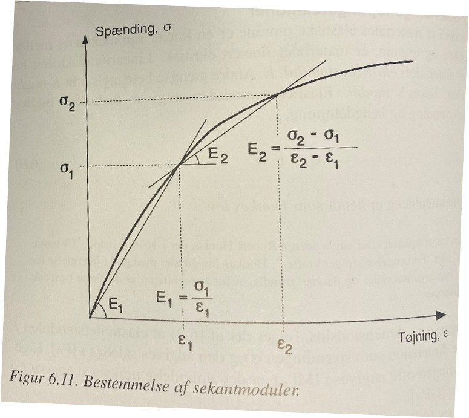

   Fjaðurstuðull steinsteypu.

Fjaðurstuðull (*elastic modulus*) lýsir stífni steinsteypu og gefur til kynna hversu mikið efnið aflagast við tiltekið álag. Þar sem steinsteypa hegðar sér ekki sem fullkomlega fjaðrandi efni er ekki til einn ótvíræður fjaðurstuðull sem lýsir efninu við allar aðstæður.

Mismunandi aðferðir eru notaðar til að ákvarða fjaðurstuðul steinsteypu, meðal annars:

* statískur fjaðurstuðull,
* upphafssnertilína (*initial tangent modulus*),
* snertilína (*tangent modulus*),
* strenglína (*secant modulus*),
* dýnamískur fjaðurstuðull.

Statískur fjaðurstuðull er ákvarðaður út frá mældum aflögunum við stigvaxandi álag. Dýnamískur fjaðurstuðull er hins vegar metinn út frá útbreiðsluhraða hljóð- eða titringsbylgna í steypunni eða með mælingum á eigintíðni sýnis.

Dýnamískur fjaðurstuðull
~~~~~~~~~~~~~~~~~~~~~~~~

Dýnamískur fjaðurstuðull er oft notaður við ástandsmat steinsteypu þar sem hægt er að framkvæma mælingar án þess að skemma mannvirkið.

Breytingar á dýnamískum fjaðurstuðli geta gefið vísbendingar um:

* þróun hörðnunar,
* skemmdir,
* sprungumyndun,
* eða aðrar breytingar á innri byggingu steypunnar.

Þættir sem hafa áhrif á fjaðurstuðul
~~~~~~~~~~~~~~~~~~~~~~~~~~~~~~~~~~~~

Fjaðurstuðull steinsteypu ræðst af samspili margra þátta.

Helstu áhrifavaldar eru:

* rakastig steypunnar,
* gerð og stífni fylliefna,
* magn sementsefju,
* aldur steypunnar,
* hvörfunargráða sements.

Almennt hafa fylliefni með háan fjaðurstuðul afgerandi áhrif á stífni steypunnar, þar sem fylliefnin mynda stærstan hluta rúmmáls hennar.

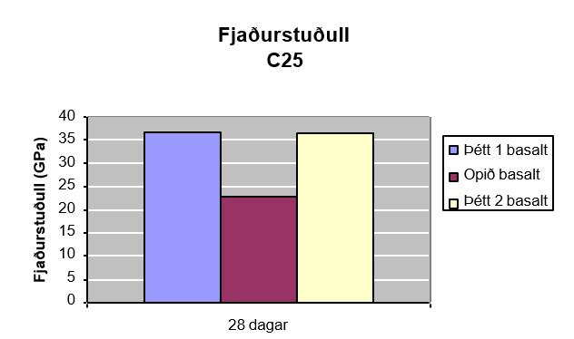

   Þættir sem hafa áhrif á fjaðurstuðull steinsteypu.

Skrið steinsteypu
-----------------

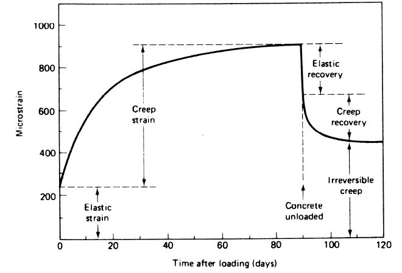

   Skrið steinsteypu.

Skrið (*creep*) er sú formbreyting sem verður í steinsteypu þegar stöðugu álagi er haldið á efninu yfir langan tíma.

Þótt álagið haldist óbreytt heldur steypan áfram að aflagast. Skrið er því tímaháður eiginleiki sem þarf að taka tillit til við hönnun mannvirkja.

Heildarformbreytingar
~~~~~~~~~~~~~~~~~~~~~

Þegar steypa er undir stöðugu álagi verða formbreytingarnar ekki eingöngu vegna skriðs.

Heildarformbreytinguna má skipta í:

* tafarlausa fjaðurteygju,
* skrið,
* þurrkrýrnun,
* þrútnun vegna vatnsupptöku,
* hitaformbreytingar.

Við rannsóknir á skriði þarf því að mæla áhrif þessara þátta sérstaklega svo hægt sé að einangra raunverulegt skrið.

Þættir sem hafa áhrif á skrið
~~~~~~~~~~~~~~~~~~~~~~~~~~~~~

Skrið á sér stað í sementsefjunni en fylliefnin takmarka formbreytingarnar.

Helstu þættir sem hafa áhrif á skrið eru:

* magn og gerð fylliefna,
* fjaðurstuðull fylliefna,
* aldur steypunnar,
* hvörfunargráða sements,
* hlutfallsraki umhverfis,
* aldur steypunnar þegar álag er sett á.

Almennt gildir að:

* stíf fylliefni draga úr skriði,
* meira magn fylliefna dregur úr skriði,
* eldri steypa skríður minna,
* hærri loftraki dregur úr skriði.

Áhrif einstakra þátta á skrið
~~~~~~~~~~~~~~~~~~~~~~~~~~~~~

Í rannsóknum á skriði eru meðal annars skoðuð áhrif:

* gerðar fylliefna,
* loftraka,
* þess hvenær álag er sett á steypuna,
* vatns/sements-hlutfalls.

Þessir þættir hafa allir áhrif á stærð og þróun skriðs með tíma.

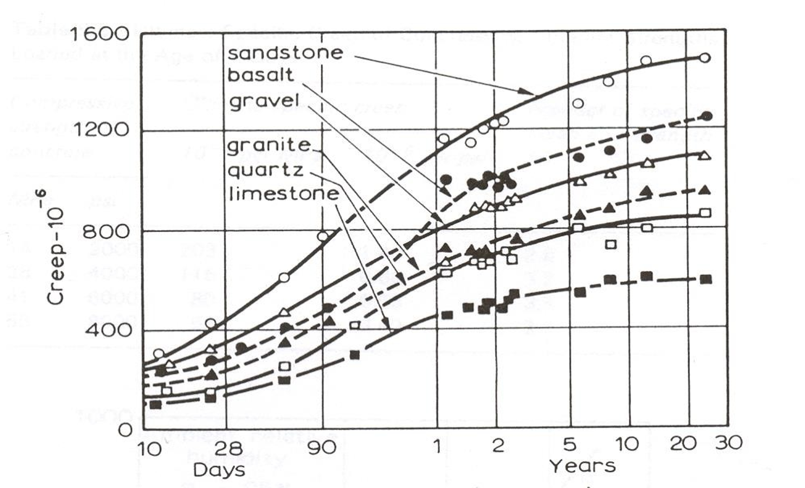

   Áhrif fylliefna á skrið steinsteypu.

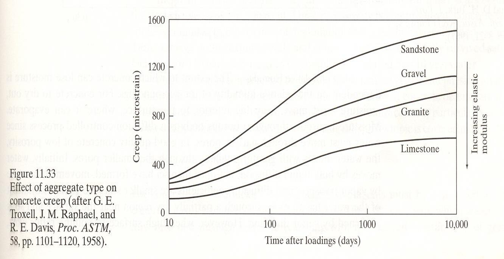

   Áhrif fylliefna á skrið steinsteypu.

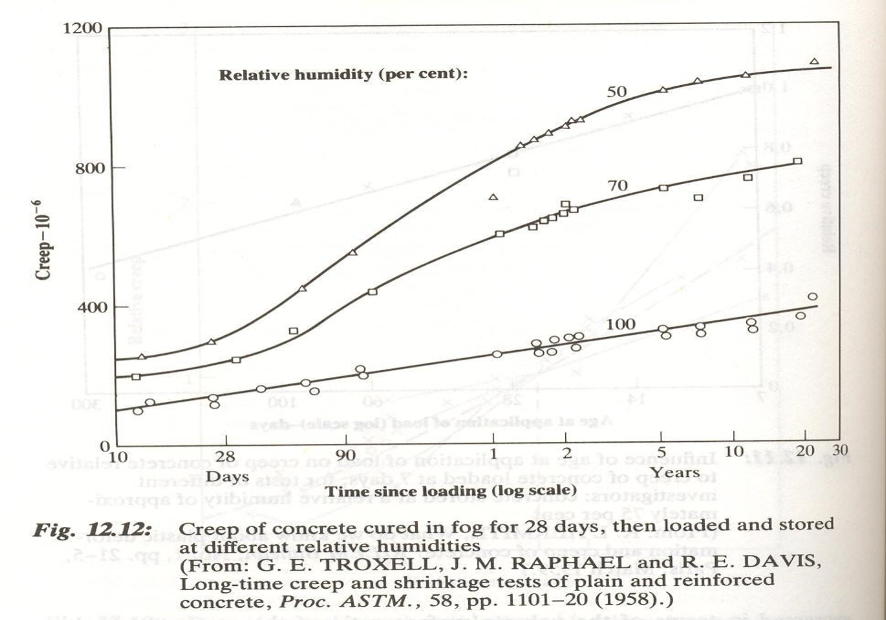

   Áhrif loftraka á skrið steinsteypu.

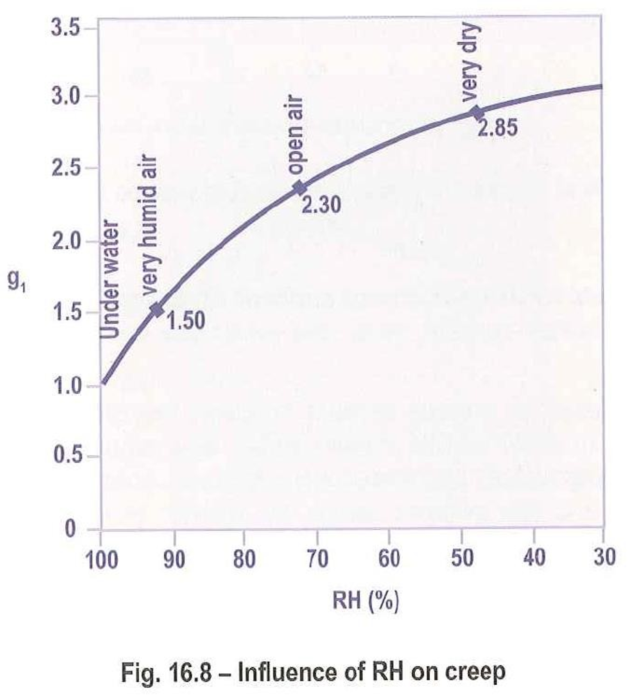

   Áhrif loftraka á skrið steinsteypu.

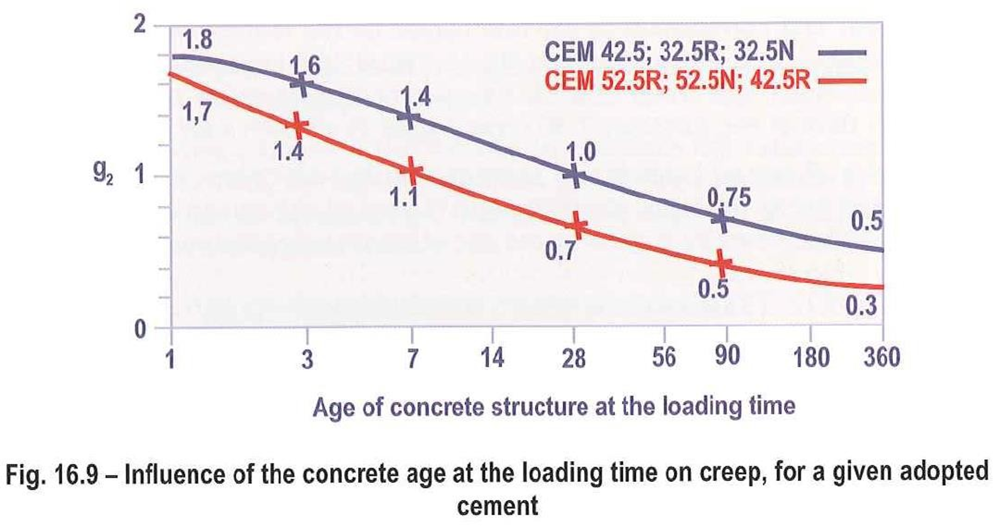

   Áhrif hvenær álag er sett á.

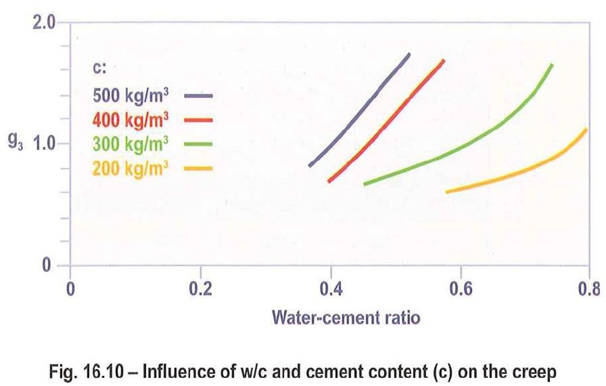

   Áhrif v/s tölu á skrid.

Þróun skriðs með tíma
~~~~~~~~~~~~~~~~~~~~~

Skrið heldur áfram í langan tíma eftir að steypan hefur náð meginhluta styrks síns. Hraði skriðsins er mestur fyrst eftir álagningu en minnkar smám saman með tímanum.

Sem nálgun má gera ráð fyrir að:

* um 25 % af 20 ára skriði komi fram á fyrstu tveimur vikunum,
* um 50 % komi fram á fyrstu þremur mánuðunum,
* um 75 % komi fram á fyrsta árinu.

Þótt skrið haldi áfram í áratugi verður aukning þess sífellt minni eftir því sem tíminn líður.

Rýrnun steinsteypu
------------------

Rýrnun (*shrinkage*) er formbreyting sem verður í steinsteypu án þess að utanaðkomandi álag sé lagt á hana. Rýrnun stafar einkum af breytingum á rakainnihaldi steypunnar og þeim efnahvörfum sem eiga sér stað við hörðnun sements.

Ef togspennur sem myndast vegna rýrnunar verða meiri en togþol steypunnar getur sprungumyndun átt sér stað.

Rýrnun steinsteypu má almennt skipta í:

* plastíska rýrnun,
* þurrkrýrnun,
* sjálfútþornunarrýrnun.

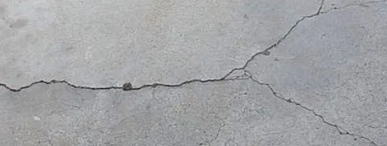

   Spurngur vegna rýrnunar.

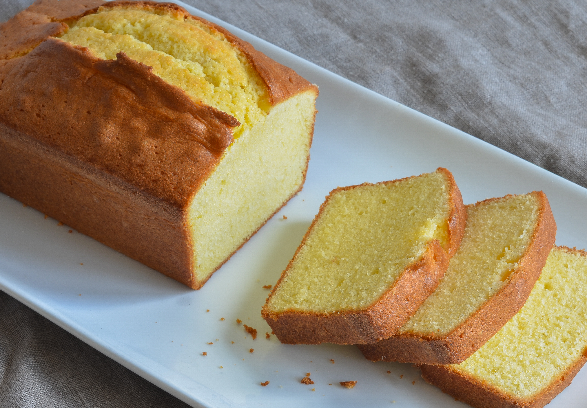

   Samanburður, sprungur í steypu og bakstri.

Plastísk rýrnun
~~~~~~~~~~~~~~~

Plastísk rýrnun á sér stað meðan steypan er enn fersk og hefur ekki náð umtalsverðum styrk. Hún verður þegar vatn gufar hratt upp af yfirborði steypunnar áður en hún hefur storknað.

Afleiðingin getur verið stórar sprungur sem myndast bæði á yfirborði og innan steypunnar, sérstaklega í nágrenni fylliefna.

Helstu áhrifavaldar eru:

* hitastig umhverfis,
* hitastig steypunnar,
* vindhraði,
* hlutfallsraki lofts.

Plastíska rýrnun má draga úr með:

* góðri vökvun,
* plastyfirbreiðslu,
* steypuþekjum.

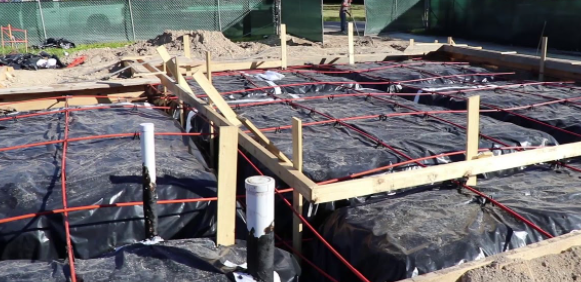

    Varnir gegn rýrnun.

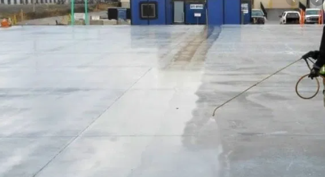

    Vökva steypu sem vörn gegn rýrnun.

Þurrkrýrnun
~~~~~~~~~~~

Þurrkrýrnun verður eftir að steypan hefur storknað og hörðnun hafist. Þegar vatn gufar úr háræðakerfi steypunnar myndast undirþrýstingur sem veldur samdrætti efnisins.

Þurrkrýrnun er mest fyrstu mánuðina eftir steypingu en heldur áfram að þróast með minnkandi hraða í langan tíma.

Helstu áhrifavaldar eru:

* hitastig,
* vindhraði,
* hlutfallsraki lofts,
* hitastig steypunnar.

Hægt er að draga úr þurrkrýrnun með:

* góðri aðhlúun,
* vökvun,
* plastyfirbreiðslu,
* steypuþekjum,
* rýrnunarvörum.

Sjálfútþornunarrýrnun
~~~~~~~~~~~~~~~~~~~~~

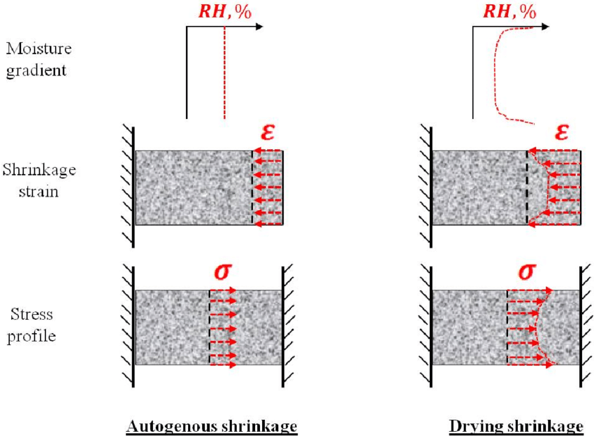

   Spenna og streita vegna rýrnunar.

Sjálfútþornunarrýrnun verður vegna þess að sement bindur vatn við hvörfun sína. Þegar vatnið í pórum steypunnar minnkar myndast undirþrýstingur sem veldur samdrætti.

Þessi gerð rýrnunar á sér stað meðan enn er óhvarfað sement til staðar.

Sjálfútþornunarrýrnun er yfirleitt lítil í venjulegri steinsteypu en getur orðið veruleg í:

* hástyrkleikasteypu,
* sjálfútleggjandi steypu,
* steypum með miklu sementsmagni eða miklu magni íauka.

Utanaðkomandi aðgerðir hafa almennt lítil áhrif á þessa gerð rýrnunar, þó að sérstakar rýrnunarvörur geti dregið úr henni.

Efnisþættir sem hafa áhrif á rýrnun
~~~~~~~~~~~~~~~~~~~~~~~~~~~~~~~~~~

Rýrnun steinsteypu ræðst af samspili samsetningar steypunnar og umhverfisaðstæðna.

Helstu efnisþættir eru:

* magn sementsefju,
* sementsmagn,
* vatnsmagn,
* vatns/sements-hlutfall,
* gerð fylliefna,
* fjaðurstuðull fylliefna,
* hvörfunargráða sements.

Almennt gildir að:

* minna vatn og lægra vatns/sements-hlutfall draga úr rýrnun,
* stíf fylliefni draga úr rýrnun,
* meiri hvörfun sements hægir á áframhaldandi rýrnun.

Umhverfisþættir
~~~~~~~~~~~~~~~

Aðstæður í umhverfi hafa einnig mikil áhrif á rýrnun.

Mikilvægir umhverfisþættir eru:

* aðhlúun steypunnar,
* hlutfallsraki lofts,
* hitastig,
* vindhraði,
* stærð og lögun byggingarhluta.

Hátt rakastig og góð aðhlúun draga úr rýrnun en þurrt, heitt og vindasamt umhverfi eykur hana.

Byggingarhlutar með stórt yfirborð miðað við rúmmál eru einnig viðkvæmari fyrir rýrnun en massameiri steypuhlutar.