Timbur
======

Timbur er eitt elsta og mikilvægasta byggingarefni mannkyns og hefur verið
notað í burðarvirki, þök, gólf, klæðningar og brýr um aldir. Þrátt fyrir að
ný byggingarefni hafi komið fram gegnir timbur enn mikilvægu hlutverki í
mannvirkjagerð og áhugi á notkun þess hefur aukist á síðustu árum.

Ólíkt efnum á borð við stál og steinsteypu er timbur lífrænt efni sem myndast
við vöxt trjáa. Uppbygging þess ræður því hvernig það flytur álag, bregst við
rakabreytingum og eldist með tímanum. Til að skilja hegðun timburs sem
byggingarefnis þarf því fyrst að skilja hvernig tré vex og hvernig viðurinn er
byggður upp.

Í þessum kafla verður fjallað um uppbyggingu timburs frá trénu sjálfu niður í
frumubyggingu viðarins. Jafnframt verður farið yfir hvernig raki, þéttleiki og
bygging viðar hafa áhrif á eðlis- og vélræna eiginleika timburs og þar með á
notkun þess í mannvirkjum.

.. admonition:: Markmið

   Að loknum þessum kafla ættir þú að geta:

   * lýst helstu byggingu trés og viðar,
   * útskýrt hvernig frumubygging viðar hefur áhrif á eiginleika timburs,
   * skýrt áhrif raka á hegðun timburs,
   * tengt byggingu viðar við styrk, stífleika og endingu byggingarefnisins.

Timbur sem byggingarefni
------------------------

.. admonition:: Markmið
   :class: athugasemd

   Að loknum þessum kafla ættir þú að geta:

   * útskýrt helstu kosti og takmarkanir timburs sem byggingarefnis,
   * borið timbur saman við önnur algeng byggingarefni,
   * lýst helstu notkunarsviðum timburs í mannvirkjagerð.

Timbur hefur verið eitt mikilvægasta byggingarefni mannkyns í þúsundir ára
og er enn í dag mikið notað í mannvirkjagerð. Það er meðal annars notað í
burðarvirki, þök, gólf, klæðningar og brýr. Á síðustu árum hefur notkun
timburs aukist víða um heim samhliða þróun nýrra timburvara og aukinni
áherslu á sjálfbæra mannvirkjagerð.

Ólíkt byggingarefnum eins og stáli og steinsteypu er timbur lífrænt efni.
Eiginleikar þess ráðast því af innri byggingu trésins og geta verið breytilegir
eftir trjátegund, vaxtarskilyrðum og rakainnihaldi. Þessi breytileiki gerir
timbur að áhugaverðu en jafnframt flóknu byggingarefni.

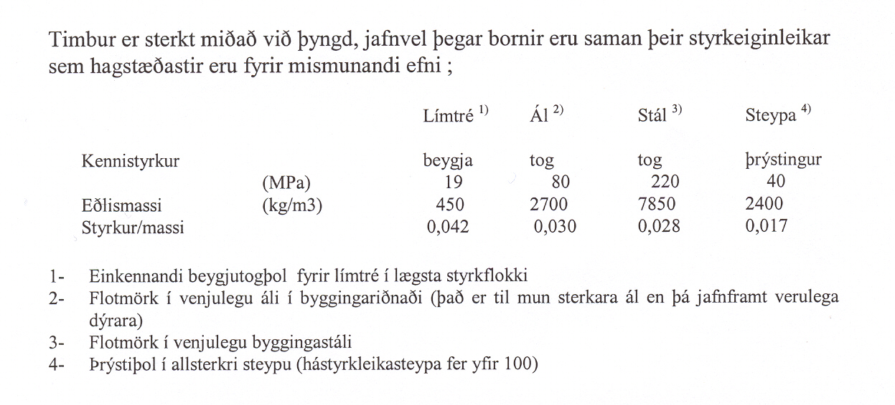

   Samanburður timburs við önnur algeng byggingarefni.

Þegar byggingarefni eru borin saman er ekki nægilegt að skoða eingöngu
styrk þeirra. Verkfræðingar þurfa einnig að meta eigin þyngd efnisins,
stífleika, varmaeiginleika, endingu og hvernig efnið hagar sér í notkun.
Slíkur samanburður sýnir að hvert byggingarefni hefur sína kosti og
takmarkanir og að val byggingarefnis ræðst af því verkefni sem leysa á.

.. admonition:: Verkfræðileg innsýn
   :class: athugasemd

   Timbur er eitt fárra byggingarefna þar sem innri bygging efnisins ræður
   nær öllum mikilvægum verkfræðilegum eiginleikum þess. Til að skilja
   styrk, stífleika og rakahreyfingar timburs þarf því fyrst að skilja
   hvernig viðurinn er byggður upp.

.. admonition:: Algengur misskilningur
   :class: advorun

   Timbur er ekki einfaldlega „veikara“ en stál eða steinsteypa.

   Hvert byggingarefni hefur sína styrkleika og veikleika. Í mörgum
   burðarvirkjum skiptir hlutfall styrks og eigin þyngdar meira máli en
   hámarksstyrkur efnisins einn og sér.

.. admonition:: Meginatriði
   :class: athugasemd

   Timbur er náttúrulegt, stefnuháð byggingarefni þar sem uppbygging
   viðarins stjórnar flestum eðlis- og vélrænum eiginleikum efnisins.

Timbur á Íslandi
----------------

.. admonition:: Markmið
   :class: athugasemd

   Að loknum þessum kafla ættir þú að geta:

   * lýst í grófum dráttum hvaðan byggingartimbur á Íslandi kemur,
   * nefnt helstu trjátegundir sem notaðar eru sem burðarviður hér á landi.

Íslensk skógrækt hefur aukist á síðustu áratugum, en framleiðsla
byggingartimburs er enn takmörkuð. Því er stærstur hluti þess timburs sem
notað er í íslenskri mannvirkjagerð fluttur inn.

Myndin sýnir að íslenskur byggingariðnaður byggir að mestu á innfluttu timbri.
Því eru þær viðartegundir sem mest eru notaðar í mannvirkjagerð hér á landi
einkum þær sömu og algengar eru á Norðurlöndum.

Samkvæmt Rb-blaðinu *Tré – Trjátegundir og efniseiginleikar viðarins* eru
rauðgreni (*Picea abies*) og skógarfura (*Pinus sylvestris*) algengustu
trjátegundirnar sem notaðar eru við húsbyggingar á Íslandi. Þær eru meðal
annars notaðar í burðarvirki, klæðningar, bita og súlur. Sitkagreni vex einnig
víða hér á landi og timburafurðir þess hafa svipaða eiginleika og afurðir úr
rauðgreni og furu. :contentReference[oaicite:0]{index=0}

.. admonition:: Í framkvæmd
   :class: daemi

   Í þessum kafla verður aðallega fjallað um barrvið, þar sem hann er
   algengasta hráefnið í burðartimbri sem notað er í íslenskri
   mannvirkjagerð. Nefnd dæmi og myndir vísa því oft til grenis og furu.

.. admonition:: Meginatriði
   :class: athugasemd

   Í íslenskri mannvirkjagerð er mest notast við innflutt barrtimbur,
   einkum greni og furu, og því verður áhersla þessa kafla á eiginleika
   þeirra viðartegunda.

Uppbygging trjástofns
---------------------

.. admonition:: Markmið
   :class: athugasemd

   Að loknum þessum kafla ættir þú að geta:

   * nefnt helstu hluta trjástofns,
   * útskýrt hlutverk barkar, basts, rysju og kjarnviðar,
   * skýrt hvernig þessir hlutar tengjast eiginleikum timburs.

Trjástofn er ekki einsleitt efni heldur samanstendur hann af nokkrum
svæðum sem gegna ólíkum hlutverkum meðan tréð er lifandi. Þessi
uppbygging ræður því hvernig vatn og næring berast um tréð, hvernig
nýr viður myndast og hvernig timbrið hagar sér eftir að tréð hefur verið
fellt.

Frá ysta lagi og inn að miðju má greina börk, bast, rysju, kjarnvið og
merg.

.. figure:: ./myndir/kafli17/borkur_bast_rysja_kjarnvidur.png
   :width: 70 %
   :align: center

   Helstu hlutar trjástofns.

Börkurinn ver tréð fyrir utanaðkomandi áhrifum. Innan við hann er bastið,
sem flytur sykrur og önnur næringarefni frá laufblöðum til annarra hluta
trésins. Innan bastsins er vaxtarlagið þar sem nýjar viðarfrumur myndast.

Rysjan er ysti hluti viðarins. Þar flyst vatn og uppleyst steinefni frá
rótum upp í krónu trésins. Með aldrinum hætta innstu frumurnar í rysjunni
að taka þátt í þessum flutningi og verða smám saman að kjarnviði.

Kjarnviðurinn gegnir fyrst og fremst burðarhlutverki. Hjá sumum
trjátegundum inniheldur hann einnig efni sem auka náttúrulega endingu
viðarins og gefa honum dekkri lit.

.. admonition:: Verkfræðileg innsýn
   :class: athugasemd

   Þegar tré er sagað í byggingatimbur fylgja þessir hlutar áfram með í
   efninu. Þess vegna geta eiginleikar tveggja borða úr sama trénu verið
   mismunandi eftir því hvaðan í stofninum þau eru söguð.

.. admonition:: Algengur misskilningur
   :class: advorun

   Kjarnviður er ekki "betri viður" í öllum tilvikum.

   Hlutverk kjarnviðar og rysju eru ólík meðan tréð vex og eiginleikar
   þeirra geta verið mismunandi eftir trjátegund. Hjá sumum tegundum er
   munurinn greinilegur en hjá öðrum lítill.

.. admonition:: Meginatriði
   :class: athugasemd

   Til að skilja eiginleika timburs þarf fyrst að skilja hvernig
   trjástofninn er byggður upp.

Frumubygging viðar
------------------

.. admonition:: Markmið
   :class: athugasemd

   Að loknum þessum kafla ættir þú að geta:

   * lýst helstu frumugerðum í barrviði,
   * útskýrt hlutverk langfrumna og stuttfrumna,
   * skýrt hvernig frumurnar tengjast hver annarri.

Viður er byggður upp úr frumum. Í barrviði eru tvær megingerðir frumna:
langfrumur (*tracheids*) og stuttfrumur (*parenchyma*). Langfrumurnar liggja
í lengdarstefnu trésins og gefa því styrk. Frumubyggingunni má líkja við
búnt af sogrörum þar sem langfrumurnar mynda rörin en stuttfrumurnar liggja
þvert á þær og flytja og geyma næringu. :contentReference[oaicite:1]{index=1}

Í norrænum barrtrjám eru langfrumurnar 2–6 mm langar og hafa þvermál á
bilinu 0,02–0,05 mm. Þær mynda um 90% af rúmmáli viðarins og eru því
langmikilvægasta frumugerðin í barrviði. :contentReference[oaicite:2]{index=2}

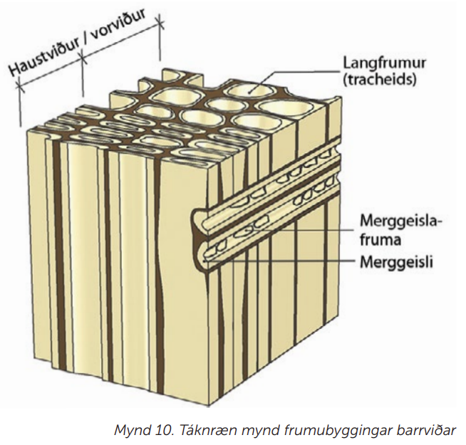

   Táknræn mynd af frumubyggingu barrviðar.

Þvert á langfrumurnar liggja merggeislar sem samanstanda af stuttfrumum.
Í sumum barrtrjám eru einnig trjákvoðugöng. Milli aðliggjandi frumna eru
linsuop með filmu (*membran*) sem getur opnað og lokað fyrir vökvastreymi
milli frumanna. 

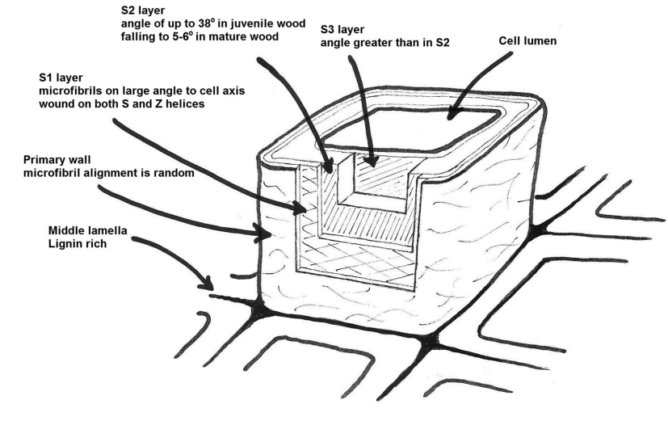

.. admonition:: Verkfræðileg innsýn
   :class: athugasemd

   Langfrumurnar eru meginhluti viðarins. Því ráðast margir af mikilvægustu
   eiginleikum timburs af gerð þeirra, legu og innbyrðis tengingum. Í næstu
   köflum verður fjallað um hvernig þessi frumubygging hefur áhrif á
   eiginleika timburs.

.. admonition:: Meginatriði
   :class: athugasemd

   Barrviður er að mestu byggður upp úr langfrumum sem liggja í
   lengdarstefnu trésins. Stuttfrumur, merggeislar og linsuop tengja
   frumurnar saman og taka þátt í flutningi og geymslu efna.

.. container:: teaching-step

   .. figure:: ./myndir/kafli17/frumubygging_langfrumur_og_stuttfrumur.png
      :width: 90 %
      :align: center

.. container:: teaching-step

   .. figure:: ./myndir/kafli17/frumubygging_langfrumur_og_stuttfrumur.png
      :width: 90 %
      :align: center

.. container:: teaching-step

   .. figure:: ./myndir/kafli17/frumubygging_langfrumur_og_stuttfrumur.png
      :width: 90 %
      :align: center

Timbur
-------

Timbur er náttúrulegt byggingarefni sem hefur verið notað til mannvirkjagerðar í þúsundir ára. Það hefur marga góða eiginleika sem gera það að mikilvægu byggingarefni enn í dag.

Helstu kostir timburs eru:

* auðvelt í vinnslu,
* þægilegt í viðhaldi,
* náttúruafurð.

Þekktar eru um 30.000 trjátegundir en aðeins um 1.000 þeirra eru nýttar til mannvirkjagerðar. Hérlendis er aðallega notaður barrviður (mjúkviður), einkum fura og greni, sem byggingatimbur.

Timbur á Íslandi
----------------

Nánast allt byggingatimbur sem notað er á Íslandi er innflutt. Þó hefur rekaviður lengi verið nýttur hér á landi og á síðustu áratugum hefur innlend skógrækt aukist.

Helstu trjátegundir sem ræktaðar eru hérlendis eru:

* rauðgreni,
* sitkagreni,
* skógarfura,
* stafafura,
* rauðagreni,
* lerki,
* alaskaösp.

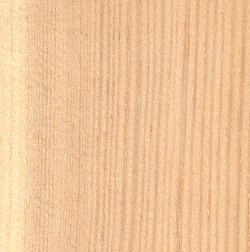

   Fura.

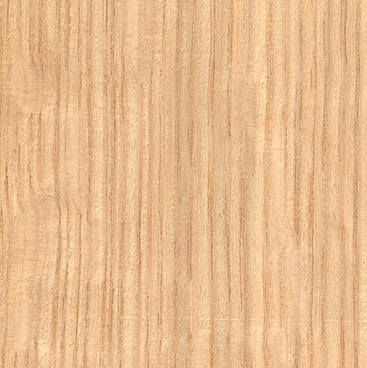

   Eik.

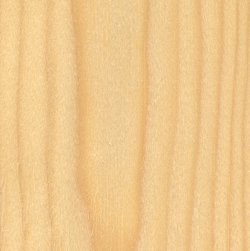

   Rauðgreni.

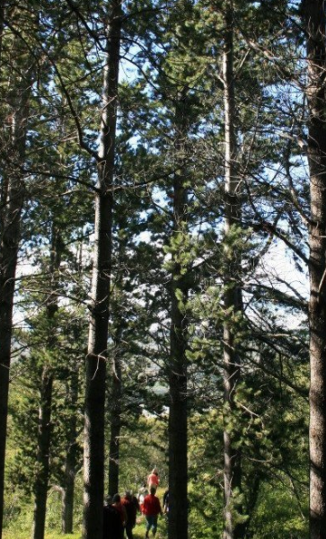

   Timbur er náttúruafurð.

Innflutningur timburs
---------------------

Á Íslandi eru flutt inn um 60–90 þúsund m³ af timbri á ári og hefur innflutningurinn mest farið yfir 110 þúsund m³.

Um 70% innflutningsins er fura og greni, tæplega 30% eru plötuklæðningar og afgangurinn er harðviður.

Byggingatimbur hefur meðal annars verið flutt inn frá Rússlandi, Kanada og Norðurlöndunum og á síðari árum einnig frá Eistlandi og Lettlandi.

Samanburður við önnur byggingarefni
-----------------------------------

Timbur hefur marga eiginleika sem gera það að samkeppnishæfu byggingarefni.

   Samanburður timburs við önnur byggingarefni.

Frumubygging viðar
-----------------

Viður er lífrænt efni sem er byggt upp úr frumum. Gerð og lögun frumanna ræður miklu um eiginleika timburs, svo sem styrk, stífleika, rakaflutning og eðlisþyngd.

Í viði eru tvær megingerðir frumna:

* langfrumur,
* stuttfrumur.

Langfrumur mynda meginhluta burðarvirkis trésins og sjá jafnframt um flutning vatns og næringarefna. Stuttfrumur gegna meðal annars hlutverki við geymslu næringarefna og flutning þeirra þvert á trefjastefnu.

   Langfrumur og stuttfrumur í viði.

Efnasamsetning viðar
~~~~~~~~~~~~~~~~~~~~

Viður er að mestu leyti samsettur úr þremur efnum:

* sellulósa,
* hemisellulósa,
* ligníni.

Sellulósi myndar sterkar trefjar sem veita viðnum togstyrk. Hemisellulósi tengir trefjarnar saman en lignín bindur frumurnar saman og gefur viðnum stífni og þrýstiþol.

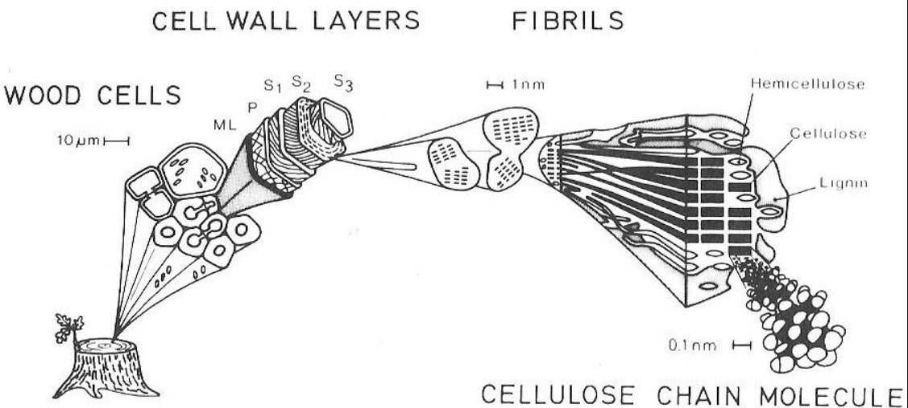

   Helstu byggingarefni viðar.

Frumuveggur
~~~~~~~~~~~

Frumuveggur viðar er ekki einsleitur heldur samanstendur af nokkrum lögum. Innan veggjarins liggja örtrefjar úr sellulósa sem hafa afgerandi áhrif á vélræna eiginleika viðarins.

Stefna örtrefjanna hefur meðal annars áhrif á:

* styrk,
* stífleika,
* formbreytingar,
* rýrnun og þrútnun.

   Uppbygging frumuveggjar og stefna örtrefja.

Uppbygging viðar
----------------

Viður er byggður upp úr mörgum frumum sem raðast saman í ákveðna stefnu. Flestar frumurnar liggja samsíða stofni trésins og því eru eiginleikar viðar mismunandi eftir því í hvaða stefnu hann er álagður.

Þessi stefnuvirkni er einn af mikilvægustu eiginleikum timburs sem byggingarefnis.

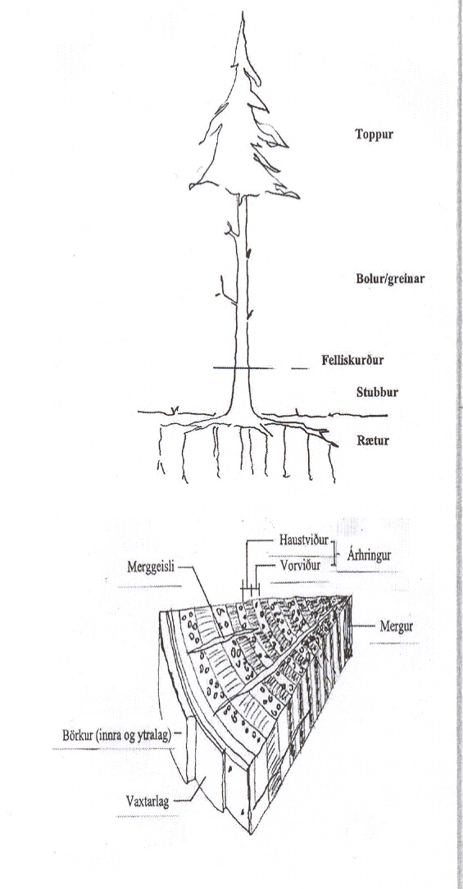

   Uppbygging viðar.

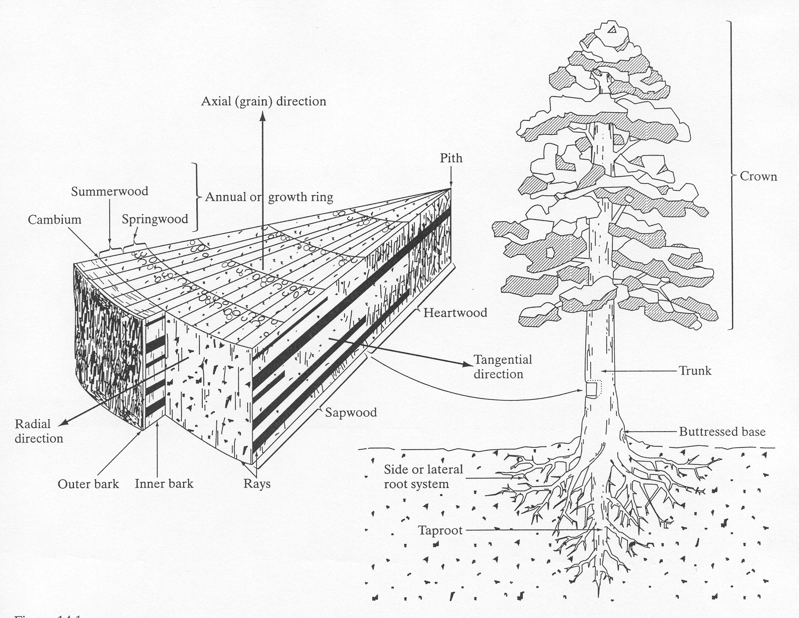

   Smásæ uppbygging viðar.

Uppbygging timburs
------------------

Þegar tré er unnið í byggingatimbur endurspeglast náttúruleg uppbygging þess í timburinu. Á skurðflötum má greina meðal annars trefjastefnu, árhringi og aðra byggingarþætti sem hafa áhrif á eiginleika efnisins.

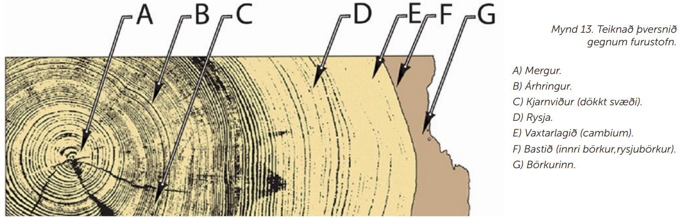

   Uppbygging timburs.

Árhringir
----------

Við þversnið trés má sjá árhringi sem myndast vegna árlegs vaxtar trésins. Hver árhringur samanstendur af vorviði og haustviði sem hafa mismunandi byggingu og eiginleika.

Breidd árhringja er breytileg og ræðst meðal annars af:

* trjátegund,
* vaxtarskilyrðum,
* loftslagi,
* aldri trésins.

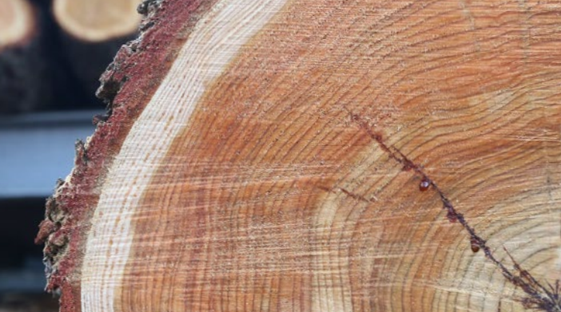

   Árhringir ásamt vorviði og haustviði.

Vorviður og haustviður
~~~~~~~~~~~~~~~~~~~~~~

Á vaxtartíma trésins myndast tvær gerðir viðar.

**Vorviður** myndast snemma sumars og einkennist af:

* stórum frumum,
* þunnum frumuveggjum,
* lágum eðlisþéttleika.

**Haustviður** myndast síðar á vaxtartímabilinu og einkennist af:

* smærri frumum,
* þykkum frumuveggjum,
* meiri eðlisþéttleika og styrk.

Hlutfall vorviðar og haustviðar hefur áhrif á eiginleika timburs.

Uppbygging trés
---------------

Trjástofninn skiptist í nokkur svæði sem gegna mismunandi hlutverkum.

Frá ysta lagi og inn að miðju má greina:

* börk,
* bast,
* rysju,
* kjarnvið,
* merg.

Hvert þessara svæða hefur ákveðið hlutverk í vexti og starfsemi trésins.

.. figure:: ./myndir/kafli17/borkur_bast_rysja_kjarnvidur.png
   :width: 70 %
   :align: center

   Helstu hlutar trjástofns.

Bygging viðar
-------------

Rysjan er sá hluti trésins þar sem vatn og uppleyst næringarefni flytjast frá rótum til krónu trésins. Með aldrinum hættir innsti hluti rysjunnar að taka þátt í þessum flutningi og verður að kjarnviði.

Kjarnviður inniheldur yfirleitt minna vatn en rysjan og hefur oft meiri náttúrulega mótstöðu gegn líffræðilegu niðurbroti.

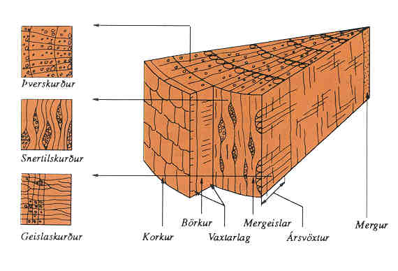

   Dæmi um uppbyggingu trjástofns.

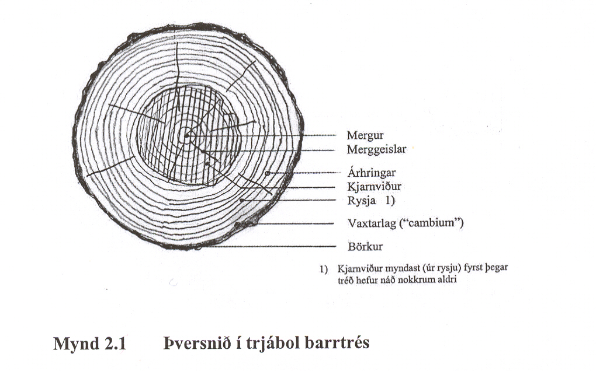

   Þversnið af trjástofni.

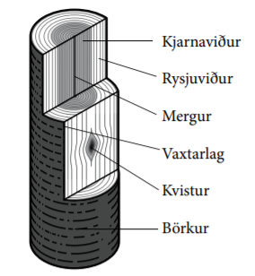

   Helstu byggingarhlutar viðar.

Barrtré og lauftré
------------------

Trjátegundum sem notaðar eru til timburframleiðslu er oft skipt í tvo meginflokka:

* barrtré (mjúkvið),
* lauftré (harðvið).

Barrtré eru mest notuð sem burðarviður í mannvirkjagerð, meðal annars vegna þess að þau eru:

* létt,
* auðveld í vinnslu,
* hafa hátt styrk/þyngdarhlutfall.

Lauftré eru yfirleitt eðlisþéttari og harðari og eru því oft notuð þar sem gerðar eru meiri kröfur um slitþol eða útlit.

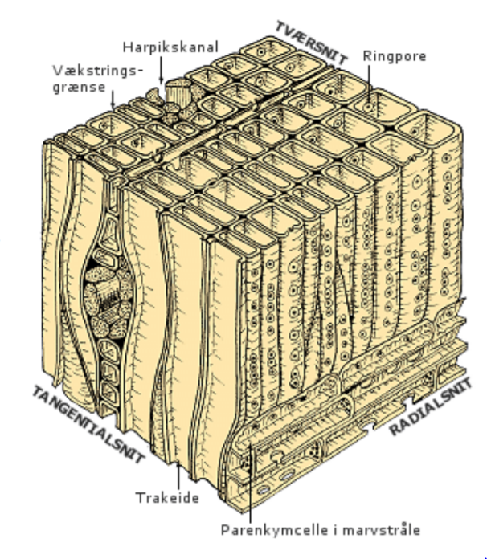

   Barrtré.

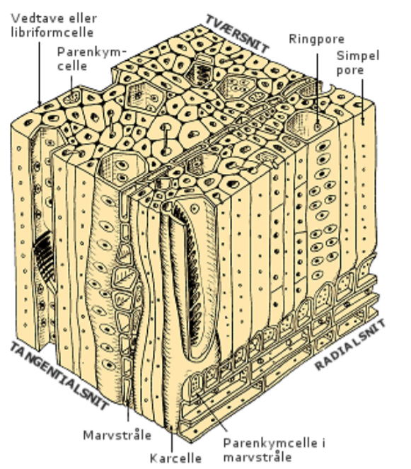

   Lauftré.

Eðlisþéttleiki
--------------

Eðlisþéttleiki timburs er einn mikilvægasti eiginleiki þess og hefur veruleg áhrif á styrk, stífleika og aðra efniseiginleika.

Eðlisþéttleikinn ræðst meðal annars af:

* trjátegund,
* vaxtarskilyrðum,
* hlutfalli vorviðar og haustviðar,
* rakainnihaldi timburs.

Almennt má segja að timbur með meiri eðlisþéttleika hafi meiri styrk, en jafnframt meiri þyngd.

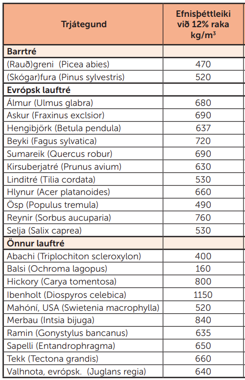

   Eðlisþéttleiki mismunandi trjátegunda.

Höfuðásar timburs
-----------------

Timbur er stefnubundið efni (*anisotropic*), sem þýðir að eiginleikar þess eru mismunandi eftir stefnu trefjanna.

Greint er á milli þriggja höfuðása:

* langáss,
* geislaáss,
* snertiáss.

Flestir vélrænir og eðlisfræðilegir eiginleikar timburs ráðast af því í hvaða stefnu álag eða rakabreyting verkar miðað við þessa ása.

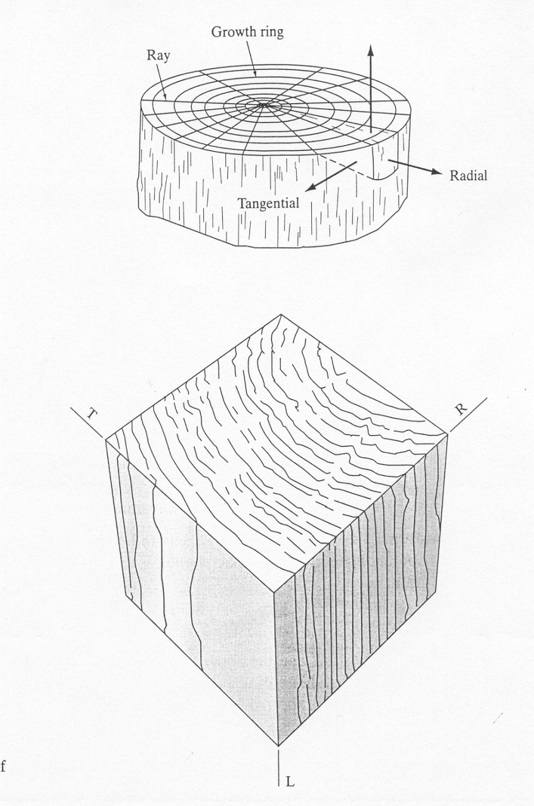

   Höfuðásar timburs.

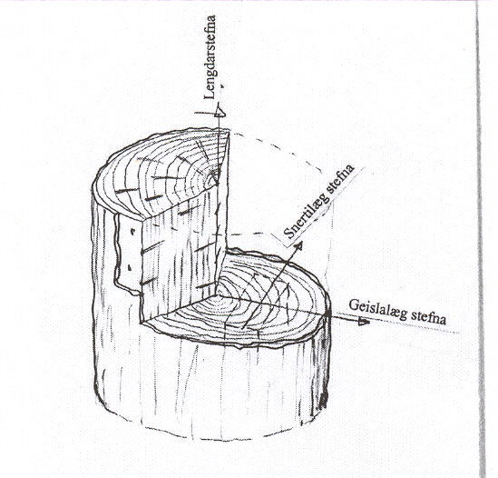

   Langás, geislaás og snertiás.

Viður og timbur
---------------

Viður í lifandi tré og timbur sem byggingarefni hafa ekki sama rakainnihald eða sömu eiginleika.

Við vinnslu timburs er mikilvægt að taka mið af breytingum sem verða á efninu þegar rakainnihald þess breytist.

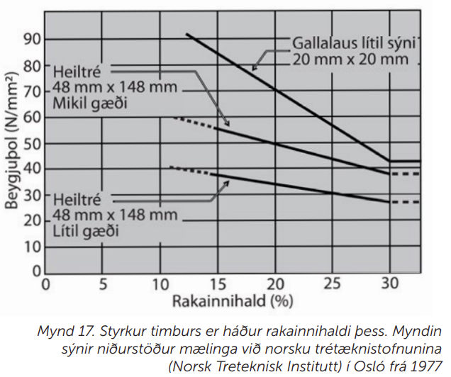

   Viður og timbur.

Efnisraki
---------

Efnisraki timburs er skilgreindur sem hlutfall vatnsmassa í timbrinu miðað við þurrmassa þess.

Rakainnihaldið hefur áhrif á meðal annars:

* styrk,
* stífleika,
* formbreytingar,
* endingu.

Við þurrkun timburs minnkar rakainnihaldið og eiginleikar efnisins breytast.

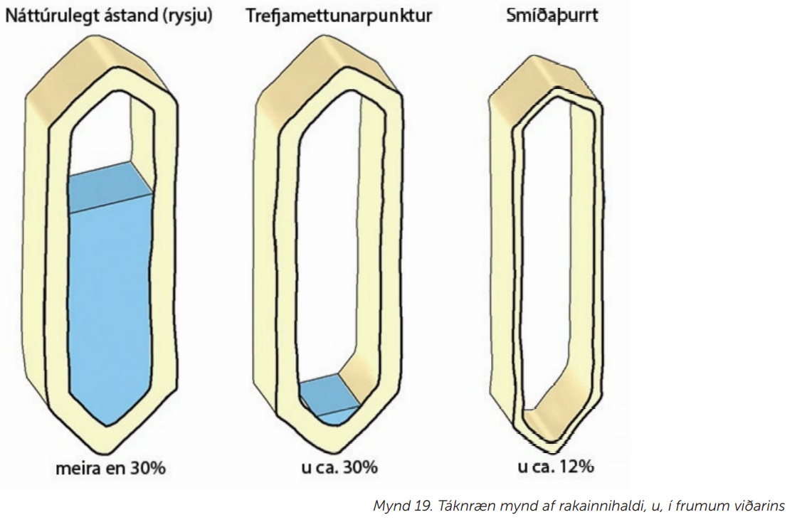

   Trefjamettunarmörk timburs.

Rakainnihald timburs
--------------------

Rakainnihald timburs er mismunandi eftir notkun og umhverfi.

Við venjulegar aðstæður leitast timbur við að ná jafnvægi við rakastig umhverfisins. Því er mikilvægt að velja timbur með rakainnihald sem hentar þeim aðstæðum sem það verður notað við.

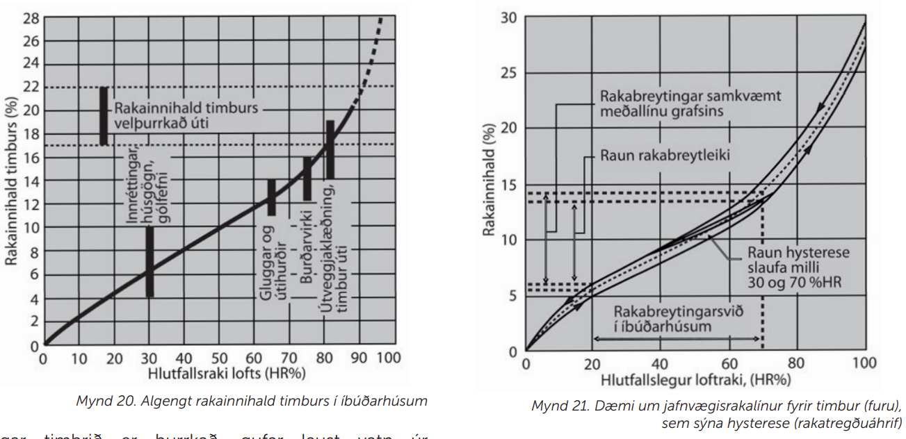

   Dæmigert rakainnihald timburs í íbúðarhúsum.

Rýrnun og þrútnun
-----------------

Þegar rakainnihald timburs breytist breytast jafnframt stærðir þess. Timbur dregst saman við þornun og þenst út þegar það tekur upp raka.

Þessar stærðarbreytingar eru mismiklar eftir stefnu í timbrinu og ráðast af innri byggingu þess.

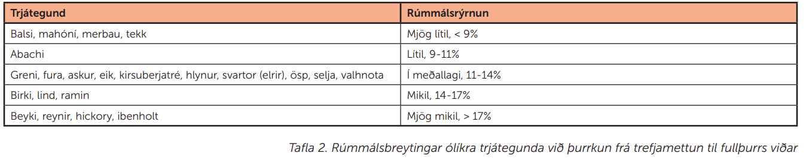

   Rýrnun og þrútnun timburs.

Stefnubundin formbreyting
~~~~~~~~~~~~~~~~~~~~~~~~~

Rýrnun og þrútnun eru mismikil eftir höfuðásum timburs.

Almennt gildir að:

* rýrnun er minnst í stefnu trefjanna,
* meiri í geislaátt,
* mest í snertiátt.

Þessi stefnubundni munur getur valdið aflögunum og sprungum ef ekki er tekið tillit til hans við hönnun og framkvæmd.

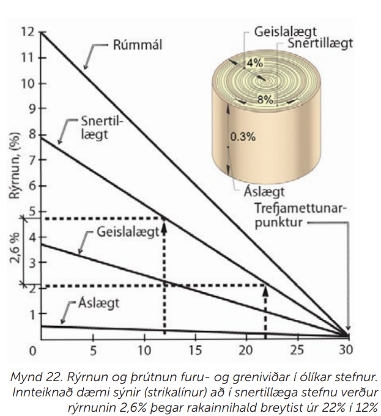

   Rýrnun og þrútnun í mismunandi stefnum timburs.

Rakabreytingar og aflögun
-------------------------

Þegar timbur þornar verður ekki aðeins breyting á stærðum þess heldur geta einnig orðið aflögun, sveigja eða snúningur.

Lögun byggingarhluta eftir þornun ræðst meðal annars af:

* stefnu árhringja,
* upphaflegu rakainnihaldi,
* hvernig timbrið er sagað.

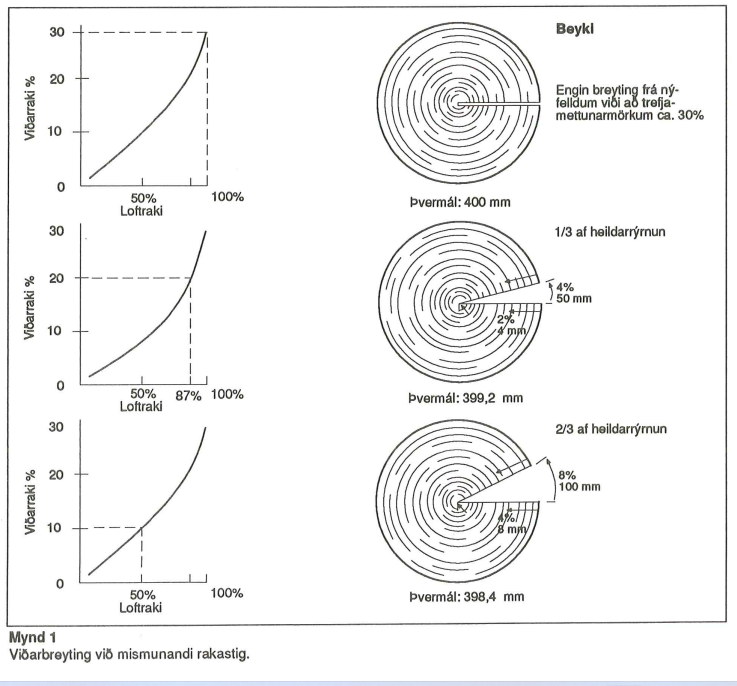

   Breyting á rakainnihaldi og áhrif hennar á timbur.

Aflögun vegna þornunar
----------------------

Við þornun geta myndast mismunandi gerðir aflögunar eftir því hvernig timbrið er sagað og hvernig árhringirnir liggja.

Algengar aflögunargerðir eru:

* sveigja,
* kúptun,
* skekking,
* snúningur.

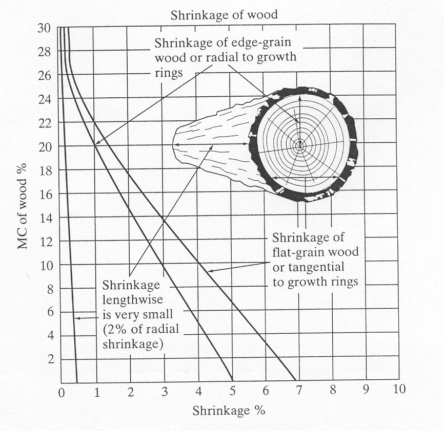

   Dæmi um aflögun við þornun.

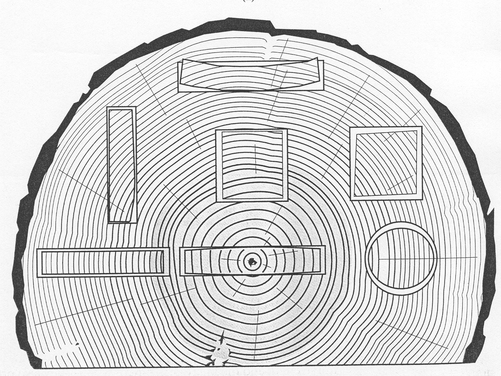

   Mismunandi gerðir aflögunar.

Dæmi um rakabundnar formbreytingar
----------------------------------

Við hönnun og notkun timburs þarf að gera ráð fyrir þeim formbreytingum sem verða þegar rakainnihald breytist.

Því er mikilvægt að:

* velja timbur með hentugu rakainnihaldi,
* tryggja góða rakavörn,
* gera ráð fyrir mögulegum hreyfingum í smáatriðum byggingarhluta.

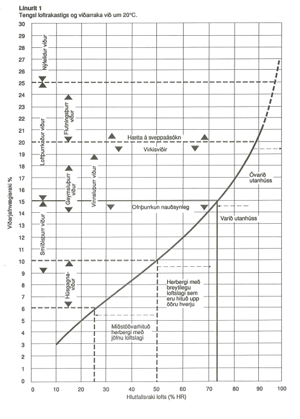

   Dæmi um formbreytingar vegna rakabreytinga.

Rakaflokkar
-----------

Rakainnihald timburs ræðst af rakastigi umhverfisins. Við hönnun timburmannvirkja er því mikilvægt að gera ráð fyrir því við hvaða rakaaðstæður timbrið verður notað.

Notkunarskilyrðum er skipt í rakaflokka sem lýsa því rakastigi sem timbrið verður fyrir í notkun. Flokkarnir eru meðal annars notaðir við ákvörðun á styrk- og aflögunareiginleikum timburs.

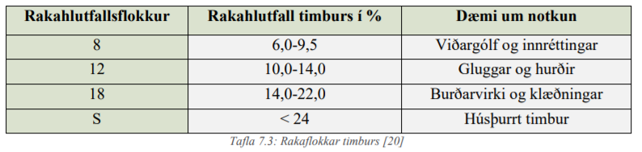

   Rakaflokkar timburs.

Gufumótstaða og varmaleiðni
---------------------------

Timbur hefur tiltölulega góða hitaeinangrunareiginleika samanborið við mörg önnur byggingarefni.

Varmaleiðni timburs ræðst meðal annars af:

* eðlisþéttleika,
* rakainnihaldi,
* stefnu trefjanna.

Timbur hefur jafnframt ákveðna gufumótstöðu sem þarf að taka tillit til við hönnun byggingarhluta þar sem rakaflutningur á sér stað.

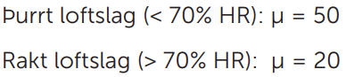

   Gufumótstaða og varmaleiðni timburs.

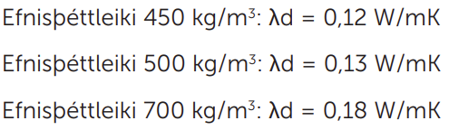

   Varmaleiðni timburs.

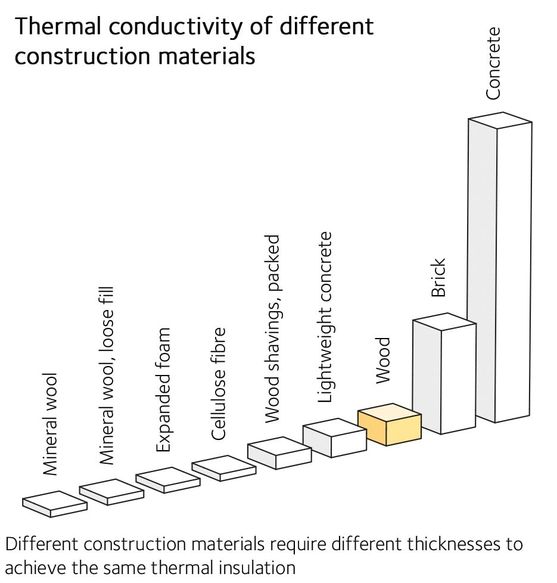

   Áhrif rakaflutnings í timbri.

Styrkur og stífleiki
--------------------

Vélrænir eiginleikar timburs ráðast af fjölmörgum þáttum, meðal annars:

* trjátegund,
* eðlisþéttleika,
* rakainnihaldi,
* stefnu trefjanna,
* göllum í timbrinu.

Þar sem timbur er náttúrulegt efni er breytileiki eiginleika þess meiri en hjá mörgum öðrum byggingarefnum.

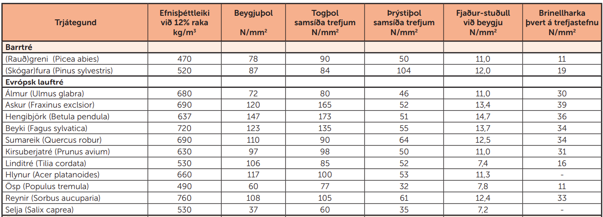

   Helstu þættir sem hafa áhrif á styrk og stífleika timburs.

Breytileiki styrkeiginleika
---------------------------

Náttúrulegur breytileiki timburs veldur því að styrkur einstakra timburstykkja getur verið mismunandi, jafnvel innan sömu trjátegundar.

Við hönnun burðarvirkja er því stuðst við einkennandi styrkgildi sem byggð eru á tölfræðilegri úrvinnslu mælinga.

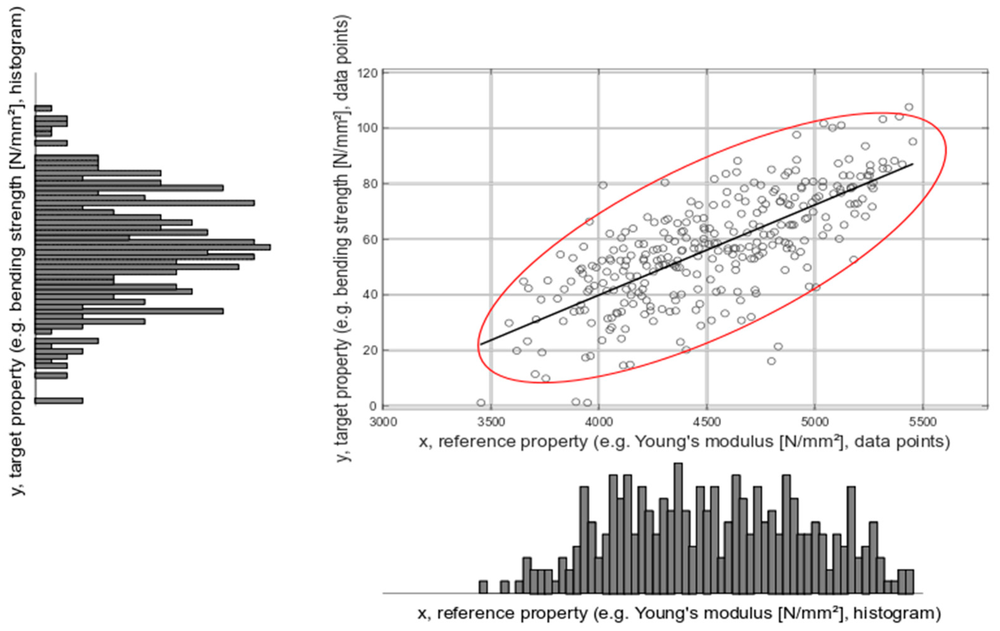

   Dreifing mældra styrkgilda.

Spennu–streituferill
--------------------

Við álag aflagast timbur. Samband spennu og streitu er háð álagsstefnu, rakainnihaldi og byggingu viðarins.

Þekking á spennu–streituferli timburs er grundvöllur fyrir útreikningum á aflögunum og burðarþoli timburmannvirkja.

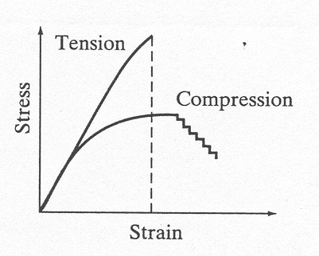

   Dæmigerður spennu–streituferill timburs.

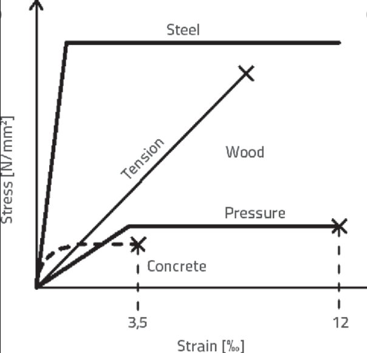

   Spennu–streitusamband timburs við mismunandi álag.

   Þrýstistyrkur
-------------

Styrkur timburs er háður álagsstefnu miðað við trefjastefnu. Við þrýstiálag samsíða trefjum hefur timbur mun meiri burðargetu en þegar álagið verkar þvert á trefjarnar.

Þegar timbur er hannað sem burðarefni þarf því ávallt að taka mið af stefnu trefjanna gagnvart álaginu.

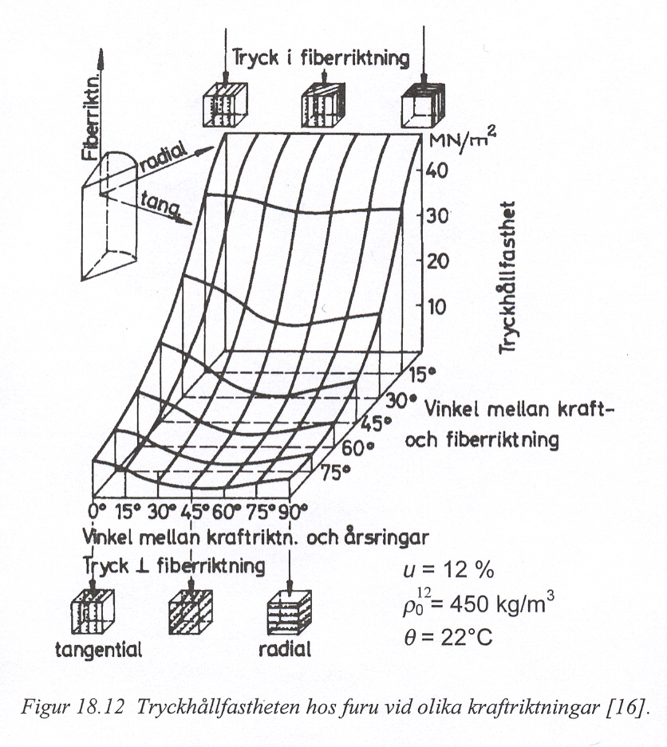

   Þrýstistyrkur timburs.

Áhrif raka á styrk
------------------

Rakainnihald hefur veruleg áhrif á vélræna eiginleika timburs.

Almennt gildir að styrkur og stífleiki timburs aukast eftir því sem rakainnihaldið lækkar, þar til trefjamettunarmörkum er náð. Fyrir ofan trefjamettunarmörkin hafa breytingar á rakainnihaldi lítil áhrif á styrk timburs.

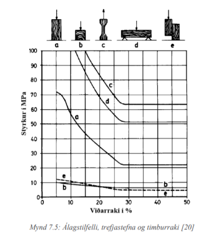

   Samband rakainnihalds og styrks timburs.

Áhrif álagshraða
----------------

Styrkur timburs er einnig háður því hversu hratt álag er aukið.

Við hraða álagsaukningu mælist styrkur timburs yfirleitt meiri en við hæga álagsaukningu. Þetta þarf að hafa í huga við túlkun prófaniðurstaðna og við mat á hegðun timburs undir mismunandi álagsaðstæðum.

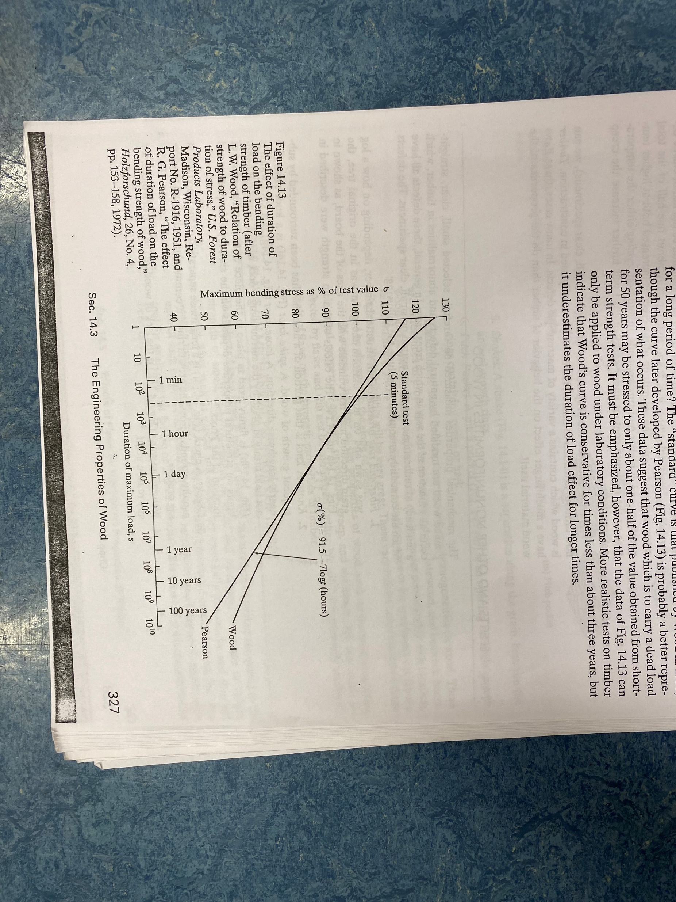

   Áhrif álagshraða á styrk timburs.

Kvistir
-------

Kvistir eru einn algengasti náttúrulegi gallinn í timbri og hafa veruleg áhrif á styrk þess.

Kvistir verða til þar sem greinar trésins tengjast stofninum og rjúfa samfellda trefjastefnu viðarins.

Stærð, staðsetning og gerð kvista hafa áhrif á burðargetu timburs.

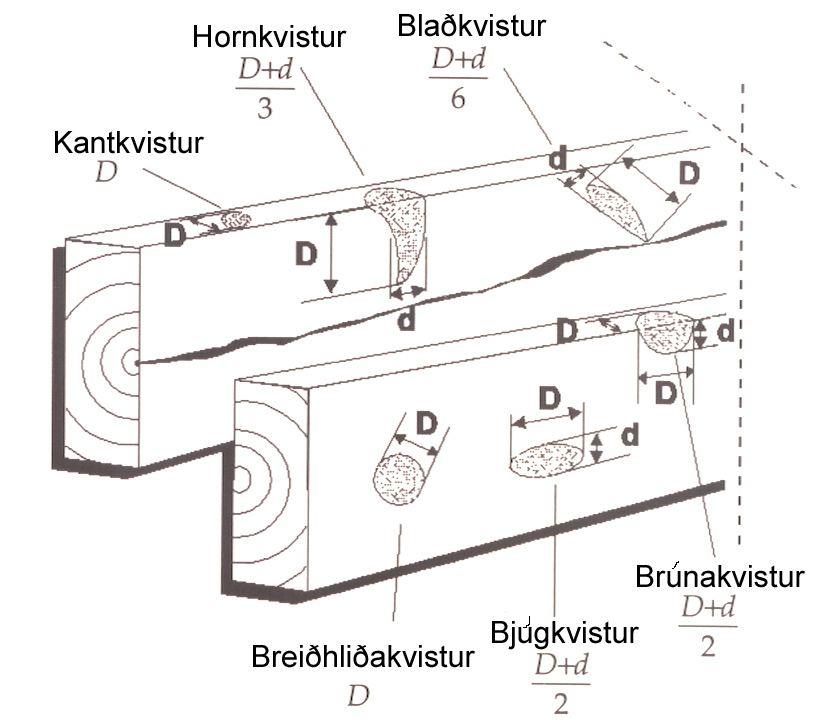

   Kvistir í timbri.

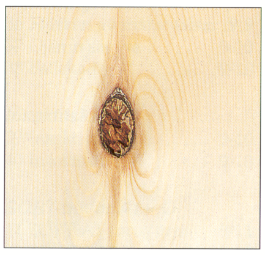

   Dæmi um kvista.

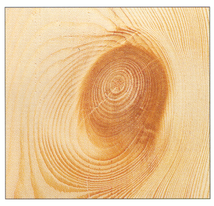

   Kvistir og trefjastefna.

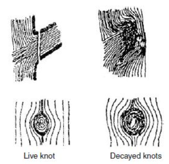

   Mismunandi gerðir kvista.

Áhrif kvista á styrk
--------------------

Kvistir valda staðbundnum breytingum á trefjastefnu og geta þannig dregið úr burðargetu timburs.

Áhrif þeirra ráðast meðal annars af:

* stærð kvists,
* staðsetningu hans,
* hvort kvisturinn er fastur eða laus,
* stefnu álagsins miðað við trefjarnar.

Þess vegna eru kvistir einn mikilvægasti þátturinn við styrkflokkun burðartimburs.

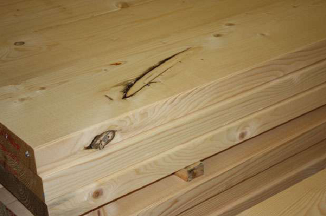

   Áhrif kvista á burðargetu timburs.

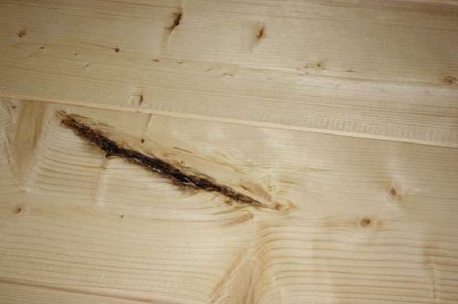

   Dæmi um áhrif kvista á spennudreifingu.

Styrkflokkun timburs
--------------------

Vegna þess að timbur er náttúrulegt efni er styrkur þess breytilegur. Því er burðartimbur flokkað eftir styrk svo hægt sé að nota áreiðanleg hönnunargildi við útreikninga.

Styrkflokkun getur farið fram með:

* sjónflokkun,
* vélrænni flokkun.

Við flokkun er meðal annars tekið tillit til:

* kvista,
* trefjahalla,
* sprungna,
* annarra náttúrulegra galla.

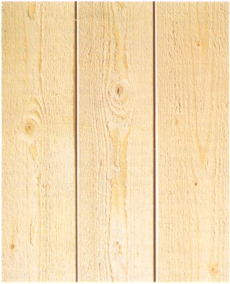

   Sjónflokkun timburs.

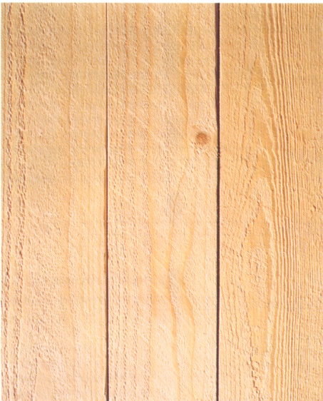

   Vélræn flokkun timburs.

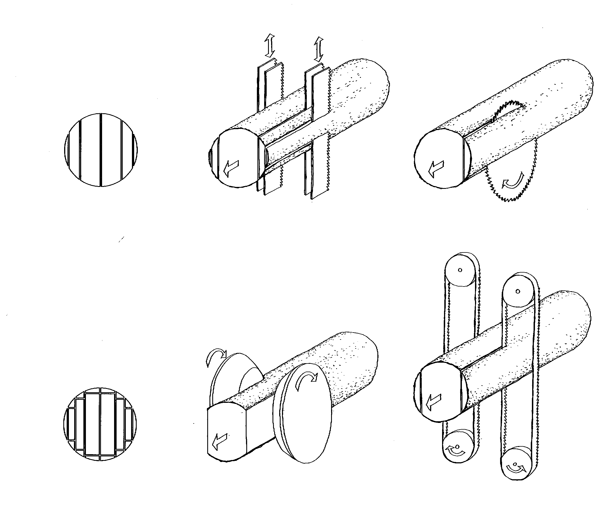

   Styrkflokkun burðartimburs.

Bruni timburs
-------------

Þrátt fyrir að timbur sé brennanlegt efni getur það haft góða brunamótstöðu þegar það er notað í burðarvirkjum.

Við bruna myndast kolað yfirborð sem einangrar innri hluta timbursins og hægir á áframhaldandi niðurbroti.

Burðargeta timburs minnkar því smám saman eftir því sem kolalagið þykknar.

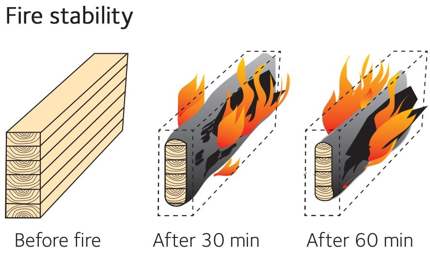

   Bruni timburs.

Brunavarnir
-----------

Við brunahönnun timburmannvirkja þarf að taka mið af:

* brunatíma,
* kulnunarhraða,
* stærð burðarhluta,
* brunavörnum.

Brunavarnir geta meðal annars falist í:

* klæðningum,
* brunavarnarmeðferð,
* aukinni þversniðsstærð burðarhluta.


   Brunavarnir timburmannvirkja.

Fúi og mygla
------------

Timbur er lífrænt efni og getur orðið fyrir líffræðilegu niðurbroti ef aðstæður eru hagstæðar.

Til þess að fúi eða mygla geti myndast þurfa nokkur skilyrði að vera uppfyllt, meðal annars:

* nægur raki,
* hentugt hitastig,
* súrefni,
* næring.

Ef eitt þessara skilyrða vantar verður líffræðilegur vöxtur ekki.


   Skilyrði fyrir myndun fúa og myglu.


   Samspil raka, hita og annarra þátta.

Fúi og mygla í timbri
---------------------

Fúi og mygla hafa mismunandi áhrif á timbur.

Mygla vex á yfirborði timburs og hefur fyrst og fremst áhrif á útlit þess, en getur jafnframt bent til of mikils raka.

Fúi veldur hins vegar niðurbroti viðarefnisins og getur dregið verulega úr styrk timburs ef ekki er brugðist við í tíma.


   Dæmi um myglu.


   Dæmi um fúa.


   Skemmdir af völdum fúa.


   Dæmi um líffræðilegt niðurbrot timburs.

Veggjatítla
------------

Við framleiðslu timburplatna og samsettra timburvara eru notaðar mismunandi gerðir viðarlaga og samsetninga eftir því hvaða eiginleikum er óskað eftir.

Val á uppbyggingu hefur meðal annars áhrif á:

* styrk,
* stífleika,
* formstöðugleika,
* burðargetu.


   Dæmi um uppbyggingu timburplatna.


   Samsetning viðarlaga.


   Dæmi um plötuuppbyggingu.

Krossviður
----------

Krossviður er samsettur úr þunnum viðarlögum sem límd eru saman þannig að trefjastefna hvers lags er hornrétt á næsta lag.

Þessi uppbygging:

* eykur formstöðugleika,
* dregur úr rýrnun og þrútnun,
* bætir burðareiginleika í fleiri en eina stefnu.


   Krossviður.


   Uppbygging krossviðar.


   Lög krossviðar.

Límtré
-------

Límtré er framleitt með því að líma saman timburlög með samsíða trefjastefnu.

Með þessari framleiðsluaðferð er hægt að framleiða burðarhluta með:

* miklum styrk,
* mikilli stífleika,
* stórum spannlengdum,
* fjölbreyttum lögunum og formum.


   Límtré.


   Framleiðsla límtrés.


   Burðarhlutar úr límtré.


   Dæmi um notkun límtrés.


   Límtré í mannvirkjum.


   Bogadregnir burðarhlutar úr límtré.

Tengingar í timburmannvirkjum
-----------------------------

Tengingar hafa afgerandi áhrif á burðarvirkni timburmannvirkja og eru oft ráðandi þáttur við hönnun þeirra.

Notaðar eru fjölbreyttar gerðir tenginga, meðal annars:

* boltar,
* skrúfur,
* naglar,
* stálplötur,
* sérhæfð tengikerfi.


   Tengingar í límtré.


   Dæmi um tengingar í timburmannvirkjum.

Krosslímt timbur og há timburhús
--------------------------------

Krosslímt timbur (KLT eða CLT) er samsett úr nokkrum timburlögum sem límd eru saman með víxlstæðri trefjastefnu.

Þessi uppbygging veitir:

* mikinn styrk,
* mikla stífleika,
* góða formstöðugleika,
* möguleika á stórum burðarhlutum.

Krosslímt timbur hefur á síðustu árum orðið eitt mikilvægasta byggingarefni fyrir fjölhæða timburbyggingar.

.. figure:: ./myndir/kafli17/krosslimt_timbur.png
   :width: 75 %
   :align: center

   Krosslímt timbur.


   Dæmi um há timburhús.


   Nútímaleg timburbygging.


   Burðarkerfi úr timbri.


   Þróun timburmannvirkja á síðustu árum.