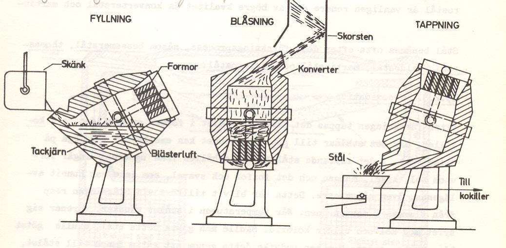
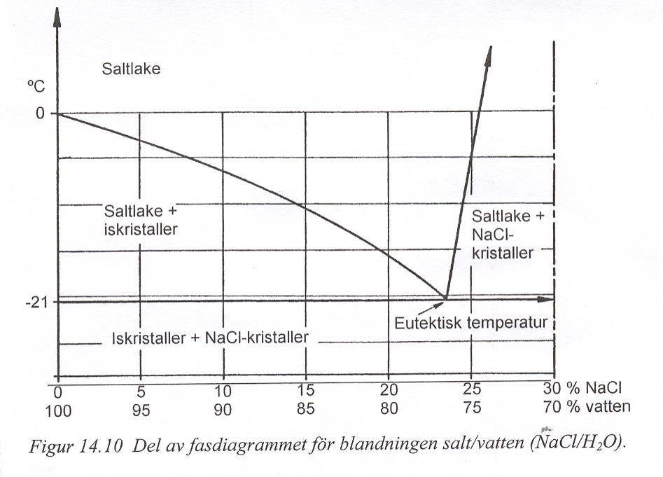
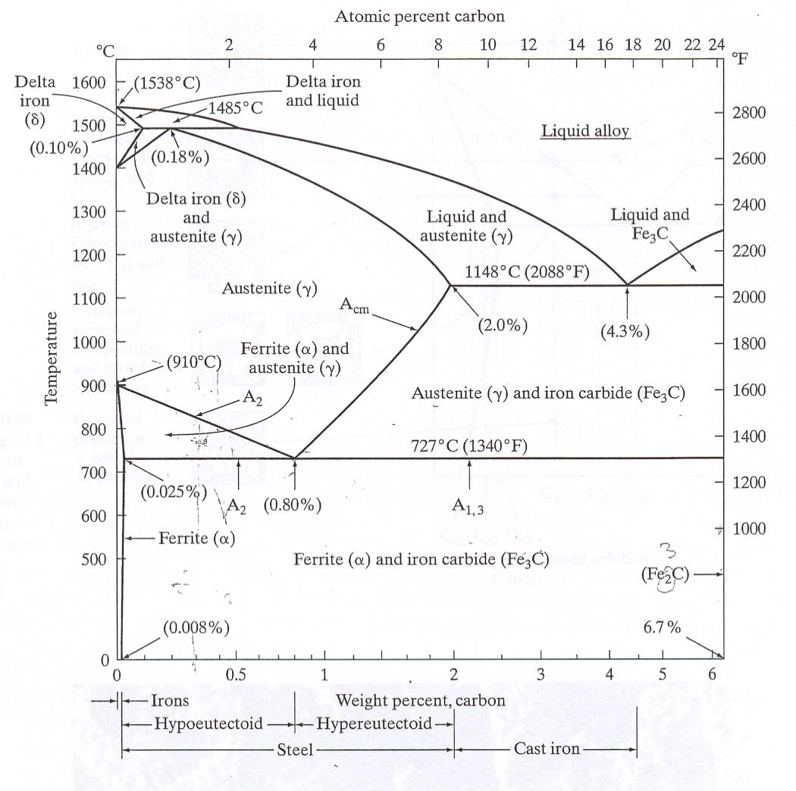
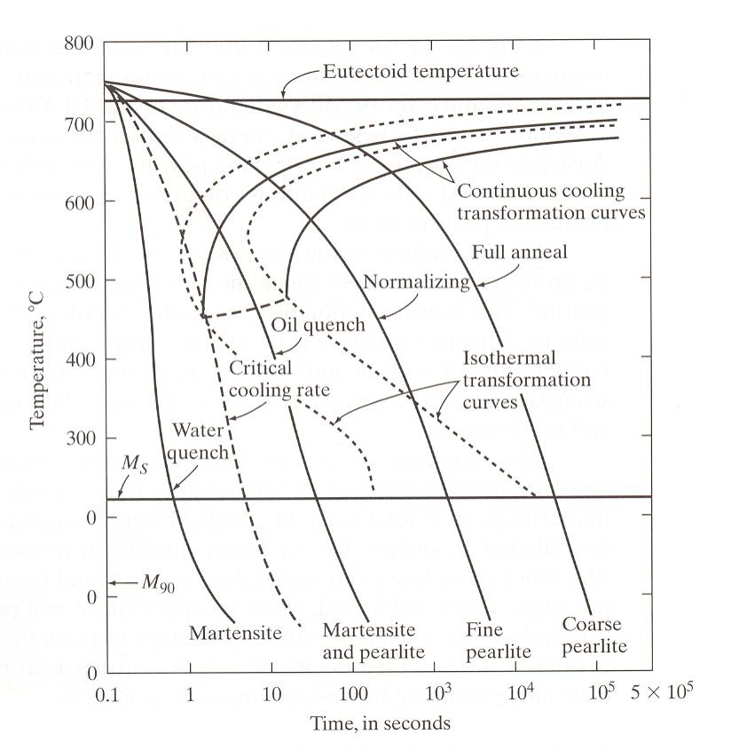
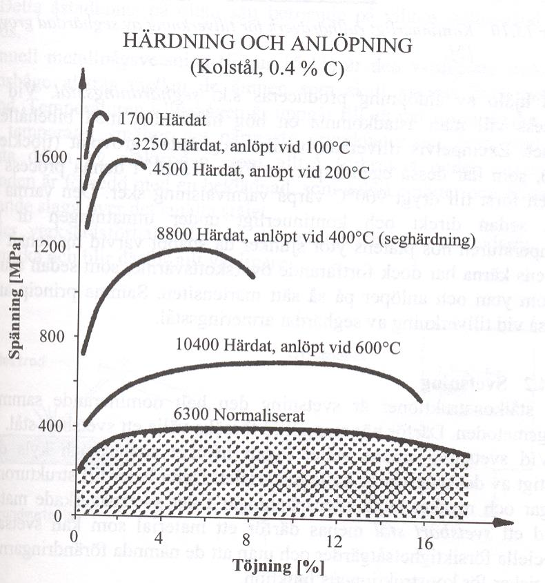
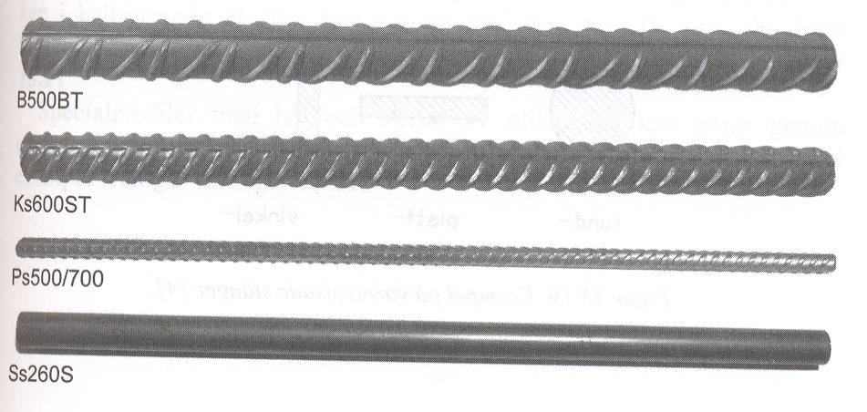
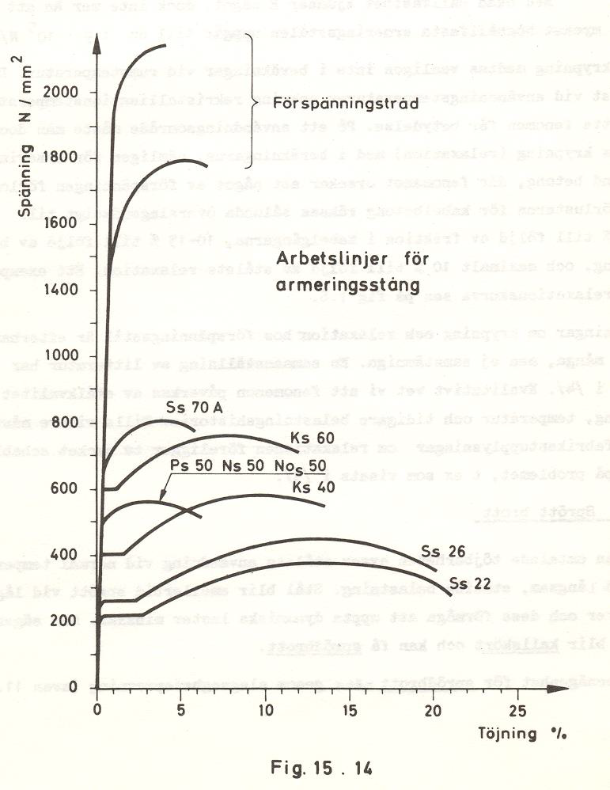

Kafli - Stál
============

Stál er nafnið á efni þar sem frumefnið járn (Fe) er uppistaðan. Stál er unnið með
bræðslu járnríkra bergefna, og kolinnihald stáls er almennt lægra en 1,8 % þyngdar
(samkvæmt skilgreiningu aldrei hærra en 2%) en alltaf hærra heldur en 0,008 %.
Hugtakið járn á við um frumefnið Fe, en einnig efni þar sem frumefnið er uppistaðan;
yfirleitt sambönd með háu kolefnisinnihaldi, venjulega 2-4 % þyngdar, t.d. pottjárn.
Orðið járn verður hér notað um sambönd þar sem frumefnið Fe er uppistaðan, nema
þegar hugtakið stál á sérstaklega við.
Stál er langmikilvægasti málmurinn í byggingariðnaði og við flytjum inn stál frá
nokkrum mismunandi löndum.

Framleiðsla stáls
~~~~~~~~~~~~~~~~~~~
Járn er um 4,5% jarðskorpunnar, en finnst aðeins í mjög litlum mæli sem hreint efni
(einungis í loftseinum sem náð hafa til jarðar). Efnasambönd sem innihalda málm eru
margvísleg, en t.d. í Svíþjóð er stál nú eingöngu unnið úr samböndunum Fe2O3 og Fe3O4.
Málmgrýtið er malað og sett í háofna (s: masugn), um 30 m á hæð, ásamt slaggmyndandi
efni, oftast kalksteini, og koksi (kol sem hafa verið hituð þannig að rokgjörn efni eru
fjarlægð og eftir stendur létt efni með mjög hátt brunagildi, umbreyting kola í koks, og
annarra hliðstæðra ferla, er á ensku nefnd pyrolysis). Ofninn er mataður ofanfrá en heitu
lofti blásið inn í hann neðanfrá undir miklum þrýstingi, súrefni binst kalki og rýkur upp
sem gas, slaggið sem myndast er nauðsynlegt sem efnahvati og flýtur ofan á járnbráðinni
og ver hana. Slaggi er tappað reglulega af ofninum, efnið er notað í sementsframleiðslu
(slaggsement) og spunnið í þræði fyrir einangrun. Járni er einnig tappað af reglulega, en
vinnslan í heild er í stöðugum gangi.

Teikningin sýnir háofn, hæð
um 30 metrar og hitastig á
mismunandi stöðum í
ofninum.

.. figure:: ./myndir/stal/haofn.png
  :align: center
  :width: 70%

Ofnarnir eru fóðraðir og fóðringin bindur eitthvað af óæskilegum efnum, en járnbráðin
sem kemur úr ofninum er mjög rík á kolefni, mangan og kísil og hentar því ekki í
byggingarvörur (t.d. framleiðslu á bitum eða plötum).
Blandan er því hreinsuð (megnið af kolefninu, mangan og kísilsamböndunum ásamt
fosfór og brennisteinssamböndum er fjarlægt, brennt burtu) í sérstökum ofnum þar sem
lofti (í Kaldo-aðferðinni súrefni) er blásið í gegnum bráðina. Ofnarnir geta tekið 5 – 25
tonn í hvern blástur, sem stendur yfir í um 30 mínútur. Ofnarnir eru fóðraðir, áður
einungis með súrri fóðringu (kvarts) og nefndist aðferðin þá Bessemer. Með súrri
fóðringu næst að binda kolefni, kísil og mangan. Síðar var þróuð basísk fóðring, þar næst
að binda fleiri gerðir af óæskilegum efnum, þessi aðferð er nefnd eftir Thomas.
Venjulegt byggingarstál inniheldur auk járns, kolefni, kísil, mangan, fosfór og
brennistein. 

Kolefni er langmikilvægasta hlutefnið.
Kolefni í járni er á þrennu formi; laust,
cementit (:math:`Fe_3C`) eða sem grafít, megnið af
kolefni í stáli er bundið sem sementit.
Járn hefur nokkra mismunandi fasa og
leysni kols er mismunandi eftir þeim,
eiginleikar eru jafnframt mjög breytilegir
eftir kolefnisinnihaldi og því hvaða fasi er
ráðandi – sjá línurit.

.. figure:: ./myndir/stal/eiginleikarkolefnisinnihald.png
  :align: center
  :width: 70%

.. youtube:: 7E__zqy6xcw

.. admonition:: Hugtök í myndbandi
    :class: tip

      **iron** : járn

      **cast iron** : pottjárn

      **iron ore** : járngrýti

      **blast furnace** : háofn 

    

Fasalínurit
~~~~~~~~~~~

Fasalínurit eru notuð til að sýna mögulegar samsetningar tveggja eða fleiri fasa, þau eru
undirstaða margskonar umræðu um m.a. stál.
Hér verður fyrst tekið dæmi af vatni og hafssalti (NaCl), sjá línurit (línuritin tvö og
dæmið tekið úr Burström, 2001)
Ath: “saltlake” = saltpækill þ.e. vatn + salt í upplausn
Línuritið sýnir fjóra fasa;

1) saltpækill
2) saltpækill með ískristöllum
3) saltpækill með saltkristöllum
4) salt og ískristallar

Dæmi:

Blanda sem samanstendur af (þyngdarhlutföll); 10 % :math:`NaCl` og 90 % vatn.

a) Hvaða fasar eru til staðar við :math:`-10^{\circ}C`
b) Hve stórt er hlutfall ískristalla við :math:`-10^{\circ}C`

Svar:

a) lárétt lína dregin við :math:`-10^{\circ}C` og lóðrétt við 10 % :math:`NaCl`—skurðpunktur í fasa “saltlake + iskristaller” (saltpækill með ískristöllum).

b) Notum jafnvægisregluna; :math:`n_1` = hlutfall ískristalla, :math:`n_2` hlutfall saltpækils; almennt gildir þá fyrir hlutföll eftir láréttu línunni;

    .. math::
      n_1 \cdot l_1 = n_2 \cdot l_2  \qquad \textrm{ásamt} \qquad n_1 + n_2 = 1

    .. math::
      \Rightarrow n_1 \cdot (10-0) = n_2 \cdot (14-10) = (1- n_1) \cdot (14-10)
    
    .. math::
      n_1 = 4/14=0,286 \qquad \textrm{eða} \qquad n_1 = 28,6\%

Almennt dæmi um samsetningu með tveim hlutefnum; A og B – sjá línurit fyrir þriggja
fasa ástand

.. figure:: ./myndir/stal/fasalinurit.png
  :align: center
  :width: 100%

Kolefnisinnihalds stáls og fasalínurit
~~~~~~~~~~~~~~~~~~~~~~~~~~~~~~~~~~~~~~
Í byggingarstáli er kolefnisinnihaldið almennt lægra en 0,30% (verkfærastál hefur hærra
kolefnisinnihald), iðulega er öðrum málmum blandað í stálið; nickel, króm (e:
chromium), molybdenum og mangan en til samans er þessi íblöndun almennt undir 8%. 

Fasalínurit fyrir :math:`Fe-Fe_3C` – sjá einnig næstu mynd

.. figure:: ./myndir/stal/fasalinuritstalslitidC.png
  :align: center
  :width: 100%

Fasar og eiginleikar – samantekt (byggt á Callister, ..)
--------------------------------------------------------

.. list-table:: 
  :widths: 5 5
  :header-rows: 0

  * - Ferrite (:math:`\alpha` iron) BCC
    - General: May be made magnetic at :math:`\vartheta` < 786 :math:`^{\circ}\textrm{C}`, :math:`\rho` = 7.88 :math:`\textrm{g/cm}^3`
      
      Mech. Properties: Soft and ductile.
  * - Austenite (:math:`\gamma` iron) FCC
    - General: Non-magnetic, not stable at :math:`\vartheta` < 727 :math:`^{\circ}\textrm{C}`
  * - Cementite (:math:`Fe_3C`)
    - General: Metastable at temperatures 600 :math:`^{\circ}\textrm{C}` < :math:`\vartheta` < 700 :math:`^{\circ}\textrm{C}`
      
      Mech. Properties: Hard and brittle.
  * - Pearlite
    - General: The microstructure of steel that is slowly cooled through the eutectoid temperature.
      
      Mech. Properties: (naturally) between ferrite and cementite.
  * - Hypoeutectoid alloy
    - Composition to the left of the eutectoid point (0.022 <wt% C < 0.76)
  * - Hypereutectoid alloys
    - Composition to the near right of the eutectoid point (0.76 <wt% C < 2.14)
  * - Eutectoid ferrite
    - The ferrite present in pearlite
  * - Proeutectoid ferrite
    - The ferrit formed at temperature above the eutectoid temperature (only for carbon content in the range 0.022 wt% <C<0.76 wt%)
  * - Proeutectoid cementide
    - Cementite formed in Hypereutectoid alloy before the eutectoid reaction (in the :math:`\gamma + Fe_3C` phase)

Hersla með teygju
~~~~~~~~~~~~~~~~~
Sbr. almennan kafla um styrk og stífleika... 

Hitameðhöndlun
~~~~~~~~~~~~~~
Efnabreytingin sem á sér stað við eutectoid hitastigið þegar austenít (:math:`\gamma`) umbreytist í ferrit
(:math:`\alpha`) og sementít (:math:`Fe_3C`) er hæg og hitastigið getur verið komið niður fyrir eutectoid
hitastigið áður en öll breytingin er um garð gengin. Þegar þetta gerist þá er efnið ekki
stöðugt (ekki í jafnvægi, e: equilibrium). Slíku ferli er almennt lýst með svo kölluðu
TTT línuriti (time- temperature-transformation diagram), línuritið sýnir hvaða tíma
efnabreytingin krefst við stöðugt hitastig undir eutectoid hitanum.... og jafnframt hvaða
innri uppbyggingu stálið fær (pearlite, bainite, martinsite), háð hitastigi.

.. figure:: ./myndir/stal/hitamedhondlun.png
  :align: center
  :width: 80%

Uppbyggingin..

.. list-table:: 
  :widths: 5 5
  :header-rows: 0

  * - Bainite
    - aðeins í stálblöndum (e: alloy steels)
  * - Pearlite
    - sjá línurit
  * - Spheroidite
    - myndað með hitun á bainite eða pearlite upp í hita strax undir
      eutectoid hitanum (og hitastiginu haldið stöðugu í nokkurn
      tíma)
  * - Martinsite
    - fengið með hraðri kælingu á austenite niður í fremur lágan hita

... og eiginleikarnir

.. list-table:: 
  :widths: 5 5
  :header-rows: 0

  * - Pearlite
    - með vaxandi hluta af cementide fæst harðara og stökkara efni.

      Grófgert perlite er seigara heldur en fíngert perlite
  * - Bainite
    - sterkara og harðara heldur en pearlite, eftirsóknarverð blanda
      af styrk og seigju
  * - Spheroidite
    - minni harka heldur en í pearlite, mikil brotorka
  * - Martinsite
    - harðasta og sterkasta stálið, en jafnframt það stökkasta (það er
      hægt að breyta þessu með hitun)

Í reynd er eiginleikum stálsins stýrt með því hvernig efnið er kælt niður (ekki með því að
halda hitastigi þess stöðugu sbr. TTT línuritið) – sjá línurit hér að neðan.
(Í reynd eru línuritin nátengd eins og sést á strikuðu línunum hér að neðan og samanburði
við TTT línuritið).

Y-ásinn nær niður í 0 :math:`^{\circ}\textrm{C}`, það vantar tölurnar 100 og 200 :math:`^{\circ}\textrm{C}` !

Enska orðið “quenching” táknar að heitu stálinu er dýft í vökva; hraðasta kælingin fæst ef
vökvinn er vatn (e: water quenching) en oftar er þó notuð olía.

Áhrif mismunandi hitaherslu á stál eru sýnd á línuriti (Burström, 2001). Sænska hugtakið
“anlöpt vid 400 :math:`^{\circ}\textrm{C}`” táknar að stálið var hitað upp í 400 :math:`^{\circ}\textrm{C}` áður en það var kælt.
Hitastig í upphituninni skiptir miklu máli fyrir endanlega eiginleika, lágt hitastig hefur
lítil áhrif.. Hert stál er hægt að gera seigara með því að hita það upp í 400 :math:`^{\circ}\textrm{C}` og svo
kælt niður á ný, þá er talað um seigherslu og er þetta nú algeng framleiðsluaðferð á
bendistáli.

.. youtube:: 6jQ4y0LK1kY

Suðuhæft stál
~~~~~~~~~~~~~
Rafsuða er algeng samsetning á t.d. bendistáli, og óhjákvæmilega hitnar stálið, amk.
staðbundið við suðuna. Hitunin getur augljóslega haft neikvæð áhrif á efniseiginleikana,
og með hugtakinu “suðuhæft stál” er því átt við stál sem má sjóða án þess að gripið sé til
sérstakra ráðstafana. 

Stálgerðir og einkenni - Bendistál
~~~~~~~~~~~~~~~~~~~~~~~~~~~~~~~~~~
Þegar stál er steypt inn í steypu þá eru í upphafi aðallega um efnafræðilega bindinga að
ræða, en þessir bindingar eru sjaldnast sterkir. Til að bæta tengingu stáls og steypu eru
stangirnar því “prófíleraðar”, t.d. valsaðir kambar í járnið. Því sterkara sem stálið er, því
þéttara er á milli kambanna.

Í Evrópu er nú samkomulag um eftirfarandi merkingar;

.. list-table:: Upphafsstafir í heiti
  :widths: 1 5
  :header-rows: 0

  * - B 
    - bendistál skv. ENV 10 080
  * - S 
    - slétt stöng
  * - K 
    - kambstál 
  * - P
    - prófíleruð stöng
  * - Np
    - soðið bendinet úr prófíleruðum stöngum 

Síðan kemur oft lítið s, sem táknar flotmörk (eða 0,2 % mörkin) og þá kröfugildi fyrir
flotmörkin í MPa.
Stórt S á eftir flotspennugildinu táknar að stálið er suðuhæft (nánast allt bendistál sem er
heitvalsað er suðuhæft).
Kröfur til bendistáls er að finna í staðlinum ÍST 16, sem aftur vísar í Norska staðla (sem
byggja á FS ENV 10080:1995). Stál er flokkað í þrjá flokka eftir (mest)
seigjueiginleikum; A, B og C (staðallinn fjallar bara um B500 seríuna; B500A, B500B,
B500C), A hefur minnsta seigju og C mesta. Hérlendis er almennt miðað við að nota
alltaf stál í flokki C (sama verð, og óheppilegt að blanda saman mismunandi flokkum á
sama byggingarstað).

Stórt T aftarlega í heitinu táknar að stálið er seighert (sjá að framan).

Dæmi um stálflokka (Burström, 2001)

.. admonition:: Aðgát
  :class: caution 

      stálið heitir ekki Ps500/700, Burström notar sömu mynd fyrir tvo gæðaflokka, þ.e. Ps500 og Ps700.

.. figure:: ./myndir/stal/Taflabendistal.png
  :align: center
  :width: 100%

Áður (og heyrist enn!) var slétt stál alltaf kallað St 37 (stál 37, flotspennan í kg/mm2
) í
kerfinu hér að ofan heitir slíkt stál þá væntanlega Ss370S.

Áhugaverðar heimasíður um stál:
http://www.worldsteel.org/
http://www.steeluniversity.org/content/html/eng/default.asp?catid=1&pageid=1016899460
(þessa heimasíðu er hægt að komast á í gegnum fyrri síðuna!)

Heimildir og ítarefni:

P. G. Burström (2001) Byggnadsmaterial – uppbyggnad, tillverkning och egenskaper,
Studentlitteratur, Lund, Sverige

Pétur Sigurðsson, 1993, Smíðamálmar, Pétur Sigurðsson, Reykjavík

FS ENV 120080:1995 Steel for reinforcement of concrete weldable ribbed reinforcing steel B 500
– technical delivery conditions for bars, coils and welded fabric.

W.D. Callister,Jr (2003) Materials Science and Engineering – an introduction, Wiley
International edition, John Wiley & Sons, Inc