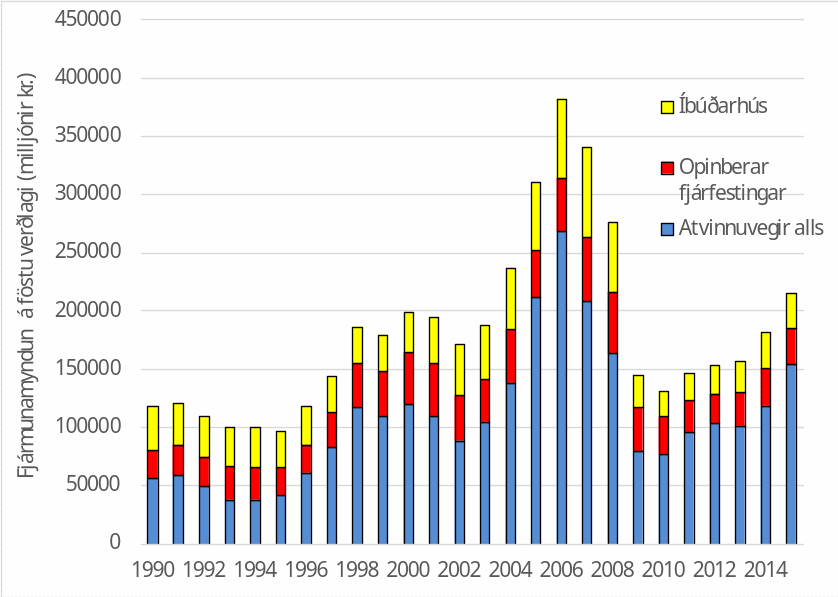
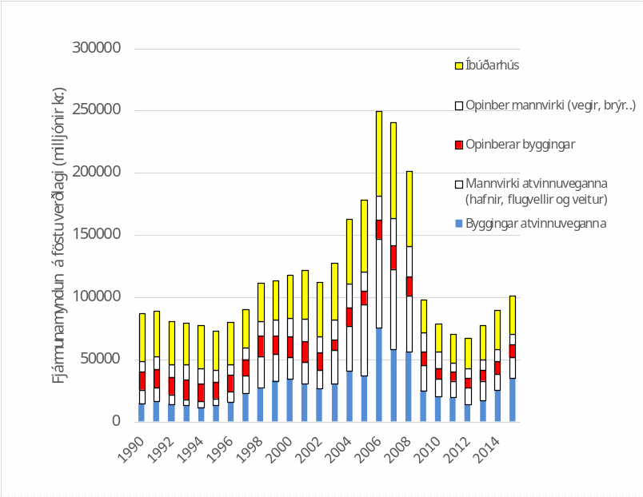
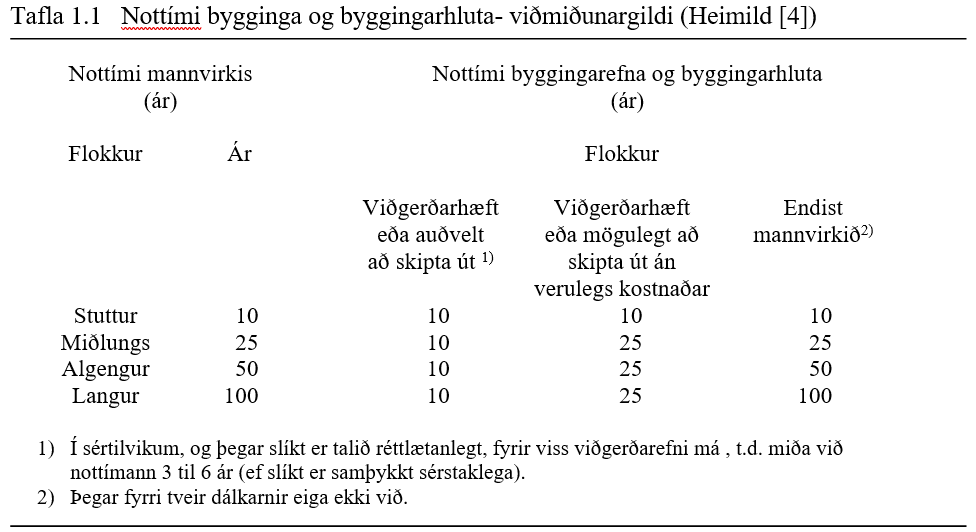

.. container::

   Háskóli Íslands – Umhverfis og byggingarverkfræðideild Húsagerð

   Björn Marteinsson

Kafli - Inngangur
=================

Umfang byggingarstarfsemi og almennar kröfur til mannvirkja
---------------------------------------------------------------

Umfjöllun byggir að hluta á greininni;
Björn Marteinsson (2005) “Hönnun og framkvæmd nýbyggingar með tilliti til endingar”, Byggiðn- Blað Menntafélags byggingariðnaðarins,  Nr. 17 – September 2005, bls. 20-22, Reykjavík

Í iðnríkjum liggja verulegir fjármunir :superscript:`1` í hinu
byggða umhverfi, í Evrópu iðulega ríflega helmingur allra fjármuna [1]
og enn hærra hérlendis eða um 84 %. Af heildar-fjármunamyndun hvers árs
er hlutur byggingariðnaðar ennfremur mjög hár eða iðulega á bilinu 60-70
% á tímabilinu 2000-2015 [2], sjá línurit 1.1 og 1.2. Framleiðsla
byggingariðnaðar er í Evrópu iðulega 10-12 % af vergri þjóðarframleiðslu
en er hérlendis ívið hærri. Stærstur hluti heildarfjármunamyndunar í
mannvirkjum kemur til vegna bygginga ýmiskonar, Línurit 1.2, en hafa
þarf í huga að iðulega eru byggingar um helmingur af umfangi mannvirkja
atvinnuveganna þó svo að í þessum lið séu einnig hafnir, vitar og
flugvellir. Umfang byggingariðnaðar er þó í raun mun stærra heldur en
fjármunamyndunin ein ber með sér þar sem þar er ekki tekið tillit til
þess hluta viðhalds mannvirkja sem eigendur sjá sjálfir um.

Orkunotkun vegna byggingariðnaðar og rekstrar bygginga nemur í Evrópu
meira en 40 % af allri orkunotkun og byggingariðnaður er talinn
framleiða um 40 % alls manngerðs úrgangs. Vægi byggingariðnaðarins í
fjárfestingum og nýtingu náttúruauðlinda er þannig umtalsvert.

Það er því ekki að ósekju að Evrópusambandið setur í ”Samþykkt um
verslun með byggingavörur” (sem einnig hefur gildi hérlendis) fram
kröfur til bygginga, sem eiga að tryggja að hagkvæmni ráði för og að
áhrif á umhverfi íbúa og nágranna verði ásættanleg.

Það er því ekki að ósekju að Evrópusambandið setur í „Construction
Products Regulation“ :superscript:`2` [3] frá 9. mars 2011
fram kröfur til bygginga, sem eiga að tryggja að hagkvæmni ráði för og
að áhrif á umhverfi íbúa og nágranna verði ásættanleg.

Í aðfararorðum varðandi gildi reglugerðarinnar er lýst í nokkrum
tölusettum greinum forsendum og tengslum CPR við þjóðarákvæði í hverju
ríki. Þar kemur m.a. fram (í 4 lið) að gert er ráð fyrir því að hvert
land um sig setji reglur um (í þýðingu höfundar) „ ákvæði sem ekki
einvörðungu taka mið af öryggi bygginga og annarra mannvirkja heldur
einnig heilsu, endingu, orku hagkvæmni, varðveislu umhverfis, hagrænum
þáttum og öðrum mikilvægum þáttum fyrir almanna hagsmuni“.

Í reglugerðinni eru síðan sjö grunnkröfur nánar skilgreindar í viðauka
(Annex 1) við skjalið.

.. [1]   Fjármunir eru allar afskrifanlegar eignir (því ekki meðtalið t.d sparifé, hlutabréf eða lífeyrissparnaður)
.. [2]   Tekur við af eldri kröfum í „Construction Products Directive“ frá 1989 [3], en breyting í grunnkröfum ekki áberandi

Grunnkröfur til mannvirkja í Evrópusambandinu (EU; Construction Products Regulation )
~~~~~~~~~~~~~~~~~~~~~~~~~~~~~~~~~~~~~~~~~~~~~~~~~~~~~~~~~~~~~~~~~~~~~~~~~~~~~~~~~~~~~

Eftirfarandi texti (skáletraður) er þýðing höfundar á grunnkröfunum ;

*Mannvirki í heild og einstakir hlutar þeirra skulu henta þeirri notkun
sem þeim er ætluð, að teknu sérstöku tilliti til hollustu og öryggis
þess fólks sem að þeim kemur allan notkunartíma mannvirkjanna. Að
uppfylltu eðlilegu viðhaldi skulu mannvirki uppfylla þessar grunnkröfur
til mannvirkja í hagkvæman notkunartíma.*

*1. Aflfræðileg mótstaða og stöðugleiki*

*Mannvirki skulu þannig hönnuð að komið sé í veg fyrir að álag, sem
líklegt er að mannvirki verði fyrir, valdi;*

a. *hruni*

b. *verulegum formbreytingum*

c. *skemmdum á öðrum hlutum vegna formbreytinga á burðarvirki*

*2. Öryggi í eldsvoða*

*3. Hreinlæti, heilsa og umhverfi*

*Mannvirki skal þannig hannað og byggt að það muni ekki allan
framkvæmdar- og notkunartíma þess ógna hreinlæti eða heilsu
framkvæmdaraðila, notenda eða nágranna né hafa óeðlilega mikið álag í
för með sér á gæði umhverfis eða loftslags, sérstaklega að því er varðar
eftirfarandi;*

a. *mengandi lofttegundir*

b. *efnagjöf hættulegra efna, rokgjarnra efna, gróðurhúsagasa eða
   hættulegra einda til inni- eða útilofts*

c. *hættuleg geislun*

d. *efnagjöf hættulegra efna til grunnvatns, sjávar, yfirborðsvatns eða
   jarðvegs*

e. *efnagjöf hættulegra efna í drykkjarvatn eða efnagjöf sem hefur önnur
   óheppileg áhrif á drykkjarvatn*

f. *gölluð förgun frárennslis vatns, brunaloftegunda (e. flue gas),
   fasts eða fljótandi sorps*

g. *raki í hluta mannvirkis eða á yfirborðum mannvirkja.*

*4. Öryggi og aðgengi í notkun*

*Mannvirki skal þannig hannað og byggt að það bjóði ekki upp á
óásættanlega hættu á slysum eða skemmdum í þjónustu eða notkun s.s.
renna til, detta, brenna, raflost, sprengihættu eða ránum. Sérstaklega
skal mannvirki hannað og byggt þannig að aðgengi og notkun sé möguleg
fyrir fatlaða.*

*5. Varnir gegn hávaða*

*Mannvirki skal þannig hannað og byggt að hávaðastig sem notandi eða
fólk í grennd upplifir sé haldið innan þeirra marka að það ógni ekki
heilsu þeirra og geri þeim mögulegt að sofa, hvílast og vinna við
ásættanlegar aðstæður.*

*6. Orkuhagkvæmni og orkunýting*

*Bygging mannvirkja og upphitun, kæling, lýsing og loftræsing skal
þannig hannað og byggt að orkunotkun sé lítil þegar tekið er tillit til
notenda og umhverfisaðstæðna. Mannvirki skulu jafnframt vera orkunýtin
og krefjast eins lítillar orku og mögulegt er í byggingu og förgun.*

*7. Sjálfbær notkun náttúrulegra auðlinda*

*Mannvirki skulu hönnuð, byggð og fargað með það að leiðarljósi að
notkun náttúrulegra auðlinda sé sjálfbær og sérstaklega skal hafa í
huga;*

a. *að endurnýta eða endurvinna mannvirki, efni og byggingarhluta eftir
   rif*

b. *endingu mannvirkja*

c. *notkun umhverfisvænna hráefna í mannvirkjagerð*

Grunnkröfurnar og aðfararorðin varða ýmis öryggismál og heilsutengd mál
að því er varðar efnagjöf og raka, aðgengi allra, varnir gegn hávaða,
orkuhagkvæmni og sjálfbæra notkun náttúrulegra auðlinda. Í grunnkröfunum
er hinsvegar ekki tekið á notagildi eða hagkvæmni mannvirkja, né röð af
gildum sem beint varða lífsgæði. Á slíkum málum þarf þá að taka í lögum
og reglugerðum hvers lands, enda ljóst að hugmyndir manna um þessi mál
geta verið mjög mismunandi og jafnvel farið eftir landsvæðum og
menningu.

Línurit 1.1 Fjármunamyndun á Íslandi árin 2000-2015, milljónir króna á
föstu verðlagi. (heimild: Hagstofan)

Línurit 1.2 Sundurgreining fjármunamyndunar í mannvirkjagerð á Íslandi
árin2000-2015, milljónir króna á föstu verðlagi (heimild: Hagstofan)

Grunnkröfurnar gera þannig ráð fyrir að bygging (og mannvirki almennt)
uppfylli ákveðin lágmarksskilyrði varðandi gæði strax í upphafi og síðan
alla tíð sem hún er í notkun, með eðlilegu viðhaldi. Kröfur til
upphafsgæða verður að sækja í byggingarreglugerðir svo lengi sem þær eru
ekki skilgreindar beint af verkkaupa, en þá er eftir að skoða tímaháð
áhrif (hrörnun). Það er því nauðsynlegt að skilgreina hvað sé eðlilegur
nottími (e: service life) bygginga. Í ýmsum gögnum frá Evrópusambandinu
og ISO stöðlum má finna ábendingar um slíkt en enn sem komið er eru ekki
settar fram beinar kröfur heldur einvörðungu um viðmiðunargildi að ræða
(sjá heimildirnar [4] og [5]). Í þessum gögnum er lágmarksendingu
bygginga og byggingahluta skipt í flokka þar sem ending byggingar í
heild er háð tegund þeirra og ending einstakra byggingarhluta síðan háð
tegund mannvirkis og hversu auðvelt (og kostnaðarsamt) er að sinna
viðhaldi hvers og eins. Í töflu 1.1 eru sýnd dæmi um slík lágmarksgildi
( uppgefin viðmiðunargildi vegna tækniumsagna European Organisation for Technical Approvals 
(EOTA), svo nefndra European Technical Approval Guidelines (ETAG).

Algengt viðmiðunargildi fyrir nottíma íbúðarhúsa er 50 ár (í öðrum
heimildum oft 60 ár) en iðulega er miðað við að vandaðar opinberar
byggingar skuli standa minnst 100 ár. Útfrá töflunni má t.d. sjá að
undirstöður eiga að endast jafnlengi og byggingin (óháð endingartíma
hennar) en utanhúss klæðningar falla væntanlega undir viðmiðunargildi í
miðdálknum og þá með endingartími upp á 25 ár.

**Heimildir**

Umfjöllun byggir að hluta á greininni;

Björn Marteinsson (2005) “Hönnun og framkvæmd nýbyggingar með tilliti
til endingar”, Byggiðn- Blað Menntafélags byggingariðnaðarins, Nr. 17 –
September 2005, bls. 20-22, Reykjavík

[1] CIB (1999) Agenda 21 on Sustainable construction, CIB Report
Publication 237

[2] Hagstofan () efni tekið af vef stofnunarinnar

[3] European Union (2011) *REGULATION (EU) No 305/2011 OF THE EUROPEAN
PARLIAMENT AND OF THE COUNCIL of 9 March 2011 laying down harmonised
conditions for the marketing of construction products and repealing
Council Directive 89/106/EEC*, European Union, Brussel

[4] EOTA (1999) EOTA Guidance Document 002, Guidelines for European
Technical Approval, European Technical Approvals and Harmonized
Standards, Edition December 1999

[5] ISO (2000) Buildings and constructed assets - Service life planning
– Part 1: General principles, ISO 15686-1:2000

Byggingarlög, reglugerðir og staðlar
----------------------------------------

Eftirfarandi lög og reglugerðir varða byggingarstarfsemi og hönnuði
sérstaklega (sjá
`http://umhverfisraduneyti.is <http://umhverfisraduneyti.is/>`__\ ->
lagagögn -> reglugerðir (kafli V. Skipulags- og byggingarmál) eða**
heimasíðu Húsnæðis- og mannvirkjastofnunar;
\ `www.hms.is <http://www.hms.is/>`__\  :
`Lög og reglugerðir <https://hms.is/husnaedis-og-mannvirkjastofnun/log-og-reglugerdir-hms>`]

- Lög nr. 160/2010 um mannvirki (Tóku gildi 1. janúar 2011. Breytt með l. 126/2011 (tóku gildi 30. sept. 2011), l. 131/2011 (tóku gildi 1. jan. 2012) og l. 80/2012 (taka gildi 1. jan. 2013).)

- Byggingarreglugerð nr. 112/2012 (með áorðnum breytingum). Byggingarreglugerðin nr. 112/2012 (eða breytta útgáfan 1173/2012) er skrifuð sem útfærsla á mannvirkjalögunum og er aðalatriði í hönnun (og fyrir námsgreinina Húsagerð).

Byggingarreglugerðir (í Evrópu almennt) hafa verið byggðar á s.k.
kröfulýsingum, en skulu nú byggðar á s.k. efndalýsingum. Íslenska
byggingarreglugerðin er sambland af báðum þessum aðferðum.

.. admonition:: Skilgreining
    :class: Definition
    
    Kröfulýsingar (e: descriptive requirements)

    Þetta eru meira eða minna skýr fyrirmæli um hvernig frágangi skuli
    háttað, dæmi úr reglugerðinni:

    *103.3 Ef sérbýlishús eru sambyggð skulu veggir á milli þeirra vera
    EI90. Veggirnir skulu ná út að ystu vegg- og þakklæðningum.*

.. admonition:: Skilgreining
    :class: Definition

    Efndalýsingar (e:functional requirements)

    Árangri sem skal náð er lýst, dæmi úr reglugerðinni:

    Markmið og algild hönnun.

      6.1.1. gr.

      *Markmið.*

      Mannvirki skulu þannig hönnuð og byggð að þau henti vel til fyrirhugaðra
      nota. Við ákvörðun á útliti þeirra, efnisvali, litavali og gerð skulu
      gæði byggingarlistar höfð að leiðarljósi.

      Tryggt skal fullt öryggi fólks og dýra innan bygginga og á lóðum þeirra.
      Byggingarnar og lóðir þeirra skulu vera vandaðar og hagkvæmar m.t.t.
      öryggis fólks, heilbrigðis, endingar, aðgengis og afnota allra.

      Við gerð og hönnun bygginga ber að taka tillit til orkunotkunar, áhrifa
      þeirra á umhverfið og gæta að hagkvæmni við rekstur, þrif og viðhald.

      Ávallt skal leitast við að beita algildri hönnun þannig að byggingar og
      lóðir þeirra séu aðgengilegar öllum án sérstakrar aðstoðar.

      Við gerð og hönnun bygginga skulu valin efni og aðferðir er henta við
      íslenskar aðstæður, leitast við að lágmarka neikvæð umhverfisáhrif, velja vistvænar lausnir
      þar sem það er mögulegt og miða hönnunina við allan líftíma þeirra.
      Leitast skal við að lágmarka auðlindanotkun og hámarka notagildi,
      hagkvæmni og þægindi notenda.

      Við byggingar eða innan þeirra skal vera fullnægjandi aðstaða fyrir
      reiðhjól, barnavagna, hjólastóla, sleða o.þ.h. og geymslu þeirra í
      samræmi við eðli byggingarinnar.

      Þess skal gætt að byggingar hafi eðlilega tengingu við lóð og annað
      umhverfi. Við hönnun og byggingu þeirra skal huga að eðlilegum
      innbrotavörnum.

Það er fyrirsjáanlegt að einnig íslenska reglugerðin mun í vaxandi mæli
taka mið af efndalýsingum, en þetta mun þá einnig krefjast upplýsinga og
tilvísunartexta í ritum til að auðvelda hönnuðum og verkkaupum að gera
grein fyrir hönnun og lokagæðum.

*Efnda- og gæðalýsingar*

Erfitt að lýsa gæðum (gæðalýsingar eru skammt á veg komnar í
byggingariðnaði hér sem erlendis) og því algengt að sjá texta sem byggir
á samanburði, dæmi “læsingar skulu vera af gerð ASSA, eða önnur vara af
sambærilegum gæðum” í opinberum verklýsingum er nú bannað að taka
viðmiðun af skráðum vörumerkjum, og þá vaknar spurningin; hvernig lýsir
maður gæðum t.d. læsingar?

*Staðlar*

Á Íslandi gilda íslenskir staðlar, og stjórnvöld hafa lýst yfir að EN
staðlar skuli gilda, en áður en þeir hafa gildi þarf að taka þá upp með
formlegum hætti (í höndum Staðlaráðs Íslands) – slíkir staðlar fá þá
alltaf forskeytið ÍST t.d.

ÍST EN ISO 6946:1996 Building components and building elements - Thermal
resistance and thermal transmittance - Calculation method

Greinar sem textinn byggir á;

Benedikt Jónsson (2003) “Vottun byggingarvöru – staðfesting á samræmi”,
grein í Tæknivísir - Blað Byggingartæknifræðinema, 27. árg. 2003

Hafsteinn Pálson (2004) “Samhæfðar kröfur til byggingavara – CE
merking”, grein í ... upp í vindinn- Blað Umhverfis og
byggingarverkfræðinema, 23. árg. 2004

Hafsteinn Pálson (2005) “Verkefni Byggingarstaðlaráðs- séríslensk
staðlavinna”, grein í Tæknivísir - Blað Byggingartæknifræðinema, 29.
árg. 2005

Húsagerð – þekkingarsvið
----------------------------

Í byggingarreglugerð (og Byggingavörusamþykkt) er sett fram sú krafa til
(íbúðar)húsnæðis að það sé allt í senn; vistarvera sem uppfyllir kröfur
eiganda til öryggis, hollustu og þæginda og er hagkvæmt í rekstri. Þetta
gerir að verkum að efndalýsing (eða kröfulýsing) verður margþætt og huga
þarf að mjög ólíkum þáttum.

- Útlit, fyrirkomulag og tengsl við umhverfi
- Burðarþol
- Varmaeinangrun
- Loftþéttleiki
- Vatnsþéttleiki
- Innbrotsvörn (öryggi)
- Takmarka innsýn
- Hljóðdeyfing
- Brunaþol
- Hollusta (gæði innilofts) (e: Healthy buildings)
- Lagnakerfi; rafmagn, heitt og kalt vatn, hitun, kæling og frárennsli
- Lýsing og birta
- Kostnaður/hagkvæmni (LCC e: life cycle cost eða WLC e: whole life cost)
- Ending
- Rekstur og viðhald (e: facility management)
- Umhverfisáhrif (LCA e: life cycle assessment)
- Sjálfbærar byggingar (e: sustainable buildings), “Núll orku hús”