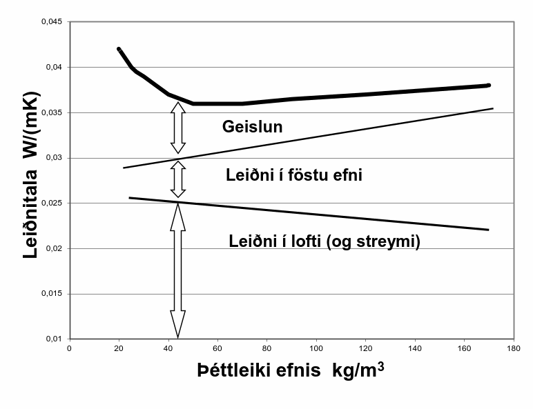
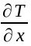
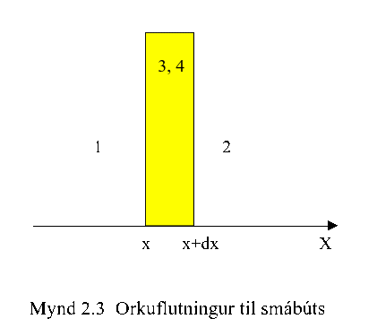
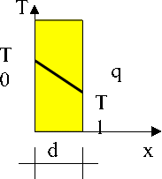
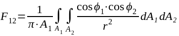

.. container::

Varmaflutningur, kólnunartölur og hitastig í sniði
==================================================

Almennt
-------

Umfjöllun þessi varðar grunnhugtök varmaflutnings, þ.e. aðallega verður
fjallað um hitastig í sniði og varmaflutning í einni vídd, við stöðugt
hitaástand. Vitnað er til gildandi staðla og er listi yfir staðla, önnur
heimildarrit og ítarefni aftast í kaflanum.

Fjöldi staðla sem hér hafa gildi (ÍST EN og ÍST EN ISO seríur) fjalla um
útreikning á varmaflutningi og er erfitt að henda reiður á þeim öllum
nema fyrir sérstaka áhugamenn um staðla eða útreikning varmataps. Helstu
ÍST EN staðlar sem snerta efni þessa kafla eru eftirfarandi;

- ÍST EN ISO 6946:1996 *Building components and building elements - Thermal
resistance and thermal transmittance - Calculation method*
- ÍST EN 10456:1999 *Building materials and products - Procedures for
determining declared and design thermal values*
- ÍST EN 12524:2000 *Building materials and products - Hygrothermal
properties - tabulated design values*

ÍST EN ISO 6946:1996 vísar ennfremur til ISO staðalsins
- ISO 7345:1987 *Thermal insulation – Physical quantities and definitions*

Til þess að gera útreikninga aðgengilegri þá er í staðlinum DS 418
“Beregning av byggnaders varmetab” teknar saman algengustu aðferðir í
samræmi við gildandi staðla, þó stundum með nokkrum einföldunum, og
íslenskur staðall ÍST 66 sem vísar til danska staðalsins. Umfjöllun hér
verður í samræmi við DS 418, en þess verður getið sérstaklega þegar
aðferðir DS 418 víkja frá EN stöðlunum.

Varmaflutningur getur átt sér stað með þrennu móti; leiðni, streymi og
geislun.

.. admonition:: Skilgreining
   :class: definitions
   
   **Leiðni**
   Varmaflutningur í efni (e. conduction) , hreyfiorka (háð hitastigi) berst frá atómi til atóms.
   
   .. figure:: ./myndir/kafli02/leidni.png
   
   **Streymi**
   Varmaflutningur í vökvum og lofttegundum á hreyfingu. Orkan
   berst sem straumur atóma eða sameinda (t.d. lofthreyfing). Í varmafræðum
   er hugtakið streymi (e:convection) einnig notað sérstaklega fyrir
   varmaskipti milli loftegunda vökva á hreyfingu og fasts efnis.
   
   .. figure:: ./myndir/kafli02/streymi.png

   **Geislun**
   Allir hlutir geisla út orku í hlutfalli við hitastig þeirra. Geislun á
   sér ekki stað í föstu efni heldur aðeins í lofttegundum og að einhverju
   leyti í vökvum.
   
   .. figure:: ./myndir/kafli02/geislun.png

Fleiri skilgreiningar

Orðin varmaflæði og varmastreymi eru iðulega notuð sem samheiti í
stöðlunum þegar fjallað er um byggingar eða byggingarhluta, en orðin
hafa sérmerkingu þegar fjallað er um varmaflutning í efni eða
lofttegundum.

.. list-table:: Skilgreiningar ISO 7345:1987
  :widths: 5 5 5
  :header-rows: 0

  * - :math:`Q`
    - varmaflutningur
    - :math:`J`
  * - :math:`\Phi = \frac{dQ}{dt}`
    - Varmaflutningur á tímaeiningu (e:heat flow rate)
    - :math:`W`
  * - :math:`q=\frac{d\Phi}{dA}`
    - Þéttleiki varmaflutnings; varmaflutningur á flatareiningu (e:density of heat flow rate)
    - :math:`W/m^2`
  * - :math:`q_l=\frac{d\Phi}{dl}`
    - Línu-þéttleiki varmaflutnings; varmaflutningur á lengdareiningu (e: linear density of heat flow rate)
    - :math:`W/m`
  * - :math:`\overrightarrow{q} = -\lambda\cdot \text{grad}T`
    - Varmaleiðni :math:`\lambda` (efniseiginleiki) er gildi sem uppfyllir skilyrði
      jöfnunnar, þ.e. þéttleiki varmaflutnings (vigur) er margfeldi
      varmaleiðni og hitastiguls (vigur)
    - :math:`W/(m\cdot K)`
  * - :math:`R=\frac{T_1-T_2}{q}`
    - Varmaflutningsmótstaða; hitamunur deilt með þéttleika varmaflutnings
    - :math:`(m^2\cdot K)/W`   
  * - :math:`R_n=\frac{d_n}{\lambda_n}`
    - Fyrir efnislag (og að uppfylltum nokkrum skilyrðum, sjá neðar) þá einfaldast varmaflutningsmótstaðan í formið (fyrir
      efnislag n) þar sem :math:`d_n` er þykkt efnislagsins.
    - :math:`(m^2\cdot K)/W` 
  * - 
    - Línuleg varmaflutningsmótstaða; skilgreiningin er sambærileg og að ofan
      fyrir varmaflutningsmótstöðu
    - :math:`(m\cdot K)/W` 
  * - :math:`h=\frac{q}{T_s-T_a}`
    - Varmaflutningstala yfirborðs = þéttleiki varmaflutnings deilt
      með hitamun milli yfirborðs og umhverfis
    - :math:`W/(m^2 \cdot K)` 
  * - :math:`R=\frac{1}{h}`
    - Stundum (m.a. í DS 418) er notað andhverfa gildið; þ.e. Varmaflutningsmótstaða yfirborðs
    - :math:`W/(m^2 \cdot K)` 
  * - :math:`R_{si}=\frac{1}{h_{si}}`
    - Varmaflutningsmótstaða yfirborðs, si stendur fyrir "surface interior"
    - :math:`W/(m^2 \cdot K)` 
  * - :math:`R_{se}=\frac{1}{h_{se}}`
    - Varmaflutningsmótstaða yfirborðs, se stendur fyrir "surface exterior"
    - :math:`W/(m^2 \cdot K)` 
  * - :math:`\Lambda = \frac{1}{R}`
    - Þéttleiki varmaflutnings á hverja gráðu K frá *einu yfirborði til annars*
    - :math:`W/(m^2 \cdot K)` 
  * - :math:`U = \frac{\Phi}{(T_1-T_2)A}`
    - Kólnunartala, U-gildi; varmaflutnings deilt með hitamun milli umhverfa sitt hvoru megin og flatarmáli
    - :math:`W/(m^2 \cdot K)` 
  * - :math:`C=\frac{dQ}{dT}`
    - Varmarýmd =breyting í varma deilt með breytingu í hitastigi
    - :math:`J/K` 
  * - 
    - Eðlisvarmarýmd = varmarýmd deilt með efnismassa
    - :math:`J/(kg\cdot K)`

Skilyrðin fyrir :math:`R_n`: efnislagið skal vera slétt, jafnþykkt, með skilgreinda leiðnitölu sem er fasti eða breytist
línulega, gegnumstreymisflatarmál varmaflutnings er fasti, þ.e. einvíður
varmaflutningur, og viðmiðunarhitastigin :math:`T_1` og :math:`T_2`
á yfirborðum eru skilgreind.

Vegna þess hvernig skilgreining varmaflutningsmótstöðu (og línulegrar
varmaflutningsmótstöðu) er háð viðmiðunarhitastigum, þá verður alltaf að
gefa hitastigin upp þegar gildi fyrir mótstöðurnar eru gefin upp – ath:
sérstaklega kuldabrýr!.

Almennar líkingar

Kyrrstætt loft; Varmaleiðni ; :math:`\lambda = 0,024 \cdot (1+0,0033T)`,:math:` W/(m\cdot K)`

Varmaflutningur og jafna Fourier's
----------------------------------

Þegar hitastigull (e: temperature gradient) er til staðar í efni þá á
sér stað varmaflutningur, sem almennt er skilgreindur sem jákvæður í
jákvæða stefnu hnitakerfis;

.. admonition:: Jafna 2.1
   :class: jafna

   .. math::
      \Phi = -\lambda \cdot A \cdot \text{T} \qquad \qquad \text{(almennt)}
   .. math::
      \Phi = -\lambda \cdot A \cdot \frac{\partial T}{\partial x} \qquad \qquad\text{(gildir fyrir eina stefnu í hnitakerfi)}

þar sem 

.. list-table:: 
  :widths: 5 5 5
  :header-rows: 0

  * - :math:`\Phi`
    - varmaflutningur
    - W
  * - :math:`\lambda`
    - leiðnitala
    - :math:`W/(m\cdot K)`
  * - :math:`A`
    - flatarmál
    - :math:`m^2`
  * - :math:`\text{grad}T`
    - hitastigull
    - :math:`K`
  * - :math:`\frac{\partial T}{\partial x}`
    - hitastigull eftir x-ás
    - :math:`K/m`

.. figure:: ./myndir/kafli02/varmaflutningur.png
  :align: center
  :width: 30%

Mynd 2.1. Hitastigull og varmaflutningur

Lögmálið um varmaflutning háð hitastigul, jafna 2.1, er kennt við
Fourier.

Fyrir einvíðan varmaflutning, við stöðug hitaskilyrði, er lausn á jöfnu
2.1 auðfundin og með innsetningu á viðeigandi stærðum fæst;

.. admonition:: Jafna 2.2
   :class: jafna

   .. math:: \Phi = -\frac{\lambda}{d}\cdot A \cdot (T_1-T_0)

þar sem 

.. list-table:: 
  :widths: 5 5 5
  :header-rows: 0

  * - :math:`\Phi`
    - varmaflutningur
    - :math:`W`
  * - :math:`\lambda`
    - leiðnitala
    - :math:`W/(m\cdot K)`
  * - :math:`d`
    - þykkt efnislags
    - :math:`m`
  * - :math:`T_0,T_1`
    - hitastig á yfirborðum efnislags
    - :math:`K \text{eða} ^{\circ}C`
  * - :math:`A`
    - flatarmál þvert á stefnu varmaflutnings
    - :math:`m^2`        

Leiðnitalan, sem er skilgreind þannig að jafna 2.1. sé uppfyllt (sjá
skilgreiningar fremst í kaflanum), er efnisháð og tekur mið af
heildarorkuflutningi í gegnum efnislagið. Þessi flutningur er iðulega
samsettur úr öllum þrem flutningsleiðunum; leiðni, streymi og geislun
(mynd 2.2) og leiðnitalan því oft mjög breytileg eftir þéttleika efna og
auðvitað einnig eftir hitastigi og rakainnihaldi (hér vísast til rita um
efnisfræði). Í reynd (í mælingu á efniseiginleikum) getur verið erfitt
að skilja á milli áhrifa einstakra flutningsleiða í efni, en leiðnitalan
er ákaflega handhæg í útreikningum. Varmatap vegna leiðni um
byggingarefni er háð leiðnitölu efna og er fjallað almennt um þann
efniseiginleika í skýrslunni ISO/TR 9165:1988. Gerð er grein fyrir
hugtökum og ákvörðun hönnunargildis leiðnitölu. Í staðlinum ÍST EN ISO
10456:1999 er gerð grein fyrir ákvörðun uppgefins gildis og
hönnunargildis leiðnitölu útfrá mæligildum, þar sem tekið er tillit til
annars efnisraka – og hita heldur en mæligildi miðast við með
leiðréttingarstuðlum. Aðferðir staðalsins eru ekki í fullu samræmi við
ofannefnda skýrslu þar sem staðallinn tekur ekki tillit til annarra
áhrifa en hita og raka.

Mynd 2.2. Varmaflutningur í þurri steinull, skipt eftir flutningsleiðum.

.. admonition:: Skilgreiningar ISO/TR 9165:1998
   :class: definitions

      :math:`\lambda_{mean}` meðal (mæld) leiðnitala

      :math:`\lambda_{b}` grunntala leiðni (e. basic thermal conductivity)

      :math:`\lambda_{p}` hönnunargildi (e. practical value - design value)

      :math:`\alpha_{\lambda}` leiðréttingarstuðull á leiðni

      :math:`s_{\lambda}` áætlað staðalfrávik leiðnitölu 

.. admonition:: Jafna 2.3
    :class: jafna

      :math:`\lambda_b = \lambda_{mean} + \alpha_{\lambda} \cdot s_{\lambda}`

.. admonition:: Vísbending
    :class: hint

      Leiðréttingarstuðullinn :math:`\alpha_{\lambda}` tekur tillit til áhrifa;

      * breytileika (e: variability) í efni

      * hitastigs

      * efnisþykktar

      * efnisraka

      * öldrunar

      * lofthleypni

      * framkvæmdar

Í viðauka (Annex) við skýrsluna er fjallað um varmaflutningsleiðir í
einangrunarefnum, samband milli leiðni, rúmþyngdar, leiðni lofts og
efnis og áhrif geislunar. Síðan er talsverð umfjöllun um
leiðréttingarstuðla :math:`\Delta \lambda` fyrir mismunandi áhrif þannig að meta má suma
stuðlana en aðra ekki. Það er hvergi sagt skýrt hvernig reikna skuli
:math:`\lambda_p` en virðist sem það sé hugsað eins og jafna 2.4 sýnir:

.. admonition:: Jafna 2.4
    :class: jafna

      :math:`\lambda_p = \lambda_b + \Delta\lambda_m + \Delta\lambda_t`

Hönnunargildi leiðnitölu er þá fundið á sambærilegan hátt og tíðkast
hefur á Norðurlöndunum um árabil, sjá t.d. *“Den nordiske komité for
bygningsbestemmelser”* (1989).

Í samræmi við þessar reglur eru hönnunargildi leiðnitalna fyrir öll
algengustu byggingarefnin birt í staðlinum ÍST EN 12524:2000. Uppgefin
leiðnitala tekur samkvæmt hefð tillit til allra þriggja
varmaflutningsleiða í efni; leiðni, geislunar og streymis. Ítarlegar
töflur yfir leiðnitölur má finna víða, t.d. í ritinu *Varmaeinangrun húsa*
eftir þá Guðmund Halldórsson og Jón Sigurjónsson (1992). Leiðnitölur
efna eru einnig gefnar upp af framleiðendum.

Þegar reikna á varmaflutning samkvæmt jöfnu 2.1 (eða 2.2) þá þarf
hitadreifingin augljóslega að vera þekkt. Jöfnu hitasviðsins má ákvarða
útfrá jafnvægislíkingum fyrir smábút. Með hliðsjón af jöfnu 2.1 og mynd
2.3 (smábútur með þverskurðarflatarmálið A og þykktina dx) fæst fyrir
einvítt tilfelli (jafnvægi varmaflutnings, þ.e. varmaflutningur á
tímaeiningu dt) og fyrir snið þar sem þéttleiki varmaflutnings er fasti
(þ.e. umfjöllunin gildir t.d. ekki fyrir röraeinangrun!);

.. admonition:: Jafna 2.5
    :class: jafna

      a. Varmaflutningur inn frá vinstri

      :math:`\Phi_1 = - \lambda \cdot A \cdot \frac{\partial T_x}{\partial x}`

      b. Varmaflutningur út til hægri

      :math:`\Phi_2 = - \lambda \cdot A \cdot \frac{\partial T_{x+dx}}{\partial x}`
      
      c. Varmagjöf

      :math:`\Phi_3 = A \cdot dx \cdot \Phi''`
      
      d. Uppsafnaður varmi

      :math:`\Phi_4 = A \cdot dx \cdot \rho \cdot c_p \cdot \frac{\partial T}{\partial t}`
      
Fyrir varmaaukningu smábútsins sem jákvæða stærð;

:math:`\Phi_4 = \Phi_1 - \Phi_2 + \Phi_3`

Setjum inn jöfnurnar 2.5a-d (gerum hér ráð fyrir að leiðnitalan sé ekki
háð hitastigi) og styttum. Með “innsæi” (eða samanburði við fyrstu liði
Taylor raðar) sést að :math:`\partial^2 T = (\partial T_{x+dx} - \partial T_x)`, sem gefur jöfnu 2.6.

.. admonition:: Jafna 2.6
    :class: jafna

      :math:`\rho \cdot c_p \cdot \frac{\partial T}{\partial t} = \lambda \cdot \frac{\partial^2 T}{\partial x^2} + \Phi''`

í jöfnum 2.5a-d og 2.6 er skýring tákna eftirfarandi;

.. list-table:: 
  :widths: 5 5 5
  :header-rows: 0

  * - :math:`\rho`
    - þéttleiki efnisins
    - :math:`kg/m^3`
  * - :math:`c_p`
    - eðlisvarmarýmd efnis
    - :math:`J/(kg \cdot K)`
  * - :math:`\frac{\partial T_x}{\partial x} , \frac{\partial T_{x+dx}}{\partial x}`
    - varmastigull í sniðum x og x+dx
    -
  * - :math:`\Phi''`
    - varmagjöf til smábúts
    - :math:`W/m^3` 
  * - ...
    - aðrar stærðir sem fyrr
    - 

Samsvarandi fæst fyrir þrjá ása í rétthyrndu hnitakerfi jafnan 2.7 þegar
notaðar eru tvær einfaldanir; (i) einsátta efni, þ.e. sama leiðnitala í
allar stefnur og (ii) leiðnitalan er ekki hitastigsháð - en auðvelt er
að gera jöfnuna óháða slíkum einföldunum.

.. admonition:: Jafna 2.7
    :class: jafna

      :math:`\rho \cdot c_p \cdot \frac{\partial T}{\partial t} = \lambda \cdot \left( \frac{\partial^2 T}{\partial x^2} + \frac{\partial^2 T}{\partial y^2} + \frac{\partial^2 T}{\partial z^2} \right) + \Phi''`

.. list-table:: 
  :widths: 5 5 5
  :header-rows: 0

  * - :math:`T`
    - varmafræðilegt hitastig K
    - :math:`K`
  * - :math:`t`
    - tími
    - :math:`s`
  * - :math:`x,y,z`
    - lengdarmál
    - :math:`m`
  * - :math:`\Phi''`
    - varmagjöf á tímaeiningu og rúmmál
    - :math:`W/m^3`  
  * - :math:`\lambda`
    - varmaleiðnitala
    - :math:`W/(m \cdot K)` 
  * - :math:`\rho`
    - þéttleiki efnis
    - :math:`kg/m^3` 
  * - :math:`c_p`
    - eðlisvarmi
    - :math:`J/(kg \cdot K)` 

Aðeins í undantekningartilvikum er hægt að ákvarða lausnina á jöfnu 2.7
með stærðfræðigreiningu og er lausn því annaðhvort fengin með tölulegum
aðferðum, eða að forsendur eru einfaldaðar nægjanlega þannig að leysa
megin jöfnuna fræðilega. Síðari kosturinn er almennt notaður þegar telja
má að varmaflutningur uppfylli skilyrðin; (i) ástandið er ekki tímaháð
og (ii) varmaflutningur er einvíður (í eina stefnu í hnitakerfinu)

Þá fæst (fyrir varmagjöf :math:`\Phi'' = 0`)

.. admonition:: Jafna 2.8
    :class: jafna

      :math:`\lambda \cdot \left( \frac{\partial^2 T}{\partial x^2} \right) = 0`

og lausnin er augljóslega bein lína, þ.e. línulegt hitafall í sniðinu
svo lengi sem leiðnitalan, :math:`\lambda`, er fasti. Með tegrun og innsetningu á
viðeigandi stærðum (Mynd 2.4) fæst jafna 2.9;

.. admonition:: Jafna 2.9
    :class: jafna

      :math:`T_x = T_0 + \frac{x \cdot \lambda}{d \cdot \lambda} \cdot (T_1-T_0)=T_0+\frac{R_x}{R}(T_1-T_0)`

þar sem R\ :sub:`x`\ = x/ mótstaða hluta efnislags með þykkt x

R = d/ mótstaða alls efnislagsins með þykkt d

| 

Mynd 2.4

| 

| 

| 

Í jöfnu 2.9 hafa verið skilgreindar mótstöður R\ :sub:`x`\  og R, í stað
þess að stytta  töluna út og halda efnisþykktum eftir í jöfnunni, þetta
skýrist í umfjöllun sem fylgir. Þessi skilgreining á varmamótstöðu
efnislags er í samræmi við EN ISO 6946:1996 (en hefur tíðkast mun
lengur).

| 

Í langflestum tilvikum er áhugaverðast að skoða byggingarhluta sem
samsettir eru úr mörgum efnislögum og því með breytilegar leiðnitölur.
Til að ákvarða hitastig í sniði slíks byggingarhluta má setja upp
jafnvægislíkingu, sjá mynd 2.5 fyrir tvö efnislög;

| 

V\ Shape7 ið stöðug skilyrði (og fyrir fast flatarmál A) gildir
q\ :sub:`1`\ =q\ :sub:`2`\ 

og með hliðsjón af jöfnu 2.1 fæst;

| 

.. image:: myndir/kafli02_html_91729907e51607b3.png
   :name: Object24

| 

leyst fyrir T\ :sub:`1`\  (og með umröðun) fæst jafna 2.10

|image24| (2.10)

| 

þar sem R\ :sub:`1`\ = d\ :sub:`1`\ /\ :sub:`1`

R = R\ :sub:`1`\ +R\ :sub:`2`\ = d\ :sub:`1`\ /\ :sub:`1`\ +
d\ :sub:`2`\ /\ :sub:`2`

| 

| 

H

Mynd 2.5

Varmaflutningur og

hitastigull í tveggja laga byggingarhluta

Varmaflutningur og

hitastigull í tveggja laga

byggingarhluta

liðstætt fæst almenna jafnan fyrir n efnislög og

útreikning á hitastigi í sniði k sem jafna 2.11

| 

|image25| (2.11)

| 

Með þekkt hitastig beggja vegna við byggingarhluta má því auðveldlega
ákvarða hitastigsdreifingu í sniði við stöðug skilyrði ef
varmaflutningsmótstöður einstakra efnislaga eru þekktar.

| 

Nánar er fjallað um þennan þátt í kafla 2.6.

| 

| 

2.3 Varmastreymi
----------------

Varmastreymi getur átt sér stað vegna tilfærslu vökva eða lofttegunda.
Þetta gildir t.d. þegar loftskipti eiga sér stað í vistarverum og verður
fjallað um þann þátt síðar. Varmaflutningur vegna streymis verður einnig
þegar lofttegundir eða vökvi á hreyfingu komast í snertingu við fast
efni, og hitastig fasta efnisins er annað en hins miðilsins. Í slíkum
tilvikum er skilgreind varmaflutningstala yfirborðs, h (sjá einnig
skilgreiningar fremst í kaflanum).

| 

Streymið getur verið ýmist þvingað, þ.e. ytri kraftar orsaka hreyfinguna
eða óþvingað þ.e. þegar hitamunur einn milli t.d. yfirborðs og lofts
kemur loftinu á hreyfingu (vegna uppdrifs, e: buyoancy).

| 

Í fræðiritum, t.d. Nevander og Elmarsson(1994), má finna nálgunarjöfnur
til útreikninga á varmaflutningstölunni h, sjá töflu 2.1, og sést þar
ljóslega hvaða áhrif annarsvegar lofthraði og hinsvegar hitamunur hafa á
varmaskiptin.

| 

Tafla 2.1 Varmaflutningstala yfirborðs h W/(m\ :sup:`2`\ ·K)

| 

Þvingað streymi – vindhraði og stefna miðast við aðstæður í ótrufluðu
streymi

| 

Vindur samsíða yfirborði

h = 6+4·u u≤5 m/s

h = 7,4·u\ :sup:`0,76`\  u>5 m/s

| 

Vindstefna þvert á yfirborð

h = 5+4,5·u-0,14·u\ :sup:`2`\  áveðurs u<10 m/s

h = 5+1,5·u hlémegin u<8 m/s

| 

Óþvingað streymi (eigið streymi)

h = C·dT\ :sup:`0,25`\  C á bilinu 1,45 – 2,55

dT er tölugildi mismunar á hitastigi yfirborðs og lofts

| 

| 

Í staðlinum DS 418 (og Evrópustöðlum) eru gefnar upp varmamótstöður R
fyrir yfirborð (R=1/h), tafla 2.2 sýnir staðalgildin fyrir mismunandi
aðstæður.

| 

+------------------------+-----------------------+--------+-------+
| Tafla 2.2              |                       |        |       |
| Varmaflutningsmótstaða |                       |        |       |
| við yfirborð           |                       |        |       |
| m\ :sup:`2`\ K/W       |                       |        |       |
| (Heimild: ÍST EN ISO   |                       |        |       |
| 6946:1996)             |                       |        |       |
+------------------------+-----------------------+--------+-------+
| |                      | Stefna varmaflutnings |        |       |
+------------------------+-----------------------+--------+-------+
| |                      | Upp                   | Lárétt | Niður |
+------------------------+-----------------------+--------+-------+
| Innri mótstaða         | 0,10                  | 0,13   | 0,17  |
| R\ :sub:`si`           |                       |        |       |
+------------------------+-----------------------+--------+-------+
| Ytri mótstaða          | 0,04                  | 0,04   | 0,04  |
| R\ :sub:`se`           |                       |        |       |
+------------------------+-----------------------+--------+-------+

| 

| 

2.4 Varmageislun
----------------

Varmageislun er af mjög margbreytilegri bylgjulengd, eins og ljóslega má
sjá þegar geislaróf sólargeislunar er skoðað, mynd 2.6. Bylgjulengdin
mun ráða miklu um eiginleika geislunarinnar, s.s. orku og lit.

| 

Varmageislun hluta er í hlutfalli við hitastig þeirra, ef hlutur geislar
fullkomlega frá sér þá er talað um svartan kropp. Almenna jafnan 2.12
fyrir geislun frá svörtum kropp er kennd við Stefan-Boltzmann,

| 

q=·T\ :sup:`4`\  (2.12)

| 

þar sem q varmaþéttleiki W/m\ :sup:`2`

-  Stefan-Boltzmann stuðullinn, =5,6697·10\ :sup:`-8`\ 
   W/(m\ :sup:`2`\ ·K\ :sup:`4`\ )

T hitastig K

| 

.. image:: myndir/kafli02_html_a94cccb079dd267a.png
   :name: Picture 27
   :width: 576px
   :height: 307px

Mynd 2.6 Dreifing orku í sólarinngeislun til jarðar (Heimild: British
Standard, 1992)

| 

| 

Fæstir hlutir uppfylla þó skilyrðið að teljast fullkomlega svartir, og
geislunin er þá minni svo nemur áhrifum geislunarstuðulsins  (e:
emittance factor),

| 

q=··T\ :sup:`4`\  (2.13)

| 

þar sem  geislunarstuðull

... önnur tákn sem fyrr

| 

Fyrir geislun sem fellur á hlut gilda þrjú tilfelli; hluti geislunar
endurkastast, hluti er tekinn upp af yfirborðinu (ísog) og loks getur
hluti geislunar komist í gegn (t.d. ljóshleypni).

Hlutfallið af hverjum þætti fyrir sig er táknað með viðeigandi
hlutfallstölu og jafnframt gildir jafna 2.14,

| 

r++ =1 (2.14)

| 

þar sem r endurgeislunarstuðull

 ísogsstuðull

 gegnumhleypnistuðull

| 

Almennt gildir að stuðlarnir eru breytilegir eftir bylgjulengd
geislunarinnar, fyrir varmageislun í byggingum er þó iðulega litið svo á
að = en þetta gildir alls ekki þegar skoðuð er varmaútgeislun
byggingarefna annarsvegar og inngeislun frá sól hinsvegar. Dæmi um gildi
á stuðlunum fyrir mismunandi efni og geislun eru sýnd í töflu 2.3. Í
byggingum hafa flest efni, að málmum undanskildum, (og nánast óháð lit)
útgeislunarstuðul á bilinu 0,85 – 0,95 fyrir hitastig undir 200 °C.

| 

| 

| 

| 

+-------------------------+-----------------------+----------------+
| Tafla 2.3               |                       |                |
| Geislunarstuðlar        |                       |                |
| yfirborða (Heimild:     |                       |                |
| ASHRAE Fundamentals     |                       |                |
| 1989)                   |                       |                |
+-------------------------+-----------------------+----------------+
| |                       | Útgeislun \ :sup:`a)` | Ísog vegna     |
|                         |                       |                |
|                         |                       | sólargeislunar |
+-------------------------+-----------------------+----------------+
| Svört, ómálmkennd       | 0,97 – 0,99           | 0,97 – 0,99    |
| yfirborð                |                       |                |
+-------------------------+-----------------------+----------------+
| Rauður tígulsteinn,     | 0,85 – 0,95           | 0,65 – 0,80    |
| steypa eða múr,         |                       |                |
| ryðgaðir málmar, dökkar |                       |                |
| málningar               |                       |                |
+-------------------------+-----------------------+----------------+
| Gulir og gulbrúnir      | 0,85 – 0,95           | 0,50 – 0,70    |
| stein- eða múrfletir    |                       |                |
+-------------------------+-----------------------+----------------+
| Hvítir eða              | 0,85 – 0,95           | 0,30 – 0,50    |
| ljóskremlitaðir stein-  |                       |                |
| eða múrfletir og        |                       |                |
| málningar               |                       |                |
+-------------------------+-----------------------+----------------+
| Gluggagler              | 0,90                  | b)             |
+-------------------------+-----------------------+----------------+
| Björt yfirborð ál- eða  | 0,40 – 0,60           | 0,30 – 0,50    |
| bronsmálningar          |                       |                |
+-------------------------+-----------------------+----------------+
| Mattir málmfletir og    | 0,20 – 0,30           | 0,40 – 0,65    |
| galvanhúð               |                       |                |
+-------------------------+-----------------------+----------------+
| Fægðir koparfletir      | 0,02 – 0,05           | 0,10 – 0,40    |
+-------------------------+-----------------------+----------------+
| Fægt ál                 | 0,02 – 0,04           | 0,10 – 0,40    |
+-------------------------+-----------------------+----------------+

a) Hitastig 10-40 °C

b) 0,04 – 0,4 háð glergerð

| 

| 

Geislun milli yfirborða

Nettó varmageislun frá einu yfirborði til annars ræðst af hitastigi,
stærð og lögun yfirborða ásamt innbyrðis afstöðu þeirra og loks
geislunartölum. Fyrir yfirborð, sem ekki eru lítil í samanburði við
fjarlægðina milli þeirra, gildir jafna 2.15,

| 

\ :sub:`r12`\ =
A\ :sub:`1`\ ·F\ :sub:`12`\ ·\ :sub:`12`\ ··[T\ :sub:`1`\ :sup:`4`\ -T\ :sub:`2`\ :sup:`4`\ ]
(2.15)

| 

þar sem \ :sub:`r12`\  nettó varmageislun frá yfirborði 1 til yfirborðs
2, W

A yfirborðsflatarmál m\ :sup:`2`

\ :sub:`12`\  nettó geislunarstuðull

… önnur tákn sem fyrr

| 

Ákvörðun nettó-geislunarstuðulsins \ :sub:`12`\ fer eftir jöfnu2.16,

| 

|image26| (2.16)

þar sem \ :sub:`1`\  geislunarstuðull fyrir yfirborð 1

\ :sub:`2`\  geislunarstuðull fyrir yfirborð 2

| 

| 

Stuðullinn F\ :sub:`12`\  er innbyrðis geislunarhorn (e: radiation angle
factor, radiation shape factor) flatanna fyrir geislun frá fleti 1 til
flatar 2, og fæst samkvæmt jöfnu (2.17) og mynd 2.7

|image27| (2.17)

| 

| |Shape11|

| 

| 

| 

| 

| 

| 

| 

| 

| 

| 

n\ :sub:`1`\ , n\ :sub:`2`\  eininga-normalvigrar

\ :sub:`1`\ , \ :sub:`2`\  horn milli tengilínu og normalvigranna
n\ :sub:`1`\ ,n\ :sub:`2`

r lengd tengilínunnar

| 

| 

Mynd 2.7 Geislunarhorn flata, skýringar fyrir jöfnu 2.17

| 

Jafnframt gildir jafna 2.18

F\ :sub:`12`\ ·A\ :sub:`1`\ = F\ :sub:`21`\ ·A\ :sub:`2`\  (2.18)

| 

Ákvörðun stuðulsins F\ :sub:`12`\  er fræðilega (með
stærðfræðigreiningu) aðeins gerleg fyrir einföldustu tilvik, í öðrum
tilfellum má nota mælingar (vélrænar aðferðir) eða reiknimódel sem
byggja á tölulegri greiningu.

| 

Dæmi um stuðulgildi fyrir tvö algeng tilvik eru sýnd á mynd 2.8

.. image:: myndir/kafli02_html_8bca75532615a04a.png
   :name: Picture 30
   :width: 575px
   :height: 249px

a) tveir fletir hornrétt hvor á annan b) tveir samsíða fletir með
millibili D

| 

Mynd 2.8 Geislunarhorn milli tveggja flata (Heimild: ASHRAE Handbook of
Fundamentals)

| 

| |Shape12|

| 

| 

| 

| 

| 

| 

| 

| 

| 

| 

| 

| 

| 

Mynd 2.9 Geislunarhorn til glugga

| 

Mynd 2.9 Geislunarhorn til glugga

| 

Til að fá mat á geislahornið þá má reyna að einfalda raunverulega
afstöðu (þrívíða) í tvívíða (sniðmynd) og mæla síðan hornið sem hlutfall
af heilum hring, mynd 2.9.

| 

Dæmi: Mynd 2.9 sýnir geislunarhorn til glugga fyrir mann sem er hugsaður
standa innan við glugga sem er (hxb) 120x200 sm og viðmiðunarpunktur
mannsins 150 sm inni í herberginu, og fyrir miðjum glugganum. Af
sniðmyndinni má sjá að lárétta hornið mun vega talsvert meira heldur en
það lóðrétta; mæling á lárétta horninu gefur hornhlutfallið = 0,18
(lóðrétta hornhlutfallið = 0,12). Útreiknað geislahorn flatarins (séð
frá viðmiðunarpunktinum) er F\ :sub:`12`\ =0,24. Einföldunin gefur
þannig talsvert frávik frá réttu gildi, en getur eigi að síður gefið
hugmynd um áhrif gluggans, sjá síðar.

| 

+-----------------------+---------------------------------------------+
| .. rubric:: |image30| | .. rubric::                                 |
|    :name: section     |    :name: section-1                         |
|    :class: western    |    :class: western                          |
|                       |                                             |
|                       | .. rubric::                                 |
|                       |    :name: section-2                         |
|                       |    :class: western                          |
|                       |                                             |
|                       | .. rubric::                                 |
|                       |    :name: section-3                         |
|                       |    :class: western                          |
|                       |                                             |
|                       | .. rubric::                                 |
|                       |    :name: section-4                         |
|                       |    :class: western                          |
|                       |                                             |
|                       | .. rubric::                                 |
|                       |    :name: section-5                         |
|                       |    :class: western                          |
|                       |                                             |
|                       | .. rubric:: *Mynd 2.10 Hitamynd*            |
|                       |    :name: mynd-2.10-hitamynd                |
|                       |    :class: western                          |
|                       |                                             |
|                       | Hitamyndavél (e. infra red camera) nemur    |
|                       | hitaútgeislun frá flötum, og fyrir gefna    |
|                       | útgeislunartölu () er yfirborðshitastig    |
|                       | reiknað út                                  |
+-----------------------+---------------------------------------------+

.. _section-6:

| 

2.5 Varmaflutningsmótstöður í loftbilum og jarðvegi
---------------------------------------------------

Kyrrstætt loft er ágætur einangrari ( = 0,025 W/m·K) og loftbil því
einangrandi, en varmaflutningsmótstaða bilsins er háð hitafalli yfir það
(áhrif geislunar) og lofthreyfingu í bilinu. Alltaf er einhver hreyfing
vegna hitamunar milli flata og lofts (eigið streymi), þó háð hitamun og
mótstöðu í bilinu (yfirborðseiginleikum og þykkt loftbils), en streymið
vex ef loftbilið er loftræst. Í loftræstu bili verður eigið streymi
auðveldara (hringstreymi í bilinu ekki lengur einasti möguleikinn) auk
þess sem þrýstimunur í lofti innan og utan bils getur aukið á
hreyfinguna. Í stöðlum er varmaflutningsmótstaða óloftræsts loftbils
gefin upp fyrir mismunandi þykktir, tafla 2.4, og gildið síðan leiðrétt
þegar taka þarf tillit til loftræsingar bilsins.

| 

Gildin í töflu 2.4 eiga við þegar;

-  Loftbilið afmarkast af tveim flötum sem eru samsíða og hornrétt á
   stefnu varmaflutnings. Varmageislunartala flatanna   0,8.

-  Þykkt loftbilsins er minni en 1/10 af kantlengd afmarkandi flatar
   (breidd eða hæð) og mest 300 mm.

-  Gildi í dálki “Upp” gilda fyrir loftbil sem hallar allt að 30° frá
   láréttu.

| 

+------------------------+-----------------------+--------+-------+
| Tafla 2.4              |                       |        |       |
| V                      |                       |        |       |
| armaflutningsmótstöður |                       |        |       |
| óloftræsts loftbils    |                       |        |       |
| m\ :sup:`2`\ K/W       |                       |        |       |
|                        |                       |        |       |
| |                      |                       |        |       |
+------------------------+-----------------------+--------+-------+
| Þykkt loftbils mm      | Stefna varmaflutnings |        |       |
+------------------------+-----------------------+--------+-------+
| |                      | Upp                   | Lárétt | Niður |
|                        |                       |        |       |
|                        |                       |        | |     |
+------------------------+-----------------------+--------+-------+
| 0                      | 0,00                  | 0,00   | 0,00  |
+------------------------+-----------------------+--------+-------+
| 5                      | 0,11                  | 0,11   | 0,11  |
+------------------------+-----------------------+--------+-------+
| 7                      | 0,13                  | 0,13   | 0,13  |
+------------------------+-----------------------+--------+-------+
| 10                     | 0,15                  | 0,15   | 0,15  |
+------------------------+-----------------------+--------+-------+
| 15                     | 0,16                  | 0,17   | 0,17  |
+------------------------+-----------------------+--------+-------+
| 25                     | 0,16                  | 0,18   | 0,19  |
+------------------------+-----------------------+--------+-------+
| 50                     | 0,16                  | 0,18   | 0,21  |
+------------------------+-----------------------+--------+-------+
| 100                    | 0,16                  | 0,18   | 0,22  |
+------------------------+-----------------------+--------+-------+
| 300                    | 0,16                  | 0,18   | 0,23  |
+------------------------+-----------------------+--------+-------+

| 

Leiðrétt er fyrir áhrifum loftunar á eftirfarandi hátt;

| 

Lítið loftræst loftbil:

Loftræsing telst lítil ef opflatarmál a inn í loftbilið eru

500 mm\ :sup:`2`\  < a ≤ 1500 mm\ :sup:`2`\  á breiddarmetra lóðrétts
loftbils

500 mm\ :sup:`2`\  < a ≤ 1500 mm\ :sup:`2`\  á m\ :sup:`2`\  lárétts
(lítið hallandi) loftbils

Hönnunarmótstaða slíkra loftbila er 50 % af töflugildum í töflu 2.4. Ef
varmaflutningsmótstaða efnislaga milli loftbils og útilofts er meiri en
0,15 m\ :sup:`2`\ K/W þá skal sú mótstaða sett jöfn 0,15
m\ :sup:`2`\ K/W.

| 

Vel loftræst loftbil:

Loftræsing telst mikil ef opflatarmál a inn í loftbilið eru

1500 mm\ :sup:`2`\  < a á breiddarmetra lóðrétts loftbils

1500 mm\ :sup:`2`\  < a á m\ :sup:`2`\  lárétts loftbils

Við útreikning á varmaflutningsmótstöðu byggingarhluta sem innihalda vel
loftræst loftbil, þá skal líta framhjá loftbilinu og öllum efnislögum
milli slíks loftbils og útilofts en í stað þess er
varmaflutningsmótstöðu ytra yfirborðs sett jöfn og
yfirborðsmótstöðugildinu fyrir innra yfirborð byggingarhlutans.

| 

Fyrir óeinangruð þakrými (einangrað á lárétt loft en þak byggt upp með
halla) fæst fyrir venjubundið íslenskt þak af slíkri gerð;

| 

R= 0,2 m\ :sup:`2`\ K/W

| 

og er þá varmaflutningsmótstaða ytra yfirborðs ekki meðtalin.

| 

Í Evrópustöðlunum liggur fyrir tillaga að staðli, prEN
1190\ \ `1 <#sdfootnote1sym>`__\  fyrir útreikninga á varmaflutningi til
jarðar (t.d. gólf bygginga). Aðferðin er verulega frábrugðin því sem hér
hefur verið tíðkað (og talsvert flóknari), í DS 418 er lagt til að
reikna áfram varmaflutningsmótstöðu gólfa eða almennt byggingarhluta að
jörðu, svipað og hefur tíðkast um marga áratugi á Norðurlöndunum. Áhrif
jarðar eru þá tekin inn eins og hvert annað efnislag og mótstöðutölur
gefnar upp fyrir mismunandi aðstæður, tafla 2.5, athuga skal að ytri
yfirborðsmótstaða er innifalin í gildunum.

| 

| 

+--------------------------------------------------+------------------+
| Tafla 2.5 Varmaflutningsmótstaða fyrir jörð      | |                |
| R\ :sub:`j`\  (Heimild: DS 418)                  |                  |
|                                                  |                  |
| |                                                |                  |
+--------------------------------------------------+------------------+
| Aðstæður                                         | m\ :sup:`2`\ K/W |
+--------------------------------------------------+------------------+
| |                                                | |                |
+--------------------------------------------------+------------------+
| Gólf á fyllingu; 0,5 m yfir yfirborði til 0,5m   | 1,5              |
| undir yfirborði jarðvegs                         |                  |
+--------------------------------------------------+------------------+
| Kjallaragólf (meira en 0,5 m undir yfirborði     | 2,0              |
| jarðvegs)                                        |                  |
+--------------------------------------------------+------------------+
| Kjallaraveggir; allt að 2 m undir yfirborði (h   | 0,2+0,3·h        |
| er dýpi í metrum)                                |                  |
+--------------------------------------------------+------------------+
| - - meira en 2 m undir yfirborði                 | 2,0              |
+--------------------------------------------------+------------------+

Athugasemd: Ytri yfirborðsmótstaða er innifalin í uppgefnum gildum fyrir
R\ :sub:`j`

| 

2.6 Varmaflutningsmótstaða byggingarhluta og hitastig í sniði
-------------------------------------------------------------

Í nýjum Evrópustöðlum er nú almennt talað um varmaflutningsmótstöðutölur
byggingarhlutaen hér hefur almennt til þessa verið talað um útreikning á
kólnunartölu. Með mótstöðutölur einstakra efnislaga (yfirborðsmótstöður,
holrými og jörð meðtalin) þekktar, þá má auðveldlega ákvarða
heildarvarmaflutningsmótstöðu R\ :sub:`T`\ , jafna 2.19, og kólnunartölu
(U-gildi), jafna 2.20.

| 

R\ :sub:`T`\ =R\ :sub:`si`\ +
R\ :sub:`1`\ +R\ :sub:`2`\ +....+R\ :sub:`se`\  (m\ :sup:`2`\ K/W)
(2.19)

| 

þar sem R\ :sub:`T`\  heildar varmaflutningsmótstaða byggingarhluta

R\ :sub:`si`\  varmaflutningsmótstaða innra yfirborðs

R\ :sub:`n`\  varmaflutningsmótstaða einstakra efnislaga;

R\ :sub:`n`\ =d\ :sub:`n`\ /\ :sub:`n`\  fyrir einstakt efnislag, eða
uppgefin mótstaða efnislags

R\ :sub:`se`\  varmaflutningsmótstaða ytra yfirborðs (ef hún er ekki
innifalin í öðrum gildum)

| 

U’ = 1/R\ :sub:`T`\  (W/m\ :sup:`2`\ K) (2.20)

| 

Samkvæmt DS 418 (Annex A) er hönnunar U-gildi fundið útfrá reiknuðu
U’-gildi og leiðréttingarstuðlum sem taka tillit til loflaga í
einangrun, festinga sem ganga í gegnum einangrun og úrkomu á umsnúið
þak. Verður hér látið nægja að vísa til staðalsins varðandi þessi
atriði.

| 

Umfjöllun til þessa hefur einskorðast við tilvik þar sem varmaflutningur
er fullkomlega reglulegur og ein-vítt ferli, þ.e. varmaflutningur er
alltaf þvert á yfirborð byggingarhluta. Í tilvikum þar sem efnislög í
byggingarhluta eru samsett, og þannig að efniseiginleikar eru ekki
einsleitir, þá uppfyllir varmaflutningurinn ekki ofan nefnd skilyrði.
Þessum tilvikum má skipta í tvennt útfrá því hversu áberandi munur er í
leiðnitölum efnanna;

-  Lítill munur í leiðnitölum, dæmi um slíkt er t.d. þegar einangrað er
   á milli sperra. Truflun á varmaflutningi eða óregla er talin hófleg
   og staðbundin breyting á U-gildi lítil.

-  Mikill munur í leiðnitölum; dæmi um slíkt er t.d. þegar steypt
   milligólf gengur út í gegnum einangrun og út steyptan útvegg. Truflun
   á varmaflutningi getur verið umfangsmikil og staðbundin breyting á
   U-gildi þá einnig. Slík tilvik nefnast kuldabrýr og verður fjallað
   sérstaklega um þau.

Þegar talið er að staðbundin breyting í U-gildi vegna áhrifa frá
samsettum efnislögum sé hófleg þá er U-gildi fundið þannig:

1. Efri mörk varmaflutningsmótstöðu, R\ :sub:`T`\ ’, ákvörðuð

(i) Byggingarhluta skipt upp í einingar þvert á varmastreymi, þannig að
hver hluti um sig sé (sem næst) einsleitur. Flatarvægi hvers hluta
f\ :sub:`a`\ , f\ :sub:`b`\ ,.. er ákvarðað

(ii) Varmaflutningsmótstaða fyrir hvern hluta fyrir sig, R\ :sub:`Ta`\ ,
R\ :sub:`Tb`\ ,.., er reiknuð samkvæmt jöfnu 2.19

(iii) Varmaflutningsmótstaða R\ :sub:`T`\ ’ fundin útfrá jöfnu 2.21

| |Shape13|

|image31| (2.21)

| 

| 

| 

| 

2. Neðri mörk varmaflutningsmótstöðu R\ :sub:`T`\ ’’, ákvörðuð

(i) Vegin leiðnitala efnislaga í samsettu efnislagi er reiknuð, útfrá
flatarvægi efna, jafna 2.22.

| |Shape14|

\ :sub:`j`\ ’’=\ :sub:`1j`\ ·f\ :sub:`1j`\ +\ :sub:`2j`\ ·f\ :sub:`2j`\ +...
(2.22)

| 

ii. Varmaflutningsmótstaðan R\ :sub:`T`\ ’’ ákvörðuð eins og

lögin væru nú einsleit sbr. jöfnu 2.19

| 

.. _section-7:

3. Varmaflutningsmótstaða byggingarhlutans reiknuð sem einfalt meðaltal, jafna 2.23
'''''''''''''''''''''''''''''''''''''''''''''''''''''''''''''''''''''''''''''''''''

.. _section-8:

|image32| (2.23)
''''''''''''''''

| 

Loks er U-gildið fundið útfrá jöfnu 2.20 (og viðeigandi leiðréttingum),
samkvæmt DS 418 skal gefa U-gildið upp með tveim marktækum tölustöfum.

| 

| 

| 

| 

Útreikningur varmaflutningsmótstöðu, U-gildis og hitastigs í sniði

Útfrá þekktum varmaflutningsmótstöðum efnislaga, og heildarmótstöðu
byggingarhlutans, má auðveldlega reikna hitastig í sniði þegar
umhverfisaðstæður eru þekktar (sjá kafla 2.2).

| 

Dæmi 1:

Steyptur veggur 180 mm, einangraður að innan með 100 mm frauðplasti.
Múrað innan á plast með 25 mm sementsmúr og utan á steypu með 20 mm
sementsmúr. Veggurinn er málaður beggja vegna, en málningarlögin hafa
ekki merkjanleg áhrif á varmaflutningsmótstöðu né hitastig í sniði.

| 

a. Reikna varmaflutningsmótstöðu og U-gildi

| 

Gildi fyrir varmaleiðni byggingarefna samkvæmt DS 418 og ÍST EN ISO
12524:2000 og fyrir einangrun uppl. framleiðanda.

| 

Tafla 2.7-a Reiknað U-gildi fyrir a-lið í dæmi

| 

+-----------------+-----------+-----------------+-----------------+
| |               | Þykkt     | Leiðni-         | Varma-          |
+-----------------+-----------+-----------------+-----------------+
| |               | efnislags | tala            | mótstaða        |
+-----------------+-----------+-----------------+-----------------+
| |               | d         |                | R\ :sub:`n`     |
+-----------------+-----------+-----------------+-----------------+
| |               | (m)       | (W/m·K)         | (m\             |
|                 |           |                 | :sup:`2`\ ·K/W) |
+-----------------+-----------+-----------------+-----------------+
| |               | |         | |               | |               |
+-----------------+-----------+-----------------+-----------------+
| Innra yfirborð  | |         | |               | 0,13            |
| R\ :sub:`si`    |           |                 |                 |
+-----------------+-----------+-----------------+-----------------+
| Múr; 1900       | 0,025     | 1,20            | 0,02            |
| k               |           |                 |                 |
| g/m\ :sup:`3`\  |           |                 |                 |
| \*              |           |                 |                 |
+-----------------+-----------+-----------------+-----------------+
| Frauðplast 36   | 0,100     | 0,036           | 2,78            |
+-----------------+-----------+-----------------+-----------------+
| Steinsteypa     | 0,180     | 1,95            | 0,09            |
| (járnbent) \*   |           |                 |                 |
+-----------------+-----------+-----------------+-----------------+
| Múr; 1900       | 0,020     | 1,40            | 0,01            |
| k               |           |                 |                 |
| g/m\ :sup:`3`\  |           |                 |                 |
| \*              |           |                 |                 |
+-----------------+-----------+-----------------+-----------------+
| Ytra yfirborð   | |         | |               | 0,04            |
| R\ :sub:`se`    |           |                 |                 |
+-----------------+-----------+-----------------+-----------------+
| |               | |         | |               | |               |
+-----------------+-----------+-----------------+-----------------+
| |               | |         | R\ :sub:`T`     | 3,08            |
|                 |           | \ =R\ :sub:`n` |                 |
+-----------------+-----------+-----------------+-----------------+
| |               | |         | U               | 0,33            |
|                 |           | ’=1/R\ :sub:`T` |                 |
+-----------------+-----------+-----------------+-----------------+

| 

| 

| 

| 

b. Reikna hitastig í sniðinu fyrir T\ :sub:`i`\ =20 °C og
   T\ :sub:`e`\ =-5 °C

.. _section-9:

Reiknaðar mótstöður einstakra efnislaga, og heildarmótstaðan, er notað til útreikninga á hitastigi í samræmi við jöfnu 2.10 (hér er allt dæmið sýnt). 
''''''''''''''''''''''''''''''''''''''''''''''''''''''''''''''''''''''''''''''''''''''''''''''''''''''''''''''''''''''''''''''''''''''''''''''''''''''

.. _section-10:

Athugið að hitastig er alltaf reiknað á efnisskilum (og breytist línulega þar á milli).
'''''''''''''''''''''''''''''''''''''''''''''''''''''''''''''''''''''''''''''''''''''''

| 

| 

| 

| 

| 

Tafla 2.7-b Reiknað hitastig í sniði fyrir b-lið í dæmi

| 

+----------+----------+----------+----------+----------+-------+
| |        | Þykkt    | Leiðni-  | Varma-   | Summa    | Hita- |
+----------+----------+----------+----------+----------+-------+
| |        | e        | tala     | mótstaða | m        | stig  |
|          | fnislags |          |          | ótstaðna |       |
+----------+----------+----------+----------+----------+-------+
| |        | d        |         | R\       | R\ :su  | |     |
|          |          |          | :sub:`n` | b:`1..n` |       |
+----------+----------+----------+----------+----------+-------+
| |        | (m)      | (W/m·K)  | (m\      | |        | (°C)  |
|          |          |          |  :sup:`2 |          |       |
|          |          |          | `\ ·K/W) |          |       |
+----------+----------+----------+----------+----------+-------+
| |        | |        | |        | |        | |        | |     |
+----------+----------+----------+----------+----------+-------+
| Inni     | |        | |        | |        | |        | 20    |
+----------+----------+----------+----------+----------+-------+
| Innra    | |        | |        | 0,13     | 0,13     | |     |
| yfirborð |          |          |          |          |       |
| R\ :     |          |          |          |          |       |
| sub:`si` |          |          |          |          |       |
+----------+----------+----------+----------+----------+-------+
| |        | |        | |        | |        | |        | 18,9  |
+----------+----------+----------+----------+----------+-------+
| Múr;     | 0,025    | 1,20     | 0,02     | 0,15     | |     |
| 1900     |          |          |          |          |       |
| kg/m\ :s |          |          |          |          |       |
| up:`3`\  |          |          |          |          |       |
| \*       |          |          |          |          |       |
+----------+----------+----------+----------+----------+-------+
| |        | |        | |        | |        | |        | 18,8  |
+----------+----------+----------+----------+----------+-------+
| Fr       | 0,100    | 0,036    | 2,78     | 2,93     | |     |
| auðplast |          |          |          |          |       |
| 36       |          |          |          |          |       |
+----------+----------+----------+----------+----------+-------+
| |        | |        | |        | |        | |        | -3,8  |
+----------+----------+----------+----------+----------+-------+
| Ste      | 0,180    | 1,95     | 0,09     | 3,02     | |     |
| insteypa |          |          |          |          |       |
| (j       |          |          |          |          |       |
| árnbent) |          |          |          |          |       |
| \*       |          |          |          |          |       |
+----------+----------+----------+----------+----------+-------+
| |        | |        | |        | |        | |        | -4,6  |
+----------+----------+----------+----------+----------+-------+
| Múr;     | 0,020    | 1,40     | 0,01     | 3,03     | |     |
| 1900     |          |          |          |          |       |
| kg/m\ :s |          |          |          |          |       |
| up:`3`\  |          |          |          |          |       |
| \*       |          |          |          |          |       |
+----------+----------+----------+----------+----------+-------+
| |        | |        | |        | |        | |        | -4,7  |
+----------+----------+----------+----------+----------+-------+
| Ytra     | |        | |        | 0,04     | 3,07     | |     |
| yfirborð |          |          |          |          |       |
| R\ :     |          |          |          |          |       |
| sub:`se` |          |          |          |          |       |
+----------+----------+----------+----------+----------+-------+
| Úti      | |        | |        | |        | |        | -5    |
+----------+----------+----------+----------+----------+-------+
| |        | |        | |        | |        | |        | |     |
+----------+----------+----------+----------+----------+-------+
| |        | |        | R\       | 3,07     | |        | |     |
|          |          |  :sub:`T |          |          |       |
|          |          | `\ =R\  |          |          |       |
|          |          | :sub:`n` |          |          |       |
+----------+----------+----------+----------+----------+-------+
| |        | |        | U’=1/R\  | 0,33     | |        | |     |
|          |          | :sub:`T` |          |          |       |
+----------+----------+----------+----------+----------+-------+

| 

| 

| 

| 

Kuldabrýr

Þ

.. image:: myndir/kafli02_html_2f203805be62d78b.png
   :name: Picture 35
   :width: 251px
   :height: 241px

Mynd 2.11 Steypt gólfplata gengur út í steyptan vegg - Hitastig í sniði
(kuldabrú)

egar efnislag með góða einangrunarhæfni er rofið af öðru efni sem hefur
mun síðri einangrunareiginleika þá verður veruleg truflun á varmastreymi
í sniðinu, varmaflutningurinn er þá ekki lengur einvíður heldur í tví-
eða þrívíðu hnitakerfi. Mynd 2.11 sýnir dæmigerða kuldabrú í steyptum
vegg sem einangraður er að innan.

| 

Reikniaðferðir sem hér hefur verið fjallað um að framan duga ekki til
útreikninga á varmaflutningi í kuldabrú, heldur verður að nota
reiknilíkön sem byggja á tölulegum aðferðum.

| 

Í töflu 2.8 eru sýnd reiknuð gildi fyrir nokkrar mismunandi tegundir
kuldabrúa, og er handhægast að nota slík töflugildi í útreikningum á
varmatapi og hitunarþörf húsa.

.. _section-11:

Tafla 2.8 Kuldabrýr - Línuþéttleiki varmataps  í steyptum útvegg \ `2 <#sdfootnote2sym>`__
                                                                                           

 (Heimild: Björn Marteinsson, 2002)
                                   

.. image:: myndir/kafli02_html_1a36142d5655cae8.png
   :name: Picture 34
   :width: 128px
   :height: 366px

°  (W/mK)

Útveggur - veggur milli stigaganga 0,550

Lárétt snið

| 

Útveggur; úthorn 0,050

| 

| 

Milligólf - útveggur- svalagólf;

Innveggur - útveggur – svalaveggur (C) 0,642

Lárétt og lóðrétt snið

| 

| 

Milligólf - Útveggur - inndregið svalagólf (E) 0,950

Lóðrétt snið

| 

Innveggur – útveggur; milligólf útveggur (B)

Lárétt og lóðrétt snið t =16 sm \ :sup:`1)`\  0,626

t= 18 sm \ :sup:`2)`\  0,681

Neðsta gólfplata- sökkull – útveggur (A) \ :sup:`3)`\  0,619

Lóðrétt snið

| 

Gluggar

Karmhluti, kuldabrú í vegg og jaðaráhrif glers 0,265

Póstar og jaðaráhrif glers (almennt fyrir glugga) 0,223

| 

Skýringar;

1) Algeng þykkt milliveggja

2) Algeng lágmarksþykkt milligólf, en einstaka milliveggir einnig

3) Kuldabrúin skal reiknuð með gólfi samkvæmt staðli

Heimildir og ítarefni:

ASHRAE Handbook Fundamentals 1989, American Society of Heating,
Refrigerating, and Air Conditioning Engineers, Inc, Atlanta, USA

Björn Marteinsson (2002) Efnis- og orkunotkun vegna fjölbýlis í
Reykjavík; Efnisframleiðsla, flutningur, byggingarstarfsemi og rekstur í
50 ár, meistararitgerð frá iðnaðar- og vélaverkfræðideild Háskóla
Íslands, 127 síður, Björn Marteinsson, Reykjavík í október 2002

British Standard (1992) Guide to Durability of buildings and building
elements, products and components, BS 7543:1992, British Standard

DS 418 Beregning av bygningers varmetab, Dansk standard, København

Guðmundur Halldórsson og Jón Sigurjónsson (1992) Varmaeinangrun húsa, Rb
rit nr. 30, III. Útgáfa, Rannsóknastofnun byggingariðnaðarins,
Keldnaholti

ISO 7345:1987 Thermal insulation – Physical quantities and definitions

ISO/TR 9165:1988 Practical thermal properties of building materials and
products

ÍST EN 832:1998 Thermal performance of buildings - Calculation of energy
use for heating residential buildings

ÍST EN ISO 6946:1996 Building components and building elements - Thermal
resistance and thermal transmittance - Calculation method

ÍST EN ISO 10077-1:2000 Thermal performance of windows, doors and
shutters - Calculation of thermal transmittance - part 1: Simplified
method

ÍST EN ISO 10211-1:1995 Thermal bridges in building construction - Heat
flows and surface temperatures - Part 1: General calculation methods

ÍST EN 10456:1999 Building materials and products - Procedures for
determining declared and design thermal values

ÍST EN 12524:2000 Building materials and products - Hygrothermal
properties - tabulated design values

ÍST EN ISO 13786:1999 Thermal performance of building components -
Dynamic thermal characteristics - Calculation method

ÍST EN ISO 13789:1999 Thermal performance of buildings - Transmission
heat loss coefficient - Calculation method (ISO 13789:1997)

ÍST EN ISO 14683:1999 Thermal bridges in building constructions – Linear
thermal transmittance- Simplified methods and default values

Nevander, L.E. , Elmarsson, B. (1994) FUKT handbok - praktik och teori,
Svensk byggtjänst, Stockholm

Ýmsir (1995) Steyptir útveggir- einangraðir að innan, Björn Marteinsson,
Gylfi Sigurðsson, Júlíus Bernburg og Níels Indriðason, unnið í
sameiningu fyrir Steinsteypufélagið sem gaf út ritið

| 

| 

| 

| 

| 

| 

| 

| 

| 

| 

| 

| 

.. container::
   :name: sdfootnote1

   `1 <#sdfootnote1anc>`__\  Orðið að samþykktum staðli.. ?

.. container::
   :name: sdfootnote2

   `2 <#sdfootnote2anc>`__\  Í nýrri útgáfu af ÍST 66 eru einnig sýnd
   dæmi um punktkuldabrýr vegna festinga klæðninga

.. container::

   2.20

.. |image1| image:: myndir/kafli02_html_aa83901a0891b91f.png
   :name: Object1
.. |image2| image:: myndir/kafli02_html_299a361ac698f9d3.png
   :name: Object2
.. |image3| image:: myndir/kafli02_html_c9d39d7f67d562fd.png
   :name: Object3
.. |image4| image:: myndir/kafli02_html_71d60a6e3b6f965.png
   :name: Object4
.. |image5| image:: myndir/kafli02_html_6e627dbcecd0027c.png
   :name: Object5
.. |image6| image:: myndir/kafli02_html_ea0a35998b9f78ae.png
   :name: Object6
.. |image7| image:: myndir/kafli02_html_39ab824e32961b91.png
   :name: Object7
.. |image8| image:: myndir/kafli02_html_5866fc7f9e3e6249.png
   :name: Object8
.. |image9| image:: myndir/kafli02_html_4c328acd621945bf.png
   :name: Object9
.. |image10| image:: myndir/kafli02_html_fdb1348f11f4e005.png
   :name: Object10
.. |image11| image:: myndir/kafli02_html_195c1fe2902b4541.png
   :name: Object11
.. |image12| image:: myndir/kafli02_html_47ad21a5b744f7ac.png
   :name: Object12

.. |image14| image:: myndir/kafli02_html_a3e666d99ab8fb57.png
   :name: Object14

.. |image15| image:: myndir/kafli02_html_dbd57d585b76f4e5.png
   :name: Object15
.. |image16| image:: myndir/kafli02_html_596b062796f7b52.png
   :name: Object16
.. |image17| image:: myndir/kafli02_html_732aa8cfdd52ca6b.png
   :name: Object17
.. |image18| image:: myndir/kafli02_html_eedc2bb285b2cd54.png
   :name: Object18
.. |image19| image:: myndir/kafli02_html_16b547cee6f9bf8f.png
   :name: Object19
.. |image20| image:: myndir/kafli02_html_db77780ed75d356b.png
   :name: Object20
.. |image21| image:: myndir/kafli02_html_8ceca62b58a43b8c.png
   :name: Object21
.. |image22| image:: myndir/kafli02_html_abcd0911753a8099.png
   :name: Object22

.. |image23| image:: myndir/kafli02_html_6151f19a10656e1b.png
   :name: Object23
.. |image24| image:: myndir/kafli02_html_aab0385abcf80bce.png
   :name: Object25
.. |image25| image:: myndir/kafli02_html_a545e8da80fae219.png
   :name: Object26
.. |image26| image:: myndir/kafli02_html_b870642d0573046c.png
   :name: Object27

.. |Shape11| image:: myndir/kafli02_html_fddc5572cf93f452.png
   :name: Shape11
   :width: 384px
   :height: 216px
.. |Shape12| image:: myndir/kafli02_html_b32a6ca975e2c3c8.png
   :name: Shape12
   :width: 528px
   :height: 252px
.. |image28| image:: myndir/kafli02_html_34cd59c482ad475e.png
   :name: Picture 2
   :width: 214px
   :height: 286px
.. |image29| image:: myndir/kafli02_html_34cd59c482ad475e.png
   :name: Picture 2
   :width: 214px
   :height: 286px
.. |image30| image:: myndir/kafli02_html_34cd59c482ad475e.png
   :name: Picture 2
   :width: 214px
   :height: 286px
.. |Shape13| image:: myndir/kafli02_html_2f73a01ac01a5dc1.png
   :name: Shape13
   :width: 264px
   :height: 120px
.. |image31| image:: myndir/kafli02_html_d5f0cbc07c3a1e4b.png
   :name: Object29
.. |Shape14| image:: myndir/kafli02_html_9212bd6fcd74087b.png
   :name: Shape14
   :width: 228px
   :height: 84px
.. |image32| image:: myndir/kafli02_html_e94f23ae03f92e8f.png
   :name: Object30
