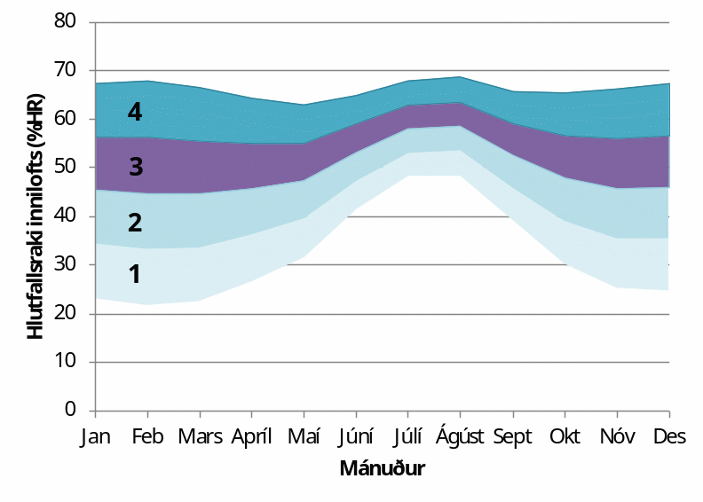

.. container::

   Háskóli Íslands – Umhverfis og byggingarverkfræðideild Húsagerð

   Björn Marteinsson

3. Raki, rakaflutningur og rakaþétting
======================================

3.1 Almennt
-----------

Raki í byggingum og byggingarhlutum orsakast af fjórum megin ástæðum;

-  Byggingarraki

-  Loftraki

-  Úrkoma (snjór og slagregn)

-  Jarðvegsraki (grunnvatn)

Raki í byggingarefnum og byggingum getur haft óheppilegar aukaverkanir
s.s. stuðlað að hraðara efnaniðurbroti heldur en væri í þurrum efnum og
einnig valdið óhollustu, t.d. vegna rakaþéttingar. Það er því mikilvægt
að hafa þekkingu til að geta metið rakaálag á byggingarhluta og
byggingar, og geta kannað hvort rakaástand verði efnum og mannvirki
óhagstætt.

Almennar líkingar og gildi;

Almenni gasfastinn; R=8314,3 J/(kmol∙K)

| 

Yfirborðsspenna vatns; `\sigma` `\cong` 78∙(1-0,0032∙)∙10\ :sup:`-3`\  N/m

Gufuhleypni í lofti (DIN 52615); \ |image1| kg/(mPas)

| 

3.2 Raki í byggingarefnum og byggingum
--------------------------------------

Byggingarraki

Af náttúrulegum ástæðum, eða tengt framleiðsluferli sumra efna, þá
innihalda efnin rakamagn sem getur verið hærra heldur en sem nemur
jafnvægisraka (fjallað er um hugtakið jafnvægisraki í námsefni um
efnisfræði) á notkunartíma. Þessi raki er nefndur byggingarraki
(skilgreiningin ræðst af umhverfi, og er því háð aðstæðum hverju sinni).
Dæmi um þetta er t.d. timbur sem iðulega er þurrkað niður í 18-20 %
efnisraka (af þurri þyngd) áður en það er selt til notanda, en
jafnvægisraki í notkun liggur á bilinu 6 – 18 %, háð notkunarsviði.
Hliðstætt þá nemur umframraki í steypu á byggingartímanum iðulega
nokkrum tugum lítra á hvern rúmmetra steypu.

Almennt er miðað við að halda byggingarefnum eins þurrum og kostur er á
byggingartíma, og síðan gert ráð fyrir að byggingarefnin nái að losi sig
við byggingarraka á notkunartíma þar til einhverju jafnvægi er náð, sem
stjórnast af umhverfisáraun hverju sinni.

| 

Loftraki

Mettunarraki lofts er ýmist gefinn upp sem gufuinnihald, kg/kg (eða
kg/m\ :sup:`3`\ ), eða rakaþrýstingur, Pa. Upplýsingar um mettunarraka
má finna t.d. í Mollier-línuriti eða í töflum (sjá aftast í kaflanum).
Mettunarrakaþrýsting lofts má einnig nálga samkvæmt jöfnu 3.1 sem er
gefin upp í DIN 4108 TEIL 5 og sögð gilda á hitasviðinu –20 til 30 C.

| 

\ |image2| , (Pa) (3.1)

| 

þar sem  a b n

0    30; 288,68 1,098 8,02

-20   0; 4,689 1,486 12,3

| 

Hlutfallsraki innilofts (% HR) er háður rakamagni lofts (t.d.
g/m\ :sup:`3`\ ), eða hlutfallsþrýstingi vatnsgufu, og lofthita.
Loftrakinn reiknast ætíð sem hlutfallstala af mettunarraka loftsins (sem
er háður lofthita). Milli mettunarþrýstings (Pa) og mettunarraka
(kg/m\ :sup:`3`\ ) er beint samband eins og augljóst er af almenna
gaslögmálinu, jafna 3.2

|image3| (3.2)

þar sem w\ :sub:`sat`\  mettunarraki, kg/m\ :sup:`3`

p\ :sub:`sat`\  mettunarþrýstingur, Pa

M\ :sub:`H2O`\  mólmassi vatns, kg/kmol

R almenni gasfastinn, J/(kmol·K)

T hitastig, K

| 

Hlutfallsraki lofts er skilgreindur eins og sýnt er í jöfnu 3.3 (nákvæm
hliðstæða gildir ef í stað rakaþrýstings er notað samsvarandi rakamagn).

|image4| (3.3)

þar sem  hlutfallsraki (hlutfallstala eða %)

p\ :sub:`v`\  rakaþrýstingur lofts, Pa

p\ :sub:`v,sat`\  mettunarþrýstingur vatnsgufu í lofti, Pa

T aflfræðilegt hitastig, K

| 

============================================= ============ =======
Tafla 3.1 Rakaframleiðsla í íbúðarhúsnæði                  
Lýsing                                        Rakamagn     Heimild
                                                           
                                              kg /sólarhr. 
Íbúð (danskar tölur) :                        |            /1/
Matargerð, þvottar og frá íbúum               15           | 
|                                             |            | 
Fjögurra manna fjölskylda (amerískar tölur) : |            /2/
Eldun (3 máltíðir á dag)                      0,9          | 
Uppþvottur (3 x dag ??)                       0,45         | 
Bað - sturta                                  0,2          | 
- kar                                         0,05         | 
Þvottur (1 x viku)                            1,8          | 
Þurrka þvott inni eða barkalaus þurrkari      11,7         | 
Þvo gólf (pr. 10 m2)                          1,3          | 
Íbúar                                         5,4          | 
============================================= ============ =======

/1/ SBI Anvisning 76

/2/ Laaly, H.O. (1992) The Science and Technology of Traditional and
Modern Roofing Systems, Laaly Scientific Publishing, Los Angeles, CA

Raki í innilofti er alltaf háður útiloftraka og rakagjöf til innilofts,
en getur einnig tímabundið verið háður öðrum orsökum s.s. byggingarraka,
leka vegna úrkomu eða frá lögnum og loks vegna jarðvegsraka. Útfrá
upplýsingum um mettunarraka, háð lofthita, má auðveldlega sjá að fyrir
sama rakamagn lofts lækkar loftraki með hækkandi hitastigi. Inniloft
inniheldur það rakamagn sem loftið hafði sem útiloft, auk þess raka sem
loftið tekur í sig þann tíma sem það er inni. Rakaviðbótin (fyrir hvern
m\ :sup:`3`\  innilofts) er því háð tveim atriðum þ.e. loftskiptum í
húsinu (loftræsingu) og rakagjöf innanhúss, sjá töflu 3.1.

| 

Rakamagn í innilofti má almennt reikna eins og jafna 3.4 sýnir, þar sem
miðað er við að rakagjöf hefjist á tíma t=0;

| 

|image5| (3.4)

þar sem w\ :sub:`i`\  rakamagn í innilofti, kg/m\ :sup:`3`

w\ :sub:`e`\  rakamagn í útilofti, kg/m\ :sup:`3`

G rakabæting, kg/klst

n fjöldi loftskipta, 1/klst

V loftræst rými, m\ :sup:`3`

t tími, h

| 

Af jöfnu 3.4 má sjá að með vaxandi tíma þá nálgast lausnin að verða
stöðug; jafna 3.5

| 

|image6| (3.5)

Til þess að taka samtímis tillit til áhrifa rakagjafar og loftskipta á
inniloftraka þá er rakagjöfin iðulega gefin upp sem rakamagn á hvern
rúmmetra í loftskiptum á tímaeiningu, g/(m\ :sup:`3`\ ·klst). Rakamagn
innilofts fæst þá sem loftraki útilofts að viðbættri rakagjöfinni. Í
Svíþjóð er t.d. iðulega miðað við að slík rakagjöf í íbúðarhúsi sé
2-4g/m\ :sup:`3`\ , tölur frá Bandaríkjunum gefa svipaða niðurstöðu ef
miðað er við ein loftskipti á klukkustund en tölur frá Danmörku gefa
fyrir 1 loftskipti á klukkustund um 2 g/m\ :sup:`3`\  fyrir
300m\ :sup:`3`\  íbúð. Rakagjöf til innilofts, reiknað á loftskiptamagn,
er hugsanlega minni hér á Reykjavíkur-svæðinu vegna ódýrrar hitunarorku
og því hugsanlega mikillar loftræstingar.

| 

Í staðlinum ÍST EN ISO 13788:2012 er sett fram tillaga að reiknislegri
rakabætingu í húsum, reiknað á hvern rúmmetra í loftskiptum og háð
útihita, sjá línurit 3.1.

| 

Útfrá upplýsingum um lofthita og raka í útilofti, gefinn innihita og
rakagjöf þá má reikna hvernig loftraki innilofts breytist eftir
árstíðum, línurit 3.2. Í íbúðarhúsnæði er rakagjöf mismunandi eftir
herbergjum og loftræsting getur einnig verið mismunandi. Þannig má t.d.
búast við að tímabundið geti loftraki orðið mjög hár í baðherbergjum og
loftraki í svefnherbergjum getur einnig orðið allhár að næturlagi ef
lítið er loftræst.

| 

.. image:: myndir/kafli03_html_9dfa1c42a695b480.png
   :name: Picture 8
   :width: 362px
   :height: 226px

| 

Línurit 3.1: Reiknisleg rakabæting í inniloft; (0-8 g/m\ :sup:`3`\ á
rúmmetra í loftskiptum) (Heimild: ÍST EN ISO 13788:2012)

| 

| 

| 

| 

Línurit 3.2: Hlutfallsraki lofts innanhúss í Reykjavík fyrir mismunandi
rakabætingu (0-8 g/m\ :sup:`3`\ ) og innihita 20°C. Útiaðstæður meðaltal
áranna 1996-2004.

| 

| 

Almennt má þó miða við (og stutt af mælingum í húsum) að algengur
loftraki í íbúðarhúsum hérlendis sé á bilinu 25-40 %HR að vetrarlagi,
eða rakagjöf 2-4 g/loftræstan m\ :sup:`3`\ . Til viðmiðunar má nefna að
ef rakinn fer yfir 40-45 % þegar kalt er úti þá verður rakaþétting innan
á tvöföldu einangrunargleri. Að sumarlagi fer loftrakinn talsvert hærra
að skaðlausu, eða upp í 50-60 %HR; þ.e. samsvarar rakabætingu í inniloft
svo nemur allt að tæpum 4 g/m\ :sup:`3`\ .

| 

| 

| 

| 

Úrkoma og slagregn:

Úrkoma og slagregn eru oft beinn áhrifavaldur á efnisraka, jafnvel í
veggjum, þar sem vatnsfilma á vatnsdrægu yfirborði mun ætið hafa áhrif á
rakaástand efnisins.

Ótruflað slagregn á vegg er reiknað samkvæmt jöfnu 3.6.

|Shape1|

Mynd 3.1 Slagregn

u\ :sub:`r`

u\ :sub:`v`

| 

S=N*u\ :sub:`v`\ /u\ :sub:`r`\  (3.6)

| 

þar sem S slagregnsmagn á lóðréttan flöt, kg/m\ :sup:`2`

N mæld úrkoma á láréttan flöt, kg/m\ :sup:`2`

u\ :sub:`v`\  vindhraði, m/s

u\ :sub:`r`\  fallhraði regndropa, m/s

| 

| 

| 

| 

| 

Vitaskuld þarf að taka tillit til stefnu normals á veggyfirborð og
vindáttar við ákvörðun slagregnmagns, þó svo þessi atriði komi ekki fram
í jöfnu 3.6.

| 

Fallhraði regndropa er háður stærð þeirra og er fyrir stærstu dropana
gjarnan á bilinu 7-10 m/s. Í útreikningi á slagregnsmagni er oft miðað
við u\ :sub:`r`\ =7 m/s.

| 

Þegar vindur nálgast byggingu þá sveigir hann framhjá fyrirstöðunni (sjá
umfjöllun um lofhreyfingar við byggingar) og regndroparnir fylgja
loftinu í þessari hreyfingu að einhverju leyti, en hluti þeirra
slöngvast áfram vegna hreyfitregðu. Það er því ósennilegt að regn sem
lendir á fyrirstöðunni sé jafnmikið og útreiknað slagregnsmagn í
ótrufluðu slagregni. Erlendis hafa verið gerðar mælingar á slagregni
(m.a. Noregur, Svíþjóð, England) og í staðaluppkastinu prEN 13013-3:1997
er gerð tillaga varðandi reiknislega dreifingu slagregns á veggi, mynd
3.2, þar sem stuðullinn W er formstuðull slagregnsdreifingar á veggi
(hliðstæða við formstuðul vindálags). Í staðaluppkastinu er grunngildi
slagregns reiknað talsvert frábrugðið því sem sýnt er í jöfnu 3.6 (í
staðaluppkastinu er tekið tillit til stefnuhorns, umhverfis o.f.l.).
Þegar mynd 3.2 er skoðuð þá er áberandi að slagregn er iðulega meira
efst á veggjum og síðan niður með úthornum, þessa mun gæta í
rakainnihaldi veggjarins og viðhaldsþörf.

.. image:: myndir/kafli03_html_bb28a8561cdd2560.png
   :name: Picture 10
   :width: 578px
   :height: 829px

Mynd 3.2 Slagregnsdreifing á veggi (heimild: prEN 13013-3:1997)

Jarðraki

Raki frá jarðvegi getur verið tilkominn vegna yfirborðsvatns (úrkomu)
sem leitar að byggingu og hinsvegar raka frá grunnvatni. Háð tegund
jarðvegs og frágangi byggingarhluta neðan jarðvegsyfirborðs getur rakinn
verið í formi vatns sem; (i) liggur að yfirborði og veldur þá
vatnsþrýstingi á yfirborði, (ii) rennur niður yfirborð, eða í formi raks
jarðvegs sem liggur að yfirborði. Byggingarhlutar sem standa dýpra
heldur en grunnvatnsyfirborð munu ávallt verða fyrir vatnsþrýstingi.

| 

Jarðraki gerir að verkum að hlutfallsraki lofts í jarðvegi getur
auðveldlega verið 100 %.

| 

Til að draga úr jarðraka þarf að leiða frárennsli frá þaki, og almennt
vatnsfráhrindandi yfirborðum, í fráveitu, halla jarðvegsyfirborði frá
húsi og loks draga eftir mætti úr vatnsdrægni yfirborða í jörðu og ásamt
því að tryggja dren frá byggingarhlutum í jörðu.

| 

3.3 Rakaflutningur
------------------

Drifkraftur sem knýr rakaflutning getur verið margskonar s.s.
rakainnihald, rakaþrýstingur, hiti, póruþrýstingur, vindþrýstingur,
þyngdarkraftur ofl.

| 

Meginleiðir rakaflutningur eru eftirfarandi;

-  Rakaflæði

-  Rakastreymi

-  Hárpípuflutningur

-  Útsveim og varmasveim

| 

og verður hér fjallað lauslega um hverja þessara leiða.

| 

Rakaflæði

Rakaflæði á sér stað ef stigull í rakaþrýstingi eða rakainnihaldi er til
staðar, jafna 3.7.

| 

|image7| (3.7)

þar sem g þéttleiki rakaflutnings kg/m\ :sup:`2`\ s

D rakaflutningsstuðull

grad stigull drifkrafts rakaflutnings

Rakaflutningur í einni vídd er þá;

|image8| (3.8)

| 

Augljós líkindi eru með jöfnu 3.7 og jöfnu Fourier’s fyrir varmaflutning
(jafna 2. 1), rakaflutningur vegna flæðis er enda reiknaður á hliðstæðan
máta og varmaflæði.

Jafna 3.7 gildir sérstaklega um rakaflutning í lofti, en getur einnig
gilt fyrir rakaflutning í lofthluta efnis-loftblöndu (pórótt efni) en þá
þarf að leiðrétta fyrir breyttu flutningsþversniði (og breyttri lengd
flutningsleiðar). Slík leiðrétting er gerð með því að innfæra sérstakan
efnisstuðul, , sjá síðar (jafna 3.16).

| 

Drifkraftur fyrir rakaflæði er í eldri bókum gjarnan rakainnihald en í
nýrri ritum, og uppkasti að staðli, er notaður rakaþrýstingur.

| 

Rakastreymi í lofti

Þegar þrýstimunar gætir í lofti þá á sér stað lofstreymi, streymið getur
átt upptök sín í þvinguðu streymi eða óþvinguðu sbr. umfjöllun um
varmaflutning. Loftstreymi mun ávallt flytja með sér vatnsgufu ef hún er
til staðar í loftinu. Þrýstimunur yfir byggingarhluta getur þannig þrýst
(röku) lofti í gegnum leka byggingarhluta, og háð því hvort loftið
hitnar upp eða kólnar á leið sinni í gegn þá geta áhrifin verið til
útþornunar byggingarhlutans eða rakasöfnunar í byggingarhluta vegna
rakaþéttingar. Nánar verður fjallað um þennan lið í kafla 4.

|Shape2|





| 

Mynd 3.3 Hárpípa

| 

| 

Hárpípuflutningur

Kraftajafnvægi fyrir hárpípu (mynd 3.3), sem er í snertingu við
vatnsyfirborð, gefur jöfnu 3.9;

| 

·r\ :sup:`2`\ ··g·H=2··r··cos

|image9| (3.9)

| 

þar sem r radíus hárpípu, m

-  eðlisþéttleiki vökvans, kg/m\ :sup:`3`

H vökvahæð í pípunni, m

-  yfirborðspenna vökva, N/m

 snertihorn vökva við pípu

| 

Fyrir vatn og venjuleg byggingarefni er snertihornið almennt sett jafnt
0, en með vatnsverjandi efnum má auka snertihornið verulega og þannig
lágmarka hárpípukrafta.

| 

Í reynd eru hárpípur í efni af mismunandi vídd en ekki með eitt ákveðið
þversnið hver um sig, því er einungis í undantekningartilvikum hægt að
nota jöfnu 3.9 til að ákvarða ísogshæð vökva. Jafnframt er áhugvert að
geta lagt mat á hraða ísogsins og magn vökva sem efnið tekur upp. Það er
því almennt nauðsynlegt að mæla efniseiginleikana og notaðar eru jöfnur
sem skilgreina má fyrir slík tilvik. Jafna 3.10 gefur vatnsísog frá fríu
vatnsyfirborði;

| 

|image10| (3.10)

þar sem G vatnsmagn, kg/m\ :sup:`2`

A ísogsstuðull vatnsmagns, kg/(m\ :sup:`2`\ ·s)

t tími, s

| 

Jafna 3.11 gefur vatnsdýpi í efninu;

| 

|image11| (3.11)

þar sem x vatnshæð (eða dýpi), m

B ísogsstuðull vatnsdýpis, m/s

t tími, s

Vatnsdýpi vex stöðugt með tíma fyrir láréttar pórur, en í lóðréttum
pórum gildir að vatnshæðin verður mest eins og jafna 3.9 sýnir.

| 

Dæmi um gildi á stuðlunum A og B eru sýnd í töflu 3.2 fyrir nokkur efni.

| 

+-----------------+-----------+-----------------+-----------------+
| Tafla 3.2       |           |                 |                 |
| Ísogsstuðlar    |           |                 |                 |
| efna (heimild;  |           |                 |                 |
| Nevander og     |           |                 |                 |
| Elmarsson,      |           |                 |                 |
| 1994)           |           |                 |                 |
+-----------------+-----------+-----------------+-----------------+
| Efni            | Þéttleiki | Stuðull fyrir   | Stuðull fyrir   |
|                 |           | ísogsmagn, A    | ísogsdýpi, B    |
|                 | |         |                 |                 |
|                 |           | kg/(m\          | x               |
|                 | kg/m3     |  :sup:`2`\ ·s) | 10\ :sup:`-3`\  |
|                 |           |                 | m/s            |
+-----------------+-----------+-----------------+-----------------+
| Tígulsteinn     | 1700      | 0,37            | 1,4             |
+-----------------+-----------+-----------------+-----------------+
| Léttsteypa      | 1900      | 0,08            | 0,4             |
| (sænsk)         |           |                 |                 |
+-----------------+-----------+-----------------+-----------------+
| Sementsmúr      | 1900      | 0,03            | 0,5             |
| (sænskur)       |           |                 |                 |
+-----------------+-----------+-----------------+-----------------+
| Steypa v/s 0,3  | |         | 0,010           | 0,14            |
| (sænsk)         |           |                 |                 |
+-----------------+-----------+-----------------+-----------------+
| Steypa v/s 0,5  | |         | 0,020           | 0,17            |
| (sænsk)         |           |                 |                 |
+-----------------+-----------+-----------------+-----------------+
| Steypa v/s 0,7  | |         | 0,028           | 0,25            |
| (sænsk)         |           |                 |                 |
+-----------------+-----------+-----------------+-----------------+
| Timbur \|\|     | 450       | 0,016           | -               |
| trefjum         |           |                 |                 |
+-----------------+-----------+-----------------+-----------------+
| Timbur         | 450       | 0,004           | -               |
| trefjar         |           |                 |                 |
+-----------------+-----------+-----------------+-----------------+

Rakþrýstingur verður lægri yfir sveigðu vatnsyfirborði heldur en flötu,
þar sem yfirborðskraftar sem verka á vatnssameindirnar eru hærri í
fyrrnefnda tilvikinu.

Jafna Kelvins segir til um samband pórustærðar og hlutfallsraka lofts
yfir vatnsborði í slíkri póru (sem hlutfall af mettunarraka yfir sléttu
yfirborði) , jafna 3.12;

| 

|image12| (3.12)

| 

(Thompson jafnan er |image13| )

| 

| 

þar sem  hlutfallsraki lofts (hlutfallstala 0 – 1) =p/p\ :sub:`s`

p mettunarrakaþrýstingur í póru

p\ :sub:`s`\  mettunarrakaþrýstingur yfir sléttu yfirborði

 yfirborðsspenna (hitastigsháð), N/m

M\ :sub:`w`\  mólmassi vatns, kg/mól

r radíus póru, m

\ :sub:`w`\  eðlisþéttleiki vatns, kg/m\ :sup:`3`

R almenni gasfastinn R=8314,3 J/(kmol∙K)

T hitastig, K

| 

Undirþrýstingur í póru er iðulega settur sem (jafna 3.13);

| 

\ |image14| (3.13)

Jafna 3.13 ásamt 3.12 gefur (jafna 3.14);

| 

\ |image15| (3.14)

Jafna 3.14 gefur samband milli undirþrýstings í póru og rakaþrýstings,
en undirþrýstingur í póru (e: suction) hentar vel sem mat á drifkrafti
rakaflutnings vegna hárpípukrafta.

| 

Útsveim og varmasveim

Í þeim tilvikum sem pórustærð í efni er svipuð eða minni heldur en “frí”
fjarlægð milli vatnssameinda, þá ákvarðast hreyfing sameinda ekki af
innbyrðis áhrifum þeirra heldur áhrifum frá yfirborðum póranna.
Sameindirnar hreyfast innbyrðis óháð, slíkur rakaflutningur nefnist
útsveim (e: effusion).

| 

Rakaflutningur á gufuformi í efni getur einnig orðið vegna áhrifa
hitastiguls. Hitamunur í gasblöndu veldur aðskilnaði vegna mismunandi
mólmassa gastegunda. Í röku lofti er sameindamassi vatnsgufu lægri
heldur en mólmassi súrefnis og köfnunarefnis, vatnsgufan leitar því til
heitari hlutans en súrefni og köfnunarefni til þess kaldari. Áhrif
varmasveims (e: termodiffusion) verða helst merkjanleg í mjög póróttum
efnum og við mikinn hitastigul.

| 

3.4 Útreikningur á rakaflutningi
--------------------------------

Rakaflutningur verður helst eftir þrem leiðum eins og þegar hefur verið
nefnt; flæði, streymi í lofti og hárpípukröftum. Iðulega er erfitt að
skilja á milli flutnings annarsvegar sem flæði og hinsvegar streymi í
lofti (hliðstætt vandamál og varðar varmaflutning), en þó er vitað að
áhrifa vegna streymis í lofti verður fyrst merkjanlegt við háan loftraka
(oft  > 80 – 85 %).

Rakaflutningur í hárpípum á sér aðeins stað frá efni með lágan
flutningsstuðul til efnis með háan flutningsstuðul (frá grófpóróttu efni
til fínpóróttara).

| 

Rakaflutningur verður hér reiknaður samkvæmt staðaluppkastinu TC 89 WI
29.3:2003. Tilvísanir í staðalinn verða hér styttar í TC89.

| 

Í efni reiknast þéttleiki rakaflutnings, kg/(m\ :sup:`2`\ ·s) eins og
jafna 3.15 sýnir;

| 

g=g\ :sub:`v`\ +g\ :sub:`l`\  (3.15)

þar sem g\ :sub:`v`\  rakaflutningur vegna flæðis (g\ :sub:`p`\ ) og
streymis í lofti (g\ :sub:`c`\ )

g\ :sub:`l`\  hárpípuflutningur

| 

rakaflutningur vegna flæðis og streymis í lofti, g\ :sub:`v`\ , er
skilgreint eins og jafna 3.16 sýnir;

|image16| (3.16)

| 

þar sem () mótstöðutala vatnsgufuflæðis við rakainnihald , -

\ :sub:`0`\ (T) gufuhleypni í lofti með hitastig T, kg/(m·Pa·s)

p\ :sub:`v`\ /x stigull gufuþrýstings í lofti, Pa

g\ :sub:`a`\  þéttleiki loftflutnings, kg/(m\ :sup:`2`\ ,s)

\ :sub:`a`\  þéttleiki lofts, kg/m\ :sup:`3`

p\ :sub:`v`\  hlutfallsþrýstingur vatnsgufu, Pa

\ |image17|

| 

| 

Gufuhleypni í lofti, er eins og jafna 3.17 sýnir (DIN 52615);

\ |image18| kg/(mPas) (3.17)

Í fræðiritum (þetta var og er jafnvel víða venja enn) eru stuðlarnir við
drifkraft rakaflæðis teknir saman í eina stærð, sbr. jöfnu 3.7.
Stuðullinn er oft nefndur D\ :sub:`x`\  þar sem lágmerkið skýrir hvaða
drifkraftur er notaður; oft w fyrir rakainnihald og p fyrir
rakaþrýsting, sem dæmi um þetta má nefna gildið \ :sub:`p`\ ;
\ :sub:`p`\ =\ :sub:`0`\ /. Ókostur aðferðarinnar er sá að
rakaflæðistuðullinn D er augljóslega háður drifkraftinum. Til er
fjöldinn allur af mismunandi efnisgildum fyrir útreikning á
rakaflutningi, umreiknistuðla fyrir öll algengustu gildi er t.d. að
finna í Rb-blaðinu Rb (I3).001 ”Vindþéttilög í
húsbyggingum-efniseiginleikar og frágangur”. Kosturinn við framsetningu
staðaluppkastsins er að stuðullinn  er hrein hlutfallstala sem er
efnisháð, og einungis þarf að velja  stuðulinn þannig að hann passi
fyrir valinn drifkraft.

| 

Fyrir yfirborðslög (yfirborðsmótstöður, málningar o.f.l.) þá er
jafngilda formið fyrir jöfnu 3.16 , eins og jafna 3.18 sýnir;

| 

|image19| (3.18)

| 

Af samanburði milli jafnanna 3.16 og 3.18 sést að jafngildisþykkt
loftlags, s\ :sub:`d`\ , fæst sem ; s\ :sub:`d`\ =·d, þar sem d er
þykkt efnislags. Þá gildir almennt að mótstaða efnislags, eða yfirborðs,
fæst sem (jafna 3.19);

| 

Z\ :sub:`p`\ =s\ :sub:`d`\ /\ :sub:`0`\ =d·/\ :sub:`0`\  (3.19)

| 

Efnisgildi til útreikninga á rakaflutningi má finna t.d. í staðlinum ÍST
EN 12524:2000, tækniblaðinu NBI 573.430 og handbókum eftir S. Geving og
J. V. Thue (2002), Nevander og Elmarsson (1994). Rakaflæðimótstaða efna
er alltaf háð hitastigi (sem leiðrétt er fyrir með \ :sub:`0`\ 
stuðlinum í jöfnum 3.14 og 3.16) og iðulega einnig rakainnihaldi efna,
þar sem rakaflæðimótstaðan fellur almennt með hækkandi efnisraka.

| 

Efnisframleiðendur og efnissalar, og einnig eldri rit, gefa stundum upp
rakaflutningsmótstöðuna Z í stað s\ :sub:`d`\  gildis eins og nú
tíðkast. Þá þarf þó að skoða vandlega hvaða eining er á uppgefnu
Z-gildinu (oft GPasm\ :sup:`2`\ /kg) og taka tillit til þess í
útreikningunum.

| 

Jafngildisþykkt yfirborðsloftlags (mótstaða við yfirborð),
s\ :sub:`d,s`\ , er sýnd í töflu 3.3.

| 

| 

| 

| 

| 

Tafla 3.3 Jafngildisþykkt yfirborðsloftlags (e: boundary layer)
(heimild: TC 89 )

| |Shape3|

Yfirborð inni s\ :sub:`d,si`\  (m)

Stefna varmaflutnings

-  Lárétt 0,008

-  Upp 0,004

-  Niður 0,03

| 

| 

Yfirborð úti (háð vindhraða v) s\ :sub:`d,se`\  (m)

\ |image20|

| |Shape4|

| 

Samantekt fyrir nokkur algeng byggingarefni er í töflu 3. 4 og fyrir
algeng efnislög í töflu 3.5.

| 

+-----------+-----------+-----------+---------+---------+---------+
| Tafla 3.4 |           |           |         |         |         |
| Rakaflæð  |           |           |         |         |         |
| imótstaða |           |           |         |         |         |
| efna,    |           |           |         |         |         |
| (heimild: |           |           |         |         |         |
| NBI       |           |           |         |         |         |
| 573.430,  |           |           |         |         |         |
| o.fl.)    |           |           |         |         |         |
+-----------+-----------+-----------+---------+---------+---------+
| Efni      | Þéttleiki | Rakaflæði |         |         |         |
|           |           | mótstaða, |         |         |         |
|           | (kg/m\ :s |  fyrir   |         |         |         |
|           | up:`3`\ ) | m         |         |         |         |
|           |           | ismunandi |         |         |         |
|           |           | hlut      |         |         |         |
|           |           | fallsraka |         |         |         |
|           |           | (% HR)    |         |         |         |
+-----------+-----------+-----------+---------+---------+---------+
| |         | |         | 35 - 70   | 70 - 80 | 80 - 90 | 90 - 95 |
+-----------+-----------+-----------+---------+---------+---------+
| Steinull  | 15        | 1,2 – 1,8 | |       | |       | |       |
+-----------+-----------+-----------+---------+---------+---------+
| Steinull  | 200       | 2,2 – 3,3 | |       | |       | |       |
+-----------+-----------+-----------+---------+---------+---------+
| Fr        | 20        | 19-29     | 19-29   | 19-29   | 19-29   |
| auðplast, |           |           |         |         |         |
| þanið     |           |           |         |         |         |
+-----------+-----------+-----------+---------+---------+---------+
| Fr        | 30        | 98        | |       | |       | |       |
| auðplast, |           |           |         |         |         |
| þanið     |           |           |         |         |         |
+-----------+-----------+-----------+---------+---------+---------+
| Fr        | 20-60     | 150       | |       | |       | |       |
| auðplast, |           |           |         |         |         |
| sprautað  |           |           |         |         |         |
+-----------+-----------+-----------+---------+---------+---------+
| Steypa    | |         | 131-195   | 82-131  | 27-82   | 9-27    |
| v/s 0,5   |           |           |         |         |         |
| (norsk)   |           |           |         |         |         |
+-----------+-----------+-----------+---------+---------+---------+
| Fura –    | |         | 29-130    | 13-51   | 7,4-26  | |       |
| þvert á   |           |           |         |         |         |
| tre       |           |           |         |         |         |
| fjastefnu |           |           |         |         |         |
+-----------+-----------+-----------+---------+---------+---------+
| K         | |         | 29-130    | 14-51   | 8-25    | |       |
| rossviður |           |           |         |         |         |
+-----------+-----------+-----------+---------+---------+---------+
| OSB plata | 650       | 49        | |       | |       | |       |
+-----------+-----------+-----------+---------+---------+---------+
| S         | 635       | 37        | |       | |       | 16      |
| pónaplata |           |           |         |         |         |
+-----------+-----------+-----------+---------+---------+---------+
| Trétr     | 900       | 102       | |       | |       | |       |
| efjaplata |           |           |         |         |         |
+-----------+-----------+-----------+---------+---------+---------+
| |         | |         | |         | |       | |       | |       |
|           |           |           |         |         |         |
| EPDM      |           | ..        | 60000   | ..      | ..      |
| dúkefni   |           |           |         |         |         |
+-----------+-----------+-----------+---------+---------+---------+
| PVC       | |         | ..        | 40000   | ..      | ..      |
+-----------+-----------+-----------+---------+---------+---------+

| 

| 

+-----------------------------+--------+-----------------------------+
| Tafla 3.5 Rakaflæðimótstaða | |      | |                           |
| efnislaga,                  |        |                             |
| s\ :sub:`d`\ (heimild: NBI  |        |                             |
| 573.430)                    |        |                             |
+-----------------------------+--------+-----------------------------+
| Efni                        | Þykkt  | Jafngildisþykkt loftlags,   |
|                             |        | s\ :sub:`d`\  (m)           |
|                             | (mm)   |                             |
+-----------------------------+--------+-----------------------------+
| Textil teppi- með latex     | |      | 3,3-4,1                     |
| bakhlið                     |        |                             |
+-----------------------------+--------+-----------------------------+
| Linoleum, HR 35-70%         | 2,5    | 10                          |
+-----------------------------+--------+-----------------------------+
| Linoleum, HR 70-80%         | 2,5    | 5,3                         |
+-----------------------------+--------+-----------------------------+
| Vinyl gólfdúkur, mjög       | |      | 254                         |
| lokaður                     |        |                             |
+-----------------------------+--------+-----------------------------+
| Akryllatex málning          | 0,05   | 0,14-0,53                   |
+-----------------------------+--------+-----------------------------+
| Alkydmálning, 2umf., mött   | |      | 2,5-5                       |
| vegg- og loftamálning       |        |                             |
+-----------------------------+--------+-----------------------------+
| Epoxy gólfmálning-tveggja   | |      | 7,6-14                      |
| þátta, 2umf.                |        |                             |
+-----------------------------+--------+-----------------------------+
| |                           | |      | |                           |
+-----------------------------+--------+-----------------------------+
| Polyethylen (PE)            | 0,15   | 70                          |
| rakavarnarlag               |        |                             |
+-----------------------------+--------+-----------------------------+
| .. do                       | 0,20   | 90                          |
+-----------------------------+--------+-----------------------------+
| Tjörupappi (polyester       | -      | 100                         |
| vefur)                      |        |                             |
+-----------------------------+--------+-----------------------------+
| PVC þakdúkur                | 1,4    | 19                          |
+-----------------------------+--------+-----------------------------+
| Polyisobutylen (PIB)        | 1,5    | 390                         |
| þakdúkur                    |        |                             |
+-----------------------------+--------+-----------------------------+

| 

| 

Í eftirfarandi verður litið framhjá áhrifum loftflutnings í efni og
hárpípuflutnings á rakaflutning (nema að því leyti sem þessi áhrif eru
innifalinn í viðeigandi efnisgildum). Útreikningar taka hér einvörðu
tillit til rakaflæðis.

| 

| 

Rakaflutningur, rakaástand og rakaþétting

Við stöðug hita- og rakaskilyrði í umhverfi byggingarhluta þá næst
rakajafnvægi í byggingarhluta þegar rakaástandið ákvarðast af rakaflæði,
ef aðstæður eru þannig að rakaþétting á sér ekki stað.
Mettunarrakaþrýstingur, jafna 3.1 (og mettunarrakamagn, jafna 3.2) í
hverju sniði ræðst af hitastigi þar, en hitafall í einsleitu efnislagi
er línulegt við stöðug skilyrði eins og fjallað var um í kafla 2.
Rakaþrýstingur í sniðinu, jafna 3.16, verður því aðeins línulegur að
rakaflæðimótstaðan Z (jafna 3.19) sé óháð hitastigi og efnisraka,
mettunarrakaaferillinn verður hinsvegar alltaf aðeins sveigður þar sem
samband mettunarraka og hitastigs er ekki línulegt.

| 

Þrátt fyrir að rakaflæðimótstaðan sé nánast alltaf hita- og rakaháð þá
er venja í útreikningum við stöðug skilyrði að líta framhjá þessu, til
einföldunar er gert ráð fyrir að bæði rakaþrýstingur og
mettunarrakaþrýstingur í einsleitu efnislagi breytist línulega.

| 

Mettunarrakaþrýstingur í efnislagi er því ákvarðaður útfrá hitastigi á
yfirborðum efnislags og rakaþrýstingur í efninu útfrá rakaþrýstingi á
yfirborðum. Reikningur rakaþrýstings í byggingarhluta sem samsettur er
úr mörgum efnislögum er gerður hliðstætt og gert var fyrir
hitastigsdreifingu í kafla 2, reiknuð er mótstöðutala rakaflæðis lag
fyrir lag og rakaþrýstingur reiknaður hlutfallslega útfrá
umhverfisaðstæðum. Í þeim tilvikum sem reiknaður rakaþrýstingur er hærri
heldur en mettunarþrýstingur í sniði þá á sér stað rakaþétting, annars
ekki. Skoða þarf tvö tilvik (mynd 3.3);

| 

.. image:: myndir/kafli03_html_27d4066b35443648.png
   :alt: Shape5
   :name: Shape5
   :width: 540px
   :height: 384px

| 

Mynd 3.3 Raka- og mettunarrakaþrýstingur í sniði

| 

I. Engin rakaþétting

Rakaflutning, á flatar- og tímaeiningu, í gegnum byggingarhluta má
ákvarða í samræmi við (fyrri hluta) jöfnu 3.16, sem nú er umskrifuð eins
og jafna 3.20 sýnir;

| 

|image21| (3.20)

þar sem g rakaflutningur frá 1 til 2, kg/(m\ :sup:`2`\ ·s)

Z\ :sub:`T`\  heildarmótstaða gegn rakaflæði, m\ :sup:`2`\ ·s·Pa/kg

p\ :sub:`1`\ , p\ :sub:`2`\  rakaþrýstingur beggja vegna við
byggingarhluta, Pa

| 

II. Rakaþétting

Rakaþéttingin er til einföldunar öll reiknuð í “fyrsta kalda sniði” í
byggingarhluta (á mynd 3.3 er það snið n+2, þegar rakaflutningur er frá
1 til 2, og mettunarraki þar er p\ :sub:`cond`\ ). Í því tilviki að
rakaþétting reiknast verða í tveim eða fleiri sniðum, þá þarf að setja
rakaþrýsting í innsta sniðinu jafnt og mettunarrakaþrýsting, og
endurreikna dæmið frá þeim punkti og svo koll af kolli fyrir hvert snið
utar þar sem rakþrýstingur fer yfir mettunarraka.

| 

Reiknaðar eru mótstöður innan- og utan við þéttingarsniðið,
Z\ :sub:`inn`\  og Z\ :sub:`ut`\ , og samsvarandi rakaflutningur, sjá
mynd 3.3;

|image22| (3.21)

| 

|image23| (3.22)

| 

g\ :sub:`uppsafnað`\ = g\ :sub:`inn`\  - g\ :sub:`út`\  (3.23)

| 

Þegar útreikningar sýna að rakaþétting eigi sér stað þá þarf að meta
yfir hversu langan tíma þetta ástand varir og athuga svo hvort
byggingarhlutinn geti losað sig við rakann þegar aðstæður breytast
(samsvarandi reikningar og í lið II.), það þarf þannig að leggja mat á
hvort rakauppsöfnun verði viðvarandi eða hvort um árstíðasveiflu sé að
ræða. Þegar reiknuð er útþornun þá þarf vitaskuld að reikna rakaþrýsting
miðað við rakaþéttingu í þéttingarsniðinu og með ítrun áætla hvort
útþornun eigi sér stað og þá hversu langan tíma hún tekur.

Það er þó ekki einungis rakaþétting sem er áhugaverð heldur einnig sá
tími þegar hár loftraki helst í einstökum sniðum byggingarhluta. Hætta á
mygluvexti er metin útfrá rakaástandi og á sama tíma hitaástandi yfir
skilgreindum mörkum, og talinn saman tími sem skilyrðin eru uppfyllt.

| 

Í Byggingarreglugerð, kafla 10.5, er fjallað almennt um raka (m.a. grein
10.5.1);

10.5.1. gr.

Markmið.

Mannvirki skulu þannig hönnuð og byggð að vatn eða raki geti ekki valdið
skaða á mannvirki í heild eða einstökum hlutum þess eða skapað aðstæður
sem valdið geta óþægindum, slysum eða verið hættulegar heilsu manna,
s.s. vegna myndunar myglu eða varasamra örvera.

Tryggja skal að grunnvatn, yfirborðsvatn, úrkoma, s.s. regn, slagregn,
snjór eða krapi, raki í jarðvegi, neysluvatn, loftraki, byggingarraki
eða þéttivatn geti hvorki skaðað mannvirki eða einstaka hluta þess, né
rýrt eðlileg hollustuskilyrði innandyra.

| 

Orðalagið “skaða á mannvirki” er ekki skilgreint sérstaklega, og er því
á verksviði hönnuðar hverju sinni að meta hvort t.d. rakauppsöfnun,
tímabundin eða varanleg, sé skaðleg. Í þessu sambandi er nauðsynlegt að
leggja mat á áreiðanleika þeirra aðferða sem beitt er til að meta
rakaástand í byggingarhluta á hönnunarstigi bygginga.

| 

Í hefðbundnum útreikningum, eins og hér er fjallað um þarf að hafa
eftirfarandi í huga;

#. Útreikningar byggja á einfölduðum reiknilíkönum.

#. Upplýsingar um efniseiginleika (og rakaþol) eru iðulega af skornum
   skammti.

#. Upplýsingar um umhverfisaðstæður (raka og hita) eru háðar óvissu.

#. Hæfni efna til að taka upp raka (tímabundið) án þess að skemmdir
   hljótist af.

| 

Það er því ástæða að hafa í huga að reiknislegt mat á rakaástandi er
fremur gæðamat heldur en fræðilegt mat og því eðlilegt að halda sig
frekar öruggu megin þegar niðurstöður eru metnar. Í þessu sambandi er
eðlilegt að miða við að öryggi valinnar uppbyggingar sé nægjanlegt, t.d.
að reiknuð útþornun sé umtalsvert meiri heldur en reiknuð rakauppsöfnun.

| 

| 

| 

| 

Reiknaður rakaflutningur í byggingarhluta og metin hætta á rakaþéttingu

Dæmi:

Steyptur veggur einangraður að innan með 100 mm frauðplasti, múraður að
innan með 20 mm sementsmúr, en að utan með 25 mm sementsmúr. Veggurinn
málaður að innan með alkydmálningu (2 umf) og akryllatex að utan (2
umf). – Efnisgildi fyrir rakaeiginleika tekin úr töflum 3.3 og 3.4,
einangrunargildi samsvarandi og í kafla 2.

Reiknað er hitastig og rakaástand í sniði fyrir aðstæður; inni 22 °C /
45 %HR, úti -2 °C / 80 %HR (undir meðallagi fyrir janúar í Reykjavík).

| 

Útreikningar og niðurstöður í töflu;

| 

.. image:: myndir/kafli03_html_9c541ecee96c9f07.png
   :name: Picture 29
   :width: 576px
   :height: 323px

| 

Niðurstöður sýna að við framangreindar aðstæður verður rakaþétting í
veggnum svo nemur 0,0070 g/(m\ :sup:`2`\ ,h), eða 5 g/m\ :sup:`2`\ ,
mánuð – rakaþéttingin er óveruleg þegar tekið er tillit til mögulegrar
rakaupptöku veggjarins, en athuga ber að hitastig innra byrðis
steypunnar er undir frostmarki og þéttingin mun því byggjast upp sem
klakabrynja. Aðstæðurnar sem um ræðir munu þó sjaldan standa nema
stuttan tíma í senn og þegar veggyfirborðið þiðnar þá getur steypan
sennilega tekið við rakanum án vandkvæða.

| 

| 

Línurit 3.3 Mollier línurit fyrir rakt loft

| 

| 

| 

| 

| 

| 

| 

+--------+--------+--------+----+------+--------+--------+----+------+--------+--------+
| Tafla  |        |        |    |      |        |        |    |      |        |        |
| 3.6    |        |        |    |      |        |        |    |      |        |        |
| M      |        |        |    |      |        |        |    |      |        |        |
| ettuna |        |        |    |      |        |        |    |      |        |        |
| rraki; |        |        |    |      |        |        |    |      |        |        |
| þrýs   |        |        |    |      |        |        |    |      |        |        |
| tingur |        |        |    |      |        |        |    |      |        |        |
| og     |        |        |    |      |        |        |    |      |        |        |
| ra     |        |        |    |      |        |        |    |      |        |        |
| kamagn |        |        |    |      |        |        |    |      |        |        |
| í      |        |        |    |      |        |        |    |      |        |        |
| lofti, |        |        |    |      |        |        |    |      |        |        |
| háð    |        |        |    |      |        |        |    |      |        |        |
| hita   |        |        |    |      |        |        |    |      |        |        |
| stigi. |        |        |    |      |        |        |    |      |        |        |
| Fyrir  |        |        |    |      |        |        |    |      |        |        |
| hi     |        |        |    |      |        |        |    |      |        |        |
| tastig |        |        |    |      |        |        |    |      |        |        |
| undir  |        |        |    |      |        |        |    |      |        |        |
| fros   |        |        |    |      |        |        |    |      |        |        |
| tmarki |        |        |    |      |        |        |    |      |        |        |
| er     |        |        |    |      |        |        |    |      |        |        |
| miðað  |        |        |    |      |        |        |    |      |        |        |
| við    |        |        |    |      |        |        |    |      |        |        |
| að     |        |        |    |      |        |        |    |      |        |        |
| stæður |        |        |    |      |        |        |    |      |        |        |
| yfir   |        |        |    |      |        |        |    |      |        |        |
| ís.    |        |        |    |      |        |        |    |      |        |        |
|        |        |        |    |      |        |        |    |      |        |        |
| |      |        |        |    |      |        |        |    |      |        |        |
+--------+--------+--------+----+------+--------+--------+----+------+--------+--------+
| Hiti   | Þrýst. | Raki   | |  | Hiti | Þrýst. | Raki   | |  | Hiti | Þrýst. | Raki   |
|        |        |        |    |      |        |        |    |      |        |        |
| (°C)   | (Pa)   | (g/m\  |    | (°C) | (Pa)   | (g/m\  |    | (°C) | (Pa)   | (g/m\  |
|        |        |  :sup: |    |      |        |  :sup: |    |      |        |  :sup: |
|        |        | `3`\ ) |    |      |        | `3`\ ) |    |      |        | `3`\ ) |
|        |        |        |    |      |        |        |    |      |        |        |
|        |        |        |    |      |        |        |    |      |        | |      |
+--------+--------+--------+----+------+--------+--------+----+------+--------+--------+
| 30     | 4245   | 30,36  | |  | 10   | 1228   | 9,40   | |  | -10  | 260    | 2,14   |
+--------+--------+--------+----+------+--------+--------+----+------+--------+--------+
| 29     | 4005   | 28,78  | |  | 9    | 1147   | 8,83   | |  | -11  | 238    | 1,97   |
+--------+--------+--------+----+------+--------+--------+----+------+--------+--------+
| 28     | 3780   | 27,24  | |  | 8    | 1072   | 8,28   | |  | -12  | 225    | 1,81   |
+--------+--------+--------+----+------+--------+--------+----+------+--------+--------+
| 27     | 3565   | 25,80  | |  | 7    | 1001   | 7,76   | |  | -13  | 199    | 1,66   |
+--------+--------+--------+----+------+--------+--------+----+------+--------+--------+
| 26     | 3360   | 24,40  | |  | 6    | 935    | 7,27   | |  | -14  | 181    | 1,52   |
+--------+--------+--------+----+------+--------+--------+----+------+--------+--------+
| 25     | 3170   | 23,04  | |  | 5    | 872    | 6,80   | |  | -15  | 166    | 1,39   |
+--------+--------+--------+----+------+--------+--------+----+------+--------+--------+
| 24     | 2985   | 21,80  | |  | 4    | 813    | 6,37   | |  | -16  | 151    | 1,27   |
+--------+--------+--------+----+------+--------+--------+----+------+--------+--------+
| 23     | 2815   | 20,60  | |  | 3    | 757    | 5,96   | |  | -17  | 137    | 1,16   |
+--------+--------+--------+----+------+--------+--------+----+------+--------+--------+
| 22     | 2640   | 19,45  | |  | 2    | 705    | 5,57   | |  | -18  | 125    | 1,06   |
+--------+--------+--------+----+------+--------+--------+----+------+--------+--------+
| 21     | 2485   | 18,35  | |  | 1    | 656    | 5,20   | |  | -19  | 114    | 0,97   |
+--------+--------+--------+----+------+--------+--------+----+------+--------+--------+
| 20     | 2335   | 17,29  | |  | 0    | 611    | 4,84   | |  | -20  | 104    | 0,88   |
+--------+--------+--------+----+------+--------+--------+----+------+--------+--------+
| 19     | 2195   | 16,33  | |  | -1   | 563    | 4,48   | |  | -21  | 94     | 0,80   |
+--------+--------+--------+----+------+--------+--------+----+------+--------+--------+
| 18     | 2060   | 15,40  | |  | -2   | 517    | 4,13   | |  | -22  | 85     | 0,73   |
+--------+--------+--------+----+------+--------+--------+----+------+--------+--------+
| 17     | 1935   | 14,50  | |  | -3   | 475    | 3,82   | |  | -23  | 78     | 0,67   |
+--------+--------+--------+----+------+--------+--------+----+------+--------+--------+
| 16     | 1818   | 13,65  | |  | -4   | 437    | 3,52   | |  | -24  | 71     | 0,61   |
+--------+--------+--------+----+------+--------+--------+----+------+--------+--------+
| 15     | 1703   | 12,82  | |  | -5   | 402    | 3,24   | |  | -25  | 64     | 0,55   |
+--------+--------+--------+----+------+--------+--------+----+------+--------+--------+
| 14     | 1596   | 12,09  | |  | -6   | 368    | 2,99   | |  | -26  | 58     | 0,50   |
+--------+--------+--------+----+------+--------+--------+----+------+--------+--------+
| 13     | 1496   | 11,37  | |  | -7   | 338    | 2,75   | |  | -27  | 52     | 0,46   |
+--------+--------+--------+----+------+--------+--------+----+------+--------+--------+
| 12     | 1400   | 10,68  | |  | -8   | 310    | 2,53   | |  | -28  | 47     | 0,41   |
+--------+--------+--------+----+------+--------+--------+----+------+--------+--------+
| 11     | 1311   | 10,03  | |  | -9   | 284    | 2,33   | |  | -29  | 42     | 0,38   |
+--------+--------+--------+----+------+--------+--------+----+------+--------+--------+
| |      | |      | |      | |  | |    | |      | |      | |  | -30  | 37     | 0,34   |
+--------+--------+--------+----+------+--------+--------+----+------+--------+--------+

| 

Heimildir og ítarefni
---------------------

Björn Marteinsson (1999) ” Loftræsing í íbúðarhúsum”, erindi á ráðstefnu
Lagnafélags Íslands, birt í ráðstefnuriti

DIN (1981) Wärmeschutz im Hochbau DIN 4108

DIN (1987) Bestimmung der Wasserdampfdurchlässigkeit von Bau- und
Dämmstoffen DIN 52615

S. Geving og J. V. Thue (2002) Fukt i bygninger, Norges
byggforskningsinstitutt, Håndbok 50, Oslo

E. Hagemann (1988), Byggematerialer – grundbog, polyteknisk Forlag,
København

ÍST EN 12524:2000 Building materials and products - Hygrothermal
properties - tabulated design values

Jón Sigurjónsson (1983) Rb (I3).001 ”Vindþéttilög í
húsbyggingum-efniseiginleikar og frágangur”, Rb-blað, Rannsóknastofnun
byggingariðnaðarins, Keldnaholti

NBI (2003) Materialdata for vanndamptransport, Byggforskserien
Byggdetaljer 573.430 Oslo,

L. E. Nevander, B. Elmarsson (1994) Fukthandboken, Svensk byggtjänst,
Stockholm

Óli Hilmar Jónsson (1982) Raki í húsum, sérrit 46, Rannsóknastofnun
byggingariðnaðarins, Keldnaholti

ISO (1997) Draft prEN 13013-3:1997 Hygrothermal performance of buildings
– climatic data-part 3: calculation of driving rain index for vertical
surfaces from hourly wind and rain data

ÍST EN ISO (2012) 13788:2012 \ *Hygrothermal performance of building
components and building elements - Internal surface temperature to avoid
critical surface humidity and interstitial condensation – Calculation
method*

K. Sandin (1987) Fukttillstånd i autoklaverade lättbetongväggar -
Fältmätning av slagregnets och ytskiktets inverkan, LTH,
Byggnadsmateriallära, Rapport TVBM 3026, Lund

TC 89 WI 29.3:2003 (2003-04) Hygrothermal performance of building
components and building elements – Assessment of moisture transfer by
numerical simulation

Ýmsir (1997), Husbygningsteknikk – Bind 1, Institutt for
husbygningsteknikk, Norges tekniske høgskole, Universitetet i Trondheim,
Norge

| 

| 

.. container::

   3.19

   | 

.. |image5| image:: myndir/kafli03_html_4286c875169890a4.png
   :name: Object5

.. |Shape1| image:: myndir/kafli03_html_202b5496f648e91b.png
   :name: Shape1
   :width: 186px
   :height: 252px
.. |image7| image:: myndir/kafli03_html_765f8cd62da42455.png
   :name: Object7

.. |image16| image:: myndir/kafli03_html_3b4150303398fc73.png
   :name: Object16

.. |Shape3| image:: myndir/kafli03_html_2e0938f5994fc94f.png
   :name: Shape3
   :width: 586px
   :height: 1px

.. |Shape4| image:: myndir/kafli03_html_2e0938f5994fc94f.png
   :name: Shape4
   :width: 586px
   :height: 1px

