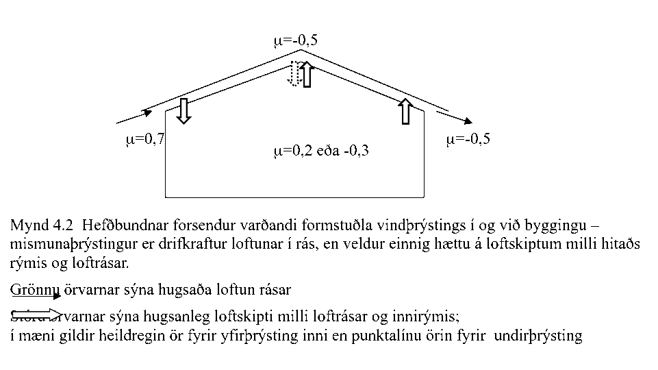
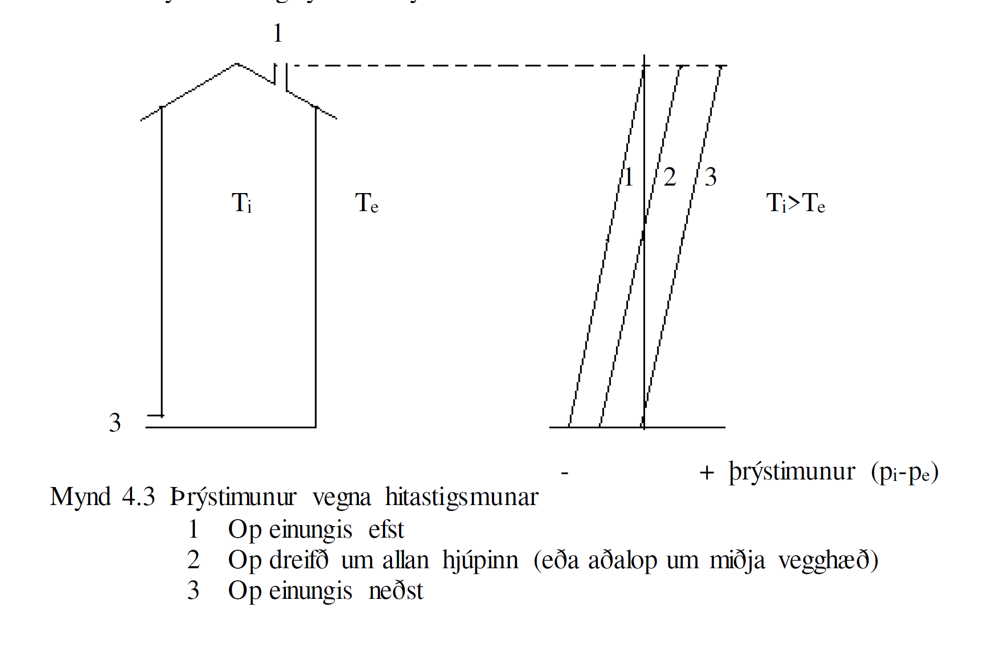
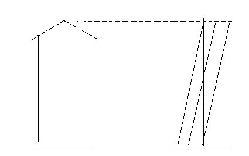

.. container::

   Háskóli Íslands – Umhverfis og byggingarverkfræðideild Húsagerð

   Björn Marteinsson

Lofthreyfing við hús, þrýstimunur yfir byggingarhluta og loftskipti
======================================================================

Almennt
-----------

Lofthreyfing og loftþrýstingur við byggingar hefur áhrif á þá áraun sem
bygging verður fyrir; álag á byggingarhluta, loftskipti í byggingu,
loftleka í gegnum byggingarhluta og jafnvel vatnsleka. Hér verður
fjallað um lofthreyfinguna almennt og það þrýstifall sem hún veldur yfir
byggingu í heild og einstaka byggingarhluta.

Lofthreyfing í og við byggingu orsakast af þrýstimun sem á uppruna sinn
í vindáhrifum, áhrifum hitamunar og vélrænni loftræsingu.
 
.. admonition:: Almennar líkingar og gildi
   :class: jafna

   .. math::
      \rho_a = \frac{p_a \cdot M_a}{R \cdot T} + \frac{p_w \cdot M_w}{R \cdot T} = \frac{p_a}{287.05 \cdot T} + \frac{p_w}{461.495 \cdot T}

þar sem:

.. list-table:: *Skýringar á táknum – lofteiginleikar*
   :header-rows: 0
   :widths: 10 60 30

   * - :math:`\rho_a`
     - eðlisþéttleiki lofts
     - :math:`kg/m^3`
   * - :math:`p_a`
     - loftþrýstingur (þurrt loft)
     - :math:`Pa`
   * - :math:`p_w`
     - rakþrýstingur
     - :math:`Pa`
   * - :math:`T`
     - hitastig
     - :math:`K`

Kvik seigja lofts:

.. math::

   \eta_a = (17.1 + 0.049 \cdot \theta) \cdot 10^{-6} \quad \text{N·s/m}^2

Lofthreyfing við byggingu og loftþrýstingur
-----------------------------------------------

Áhrif vinds
???????????

Hérlendis er vindur almennt langmikilvægasta orsök lofthreyfinga í og
við byggingu. Þegar loftið lendir á fyrirstöðu þá breytir það um stefnu
og missir jafnframt hluta af hreyfiorku sinni. Samkvæmt jöfnu
Bernoulli’s þá er summan af hreyfiorku, þrýstiorku og stöðuorku fasti,
en varðandi vindálag á byggingar má líta svo á að stöðuorkan breytist
lítið.

.. admonition:: Jafna 4.1
   :class: jafna

   .. math::
      1/2 \cdot \rho \cdot v^2 + p_a + g \cdot h \cdot \rho = fasti

þar sem 

.. list-table::
   :header-rows: 0
   :widths: 10 60 30

   * - :math:`\rho`
     - eðlisþéttleiki lofts (:math:`\rho \approx 1{,}25 \ kg/m^3` við 10 °C og 101300 Pa)
     - :math:`kg/m^3`
   * - :math:`v`
     - vindhraði
     - :math:`m/s`
   * - :math:`p_a`
     - loftþrýstingur í ótrufluðu streymi
     - :math:`Pa`
   * - :math:`g`
     - fallhröðun jarðar
     - :math:`m/s^2`
   * - :math:`h`
     - hæð (yfir viðmiðunarplani)
     - :math:`m`

Venja er að gefa upp vindþrýsting á flatareiningu, p, sem (jafna 4.2);

.. admonition:: Jafna 4.2
   :class: jafna

   .. math::
      p = \mu \cdot q

þar sem 

.. list-table:: 
   :header-rows: 0
   :widths: 10 60 30

   * - :math:`p`
     - þrýstingur
     - :math:`Pa`
   * - :math:`\mu`
     - formstuðull
     - :math:`-`
   * - :math:`q`
     - grunnálag vinds
     - :math:`Pa`

og

.. admonition:: Jafna 4.3
   :class: jafna

   .. math::
      q = 1/2 \cdot \rho v^2
 
Athuga skal að þrátt fyrir beina samsvörun milli jöfnu 4.3 og fyrsta lið
í Bernoulli jöfnunni (4.1) þá er í ákvörðun vindálagsins ekki endilega
gengið útfrá því að öll hreyfiorkan breytist í þrýsting, heldur er
formstuðullinn ákvarðaður (með mælingum) þannig að jafna 4.2 gildir
þegar grunnálagið er reiknað samkvæmt jöfnu 4.3.

Formstuðla yfirborðs, :math:`\mu`, má t.d. fá úr álagsstöðlum fyrir vindálag, mynd
4.1.

.. figure:: ./myndir/kafli04/formstudlar.png
  :align: center
  :width: 90%

.. centered:: 
   Mynd 4.1 Formstuðlar vindálags á byggingu (heimild: staðallinn DS 410,
   gömul útgáfa)

| 
Í stöðlum er almennt miðað við að þrýstingur innanhúss geti verið ýmist
undir- eða yfirþrýstingur miðað við þrýsting í ótrufluðu streymi
utandyra. Formstuðull innri þrýstings er háður dreifingu lekastaða í
hjúpfleti og hugsanlegum innri lokunum í húsinu.

Í staðlinum DS 410 er gert ráð fyrir að formstuðull innanhúss geti verið
hvort sem er 0,2 (yfirþrýstingur) eða -0,3 (undirþrýstingur) þegar gert
er ráð fyrir að loftlekastaðir séu jafndreifðir á hjúpveggjum og engir
skilveggir.

Útfrá jöfnu 4.2 má þá reikna ástreymisþrýsting, og mismunaþrýsting fyrir
byggingarhluta að einhverjum formstuðlum og vindhraða gefnum. Athuga
skal að þrýstimunurinn er drifkraftur loftunar í rásinni, en þrýstimunur
milli hitaðs rýmis og loftrásar getur einnig valdið loftskiptum milli
rýmis og rásar, mynd 4.2.

Dæmi 4.1. 
?????????

Reiknað þrýstifall yfir vegg vegna vinds sem stendur þvert á
flötinn. Gert er ráð fyrir að loftlekastaðir dreifist jafnt á alla
veggfleti (og því undirþrýstingur í húsinu).

Vindhraði í ótrufluðu streymi v=5 m/s (algengur meðalvindhraði í
Reykjavík).

Formstuðull úti áveðurs :math:`\mu_e = 0.7`, formstuðull inni
:math:`\mu_e= -0.3`, eðlisþéttleiki lofts :math:`\rho_a = 1.25 kg/m^3` 

Grunnálag vinds (jafna 4.3); :math:`q= 1/2 \cdot \rho_a \cdot v^2`
= :math:`1/2 \cdot 1.25 \cdot 5^2 = 15.6 Pa`

Þrýstifall yfir vegginn (jafna 4.2); :math:`\Delta p = \mu \cdot q = (0,7-(-0,3)) \cdot 15,6 Pa = 18.7 Pa`

Dæmi 4.2 
?????????

Reiknað þrýstifall yfir loftrás í þaki vegna vinds beint á
rásina áveðurs.

Vindhraði í ótrufluðu streymi v=5 m/s (algengur meðalvindhraði í
Reykjavík).

Formstuðull (formstuðlar við op inn í rásina verða þeir sömu og á
veggfletina hvoru megin) áveðurs :math:`\mu_1 = 0.7`, hlémegin
:math:`\mu_2 = -0.5` , þéttleiki lofts :math:`\rho_a = 1.25 kg/m^3`

Grunnálag vinds (jafna 4.3); :math:`q = 1/2 \cdot \rho_a \cdot v^2`
:math:`1/2 \cdot 1.25 kg/m^3 \cdot (5 m/s)^2 = 15,6 Pa`

Þrýstifall yfir rásina (jafna 4.2); :math:`\Delta p = \mu \cdot q = (0.7 - (-0.5)) \cdot 15.6 Pa = 18.7 Pa` 

Þrýstibreyting vegna hitamunar (skorsteinsáhrif)
?????????????????????????????????????????????????

Loftsúla af hæð h mun valda loftþrýstingi :math:`p_1` við neðri enda
súlunnar, jafna 4.4;

.. admonition:: Jafna 4.4
   :class: jafna

   .. math::
      p_1 = \rho_1 \cdot g_0 \cdot h + p_0

.. list-table:: *Skýringar á táknum – súlujöfnur*
   :header-rows: 0
   :widths: 10 60 30

   * - :math:`p_1`
     - loftþrýstingur við botn súlu
     - :math:`Pa`
   * - :math:`\rho_1`
     - eðlisþéttleiki lofts
     - :math:`kg/m^3`
   * - :math:`g_0`
     - fallhröðun til jarðar
     - :math:`m/s^2`
   * - :math:`h`
     - hæð súlu
     - :math:`m`
   * - :math:`p_0`
     - loftþrýstingur við topp súlu
     - :math:`Pa`

Eðlisþéttleiki lofts má finna útfrá almenna gaslögmálinu og samlagningu
hlutþrýstings á þurru lofti og rakaþrýstingi, jafna 4.5;

.. admonition:: Jafna 4.5
   :class: jafna

   .. math::
      \rho_a = \frac{p_a \cdot M_a}{R \cdot T} + \frac{p_w \cdot M_w}{R \cdot T} = \frac{p_a}{287.05 \cdot T} + \frac{p_w}{461.495 \cdot T}

þar sem 

.. list-table:: 
   :header-rows: 0
   :widths: 10 60 30

   * - :math:`\rho_a`
     - eðlisþéttleiki lofts
     - :math:`kg/m^3`
   * - :math:`p_a`
     - loftþrýstingur (þurrt loft)
     - :math:`Pa`
   * - :math:`p_w`
     - rakþrýstingur
     - :math:`Pa`
   * - :math:`M_a`
     - mólmassi þurrs lofts
     - :math:`kg/kmol`
   * - :math:`M_w`
     - mólmassi vatns
     - :math:`kg/kmol`
   * - :math:`T`
     - hitastig
     - :math:`K`
   * - :math:`R`
     - almenni gasfastinn
     - :math:`J/(kmol \cdot K)`

| 

Þéttleiki lofts breytist línulega í öfugu hlutfalli við breytingu á
hitastigi, í jöfnu 4.4 má því nota gildi fyrir meðalþéttleika loftsins. 

Inniloft er hérlendis nánast alltaf hlýrra heldur en útiloft og af þessu
hlýst þrýstimunur milli inni- og útilofts, hversu mikill þrýstimunurinn
er fer eftir hitamun í lofti og hæð byggingar (eða loftrásar). Ef
inniaðstæður eru táknaðar með lágmerki i og útiaðstæður með e, þá fæst
heildarþrýstimunurinn sem, jafna 4.6;

.. admonition:: Jafna 4.6
   :class: jafna

   .. math::
      \Delta p = p_i - p_e = g_0 \cdot h \cdot (\rho_i - \rho_e) ~ g_0 \cdot h \cdot \rho_i \cdot (1- \frac{T_i}{T_e})

Þrýstimunur milli úti- og inniaðstæða fer eftir staðsetningu tenginga
(opa) milli rýmanna. Þessu má lýsa eins og sýnt er í mynd 4.3.

| 

**Dæmi 4.3:** 
   Reiknaður þrýstimunur inni og úti við gólf einnar hæðar húss
   þar sem 0-lína þrýstifalls (opnir gluggar) liggur í hæðinni 1,5 m yfir
   gólfi. :math:`\theta_i = 22°C`, :math:`\theta_e = -2°C`, :math:`\rho_m = 1.25 kg/m^3`

.. math::
   \Delta p = p_i - p_e ~ g_o \cdot h \cdot \rho_m \cdot (1 - \frac{T_i}{T_e})
   
   = 9.81 m/s^2 \cdot 1.5 m \cdot 1.25 kg/m^3 \cdot (1- \frac{(22+273)}{(-2+273)}) = -1.5 Pa

| 

**Dæmi 4.4:**
Reiknaður þrýstimunur inni og úti við gólf 5 hæða stigahúss
sem loftræst er upp úr þaki, :math:`\theta_i = 22°C`, :math:`\theta_e = -2°C` :math:`\rho_m = 1.25 kg/m^3`, hver hæð er 2,7 m.

.. math::
   \Delta p = p_i - p_e ~ g_o \cdot h \cdot \rho_m \cdot (1 - \frac{T_i}{T_e})
   
   = 9.81 m/s^2 \cdot (4 \cdot 2.7 m)  \cdot 1.25 kg/m^3 \cdot (1- \frac{(22+273)}{(-2+273)}) = -10.8 Pa

Þrýstimunur vegna mismunahita er almennt lítill, og oftast mun minni
heldur en þrýstimunur vegna vinds. Í einstaka tilvikum getur hitamunur
þó haft umtalsverð áhrif, t.d. eru þekkt dæmi um að loftpoki í mæni á
bröttum, loftræstum þökum hafi teppt loftun þakanna.

Rakaflutningur vegna loftstreymis
-------------------------------------

Rakaflutningur vegna loftstreymis verður í samræmi við jöfnu 4.7;

.. admonition:: Jafna 4.7
   :class: jafna

   .. math::
      G = w \cdot V_a

Þar sem

.. list-table:: 
   :header-rows: 0
   :widths: 10 60 30

   * - :math:`G`
     - rakaflutningur
     - :math:`kg/s`
   * - :math:`w`
     - loftraki
     - :math:`kg/m^3`
   * - :math:`V_a`
     - loftstreymi
     - :math:`m^3/s`
 
Streymi í vökva eða póróttu efni má skrifa eins og jafna 4.8 sýnir,
jafnan er kennd við Darcy;

.. admonition:: Jafna 4.8
   :class: jafna

   .. math::
      V_a = A \cdot \frac{B_0}{\eta} \cdot \frac{\partial p}{\partial x}

Þar sem

.. list-table:: 
   :header-rows: 0
   :widths: 10 60 30

   * - :math:`V_a`
     - streymi
     - :math:`m^3/s`
   * - :math:`B_0`
     - loftheypni efnis (*e: air permeability*)
     - :math:`m^2`
   * - :math:`\eta`
     - kvik seigja
     - :math:`N \cdot s/m^2`
   * - :math:`dp/dx`
     - stigull þrýstings (t.d. loft-)
     - :math:`Pa`

Jafna 4.8 er umskrifað fyrir einsleitt efnislag þannig (jafna 4.9)

.. admonition:: Jafna 4.9
   :class: jafna

   .. math:: 
      V_a = A \cdot \frac{B_0}{\eta} \cdot \frac{\Delta p}{\Delta L}

þar sem :math:`\Delta L` lengd streymisrásar (þykkt efnislags), m

... aðrar stærðir sem fyrr

|

Iðulega eru efnisstuðlar og þykkt í jöfnu 4.9 teknar saman í eina stærð
til einföldunar, jafna 4.10;

.. admonition:: Jafna 4.10
   :class: jafna

   .. math::
      R_l = \frac{\eta \cdot L}{B_0}

þar sem :math:`R_l` lofthleypnimótstaða efnislags, :math:`m^2 \cdot s \cdot Pa / m^3`

... aðrar stærðir sem fyrr

| 

Gildi fyrir lofthleypni eru iðulega gefin upp annarsvegar sem hreint
efnisgildi, B\ :sub:`0` (sbr. jöfnur 4.8 og 4.9), hinsvegar sem samsett
gildi úr efnisþykkt og seigju vökva eða lofttegundar, L/. Í töflu 4.1
eru gefin upp slík gildi fyrir nokkur efni.

| 

+----------------+-----------+----------------+----------------+----+
| Tafla 4.1      |           |                |                |    |
| Lofthleypni    |           |                |                |    |
| efna (heimild: |           |                |                |    |
| Nevander &     |           |                |                |    |
| Elmarsson,     |           |                |                |    |
| 1994)          |           |                |                |    |
+----------------+-----------+----------------+----------------+----+
| Efni           | Þéttleiki | Lofthleypni    | Lofthleypni    | |  |
|                |           | L/            | efnis          |    |
|                | kg/m3     |                | B\ :sub:`0`\   |    |
|                |           | x1             |                |    |
|                |           | 0\ :sup:`-6`\  | x              |    |
|                |           | m\ :sup:       | 10             |    |
|                |           | `3`\ /(m∙s∙Pa) | \ :sup:`-12`\  |    |
|                |           |                | m\ :sup:`2`    |    |
+----------------+-----------+----------------+----------------+----+
| Tígulsteinn    | 1470      | 0,005 – 0,05   | 0,1 – 1        | |  |
+----------------+-----------+----------------+----------------+----+
| Steypa         | |         | 0,000005 –     | 0,0001 – 0,01  | |  |
|                |           | 0,0005         |                |    |
+----------------+-----------+----------------+----------------+----+
| Frauðplast EPS | |         | 30 - 500       | 500 - 10000    | |  |
+----------------+-----------+----------------+----------------+----+
| Steinull  á   | 10 - 50   | 80 - 400       | 1500 - 7500    | |  |
| yfirborð       |           |                |                |    |
+----------------+-----------+----------------+----------------+----+
| Steinull \|\|  | 10 - 50   | 160 - 800      | 3000 - 15000   | |  |
| yfirborði      |           |                |                |    |
+----------------+-----------+----------------+----------------+----+
| Steinull  á   | 100 - 150 | 15 – 50        | 250 – 1000     | |  |
| yfirborð       |           |                |                |    |
+----------------+-----------+----------------+----------------+----+
| Steinull \|\|  | 100 - 150 | 30 – 400       | 500 - 2000     | |  |
| yfirborði      |           |                |                |    |
+----------------+-----------+----------------+----------------+----+
| Spænir -       | 100       | 500 - 800      | 11500          | |  |
| lausir         |           |                |                |    |
+----------------+-----------+----------------+----------------+----+

| 

Fyrir þunn efnislög með ákveðna gerð þá er oft heppilegt að gefa upp
mælt gildi fyrir efnislagið beint en ekki sem efnisstuðul eins og sýnt
er í töflu 4.1. Dæmi um slík gildi eru sýnd í töflu 4.2.

| 

+----------------+----------------+----------------+----------------+
| Tafla 4.2      |                |                |                |
| Lofth          |                |                |                |
| leypnimótstaða |                |                |                |
| efnislaga      |                |                |                |
| (heimild:      |                |                |                |
| Nevander &     |                |                |                |
| Elmarsson,     |                |                |                |
| 1994)          |                |                |                |
+----------------+----------------+----------------+----------------+
| Efni           | Lýsing         | Lofth          | Lofthleypni    |
|                |                | leypnimótstaða | efnislags      |
|                |                |                | B              |
|                |                | x              | \ :sub:`0`\ /L |
|                |                | 10\ :sup:`6`\  |                |
|                |                | m\ :s          | x              |
|                |                | up:`2`\ ∙s∙Pa/ | 10             |
|                |                | m\ :sup:`3`    | \ :sup:`-12`\  |
|                |                |                | m              |
+----------------+----------------+----------------+----------------+
| Trétrefjaplata | 12,5 mm 260    | 0,05           | 300            |
| (opin)         | kg/m\ :sup:`3` |                |                |
+----------------+----------------+----------------+----------------+
| Trétrefjaplata | 20 mm 280      | 0,1            | 175            |
| (opin)         | kg/m\ :sup:`3` |                |                |
+----------------+----------------+----------------+----------------+
| Trétrefjaplata | 3,5 mm, 400    | 10             | 1,5            |
| (þétt)         | kg/m\ :sup:`3` |                |                |
+----------------+----------------+----------------+----------------+
| Pappír         | 200            | 0,006          | 2850           |
|                | g/m\ :sup:`2`  |                |                |
+----------------+----------------+----------------+----------------+
| Tjörupappi     | 600            | 9              | 2              |
| (gegnvættur)   | g/m\ :sup:`2`  |                |                |
+----------------+----------------+----------------+----------------+
| Tjörupappi     | |              | 25-100         | 0,1-1,0        |
| (húðaður)      |                |                |                |
+----------------+----------------+----------------+----------------+

| 

Lofthleypni flestra byggingarefna er mjög lítil, og rakaflutningur vegna
lofstreymis þvert á byggingarhluta því almennt lítill í samanburði við
t.d. rakaflæði. Þetta gildir þó alls ekki um t.d. létta
steinullareinangrun, sem þarf því iðulega að verja með sérstakri
vinþéttingu (gustlokun).

| 

**Loftstreymi í loftbilum og opum**

Þegar loftstreymi einkennist af lagstreymi (e: laminar flow) þá gildir
jafna 4.9 og streymið er í beinu hlutfalli við þrýstistigulinn;

V~p

| 

Í þröngum loftbilum og opum má almennt gera ráð fyrir iðustreymi og þá
gildir jafna 4.9 ekki lengur, streymið verður nú í hlutfalli við rótina
af þrýstistigulnum;

V~p

| 

Samsvarandi þá verður milliástand lag- og iðustreymis í hlutfalli við;

V~p\ :sup:``\  , 0,5 <  < 1

| 

Í útreikningi á streymi um loftbil, rifur og göt þá þarf að hafa í huga
að heildarþrýstifall yfir loftleiðina ræður streyminu; hluti þrýstifalls
verður við inn- og útstreymi og hluti á leið lofts um rásina (gildir
sérstaklega um rifur og göt í þykkum efnum miðað við gatstærð).
Þrýstifall yfir loftrás er því almennt summan af minnst þrem tapliðum
(mynd 4.4);

+----------------------------------+----------------------------------+
| |                                | .. image:: myndir/k                     |
|                                  | afli04_html_842c26e27ae2b5b2.png |
| |                                |    :name: Picture 52             |
|                                  |    :width: 165px                 |
| |                                |    :height: 117px                |
|                                  |                                  |
| p=P\ :su                        |                                  |
| b:`1`-P\ :sub:`2`\ =p\ :sub:`1` |                                  |
| + p\ :sub:`2` + p\ :sub:`3`    |                                  |
|                                  |                                  |
| |                                |                                  |
+----------------------------------+----------------------------------+
| |                                | |                                |
|                                  |                                  |
|                                  | *Mynd 4.4 Loftrás og þrýstifall* |
+----------------------------------+----------------------------------+

|Line 510|

| 

| 

| 

Í sumum tilvikum geta verið stakar mótstöður í loftrásinni sem taka þarf
tillit til. Hlutfallslegt vægi þrýstitapsliðanna er háð innbyrðis
stærðarhlutföllum, hrjúfleika, lengd rásar og lögun.

| 

Inn- og útstreymistöp fyrir venjulegar aðstæður í byggingarefnum og
byggingarhlutum (iðustreymi) má reikna samkvæmt jöfnu 4.11;

|image6| (4.11)

þar sem  tapstuðull, ef gildið er ekki þekkt má nota =1,8 (sjá annars
töflu 4.3)

 þéttleiki vökva eða lofttegundar

V\ :sub:`a`\  streymi, m\ :sup:`3`\ /s

A þverskurðarflatarmál, m\ :sup:`2`

| 

| 

+----------------------------------+----------------------------------+
| Tafla 4.3 Þrýstitapstuðull rásar |                                  |
|  (Andri Páll Hilmarsson, 2007)  |                                  |
|                                  |                                  |
| |                                |                                  |
+----------------------------------+----------------------------------+
| Gerð rásar                       | Þrýstitapstuðull,                |
|                                  | \ `1 <#sdfootnote1sym>`__       |
| |                                |                                  |
+----------------------------------+----------------------------------+
| Rör; D=33 mm, með plastraufum,   | 6,10                             |
| L= 297 mm                        |                                  |
+----------------------------------+----------------------------------+
| Rör; D=40 mm, með plastraufum,   | 4,50                             |
| L= 400 mm                        |                                  |
+----------------------------------+----------------------------------+
| Rör; D=33 mm, með neti, L= 340   | 2,91                             |
| mm                               |                                  |
+----------------------------------+----------------------------------+
| Rör; D=33 mm, opið, L= 297 mm    | 1,70                             |
+----------------------------------+----------------------------------+
| Rör; D=40 mm, opið, L= 400 mm    | 1,77                             |
+----------------------------------+----------------------------------+
| Rás; 14x115mm krossviðarrás,     | 1,72                             |
| þykkt 14mm (L= 14 mm)            |                                  |
+----------------------------------+----------------------------------+
| Rás; 15x100 mm skarð í 45 mm     | 1,50                             |
| sperru (L=45 mm)                 |                                  |
+----------------------------------+----------------------------------+
| Gat; D=26 mm í 45 mm sperru      | 1,25                             |
| (L=45 mm)                        |                                  |
+----------------------------------+----------------------------------+
| Gat; D=38 mm í 45 mm sperru      | 1,14                             |
| (L=45mm)                         |                                  |
+----------------------------------+----------------------------------+

| 

| 

| 

Fyrir aflanga rás (eða loftbili) gildir fyrir lagstreymi svonefnd
Hagen-Poiseuille jafna, 4.12, (sjá einnig mynd 4.5);

| |image7|

|image8| (4.12)

þar sem V\ :sub:`a`\  streymi, m\ :sup:`3`\ /s

A þverskurðarflatarmál =b∙d, m\ :sup:`2`

b þykkt loftbils, m

 kvik seigja, N∙s/m\ :sup:`2`

p þrýstifall yfir streymislengd L, Pa Mynd 4.5 Loftrásir; stærðir

L streymislengd, m

| 

Fyrir sívala rás gildir fyrir lagstreymi jafna 4.13 (sjá einnig mynd
4.5)

|image9| (4.13)

| 

þar sem A þverskurðarflatarmál =∙d\ :sup:`2`\ /4, m\ :sup:`2`

d þvermál gats, m

... aðrar stærðir sem fyrr

| 

Heildarþrýstifall í streymi verður því í stökum rifum eða rörum, jöfnur
4.14 og 4.15;

| 

Rifa: (4.14)

Rör: (4.15)

| 

Þegar gert er ráð fyrir að loftið (eða vökvinn) pressist ekki saman í
streyminu (eðlileg forsenda við þessar aðstæður) þá er loftstreymið
V\ :sub:`a`\  það sama í öllum sniðum í rásinni. Reiknað hlutfall
V\ :sub:`a`\ /A fyrir mismunandi hluta rásar gefur þá meðalstreymishraða
í sniðinu; v\ :sub:`m`\ =V\ :sub:`a`\ /A.

| 

Í einstaka tilvikum er hægt að líta framhjá tapliðum vegna inn- og
útstreymis og einfaldast reikningarnir þá nokkuð, í öðrum tilvikum
verður að leysa annarargráðujöfnu 4.14 eða 4.15 fyrir loftstreyminu
V\ :sub:`a`\  og reikna síðan meðal streymishraðann v\ :sub:`m`\  ef
vill fyrir einstaka hluta rásarinnar.

| 

Jöfnurnar 4.12 og 4.13 (og þá einnig hluti jafnanna 4.14 og 4.15) gilda
einungis fyrir lagstreymi. Lagstreymi er talið gilda þegar eftirfarandi
skilyrði er uppfyllt (viðmiðunargildi, ekki nákvæm mörk);

Reynoldstalan < 2300

þar sem v\ :sub:`m`\  meðalstreymishraði, m/s

d\ :sub:`H`\  streymiskennitala þversniðs, m d\ :sub:`H`\ =4A/U,
A=flatarmál, U=ummál

 eðlisseigja, m\ :sup:`2`\ /s

Fyrir Re>2300 er hreint lagstreymi ekki endilega til staðar og athuga
þarf sérstaklega hvaða áhrif þetta kann að hafa.

| 

Iðulega er loftrás samsett úr rað- og samsíðatengingum ólíkra hluta
loftrása. Heildarmótstöðu, og streymi í einstökum greinum, má þá finna
með reikningum sem byggja á sömu aðferðum og notaðar eru til að reikna
straum í rafrás sem einungis samanstendur af mótstöðum.

Dæmi 4.5 Reiknað loftstreymi í loftrás þaks, og lofthraði í einstökum
hlutum hennar.

Heildarþrýstifall yfir rásina er 18,7 Pa (sjá Dæmi 4.2).

Loftrásin er uppbyggð þannig;

Loftbil (b∙d∙L, sjá mynd 4.4) 25∙550∙10000 mm,

Op inn í og út úr loftbili eru tvö rör D40 mm hvoru megin,
L\ :sub:`rör`\  = 300 mm.

A\ :sub:`rör`\ =1256 mm\ :sup:`2`\  (eitt rör!)

A\ :sub:`loftb`\ =13750 mm\ :sup:`2`\ 

| 

Meðallofthiti í rás; =5 °C; -> =(17+0,049∙5) ∙10\ :sup:`-6`\  =
17,2∙10\ :sup:`-6`\  N∙s/m\ :sup:`2`

| 

Athuga skal að loftrásin er uppbyggð sem röð af rásum (rör-loftbil-rör)
og þrýstitöp í rásin verða hér (streymistapi í sjálfum rörleggjunum
sleppt);

p = p\ :sub:`inn`\  + p\ :sub:`út`\  + p\ :sub:`rás`\  +
p\ :sub:`inn`\  + p\ :sub:`út`

| 

rör loftbil rör

| 

Streymistap í rörum áveðurs (jafna 4.11) ;

p\ :sub:`áv`\ =1,8∙(1,25/2)∙(V\ :sub:`a`\ /(2∙1256∙10\ :sup:`-6`\ ))\ :sup:`2`\ 
= 178284∙V\ :sub:`a`\ :sup:`2`

| 

Streymistap í loftbili (jafna 4.12);

p\ :sub:`bil`\ =(12∙ 17,2∙10\ :sup:`-6`\ ∙ 10000∙10\ :sup:`-3`\  /
((25∙10\ :sup:`-3`\ )\ :sup:`2`\  ∙13750∙10\ :sup:`-6`\ ))
∙V\ :sub:`a`\  = 240,2∙V\ :sub:`a`

| 

Streymistap í rörum hlémegin (sama og áveðurs) ;

p\ :sub:`hlé`\ = = 178284∙V\ :sub:`a`\ :sup:`2`

| 

Jafnan fyrir heildartapið verður;

18,7 = 2∙178284∙V\ :sub:`a`\ :sup:`2`\ +240,2∙V\ :sub:`a`\ 

og reiknað streymi, V\ :sub:`a`\ , fæst sem;

V\ :sub:`a`\ = 0,0069 m\ :sup:`3`\ /s

| 

Reiknaður meðallofthraði;

Rör; v\ :sub:`rör`\ = 0,0069/(2∙1256∙10\ :sup:`-6`\ )) = 2,75 m/s (gefur
Re=7990)

Loftbil; v\ :sub:`loftbil`\ = 0,0069/(13750∙10\ :sup:`-6`\ )) = 0,50 m/s
(gefur Re=1738)

| 

Af dæminu má draga eftirfarandi ályktanir;

1. Í þessu tilfelli þá skipta streymistöp í loftbilinu svo til engu máli
borið saman við streymistöp vegna inn- og útstreymis (þetta gildir
iðulega þegar um áberandi stakar þrengingar eða útvíkkanir er að ræða).

2. Lofthraði í opum inn í bilið getur verið allnokkur (slagar í
vindhraðann úti) og því hætta á að skafi inn í bilið ef ekkert er að
gert.

3. Loftstreymið er lítið, og þurrkun byggingarraka verður hæg (einkum
yfir vetrartímann þegar loftið er kalt og tekur upp lítinn raka!).

| 

4.4 Loftþéttleiki húsa
----------------------

Loftþéttleiki bygginga er áhugaverður þar sem þéttleiki húss hefur áhrif
á orkunotkun og almennt hve auðvelt er að stýra inniaðstæðum.
Óhjákvæmilegt er að einhverjir loftlekar verða alltaf til staðar í
veðurhjúp bygginga, þessi loftleki er iðulega vegna dreifðrar
lofthleypni byggingarhluta almennt, en göt og rifur geta haft mikil
áhrif.

| 

Loftþéttleikinn er mældur þannig að opum er lokað (þegar útiloka á áhrif
t.d. hurða alveg þá eru rifur þéttar með límbandi) og loftdælu í spjaldi
komið fyrir í hurðargætt eða gluggaopi. Loftdælan er með mælibúnaði
þannig að mæla má dælt loftmagn og settur er upp mismunanþrýstimælir sem
mælir þrýstimun úti og inni. Mæling er almennt gerð fyrir annarsvegar
undirþrýsting og hinsvegar yfirþrýsting í húsi, og meðaltal tekið af
niðurstöðum. Útfrá mæliniðurstöðum má setja upp jöfnu loftleka við
þrýstifall, jafnan fær almennt formið (jafna 4.16);

| 

V\ :sub:`a`\ =a∙P\ :sup:`b`\  (4.16)

| 

þar sem V\ :sub:`a`\  loftmagn, m\ :sup:`3`\ /klst

a,b stuðlar

P þrýstimunur úti og inni, Pa

| 

Niðurstöður fyrir mæld loftskipti við 50 Pa í 231 húsi (flest í
Reykjavík) eru sýndar í línuritum 4.1 og 4.2. Nánari umfjöllun um
loftleka húsa og loftþéttleikamælingar má t.d. finna í Rb-blaði
(I\ :sub:`5`\ ).001 “Þéttleiki húsa” og grein eftir B. Marteinsson og J.
Sigurjónsson (1997).

| 

Áður var gerð krafa um hámarksloftskipti byggingar við 50 Pa, mælt eins
og að ofan er lýst, en í gildandi byggingarreglugerð eru kröfur um
mældan loftleka byggingarhluta við 50 Pa (Byggingarreglugerð, 2012);

| 

*Loftþéttleiki húsa.*

*13.5.1. gr*

*Kröfur*

Tryggja skal að hús séu nægjanlega loftþétt til að koma í veg fyrir
orkutap og að dragsúgur valdi ekki óþægindum.

Fyrir fullhitað húsnæði (Ti>18°C) skal miða við að þéttleiki
byggingarflata í hjúpfleti sé nægjanlegur þannig að lofthleypni mæld við
50 Pa mismunaþrýsting sé minni heldur en töflugildi sýna.

Loftþéttleiki byggingarhluta skal vera skv. töflu 13.03

| 

Tafla 13.03 Loftþéttleiki byggingarhluta

+----------------------------------+----------------------------------+
| Íbúðarhúsnæði og aðrar byggingar | q\ :sub:`50`\  <                 |
| þar sem gerðar eru sambærilegar  | 3m\ :sup:`3`\ /m\ :sup:`2`\ ,h   |
| kröfur til innivistar            |                                  |
|                                  | |                                |
+----------------------------------+----------------------------------+
| Aðrar byggingar                  | q\ :sub:`50`\  <                 |
|                                  | 6m\ :sup:`3`\ /m\ :sup:`2`\ ,h   |
|                                  |                                  |
|                                  | |                                |
+----------------------------------+----------------------------------+
| q\ :sub:`50`\  er loftstreymi    |                                  |
| mælt við 50 Pa mismunaþrýsting.  |                                  |
|                                  |                                  |
| |                                |                                  |
+----------------------------------+----------------------------------+

| 

| 

| 

+----------------------------------+----------------------------------+
| .. image:: myndir/k                     | |                                |
| afli04_html_5b5f02c6a0351862.png |                                  |
|    :name: Image4                 | |                                |
|    :width: 347px                 |                                  |
|    :height: 313px                | .. image:: myndir/k                     |
|                                  | afli04_html_ad2fc1ae31c91420.png |
|                                  |    :name: Image5                 |
|                                  |    :width: 260px                 |
|                                  |    :height: 274px                |
+----------------------------------+----------------------------------+
| Línurit 4.1 Mæld loftskipti í    | Línurit 4.2 Mæld loftskipti      |
| 231 húsi                         | eftir byggingarári húsa          |
|                                  |                                  |
| (heimild: B. Marteinsson og J.   | (heimild: B. Marteinsson og J.   |
| Sigurjónsson, 1997)              | Sigurjónsson, 1997)              |
+----------------------------------+----------------------------------+

| 

Mæling eins og að ofan er lýst getur aðeins gefið meðalleka fyrir alla
fleti byggingar. Með sérstökum búnaði má mæla einstaka byggingarhluta en
erfitt er að útiloka jaðaráhrif (loftleka frá mælisvæði til aðliggjandi
byggingarhluta) í slíkum mælingum.

| 

**Heimildir og ítarefni**

Andri Páll Hilmarsson (2007) Loftun þaka og rakaálag, BSc ritgerð,
Háskólinn í Reykjavík

P. Blom (1990) Ventilation av isolerte skrå tak, PhD thesis, NTH
HBT-rapport 1990:D 10, Oslo, Norge

Byggingareglugerð nr. 112/2012 (sbr. reglug. nr. 1173/2012 og 350/2013),
með áorðnum breytingum, Umhverfisráðuneytið, Reykjavík

B. Marteinsson, J. Sigurjónsson (1997) “Air-tightness of Buildings and
the Required Heating Load - are Current Design Criteria Appropriate for
a Windy region?”, *Proc. International conference Cold Climate- HVAC’97,
Reykjavík* 30.5 - 2.5 1997, 7p.

DIF (1982) DS 410 Last på konstruktioner, 3. udgave juni 1982 (Dansk
ingeniørforenings norm for), Teknisk forlag Normstyrelsens publikationer

Jón Viðar Guðjónsson (1990) Loftun þaka með þunnu loftbili, lokaverkefni
í byggingartæknifræði við Tækniskóla Íslands, Reykjavík

Jón Viðar Guðjónsson og Ríkharður Kristjánsson (1991) “Loftun þaka með
þunnu loftbili”, grein í Tæknivísir – blað byggingartæknifræðinema,
Reykjavík

K. Lierch (1986) Belüftete Dach- und Wandkonstruktionen, band 1-4,
Bauverlag GmbH-Wiesbaden und Berlin, Germany

J. Kronvall (1980) Air flows in building components, Report TVBH-1002,
Division of building technology, Lund Institute of technology, Lund,
Sweden

L. E. Nevander, B. Elmarsson (1994) Fukthandboken, Svensk byggtjänst,
Stockholm

L. E. Nevander, I. Samuelsson (1976) Elementär byggnadsfysik, Kompendium
i husbyggnadsteknik, Institutionen för byggnadsteknik, Tekniska
Högskolan i Lund, Lund, Sverige

Rb-blað (1985) Þéttleiki húsa, Rb-blað (I\ :sub:`5`\ ).001,
Rannsóknastofnun byggingariðnaðarins, Keldnaholt, Reykjavík

| 

.. container::
   :name: sdfootnote1

   `1 <#sdfootnote1anc>`__\  Tapstuðullinn er reiknaður fyrir alla
   rásina, að því gefnu að streymið einkennist af iðustreymi

.. container::

   4.12

   | 

.. |image1| image:: myndir/kafli04_html_74633322707c34c5.png
   :name: Object2
   :width: 304px
   :height: 41px

