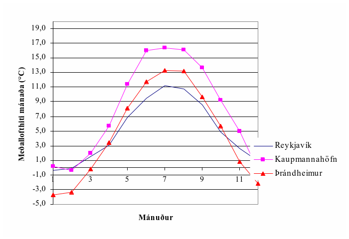
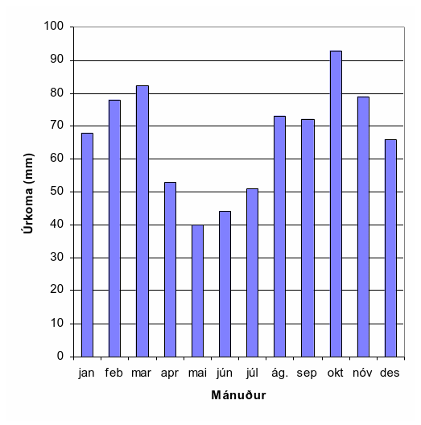
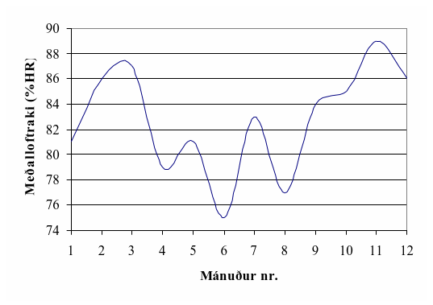
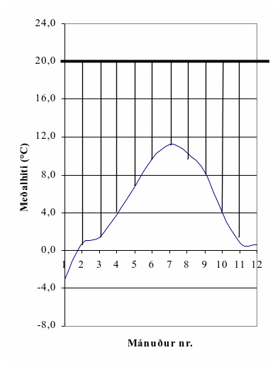
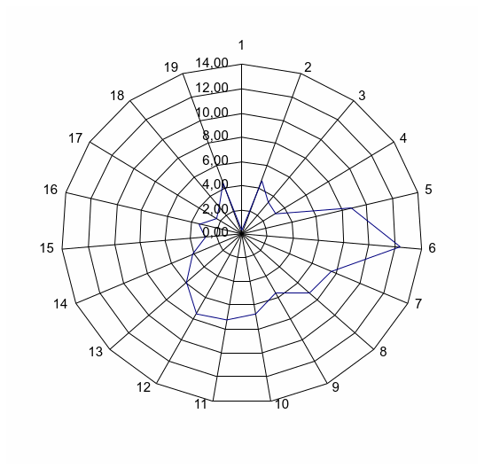
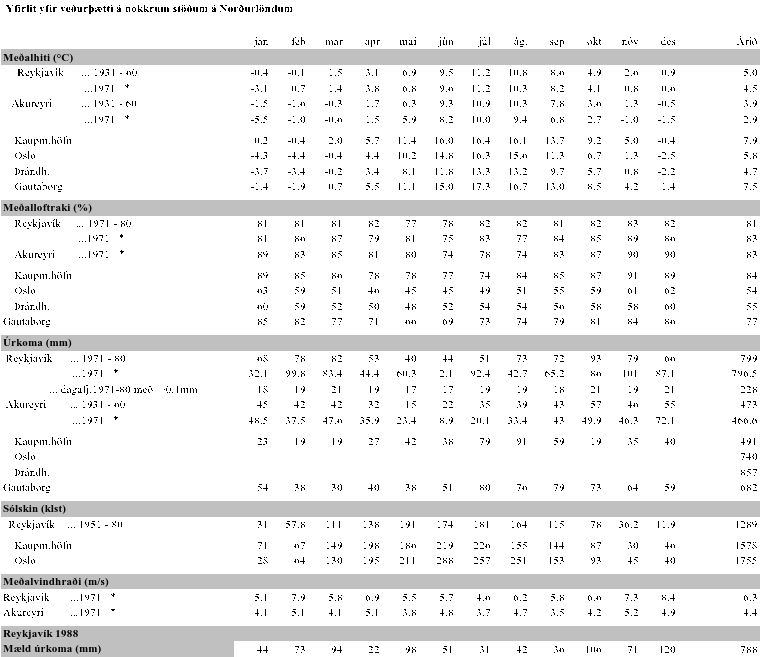
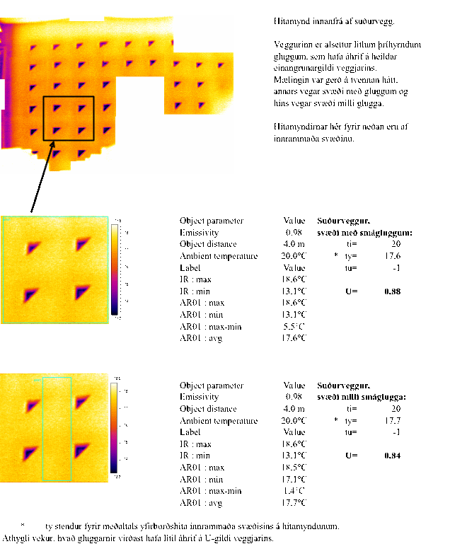

.. container::

   Háskóli Íslands – Umhverfis og byggingarverkfræðideild Húsagerð

   Björn Marteinsson

   | 

5 Veðurfar og inniaðstæður
==========================

5.1 Almennt
-----------

Ísland liggur á tempraða beltinu, og hitabreytingar því takmarkaðar; hér
er sjaldan verulega kalt eða heitt. Þar sem landið er hálent og liggur í
braut lægða sem fara um Atlantshafið þá er vætusamt sunnanlands og
vestan en mun þurrara norðanlands.

| 

Í veðurfræðum eru notuð tvö hugtök sem ástæða er til að átta sig á;

Veðrátta (e: weather) lýsir ástandi á hverjum tíma

Veðurfar (e: climate) lýsir meðalástandi

| 

5.2 Veðurfar á Íslandi og samanburður við erlendar aðstæður
-----------------------------------------------------------

Upplýsingar sem eru birtar í línuritum og töflum, og varða Ísland, eru
allar byggðar á mælingum Veðurstofu Íslands. Hluti mæligildanna er
fenginn úr almennum mælingum Veðurstofunnar, en hluti byggir á mælingum
sjálfvirkra mælistöðva sem mæla á 1-3 klst. fresti (línurit 5.2 – 5.5).

Línurit 5.1 Meðalhitastig mánaða í Reykjavík, Kaupmannahöfn og
Þrándheimi

| 

Árshitastigssveifla er í Reykjavík umtalsvert minni heldur en gerist í
grannríkjunum, jafnvel þegar bornir eru saman bæir á hliðstæðum
breiddargráðum (Reykjavík og Þrándheimur).

Línurit 5.2 Meðalúrkoma mánaða í Reykjavík (1971-1980)

| 

Meðalársúrkoma í Reykjavík er um 800 mm, það rignir sjaldan mikið en
rigningardagar eru þeim mun fleiri eða að meðaltali um 220 dagar á ári.
Úrkoma kemur nokkuð jafnt alla mánuði ársins, línurit 5.2. Loftraki er
ennfremur allhár árið um kring, línurit 5.3, og þetta, ásamt lágum
sumarhita, getur orðið til þess að útþornun byggingarhluta gangi hægt.

| 

| 

Línurit 5.3 Meðalloftraki í Reykjavík (viðmiðunarárið 1971)

Línurit 5.4 Hitamunur inni og úti; Reykjavík (viðmiðunarárið 1971)

| 

| 

| 

Línurit 5.5 Tíðni vindátta í Reykjavík- vindrós fyrir tímabilið
1999-2000.

Tíðni mismunandi vindátta í Reykjavík (1999 – 2000) er sýnd á línuriti
5.5, og sést þar að austanáttir eru langalgengasta vindstefnan. Af
línuritinu er að sjá eins og norðanátt komi aldrei á svæðinu, sem er
alls ekki reyndin hinsvegar eru vindstefnumælar sjálfvirkra mælistöðva
“blindir” á smá svæði, svæði sem iðulega er snúið í norður.

Útfrá upplýsingum um veðurfar eru iðulega skilgreindar nokkrar
viðmiðunarstærðir;

| 

*Gráðutímar (gráðudagar)*

Orkutap húsa er háð hitamun úti og inni, en einnig tímanum sem
hitamunurinn ríkir, þetta samsvarar flatarmáli strikaða hlutans á
línuriti 5.4. Summa margfeldis hitamunar og tíma er kölluð “gráðutímar”
ef tímaeiningin er klukkustundir (og reiknað útfrá meðalhita
klukkustunda) en “gráðudagar” ef tímaeiningin er dagar (og þá miðað við
meðalhita daga).

| 

Vætutími (e: time of wetness, TOW)

Það hefur verið sýnt fram á að tæring málma er beint háð tímalengd
yfirborðsvætu á fleti; vætutíma. Í staðlinum ISO 9223:1992 er vætutími
skilgreindur útfrá hitastigi og loftraka; TOW; tímalengd þegar >0 °C og
80 %HR

| 

*Frost-þýðu sveiflur*

Fjöldi hitabreytinga úr hita í frost, þ.e. fjöldi sveiflna, talið á
ársgrundvelli.

| 

*Frost í kjölfar úrkomu*

Áhugavert er að skoða hversu oft frýs fljótlega eftir úrkomu (þegar gera
má ráð fyrir að efnisraki sé ennþá hár).

| 

*Froststundir*

Tímalengd frosts (<0 °C)

| 

| 

| 

| 

| 

| 

| 

Tafla 5.1 Veðurfar á nokkrum stöðum á Íslandi og hinum Norðurlöndunum

| 

| 

Veðrátta hér er í mörgu tilliti óvægnari fyrir byggingar heldur en
gerist og gengur annarsstaðar; loftslag er rakt, úrkomur tíðar, slagregn
algeng, hitaskipti milli frosts og þýðu algeng.

| 

| 

| 

| 

| 

5.3 Þægindakröfur og inniloft
-----------------------------

*Varmajafnvægi mannslíkamans*

Líkamshitinn þarf að vera sem næst 37 °C og við bestu skilyrði er
húðhitinn um 4 °C lægri heldur en innri hitinn, þ.e. um 33 °C. Til þess
að halda líkamshita stöðugum þá bregst líkaminn við ytri aðstæðum með
annaðhvort hita- eða kuldaviðbrögðum.

| 

Líkaminn bregst við lækkandi hitastigi með því að draga svitaholurnar
saman, öflug vöðvaviðbrögðin kringur holurnar geta birst sem gæsahúð.
Blóðstreymi til húðar, sérstaklega á handleggjum og fótum, minnkar (æðar
dragast saman) og hitastig húðarinnar getur fallið á kroppnum almennt
niður í 30 °C og enn meira á útlimum. Blóðstreymi til slímhúða minnkar
einnig. Næstu viðbrögð (húðhiti um 31 °C) eru ósjálfráður skjálfti sem
getur aukið varmagjöf líkamans fjór- til fimmfalt á við varmagjöf í
hvíld. Einstaklingurinn reynir jafnframt að minnka varmatap um yfirborð
með því að hnipra sig saman. Við frekari kælingu byrjar innri hiti
líkamans að lækka, þegar hitinn fer niður í 33 °C þá hefur slíkt áhrif á
heilastarfsemina, við 26-25 °C fylgir meðvitundarleysi.

| 

Við aðstæður þegar húðhiti hækkar uppfyrir eðlilegan hita (33 °C) og
hætta er á að innri hitinn hækki einnig, þá bregst líkaminn við með því
að auka blóðstreymi til húðarinnar (æðar víkkaðar) og við erfið skilyrði
getur húðhitinn hækkað upp í 36 °C og varmatap vegna leiðni og geislunar
vex því mikið. Ef breyting á blóðstreymi dugir ekki til þá losar
líkaminn sig við umframorku með útgufun (svita). Ef þessi viðbrögð duga
ekki þá hækkar innri hitinn, andadráttur og púls verður hraðari, og svo
hættir svitamyndunin. Þessu fylgir þreyta og angist og svo getur farið
að hjartað gefi sig - hitaslag.

| 

*Orkubúskapur líkamans*

Líkami fullorðinnar manneskja inniheldur um 2000 kcal og ef orkubreyting
á ekki að verða til þess að innri hitinn breytist þá má orkutapið ekki
verða meira en 3,5 % af orkuinnihaldi líkamans og orkubæting má mest
verða 2,5 %.

| 

========================================== =============
Tafla 5.2 Varmagjöf líkamans háð starfsemi 
Starfsemi                                  Varmagjöf (W)
Sitjandi í hvíld                           110
Standandi                                  125
Gangandi 3 km/klst.                        220
- - 5 -                                    300
- - 8 -                                    730
Iðnaðarmenn                                750
Hámarksáreynsla                            1000 - 1400
========================================== =============

| 

Uppgufun frá mannslíkamanum (við venjulegan innihita) er að öllu
eðlilegu 50 - 70 g/klst., og með hverju grammi tapast orka sem nemur 0,7
Wh, sem þýðir að líkaminn gefur frá sér 35-40 W vegna uppgufunar.

| 

| 

+----------+----------+----------+----------+------+----------+
| Tafla    |          |          |          |      |          |
| 5.3      |          |          |          |      |          |
| Varma-   |          |          |          |      |          |
| og       |          |          |          |      |          |
| v        |          |          |          |      |          |
| ökvagjöf |          |          |          |      |          |
| líkamans |          |          |          |      |          |
| frá      |          |          |          |      |          |
| sitjandi |          |          |          |      |          |
| manni í  |          |          |          |      |          |
| léttri   |          |          |          |      |          |
| vinnu;   |          |          |          |      |          |
| loftraki |          |          |          |      |          |
| 30 - 70  |          |          |          |      |          |
| %HR      |          |          |          |      |          |
+----------+----------+----------+----------+------+----------+
| Lofthiti | V        |          |          |      | Uppgufun |
| (°C)     | armagjöf |          |          |      | (        |
|          | (W)      |          |          |      | g/klst.) |
|          | vegna    |          |          |      |          |
+----------+----------+----------+----------+------+----------+
| |        | leiðni   | g        | up       | alls |          |
|          |          | eislunar | pgufunar |      |          |
+----------+----------+----------+----------+------+----------+
| 10       | 64       | 72       | 21       | 157  | 31       |
+----------+----------+----------+----------+------+----------+
| 15       | 52       | 58       | 21       | 131  | 31       |
+----------+----------+----------+----------+------+----------+
| 20       | 44       | 48       | 27       | 119  | 40       |
+----------+----------+----------+----------+------+----------+
| 25       | 35       | 38       | 44       | 117  | 66       |
+----------+----------+----------+----------+------+----------+
| 30       | 22       | 24       | 69       | 115  | 102      |
+----------+----------+----------+----------+------+----------+

| 

Til þess að lofthreyfing innandyra valdi ekki óþægindum ("trekkur") þá
ætti lofthraðinn ekki að fara yfir 0,15-0,20 m/s , ef hraðinn fer undir
0,05 m/s þá virkar loftið kæfandi.

| 

Með vaxandi lofthraða þarf lofthitinn að hækka svo óbreytt vellíðan
haldist, tafla 5.4.

| 

+----------------------------------+----------------------------------+
| Tafla 5.4 Nauðsynleg hækkun      |                                  |
| lofthita háð lofthraða           |                                  |
+----------------------------------+----------------------------------+
| Aukinn lofthraði (m/s)..         | .. krefst hækkunar lofthita (°C) |
+----------------------------------+----------------------------------+
| 0,2                              | 1                                |
+----------------------------------+----------------------------------+
| 0,5                              | 3                                |
+----------------------------------+----------------------------------+
| 1,0                              | 4                                |
+----------------------------------+----------------------------------+

| 

Skynjunarhitastig, en ekki lofthitinn einn, stýrir þægindatilfinningu
mannsins og er það háð mörgum þáttum;

| 

- einfalt módel

T\ :sub:`sk`\  = (T\ :sub:`l`\  + T\ :sub:`y`\ )/2 (5.1)

| 

- ef loftraki og lofthiti er tekið með í reikninginn fæst

T\ :sub:`sk`\  = 0,4 T\ :sub:`l`\  + 0,5 T\ :sub:`y`\  + 0,1
T\ :sub:`f`\  - 3,2  (5.2)

| 

í jöfnum 5.1 og 5.2 er hiti í Celsius eða Kelvin gráðum og

T\ :sub:`sk`\  skynjunarhiti

T\ :sub:`l`\  lofthiti

T\ :sub:`y`\  veginn meðalhiti

mótgeislunarflata

T\ :sub:`f`\  s.k. vott hitastig

 lofthraðinn (m/s)

| 

| 

Varmatap líkamans

Föt eru einangrandi hjúpur fyrir líkamann, og útfrá æskilegum líkamshita
(ca. 37 °C), lofthita, einangrunargildi fatanna og
varmayfirgangsmótstöðum má á hefðbundinn hátt ákvarða varmagjöf
líkamans, eða nauðsynlegt einangrunargildi fatnaðar útfrá gefnum
umhverfishita (að teknu tilliti til lofthraða osfr., þ.e. nota má áður
nefndan skynjunarhita sem jafngildishita, og komast þannig hjá því að
reikna orkutap vegna geislunar, lofthreyfingar ofl. sérstaklega), jafna
5.3;

| 

= A∙(T\ :sub:`k`\ -T\ :sub:`e`\ )/(1/k\ :sub:`i`\  + m\ :sub:`kl`\  +
1/) (5.3)

| 

þar sem  varmagjöf líkamans, W

A húðflatarmál (um 2,0 m\ :sup:`2`\  fyrir fullorðinn)

T\ :sub:`k`\  innri hiti líkamans (37 °C)

T\ :sub:`e`\  jafngildishiti umhverfis (skynjunarhitastigið)

k\ :sub:`i`\  "innri" varmaflutningstala, oft notað 14
W/(m\ :sup:`2`\ ∙K)

m\ :sub:`kl`\  varmamótstaða klæða

 varmayfirgangstala frá líkamanum til herbergislofts (húð eða föt), oft
notað 7,5 W/(m\ :sup:`2`\ ∙K)

| 

Húðflatarmál mannslíkamans má nálga með jöfnu 5.4 (heimild: Enøk i
bygninger ..);

| 

A=0,2*m\ :sup:`0,425`\ \*h\ :sup:`0,725`\  (5.4)

| 

þar sem A húðflatarmál, m\ :sup:`2`

m líkamsmassi, kg

h hæð, m

| 

| 

Varmayfirgangstala húðar (eða klæða) er háð lofthraða, við hæga
lofthreyfingu (innanhúss) er oft miðað við;

h= 7,5 W/(m\ :sup:`2`\ ∙K)

| 

Innri varmaflutningstalan k\ :sub:`i`\  er iðulega sett sem 14 en er
talin liggja á breiðu bili, 1 til 20, þessi mörk eru notuð til að reikna
neðri og efri mörk orkutaps (sjá töflu síðar).

| 

==================================================================== ===
Tafla 5.5 Einangrunargildi fatnaðar (1clo = 0,155 m\ :sup:`2`\ ∙K/W) 
Lýsing                                                               clo
nakinn líkami                                                        0
leikfimiklæðnaður                                                    0,1
léttur göngufatnaður                                                 1
venjulegur vetrarfatnaður                                            2
klæðnaður pólfara                                                    5
==================================================================== ===

| 

| 

+---------------+---------------+-----------+------------+-----------+
| Tafla 5.6     |               |           |            |           |
| Þæg           |               |           |            |           |
| indahitastig, |               |           |            |           |
| háð klæðnaði  |               |           |            |           |
| og            |               |           |            |           |
| varmayfir     |               |           |            |           |
| gangsmótstöðu |               |           |            |           |
| húðar til     |               |           |            |           |
| lofts.        |               |           |            |           |
|               |               |           |            |           |
| Líkaminn í    |               |           |            |           |
| hvíld eða     |               |           |            |           |
| léttri vinnu  |               |           |            |           |
| (brennsla     |               |           |            |           |
| 2100 Wh/dag)  |               |           |            |           |
+---------------+---------------+-----------+------------+-----------+
| Klæðnaður     |  = 17,5      |           |  = 7,5    |           |
|               | (samsv. =1   |           |            |           |
|               | m/s)          |           |            |           |
+---------------+---------------+-----------+------------+-----------+
| |             | neðri mörk    | efri mörk | neðri mörk | efri mörk |
+---------------+---------------+-----------+------------+-----------+
| 0             | 30,4          | 32,6      | 27,7       | 29,4      |
+---------------+---------------+-----------+------------+-----------+
| 0,1           | 30,2          | 31,9      | 27,0       | 28,0      |
+---------------+---------------+-----------+------------+-----------+
| 1             | 24,4          | 26,0      | 21,2       | 23,0      |
+---------------+---------------+-----------+------------+-----------+
| 2             | 17,9          | 20,0      | 14,8       | 16,5      |
+---------------+---------------+-----------+------------+-----------+

| 

Það er nokkuð ljóst hver þægilegur innihiti telst vera, að teknu tilliti
til klæðnaðar og lofthreyfingar. Hinsvegar er ekki jafn ljóst hver
æskilegur loftraki er innanhúss;

-  manninum líður ágætlega við tiltölulega háan loftraka (loftraki úti
   er um og yfir 80 %), en við lágan loftraka þorna slímhúðir. Það er
   ekki ljóst hversu lágur loftraki má vera – iðulega er t.d. sagt að
   loftraki skuli vera yfir 30 %, án þess að slíkt sé rökstutt
   sérstaklega.

-  hár loftraki verður byggingum erfiður vegna hættu á rakaþéttingum,
   m.a. á gleri. Almennt þá geta vandræði hlotist af því ef loftraki, í
   venjulegri byggingu, fer yfir 40-45 %HR þegar kalt er úti.

-  yfir vetrartímann er æskilegt að loftraki fari undir 30 % einhvern
   tíma, stundum nefnt í 2-3 vikur, þar sem slíkt mun koma í veg fyrir
   að smáskordýr (rykmaurar) fjölgi sér innanhúss.

| 

Við ákvörðun á hæfilegum lofthita innanhúss útfrá þægindakröfum þá er
augljóst að taka verður tillit til skynjunarhita, en þar vegur meðalhiti
yfirborða allt að helming.

| 

| 

| 

Dæmi 5.1 Veggurinn í Öskju-- Skynjunarhitastig

Mæling á yfirborðshitastigi, og útreikningur fyrir mismunandi nánd við
kaldan flöt.

| 

Mældur yfirborðshiti með IR-myndavél;

| 

| 

| 

| 

| 

| 

**Gæði innilofts**

Gæði innilofts eru háð mörgum breytistærðum þar sem lofthiti, loftraki
og lofthreyfing eru vissulega mikilvægar, en magn óheppilegra efna í
andrúmslofti skipta einnig mjög miklu máli. Afköst loftskipta í
vistarverum eru skilgreind í byggingarreglugerð, 10. Kafli. Sem dæmi má
taka gr. 10.2.5 sem fjallar um kröfur til loftræsingar íbúðarrýma:

| 

Meginreglur: Eftirfarandi meginreglur gilda um loftræsingu íbúða og
tengdra rýma:

1. Öll rými íbúða og íbúðarhúsa skulu loftræst. Heimilt er að beita
náttúrulegri loftræsingu, vélrænni loftræsingu eða blöndu af hvoru
tveggja. Loftræsing skal henta viðkomandi rými þannig að magn fersklofts
sé fullnægjandi til að komið sé í veg fyrir lyktarmengun og rakamettun
innilofts. Útsog skal vera úr eldhúsi, baðherbergi íbúðar, minni
snyrtingum, þvottaherbergjum, stökum geymslum og kjallaraherbergjum.
Útsog frá eldhúsi, salernum og þvottahúsi má ekki draga gegnum önnur
rými hússins.

2. Íverurými eru loftræst þannig að magn fersklofts sem berst til rýmis
sé minnst 0,3 l/s á m² gólfflatar á meðan rýmið er í notkun og minnst
0,2 l/s á m² gólfflatar meðan rýmið er ekki í notkun. Miða skal við að
íbúðir aldraðra og sérhæfðar íbúðir fatlaðra séu í notkun allan
sólarhringinn.

3. Magn fersklofts sem berst til svefnherbergis skal aldrei vera minna
en 7 l/s á hvern einstakling meðan herbergið er í notkun. Önnur rými þar
sem ekki er gert ráð fyrir stöðugri viðveru er heimilt að loftræsa
þannig að magn fersklofts sé minnst 0,2 l/s á m² gólfflatar. Meta skal
þörf fyrir loftræsingu í öðrum rýmum, s.s. sameiginlegum göngum,
gufuböðum o.þ.h.

| 

Viðmiðunarreglur: Eftirfarandi viðmiðunarreglur gilda um ákvörðun
loftmagns í íbúðum og tengdum rýmum:

1. Tryggja skal að eftirfarandi loftskipti í íbúðarhúsum séu möguleg að
lágmarki, óháð gerð loftræsingar:

a. Útsog úr eldhúsi íbúðar: 30 l/s.

b. Útsog úr baðherbergi íbúðar: 15 l/s.

c. Útsog úr minni snyrtingum: 10 l/s.

d. Útsog úr stökum geymslu- eða kjallaraherbergjum þar sem ekki er
stöðug viðvera: 0,2 l/s á m² gólfflatar. Þegar geymslurými er innan
íbúðar er heimilt að rýmið sé loftræst á sama hátt og íverurými
íbúðarinnar.

e. Útsog frá þvottaherbergi einnar íbúðar: 20 l/s.

f. Sameiginlegt þvottaherbergi með samnýttum þvottavélum fyrir 2 íbúðir
eða fleiri: 30 l/s á hverja þvottavél.

g. Stigahús: 17 l/s.

h. Sorpgeymslur: 0,6 l/s á m², þó að lágmarki 20 l/s.

2. Aðstreymi lofts að eldhúsi, baðherbergi, salerni eða þvottahúsi má
koma frá aðliggjandi rýmum með minna mengunar- eða rakaálagi.

| 

Byggingarreglugerðin setur á einum stað fram ákveðna kröfur leyfilegt
magn koltvísýrings í innilofti (mat á virkni útloftunar). Í grein 10.2.8
er áskilið hver skuli vera leyfilegur meðalstyrkur og mesti styrkur
CO\ :sub:`2`\  í innilofti\ `1 <#sdfootnote1sym>`__\ ;

| 

Mesta leyfilegt magn CO2 í innilofti.

Tryggt skal að CO2 magn í innilofti verði ekki meira að jafnaði en 0,08%
CO2 (800 ppm) og fari ekki til skamms tíma yfir 0,1% CO2 (1.000 ppm).

| 

Áhugavert er að skoða þessar kröfu í tengslum við hversu mikilla
loftskipta er krafist erlendis. Loftskiptakrafa almennt reynist vera
mjög háð því hvaða mengun er um að ræða, eða á hverju krafan byggist,
sjá töflu 5.7.

| 

+----------------------------------+----------------------------------+
| Tafla 5.7 Nauðsynleg loftskipti  |                                  |
| (samantekt) \*                   |                                  |
+----------------------------------+----------------------------------+
| l/s, einstakling                 | Ráðandi orsök                    |
+----------------------------------+----------------------------------+
| 0,3 <                            | 2 % CO\ :sub:`2`\  (útöndun)     |
+----------------------------------+----------------------------------+
| 0,5 <                            | 1 % CO\ :sub:`2`\  (afköst)      |
+----------------------------------+----------------------------------+
| 1,0 <                            | 0,5 % CO\ :sub:`2`\              |
|                                  | (lágmarksgildi tengt             |
|                                  | vinnuhollustu)                   |
+----------------------------------+----------------------------------+
| 3,5 <                            | 0,15 % CO\ :sub:`2`\             |
|                                  | (líkamslykt - viðmiðun           |
|                                  | Pettenkofers 1858)               |
+----------------------------------+----------------------------------+
| 2,5                              | ASHRAE Standard 62 - 1981 (USA)  |
+----------------------------------+----------------------------------+
| 3,5                              | Svensk byggnorm 1980             |
+----------------------------------+----------------------------------+
| 4                                | Nordisk kommité for              |
|                                  | Byggbestemmelser, NBK 40, 1981   |
+----------------------------------+----------------------------------+
| 5-7                              | Berglund et al (líkamslykt)      |
+----------------------------------+----------------------------------+
| 8                                | Fanger et al (líkamslykt)        |
+----------------------------------+----------------------------------+
| 7,5                              | ASHRAE Standard 62 - 1989 (USA)  |
+----------------------------------+----------------------------------+
| 5-10                             | Svensk byggnorm 1988             |
+----------------------------------+----------------------------------+
| 7-20                             | Nordisk kommité for              |
|                                  | Byggbestemmelser, NBK 61, 1991   |
+----------------------------------+----------------------------------+
| 10-30                            | Allergiutredningen               |
|                                  | (ofnæmiskönnun), Svíþjóð 1989    |
+----------------------------------+----------------------------------+
| 16-20                            | Weber et al, Coin et al          |
|                                  | (óþægindi vegna tóbaksreyks)     |
+----------------------------------+----------------------------------+
| 14-50                            | Fanger et al (heildar            |
|                                  | lyktarupplifun, olf-álag)        |
+----------------------------------+----------------------------------+

\* heimildin vísar til samantektar sem gerð er af T. Lindvall

| 

Dæmi; 5.2 Loftun íbúðar

Íbúð sem er 120 m\ :sup:`2`\ , 295 m\ :sup:`3`\ , hýsir 3 manna
fjölskyldu. Hvað þarf mörg loftskipti á klukkustund svo ýtrustu kröfum í
töflu 5.7 sé fullnægt?

n= (50 l/s, einstakling)1/(1000 l/m\ :sup:`3)`\ ∙60 s/mín∙60 mín/klst∙3
einstaklingar/295 m\ :sup:`3`

= 1,83 lofts/klst.

| 

Til samanburðar má nefna að í uppkasti að sérákvæði við staðal “Hitun
húsa” þá er lagt til að hámarksafl hitakerfis miðist við fjölda
loftskipta n=0,8 loftsk./klst.

| 

| 

| 

| 

**Heimildir og ítarefni**

S. Holst ( útg. ár vantar) VVS-teknik, kompendium i värme-,
ventilations- och sanitetsteknik, Del I, Lunds Tekniska Högskola, Lund

Husbygningsteknik...

ISO (1992) Corrosion of metals and alloys-Corrosivity of
atmospheres-Classification ISO 9223:1992

Enøk i bygninger - effektiv energibruk

Trausti Jónsson (1986) Veðurfar á höfuðborgarsvæðinu, Skipulagsstofa
höfuðborgarsvæðisins í samvinnu við Veðurfarsdeild Veðurstofu íslands,
Reykjavík

| 

| 

| 

| 

| 

.. container::
   :name: sdfootnote1

   `1 <#sdfootnote1anc>`__ Útiloft hérlendis inniheldur iðulega rúmlega
   400 ppm af CO\ :sub:`2`

.. container::

   5.12

   | 
