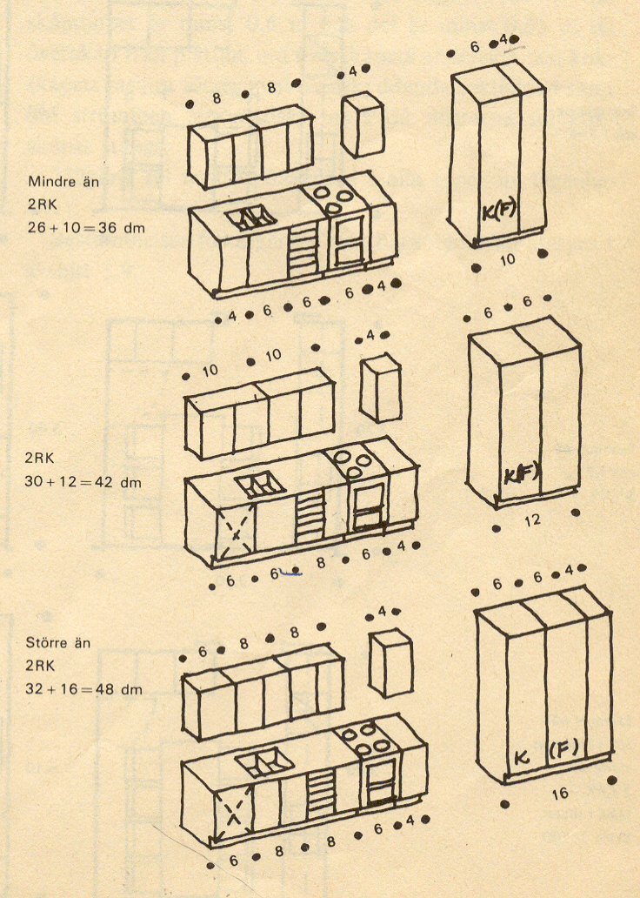
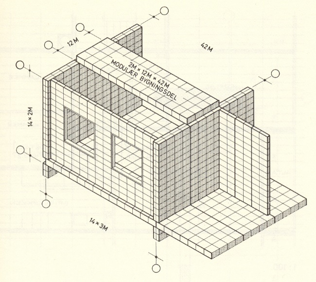

.. container::

   Háskóli Íslands – Umhverfis og byggingarverkfræðideild Húsagerð

   Björn Marteinsson

   | 

6 Byggingar - Lögun og fyrirkomulag
===================================

6.1 Inngangur
-------------

Hús er mikil fjárfesting og nauðsynlegt að hún nýtist vel (hver
m\ :sup:`2`\  kostar í dag, 2019, 500 - 800 þúsund krónur), byggingar
hafa hinsvegar reynst góð fjárfesting í gegnum tíðina. Til að tryggja að
svo verði einnig í framtíðinni varðandi þær byggingar sem við reisum í
dag, þá er ástæða til að huga vel að hvaða kröfur byggingar þurfa að
uppfylla og hvaða breytinga má eiga von á í náinni framtíð.

| 

Mátstærðir, sveigjanleiki og aðlögunarhæfni

Það hefur lengi verið áhugamál listamanna að skilgreina hlutföll, ýmist
útfrá fegurðarsjónarmiðum (t.d. gullinsnið, sjá t.d. Vitruvius) eða
útfrá mannslíkamanum (Leonardo da Vinci, Dürer, Corbusier). Slíkar
vangaveltur hafa haft mikil áhrif á hönnun bygginga gegnum tíðina og
hafa enn. Í byggingarframkvæmdum hafa mátstærðir ýmiskonar enn fremur
þekkst lengi, sérstaklega þegar hentað hefur að fjöldaframleiða
byggingarvörur eða byggingarhluta. Oft er talið að mátkerfi sé
nauðsynleg forsenda þess að byggingarstarfsemi verði iðnvæddari og skili
aukinni framleiðni. Í mátkerfum seinni tíma er grunnstærðin oft valin
sem 1M=10 cm, og öll mál eru margfeldi af henni, sjá mynd 6.1

| 

|image1| |Shape1|

Mynd 6.1

Mátkerfi (heimild: Nissen, 1973).

| 

| 

Erlendis eru gluggastærðir iðulega staðlaðar í slíku mátkerfi, jafnvel í
tilvikum þegar húsið sjálft er ekki byggt samkvæmt mátkerfi. Mátkerfi
hafa verið reynd í byggingariðnaði hérlendis en ekki náð fótfestu.

| 

Alltaf er ástæða til að velta fyrir sér hversu nýtanleg rými og heilar
byggingar eru, og þarf þá að hafa þrennt í huga;

-  Nýtanleiki; hversu vel nýtist bygging til þeirra þarfa sem hún er
   ætluð.

-  Aðlögunarhæfni: hversu auðvelt er að aðlaga byggingu breytingum á
   notkunarforsendum, t.d. með lagfæringum eða viðbyggingu.

-  Sveigjanleiki; hversu vel fellur bygging að nýjum verkefnum, t.d.
   breyttu notkunarsviði.

6.2 Rýmisþörf og þarfagreining
------------------------------

Í handbókum (Statens planverk, 1977, Neufert, 1980) má finna
leiðbeiningar um hver lágmarksrýmisþörf er fyrir ýmsar þarfir. Svíar
sinntu rannsóknum á rýmisþörf af miklum áhuga á árum áður og eru
ábendingar Statens planverk, t.d. varðandi eldhús, mjög gagnlegar, mynd
6.2. Með því að vitna til slíkra skilgreininga þá er ekki ástæða til að
lýsa almennum þörfum sérstaklega í hverju tilviki fyrir sig, heldur
nægir að skilgreina sérþarfir. Sjálfsagt er að vinna þarfagreiningu
fyrir hvert hönnunarverk til að tryggja að hönnuðir og verkkaupi hafi
sameiginlegan skilning á því hvað skuli hannað.

| 

Mynd 6.2 Rýmisþörf eldhúsinnréttingar - bekkir og skápar

(heimild: Statens planverk, 1977)

| 

Þarfagreining

#. Lýsing

Hvað á að byggja; almenn lýsing og staðsetning.

| 

2. Kröfur byggjandans

Hér skal sérstaklega lýsa öllu sem er frábrugðið því sem er venja;

Skulu fyllstu kröfur (reglugerða) uppfylltar, í hvaða gæðaflokki er
byggingin?

Sérþarfir, umfram almennar kröfur, á hverju sviði;

-  hljóðvist

-  tillit til hreyfihamlaðra

-  efnaáreiti

-  plásskröfur, t.d. aukin geymsluþörf fyrir útifatnað í
   fjallaskála,...billiardherbergi,... óvenju stór borðstofa...

| 

.. og svo auðvitað almennar viðmiðanir fyrir bygginguna;

-  varanleiki..

-  kostnaður..(stofnkostnaður, rekstur og viðhald..)

-  útlit..

| 

3. Greining á þörfum

-  Fjöldi notenda

-  Fjöldi vistarvera, stærð og kröfur

-  Aðstaða

-  Geymslur

-  Eldhús

-  Hreinlætisaðstaða

| 

-  Tenging innbyrðis milli eininga, tenging úti- inni

-  Þörf fyrir vinnuaðstöðu...

-  Stefna húss og útsýni..

| 

Nokkrar kröfur byggingarreglugerðar (112/2012 með áorðnum breytingum)

Almennar kröfur (Byggingarreglugerð) - athuga skal sérstaklega
Byggingarreglugerð, kafla 4.2 „Hönnunargögn“ og kafla 6.7 „Íbúðir og
íbúðarhús“ vegna verkefnis „Hönnun einfalds húss“

| 

4.2.3 Uppdrætti skal gera í mælikvörðum 1:500, 1:200, 1:100, 1:50, 1:20,
1:10, 1:5 og/eða 1:1.

| 

Kafli 4.3 Aðaluppdrættir og byggingarlýsing

4.3.1 ..

Aðaluppdrættir eru heildaruppdrættir að mannvirki ásamt afstöðumynd
þess. Aðaluppdráttur skal vera í mælikvarða 1:100 en afstöðumynd í
mælikvarða 1:500. Nota skal mátkerfi ÍST 20 eftir því sem við á.

Aðaluppdráttur að húsi skal sýna grunnflöt allra hæða þess og
milliflata, mismunandi sneiðar húss og lóðar og allar hliðar.

...

Afstöðumynd í mælikvarða 1:500 skal sýna áttir og afstöðu til
aðliggjandi mannvirkja, gatna, nágrannalóða og útivistarsvæða í 30 m
fjarlægð frá mannvirki. Á afstöðumynd skal skrá númer lóða og götuheiti.
Þá skal og sýna byggingarreit innan lóðar samkvæmt deiliskipulagi,
bílastæði á lóð og aðkomu að mannvirkinu. Sérstaklega skal gera grein
fyrir bílastæðum hreyfihamlaðra, þegar við á.

..

Byggingarlýsing skal vera á aðaluppdráttum eða í fylgiskjali og skal þá
vera tilvísun til þess á aðaluppdrætti.

| 

4.3.2 Málsetning

Málsetja skal mannvirki á aðaluppdrætti þannig að unnt sé að flatarmáls-
og rúmmálsreikna það í heild og einstök herbergi. Rýmisnúmer skal skrá á
uppdráttinn samkvæmt skráningarreglum og skal skráningartafla útfyllt að
öllu leyti.

Tilgreina skal á aðaluppdrætti hæð á neðsta gólfi mannvirkis, hæðarkóta
á hverri hæð og hæðarkóta efsta punkts þakvirkis miðað við hæðarkerfi
viðkomandi sveitarfélags, en götuhæð þar sem hæðarkerfi er ekki fyrir
hendi. Þá skal einnig rita heildarrúmmál og flatarmál hússins á
aðaluppdrátt.

| 

Kafli 6. AÐKOMA, UMFERÐARLEIÐIR OG INNRI RÝMI MANNVIRKJA

| 

6.1.1 Markmið.

Mannvirki skulu þannig hönnuð og byggð að þau henti vel til fyrirhugaðra
nota. Við ákvörðun á útliti þeirra, efnisvali, litavali og gerð skulu
gæði byggingarlistar höfð að leiðarljósi.

Tryggt skal fullt öryggi fólks og dýra innan bygginga og á lóðum þeirra.
Byggingarnar og lóðir þeirra skulu vera vandaðar og hagkvæmar m.t.t.
öryggis fólks, heilbrigðis, endingar, aðgengis og afnota allra.

Við gerð og hönnun bygginga ber að taka tillit til orkunotkunar, áhrifa
þeirra á umhverfið og gæta að hagkvæmni við rekstur, þrif og viðhald.

Ávallt skal leitast við að beita algildri hönnun þannig að byggingar og
lóðir þeirra séu aðgengilegar öllum án sérstakrar aðstoðar.

Við gerð og hönnun bygginga skulu valin efni og aðferðir er henta við
íslenskar aðstæður, leitast við að lágmarka neikvæð umhverfisáhrif,
velja vistvænar lausnir þar sem það er mögulegt og miða hönnunina við
allan líftíma þeirra. Leitast skal við að lágmarka auðlindanotkun og
hámarka notagildi, hagkvæmni og þægindi notenda.

Við byggingar eða innan þeirra skal vera fullnægjandi aðstaða fyrir
reiðhjól, barnavagna, hjólastóla, sleða o.þ.h. og geymslu þeirra í
samræmi við eðli byggingarinnar.

Þess skal gætt að byggingar hafi eðlilega tengingu við lóð og annað
umhverfi. Við hönnun og byggingu þeirra skal huga að eðlilegum
innbrotavörnum.

| 

.....

| 

6.7.1. Almennar kröfur til íbúða.

Hver einstök íbúð skal sérstaklega afmörkuð með gólfi, lofti og veggjum
ásamt hurðum og gluggum, sem hver um sig uppfyllir ákvæði reglugerðar
þessarar um hljóðvist, loftræsingu, eldvarnir og varmaeinangrun.

Íbúð skal hafa að lágmarki eitt íbúðarherbergi, eldunaraðstöðu og
baðherbergi. Öll slík rými innan íbúðar skulu tengd innbyrðis og ekki
skal þurfa að fara um sameign á milli rýmanna. ....

Öll rými íbúða, sbr. 2. mgr., skulu vera nægjanlega stór þannig að þar
rúmist innréttingar af þeim gerðum sem henta stærð íbúða. ...

Í baðherbergjum skulu vera salerni, baðaðstaða og handlaug.
Hreinlætistækjum má koma fyrir í fleiri en einu herbergi og skal þá
handlaug vera í þeim herbergjum þar sem eru salerni. Aðkoma að snyrtingu
eða baðherbergi íbúðar skal ekki vera frá svefnherbergi, nema annað
baðherbergi eða snyrting sé í íbúðinni.

Aðkoma að öðrum rýmum íbúðar skal ekki vera um baðherbergi eða
snyrtingu, nema aðkoma að þvottaherbergi/-aðstöðu. ...

Í hverju íbúðarherbergi skal vera opnanlegur gluggi. ...

Óheimilt er að hafa sjálfstæða íbúð í þakrými þar sem eingöngu eru
þakgluggar. ...

| 

6.7.2 Lofthæð og birtuskilyrði.

Þess skal gætt að íbúðarhús hafi eðlileg tengsl við útivistarsvæði á lóð
og staðsetning vistarvera taki mið af dagsbirtu og útsýni.

Lofthæð í íbúðarherbergjum og eldhúsi skal vera a.m.k. 2,50 m að
innanmáli mælt frá fullfrágengnu gólfi að fullfrágengnu lofti. Heimilt
er að víkja frá þessu ef meðalhæð herbergis er minnst 2,20 m og lofthæð
minnst 2,50 m í að minnsta kosti 2/3 hluta þess. Í þakherbergjum og
kvistherbergjum íbúða má meðalhæð minnst vera 2,20 m, enda sé lofthæðin
minnst 2,50 m í að minnsta kosti þriðjungi herbergis.

Samanlagt ljósop glugga hvers íbúðarherbergis skal ekki vera minna en
sem svarar til 1/10 af gólffleti þess, þó aldrei minna en 1 m². Íbúðir
skulu njóta fullnægjandi birtuskilyrða og loftskipta.

| 

6.7.3 Íbúðir hannaðar á grundvelli algildrar hönnunar.

Íbúðir sem eru hannaðar á grundvelli algildrar hönnunar skulu uppfylla
eftirfarandi kröfur:

... röð af sérákvæðum..

| 

| 

Til athugunar almennt;

-  Reyna að lágmarka "dauð" rými, þar með talið "umferðar" fleti (gangar
   o.fl.). Almennt heppilegt að koma sem mest miðsvæðis inn í einingu
   (t.d. ekki inn í enda á aflangri íbúð, heldur inn á miðri langhlið).

-  Hugsa um notagildi herbergja. Skipulagning eldhúss er flókin og
   nauðsynlegt að skoða sérstaklega hvort pláss sem því er ætlað sé
   nægjanlegt (í eldhúsi er flókið samspil einstakra svæða/rýma og
   skipulagning krefst því mikillar reynslu). Til athugunar í þessu
   samhengi er að í reglugerð eru engin ákvæði um innréttingu eldhúsa
   (borðpláss, skápamagn, innbyrðis tengsl), þó svo ástæða þyki til í
   gr. 100.1 að tilgreina sérstaklega skáp fyrir ræstitæki.

-  Staðsetning hurða og glugga þarf að vera þannig að vistarverur nýtist
   sem best

-  Tenging rýma innbyrðis

-  iðulega reynt að hafa hreinlætisaðstöðu í tengslum við svefnrými, og
   einnig aðal notrými dagsins..

-  reynt að hafa stutta leið frá aðalhurð og að eldhúsi (algengasta
   aðfangaleiðin..)

-  iðulega óskir um tengsl úti-inni fyrir stofu/borðstofu (garður,
   sólstofa, svalir,..)

-  bein tenging milli hreinlætisaðstöðu og eldhúss er afar óheppileg

-  óæskilegt að nota eldhús eða stofu sem einustu aðgönguleið að öðrum
   vistarverum

| 

| 

6.3 Stærðarákvörðun og byggingarstig.
-------------------------------------

Staðallinn ÍST 50:2001 Flatarmál og rúmmál bygginga fyrirskrifar hvernig
reikna skuli flatarmál og rúmmál, og inniheldur skilgreiningar þar að
lútandi. Í staðlinum eru notaðar þrjár grundvallarskilgreiningar sem
tengjast lokun;

Lokunarflokkur A: Bygging eða hluti hennar sem er lokaður á alla vegu.

Lokunarflokkur B: Bygging eða hluti hennar sem er lokuð að ofan en opin
á hliðum að hluta eða öllu leyti

Lokunarflokkur C: Bygging eða hluti hennar sem er lokuð að ofan en
afmörkuð á hliðum (þarf ekki að vera lokuð) en opin að ofan.

| 

Dæmi um lokunarflokka;

A: Íbúðarherbergi almennt.

B: Rými undir skermþaki, eða undir útkragandi hlutum byggingar.

C: Svalir

| 

Staðallinn fyrirskrifar eftirfarandi;

-  Lengdarmál, sem notuð eru við útreikning flatarmála, skulu gefin upp
   í m með þremur aukastöfum

-  Flatarmál skal reiknað í m\ :sup:`2`\  og gefið upp með tveim
   aukastöfum.

| 

Staðallinn skilgreinir eftirtalin hugtök

Flatarmál, ofanvarp á lárétt - flatarmál er mælt við gólfflöt hverju
sinni;

Þekjuflötur – Flatarmál sem afmarkast af lóðréttu ofanvarpi byggingar.

Botnflatarmál - botnflatarmál hæðar er reiknað frá ytri brún þess sem
afmarkar hæðina (klæðning meðtalin) eða miðjum vegg milli rýma.
Botnflatarmál skiptist í lokunarflokka A, B og C.

Brúttóflatarmál - Brúttóflatarmál er reiknað eins og botnflatarmál, en
að frádregnum opum (t.d. stigaopum) sem eru 1 m\ :sup:`2`\  eða stærri.
Brúttóflatarmál skiptist í lokunarflokka A, B og C.

Innrými - Flatarmál innrýma afmarkast af innri brún útveggja, og er
einungis reiknað fyrir lokunarflokk A.

Virki - Gegnheilir eða aflokaðir byggingarhlutar svo sem veggir, súlur,
reykháfar og lokaðir lagnastokkar. Reikna skal op í virki (s.s. dyraop)
sem eru 1,5 m að breidd eða minna, með í (grunn) flatarmáli þess. Stærri
op reiknast með viðkomandi svæði.

Nettóflatarmál - Flatarmál svæðis sem afmarkast af útveggjum og
innveggjum. Op (1 m2 eða stærri) reiknast ekki með í nettóflatarmáli.

| 

Hjúpur bygginga – fletir sem afmarka þann hlut byggingar sem er í
lokunarflokki A.

Flatarmál hjúps er;

a. flatarmál botnplötu (í útfleti)

b. flatarmál útveggja (í útfleti)

c. flatarmál þaks (í útfleti). Þakflötur er reiknaður út í skurðlínu
   útveggjar og þaks.

Flatarmál glugga og dyraopa (ef reiknuð sérstaklega) skal miða við opmál
(steinmál), þ.e. opstærð sem gluggi eða hurð fer í.

| 

| 

Rúmmál

Útreikningur rúmmáls er byggður á flatarmáli svæða eins og þau eru
skilgreins að ofan, og hæð viðkomandi byggingar eða hluta hennar. Rúmmál
er ekki reiknað fyrir lokunarflokk C.

Brúttórúmmál - reiknað að útflötum, og skipt eftir lokunarflokkum A og
B.

| 

Hæðir skulu mældar þannig (salarhæð er almennt mælt af plötu og á);

Neðsta hæð – salarhæð að viðbættri botnplötu (þar með talin einangrun)

Aðrar hæðir – salarhæð

Rými með efri

flöt í útfleti – salarhæð (mælt að ytri brún þaks eða svalaplötu)

| 

| 

Staðallinn ÍST 51:2001 Byggingarstig húsa fjallar um ýmsar
skilgreiningar hugtaka, bæði er varða efni og yfirborð en einnig
mismunandi byggingarstig húsa.

| 

Slitfletir gólfa: Efsta yfirborð gólfa og stiga svo sem teppi, dúkar,
parket, steinflísar, málning o.fl.

Tæknibúnaður: Öll lagnakerfi og allur orkuknúinn búnaður

Undirstöður: Neðsti hluti burðarvirkis húss, að jafnaði burðarvirki
milli botnplötu og berandi jarðar, þó að botnplötu meðtalinni ef hún er
berandi hluti af undirstöðum.

Veðurþol: Þol ystu flata; veggja, þaks og annarra flata byggingar, gegn
áhrifum veðurs.

| 

Byggingarstig húsa er skilgreining á stöðu framkvæmdar, lýsing húss, og
er m.a. notað í verk- og sölusamningum. Byggingarstigin eru alls 7 og
skiptast þannig:

Byggingarstig 1 – Byggingarleyfi

Byggingarstig 2 – Undirstöður

Byggingarstig 3 – Burðarvirki fullreist

Byggingarstig 4 – Fokheld bygging

-  Frágangsstigi steyptra-, hlaðinna- og timburveggja lýst

-  Brunahólfun skal vera lokið

-  Búið að loka glugga- og hurðaropum fyrir veðri

-  Þakvirki lokað að utan með endanlegri klæðningu, þó án rennu og
   niðurfalla.

-  Fráveitu-, regn- og þerrilagnir tengdar í götu

-  ...

Byggingarstig 5 – Tilbúin til innréttingar

-  Frágangsstigi skilveggja, lofta og gólfa lýst

-  Gluggar glerjaðir

-  Lagnir og rafbúnaður frágengið

-  Einangrun og rakavörn frágengið og klætt af

-  Þök og þakbrúnir frágengið

-  Lyftur komnar

-  ...

Byggingarstig 6 – Fullgerð án lóðafrágangs

Byggingarstig 7 – Fullgerð bygging

| 

Það er ágætur tékklisti aftast í staðlinum, þar sem er upptalning og
flokkun mismunandi þátta (atriða).

| 

Í Reglugerð um eignaskiptayfirlýsingar, útreikning hlutfallstalna o.fl.
er lýst hvaða kröfur skal gera til eignaskiptayfirlýsingar, og þar með
einnig hvernig ákvarða skuli hlutfallstölur hverrar eignar af heild.
Reglugerðin vísar til ÍST 50 varðandi stærðarákvarðanir, og skilgreinir
sk. skráningartöflu sem skal fylgja með hönnunargögnum.

| 

Heimildir og ítarefni

Byggingareglugerð nr. 112/2012, með áorðnum breytingum,
Umhverfisráðuneytið, Reykjavík

B. Neufert (1980) Bauentwurfslehre, Friedr. Vieweg & Sohn
Braunschweig/Wiesbaden, Germany

H. Nissen (1973) Modul og montagebyggeri, Polyteknisk Forlag, København

Staðlaráð Íslands (1998) ÍST 50:2001 Flatarmál og rúmmál bygginga

Staðlaráð Íslands (2001) ÍST 51:2001 Byggingarstig húsa

Statens planverk (1977) Bostadsbestämmelser- information om
nybyggnadsbestämmelser för bostaden och grannskapet, Statens planverk,
Stockholm

Stjtíð. B, nr. 538/1995 Reglugerð um eignarskiptayfirlýsingar,
útreikning hlutfallstalna o.fl. í fjöleignahúsum, Félagsmálaráðuneytið

Vitruvius (...)

.. container::

   6.8

