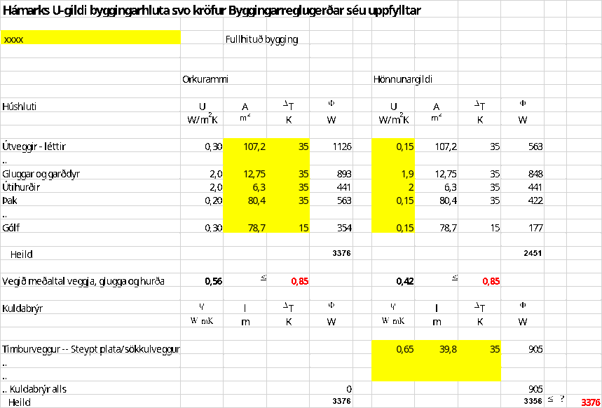
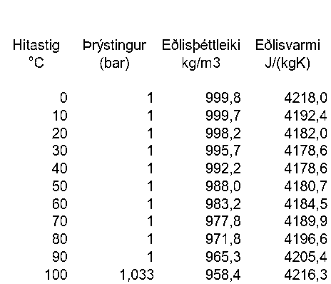
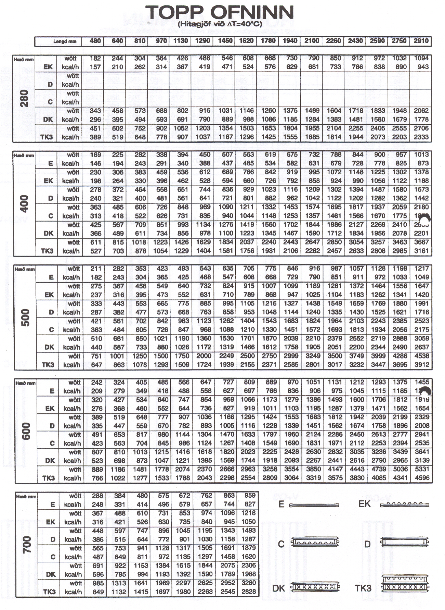
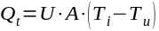
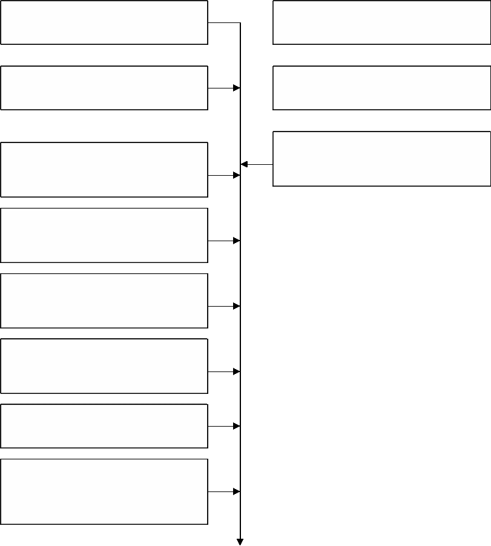
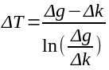
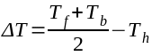
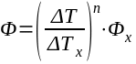
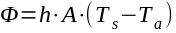

.. container::

   Háskóli Íslands Umhverfis- og byggingarverkfræðideild Húsagerð

   Björn Marteinsson

   | 

8 Orkutap bygginga og hitunarþörf
=================================

8.1 Almennt
-----------

Þegar kólnunartala byggingarhluta, U-gildi, er þekkt þá má auðveldlega
reikna varmaleiðnitap byggingarhluta, sbr. einnig skilgreiningu á
U-gildi fremst í kafla 2.;

| 

|image1| (8.1)

þar sem Q\ :sub:`t`\  varmaleiðnitap, W

U kólnunartala, W/(m\ :sup:`2`\ ·K)

A flatarmál byggingarhluta, m\ :sup:`2`

T\ :sub:`i`\  innihitastig, °C

T\ :sub:`u`\  útihitastig, °C

| 

Á samsvarandi hátt má finna varmaskiptatap vegna loftskipta þegar
loftskiptamagn er þekkt.

| 

Í kaflanum verður samkvæmt hefð notuð einingin vattstund (Wh) í
útreikningum á orkujafnvægi húss.

Lengi hefur verið gert ráð fyrir því að ákvörðun hitunarþarfar sé
ákvörðuð útfrá orkujafnvægi viðkomandi húss, og hafa verið til staðlar
varðandi slíkt í einstökum löndum. Nú liggja fyrir alþjóðlegir staðlar
eða drög að stöðlum (ISO og EN) fyrir slíka útreikninga og mun ætlunin
að útreikningar hérlendis verði í samræmi við þá. Um talsvert marga
staðla er að ræða, sjá mynd 8.1, og erfitt fyrir hönnuði að hafa gott
yfirlit yfir þá alla. Til einföldunar hefur því verið valið að fara
svipaða leið og Danir eins og lauslega var rætt í kafla 2. Danski
staðallinn DS 418 er samantekt yfir helstu reglur í EN stöðlunum,
hérlendis er í gildi Íslenskur staðall ÍST 66 “Varmatap húsa –
Útreikningar” sem vísar til danska staðalsins en inniheldur einnig
nokkur Íslensk sérákvæði. Vegna þessarar stöðu er nauðsynlegt að fjalla
nokkuð um helstu EN staðlana sem fjalla um einangrun og
varmatapsútreikninga, og taka jafnframt mið af ÍST 66 (ásamt DS 418).

| 

| 

ÍST EN ISO 10077-1:2000
'''''''''''''''''''''''

Staðallinn fjallar um einfaldaða leið til útreikninga á varmamótstöðu
glugga og hurða. Gluggaflötur er skilgreindur sem summa glerflatarmáls
(A\ :sub:`g`\ ) , miðað við ljósmál, og karmflatarmáls (A\ :sub:`f`\ ).
Kólnunartala glugga skal reiknuð samkvæmt jöfnunni;

| 

U\ :sub:`w`\ = (A\ :sub:`g`\  U\ :sub:`g`\  + A\ :sub:`f`\ 
U\ :sub:`f`\  + l\ :sub:`g`\  \ :sub:`g`\ )/(A\ :sub:`g`\  +
A\ :sub:`f`\ ) (8.2)

| 

U\ :sub:`g`\  kólnunartala glers

U\ :sub:`f`\  kólnunartala karms

\ :sub:`g`\  kuldabrú vegna áhrifa jaðarsvæðis glers og karms

l\ :sub:`g`\  ummál ljósops glers

A\ :sub:`g`\  + A\ :sub:`f` flatarmál múrops

| 

| 

| 

| 

| 

|Shape1|

prEN 1190 (staðaluppkast)

Gólf ; Útreikningur varmaflæðis til jarðar

prEN 410 (staðaluppkast)

Gler; ljós og orkueiginleikar

ÍST EN ISO 10077-1:2000

Gluggar og hurðir; Reikningar varmaflutnings – einfölduð aðferð

ÍST EN ISO 13786:1999

Byggingarhlutar; Kvikir útreikningar á varmaflutningi

EN ISO 7345

Einangrun; ýmsar skilgreiningar

ÍST EN 12524:2000

Einangrun; ýmis hönnunargildi

ÍST EN 10456:1999

Einangrun; Ákvörðun hönnunargilda

ÍST EN ISO 10211-1:1995

Byggingarhlutar; Reiknaðar kuldabrýr

ÍST EN ISO 13789:1999

Byggingar ; reiknað leiðnitap

ÍST EN ISO 6946:1996

Byggingarhlutar; Reiknuð varmamótstaða og varmaflutningur

ÍST EN 832:1998

Byggingar; Reiknuð orkuþörf

| 

| 

| |Shape2|

| 

| 

| 

| |Shape3|

| 

| 

| 

| 

| 

| 

| 

| 

| 

| 

| 

| 

| 

| 

| 

| 

| 

| 

| 

| 

| 

| 

| 

| 

| 

| 

| 

.. _section-1:

(ÍST EN ISO 14683:1999 Thermal bridges in building constructions – Linear thermal transmittance- Simplified methods and default values, og fl. kuldabrúarstaðlar ekki meðtaldir)
                                                                                                                                                                                

.. _section-2:

Mynd 8.1 Yfirlit yfir lítinn hluta staðla vegna útreikninga á varmaflutningi í byggingum
                                                                                        

| 

| 

Samkvæmt staðlinum má reikna kólnunartölu fyrir (margfalt)
verksmiðjugler þannig

U\ :sub:`g`\ = 1/ ( R\ :sub:`se`\ +
\ :sub:`j`\ (d\ :sub:`j`\ /\ :sub:`j`\ ) + \ :sub:`j`\ 
R\ :sub:`s,j`\ + R\ :sub:`si`\ ) (8.3)

| 

Rse og Rsi varmayfirgangsmótstöður úti og inni

d\ :sub:`j`\  , \ :sub:`j` þykkt og leiðnitala efnislaga (glers) j

R\ :sub:`s,j`\ varmamótstaða loftbils j (gefin upp í töflu)

Gert er ráð fyrir að U\ :sub:`f`\  gildi karms sé ákvarðað með tölulegum
aðferðum í samræmi við prEN ISO 10077-2 og þannig að ekki sé meðreiknuð
kuldabrú \ :sub:`g`\  við glerjaðar/ ísetningu. Í staðlinum eru
viðmiðunargildi fyrir jaðarkuldabrú \ :sub:`g`\  ;

| 

timburkarmur, 2-falt gler; \ :sub:`g`\ =0,0 4 W(mK)

| 

Viðmiðunargildi fyrir kólnunartölu karms, U\ :sub:`f`\ , eru ekki gefin
upp enda sennilega gert ráð fyrir að framleiðandi sjái um slíkt.

Aðferðin sem staðallinn lýsir byggir á talsverðum úreikningum, og þá á
eftir að taka tillit til hugsanlegrar kuldabrúar vegna tengingar karms
við vegg. Hérlendis er hefðbundið að steypa karm í vegg og tengingin
steypa - timbur- gler í karmhluta sem er almennt aðeins 62mm að þykkt (í
plani veggjarins) gerir að verkum að varmastreymið er langt í frá
línulegt eða ótruflað. Það er því eðlilegt að líta á þennan hluta í
heild sem 2- vítt ástand og gefa varmatapið upp á lengdarmetra fyrir
karm og nota hefðbundið gildi á kólnunartölu U\ :sub:`g`\  fyrir
ljósmálshluta glersins. Þá fæst meðal- kólnunartala glugga sem

| 

U\ :sub:`w`\ = (A\ :sub:`g`\  U\ :sub:`g`\  + l\ :sub:`g`\ 
\ :sub:`k`\ +l\ :sub:`p`\  \ :sub:`p`\ )/(A\ :sub:`g`\  +
A\ :sub:`f`\ ) (8.4)

| 

\ :sub:`k`\  kólnunartalakarmhluta í vegg og jaðarsvæðis glers W/(mK)

\ :sub:`p`\  kólnunartala gluggapósta og jaðarsvæðis glers W/(mK)

l\ :sub:`k`\  lengd karmstykkja glugga m

l\ :sub:`p`\  lengd pósta í glugga m

... önnur tákn sem fyrr

| 

.. _section-3:

ÍST EN ISO 14683:1999 
                      

Staðallinn fjallar um einfaldaða leið til að ákvarða kuldabrýr og gefur
upp viðmiðunargildi (kuldabrúartafla, “catalog”)....

| 

EN ISO 10211-1:1995

3. 

   #. 

      #. Kuldabrú (e: thermal bridge): Hluti hjúpflatar þar sem annars
         regluleg varmaflæðimótstaða breytist verulega vegna þess að;

a. hjúpflötur er að hluta eða öllu leyti skorinn af efni með annarri
   leiðnitölu

b. þykktarbreytinga

c. mismunur í innra og ytra flatarmáli, eins og gerist þar sem gólf, eða
   loft, og veggir koma saman

| 

BM: Almennt telst kuldabrú vera þar sem annars einvítt varmaflæði verður
tví- eða þrívítt.

| 

| 

ÍST EN 832:1998 
''''''''''''''''

Í staðlinum er fjallað almennt um áætlun orkutaps og hitunarþarfar og er
í eftirfarandi tekið mið af því. Staðallinn vísar til fjölda annarra
staðla eða staðla uppkasta er varða útreikninga á kólnunartölum ofl. og
skilgreinir eftirfarandi uppbyggingu greiningarinnar;

| 

Skilgreina kerfismörk fyrir hitað rými - hugsanlega skipt í svæði
\ :sup:`1)`

Ákveða hönnunarhitastig innandyra

Ákvarða ytri skilyrði og reiknitímabil

Fyrir hvert reiknitímabil skal reikna ;

varmatap Q\ :sub:`l`

varmagjöf frá innri orkugjöfum Q\ :sub:`i`

varmagjöf frá sól Q\ :sub:`s`

nýtnistuðul varmagjafar 

hitunarþörf

Q\ :sub:`h`\  = Q\ :sub:`l`\  - Q\ :sub:`g`\ (8.5)

þar sem Q\ :sub:`g`\  = Q\ :sub:`i`\  + Q\ :sub:`s`

| 

og finna loks hitunarþörf ársins sem summu Q\ :sub:`h`\  einstakra
tímabila.

| 

1) Ef hönnunarhiti mismunandi húshluta er meiri en 4K eða ef hlutfall
milli orkutaps og orkugjafar er mjög mismunandi milli húshluta. Síðara
ákvæðið gerir að verkum að almennt þarf að skipta húsum í svæði sem fá
mikla beina sólargeislun og svo önnur svæði, þetta verður rætt síðar.

| 

Staðallinn gerir ráð fyrir að útreikningar miðist almennt við fastan
innihita (bls. 9).

| 

Orkujafnvægið byggir þannig á ákvörðun tapliða annarsvegar og orku sem
húsinu berst hinsvegar;

| 

Orkutap

Leiðnitap ; Q\ :sub:`leiðni`

Tap sem verður vegna leiðnitaps um byggingarhluta vegna hitamunar úti og
inni

Loftskiptatap; Q\ :sub:`loftskipti`

Tap sem verður vegna loftskipta í húsi, skipti á hlýju innilofti og
kaldara útilofti. tapið verður vegna loftskipti vegna loftræsingar
annarsvegar og óþéttleika húss hinsvegar

Tap vegna kranavatns; Q\ :sub:`kran`

Heitt kranavatn krefst orku en hluti hennar nýtist til hitunar hússins

| 

Orka sem berst húsi

Varmi vegna geislunar frá sól og himni; Q\ :sub:`sól`

Milli húss og umhverfis verður varmaflutningur vegna geislunar, mest
áberandi vegna geislunar frá sól, en geislun frá himni eða til himins
hefur einnig áhrif.

Varmi frá íbúum; Q\ :sub:`íbúar`

Íbúar, og notendur húss almennt, gefa frá sér varma sem nýtist til
hitunar.

Varmi frá almennri raforkunotkun; Q\ :sub:`alm.raforka`

Vegna raforkunotkunar til lýsingar og tækja í húsi þá verður varmamyndun
sem nýtist til upphitunar

Varmi til hitunar (eða kælingar); Q\ :sub:`hitun`

Orka sem á vantar til að halda jöfnum innihita og til hitunar kranavatns
kemur frá hitakerfi hússins (og eða kælikerfi).

| 

Orka sem berst húsi og nýtist því til hitunar, án þess að greitt sé
fyrir hana í þeim tilgangi, er iðulega kölluð "gefins varmi".

| 

Q\ :sub:`leiðni`\  + Q\ :sub:`loftskipti`\  + Q\ :sub:`kran`\  +
Q\ :sub:`sól`\  + Q\ :sub:`íbúar`\  + Q\ :sub:`alm.raforka`\ +
Q\ :sub:`hitun`\  = 0 (8.6)

| 

Verður hér fjallað um einstaka liði, en hluti af orkuliðunum eru illa
eða ekki skilgreindir fyrir Íslenskar aðstæður. Iðulega miðast
útreikningar hér t.d. við að gefins varminn samvari 2-3 °C í innihita og
því reiknað með lægri hönnunarhita sem því nemur. Hér verður ekki nánar
fjallað um hverju gefins varminn nemur, og látið nægja að nota þessa
nálgun.

| 

Orkutap verður í eftirfarandi umfjöllun fengið með útreikningum sem
byggja á gráðutímakerfinu, þ.e. tímaeining í útreikningum er
klukkustund.

| 

| 

| 

8.2 Orkutap húss
----------------

8.2.1 Leiðni- og geislunartap
~~~~~~~~~~~~~~~~~~~~~~~~~~~~~

Fjöldi staðla fjallar um leiðnitap bygginga og byggingarhluta og verður
hér gerð stutt grein fyrir helstu ákvæðum.

| 

ÍST EN ISO 13789:1999
'''''''''''''''''''''

Staðallinn fjallar mjög almennt um útreikning leiðnitaps, skilgreiningu
umfangs flata af mismunandi gerðum s.s. almennir fletir, gluggar og
kuldabrýr.

| 

Í staðlinum er eftirfarandi almenn skilgreining á útreikningi
leiðnitaps;

| 

H\ :sub:`T`\  = L\ :sub:`D`\ + L\ :sub:`s`\  +H\ :sub:`u`\  (8.7)

| 

H\ :sub:`T`\  heildarleiðnitap, W/K

L\ :sub:`D`\  beint leiðnitap (ótruflað), W/K

L\ :sub:`S`\  Leiðnitap um jörðu, W/K

H\ :sub:`U`\  Leiðnitap um óhituð rými, W/K

| 

L\ :sub:`D`\  = \ :sub:`i`\ A\ :sub:`i`\  U\ :sub:`i`\ + \ :sub:`k`\ 
l\ :sub:`k`\  \ :sub:`k`\  + \ :sub:`j`\ \ :sub:`j` (8.8)

| 

þar sem A\ :sub:`i` flatarmál einingar i, m\ :sup:`2`

U\ :sub:`i`\  varmatap einingar i á flatareiningu, W/(m\ :sup:`2`\  K)

l\ :sub:`k`\  lengd kuldabrúar k, m

\ :sub:`k`\  línukuldabrú k, W/(m K)

\ :sub:`j` púnkt-kuldabrú j, W/K

| 

| 

| 

Varmatap um byggingarhluta samkvæmt ÍST EN 832:1998
'''''''''''''''''''''''''''''''''''''''''''''''''''

Staðallinn gerir ráð fyrir að varmatap um byggingarhluta sé almennt
byggt á ákvörðun kólnunartölu þeirra og stærð, eins og nánar er fjallað
um í prEN ISO 10077-1 (gluggar og hurðir) og EN ISO 13789
(byggingarhlutar almennt);

| 

Q\ :sub:`l`\  =  U\ :sub:`i`\ A\ :sub:`i`\  (8.9)

| 

þar sem U\ :sub:`i`\  er kólnunartala byggingarhluta,
W/(m\ :sup:`2`\ K)

A\ :sub:`i`\  flatarmál byggingarhluta, m\ :sup:`2`

| 

Þegar varmaflutningur truflast, t.d. vegna áhrifa kuldabrúa, gilda
sérreglur eins og fjallað er um í staðli ÍST EN ISO 10211-1:1995
(varmatap um kuldabrýr).

Varmaflutningsstuðull kuldabrúa er gefinn upp sem varmatap á
lengdarmetra og orkutap um kuldabrýr fæst sem;

| 

Q\ :sub:`lk`\  = \ :sub:`i`\ L\ :sub:`i`\  (8.10)

| 

þar sem \ :sub:`i`\  varmaflutningsstuðull kuldabrúar, W/(mK)

L\ :sub:`i`\  lengd kuldabrúar, m

| 

Varmaflutningsstuðul (kólnunartölu) kuldabrúa þarf að reikna með
aðferðum sem skipta reiknisviðinu upp í fjölda eininga, og krefjast
þannig almennt tölvuforrita. Í töflu 2.8 eru upplýsingar um
kuldabrúargildi nokkurra algengra kuldabrúa í steyptum húsum.

Af töflu 2.8 má sjá að kuldabrýr vegna milligólfa og steyptra
milliveggja vega hátt. Í töflunni eru einnig kuldabrýr vegna timburkarma
í steyptum vegg, en þau eru reiknuð inn í U-gildi glugga.

| 

8.2.2 Loftskiptatap byggingar
~~~~~~~~~~~~~~~~~~~~~~~~~~~~~

Loftskiptatap verður þegar skipt er á köldu útilofti og hlýju innilofti,
loftskipti verða af tvennum ástæðum;

1. Loftræsing vegna stýrðra loftskipta um glugga eða með loftræsikerfi

2. Loftleki vegna áhrifa mismunaþrýstings á óþétta byggingu

| 

Mæliniðurstöður á þéttleika húsa hérlendis, Björn Marteinsson og Jón
Sigurjónsson (1997) sýna að steypt hús eru almennt mjög þétt, nema
hugsanlega efsta hæðin vegna áhrifa frágangs timburþaks.

| 

.. _íst-en-8321998-1:

ÍST EN 832:1998
'''''''''''''''

Í staðlinum eru leiðbeiningar varðandi hvernig meta skuli loftskipti
útfrá aðstæðum, m.a. tegund húss og umhverfi (Appendix F, töflur F2 og
F3), og varmaflutningur vegna loftskipta fundinn samkvæmt jöfnu 8.11.

| 

|image2| (8.11)

| 

þar sem H\ :sub:`V`\  varmaflutningsstuðull loftskipta, W/K

V\ :sub:`a`\  loftræst magn, m\ :sup:`3`\ /h

V\ :sub:`R`\  rúmmál hitaðs rýmis, m\ :sup:`3`

\ :sub:`a`\  eðlisþéttleiki lofts, kg/m\ :sup:`3`

c\ :sub:`a`\  eðlisvarmi lofts, J/(kg·K)

n fjöldi loftskipta, h\ :sup:`-1`\ 

| 

Ráðlagt er í staðlinum að miða við n= 0,5 nema annað sé betur þekkt
(§5.2.2).

| 

Ekki er augljóst hvort þetta er eðlileg viðmiðun fyrir aðstæður
hérlendis þar sem verð á hitunarorku á Reykjavíkursvæðinu er lágt og
ríkt í mörgum að hafa mikið opna glugga. Hár meðalvindhraði miðað við
það sem gerist víða erlendis gefur því tilefni til að reikna með hærri
loftskiptum heldur en staðall gerir ráð fyrir, þrátt fyrir að t.d.
steypt fjölbýli séu í eðli sínu mjög þétt. Loftskipti stærri húsa á
mánaðar- eða ársgrundvelli mun sennilega ráðast meira af vísvitandi
opnum gluggum heldur en þéttleika hússins. Þetta þarf hinsvegar alls
ekki að gilda um minni hús, einkum timburhús eða steypt hús með
timburþaki, þar sem loftlekar geta ráðið meiru heldur en í steyptu
fjölbýli. Vangaveltur um mikla loftun á Reykjavíkursvæðinu eru m.a.
studdar þeirri reynslu að inniloft er oft mjög þurrt í íslenskum
íbúðarhúsum, þó svo rakt loft þekkist vissulega einnig sem vandamál.
Loftun húsa á svæðinu er einnig örugglega mun meiri að sumarlagi heldur
en vetrarlagi og því ástæða til að miða við mismunandi fjölda loftskipta
eftir árstíma.

| 

8.3 Orkutap húss; kröfur í Byggingarreglugerð og útreikningar
-------------------------------------------------------------

8.3.1 Kröfur í Byggingarreglugerð
~~~~~~~~~~~~~~~~~~~~~~~~~~~~~~~~~

Í Byggingarreglugerð er annarsvegar gerð krafa um hæstu leyfileg U-gildi
byggingarhluta og hinsvegar hæsta leyfilegt leiðnitap byggingar
(orkurammi).

| 

Í Byggingarreglugerð ( og í staðlinum ÍST 66) er ekki tekið tillit til
loftskiptataps við ákvörðun orkurammans, ástæða þessa er sú að þar sem
loftræsikerfi eru fátíð í litlum byggingum þá mun staðsetning byggingar
og loftræsivenjur notenda að mestu leyti ráða loftskiptatapinu (af
eiginleikum byggingarinnar er það þá aðeins loftþéttleiki byggingarhluta
sem hefur áhrif á loftskiptatap).

| 

| 

Byggingarreglugerð:

| 

13.2.3 Útreikningur heildarleiðnitaps.

Heildarleiðnitap skal reiknað fyrir allar nýbyggingar. Hönnunargögnum
sem afhent eru leyfisveitanda skal ávallt fylgja útreikningur á
heildarleiðnitapi. Heildarleiðnitap mannvirkis, að teknu tilliti til
kuldabrúa og U-gilda allra viðeigandi byggingarhluta þess, skal ekki
verða hærra en fæst þegar einvörðungu er tekið mið af nettóflatarmáli
byggingarhluta og hámarks U-gildum skv. ákvæðum þessarar reglugerðar,
sbr. töflu 13.01...

| 

13.3. Mesta leiðnitap byggingarhluta.

13.3.1 .Almennt um leiðnitap og U-gildi byggingarhluta.

Almennt gildir að við útreikning heildarleiðnitaps nýbygginga skal
U-gildi byggingarhluta ekki vera hærra en fram kemur í töflu 13.01.
Heimilt er þó að U-gildi einstakra byggingarhluta í nýbyggingum sé allt
að 20% hærra en fram kemur í töflu 13.01, en þá því aðeins að
einangrunarþykktir annarra byggingarhluta séu auknar tilsvarandi þannig
að heildarleiðnitap mannvirkis haldist óbreytt þrátt fyrir slíka
skerðingu einangrunar einstakra byggingarhluta.

| 

13.3.2 Hámark U-gildis – ný mannvirki og viðbyggingar.

Í nýjum mannvirkjum og viðbyggingum skal leyfilegt hámark U-gilda
einstakra byggingarhluta vera skv. töflu 13.01.

| 

| 

+-----------------------+-----------------------+--------------------+
| Tafla 13.01           |                       |                    |
| (Byggingarreglugerð)  |                       |                    |
| Ný mannvirki og       |                       |                    |
| viðbyggingar          |                       |                    |
| Leyfilegt hámark      |                       |                    |
| U-gilda einstakra     |                       |                    |
| byggingarhluta        |                       |                    |
+-----------------------+-----------------------+--------------------+
| Byggingarhluti        | Leyft hámark U-gildis |                    |
|                       | (W/m2K)               |                    |
+-----------------------+-----------------------+--------------------+
|                       | Ti ≥ 18 °C            | 18°C > Ti1 ≥ 10 °C |
+-----------------------+-----------------------+--------------------+
| Þak                   | 0,20                  | 0,30               |
+-----------------------+-----------------------+--------------------+
| Útveggur              | 0,40                  | 0,40               |
+-----------------------+-----------------------+--------------------+
| Léttur útveggur       | 0,30                  | 0,40               |
+-----------------------+-----------------------+--------------------+
| Gluggar (karmar, gler | 2,0                   | 3,0                |
| vegið meðaltal,       |                       |                    |
| k-gler)               |                       |                    |
+-----------------------+-----------------------+--------------------+
| Hurðir                | 3,0                   | Engin krafa        |
+-----------------------+-----------------------+--------------------+
| Ofanljós              | 2,0                   | 3,0                |
+-----------------------+-----------------------+--------------------+
| Gólf á fyllingu       | 0,30                  | 0,40               |
+-----------------------+-----------------------+--------------------+
| Gólf að óupphituðu    | 0,30                  | 0,40               |
| rými                  |                       |                    |
+-----------------------+-----------------------+--------------------+
| Gólf að útilofti      | 0,20                  | 0,40               |
+-----------------------+-----------------------+--------------------+
| Útveggir, vegið       | 0,85                  | Engin krafa        |
| meðaltal (veggfletir, |                       |                    |
| gluggar og hurðir)    |                       |                    |
+-----------------------+-----------------------+--------------------+

| 

Á svæðum þar sem orkukostnaður vegna húshitunar er hár á íslenskan
mælikvarða er þó mælt með að leiðnitap sé a.m.k. 10% lægra en fram kemur
í töflu 13.01.

| 

| 

8.3.2 Reiknað heildartap, varmaþörf og aflþörf
~~~~~~~~~~~~~~~~~~~~~~~~~~~~~~~~~~~~~~~~~~~~~~

Yfirlit yfir stærðir

Útfrá teikningum húss er nauðsynlegt að setja upp magntökutöflu til að
auðvelda yfirsýn yfir flatarstærðir, áætluð U-gildi o.fl., sjá Mynd 8.3.

| 

Orkurammi

Stilla þarf upp orkuramma húss; ákvarða hæsta leyfilega leiðnitap og
lækka U-gildi einstakra byggingarhluta ef þarf.

| 

Í mynd 8.2 er sýnt dæmi um einbýlishús; timburhús á steyptri plötu.
Fyrst er reiknaður orkurammi útfrá ákvæðum Byggingarreglugerða um
U-gildi og raunstærðum einstakra byggingarhluta (vinstri hluti
töflunnar), síðan tekið tillit til áhrifa kuldabrúa og einangrun
byggingarhluta aukin þar sem það er talið hagstæðast hverju sinni þannig
að áætlað lokagildi leiðnitaps verði ekki hærra en upphaflega reiknað
gildi.

| 

| 

| 

| 

Mynd 8.2 Ákvörðun orkuramma og hámarks U-gilda byggingarhluta; hér dæmi
um timburbyggingu á steyptri grunnplötu

| 

| 

+---------+---------+---------+---------+---------+---------+-----+
| Magntök |         |         |         |         |         |     |
| utafla; |         |         |         |         |         |     |
| hjú     |         |         |         |         |         |     |
| pfletir |         |         |         |         |         |     |
| og      |         |         |         |         |         |     |
| ei      |         |         |         |         |         |     |
| nangrun |         |         |         |         |         |     |
| argildi |         |         |         |         |         |     |
+---------+---------+---------+---------+---------+---------+-----+
| |       | Flötur  |         | Línu-k  |         | Punkt-k |     |
|         |         |         | uldabrú |         | uldabrú |     |
+---------+---------+---------+---------+---------+---------+-----+
| |       | A       | U-gildi | Lengd   |        | Fjöldi  |    |
|         |         |         |         |         |         |     |
|         | m\ :    | W/(m\   | m       | W/(m∙K) | nk      | W/K |
|         | sup:`2` |  :sup:` |         |         |         |     |
|         |         | 2`\ ∙K) |         |         |         |     |
+---------+---------+---------+---------+---------+---------+-----+
| Þak     | |       | |       | |       | |       | |       | |   |
+---------+---------+---------+---------+---------+---------+-----+
| |       | |       | |       | |       | |       | |       | |   |
+---------+---------+---------+---------+---------+---------+-----+
| Veggir  | |       | |       | |       | |       | |       | |   |
+---------+---------+---------+---------+---------+---------+-----+
| |       | |       | |       | |       | |       | |       | |   |
+---------+---------+---------+---------+---------+---------+-----+
| |       | |       | |       | |       | |       | |       | |   |
+---------+---------+---------+---------+---------+---------+-----+
| Gluggar | |       | |       | |       | |       | |       | |   |
+---------+---------+---------+---------+---------+---------+-----+
| - gler  | |       | |       | |       | |       | |       | |   |
+---------+---------+---------+---------+---------+---------+-----+
| -       | |       | |       | |       | |       | |       | |   |
| karmar  |         |         |         |         |         |     |
+---------+---------+---------+---------+---------+---------+-----+
| -       | |       | |       | |       | |       | |       | |   |
| póstar  |         |         |         |         |         |     |
+---------+---------+---------+---------+---------+---------+-----+
| |       | |       | |       | |       | |       | |       | |   |
+---------+---------+---------+---------+---------+---------+-----+
| Hurðir  | |       | |       | |       | |       | |       | |   |
+---------+---------+---------+---------+---------+---------+-----+
| -       | |       | |       | |       | |       | |       | |   |
| fy      |         |         |         |         |         |     |
| llingar |         |         |         |         |         |     |
+---------+---------+---------+---------+---------+---------+-----+
| -       | |       | |       | |       | |       | |       | |   |
| karmar  |         |         |         |         |         |     |
+---------+---------+---------+---------+---------+---------+-----+
| - gler  | |       | |       | |       | |       | |       | |   |
+---------+---------+---------+---------+---------+---------+-----+
| |       | |       | |       | |       | |       | |       | |   |
+---------+---------+---------+---------+---------+---------+-----+
| Gólf    | |       | |       | |       | |       | |       | |   |
+---------+---------+---------+---------+---------+---------+-----+
| |       | |       | |       | |       | |       | |       | |   |
+---------+---------+---------+---------+---------+---------+-----+

Mynd 8.3 Skema fyrir magntökutöflu

| 

+----------------+----------------+----------------+----------------+
| Leiðnitap      | |              | |              | |              |
| byggingarhluta |                |                |                |
+----------------+----------------+----------------+----------------+
| Byggingarhluti | Flatarmál      | U-gildi        | A·U            |
|                |                |                |                |
|                | (m2)           | (W/m           | (W/K)          |
|                |                | \ :sup:`2`\ K) |                |
+----------------+----------------+----------------+----------------+
| Þak            | |              | |              | |              |
+----------------+----------------+----------------+----------------+
| |              | |              | |              | |              |
+----------------+----------------+----------------+----------------+
| |              | |              | |              | |              |
+----------------+----------------+----------------+----------------+
| Veggir         | |              | |              | |              |
+----------------+----------------+----------------+----------------+
| |              | |              | |              | |              |
+----------------+----------------+----------------+----------------+
| |              | |              | |              | |              |
+----------------+----------------+----------------+----------------+
| Gluggar og     | |              | |              | |              |
| hurðir         |                |                |                |
+----------------+----------------+----------------+----------------+
| |              | |              | |              | |              |
+----------------+----------------+----------------+----------------+
| |              | |              | |              | |              |
+----------------+----------------+----------------+----------------+
| |              | |              | |              | |              |
+----------------+----------------+----------------+----------------+
| Varmafl        |                |                | |              |
| utningsstuðull |                |                |                |
| vegna leiðni   |                |                |                |
| um þak, veggi, |                |                |                |
| glugga og      |                |                |                |
| hurðir; alls   |                |                |                |
| [             |                |                |                |
| A·U]           |                |                |                |
| \ :sub:`\_alm` |                |                |                |
+----------------+----------------+----------------+----------------+
| |              | |              | |              | |              |
+----------------+----------------+----------------+----------------+
| Gólf           | |              | |              | |              |
+----------------+----------------+----------------+----------------+
| |              | |              | |              | |              |
+----------------+----------------+----------------+----------------+
| |              | |              | |              | |              |
+----------------+----------------+----------------+----------------+
| Varmafl        |                |                | |              |
| utningsstuðull |                |                |                |
| vegna leiðni   |                |                |                |
| um gólf; alls  |                |                |                |
| [             |                |                |                |
| A·U]\          |                |                |                |
|  :sub:`\_gólf` |                |                |                |
+----------------+----------------+----------------+----------------+
| |              | |              | |              | |              |
+----------------+----------------+----------------+----------------+
| Línu-          | Lengd L        | Kuldabrú      | L· (W/K)      |
| kuldabrýr      |                |                |                |
|                | (m)            | (W/mK)         |                |
+----------------+----------------+----------------+----------------+
| |              | |              | |              | |              |
+----------------+----------------+----------------+----------------+
| |              | |              | |              | |              |
+----------------+----------------+----------------+----------------+
| |              | |              | |              | |              |
+----------------+----------------+----------------+----------------+
| Varmafl        |                |                | |              |
| utningsstuðull |                |                |                |
| vegna leiðni   |                |                |                |
| um línu        |                |                |                |
| kuldabrýr;     |                |                |                |
| alls  L·     |                |                |                |
+----------------+----------------+----------------+----------------+
| P              | Fjöldi nk      | Kuldabrú      | nk·           |
| unkt-kuldabrýr |                |                |                |
|                | |              |                | (W/K)          |
+----------------+----------------+----------------+----------------+
| |              | |              | |              | |              |
+----------------+----------------+----------------+----------------+
| |              | |              | |              | |              |
+----------------+----------------+----------------+----------------+
| |              | |              | |              | |              |
+----------------+----------------+----------------+----------------+
| Varmafl        |                |                | |              |
| utningsstuðull |                |                |                |
| vegna leiðni   |                |                |                |
| um punkt-      |                |                |                |
| kuldabrýr;     |                |                |                |
| alls  nk·    |                |                |                |
+----------------+----------------+----------------+----------------+
| |              | |              | |              | |              |
+----------------+----------------+----------------+----------------+
| Loftskiptatap  | |              | |              | |              |
| húss           |                |                |                |
+----------------+----------------+----------------+----------------+
| |              | Rúmmál V       | Loftskipti n   | n·V            |
+----------------+----------------+----------------+----------------+
| |              | (              | 1/klst.        | (m\ :s         |
|                | m\ :sup:`3`\ ) |                | up:`3`\ /klst) |
+----------------+----------------+----------------+----------------+
| |              | |              | |              | |              |
+----------------+----------------+----------------+----------------+
| |              | |              | |              | |              |
+----------------+----------------+----------------+----------------+
| Varmafl        |                |                | |              |
| utningsstuðull |                |                |                |
| vegna          |                |                |                |
| loftskipta ;   |                |                |                |
| alls  n·V     |                |                |                |
+----------------+----------------+----------------+----------------+

| 

Heildar varmaflutningsstuðull vegna leiðni; L\ :sub:`D`\ = [
A·U]\ :sub:`\_allt`\ +  L·+  nk·

Heildar varmaflutningsstuðull vegna loftskipta; H\ :sub:`V`\ = 0,34·
n·V

| 

Mynd 8.4 Varmatapsstuðlar byggingar

| 

Varmatapsstuðlar, varma- og aflþörf

Útreikning á varmatapsstuðlum fyrir leiðni- og loftskiptatöp
L\ :sub:`D`\  og H\ :sub:`V`\  er best að gera í töflu, sjá mynd 8.4.

| 

Með þessi gildi þekkt skiptast útreikningar síðan í tvo liði;

a. reikna varmaþörf húss á mánaðar- eða ársgrundvelli

b. reikna aflþörf hitakerfisins

| 

Útreikningar taka alltaf mið af viðmiðunarhitastigi innihita, sem
allajafna er \ :sub:`i`\ = 20 °C, og viðmiðunarhitastigi útihita.

| 

a. Reiknuð varmaþörf húss á mánaðar- eða ársgrundvelli

Útfrá gráðutímafjölda, sem miðast við meðalgildi útihita, og þekktum
leiðni- og loftskiptagildum má reikna varmaþörf. Eins og áður hefur
verið nefnt þá er iðulega miðað við að “gefins”varmi skili sem samsvarar
2-3 °C og gráðutímafjöldinn þá reiknaður eins og innihitinn sé sem þessu
nemur lægri. Varmaþörf má reikna fyrir einstaka mánuði eða árið í heild
útfrá viðeigandi gráðutímafjölda.

| 

| 

Athuga þarf að almennt er gráðutímafjöldi gólfs á fyllingu annar heldur
en gildir um aðra byggingarhluta (þessvegna þarf að meðhöndla gólf
sérstaklega)!

| 

Q = G·(L\ :sub:`D`\ +H\ :sub:`V`\ ) (8.12)

| 

þar sem Q varmi, kWh

L\ :sub:`D`\  heildarvarmatapsstuðull vegna leiðni;  A·U+  L·+  nk·

H\ :sub:`V`\  heildarvarmatapsstuðull vegna loftskipta; 0,34· n·V

G Gráðutímafjöldi, þús °Ch

| 

| 

b. Reiknuð aflþörf húss

Aflþörf, sem reiknuð er miðað við viðmiðunarhitastig útihita ákvarðar
ofnastærðir.

Aflþörfin er reiknuð útfrá viðmiðunargildi útihita (.....). Samkvæmt
frumvarpi að íslenskum staðli ÍST 66, þá er viðmiðunarhitinn -15 °C,

| 

=(\ :sub:`i`\ -\ :sub:`d`\ )· (L\ :sub:`D`\ +H\ :sub:`V`\ ) (8.13)

| 

þar sem  aflþörf, W

\ :sub:`i`\  innihiti, °C

\ :sub:`d`\  viðmiðunarútihiti, °C

... aðrar stærðir sem fyrr

| 

| 

Ofnastærðir eru ákvarðaðar útfrá reiknaðri aflþörf með notkun ofnatöflu
frá ofnaframleiðanda, sjá t.d. meðfylgjandi töflu þar sem uppgefið T í
töflunni er munur á meðalhita ofns og lofthita. Hitamuninn má reikna
samkvæmt jöfnu sem kennd er við Grashof;

|image3| (8.14)

| 

þar sem g mesti hitamunur milli ofns og umhverfis

k minnsti hitamunur milli ofns og umhverfis

| 

Iðulega er látið nægja að reikna hitamuninn samkvæmt jöfnu 8.15;

| 

|image4| (8.15)

| 

þar sem T\ :sub:`f`\  framrásarhitastig

T\ :sub:`b`\  bakrásarhitastig

T\ :sub:`h`\  herbergishiti

| 

| 

Fyrir algengar aðstæður í Reykjavík að vetrarlagi; T\ :sub:`f`\ =75,
T\ :sub:`b`\ =35, T\ :sub:`h`\ =20, fæst

Jafna 8.14 (Grashof): T= 30,8 °C

Jafna 8.15 : T= 35,0 °C

| 

Það er því ástæða til að leiðrétta uppgefið afl í ofnatöflunum (T= 40)
fyrir þessum mun.

Það sýnir sig við mælingar á afköstum ofna að afl þeirra má finna sem,
jafna 8.16 (Becher, 1972):

| 

=a·Tn (8.16)

| 

þar sem  afl ofns

a, n stuðlar

| 

Varmagjöf ofns má þá umreikna fyrir önnur gildi á T samkvæmt jöfnu 8.17
(sjá t.d. Becher, 1972);

| 

|image5| (8.17)

| 

þar sem  umreiknað afl fyrir hitamun T

T \ :sub:`x`\  hitamunur fyrir uppgefið afl \ :sub:`x`

n stuðull n=1,1 – 1,5 oft =1,3

| 

Vatnsþörf ofnsins við full afköst er auðvelt að finna, jafna 8.18

| 

=G\ :sub:`w`\ ·\ :sub:`w`\ ·(T\ :sub:`f`\ -T\ :sub:`b`\ ) (8.18)

| 

þar sem  afl ofns, W

G\ :sub:`w`\  massaflæði vatns, kg/s

c\ :sub:`w`\  eðlisvarmi vatns, J/(kg·K)

T\ :sub:`f`\  framrásarhitastig, K (eða Celsius)

T\ :sub:`b`\  bakrásarhitastig, K (eða Celsius)

Vatnshraði í lögnum ætti almennt að vera undir 0,5 m/s, og er oft 0,3
m/s (Guðmundur og Jón, 1987), svo tryggt sé að suð í pípum trufli ekki
íbúa. Útfrá völdum vatnshraða má auðveldlega reikna nauðsynlegt
pípuþvermál, og loks ákvarða þrýstifall í kerfinu útfrá vatnshraða og
mótstöðum í kerfinu.

| 

| 

| 

Dæmi 8.1; Varmagjöf umreiknuð

Veljum ofnstærð (HxL, tegund E í töflu yfir Topp ofn) 500x1450 en slíkur
ofn gefur samkvæmt ofnatöflunni =635 W fyrir T=40.

| 

Í reynd er T=30, hvað er þá afl ofnsins?

| 

.. image:: myndir/kafli08_html_5ddf052425230cfa.png
   :name: Object6

| 

| 

Dæmi 8.2; Varmagjöf ofns – streymi og geislun

Veljum sama ofn og í dæmi 8.1, afl samkvæmt ofnatöflu =635 W.

| 

Varmagjöf flatar vegna varmastreymis (e: convection) er ákvörðuð sem

| 

|image6| \ |image7|

þar sem  varmagjöf á tímaeiningu, W

h varmaflutningstala yfirborðs, W/(m\ :sup:`2`\ ·K)

A flatarmal, m\ :sup:`2`

T\ :sub:`s`\  hitastig yfirborðs

T\ :sub:`a`\  lofthiti

| 

Fyrir ofn er T\ :sub:`s`\  jafnt meðalhita yfirborðs og reiknum með
hitamun ofns og lofthita sem T=40. Reiknum varmaflutningstöluna útfrá
jöfnu sem sýnd er í töflu 2.1. og svo varmagjöf ofns vegna streymis
(athugið að ofninn hefur tvær hliðar!);

| 

h=C·dT\ :sup:`0,25`\ , fyrir C=2 og dT=40 fæst h= 5

| 

= 5·2·(0,500·1,450)·40= 290 W

| 

sem er innan við helmingur þess sem gefið er upp í töflunni (635 W).
Mismunurinn er varmagjöf með geislun og þá er hægt að meta hvernig
varmagjöfin skiptist;

| 

Varmastreymi 290 W 46 %

Geislun 345 W 54 %

Alls 635 W 100 %

| 

(Fyrir slétta ofna er iðulega miðað við að geislun og varmastreymi vegi
jafnt, þ.e. 50/50)

| 

Fyrir margfalda ofna er útreikningur varmagjafar miklu flóknari þar sem
veruleg geislunaráhrif verða milli flata í ofninum. Almennt er aflgjöf
ofna því ákvörðuð með mælingum.

Dæmi 8.3 Ákvörðun lágmark pípuþversniðs ofnalagnar

Uppgefið;

Afl ofns  = 635 W

Framrásarhitastig T\ :sub:`f`\  = 75 °C

Bakrásarhitastig T\ :sub:`b`\  = 35 °C

Vatnshraði í pípu v  0,5 m/s

| 

Eiginleikar vatns fyrir mismunandi hitastig eru sýndir í töflu 8.1

| 

Jafna (8.18)

| 

=G\ :sub:`w`\ ·c\ :sub:`w`\ ·(T\ :sub:`f`\ -T\ :sub:`b`\ )

| 

Fyrir meðalhita í ofni, T\ :sub:`m`\ =0,5·(Tf+Tb)=55 °C er
c\ :sub:`w`\ =4182 J/(kg·K)

| 

G\ :sub:`w`\ = 635/(4182·(75-35))= 0,0038 kg/s

| 

Við 75 °C hitastig er \ :sub:`w`\  = 974,8 kg/m\ :sup:`3`\ ;

| 

G\ :sub:`w`\ =(0,0038 kg/s)/974,8 kg/m\ :sup:`3`\  =
3,898·10\ :sup:`-`\ 6 m3/s

| 

G\ :sub:`w`\ =A\ :sub:`r`\ ·v = ·r\ :sup:`2`\ ·v; r= 0,00158m

| 

Innra þvermál rörs; D\ :sub:`rör`\ = 2·r = 3,2 mm

(Ath: Hér er pípuþvermálið í reynd ákvarðað fyrir framrásina, hraðinn í
bakrásinni er örlítið minni)

| 

| 

| 

Tafla 8.1 Eiginleikar vatns við mismunandi hitastig

| 

| 

Ofnatafla fyrir Topp-ofninn frá Ofnasmiðjunni

| 

| 

| 

Heimildir

P. Becher (1972) Varme og ventilation, 4. udgave, Teknisk forlag,
København, Danmark

Björn Marteinsson (2002) Efnis- og orkunotkun vegna fjölbýlis í
Reykjavík; Efnisframleiðsla, flutningur, byggingarstarfsemi og rekstur í
50 ár, meistararitgerð frá iðnaðar- og vélaverkfræðideild Háskóla
Íslands, 127 síður, Björn Marteinsson, Reykjavík í október 2002

B. Marteinsson, J. Sigurjónsson (1997) ‘Air-tightness of Buildings and
the Required Heating Load - are Current Design Criteria Appropriate for
a Windy region?’, *Proc. from International conference Cold Climate-
HVAC’97, Reykjavík* 30.5 - 2.5 1997, 7p.

DS 418 Beregning av bygningers varmetab, Dansk standard, København

Guðmundur Halldórsson og Jón Sigurjónsson (1992) Varmaeinangrun húsa, Rb
rit nr. 30, III. Útgáfa, Rannsóknastofnun byggingariðnaðarins,
Keldnaholti

ÍST 66:2016 Varmatap húsa - Útreikningar, Staðlaráð Íslands

ÍST EN 832:1998 Thermal performance of buildings - Calculation of energy
use for heating residential buildings

ÍST EN ISO 6946:1996 Building components and building elements - Thermal
resistance and thermal transmittance - Calculation method

ÍST EN ISO 10077-1:2000 Thermal performance of windows, doors and
shutters - Calculation of thermal transmittance - part 1: Simplified
method

ÍST EN ISO 10211-1:1995 Thermal bridges in building construction - Heat
flows and surface temperatures - Part 1: General calculation methods

ÍST EN 10456:1999 Building materials and products - Procedures for
determining declared and design thermal values

ÍST EN 12524:2000 Building materials and products - Hygrothermal
properties - tabulated design values

ÍST EN ISO 13786:1999 Thermal performance of building components -
Dynamic thermal characteristics - Calculation method

ÍST EN ISO 13789:1999 Thermal performance of buildings - Transmission
heat loss coefficient - Calculation method (ISO 13789:1997)

ÍST EN ISO 14683:1999 Thermal bridges in building constructions – Linear
thermal transmittance- Simplified methods and default values

prEN 410 Glass in building - Determination of luminous and solar
characteristics of glazing.

prEN 1190 Thermal performance of buildings - Heat exchange with the
ground - Calculation method.

| 

| 

| 

| 

| 

| 

| 

| 

.. container::

   8.16

