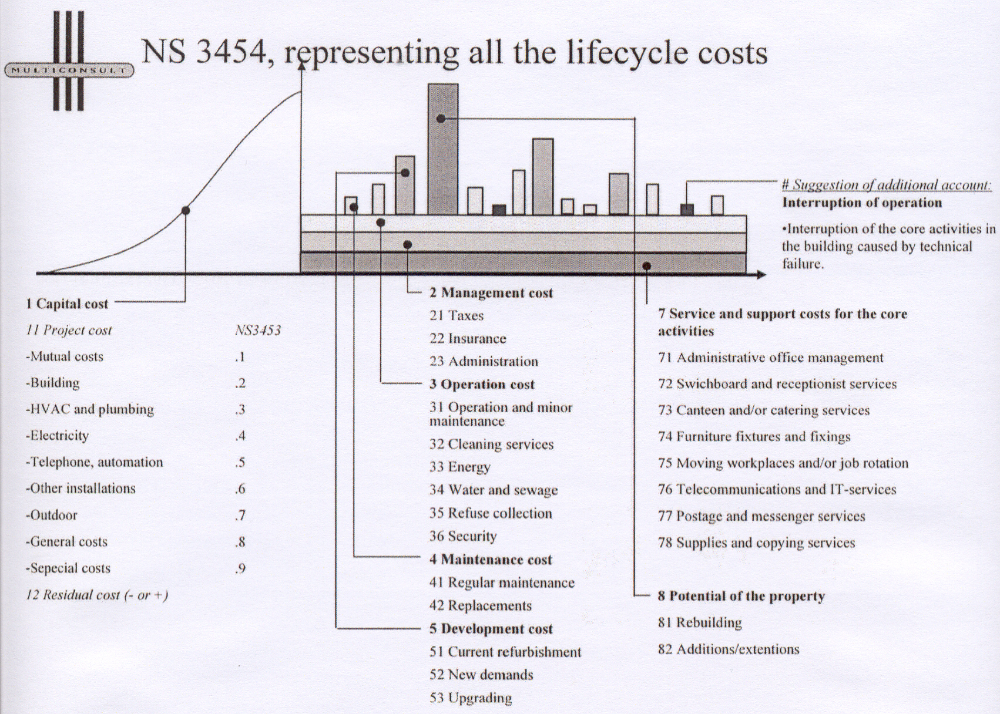
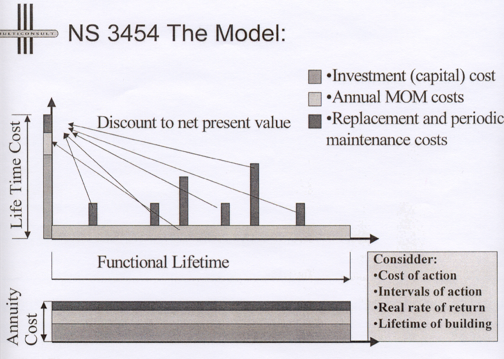
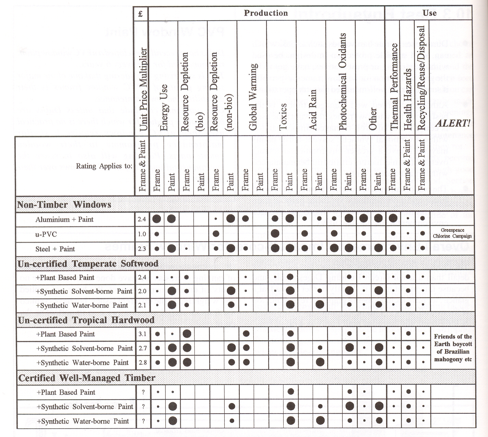

.. container::

   Háskóli Íslands – byggingarverkfræðiskor Húsagerð

   Björn Marteinsson

9 Umhverfisvænar byggingar, vistferilsgreining og kostnaður
===========================================================

Hugtökin umhverfisvænar (t.d. e: green buildings) og sjálfbærar
(e:sustainable buildings) byggingar heyrast æ oftar. Þessum hugtökum
tengjast einnig vistferilsgreining (e. Life Cycle Assessment, LCA) og
heildarkostnaður (e: Life Cycle Cost, LCC) og er ástæða til að fjalla um
öll hugtökin.

| 

| 

LIFETIME engineering:

| 

Á alþjóðlegum vettvangi er farið að tala um hugtakið “Lifetime
Engineering” og er þá átt við hvers framtíðin mun vænta af
byggingariðnaðinum. Í ES verkefninu “Thematic network LIFETIME”
(EU-Growth Research Programme; Thematic Network: LIFETIME: ”Lifetime
Engineering of Building and Civil Infrastructures”) er að finna
eftirfarandi skilgreiningu:

| 

*Lifetime Engineering is an innovative idea and a concretisation of this
idea for solving the dilemma that currently exists between
infrastructures as a very long-term product and a short-term approach to
design, management and maintenance planning.*

*Lifetime engineering includes:*

*Lifetime investment planning and decision- making*

*Integrated lifetime design*

*Integrated lifetime construction*

*Integrated lifetime management and maintenance planning*

*Modernisation, reuse, recycling and disposal*

*Integrated lifetime environmental impact assessment and minimisation*

*(…)*

*Integrated lifetime management and maintenance planning includes
continuous condition assessment, predictive modelling of performance,
durability and reliability of the facility, maintenance and repair
planning and the decision-making procedure regarding alternative
maintenance and repair actions.*

| 

Tilgangurinn er sá að strax í upphafi megi skoða, og bera saman,
valkosti til að meta hvaða kvaðir ný mannvirki setja framtíðinni og
þannig megi velja besta kostinn.

| 

*Kostnaðaráætlanir og heildarkostnaður*

Það hefur lengi tíðkast að gera kostnaðaráætlanir fyrir nýbyggingar.
Slíkar áætlanir eru ýmist byggðar á verðskrám fagfélaga
(“uppmælingartöxtum”) eða á markaðsupplýsingum.

| 

Verðskrár fagfélaga:

Fagfélög hafa uppmælingar til að byggja verðskrár á, slíkir verðskrár
eru t.d. notaðir við verðlagningu ákvæðisvinnu. Skrárnar byggja á
gildandi tímagjaldi viðkomandi stéttar og ýtarlegri sundurliðun.
Aðferðin er krefst góðrar þekkingar á verðskránum, sundurliðun
verkþáttar verður að vera fyrir hendi og aðferðin jafnframt tímafrek í
notkun. Verð sem þannig fást endurspegla ekki endilega markaðsverð þar
sem tímabundnar sveiflur í eftirspurn (yfirborganir) sjást ekki í
töxtunum.

| 

Verðbankar:

Flestir hönnuðir hafa verðupplýsingar úr verkum sem hafa verið unnin og
þeir tengjast, nokkrir aðilar selja aðgang að slíkum upplýsingum. Slíkar
upplýsingar eru (staðbundin) markaðsverð á hverjum tíma og gefa því
glögga mynd af áætluðum verkkostnaði. Í þessum tilvikum er iðulega um að
ræða t.d. fermetraverð í frágegnum byggingarhlutum og magntaka öll
verður vel viðráðanleg. Þessi aðferð er sérlega aðgengileg þegar gera á
samanburð á milli aðferða á hönnunartíma og í gerð kostnaðaráætlana
almennt.

| 

Vaxandi er áhugi fjárfesta á að meta fyrirfram heildarkostnað vegna
mannvirkja; þ.e. byggingarkostnað, rekstur og viðhald í einhvern
tiltekinn tíma. Slíkar áætlanir eru nauðsynlegar í t.d. PPP (e:
public-private partnership) verkum eins og verður notað við t.d. nýtt
tónlistarhús. Samanburður milli verka og/eða aðferða er oft gerður með
því að núvirðisreikna verk og dreifa síðan kostnaðinum á áætlaðan
endingartíma, sjá mynd 9. 1 og 9.2. Augljóslega er nauðsynlegt að hafa
nokkuð góða mynd af áhrifum endingar, niðurbrots, viðhaldsþarfar og
rekstrar til að geta fundið heildarkostnaðinn. Á mynd 9.3 er sýnd áætlun
heildarkostnaðar (á föstu verðlagi) fyrir íslenskt fjölbýli.

| 

Mynd 9.1 Heildarkostnaður (heimild S. Bjørberg, Multiconsult)

| 

Mynd 9.2 Heildarkostnaður núvirðisreiknaður og dreift á árin (heimild S.
Bjørberg, Multiconsult)

.. image:: myndir/kafli09_html_26ca9be9d26dabf3.png
   :name: Image3
   :width: 575px
   :height: 403px

Mynd 9.3 Viðhald og rekstarkostnaður fjölbýlis (Björn M, óbirt
vinnugögn)

*Umhverfisvæn efni og byggingar*

Talað er um umhverfisvæn efni og byggingar, en ekki alltaf ljóst við
hvað er átt. Þó virðist aðaláherslan iðulega liggja á hversu “óæskileg”
áhrif efna eru á umhverfið s.s. orkuþörf (t.d. innifalin orka) eða
efnagjöf og þá sérstaklega til innilofts. Loks vegur það þungt hversu
góður aðgangur er að efnunum, í slíkum samanburði er jákvætt ef um er að
ræða endurnýjanleg efni eða orku. Nokkur dæmi eru um byggingar hérlendis
sem hannaðar hafa verið sem “umhverfisvænar” (t.d. bygging að Sólheimum,
Grímsnesi - sjá http://www.solheimar.is/Solheimar/Umhverfismal/).

| 

Innifalin orka (e: embodied energy)

Áherslan á innifalda orku hefur verið mjög mikil (sjá umfjöllun um LCA)
og algengt að sjá efnum raðað í “gæðaflokka” útfrá slíkum upplýsingum
einum saman.

Í hugtakinu innifalin orka felst;

Orka sem þarf til vinnslu hráefnis

Flutningar hráefnis til verksmiðju

Framleiðsla; \*

Orka sem þarf fyrir framleiðsluferlið

Orka til tækja, lýsingar, upphitunar og flutninga í verksmiðju

Flutningar frá framleiðslustað til notkunarstaðar

| 

\* stundum er reiknað með orku og efnisþörf sem þurfti til að reisa
verksmiðjuna...

| 

Í töflu 9.1 eru sýnd samantekt yfir innifalda orku byggingarefna (Björn,
2002). Þegar nota á upplýsingar um innifalda orku efna þá skiptir
vitaskuld miklu máli að tölurnar séu sundurgreindar eftir tegund orku
(jarðvegseldsneyti, vatnsorka, jarðvarmi, kjarnorka..).

| 

Tafla 9.1 Viðmiðunargildi fyrir innifalda orku algengra byggingarefna

| |DrawObject1|

Efni Innifalin orka (MJ/kg)

| 

Fúguefni 50

| 

Gips 5,1

Gler 15,9

Gjall – vikur 0,006

Grús – fylliefni og steypuefni 0,008

| 

Íblöndunarefni fyrir steypu (þurrefnisinnihald 30%) 30

| 

Leirvara – postulín 13

Lím 100

| 

Malbik 3,4

Málmar (samtala, en langmest stál) 15

| 

Plast - almennt (samtala, en mest frauðplast) 60

Plastmálning (þurrefnisinnihald 20%) 40

| 

Sandur 0,003

Sement 6,1

Sparsl – sandsparsl 6,3

Steinull 11,3

Steypa 0,65

| 

Timbur – grófsagað 2,5

Trjákennd efni (spónaplötur, MDF) 12

| |DrawObject2|

| 

Framleiðsluorka vegna steypuframleiðslu hérlendis er metin sem 0,59
MJ/kg, sem er lágt í samanburði við erlend gildi sem liggja á bilinu 1,0
– 7,9 MJ/kg. Lágt gildi hér er mest vegna þess hve aðflutningsleiðir eru
stuttar og fylliefnið er náttúruleg grús, en erlendar tölur benda til
þess (Gillberg et al., 1999) að það sé fjórum sinnum orkufrekara að
vinna malað fylliefni heldur en grús.

| 

Upplýsingar um orkuþörf eru mikilvægur liður í vistferilsgreiningu
(LCA), sjá aftar.

| 

*Mengun*

Samfara vinnslu efna falla iðulega til úrgangsefni sem geta mengað
umhverfið, s.s. vegna brennslu jarðorku (olía, gas, kol), efnagjöf t.d.
leysiefni o.fl. Efnin munu einnig brotna niður á notkunartíma og sum
hver menga þannig enn frekar.

| 

Upplýsingar um efnamengun eru mikilvægur liður í vistferilsgreiningu
(LCA), sjá aftar.

| 

| 

*Förgun og endurnýting*

Varðandi þetta vísast til skýrslu; Edda Lilja Sveinsdóttir ofl. (2001).

| 

| 

Vistferilsgreining (LCA)

Aðferðunum er ætlað að gera samanburð milli efna eða byggingarhluta
mögulegan, og eru metin áhrif af notkun aðferðar á umhverfið.

| 

Ástæða er til að benda á að mikill hluti “óæskilegra áhrifa” reiknast
vegna notkunar jarðeldsneytis og því mikið lagt uppúr að greina
orkunotkun rétt. Ferlið felst þá lauslega í eftirfarandi:

a) Framleiðsluferlið er greint niður í þætti, þar sem magntekin er
efnis- og orkunotkun:

-  Hvaða efni er um að ræða, hvaða breytingum taka þau í ferlinu

-  Ágangur á óendurnýjanlegar auðlindir

-  Flutningsþörf efna til verksmiðju

-  Orkunotkun í framleiðsluferlinu

-  Flutningar efnis á markað (notkunarstað)

b. Áhrif ferlisins á umhverfið eru metin, en í matinu er nauðsynlegt að
   byggja á gagnagrunnum fyrir einstök efni;

   -  Reiknað hversu mikið fellur til af mengandi efnum s.s.
      CO\ :sub:`2`\ , SO\ :sub:`2`\ , NO\ :sub:`x`\ , rokgjörnum efnum
      (e: Volatile Organic Compounds,VOC), leysiefnum, terpenum, ryki,
      olíum, phenol ofl.

   -  Greint er á milli hvert efnin berast: (i) út í andrúmsloft, (ii)
      jarðveg eða (iii) vatn (grunnvatn, yfirborðsvatn).

| 

b. Samanburður milli ferla (efna eða aðferða). Þar sem um fjölda
   mismunandi mengunarþátta er að ræða þá er samanburður annaðhvort
   gerður þannig að;

i.  fyrir hvern þátt fyrir sig (sem magn eða einstaklings jafngildi (e:
    person equivalents, PE) – sjá mynd 9.1

ii. eða reiknað er út t.d. PE gildi fyrir hvern þátt og síðan lagt saman
    með vægitölum fyrir hvert efni

| 

Sjá nánar í Å. Jönsson, A-M. Tillman, T. Svensson (1997)

| 

Niðurstöður vistferilsgreininga (LCA) eru stundum birtar sem ráðlegging,
mynd 9.1. Ástæða er til að skoða samhengið sem upplýsingarnar eru í,
t.d. er í aftasta dálk getið um það sérstaklega ef efnisnotkun stangast
á við ráðleggingar umhverfissamtaka.

| 

| 

| 

| 

Mynd 9.1 Samanburður mismunandi gluggakarma (heimild Woolley et al.,
1997)

Eyða merkir minnst áhrif, áhrif aukast síðan með stækkandi fylltum hring

| 

| 

**Heimildir og ítarefni**

Björn Marteinsson (2002) Efnis- og orkunotkun vegna fjölbýlis í
Reykjavík; Efnisframleiðsla, flutningur, byggingarstarfsemi og rekstur í
50 ár, meistararitgerð frá iðnaðar- og vélaverkfræðideild Háskóla
Íslands, 127 síður, Björn Marteinsson, Reykjavík í október 2002

Edda Lilja Sveinsdóttir, Børge Johannes Wigum, Agnar Guðlaugsson, Ragna
Halldórsdóttir, Halla Jónsdóttir, Hjalti Guðmundsson og Lúðvík
Gústafsson (2001) Byggingarúrgangur á Íslandi – gagnagrunnur og
umhverfismat – Hluti I: Magn og gerð byggingarúrgangs á Íslandi, Skýrsla
nr. 01-08, Rannsóknastofnun byggingariðnaðarins, Keldnaholti

B. Gillberg, G. Fagurlund, Å. Jönsson, og A. M. Tillman (1999) Betong
och miljö - fakta från Betongforum, Svensk Byggtjänst, Stokkhólmi.

Å. Jönsson, A-M. Tillman, T. Svensson (1997) Life Cycle Assessment of
Flooring materials: Case Study, Building and Environment, Vol. 32, No.
3. pp. 245-255

T. Woolley, S. Kimmins, P. Harrison and R. Harrison (1997) Green
Building Handbook, E&FN Spon, London

| 

.. container::

   9.8

