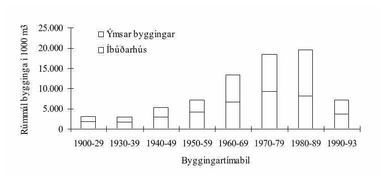
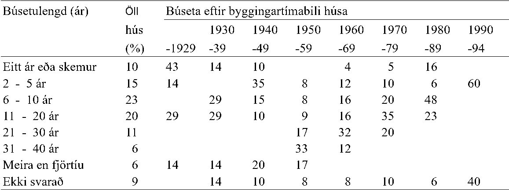
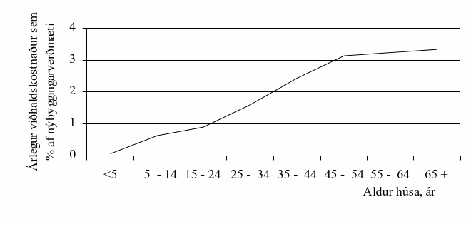
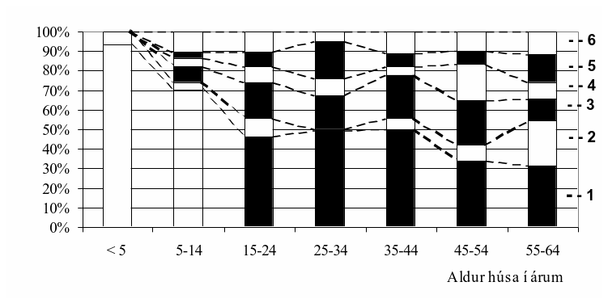
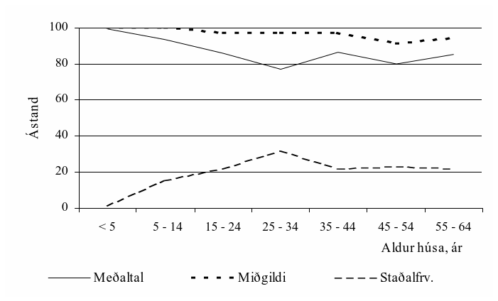

.. container::

   Háskóli Íslands – byggingarverkfræðiskor Húsagerð

   Björn Marteinsson

10. Gallar, endurbætur og viðhald
=================================

10.1 Almennt
------------

Iðulega koma fram gallar af ýmsum toga í byggingarhlutum, en með orðinu
gallar er hér átt við að efndakröfur séu ekki uppfylltar vegna þess að
hönnun, framkvæmd eða viðhaldi sé ábótavant.

Algengir gallar eru vegna rakaþéttingar, rakaísogs og leka.

| 

*Rakaþétting og yfirborðshiti*

Einangrun byggingarhluta ræður hversu mikið orkutapið verður út fyrir
gefnar aðstæður, og hefur einnig áhrif á hvert yfirborðshitastig innri
flatarins verður. Hitadreifing í byggingarhluta fer eftir uppbyggingu
hans, og sérstaklega hvernig hann er einangraður. Ef hitastig á eða í
byggingarhluta fer niður fyrir daggarmark lofts, þá verður rakaþétting
(eins og fjallað var um í köflum 2 og 3).

| 

Framan af öldinni var einangrun byggingarhluta óveruleg, og fram undir
1970 nægði um 2 sm einangrun (frauðplast eða samsvarandi) í þak og veggi
til að uppfylla ákvæði byggingarreglugerðar. Að vísu var þá farið að
tíðkast að einangra betur heldur en reglugerðarákvæðið sagði til um.
Mikið af húsum byggðum fyrir þann tíma eru mjög illa einangruð miðað við
það sem nú gerist.

Áhrifum þess að byggingarhluti er illa einangraður má skipta í tvennt:

| 

Kostir : - Hitastig þess hluta byggingarhlutans sem liggur utan við
einangrun er hærra en ella. Þetta nýtist sérstaklega í steyptum veggjum,
þar sem útþornun verður örari, og minni hætta almennt á frostskemmdum.

- Hætta á rakaþéttingu innan í byggingarhluta verður oft minni heldur en
ef byggingarhlutinn er vel einangraður.

| 

Ókostir : - Yfirborðshitastig að innanverðu verður lágt og getur það
hæglega valdið ýmsum óþægindum:

\* Geislun líkamans til umhverfis verður mjög ójöfn, og getur slíkt t.d.
ýtt undir gigt.

\* Hætta á rakaþéttingu innan á byggingarhluta getur orðið veruleg.

- Orkutap verður mikið.

| 

Af ofanskráðu má vera ljóst að ýmislegt vinnst og tapast með aukinni
einangrun, en almennt gildir að aðgæslu er þörf þegar einangrun
byggingarhluta er breytt.

| 

| 

| 

| 

| 

10.2 Gallar í þökum og veggjum
------------------------------

**Þök**

Gallar, sem rekja má til mistaka í hönnun eða framkvæmd skiptast almennt
í nokkra flokka:

| 

· Vatnslekar

· Rakaþétting

· Loftlekar - yfirborðskæling

· Einangrunargallar - kæling

· Hljóðtæknileg vandamál

· Burðarþolsvandamál

| 

Af þessum göllum eru þeir tveir fyrsttöldu algengasta umkvörtunarefnið,
og verða aðrir gallar einungis ræddir að því marki sem þeir tengjast
þeim.

| 

*Vatnslekar*

Lekinn verður þegar regn eða snjór kemst inn fyrir vatnsþéttingu þaks.
Almennt gildir um þök að tryggja ætti vatnshalla og vanda frágang við
niðurföll og rennur. Þakniðurföll skal ætíð staðsetja í lægstu punktum
þakflatar eða rennu. Í þessu sambandi er nauðsynlegt að gera ráð fyrir
niðurbeygjum þakflatar, eða burðarkerfis, vegna langtímaformbreytinga
eða álags. Bráðnandi snjór á þaki gefur vatn sem leiða þarf burt.
Snjóálag getur samkvæmt ÍST 12 verið á bilinu 1,0-3,0 kPa, þannig að
verulegt álag getur verið á þakinu samfara vatni.

| 

Niðurföll sem staðsett eru við súlur, þó svo þaki sé ætlað að halla að
þeim, geta vegna niðurbeygju lent í hápunkti.

| 

Niðurfallspípur frá þakniðurföllum geta verið hvort sem er inni í húsinu
- heitt niðurfall, eða utan á húsi - kalt niðurfall. Köldu niðurfalli má
vitaskuld breyta í heitt með notkun varmakapla. Almennt gildir að heit
þök og hallalítil köld þök ættu að hafa heit niðurföll, en jafnframt
yfirfall útfyrir þakbrún þannig að vatnsþrýstingur verði ekki of mikill
ef niðurfall lokast af einhverjum orsökum. Einungis brött köld þök
(þakhalli > 14°) ættu að hafa köld niðurföll.

| 

Vatnslekar geta orðið með mismunandi móti:

· leki á eiginlegum þakfleti

· leki þar sem þakflötur er rofinn

· leka á samskeytum að öðrum byggingarhlutum

· leki vegna snjófjúks inn í þak

| 

Lekastaðir á þakklæðningu eru einkum við:

· samskeyti í klæðningu

· festingar

· brot í þakfleti t.d. við mæni og gradsperrur

| 

Slíkir lekar eru algengir á hallalitlum þökum, en samfara auknum
þakhalla og lengri klæðningarplötum fer hættan minnkandi. Langar
klæðningarplötur sem eru illa festar eiga þó til að rifna útfrá
festingum vegna hitaþenslna. Í slíkum tilvikum getur jafnvel lekið á
bröttum þökum, einkum ef festing er í lágbáru (pappinn jagast útfrá
festingu). Fjöldi og gerð festinga verður að ráðast af gerð þakefnis (ál
hefur t.d. tvöfaldan hitaþenslustuðull á við stál). Athuga ber að þessi
atriði geta ráðið meiru um nauðsynlega festingu þakefnis heldur en t.d.
vindálag.

| 

Þegar skotrennur eru í þakfleti þá þarf að gæta þess sérlega vel að
uppistaða í rennu valdi því ekki að vatn komist inn fyrir vatnsvörn.

| 

Þegar notaðar eru grófbáraðar klæðningar þarf að vanda frágang við
þakpappa undir klæðningu vel. Ástæðan fyrir þessu er sú að bæði eru
þessar plötur oft litlar og eins að þétting klæðningar t.d. við mæni eða
kvist er oft erfið. Því er rétt að gera ráð fyrir að vatn komist undir
ystu klæðningu (ysta klæðning og pappi eru í sameiningu vatnsvörn þaks).
Svampþéttingar á hábárum hafa takmarkaða endingu og í sumum tilvikum
aðeins örfá ár. Svampurinn losnar iðulega, sem gæti stafað af minnkaðri
fjöðrun vegna frost-þíðu verkana.

| 

Í sumum tilvikum þarf að hugsa fyrir þenslufúgum í þakfletinum, og þá
einnig í ystu klæðningu. Ástæður þessa geta verið þenslur í fletinum, en
ekki síður hreyfingar í undirlagi (og burðarvirki). Þannig er
nauðsynlegt að gera ráð fyrir hreyfingarmöguleika fyrir pappalögn á
samskeytum þakeininga, óháð því hvort ysta klæðning er pappi eða
klæðning yfir pappa.

| 

Leki verður oft vart vegna tengingar þaks að öðrum byggingarhlutum, og
af stöðum þar sem slíkra leka verður gjarnan vart má nefna :

· þar sem veggur gengur upp fyrir þakflöt

· við þakglugga, túður og strokka

· vegna leka sem verður í aðliggjandi byggingarhluta, en lýsir sér eins
og um þakleka sé að ræða

| 

Lekar eru alltíðir þar sem þakflötur er rofinn, t.d.af stokkum eða
þakgluggum, og einnig þar sem þak gengur að öðrum byggingarhluta (sem
nær upp fyrir þakflötinn). Í þessum tilvikum myndast oft kverkar sem
vatn stendur í auk þess sem loftstraumar í grennd við slíkar hindranir
geta flutt með sér vatn þangað sem þess var ekki von. Sérstaklega gildir
þetta ef samskeyti eru opin þannig að undirþrýstingur innanhúss sogi
loft (og vatn) inn fyrir vatnsvörn þaksins.

| 

Í slagregni getur vatnsálag á skeytum þaks við hærri byggingarhluta
orðið verulegt vegna vatnsstreymis niður að skeytunum. Við slíkar
aðstæður þarf oft að verja samskeytin sérstaklega, t.d. með tvöfaldri
þéttingu eða draga úr vatnsálagi með dropnefi.

| 

Nokkuð er um leka sem koma fram í þaki, en eiga í raun upptök sín í
byggingarhluta sem þak tengist. Þannig hefur t.d. orðið vart nokkurra
tilfella þar sem leki með glugga í vegg, sem þak gengur upp að, veldur
leka sem kemur fram neðan í lofti.

| 

Talsverður hluti þakleka verða þegar snjó skefur inn á þak. Þetta
vandamál er þó oft staðbundið og meiri hætta á slíku á Norðurlandi
heldur en t.d Suðurlandi. Algengasta orsökin er rangur frágangur á
snjógildru þar sem loftinntak er í kverk milli veggjar og þakskeggs, en
ætti að vera sem yst í þakskeggi. Einnig er nokkuð um að snjógildru (eða
hliðstæðu) vanti alveg, og loft sem streymir upp með veggnum á greiða
leið inn í þak.

| 

*Rakaþétting*

Rakaþétting getur orðið ef rakt loft í þakrými kemst í snertingu við
kald fleti. Þétting getur valdið rakaskemmdum sem lýsa sér svipað og um
þakleka væri að ræða.

| 

Mikill loftraki í þakrými, sem er forsenda rakaþéttingar, getur stafað
af eftirtöldum ástæðum:

· lélegri loftun þaks

· byggingarraka

· rakt inniloft kemst upp í þakrými - rakastreymi og rakaflæði

· loftunarstrokkar, t.d. frá frárennslislögnum, opnast út í þakrými í
stað þess að ganga upp úr þaki

| 

Af ofantöldum orsökum eru byggingarraki og rakaflutningur innan úr húsi
algengustu ástæður rakaþéttingar, oft samfara lélegri loftun.

| 

*Loftun þaks*

Loftun þaks (ef um slíka þakgerð er að ræða) er ætlað að halda loftraka
í þakrými sem næst útiloftraka. Ekki er alltaf tryggt að loftun sé
nægjanleg, og er þessar ástæður helstar:

· Í hönnun og síðar framkvæmd gleymist að gera ráð fyrir loftun. Þetta
er einkum algengt í valmaþökum, og við kvisti.

· Loftrásir hafðar of þröngar, og lélegt samband milli rása í þaki.
Loftinnitök þröng eða jafnvel engin.

· Burðarvirki þaks lokar loftrásum, eða þrengir verulega að þeim. Nokkuð
algengt í hallalitlum þökum með upphengdum loftum.

· Frágangur og staðsetning inn- og útloftunar í þaki þannig að yfir eða
undirþrýstingur er samtímis á flestum eða öllum opum.

| 

*Byggingaraki*

Þegar byggingaraki veldur rakaþéttingu í þakrými húss sem telst vera
frágengið þá er yfirleitt um að ræða timburþök stóluð á steypta plötu.
Ef byggingarhraði er mikill, þá er iðulega búið að einangra steypta
þakplötu og farið að kynda húsið nokkrum vikum eftir að þakplatan er
steypt. Vegna byggingaraka í steyptri plötunni þá getur rakastig í
þakrýminu orðið mjög hátt, þar sem yfirleitt tíðkast ekki að setja
rakavarnarlag undir einangrunina (ofan á plötuna). Í þessum tilvikum
getur verið nauðsynlegt að ætla mun meiri loftun þakrýmis fyrsta árið
eða svo, heldur en síðar verður nauðsynlegt.

| 

Rakaflæði og streymi

Ef frágangur rakavarnarlags er lélegur og loftraki innanhúss mikill, þá
getur rakaflutningur innan úr húsi og upp í þakrými orðið mjög mikill.
Rakinn getur borist hvort sem er með rakaflæði í gegnum innri hluta
þaksins og upp í þakrýmið, eða með rakastreymi (loftstraumar sem bera
með sér raka) um glufur í rakavörn. Af þessu tvennu er rakastreymið mun
afkastameiri leið í rakaflutningi. Þetta vandamál er allalgengt, einkum
á seinni tímum þegar létt timburþök á steyptum húsum, og timburhús,
verða æ algengari samfara aukinni notkun rakatækja.

| 

Hjá Rannsóknastofnun byggingariðnaðarins hafa verið gerðar athuganir á
loftþéttleika húsa, og algengustu loftlekastöðum. Niðurstöður sýna að
þéttleika steyptra húsa með timburþaki er oft mjög ábótavant, og ræður
þar mestur lélegur frágangur rakavarnarlags þaks við steypta útveggi.
Einnig er frágangi rakavarnarlags við burðarbita ábótavant. Verulegt
loftstreymi innan úr húsi og upp í þakrými í slíkum tilfellum stóreykur
hættu á rakaþéttingum. Loftlekinn getur einnig valdið svo miklum
loftskiptum í húsinu að vandamál verður að halda hæfilegum innihita.

| 

Óvarlegur frágangur rakavarlarlags og staðsetning þess miðað við
einangrun þaks getur orðið til þess að rakavarnarlagið, eða einstakir
hlutar þess, kólni svo niður að rakaþétting geti orðið. Einnig getur
vindvörn þaks og loftræstingu verið þannig háttað að loftstraumar kæli
rakavarnarlagið niður fyrir daggarmark innilofts og valdi þannig
rakaþéttingu.

| 

| 

Útveggir og gluggar

Algengustu gallar í útveggjum tengjast því að yfirborð veggjanna að utan
er of vatnsdrægt, eða jafnvel opið þannig að vatn á greiða leið inn í
byggingarhlutann. Þegar um steypta veggi er að ræða eykur slíkt hættu á
frost - og alkalískemmdum, en timburveggjum er hætt við fúa.

| 

Aðalviðhald útveggja felst þess vegna í ýmiskonar yfirborðsmeðhöndlun og
yfirborðsviðgerðum sem er ætlað að vatnsverja byggingarhlutann, og þá
aðallega ytra yfirborð hans. Eðlilegt er að draga úr áhrifum veðurálags
á vegg eftir fremsta megni, og þar með að minnka líkur á skemmdum og
halda viðhaldi innan skynsamlegra marka. Alltaf er því æskilegt að draga
úr vatnsálagi á veggi með þakrennum og niðurföllum, þakskeggi og
vatnsbrettum, og almennt að freista þess að leiða vatn út frá vegg í
stað þess að vatn renni niður yfirborð hans.

| 

Helstu gallar og skemmdir á útveggjum, aðrar en þær sem koma fram á ytra
yfirborði, eru vegna rakaþéttingar, rakaísogs og leka.

| 

*Rakaþétting*

Rakaþéttingar innan í byggingarhluta, slaga (nf. slagi), verður helst
vart eftir langvarandi kuldakafla (þegar rakaþétting hefur safnast upp
sem hrím, eða ís innan í byggingarhluta). Vatn getur þá komið fram á
gólfi við veggi (einkum steypta og einangraða að innan í grind) og
bleytt upp veggklæðninguna. Vatnið er oft af misskilningi talið stafa
frá leka. Rakaþétting sem verður í timburvegg gerist almennt innan á
illa loftræstri ytri klæðningu, eða of þéttu vindvarnarlagi. Rakans
verður oftast ekki vart, og ef loftun er ekki nægjanleg til að viðhalda
hæfilegu rakajafnvægi þá fúnar ytri hluti grindar og hugsanleg
þéttklæðning þar fyrir utan. Fúans verður oft fyrst vart vegna
lyktarinnar sem fylgir honum.

| 

Kuldabrýr geta valdið staðbundinni lækkun yfirborðshita. Hitastig á
kuldabrú, td.þar sem steyptur innveggur gengur út í steyptan vegg sem
einangraður er að innan, getur hæglega orðið 5 - 8 C lægra heldur en
yfirborðshiti útveggjarins. Hætta á rakaþéttingu er því alltaf mikil á
kuldabrúm, og sérstaklega þar sem þær mynda oft kverkar sem lítil
lofthreyfing er í.

| 

Rakaþétting innan á veggjum kemur alltaf fram sem dekking á yfirborðinu
(skítur safnast á rakt og kalt yfirborðið). Þessa gætir sérstaklega þar
sem lofthreyfing við yfirborð verður ónóg, svo sem í kverkum, og þar sem
húsgögn standa nærri útveggjum (húsgögnin breyta þá jafnframt
einangrunargildi veggjarins). Vandamálið er vel þekkt í klæðaskápum sem
koma að útveggjum, jafnvel í tiltölulega nýjum húsum. Rakaþéttingunni
fylgir oft óþægileg lykt vegna sveppagróðurs sem þrífst á röku
yfirborðinu.

| 

Rakaísog

Ef grunnvatn stendur hátt við hús getur raki sogast upp vegna
hárpípukrafta upp í undirstöðuveggi eða gólfplötu, og þaðan jafnvel upp
í innveggi og útveggi. Í gólfum veldur rakinn því að gólfefni þrútna eða
losna. Í veggjum verður rakans vart á því að málning losnar neðst á þeim
(á innveggjum í gólfkverkinni, en niður við jörð á útveggjum), og eru
hvítar saltútfellingar á bakvið málninguna. Ysta lag pússningarinnar
fylgir stundum málningunni.

| 

*Leki*

Leki í útveggjum getur átt sér margar orsakir, en óháð orsök er
algengast í steyptum húsum að hans verði vart niður við gólf á þeirri
hæð sem hann á upptök sín, eða ekki síður við loftplötu næstu hæðar
fyrir neðan. Einnig þekkist að leka inn í vegg verði vart vegna þess að
vatn rennur útúr sprungum utan á húsinu.

| 

Í timburhúsum verður leka oft ekki vart fyrr en um seinan. Þegar gera á
endurbætur á timburvirkjum ætti alltaf að hafa timburrakamæli við
höndina til að kanna rakaástand viðarins, og reyna þannig að leggja mat
á aðstæður.

| 

Leki getur komið fram sem vatnsdropar, sem oft valda taumum á veggjum .
Algengast er að vatnið sé nokkuð hreint, dökkir taumar benda til þess að
orsökin sé rakaþétting, en á því eru þó undantekningar. Oftar kemur
lekinn þó fram á svipaðan hátt og lýst er að ofan í undirkaflanum um
rakaísog.

| 

Aðrir lekar t.d. frá þaki og gluggum geta lýst sér mjög svipað, og oft
erfitt að greina orsakir lekans. Iðulega þarf að prófa sig áfram og
útiloka eitt atriði af öðru, jafnvel með viðgerðum, þar til tekst að
komast fyrir lekann.

| 

Algengustu orsakir leka í útveggjum, eru :

- Léleg yfirborðsmeðhöndlun, eða gallað yfirborð, t.d. sprungur eða
lélegur frágangur klæðningar.

- Leki á mótum glugga/hurða og veggjar, oftast með undirkarmstykki.

| 

Algengt er að vatn komist á milli karma og veggjar, jafnt í steyptum
veggjum sem timburveggjum. Annar leki sem lýsir sér svipað er vegna
óþéttra karmskeyta eða glerjunar.

| 

Leki með undirkarmstykki veldur oftast skemmdum undir glugganum í heild,
en leki með hliðarstykkjum (og raunar einnig samskeytum karma) kemur
helst fram niður undan hornum gluggans. Í steyptum veggjum lýsir leki
með körmum sér iðulega þannig að rakaskemmdir sjást á pússningu niður
undan glugga eða við gólf. Leki sem kemur fram ofan við glugga á sér oft
uppruna með undirkarmstykki á næstu hæð fyrir ofan, eða með óþéttum
steypuskilum við loftplötuna. Leka milli karms og veggjar í
timburveggjum verður oft ekki vart fyrr en hann hefur valdið fúa, og
veldur lekinn hliðstæðum skemmdum- og lýsir sér eins- og skemmdir vegna
rakaþéttingar í timburvegg (sjá að ofan).

| 

10.3 Ástand og viðhaldsþörf húsa
--------------------------------

Eftirfarandi er grein sem birtist í árbók VFÍ 1999 (heimild: Björn og
Benedikt, 1999).

| 

Ástandskönnun húsa í Reykjavík
------------------------------

Útdráttur
^^^^^^^^^

Ástandskönnun á húsum er áhugaverð, einkum út frá tveim sjónarmiðum.
Slík könnun gefur mikilsverðar upplýsingar sem hægt er að nýta til að
skipuleggja síðari tíma viðhald en einnig fást upplýsingar um hvernig
byggingar og efni standast umhverfisálag og hrörna við raunverulegar
aðstæður. Varðandi fyrra atriðið þá má sjá hvaða viðhaldsvinnu þarf að
sinna, hversu dýr hún er og hversu brýn. Í síðara tilvikinu verður að
hafa í huga að niðurstöður könnunar á hverjum tíma sýna gefa til kynna
ástand sem er til orðið m.a. vegna viðhalds sem þegar hefur átt sér
stað. Hér á eftir verður fjallað um könnun Rannsóknastofnunar
byggingariðnaðarins á 220 húsum í Reykjavík, en rannsóknin var styrkt af
RANNÍS og Húsnæðisstofnun ríkisins (nú Íbúðalánasjóður). Í könnunni var
annarsvegar framkvæmd sjónskoðun á byggingunum að utanverðu, hinsvegar
aflað upplýsinga hjá eigendum um ástand innanhúss og viðhald á húsinu.
Sérstaklega verður fjallað um aðferðafræðina í slíkri könnun, hvað má
læra af slíkri könnun, en ekki síður hvað ekki verður lært af henni.
Grein þessi er stytt úr erindi sem flutt var á alþjóðlegri ráðstefnu,
sjá heimildalista (Björn og Benedikt 1999).

| 

Inngangur
^^^^^^^^^

Á Íslandi hefur magn nýbygginga dregist talsvert saman undanfarinn
áratug og meðalaldur bygginga í landinu hækkar því ört. Viðhald húsa er
því hratt vaxandi iðnaðargrein og því áhugavert að afla upplýsinga um
hvaða umfang þessi markaður muni hafa í náinni framtíð og í hverju
viðhaldsverk munu einkum felast. Til þess að gera slíka áætlun er
nauðsynlegt að framkvæma ástandsmat á þeim húsum sem þegar eru í
landinu, öðruvísi verður ýmsum spurningum ekki svarað er þetta varða.
Auk upplýsinga um viðhaldsþörf er áhugavert að kanna hvaða upplýsingar
fást um endingu efna og þá jafnframt hvernig hrörnun efna verður.

Söfnun upplýsinga með ástandskönnun húsa, sem eru í notkun, er
mikilsverð leið til að afla upplýsinga um hús. Um mikilvægi þessa og
aðferðafræði hefur verið fjallað þó nokkuð (Brandt 1984, Masters og
Brandt 1987, Sjöström og Brandt (eds) 1990, Brandt og Sjöström 1993).
Augljóst er að ástand húsa á hverjum tíma endurspeglar upphafsgæði,
aldur húsanna, áraun á þau og þá viðhaldsvinnu sem þegar hefur farið
fram. Úr niðurstöðum má greina áhrif nýjustu viðhaldsaðgerðanna en miklu
síður þeirra eldri þar sem þá fara að renna saman áhrif margra aðgerða,
þ.e. áhrifin skarast. Til þess að leggja mat á viðhaldsþörf og
framtíðarástand bygginga þarf því að afla upplýsinga um fyrra viðhald
hjá húseigendum. Í þessu sambandi ber að nefna að á Íslandi er löng hefð
fyrir því að húseigandi taki sjálfur þátt í byggingu eigin húss og hann
tekur drjúgan þátt í viðhaldi hússins síðar. Þessi staðreynd getur haft
mikil áhrif, bæði heppileg og óheppileg, á upphafsgæði húss ekki síður
en gæði viðhaldsverkanna síðar meir.

| 

Framkvæmd könnunar
==================

Úrtak húsa
^^^^^^^^^^

Athugun á ástandi bygginga var afmarkað við Reykjavík til að takmarka
umfang könnunarinnar, en í borginni búa rétt rúmlega 100 000 íbúar af
alls rúmlega 270 000 íbúum landsins. Í Reykjavík eru alls um 26 000
byggingar af ýmsum gerðum, þar á meðal stór hluti af stjórnsýslu- og
þjónustubyggingum landsmanna. Aldursskipting húsa í borginni er mjög
skökk, mynd 1, þar sem aðalbyggingartímabilið hefur verið undanfarin 30
ár vegna hinnar öru fjölgunar á svæðinu og almennt aukinnar þjónustu.

| 

| |image1|

| 

| 

| 

| 

| 

| 

| 

| 

| 

| 

| 

| 

| 

Mynd 1. Rúmmál bygginga í Reykjavík frá mismunandi byggingartímabilum

| 

| 

Til þess að afla upplýsinga um ástand þessara bygginga í skoðun var
valið slembiúrtak sem endurspeglar heildarmengið. Við val á úrtaki þarf
að gæta þess að það verði ekki of stórt þar sem þá verður kostnaður
óhóflegur, en jafnframt þarf úrtakið að vera nægjanlega stórt til að
tryggja að útfrá niðurstöðum rannsóknarinnar megi áætla ástand
heildarinnar. Fljótt á litið virðist sem nauðsynlegur fjöldi bygginga í
skoðun þurfi að vera allmikill, eða gjarnan af stærðinni 1000-2000
eintök, líkt og gerist þegar almenn skoðanakönnun er framkvæmd meðal
íbúa. Við nánari skoðun má þó rökstyðja mun minna úrtak.

| 

Ástand byggingar fer augljóslega eftir upphafsástandi, aldri, áraun á
notkunartíma og viðhaldi á notkunartíma.

-  Byggingar á sama svæði munu hafa allsvipaða ytri áraun, þó með
   nokkrum undantekningum:

#. Staðbundin mengun, t.d. frá iðnaði eða mikilli bílaumferð, getur
   verið mjög mismunandi. Á Íslandi er mengun almennt mjög lítil og
   áhrif þessa því óveruleg ef undan er skilið þröngt miðbæjarsvæði í
   Reykjavík og nágrenni örfárra stórra verksmiðja utan við Reykjavík.

#. Skjóláhrif eru mismunandi frá einni byggingu til annarrar, en
   meðalástand er þó sennilega svipað í heilum hverfum. Ástand getur
   verið mismunandi eftir hverfum og ástand því mismunandi eftir
   byggingartímabilum (hverfi byggjast upp á mismunandi tímabilum).
   Aukin stærð úrtaks dregur ekki úr þessum áhrifum.

-  Hús frá svipuðu byggingartímabili og í svipuðum notkunarflokki
   (einbýli, fjölbýli, iðnaður, verslun, opinber þjónusta) eru innbyrðis
   svipuð bæði að því er varðar gerð og innri áraun.

| 

Stærð nauðsynlegs úrtaks má takmarka með því að skipta heildinni upp í
flokka, fyrst aldursflokka sem t.d. spanna tíu ár hver og síðan
mismunandi notkunarflokka innan aldursflokkanna. Vegna lítils vægis
elstu húsanna voru öll hús sem byggð voru fyrir 1930 talin vera einn
aldursflokkur. Úr hverjum flokki fyrir sig voru síðan valin hús af
handahófi þar til heildarúrtakið samanstóð af sem næst 1% húsa úr
hverjum þeirra, en þó aldrei færri en 10 hús í hverjum undirflokki.
Stærð heildarúrtaksins sem þannig fékkst var alls 220 hús, sem við
teljum nægjanlegt til að gefa góða mynd af heildinni.

Spurningar til húseigenda
^^^^^^^^^^^^^^^^^^^^^^^^^

Fyrir valið úrtak húsa er einungis hjá húseigendum hægt að fá einhverjar
upplýsingar um t.d. fyrra viðhald og kostnað af því og ýmsar óvæntar
skemmdir, s.s. leka, sem kunna að hafa komið upp. Upplýsingar frá
húseigendum verða þó aldrei tæmandi, vegna þess að búsetutími núverandi
eiganda í húsinu getur verið skammur og ennfremur eru minni manna
takmörk sett, einkum ef talað er um neikvæða þætti búsetunnar ! Við
könnun á búsetulengd (sjá töflu 1) kom reyndar í ljós að þó nokkuð er um
talsvert langa búsetu, sé tekið mið af aldri húsa, og húseigandi getur
því haft talsverða þekkingu á forsögu hússins.

| 

| |image2|

Tafla 1. Búsetulengd í húsnæði í Reykjavík (árið 1994)

| 

Ástandskönnun
^^^^^^^^^^^^^

Ákveðið var að beita einungis sjónmati þar eð mælingar og sýnataka væri
of tímafrekt. Ástandsmat má hugsa sér með tvennu móti, annarsvegar tíðni
ákveðins ástands og hinsvegar umfang ákveðins ástands. Þessar aðferðir
hafa t.d. verið ræddar af Brandt 1984 og í NS. Í tilvitnuðum ritum er
megin áherslan lögð á tíðnimat en mikilvægi þess að nota báðar
aðferðirnar hefur ekki verið undirstrikað nægjanlega að mati höfunda
þessarar greinar. Í tíðnimati er skráð hversu oft ákveðið ástand sést,
t.d. eftir fjölda byggingarhluta, og þannig fæst hugmynd um hvað
hrörnar, hversu oft og jafnvel hversu hratt. Umfang ástands er hinsvegar
óljóst og því ógerlegt að áætla viðhaldsþörf út frá tíðnimati
einvörðungu. Í umfangsmati fást upplýsingar um heildarástand flatar og
með magntöku á byggingarhlutum, t.d. út frá teikningum, má áætla magn
byggingarflata eftir mismunandi ástandi og þannig áætla viðhaldsþörf.
Niðurstöður úr mati sem byggist einungis á tíðni skemmda mun þannig gefa
aðrar upplýsingar um heildarástand heldur en mat á umfangi, og í
ástandskönnuninni var því valið að nota tvöfaldan matslykil til þess að
meta bæði tíðni og umfang.

Auk ástandsmats var viðhaldsþörf metin. Þetta sjálfstæða mat á
viðhaldsþörf auðveldaði síðari áætlun viðhaldskostnaðar þar sem mat á
viðhaldsþörf út frá ástandslýsingu einni saman er mjög tímafrekt. Við
úrvinnslu á niðurstöðum kom í ljós að þetta tvíþætta mat sýndi vel hvort
samræmi var í mati á byggingu og þá hvort ástæða var til að skoða hana
að nýju vegna misritunar eða hreinna skekkja í mati.

Við skoðun húsanna var stuðst við matslykil og ítarleg skoðunarblöð þar
sem skoðunarmenn merkja við atriði og skrá athugasemdir. Í upphafi er
gerð grein fyrir almennum atriðum varðandi hvert hús, s.s. tegund
húsnæðis, fjölda hæða, ytri aðstæðum (skjól, áveðurs) og byggingarlagi.

Fyrir hvern byggingarhluta er byggingarefnum lýst (aðalefni, t.d. steypa
eða málmur og síðan nánari tegundarlýsing), áferð efna (slétt, bárað
o.fl.), meðhöndlun yfirborðs (t.d. málning), festingum klæðningarefna,
þakfrágangi og loks er sérlýsing fyrir glugga þar sem fram kemur efni í
körmum, glergerð, glerjunarlistar, frágangur við vegg (fúga) og ísetning
opnanlegra faga.

Megintilgangur könnunarinnar snýr síðan að því að meta ástand flata og
áætla þörf þeirra fyrir viðhald, bæði hvað varðar yfirborðsefnin (t.d.
málning) og aðalefni byggingarhlutans, þ.e. steypu í steyptum vegg og
klæðningu á klæddum fleti. Aðalefni yfirborðs var kallað undirlagsefni í
skoðuninni til aðgreiningar frá yfirborðs-meðhöndlun.

Til að ná fram samræmdu mati á hrörnun efna var notaður matslykill sem
lýsir ástandi þeirra í fjórum stigum. Matslykli og einkunnagjöf er lýst
ítarlega í skýrslu Rb nr. 97-14 og vísast til hennar varðandi þessi
atriði.

| 

Niðurstöður könnunar
====================

Svör húseigenda
^^^^^^^^^^^^^^^

Húseigandi sinnir um 60% viðhaldsvinnunnar sjálfur, en þetta er að
breytast og augljóst að í sambýli er helst um að ræða málun innanhúss.
Kostnaðarskipting viðhalds sýnir að um helmingur viðhaldskostnaðar er
vegna viðhalds innandyra og helmingur utandyra.

Út frá upplýsingum húseigenda má fá allgóða mynd af viðhaldsþörf í
krónum talið, en upplýsingar um sjálfar aðgerðirnar þegar húseigandi
hefur keypt til þess verktaka eru af mjög skornum skammti. Þetta stafar
af því hve sjaldan eru gerðar verklýsingar og áætlanir fyrir smærri
verk. Kostnaður vegna viðhalds er mjög breytilegur eftir aldri húsa. Ef
einvörðungu eru skoðaðar íbúðarbyggingar þá er kostnaður sem hlutfall af
áætluðum nýbyggingarkostnaði eins og mynd 2 sýnir.
Meðalviðhaldskostnaður íbúðarhúsa, reiknaður yfir 60 ár, er um 2% eða
svipað og iðulega er miðað við erlendis.

Upplýsingar húseigenda bera með sér að steyptir veggir hafa verið
viðhaldsfrekir og hluti þeirra verið klæddur af þeim sökum, sjá töflu 2.
Mikið viðhald veggja frá byggingartímabilinu 1960-1980 er vitaskuld
vegna frost- og alkalívandamála.

| 

| |image3|

| 

| 

| 

| 

| 

| 

| 

| 

| 

| 

| 

Mynd 2. Árlegur viðhaldskostnaður (% nýbyggingarkostnaðar) eftir aldri
húsa

| 

Ástandsmat
^^^^^^^^^^

Út frá tvíþættu mati á ástandi, annarsvegar tíðni ástands og hinsvegar
umfangi, þá fæst mat á í hvaða röð mismunandi skemmdir koma fram og
hversu þungt þær vega hver fyrir sig. Tíðnimat sýnir almennt dekkri mynd
af ástandinu heldur en umfangsmat gerir enda tekur það fyrrnefnda mið af
hrörnun eða skemmdum um leið og þær sjást, óháð umfangi.

| 

| 

| |image4|

| 

| 

| 

| 

| 

| 

| 

| 

| 

| 

| 

| 

| 

1 Ástand gott 2 Smávægileg hrörnun með litla útbreiðslu

3 Smávægileg hrörnun, nokkuð útbreidd 4 Talsverð eða mikil hrörnun,
nokkuð útbreidd

5 Talsverð eða mikil hrörnun, útbreidd 6 Klæddir veggir

| 

Mynd 3. Ástandsmat steyptra veggja

| 

Ástandsmatið gefur upplýsingar um hvernig efnin hrörna og einnig um
endingu (enska: service life) byggingarhluta en hinsvegar er illgerlegt
að fá mat á tíðni viðhaldsþarfar.

Byggingartímabil

Öll -1930 1930 1940 1950 1960 1970 1980 1990

hús - 39 - 49 - 59 -69 -79 -89 -93

| 

Steypuviðgerðir 33 20 33 40 44 47 31 29

Veggir klæddir 12 30 18 25 4

| 

Tafla 2. Upplýsingar um viðhald á steyptum veggjum; hlutfall af heild

| 

Niðurstöður fyrir ástandsmat á steyptum og múruðum útveggjaflötum eru
sýndar á mynd 3, sýnd er dreifing í niðurstöðum eftir aldurshópum. Þrátt
fyrir umfangsmikið viðhald á öllum byggingum sem byggðar voru fyrir
1990, sjá töflu 2, þá eru 11-28% allra veggflata í slæmu ástandi og til
viðbótar hafa um 10% veggflatanna verið klæddir sökum lélegs ástands.
Klæðning á yngstu húsunum var hönnuð frá byrjun og er ekki
endurbótaaðgerð. Ástand veggflata er viðunandi eða gott á aðeins 40-50%
húsa sem eru 15 ára eða eldri.

Með því að gefa ástandsflokkunum einkunn frá 1 (lélegt) til 100 (gott)
þá má reikna út dreifingu innan hvers aldursflokks. Dreifing sem þannig
fæst innan sama aldurshóps er alls ekki normaldreifð, mynd 4, eins og
sjá má á því að fyrir suma aldursflokka er talsverður munur á meðal- og
miðgildi og er hali dreifingarinnar í átt að verra ástandi. Því þarf að
gæta ýtrustu varkárni við að meta niðurstöður, meðaltal getur t.d. gefið
mjög skakka mynd af ástandinu.

| 

| 

| 

| 

| |image5|

| 

| 

| 

| 

| 

| 

| 

| 

| 

| 

| 

| 

| 

| 

Mynd 4. Ástand steyptra veggja - meðaltal, miðgildi og staðalfrávik

| 

Í vætusömu veðurfari Íslands hefur yfirborðsmeðhöndlun í mörgum tilvikum
mjög mikil áhrif á ástand undirlagsefnis, en það kom skýrt fram í
könnuninni að gæði yfirborðsmeðhöndlunar eru oft lítil og gefa því ekki
næga vörn. Svo dæmi sé tekið af timburgluggum þá hrörnar ástand þeirra
jafnt og þétt í gluggum sem frá upphafi voru af litlum gæðum, þar til
skipta þarf um glugga. Í glugga með mikil upphafsgæði er vandamálið
aðallega það að tíðni yfirborðsmeðhöndlunar vex óhóflega vegna lélegrar
endingar og að því kemur að hreinsa þarf timbrið upp, gera við skemmdir
sem kunna að vera í því og síðan yfirborðsmeðhöndla eins og um nýjan
glugga sé að ræða. Steypa og múr sem er lélegt frá upphafi verður afar
þungt í viðhaldi og gæði þess aldrei viðunandi. Stór hluti veggflata frá
hvaða aldri sem er, og sem er í góðu ástandi enn, hefur aldrei haft þörf
fyrir viðhald. Lítil upphafsgæði virðist hinsvegar ekki hægt að bæta með
venjulegum steypuviðgerðum. Í þessum tilvikum getur reynst nauðsynlegt
að endurnýja ysta hluta veggjar og nota þá efni sem hæfir
umhverfisárauninni, en þetta virðist erfitt fyrir húseigendur að skilja.

| 

Viðhaldsmarkaðurinn ofmetur árangur af venjulegu minniháttar viðhaldi á
t.d. steypu. Húseigandi, í samráði við ráðgjafa, hefur þannig
tilhneigingu til að laga aðeins það sem hann sér að þarfnast viðgerða,
og þá miðað við þann gæðastaðal sem hann gefur sér og getur verið lægri
heldur en kröfur eru í nýbyggingu. Svo heldur húsið áfram að skemmast og
sjaldnast er allt húsið, eða bara t.d. allir gluggar þess, í góðu
ástandi samtímis. Vegna þessa eru viðhaldsaðgerðir húsa endurteknar með
jöfnu millibili, t.d. er algengt að gera við steypu á 5-7 ára fresti.
Sérhver viðgerð kemur eigandanum á óvart, hann skilur alls ekki hvers
vegna síðasta viðgerð dugði ekki til. Það er því brýn þörf fyrir
verulega betri aðferðir við úttektir og áætlanagerð í tengslum við
viðhald bygginga.

Niðurstöður ástandsmats eins og hér er fjallað um sýna hver viðhaldsþörf
er í dag og í hverju hún felst. Það reyndist því unnt að gera áætlun um
viðhaldsþörf og áætla kostnað næstu 20 ára. Samkvæmt úttektinni nemur
þessi kostnaður í dag um 30% af umfangi alls byggingariðnaðar, mannvirki
meðtalin, en á næstu 20 árum er áætlað að umfang viðhaldsmarkaðarins
muni tvöfaldast að núvirði en nýbyggingarmarkaðurinn væntanlega standa í
stað.

Niðurstöður sýna hvaða hrörnun er dæmigerð fyrir mismunandi efni, en
vegna viðhalds sem þegar hefur farið fram þá er erfitt að áætla
hrörnunarhraða. Hinsvegar má áætla meðalendingu (enska: service life)
mismunandi efna með nokkru öryggi en dreifing í gildum er mjög mikil
milli húsa, tafla 3.

Ending (ár)

Algeng Sértilvik

Galvanhúðaðar klæðningar

Þök

Klæðningarefnið 35 - 45 15 - 100+

Málning; Verksmiðjuhúðun 10 - 15 5 - 20

- Málað á staðnum 10 8 - 15

Veggir

Klæðningarefnið > 60 25 - 100+

Timburgluggar

- Norrænn barrviður 35 - 40 4 - 80+

- Yfirborðshúð 2 - 4 1 - 8

Steypt veggyfirborð > 60 15 - 100+

| 

Tafla 3. Ending byggingarefna í Reykjavík - algeng og ytri mörk

| 

| 

| 

Heimildir

Benedikt Jónsson og Björn Marteinsson, B, 1997, Ástand mannvirkja og
viðhaldsþörf. Rb skýrsla 97-14, Reykjavík.

Björn Marteinsson og Benedikt Jónsson, 1999, Overall survey of buildings
- performance and maintenance. Erindi á ráðstefnunni 8dbmc Vancouver,
Canada, May 30 - June 3. 1999.

Brandt, E., 1984, Assessment of the condition of buildings. The third
international conference on the durability of building materials and
components, VTT, Helsinki.

Masters, L.W. and Brandt, E., 1987, Prediction of service life of
building materials and components. CIB W80/RILEM 71-PSL-Final Report,
RILEM Technical Committees.

Sjöström, Ch. and Brandt, E. (eds), 1990, Feedback from Practice of
Durability Data - Inspection of Buildings. CIB report 127, International
Council for Building Research Studies and Documentation (CIB),
Rotterdam.

Brandt, E. and Sjöström, C., 1993, Field Exposure Tests, Experimental
Buildings and In-Use Testing, Durability of Building Materials and
Components 6. Edited by S. Nagataki, T. Nireki and F. Tomosawa.

Norsk Standard NS 3424, Condition survey of construction works.

| 

| 

| 

| 

| 

| 

| 

| 

| 

**Heimildir og ítarefni**

Björn Marteinsson og Benedikt Jónsson (1999) “Ástandskönnun húsa í
Reykjavík”, Ársrit VFÍ/TFÍ 1998/1999

Björn Marteinsson (1999) “Þök - Magn, verðmæti og viðgerðir”, erindi á
ráðstefnu VFÍ og TFÍ 1999, birt í ráðstefnuritinu Þök í íslenskri
veðráttu, Rannsóknastofnun byggingariðnaðarins Reykjavík 2000

Björn Marteinsson (1989) “Þakfrágangur-loftræst þök”, tvær blaðagreinar,
Morgunblaðið í júlí og ágúst 1989

Björn Marteinsson (1989) “Þök - almennar kröfur”, fyrirlestur á
námskeiði “Vandamálaþök” á vegum Eftirmenntunarnefndar HÍ, nóvember 1989

Björn Marteinsson (1988) “Þök - gallar í hönnun og framkvæmd”, erindi á
ráðstefnu “Betri hönnun steyptra mannvirkja”á vegum
Steinsteypufélagsins, febrúar 1988

Anon (1982) Rätt i bygget, Yttertak - klimatpåverkan och lösningar,
Byggforskningsrådet, Malmö, Sverige

I. Höglund och S. Nilsson (1981), Takteknik, Meddelande nr. 132 från
Institutionen för byggnadsteknik KTH, Stockholm, Sverige

| 

| 

| 

| 

| 

.. container::

   10.16

