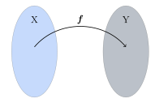

Föll
====

Varpanir og föll
----------------

:hover:`Vörpun` er eitt allra mikilvægasta hugtakið sem notað er í stærðfræði.
Mjög mikilvægt er að nemendur reyni að skilja þetta hugtak fullkomlega og geti tileinkað sér notkun þess.
Útskýringar á vörpunum eru því miður oftast frekar torskiljanlegar fyrir þá sem ekki eru vanir stærðfræði, en með sýnidæmum líkt og hér að neðan skýrast hlutirnir vonandi betur.

Látum :math:`X` og :math:`Y` vera mengi. *Vörpun* frá :math:`X` yfir í :math:`Y` er regla sem úthlutar sérhverju staki í :math:`X` nákvæmlega einu staki í :math:`Y`. Hefðin er að tákna slíka vörpun (reglu) með bókstaf.
Ef :math:`f` er vörpun frá :math:`X` yfir í :math:`Y` og :math:`x \in X`, þá táknum við með :math:`f(x)` stakið í :math:`Y` sem vörpunin :math:`f` úthlutar stakinu :math:`x`.

Mengið :math:`X` kallast :hover:`skilgreiningarmengi` (eða *formengi*) vörpunnarinnar og mengið :math:`Y` :hover:`bakmengi` (eða *varpmengi*) hennar. Þau gildi innan :math:`Y` sem vörpunin tekur myndar að lokum :hover:`myndmengi` vörpunarinnar.

Varpanir eru táknaðar með ýmsum hætti, til dæmis

* :math:`f: X\to Y`

* :math:`X \overset{f} \to Y`

* :math:`X\to Y, \ x\mapsto f(x)`

en sú fyrsta er mest notuð innan Háskóla Íslands og víðar.

.. note::
    Þegar bakmengið :math:`Y` er hlutmengi í rauntölunum :math:`\mathbb{R}` þá tölum við yfirleitt um :hover:`fall` í stað vörpunar.
		Í raun er fall bara ákveðin gerð af vörpun, þar sem rauntölum er varpað á rauntölur.
		Í þessum kafla munum við aðallega fjalla um föll.

.. tip::
	**1.** Látum :math:`X=\mathbb{R}` og :math:`Y=\mathbb{R}`. Skilgreinum nú fall sem segir að sérhverju staki :math:`x\in X` verði úthlutað stakinu :math:`x^2\in Y`.

	 Köllum þetta fall :math:`f`.

	 Fallið tekur stakið :math:`2 \in X` og úthlutar því stakinu :math:`2^2 = 4 \in Y`. Fallið tekur stakið :math:`9 \in X` og úthlutar því stakinu :math:`9^2 = 81 \in Y`.
	 Með öðrum orðum þá varpar fallið stakinu :math:`2 \in X` í stakið :math:`2^2 = 4 \in Y`, og varpar :math:`9 \in X` í :math:`9^2 = 81 \in Y`.

	 Það er, :math:`f(2)=4` og :math:`f(9)=81`.

	 Við viljum oftast skrifa þessa reglu með því að nota táknmál, því það er fljótlegra en að skrifa allan textann að ofan. Við getum skilgreint þetta fall með því að skrifa:

	.. math::
		f: \mathbb{R} \to \mathbb{R}, \qquad f(x)=x^2

	**2.** Skilgreinum fall

	 .. math::
	 	g: \mathbb{R} \to \mathbb{R}, \qquad g(x)=3x+2

	 Þetta táknmál er nóg til að skilgreina fallið því við getum lesið úr því hvað fallið gerir. Það tekur hvert stak :math:`x` í :math:`\mathbb{R}` og úthlutar því staki með því að margfalda :math:`x` fyrst með :math:`3` og bæta svo :math:`2` við.

	 Við getum t.d. reiknað út að

	 .. math::
	 	\begin{aligned} f(3)&=3 \cdot 3 +2 = 11 \\ f\left(\frac{17}{18}\right)&=3 \cdot \frac{17}{18}+2=\frac{29}{6}\\ \end{aligned}

	 Þetta getum við gert við hvert einasta stak í :math:`\mathbb{R}`, það er, hverja einustu rauntölu. Þessi regla varpar hverri rauntölu í einhverja aðra rauntölu.

	**3.** Við getum líka skilgreint fall frá rauntalnabili. Skoðum vörpunina í fyrri lið, en látum núna

	 .. math::
		g: [1,7] \to \mathbb{R}, \qquad g(x)=3x+2

	 Hér er skilgreiningarmengið bil. Fallið varpar nú einungis hverju staki á bilinu :math:`[1,7]` í eitthvert stak :math:`g(x)`, sem er rauntala. Til dæmis er :math:`g(1)=3 \cdot 1 + 2=5`, en til dæmis er talan :math:`8` ekki í skilgreiningarmenginu svo hún fær ekkert gildi.

Dæmi um vörpun sem er ekki fall
~~~~~~~~~~~~~~~~~~~~~~~~~~~~~~~
Munum að fall er vörpun þar sem bakmengið er :math:`\mathbb{R}`, það er, fyrir fall :math:`f` er :math:`f(x)` alltaf rauntala. En varpanir geta átt við um eitthvað annað en tölur.

Látum :math:`A` vera mengi allra íslenskra orða og :math:`B` vera mengi allra íslenskra bókstafa. Skilgreinum nú vörpun á :math:`A` sem úthlutar sérhverju orði í :math:`A` fyrsta bókstafnum í því. Köllum þessa vörpun :math:`h`.

Þessi vörpun úthlutar orðinu ,,grís'' bókstafnum ,,g'' og þess vegna skrifum við :math:`h(\text{grís})=\text{g}`.
Þessi vörpun úthlutar orðinu ,,kirkja'' bókstafnum ,,k'' og þess vegna skrifum við :math:`h(\text{kirkja})=\text{k}`.

Í liðnum á undan náðum við að skilgreina föllin :math:`f` og :math:`g` með formúlu. Hér er engin formúla til og við verðum að láta okkur nægja að útskýra hana með orðum.

Graf vörpunnar
--------------

:hover:`Graf, línurit` vörpunnar er mengið

.. math::
	\{(x,y) \in X \times Y;y=f(x)\}

Það er mengi allra :hover:`tvennda, tvennd` :math:`(x,y)` þannig að :math:`x \in X` og :math:`y \in Y` uppfyllir jöfnuna :math:`y=f(x)`.

Það getur verið gagnlegt að teikna upp mynd af grafinu í hnitakerfi. Skoðum dæmi um það að teikna myndir af gröfum falla.

.. tip::
	**1.** Skoðum aftur fallið

	 .. math::
		g: \mathbb{R} \to \mathbb{R}, \qquad g(x)=3x+2

	 Til að teikna graf þess getum við reiknað út nokkra punkta sem tilheyra því.

	 Ef :math:`x=0` þá er :math:`y=g(0)=3 \cdot 0+2=2`. Við merkjum punktinn :math:`(0,2)` á myndina.

	 Ef :math:`x=2` þá er :math:`y=g(2)=3 \cdot 2 +2=8`. Við merkjum punktinn :math:`(2,8)` á myndina.

	 Ef :math:`x=-3` þá er :math:`y=g(-3)= 3 \cdot (-3)+2=-7`. Við merkjum punktinn :math:`(-3,-7)` á myndina.

	 Næst teiknum við feril sem fer í gegnum punktana, en þeir liggja allir á beinni línu. Við höfum áður séð að allir punktar í hnitakerfi sem uppfylla jöfnu á forminu :math:`y=hx+s` liggja á línu í plani. Grafið er því :hover:`lína` og teygir sig óendanlega langt í báðar áttir.

	 .. image:: ./myndir/foll/graf1.svg
		:align: center

	**2.** Skoðum fallið

	 .. math::
		f: \mathbb{R} \to \mathbb{R}, \qquad f(x)=x^2

	 Reiknum út nokkra punkta sem tilheyra grafinu.

	 Ef :math:`x=0` þá er :math:`y=f(0)=0^2=0`. Við merkjum punktinn :math:`(0,0)` á myndina.

	 Ef :math:`x=1` þá er :math:`y=f(1)= 1^2=1`. Við merkjum punktinn :math:`(1,1)` á myndina.

	 Ef :math:`x=-1` þá er :math:`y=f(-1)= (-1)^2=1`. Við merkjum punktinn :math:`(-1,1)` á myndina.

	 Ef :math:`x=2` þá er :math:`y=f(2)= 2^2=4`. Við merkjum punktinn :math:`(2,4)` á myndina.

	 Á sama hátt fást punktarnir :math:`(-2,4)`, :math:`(3,9)` og :math:`(-3,9)`.

	 Teiknum nú feril sem fer í gegnum alla punktana. Þessi ferill kallast :hover:`fleygbogi`.

	 .. image:: ./myndir/foll/graf2.svg
		:align: center

	 Öll gildin sem eru á þessum ferli, það er allir punktar á svörtu línunni, uppfylla skilyrðið :math:`y=x^2`.

Jafnstæð og oddstæð föll
------------------------

Skilgreining
~~~~~~~~~~~~

Látum :math:`f: \mathbb{R} \to \mathbb{R}` vera fall.

Við segjum að :math:`f` sé :hover:`jafnstætt, jafnstæður` ef :math:`f(-x)=f(x)` fyrir öll :math:`x \in \mathbb{R}`.

Við segjum að :math:`f` sé :hover:`oddstætt, oddstæður` ef :math:`f(-x)=-f(x)` fyrir öll :math:`x \in \mathbb{R}`.

Myndræn útskýring
~~~~~~~~~~~~~~~~~
Skilgreiningin segir að fall sé jafnstætt ef graf þess er eins ef því er speglað um :math:`y`-ásinn.

Eins þá er fall oddstætt ef graf þess er eins ef því er speglað um :math:`y`-ás og svo speglað um :math:`x`-ásinn.

.. image:: ./myndir/foll/jafnst.svg
	:align: center

Myndin að ofan sýnir jafnstætt fall.

.. image:: ./myndir/foll/oddst.svg
	:align: center

Myndin að ofan sýnir oddstætt fall.

.. note::
	Ekki eru öll föll oddstæð eða jafnstæð. Föll geta verið hvorugt.

.. tip::
	**Skerum úr um hvort föllin séu jafnstæð, oddstæð, eða hvorugt.**

	**1.** Fallið :math:`f:\;\mathbb{R} \to\mathbb{R}` gefið með  :math:`f(x)=x^2`.

	 :math:`f` er jafnstætt því að fyrir öll :math:`x\in\mathbb{R}` gildir :math:`f(-x)=(-x)^2=x^2=f(x)`

	**2.** Fallið :math:`g:\;\mathbb{R} \to\mathbb{R}` gefið með  :math:`g(x)=x^3`.

	 :math:`g` er oddstætt því að fyrir öll :math:`x\in\mathbb{R}` gildir :math:`g(-x)=(-x)^3=-x^3=-g(x)`

	**3.** Fallið :math:`h:\;\mathbb{R} \to\mathbb{R}` gefið með  :math:`h(x)=x^2+x^3`.

	 Hér er :math:`h` hvorki jafnstætt né oddstætt. Til að sýna það þurfum við einfaldlega að finna dæmi um :math:`x` þannig að :math:`h(-x)\not=h(x)` og :math:`h(-x)\not=-h(x)`.

	 Ef að við prófum :math:`x=2` fáum við að :math:`h(2)=12`, :math:`h(-2)=-4`.
	 Við sjáum þá að :math:`h(-2)\not=h(2)` og :math:`h(-2)\not=-h(2)`.

Einhalla föll
-------------

Skilgreining
~~~~~~~~~~~~
Látum :math:`X` vera hlutmengi í rauntölunum og  :math:`\ f: X \to \mathbb{R}` vera fall.

Ef um sérhver :math:`x_1,x_2 \in X` sem eru þannig að :math:`x_1<x_2` gildir

.. math::
	f(x_1) \leq f(x_2)

þá er :math:`f` sagt vera :hover:`vaxandi` fall.

Ef um sérhver :math:`x_1,x_2 \in X` sem eru þannig að :math:`x_1>x_2` gildir

.. math::
	g(x_1) \geq g(x_2)

þá er :math:`g` sagt vera :hover:`minnkandi` fall.

.. image:: ./myndir/foll/vaxmin.svg
	:width: 45%
	:align: center

Hér sjáum við dæmi um fall :math:`f` sem er vaxandi og fall :math:`g` sem er minnkandi.

Ef ójöfnurnar fyrir fallgildin í skilgreiningunum væru strangar væri :math:`f` sagt vera :hover:`stranglega vaxandi` og :math:`g` sagt vera :hover:`stranglega minnkandi` fall.

Fall sem er annaðhvort vaxandi eða minnkandi er sagt vera :hover:`einhalla`.

Fall sem er annaðhvort stranglega vaxandi eða stranglega minnkandi er sagt vera stranglega einhalla.

.. note::
	Stranglega vaxandi fall er sér í lagi vaxandi, en vaxandi fall er ekki endilega stranglega vaxandi. Eins eru stranglega minnkandi föll sér í lagi minnkandi, en ekki endilega öfugt.

.. tip::
	**1.** Byrjum á því að skoða línur í plani.

	 Fallið :math:`f: \mathbb{R} \to \mathbb{R}` þannig að :math:`f(x)=x+2` er stranglega vaxandi. Ljóst er að fyrir öll :math:`x_1,x_2` þannig að :math:`x_1>x_2` þá er :math:`f(x_1)>f(x_2)`. Við vitum að hallatalan er jákvæð og því er ljóst að ef við færum okkur til hægri eftir :math:`x`-ásnum á mynd grafsins þá hækkar fallgildið.

	 Fallið :math:`g: \mathbb{R} \to \mathbb{R}` þannig að :math:`g(x)=-2x+1` er stranglega minnkandi, vegna þess að hallatalan er neikvæð.

	 Fallið :math:`h: \mathbb{R} \to \mathbb{R}` :math:`h(x)=2` er fastafall.
	 Það varpar hverri einustu rauntölu yfir í töluna :math:`2`.
	 Graf þess er bein lína með hallatölu :math:`0`.

	 *Fallið* :math:`h` *er bæði vaxandi og minnkandi*.

	 Þetta er vegna þess að jafnaðarmerkið í skilgreiningunni gildir, þ.e. um öll stök :math:`x_1, x_2 \in \mathbb{R}` gildir :math:`h(x_1)=h(x_2)`.
	 Samkvæmt skilgreiningunni er vaxandi fall þannig að :math:`h(x_1) \geq h(x_2)` fyrir :math:`x_1>x_2`, og minnkandi fall er þannig að :math:`h(x_1) \leq h(x_2)` fyrir :math:`x_1<x_2`.
	 Í þessu tilfelli gildir jafnaðarmerkið í öllum tilfellum og því getum við sagt að fallið sé bæði minnkandi og vaxandi.
	 :math:`h` er hins vegar hvorki stranglega minnkandi eða stranglega vaxandi.

	 .. image:: ./myndir/foll/einhalla.svg
	 	:align: center

	**2.** Föll geta verið vaxandi/minnkandi á bili. Skoðum fallið :math:`f: \mathbb{R} \to \mathbb{R}, f(x)=x^2`. Þetta fall er stranglega vaxandi á bilinu :math:`(0, \infty)`, en stranglega minnkandi á bilinu :math:`(-\infty, 0)`.

	 .. image:: ./myndir/foll/einhalla2.svg
		:align: center

.. note::
	Ávallt ber að varast að ákvarða hvort fall sé einhalla út frá mynd. Hægt er að nota diffrun til að ákvarða nákvæmlega hvar fall er minnkandi eða vaxandi, en við förum ekki yfir það hér.

Gaffalforskrift
---------------
Sumum föllum er ekki endilega hægt að lýsa með einni jöfnu, t.d. þegar lýsa þarf lotubundnum föllum. Þá er fallinu oft lýst með mismunandi formúlum á mismunandi bilum. Skoðum fallið

.. math::
	f(x) =
	\begin{cases}
	x^2 \qquad x \geq 0\\
	-2x+1 \quad x < 0
	\end{cases}

Þetta fall tekur því gildið :math:`-2x+1` fyrir öll neikvæð gildi á :math:`x` en jákvæð gildi eru sett í annað veldi.

.. figure:: ./myndir/foll/gaffal.svg
	:width: 60%
	:align: center

Lotubundin föll
---------------
Við segjum að fall sé :hover:`lotubundið, lotubundinn` ef það í vissum skilningi endurtekur sjálft sig aftur og aftur. Setjum fram formlega skilgreiningu:

Skilgreining
~~~~~~~~~~~~
Fall :math:`f: \mathbb{R} \to \mathbb{R}` er sagt vera lotubundið með lotu :math:`a` ef :math:`a \in \mathbb{R}` og :math:`f(x+a)=f(x)` fyrir öll :math:`x \in \mathbb{R}`.

.. note::
	Óformlega þýðir þessi skilgreining að ef við færum okkur um fjarlægðina :math:`a` á :math:`x`-ásnum þá hefur fallið sama gildi þar, það er, það hefur sama gildi í punktinum :math:`x` og punktinum :math:`x+a`, og hér má :math:`x` vera hvaða tala sem er.

.. tip::
	Látum :math:`f: \mathbb{R} \to \mathbb{R}` vera fallið sem er með lotu :math:`2` og er skilgreint með:

	.. math::
		f(x)=|x| \qquad \text{ef} \qquad x \in [-1,1[

	Tökum eftir að formúlan er aðeins tekin fram fyrir bilið :math:`[-1,1[` en hún nægir samt til að skilgreina fallið á öllu :math:`\mathbb{R}`, því ef :math:`x` er tala sem er ekki á þessu bili þá getum við fundið fallgildið með því að notfæra okkur lotu fallsins. Til dæmis ef við ætlum að reikna :math:`f(5)` þá athugum við að

	.. math::
		f(5)=f(-1+3 \cdot 2)=f(-1)=|-1|=1

	þar sem lota fallsins er :math:`2` fæst þetta út frá skilgreiningu.

	Hér að neðan er mynd af fallinu. Upphaflega lotan sem gefin er með formúlu er mörkuð innan við punktalínur.

	.. figure:: ./myndir/foll/lotub.svg
		:align: center

Andhverfur falla
----------------

Skilgreining
~~~~~~~~~~~~
Látum :math:`A` og :math:`B` vera mengi og :math:`f: A \to B` vera :hover:`vörpun`. Ef til er vörpun :math:`g: B \to A` þannig að

.. math::
	f(g(b))=b \qquad \text{fyrir öll } b \in B

og

.. math::
	g(f(a))=a \qquad \text{fyrir öll } a \in A

þá kallast fallið :math:`g` :hover:`andhverfa vörpunarinnar, andhverf vörpun` :math:`f`. Andhverfa vörpunarinnar :math:`f` er oft táknuð með :math:`f^{-1}`.

Þá er :math:`f: A \to B` og :math:`f^{-1}: B \to A`

.. math::
	f(f^{-1}(b))=b \qquad \text{fyrir öll } b \in B

og

.. math::
	f^{-1}(f(a))=a \qquad \text{fyrir öll } a \in A

.. image:: ./myndir/foll/andhverfa.svg
	:align: center
	:width: 70%

Hér sjáum við einfalt dæmi um andhverfa vörpun, þar sem :math:`f` hefur :hover:`skilgreiningarmengi` :math:`A` og :hover:`bakmengi` :math:`B`.

.. note::
	Vörpunin :math:`f^{-1}` er sú regla sem úthlutar sérhverju staki :math:`f(a)` í :math:`B` stakinu :math:`a` í :math:`A`. Það má orða það óformlega að andhverfa :math:`f` sé vörpun sem gerir ,,akkúrat öfugt'' við það sem vörpunin :math:`f` gerir.

.. tip::
	**1.** Skilgreinum fall :math:`f:\; \mathbb{R}_+\to \mathbb{R}_+` með formúlunni :math:`f(x)=x^2`. Finnum andhverfu fallsins :math:`f`.

	 Skilgreiningarmengið er hér jákvæðu rauntölurnar. Andhverfan er :math:`f^{-1}(x)=\sqrt{x}`. Staðfestum það:

	 Fyrir sérhvert :math:`x\in \mathbb{R}_+` er :math:`f(f^{-1}(x))=(\sqrt{x})^2=x`.

	 Fyrir sérhvert :math:`x\in \mathbb{R}_+` er :math:`f^{-1}(f(x))=\sqrt{x^2}=x`.

	 Andhverfan hefur verið staðfest.

	**2.** Skilgreinum fall :math:`f:\; \mathbb{R}_-\to \mathbb{R}_+` með formúlunni :math:`f(x)=x^2`. Finnum andhverfu fallsins :math:`f`.

	 Tökum eftir að þetta er ekki alveg sama fallið og í dæminu á undan því að skilgreiningarmengið er annað, nú er skilgreiningarmengið neikvæðu rauntölurnar. Við sjáum að ef :math:`x` er neikvæð rauntala þá er :math:`\sqrt{x^2}=-x`.

	 Til dæmis ef :math:`x=-3` þá fæst :math:`\sqrt{x^2}=\sqrt{(-3)^2}=\sqrt{9}=3=-(-3)=-x`.

	 Þess vegna er andhverfufallið í þetta skiptið :math:`f^{-1}=-\sqrt{x}`.
	 Staðfestum það:

	 Fyrir sérhvert :math:`x\in\mathbb{R}_+` þá er :math:`f(f^{-1}(x))=(-\sqrt{x})^2=(\sqrt{x})^2=x`

	 Fyrir sérhvert :math:`x\in\mathbb{R}_-` þá er :math:`f^{-1}(f(x))-\sqrt{x^2}=-(-x)=x`

	 Þetta staðfestir andhverfuna.

------------------------------------------------------------------

.. note::
	Ef við ætlum að finna andhverfu :math:`f : X \to Y` þurfum við að umrita það með því að skipta á :math:`y` í staðinn fyrir :math:`f(x)` í formúlu fallsins og svo einangra :math:`x`-ið.
	Þá eru við komin með nýtt fall af :math:`y` sem passar vegna þess að andhverfan á að vera :math:`f^{-1} : Y \to X`.

------------------------------------

.. tip::
	**1.** Látum :math:`f:\;\mathbb{R}\to\mathbb{R}` vera fall gefið með formúlunni

	 .. math::
		f(x)=x+4

	 Finnum andhverfu fallsins. Við leitum að vörpun sem gerir ,,öfugt'' við það sem :math:`f` gerir.

	 Skrifum :math:`y` í staðinn fyrir :math:`f(x)` í formúlu fallsins.

	 .. math::
		y=x+4

	 Einangrum :math:`x` úr þessari jöfnu

	 .. math::
		x=y-4

	 Þetta gefur okkur að andhverfa :math:`f` er (skiptum um nafn á breytunni)

	 .. math::
		f^{-1}(x)=x-4.

	**2.** Látum :math:`f` vera fall gefið með formúlunni

	 .. math::
		f(x)=\frac{x+5}{x-2}

	 Finnum andhverfu fallsins.

	 Skrifum :math:`y` í staðinn fyrir :math:`f(x)` í formúlu fallsins

	 .. math::
		y=\frac{x+5}{x-2}

	 Einangrum nú :math:`x` í þessari jöfnu:
	 Fáum

	 .. math::
		y(x-2)=x+5

	 Margföldum upp úr sviganum og færum yfir jafnaðarmerkið til að fá

	 .. math::
		yx-x=5+2y

	 Tökum :math:`x` út fyrir sviga vinstra megin

	 .. math::
		x(y-1)=5+2y

	 Deilum í gegn með :math:`(y-1)` til að fá

	 .. math::
		x=\frac{5+2y}{y-1}

	 Nú höfum við einangrað :math:`x` úr upphaflegu jöfnunni. Andhverfufallið okkar er þá (skiptum um breytu)

	 .. math::
		f^{-1}(x)=\frac{5+2x}{x-1}

	 .. note::
	 	Athugum að þegar skilgreiningarmengi falls er ekki tilgreint má gera ráð fyrir að það sé stærsta mögulega skilgreiningarmengið. Skilgreiningarmengi :math:`f` yrði þess vegna hér :math:`\mathbb{R}\setminus\{2\}`. Tveir eru dregnir frá menginu því annars yrði deilt með núlli. Skilgreiningarmengi andhverfufallsins :math:`f^{-1}` yrði :math:`\mathbb{R}\setminus\{1\}` út af sömu ástæðu.

---------------------

Ítarlegri umfjöllun um föll má finna :ref:`hér <s.meiraumfoll>` .
