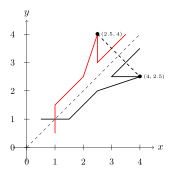
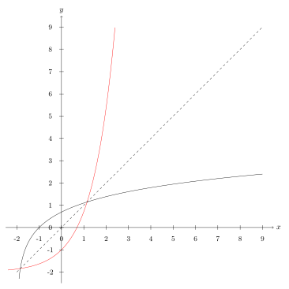

.. _s.meiraumfoll:

Meira um föll
=============

Andhverfur
----------
Þegar kemur að :hover:`andhverfum, andhverfa` falla er gott að geta hugsað myndrænt.

Skoðum fyrst fallið :math:`f: \mathbb{R}_+ \to \mathbb{R}_+, \quad  f(x)=x^2`.

Við vitum að andhverfa :math:`f(x)=x^2` er :math:`f^{-1}(x)=\sqrt{x}` vegna þess að:

.. math::
  \begin{aligned}
  &f(f^{-1}(x)) = (\sqrt{x})^2=x \\
  &\text{ og } \\
  &f^{-1}(f(x))=\sqrt{x^2} = x
  \end{aligned}

Ef við teiknum gröf fallanna fáum við:

.. image:: ./myndir/andhv_parabola.svg
    :width: 60%
    :align: center

Hér sjáum við að rauða grafið, :math:`\sqrt{x}`, er spegilmynd svarta grafsins, :math:`x^2`, um punktalínuna.

.. note::
  Graf andhverfu falls er spegilmynd grafs fallsins um línuna :math:`y=x`.

Skoðum næst :math:`y=2x+1` eða :math:`f(x)=2x+1`.
Reiknum andhverfuna:

.. math::
    \begin{aligned}
        y &= 2x+1 \\
        y-1&=2x\\
        \frac{1}{2}\left(y-1\right) &= x\\
        x &= \frac{1}{2} y - \frac{1}{2}
    \end{aligned}

þá er :math:`f^{-1}(x) = \frac{1}{2} x - \frac{1}{2}`.

Teiknum nú línurnar:

.. image:: ./myndir/anhv_lina.svg
    :width: 70%
    :align: center

Hér er rauða línan andhverfa :math:`f(x)`, við sjáum að línan speglast nákvæmlega um :math:`y=x` eins og í fyrra dæminu :math:`x^2`.

---------------------

Hægt er að sannfæra sig á þessu með því að horfa á einfaldan feril sem fer í gengum 6 þekkta punkta,

.. math::
  (0.5,1), (1.5,1), (2.5,2), (4,2.5), (3,2.5) \text{ og } (4,3.5)

Séu þessir punktar tengdir saman með strikum fæst svarti ferilinn sem við sjáum hér að neðan.
Rauði ferillinn myndast þegar við speglum svarta yfir :math:`y=x`.

Speglum punktinum :math:`(4, 2.5)` yfir :math:`y=x` , hann lendir í punktinum :math:`(2.5,4)` og strikið á milli þeirra er hornrétt á :math:`y=x`.



Við getum því speglað punktunum um línuna með því að víxla á :math:`x`- og :math:`y`-hnitum punktanna.
Andhverfi ferillinn fer því á milli punktana :math:`(1, 0.5), (1,1.5), (2,2.5), (2.5,4), (2.5,3)` og :math:`(3.5,4)`.

----------------

Skoðum að lokum :math:`g(x) = \ln(x+2)`.
Reiknum andhverfuna:

.. math::
    \begin{aligned}
        y &= \ln(x+2) \\
        e^y&=e^{\ln(x+2)} \\
        e^y &= x+2 \\
        x &= e^y -2\\
    \end{aligned}

Þá er andhverfa fallið :math:`g^{-1}(x) = e^x -2`.
Á þessari mynd má sjá gröf ferlanna, :math:`g(x)` er svart en :math:`g^{-1}(x)` rautt.




Eintæk og átæk föll
-------------------

Skoðum föll :math:`f: X \to Y`.

Mengið :math:`X` kallast :hover:`formengi` (eða skilgreiningarmengi) fallsins og mengið :math:`Y` :hover:`bakmengi` (eða myndmengi eða varpmengi) þess.

Í formengi falls :math:`y=f(x)` eru þær tölur sem við getum sett inn í fallið (:math:`x` -in) en í bakmenginu eru þær tölur sem geta komið út (:math:`y` -in).

Átæk föll
~~~~~~~~~

Látum :math:`f: X \to Y` vera fall.

Látum :math:`y_0 \in Y` vera stak í bakmenginu.
Oft þurfum við að vita hvort hægt sé að finna einhverja lausn á jöfnunni

.. math::
	f(x)=y_0,

það er að segja, hvort hægt sé að finna eitthvað :math:`x_0 \in X` þannig að :math:`f(x_0)=y_0`.
Ef þessi jafna hefur lausn fyrir öll stökin í bakmenginu þá segjum við að fallið sé :hover:`átækt, átækur`.

Skilgreining
~~~~~~~~~~~~
Fall :math:`f: X \to Y` er sagt vera átækt ef fyrir sérhvert :math:`y \in Y` er til :math:`x \in X` þannig að :math:`f(x)=y`.

--------------------------------------------------------

Skoðum mengjamyndir til að sjá þessa tegund af vörpun fyrir okkur.
Hér er :math:`X` skilgreiningarmengið og :math:`Y` myndmengið.

.. image:: ./myndir/foll/ataek.svg
	:width: 70%
	:align: center

Við sjáum að öll stökin í myndmenginu eru með í vörpuninni og hér er í lagi að fleiri en eitt stak í skilgreiningarmenginu varpast á sama stak í myndmenginu.

Hér er dæmi um vörpun sem er **ekki** átæk:

.. image:: ./myndir/foll/ekkiataek.svg
	:width: 70%
	:align: center

Hún er ekki átæk því hér eru tvö stök í myndmenginu sem eru ekki með í vörpuninni.

.. tip::
	**1.** Skoðum fallið :math:`f: \mathbb{R} \to \mathbb{R}`, :math:`f(x)=x^2`.

	 Tökum eftir að bakmengið er allt :math:`\mathbb{R}`, en :math:`x^2` verður aldrei neikvæð tala. Til dæmis er :math:`-1` stak í bakmenginu, en jafnan :math:`f(x)=-1`, eða :math:`x^2=-1` hefur enga lausn í rauntölunum. Fallið er því **ekki átækt**.

	**2.** Skoðum fallið :math:`g: \mathbb{R} \to \mathbb{R}_+`, :math:`g(x)=x^2`.

	 Hér er bakmengið mengi allra jákvæðra rauntalna. Fyrir sérhverja jákvæða rauntölu :math:`a` hefur jafnan :math:`x^2=a` lausn. Hún fæst með kvaðratrót. Fallið er því **átækt**.

	**3.** Skoðum fallið :math:`h: \mathbb{R} \to \mathbb{R}`, :math:`h(x)=0`.

	 Sérhvert stak varpast í stakið :math:`0` í bakmenginu. Til dæmis, fyrir stakið :math:`1` í bakmenginu þá er ekki til nein lausn á jöfnunni :math:`h(x)=1` þar sem það gefur :math:`0=1` sem er fráleitt. Svo fallið er **ekki átækt**.

Eintæk föll
~~~~~~~~~~~
Skoðum aftur jöfnuna

.. math::
	f(x)=y_0

Oft getur verið gagnlegt að vita hvort þessi jafna hafi margar lausnir.
Við segjum að fallið sé :hover:`eintækt, eintækur` ef þessi jafna hefur í mesta lagi eina lausn fyrir sérhvert stak í bakmenginu.
Fall er ekki eintækt ef fleiri en eitt stak í formenginu vísar á sama stakið í bakmenginu.

Skilgreining
~~~~~~~~~~~~
Fall :math:`f: X \to Y` er sagt vera *eintækt* ef fyrir sérhvert :math:`y \in Y` er til í mesta lagi eitt :math:`x \in X` þannig að :math:`f(x)=y`.

Það er, ef :math:`f(x_1)=f(x_2)` þá er :math:`x_1=x_2`.

--------------------------------------------------------------------------

Skoðum aftur mengjamyndir til að sjá þessa tegund af vörpun fyrir okkur.
Hér er :math:`X` skilgreiningarmengið og :math:`Y` myndmengið.

.. image:: ./myndir/foll/eintaek.svg
	:width: 70%
	:align: center

Við sjáum að hvert stak í skilgreiningarmenginu á sér stak í myndmenginu og það er í lagi að sum stök í myndmenginu séu ekki með í vörpuninni.

Hér er dæmi um vörpun sem er **ekki** eintæk:

.. image:: ./myndir/foll/ekkieintaek.svg
	:width: 70%
	:align: center

Hér varpast tvö stök í skilgreiningarmenginu á sama stak í myndmenginu.
*Takið eftir að þessi vörpun er hvorki eintæk né átæk.*

.. tip::
	**1.** Skoðum fallið :math:`f: \mathbb{R} \to \mathbb{R}`, :math:`f(x)=x^2`.

	 Þetta fall er **ekki eintækt**. Til dæmis gildir :math:`f(-2)=f(2)=4`, það er jafnan :math:`f(x)=4` hefur tvær lausnir.

	**2.** Skoðum fallið :math:`f: \mathbb{R}_+ \to \mathbb{R}`, :math:`f(x)=x^2`.

	 Þetta fall er **eintækt**, þar sem skilgreiningarmengið inniheldur bara jákvæðar tölur. Ef :math:`x_1` og :math:`x_2` eru ólíkar tölur í :math:`\mathbb{R}_+`, þá eru :math:`x_1^2` og :math:`x_2^2` ólíkar.

	**3.** Skoðum fallið :math:`g: \mathbb{R} \to \mathbb{R}`, :math:`g(x)=x`.

	 Þetta fall er **eintækt**. Ljóst er að ólík stök úr formenginu varpast í ólík stök í bakmenginu. Ef :math:`y_1 \not= y_2` þá gildir að :math:`g(y_1) \not= g(y_2)`.

Gagntæk föll
~~~~~~~~~~~~

Skilgreining
~~~~~~~~~~~~
Fall :math:`f: X \to Y` er sagt vera :hover:`gagntækt, gagntækur` ef það er bæði eintækt og átækt.

Regla
~~~~~
Fall á sér andhverfu þá og því aðeins að það sé gagntækt.

----------------------------------------------

Skoðum mengjamynd til að sjá þessa tegund af vörpun fyrir okkur:

.. image:: ./myndir/foll/gagntaek.svg
	:width: 70%
	:align: center

Við sjáum að öll stökin í myndmenginu eru með í vörpuninni þannig að vörpunin átæk.
Hvert stak í skilgreiningarmenginu varpast á nákvæmlega eitt stak í myndmenginu þannig að vörpunin er eintæk.
Fallið er því gagntækt þar sem það er bæði átækt og eintækt.

.. tip::
	Við höfum séð að fallið :math:`f: \mathbb{R} \to \mathbb{R}`, :math:`f(x)=x^2` er hvorki eintækt né átækt.
	Það á sér því ekki andhverfu.

	Skoðum til dæmis stakið :math:`9` í bakmenginu.
	Stökin í formenginu sem varpast í :math:`9` eru tvö, það er :math:`f(3)=9` og :math:`f(-3)=9`.
	Til þess að ,,fara til baka'' þá þyrftum við að úthluta :math:`9` stökunum :math:`3` og :math:`-3`, þ.e. stökunum :math:`\pm \sqrt{9}`.
	Andhverfan getur því ekki verið fall, því samkvæmt skilgreiningu á falli fær hvert stak í formenginu úthlutað *nákvæmlega einu* staki í bakmenginu, en í þessu tilfelli eru þau tvö.

Samskeyting falla
-----------------

Skilgreining
~~~~~~~~~~~~
Látum :math:`f: X \to Y` og :math:`g: Y \to Z` vera föll. Við skilgreinum þá vörpun :math:`g \circ f: X \to Z` með:

.. math::
	g \circ f(x)=g(f(x))

fyrir öll :math:`x \in X`. Þetta kallast :hover:`samskeytt fall`.

.. image:: ./myndir/foll/compvorpun.svg
	:width: 100%
	:align: center

.. note::
	Bakmengi :math:`f` og formengi :math:`g` þarf að vera það sama. Annars gengur skilgreiningin ekki upp.

.. tip::
	Látum :math:`f:\mathbb{R} \to \mathbb{R}` vera gefið með :math:`f(x)=x^2+x`
	og :math:`g:\mathbb{R} \to \mathbb{R}` vera gefið með :math:`g(x)=x+3`

	Finnum :math:`f\circ g` og :math:`g\circ f`. Höfum

	.. math::
		\begin{aligned}
		f\circ g(x) &=f(g(x))\\
		&=f(x+3)\\
		&=(x+3)^2+(x+3)\\
		&=x^2+6x+9+x+3\\
		&=x^2+7x+12
		\end{aligned}

	og

	.. math::
		\begin{aligned}
		g\circ f(x)&=g(f(x))\\
		&=g(x^2+x)\\
		&=(x^2+x)+3\\
		&=x^2+x+3
		\end{aligned}


Nokkur mikilvæg föll
--------------------

Vísisföll
~~~~~~~~~
:hover:`Vísisfall, veldisfall` er fall :math:`f : \mathbb{R} \to \mathbb{R}` sem skrifa má með formúlu af gerðinni

.. math::
	f(x)=a^x

þar sem :math:`a \geq 0` er rauntala.

Dæmi um vísisfall er :math:`f(x)=2^x`. Þá er :math:`f(1)=2`, :math:`f(2)=4` og :math:`f(3)=8` og :math:`f(4)=16` o.s.fr.v.

Graf þess má sjá hér að neðan.

.. image:: ./myndir/foll/visis.svg
	:align: center


Lograr
~~~~~~
Látum :math:`a` vera jákvæða rauntölu og :math:`f: \mathbb{R} \to \mathbb{R}_+` vera vísisfall gefið með

.. math::
	f(x)=a^x.

Þetta fall á sér andhverfu sem við köllum :math:`a`- :hover:`logrann, logri` og er táknaður

.. math::
	\log_a.

Samkvæmt skilgreiningu á andhverfu er því :math:`a`- :hover:`logrinn, logri`  fallið sem uppfyllir:

.. math::
	\log_a(a^x)=x \qquad \text{fyrir öll } x \in \mathbb{R},

og

.. math::
	a^{\log_a(x)}=x \qquad \text{fyrir öll } x \in \mathbb{R}_+.

.. note::
	Óformlega getum við hugsað um töluna :math:`\log_a(x)` þannig: "Í hvaða veldi þarf að setja :math:`a` svo að útkoman verði :math:`x`?"

.. tip::
	**1.** Reiknum :math:`\log_2(8)`. Í töluðu máli er spurningin þessi:

	 "Í hvaða veldi þarf að setja tvo svo að útkoman verði átta?"

	 Auðvelt er að reikna að :math:`2^3=8`, svarið er því :math:`3` og við skrifum
	 :math:`\log_2(8)=3`

	**2.** Reiknum :math:`\log_3(81)`.

	 Auðvelt er að staðfesta að :math:`3^4=81`, svo :math:`\log_3(81)=4`

	**3.** Reiknum :math:`\log_9(1)`.

	 Athugum að um sérhverja tölu :math:`a` gildir :math:`a^0=1`, sér í lagi er :math:`9^0=1` svo :math:`\log_9(1)=0`.

.. note::
  10 - logrinn er oft skrifaður :math:`\log(x)` frekar en :math:`\log_{10}(x)` .
  Þessi logri er mikið notaður og yfirleitt er sérstakur takki á reiknivélum til þess að reikna hann.

Lograreglur
```````````

Fyrir :math:`a,b,x,y\in \mathbb{R}_+` og :math:`r \in \mathbb{R}` gildir:

1. :math:`\qquad \log_a(1)=0`
2. :math:`\qquad \log_a(1/x)=-\log_a(x)`
3. :math:`\qquad \log_a(xy)=\log_a(x)+\log_a(y)`
4. :math:`\qquad \log_a(x/y)=\log_a(x)-\log_a(y)`
5. :math:`\qquad \log_a(x^r)=r\log_a(x)`
6. :math:`\qquad \log_a(x)=\dfrac{\log_b(x)}{\log_b(a)}`.


.. tip::
	**1.** Reiknum :math:`\log_5(50)+\log_5(\frac{1}{2})`.

	 Við notum reiknireglur tvö, þrjú, og fjögur:

	 .. math::
	 	\begin{aligned}\log_5(50)+\log_5(\frac{1}{2})&=\log_5(5^2\cdot 2)-\log_5(2)\\&=\log_5(5^2)+\log_5(2)-\log_5(2)\\&=\log_5(5^2)=2\end{aligned}


	**2.** Reiknum :math:`\log_2(49)\cdot \log_7(2)`

	 Notum reiknireglu sex:

	 .. math::
		 \begin{aligned}
		 		\log_2(49)\cdot \log_7(2)&=\dfrac{\log_7(49)}{\log_7(2)}\cdot \log_7(2)\\
				&=\log_7(49)\\
				&=\log_7(7^2)=2
			\end{aligned}

	**3.** Reiknum :math:`(\log_{12}(1))^{12}`

	 Notum reiknireglu eitt:

	 .. math::
	 	(\log_{12}(1))^{12}=0^{12}=0

	**4.** Reiknum :math:`\log_7(22)`

	 Notum reiknireglu sex og setjum :math:`b=10`, stingum stærðinni :math:`\log(22)/\log(7)` inn í vasareikninn og fáum

   .. math::
     \log_7(22)=\frac{\log(22)}{\log(7)}\approx 0,629532003

Náttúrulega veldisvísisfallið og nátturulegi logrinn
~~~~~~~~~~~~~~~~~~~~~~~~~~~~~~~~~~~~~~~~~~~~~~~~~~~~

Náttúrulega veldisvísisfallið er skilgreint sem

.. math::
	f(x) = e^x,

þar sem :math:`e \approx 2.71828182846...` er óræð tala.

Skoðum graf fallsins

.. image:: ./myndir/foll/e.svg
	:width: 70%
	:align: center

Þá er andhverfa :math:`f(x) = e^x` skilgreind sem :math:`f^{-1}(x) = \log_e (x)` og yfirleitt skrifað

.. math::
	f^{-1}(x) = \ln(x).

Fallið :math:`\ln(x)` er kallað :hover:`náttúrulegi logrinn` .
Skoðum graf hans:


Sjáum hér að :math:`\ln(x)` er :math:`e^x` speglað um :math:`y=x`.

.. image:: ./myndir/foll/lnoge.svg
	:width: 70%
	:align: center

Sömu reglur gilda um náttúrulega logrann og um aðra logra.

Lograreglur
```````````

Fyrir :math:`x,y\in \mathbb{R}_+` og :math:`r \in \mathbb{R}` gildir:

1. :math:`\qquad \ln(1)=0`
2. :math:`\qquad \ln(xy)=\ln(x)+\ln(y)`
3. :math:`\qquad \ln(x/y)=\ln(x)-\ln(y)`
4. :math:`\qquad \ln(x^r)=r\ln(x)`


Ræð föll
~~~~~~~~

Ef :math:`r` er fall sem tákna má með formúlu af gerðinni

.. math::
	r(x)=\dfrac{a_nx^n+a_{n-1}x^{n-1}+...+a_1x+a_0}{b_mx^m+b_{m-1}x^{n-1}+...+b_1x+b_0}

þá segjum við að :math:`r` sé :hover:`rætt fall`.
Í þessari formúlu er :math:`n,m\in\mathbb{N}`, :hover:`stuðlarnir, stuðull` :math:`a_i` og :math:`b_i` eru rauntölur fyrir öll :math:`i` og fremstu stuðlarnir mega ekki vera :math:`0`, það er :math:`a_n,b_m\not=0`.

Þetta er bara önnur leið til að segja að fallið :math:`r` kallist rætt fall ef til eru margliður :math:`p` og :math:`q` þannig að :math:`r=\frac{p}{q}`.

Myndrænt
````````
Skoðum einföld ræð föll á forminu:

.. math::
	\frac{ax+b}{cx+d}

Ef stuðlarnir :math:`a,b,c, \; \text{og} \; d` eru þekktir er fljótlegt að finna :hover:`aðfellur, aðfella` fallsins til þess að teikna grafið.

**Lóðfellan** verður í gegnum punktinn á :math:`x` - ásnum sem er ekki í skilgreiningarmenginu, það er að segja þar sem deilt væri með núlli.
Lóðfella ræðs falls á þessu formi er því línan

.. math::
	x=\frac{-d}{c}

**Láfellan** verður í gegnum punktinn á :math:`y` - ásnum sem er ekki í myndmenginu, það er að segja gildið sem fallið getur aldrei tekið.
Láfella ræðs falls á þessu formi er því línan

.. math::
	y=\frac{a}{c}


.. tip::
	Skoðum ræða fallið

	.. math::
		f(x) = \frac{x-2}{x+3}

	Hér er :math:`a= 1, \; b =-2, \; c = 1` og :math:`d = 3`.

	Þá eru aðfellurnar:

	.. math::
		\begin{aligned}
		& x = \frac{-d}{c} \; = \; \frac{-3}{1} \; = \; -3 \\
		& \quad \\
		& y = \frac{a}{c} \; = \; \frac{1}{1} \; = \; 1 \\
		\end{aligned}

	Nú er lítið mál að sjá fyrir sér fallið:

	.. image:: ./myndir/foll/adfellur.svg
		:width: 100%
		:align: center


Stofnbrotaliðun
~~~~~~~~~~~~~~~
Þegar við erum að vinna með ræð föll getur verið þægilegra að liða þau niður áður en unnið er með þau.
Þegar margliðan í teljaranum hefur stigið 1 og margliðan í nefnaranum hefur stigið 2 er hægt að gera það svona:

.. math::
	\begin{aligned}
	\frac{ax+b}{(x-\alpha)(x-\beta)} &= \frac{A}{(x-\alpha)}+ \frac{B}{(x-\beta)} \\
	\quad \\
	&\text{þar sem} \\ \quad \\
	\alpha \neq \beta, \quad A= \frac{a\alpha + b}{\alpha - \beta} & \quad \text{og} \quad B= \frac{a\beta + b}{\beta - \alpha} \\
	\end{aligned}

.. tip::
  Liðum

  .. math::
    \frac{3x+2}{x^2+3x-4}

  í stofnbrot.

  *Lausn:*

  Þáttum nefnarann :math:`x^2+3x-4` og fáum :math:`(x+4)(x-1)`.
  Hér er :math:`a=3`, :math:`b=2`, :math:`\alpha = -4`  og :math:`\beta=1`.

  Reiknum fastana :math:`A` og :math:`B` :

  .. math::
    \begin{aligned}
      A& = \frac{a\alpha+b}{\alpha-\beta} \\
      &= \frac{3\cdot(-4)+2}{-4-1} =\frac{-12+2}{-5} \\
      A&=2 \\
      B&= \frac{a\beta +b}{\beta-\alpha} \\
      &= \frac{3+2}{1+4} =\frac{5}{5} \\
      B&=1
    \end{aligned}

  Því er hægt að skrifa:

  .. math::
    \frac{3x+2}{x^2+3x-4} = \frac{2}{x+4} + \frac{1}{x-1}

  Athugum hvort þetta sé rétt með því að leggja brotin saman:

  .. math::
    \begin{aligned}
      \frac{2}{x+4} + \frac{1}{x-1} &= \frac{2(x-1)}{(x+4)(x-1)}+\frac{1(x+4)}{(x-1)(x+4)} \\
      &=\frac{2x-2+x+4}{(x+4)(x-1)} \\
      &=\frac{3x+2}{x^2+3x-4}
    \end{aligned}

Látum :math:`p` og :math:`q` vera margliður og látum :math:`r=\frac{p}{q}` vera rætt fall. Ef margliðurnar :math:`p` og :math:`q` eru af háum stigum getur ræða fallið :math:`r` oft verið erfitt viðureignar. Þá er gagnlegt að geta skrifað :math:`r` sem summu af einfaldari ræðum föllum. Eftirfarandi regla getur þá stundum verið gagnleg:

Regla
`````

Látum :math:`p` og :math:`q` vera margliður af stigi :math:`n` og :math:`m`.

Gerum ráð fyrir að margliðan :math:`q` hafi :math:`m` ólíkar rætur :math:`a_1,a_2,...,a_m`.

Þá er til margliða :math:`s` og fastar :math:`b_1,b_2,...,b_m` þannig að

.. math::
	\frac{p(x)}{q(x)}=s(x)+\frac{b_1}{x-a_1}+\frac{b_2}{x-a_2}+...+\frac{b_m}{x-a_m}.


Þegar þessari reglu er beitt þá segjumst við vera að *stofnbrotaliða* ræða fallið :math:`\frac{p}{q}`.

--------------

Stofnbrotaliðum ræða fallið :math:`\frac{p}{q}` þar sem :math:`p` og :math:`q` eru margliður og

.. math::
	q(x)=c_mx^m+...+c_1x+c_0

er af stigi :math:`m`.

1. Finnum allar núllstöðvar margliðunnar :math:`q`. Ef margliðan hefur færri en :math:`m` núllstöðvar hættum við hér, því þá virkar þessi aðferð ekki. Ef :math:`m` ólíkar núllstöðvar finnast köllum við þær :math:`a_1,a_2,...,a_m`.

2. Deilum margliðunni :math:`q` upp í margliðuna :math:`p` með afgangi til þess að finna margliður :math:`s` og :math:`p_1` sem eru þannig að stig :math:`p_1` er minna en stig :math:`q` og :math:`p=sq+p_1`. Þá má skrifa:

.. math::
 	\frac{p(x)}{q(x)}=s(x)+\frac{p_1(x)}{q(x)}

3. Skilgreinum nýja margliðu :math:`q'` með því að setja

.. math::
 	q'(x)=mc_mx^{m-1}+(m-1)c_{m-1}x^{m-2}+...+2\cdot c_2x+1\cdot c_1

4. Reiknum út stuðlana :math:`b_1,b_2,...,b_m` með formúlunni

.. math::
	b_i=\frac{p_1(a_i)}{q'(a_i)} \qquad \text{fyrir öll i}

5. Nú má skrifa

.. math::
	\frac{p(x)}{q(x)}=s(x)+\frac{b_1}{x-a_1}+\frac{b_2}{x-a_2}+...+\frac{b_m}{x-a_m}

.. note::
	Þeir sem eru komnir aðeins lengra í stærðfræði og þekkja diffrun munu taka eftir að í aðferðinni að ofan þá er nýja margliðan :math:`q'` afleiðan af margliðunni :math:`q`.


.. tip::
	Stofnbrotaliðið ræða fallið

	.. math::
		\frac{x^4-2}{x^3+2x^2-x-2}.

	Hér er :math:`p(x)=x^4-2` og :math:`q(x)=x^3+2x^2-x-2`.

	1. Finnum núllstöðvar :math:`q`. :math:`p/q`-aðferðin sem lýst var í fyrri kafla segir okkur að við eigum að prófa hvort tölurnar :math:`-1,1,-2` eða :math:`2` séu núllstöðvar margliðunnar :math:`q`:

	 .. math::
	 	q(-1)=0, \qquad q(1)=0, \qquad q(-2)=0, \qquad q(2)=12.

	 Hér fundum við þrjár mismunandi núllstöðvar, :math:`q` hefur stig :math:`3` svo við getum haldið áfram. Við setjum :math:`a_1=-1, \; a_2=1 \; \text{og} \; a_3=-2`.

	2. Deilum :math:`q` uppí :math:`p` með afgangi:

	 .. image:: ./myndir/foll/rflongdiv.svg
	 	:align: center
		:width: 80%

	 Samkvæmt þessu getum við skrifað

	 .. math::
	 	p(x)=(x-2)q(x)+(5x^2-6)

	 Við setjum :math:`p_1(x)=5x^2-6` og :math:`s(x)=x-2`.

	3. Skilgreinum margliðuna

	 .. math::
	 	q'(x)=3x^{3-1}+2\cdot 2x^{2-1} - 1x^{1-1}=3x^2+4x-1

	4. Reiknum út:

	 .. math::
	 	\begin{aligned}
	 	b_1&=\frac{p_1(a_1)}{q'(a_1)}\\&=\frac{p_1(-1)}{q'(-1)}\\&=\frac{5\cdot(-1)^2-6}{3\cdot(-1)^2+4\cdot(-1)-1}\\&=\frac{-1}{-2}\\&=\frac{1}{2}\\b_2&=\frac{p_1(a_2)}{q'(a_2)}\\&=\frac{-1}{6}\\b_3&=\frac{p_1(a_3)}{q'(a_3)}\\&=\frac{14}{3}\end{aligned}

	 Þá er :math:`b_1 =\frac{1}{2}, \; b_2 =\frac{-1}{6} \; \text{og} \; b_3=\frac{14}{3}`.

	5. Lausnin okkar er þess vegna:

	 .. math::
	 	\begin{aligned}
	 	\frac{x^4-2}{x^3+2x^2-x-2}&=x-2+\frac{1/2}{x+1}+\frac{-1/6}{x-1}+\frac{14/3}{x+2} \\
		&=x-2+\frac{1}{2(x+1)}-\frac{1}{6(x-1)}+\frac{14}{3(x+2)}.\\
		\end{aligned}


Ummyndanir
----------
Það er mjög mikilvægt að geta teiknað föll og séð þau fyrir sér, meðal annars að geta séð fyrir sér :hover:`ummyndanir, ummyndun`.

Hliðrun
~~~~~~~

Færsla punktsins :math:`(x,y)` yfir á punktinn :math:`(x+a,y+b)` kalllast :hover:`hliðrun` um vigurinn :math:`\begin{pmatrix} a \\ b \end{pmatrix}`.

Hliðrunarvigurinn :math:`\begin{pmatrix} a \\ b \end{pmatrix}` færir feril fallsins :math:`f(x)` yfir í feril fallsins

.. math::
    g(x) =f(x-a)+b.

.. tip::
  Hliðrum :math:`f(x) = x^2` um :math:`\begin{pmatrix} 2 \\ 1 \end{pmatrix}`

  Þessi hliðrun þýðir að hver punktur ferilsins færist um :math:`2` til hægri á :math:`x`-ásnum og :math:`1` upp á :math:`y`-ásnum. Þá er nýja hliðraða fallið:

  .. math::
      \begin{aligned}
       g(x) &= f(x-a)+b, \\
       &= f(x-2)+1, \\
       &= (x-2)^2 +1.
      \end{aligned}

  .. image:: ./myndir/hlidrun1.svg
    :width: 70%
    :align: center

  Sjáum :math:`g(x)= (x-2)^2 +1` er í rauðu og hefur hliðrast upp til hægri.
  Punkturinn :math:`(-2,4)` færist í :math:`(-2+2,4+1)=(0,5)`.


.. tip::
  Hliðrum :math:`f(x) = \sin(x)` um :math:`\begin{pmatrix} -\frac{\pi}{2} \\ 0 \end{pmatrix}`. Fáum

  .. math::
      \begin{aligned}
       g(x) &= f(x-a)+b, \\
       &= f(x-(-\frac{\pi}{2}))+0, \\
       &= \sin(x+\frac{\pi}{2}), \\
       &= \cos(x).
      \end{aligned}

  .. image:: ./myndir/hlidrun2.svg
      :width: 100%
      :align: center

  Hér erum við búin að hliðra sínus um :math:`\frac{\pi}{2}` eftir :math:`x`-ás og þá fáum við kósínus! Sjá kafla 7 um :ref:`hornaföll<s.hornaföll>`.

Speglun
~~~~~~~

**Speglun um** :math:`x` **-ás**

Þegar falli :math:`f(x)` er speglað um :math:`x`-ás fæst fallið :math:`g(x) = -f(x)`. Tökum sem dæmi :math:`f(x)=x^2`, þá er speglunin :math:`g(x) = -f(x) = -x^2`.

.. image:: ./myndir/speglunx.svg
    :width: 50%
    :align: center


**Speglun um** :math:`y` **-ás**


Þegar falli :math:`f(x)` er speglað um :math:`y`-ás fæst fallið :math:`h(x) = f(-x)`.
Tökum sem dæmi :math:`f(x)=\frac{x-2}{x+3}+2`, þá er speglunin :math:`h(x) = f(-x) = \frac{(-x)-2}{(-x)+3}+2`.

.. image:: ./myndir/spegluny.svg
    :width: 50%
    :align: center

Hér sjáum við líka lóðfellurnar sem speglast um :math:`y`-ás.

Stríkkun
~~~~~~~~

Lóðrétt
```````
Við getum ummyndað fall :math:`f(x)` með því að margfalda það með jákvæðum fasta og þá kallast það stríkkun. Tökum sem dæmi :math:`a \cdot f(x)`.

* Ef :math:`0<a<1` þá köllum við stríkkuninna herpingu.
* Ef :math:`1<a` þá er það stríkkun.

Skoðum áhrifin á fleyboga:

.. image:: ./myndir/strikkun.svg
    :width: 100%
    :align: center

Lárétt
``````
Við getum líka ummyndað fall :math:`f(x)` lárétt með því að margfalda það með jákvæðum fasta :math:`f(a\cdot x)`.

* Ef :math:`0<a<1` þá erum við að tala um herpingu.
* Ef :math:`1<a` þá er það stríkkun.

.. note::
	Takið eftir að ummyndanir eru varpanir af vörpunum, þ.e.a.s. **samskeyting falla**. Til dæmis ef við viljum hliðra fallinu :math:`f(x) = x^2` upp um :math:`2` og stríkkum um helming þá er
