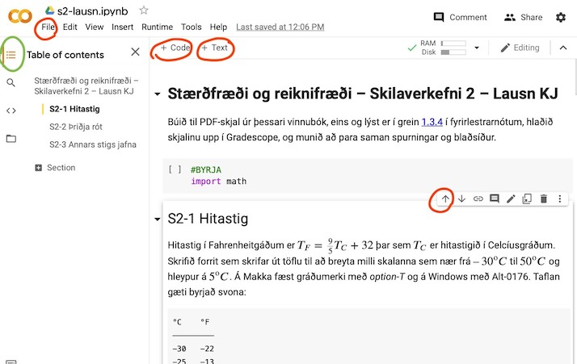

.. include:: rst-include

.. _jupyter-og-colab:             

Umhverfi fyrir Python: Jupyter og Colab
=======================================
Árið 2014 var byrjað á verkefni sem nefnist `Jupyter <https://jupyter.org>`_ (sbr. `Wikipediu <https://en.wikipedia.org/wiki/Project_Jupyter>`_) sem snýst um að búa til umhverfi þar sem blanda má saman lýsingu verkefna, stærðfræðiformúlum, forritum, og úttaki forrita í sama skjali eða vinnubók. Upphaflega var hægt að nota eitt af þremur forritunarmálum, Julia, Python og R, og af þeim er nafnið dregið, en síðan hafa bæst við fleiri mál. Hægt er að nota Jupyter vinnubækur á eigin tölvu, t.d. með því að setja upp hugbúnað sem nefnist *JupyterLab*, en það er líka hægt að búa þær til í vafra í kerfinu *Google Colaboratory* (oft stytt í Colab) sem keyrir `í skýinu <https://colab.research.google.com>`_. Þessar fyrirlestrarnótur miðast við að Jupyter-vinnubækur séu notaðar.

.. _colab:

Notkun Google Colab
-------------------
Google Colabatory er þjónusta hjá Google til að búa til og vinna með Jupyter
vinnubækur. Vinnubækurnar eru geymdar á Google Drive svæði notanda, og forritin
í þeim eru keyrð á sérstakri gervitölvu (*virtual machine*) sem Google leggur
til. Skrár sem sem forritin þurfa eða búa til eru geymdar á tímabundnu disksvæði
á þesari gervitölvu. Python-þýðandinn er nýlegur (nánar
tiltekið útgáfa 3.8.16 í janúar 2023), helstu pakkar eru þegar uppsettir (m.a. þeir
sem nefndir eru í kafla :numref:`pakkar`), og auðvelt er að bæta við pökkum
eftir þörf.

Til að byrja á vinnubók á Colab þarf fyrst að stofna reikning hjá Google. Síðan má heimsækja `colab.research.google.com <https://colab.research.google.com>`_ og velja *File–New notebook*. Í reitinn sem birtist má slá inn Python-forrit, og svo má keyra forritið með því að smella á þríhyrningstáknið á vinstri brún reitsins eða með því að slá á ctrl/enter. Hægt er að bæta við textareitum og forritsreitum, vista vinnubókina, prenta hana o.s.frv. og eru helstu slíkar skipanir sýndar hér að neðan í kafla :numref:`jupyter-skipanir`.

.. admonition:: Æfing: Google Colab prófun
   :class: aefing
   
   1. Farið inn á Google Colab, afritið forritið :numref:`Collatz` (þ.e. Collatz)
      inn í keyrslureitinn og prófið að keyra hann.

   2. Bætið við textareit ofan við keyrslureitinn (ef smellt er á **+ Text** kemur
      textareitur fyrir neðan, sem hægt er að færa upp með því að smella á
      **upp-örina** efst til hægri (**↑**). Setjið titil og smá skýringartexta inn í
      reitinn með því slá inn:

      .. code-block:: text

          # Forrit sem reiknar Collatz-runur
      
          $n_{k+1} = 3n_k + 1$ ef $n$ er oddatala 
          $n_{k+1} = \dfrac{n_k}{2}$ ef $n$ er slétt tala
      
          Ef nýja talan $n_{k+1} = 1$ þá er hætt að reikna.
          ***

   3. Búið til nýjan forritsreit neðst (með **+ Code**) og setjið þar eftirfarandi
      skipanir:

      .. code:: python3

         n0 = int(input("Sláið inn tölu til að byrja Collatz runu"))
         collatz_runa(n0)

      Keyrið reitinn og sláið inn 27 (sem gefur langa röð) og aðrar tölur ef vill.

   4. Búið til nýjan forritsreit og sláið inn:

      .. code:: python3

         tala = 3.4
         viðbót = 5.6
         útkoma = tala + viðbót

      Smellið svo á táknið :code:`{x}` á vinstri spássíu og skoðið innihaldið í
      breytunum með því að láta bendilinn svífa yfir nöfnunum sem birtast.

   5. Búið til PDF-skjal úr vinnubókinni með því að velja **File**–*Print* og
      síðan *PDF–Save as PDF* eða *Microsoft Print to PDF* eða (*More settings*)–*PDF–Open in
      Preview* (eftir vafra/tölvu). Takið eftir að lárétta línan sem fæst með
      :code:`***` hjálpar til við að aðskilja textareitinn og forritsreitinn.
      

   Google Colab viðmótið.

   Hér hefur verið smellt á hnappinn í græna juhringnum til að fá efnisyfirlit.
   Aðrir hnappar sem nefndir eru í æfingunni að framan eru sýndir með rauðum hring.

      .. _anaconda-uppsetning:
   
Uppsetning JupyterLab á eigin tölvu
-----------------------------------
**Anaconda.** Auðveldasta leiðin til að setja upp bæði Python og Jupyter á eigin tölvu er að
nota hugbúnaðarpakka sem nefnist Anaconda (sem er stærsta kyrkislanga í heimi, sbr. að Python
er líka svoleiðis slanga). Til að flýta fyrir uppsetningu er hægt að nota minni útgáfu
af Anaconda sem kallast Miniconda og leiðbeiningarnar hér miðast við hana. Anaconda með öllu
inniheldur u.þ.b. 1500 pakka og það tekur tíma að ná í þá alla og setja upp.

.. figure:: myndir/anaconda.jpg
   :align: center
   :figwidth: 10cm

   Græn anaconda slanga
       
**Uppsetning Miniconda með nýjasta Python** Heimsækið `docs.conda.io/en/latest/miniconda
<http://docs.conda.io/en/latest/miniconda>`_, hlaðið niður uppsetningarforriti fyrir
ykkar stýrikerfi úr efstu töflunni (*Latest Miniconda Installer Links*) og keyrið það.
Á Windows-tölvum er næst farið í *Start Menu* (neðst til vinstri) og valið *Anaconda
Powershell Prompt*, en á Mökkum og Linux-tölvum skal opna *Terminal*. Þar er gefin
skipunin:

.. code:: text

   conda install scipy matplotlib pandas jupyterlab

(hún tekur nokkra stund að klárast)

**Keyrsla JupyterLab.** Eftir uppsetningu Miniconda/Anaconda má keyra JupyterLab
með því að opna *terminal*-glugga og gefa þar einhverja eftirfarandi skipana:

.. code::

   jupyter-lab
   jupyter lab
   jupyter-lab skrá.ipynb

Þá opnast JupyterLab í glugga í aðalvafra tölvunnar með möppuna sem byrjað var í
sjálfgefna. Síðasttalda skipunin opnar sjálfkrafa eldri vinnubók :code:`skrá.ipynb`.
JupyterLab-glugginn lítur nokkurnveginn svona út:

.. figure:: _images/jupyterlab.jpeg
   :align: center

   Upphafsgluggi JupyterLab

Hér eru tvær undirmöppur og fjórar skrár: tvær vinnubækur eða Jupyter-bækur
(auðkenndar með .ipynb, en Jupyter hét áður IPython), eitt Python-forrit
(auðkennt með .py) og ein pdf-skrá. Til að búa til nýja vinnubók er smellt á
efri *Python 3*-hnappinn, og þá opnast bókin í nýjum flipa í vafranum. Hún
heitir sjálfkrafa *Untitled2* en með því að hægri-smella á nafnið (eða smella á
*File*) og velja *Rename notebook* má skíra hana einhverju skynsemlegra nafni.
Eldri bók er opnuð annaðhvort með því að smella á hana í skráalistanum vinstra
megin eða tilgreina hana á skipanalínunni eins og sýnt er að ofan.

.. figure:: _images/jupyterlab-s2.jpg
   :align: center

   JupyterLab með opinni vinnubók og aflúsunarhnappi (í rauðum hring)

**Aflúsun í JupyterLab** Einn kostur við JupyterLab umfram Google Colab er að það er hægt að
setja bremsur sem stoppa keyrslu í miðju kafi, og þegar forritið hefur stöðvast má
skoða gildi á breytum áður en forritið er sett aftur af stað. Til að virkja aflúsnarham
er smellt á mynd af pöddu sem er efst hægra megin í forritsglugganum (sjá mynd), og bremsa er
virkjuð með því að smella vinstra megin við línunúmer í forritinu (þar kemur rauður hringur).

Vinnubækur
----------
Eins og fram kom í æfingunni í kafla :numref:`colab` innihalda vinnubækur **reiti** (*cells*) af tvennu tagi, **forritsreiti** (*code*), og **textareiti** (*markdown*). Í þeim fyrrnefndu eru Python-forrit eða forritsbútar, en í hinum eru fyrirsagnir og skýringartextar sniðnir með umbrotsmálinu (*markup language*) *Markdown*. Í textareitina er líka hægt að setja stærðfræðiformúlur sniðnar með formúlumálinu *LaTeX* og jafnvel myndir ef vill. Forritsbútana er hægt að keyra og fer úttak keyrslu inn í bókina, neðst í viðkomandi forritsreit. Segðin sem er neðst í hverjum reit skrifast sjálfkrafa út, en nota þarf print-fallið til að skrifa út niðurstöður framar í reitnum.

Það er sæmilega auðvelt að læra á notkun hvort sem er Colab eða JupyterLab með því að prófa sig áfram, en líka getur verið gagnlegt að skoða leiðbeiningar á netinu, sbr grein :numref:`jupyter-leiðbein-á-netinu`. Mikilvægustu skipanir beggja labbanna fylgja svo hér í næsta kafla.

.. admonition:: Æfing: JupyterLab
   :class: aefing
   
   a. Setjið upp JupyterLab á eigin tölvu
   b. Endurtakið æfinguna í kafla :numref:`notkun google colab`.
   c. Prófið aflúsun.
   d. Prófið einhverjar af skipununum úr næsta kafla.

.. _jupyter-skipanir:

Colab og JupyterLab skipanir
----------------------------

.. list-table:: Skráaskipanir
   :widths: 25 25 50
   :name: jupyterskráaskipanir
   :header-rows: 1

   * - Aðgerð
     - Colab skipun
     - JupyterLab skipun
       
   * - Skipta um nafn á vinnubók
     - Smella á nafnið efst t.v. 
     - Hægri-smella á nafnið efst t.v. |br|
       og velja *Rename-Notebook* |br|
       File→Rename-Notebook

   * - Ná í eintak á eigin tölvu
     - File→Download
     - (þarf ekki)
       
   * - Vista undir nýju nafni
     - File→Save-a-copy-in-Drive og |br|
       endurnefna afritið
     - File→Save-Notebook-As

   * - Vista
     - File→Save |br|
       ctrl/s (⌘s á Mac)
     - File→Save-Notebeook |br|
       ctrl/s (⌘s á Mac) |br|
       smellt á diskling

   * - Vista sem PDF
     - File→Print→Save-as-PDF
     - File→Export notebook as→HTML, |br|
       opna HTML-skjal og velja |br|
       File→Print þar.  

.. list-table:: Keyrsluskipanir
   :widths: auto
   :name: jupyterkeyrsluskipanir            
   :header-rows: 1

   * - Aðgerð
     - Colab skipun
     - JupyterLab skipun
       
   * - Keyra forritsreit
     - ctrl/enter |br|
       smella á "play"
     - ctrl/enter |br|
       smella á "play"

   * - Keyra forritsreit og fara í næsta reit
     - shift/enter
     - shift/enter
       
   * - Stoppa keyrslu
     - ctrl/m i |br|
       smella á "stop" |br|
       Runtime→Interrupt-execution
     - esc i i |br|
       smella á "stop" |br|
       Kernel→Interrupt-kernel

   * - Núllstilla Python
     - ctrl/m . |br|
       Runtime→Restart-runtime
     - esc 0 0 |br|
       Kernel→Restart-kernel

.. list-table:: Reitaskipanir
   :widths: auto
   :name: reitaskipanir            
   :header-rows: 1

   * - Aðgerð
     - Colab skipun
     - JupyterLab skipun
       
   * - Setja inn forritsreit |br|
       neðan við virkan reit
     - smella á **+ Code** |br|
       esc b
     - smella á **+** |br|
       esc b

   * - Setja inn textareit |br|
       neðan við virkan reit
     - smella á **+ Text** |br|
       esc b ctrl/m m
     - smella á **+** og svo Code |br|
       → Markdown |br|
       esc b esc m

   * - Færa reit
     - smella á upp-ör/niður-ör efst t.h.
     - beita "Drag-and-drop" á reit

   * - Kljúfa reit
     - ctrl/m – |br|
     - ctrl/shift/– |br|
       Edit→Split-cell

   * - Sameina reiti
     - mála reiti → hægri smella |br|
       → Merge-selected-cells
     - mála reiti → Edit |br|
       → Merge-Selected-Cells

   * - Eyða reit
     - ctrl/m d |br|
       hægri-smella → Delete cell 
     - esc d d |br|
       hægri-smella → Delete cells

   * - Sýna textareit sem *markdown* |br|
       (til að breyta)
     - tvísmella á reit |br|
       velja reit og slá á Enter
     - tvísmella á reit |br|
       velja reit og slá á Enter

   * - Sníða textareit
     - Velja einhvern annan reit
     - ctrl/enter |br|
       smella á "play"

   * - Afturkalla ("undo") reitaskipun
     - Edit→Undo ... |br|
       ctrl/m z
     - Edit→Undo-Cell-Operation |br|
       esc z

   * - Endurtaka ("redo") reitaskipun
     - Edit→Redo ...
     - Edit→Redo-Cell-Operation

.. list-table:: Ritilskipanir
   :widths: auto
   :name: vinnubokarritilskipanir
   :header-rows: 1

   * - Aðgerð
     - Colab/JupyterLab skipun
       
   * - Færa bendil
     - örvar |br|
       Home, End (Fn/←, Fn/→ á Mac) |br|
       PgUp, PgDn (Fn/↑, Fn/↓)
   * - Eyða
     - Backspace, Del (Fn/Bcksp)
   * - Velja, klippa, afrita, líma
     - mála með mús |br|
       shift/örvar |br|
       ctrl/xcv (⌘/xcv á Mac)     - 
   * - Velja allt í reit
     - ctrl/a (⌘/a)
   * - Flytja til hægri, vinstri |br|
       (indent, unindent)
     - tab, shift/tab
   * - Afturkalla ("undo")
     - ctrl/z (⌘/z)
   * - Endurtaka ("redo")
     - ctrl/shift/z (⌘/shift/z)
       
Vistun vinnubóka á PDF-sniði
----------------------------
**Colab.** Veljið *File → Print*, eða sláið á ctrl/p eða ⌘/p (Mac), og svo
*Destination → Save-as-PDF* (*PDF → Save-as-PDF* á Mac). Þá birtist gluggi þar
sem velja má möppu og nafn fyrir PDF-skjalið.

.. admonition:: Aðvörun:
   :class: advorun
   
   Í Safari virðist stundum þurfa að velja *File → Print* í vafranum en ekki í
   Colab-flipanum, en í Chrome virðist ekki skipta máli hvoru megin *File → Print*
   er valið.

**JupyterLab.** Í JupyterLab er lús þannig að með *File → Print* vistast stærðfræðiformúlur ekki rétt. Það þarf að fara krókaleið og velja fyrst *File → Export notebook as → HTML* og svo þarf að opna HTML-skjalið sem verður til og vista það í PDF með *File → Print*.

Markdown og Latex
-----------------

Finna má ýmsar leiðbeiningar um *Markdown*-málið á netinu, sbr. grein
:numref:`jupyter-leiðbein-á-netinu`. Þar er útskýrt hvernig búa má til
fyrirsagnir (með #, ##, ###), skáletra og feitletra (með \*texti\* og
\*\*texti\*\*), búa til lista, setja inn myndir (sem getur reyndar verið
dálítið stúss), láréttar línur, stærðfræðiformúlur og ýmislegt fleira.

Texti sem er inndreginn um a.m.k. fjögur bil birtist óbreyttur með
jafnbilaletri (*monospaced font*).

.. sidebar:: Dæmi um töflu
   
   .. figure:: myndir/töfludæmi.png
      :align: center
      :width: 5cm

Til að búa til töflu má nota lóðrétt strik til að afmarka dálka og : til að tilgreina
vinstri/hægri jöfnun eða miðjun. Hér er einfalt dæmi:

.. code-block:: text
          
   nr |nafn    |aldur
   ---|:------:|----:
   1  |Ari     | 9
   2  |Bryndís | 11
   ...
   105|Örn     |8
   
Stærðfræðiformúlur eru með LaTeX-sniði og settar inn með $ *formúla* $ eða

   | \$\$
   | *formúla*
   | \$\$

LaTeX getur búið til gríska stafi og allskyns stærðfræðitákn, það setur
sjálfkrafa skáletur á breytur og hæfileg bil á milli einstakra hluta í formúlum.
`Wikibókin um LaTeX-stærðfræði
<https://en.wikibooks.org/wiki/LaTeX/Mathematics>`_ er sæmilega ítarleg, og svo
má finna fjölmarga styttri hjálpartexta, t.d. `þennan
<https://davidhamann.de/2017/06/12/latex-cheat-sheet>`_ eftir David Chapman.
Fallegasti stærðfræðitextinn fæst með því að setja dollaramerki utan um alla
stærðfræði, hvort sem það eru flóknar formúlur eða bara ":math:`x=3`" og
":math:`a` og :math:`b` eru vigrar" (sem sé :code:`$x=3$` og :code:`$a$ og $b$
eru vigrar`) en ekki "x=3" og "a og b eru vigrar".

.. _jupyter-leiðbein-á-netinu:

Colab- og JupyterLab-leiðbeiningar á netinu
-------------------------------------------

Hægt er að finna ýmsar vefsíður með leiðbeiningum um Google Colab og JupyterLab, t.d.:

    - `Google Colab yfirlit <https://colab.research.google.com/notebooks/basic_features_overview.ipynb>`_
    - `Markdown fyrir Colab <https://colab.research.google.com/notebooks/markdown_guide.ipynb>`_
    - `Nokkuð ítarlegar Colab leiðbeiningar hjá Tutorialspoint <https://www.tutorialspoint.com/google_colab/google_colab_quick_guide.htm>`_
    - `Stuttar JupiterLab leiðbeiningar <https://www.rpgroup.caltech.edu/ncbs_pboc/code/t0b_jupyter_notebooks.html>`_
    - `Working efficiently with JupyterLab Notebooks <https://florianwilhelm.info/2018/11/working_efficiently_with_jupyter_lab>`_

(fyrstu tvær eru frá Google sjálfum).
      
.. _jupyter-æfing:
      
.. admonition:: Æfing: Kynning á vinnubókum I
   :class: aefing
   
   Vinnubókin `kynning.ipynb
   <https://gist.github.com/jonasson2/71221ffea4a0339cc2406d76fce3ce6a>`_ byrjar
   á tveimur æfingum í notkun Google Colab. Ef smellt er á hana opnast hún hjá
   GitHub Gist og hægt er að velja *Open-in-Colab*. Þar má svo velja *File–Save
   a copy in Drive* og þá lendir skráin í Google-Drive möppu sem heitir *Colab
   Notebooks*, þar sem hægt er að breyta henni og vista breytingar. Náið í þessa
   skrá og leysið tvær fyrstu æfingarnar, A og B.
