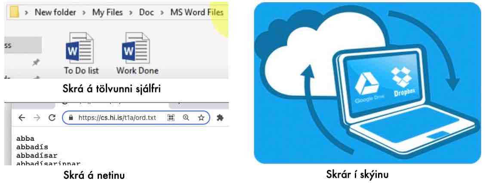

.. include:: rst-include

.. _skrar:

Skrár
=====

Yfirlit
~~~~~~~

.. rubric:: Langtímageymslur

Til að geyma gögn til lengri tíma en rétt á meðan forrit er að keyra eru
yfirleitt notaðar **skrár** (*files*). Þær eru oft geymdar á svonefndum **hörðum
diski** (`hard disk <https://en.wikipedia.org/wiki/Hard_disk_drive>`_), sem er
búinn til úr þunnum segulmögnuðum skífum sem snúast á miklum hraða í diskdrifi.
Nú til dags eru reyndar gagnageymslur með **leifturminni** (*flash drive*,
*solid state drive*, *SSD*) orðnar algengar. Lesandi sem vill kynna sér svona
geymslur betur verður að leita út fyrir þessar fyrirlestrarnótur, því hér höldum
við okkur við hugbúnaðarhliðina (*software*).

.. figure:: myndir/harður-diskur.jpg
   :align: center
   :figwidth: 9cm

   Harður diskur frá 1998

.. rubric:: Staðsetningar skráa

Með Python er hægt að lesa gögn úr skrá inn í minni tölvunnar, og það er líka
hægt að skrifa út í skrár. Skráin getur verið hvort sem er á diski tölvunnar eða
úti á vefnum (þá bara til að lesa), og þriðji möguleikinn er að skráin sé í
skýinu, og það á sér í lagi við þegar Python keyrir á tölvu í skýinu, eins og raunin
er þegar Google Colab er notað.

   Þrír staðir fyrir skrár

.. rubric:: Skráategundir

Eins og flestir lesendur vita væntanlega geta skrár líka verið með ýmsu sniði,
og stundum eru skrárnar kallaðar **skjöl** (*documents*). Nokkur dæmi eru
textaskrár, Word-skjöl, Excel-skjöl, myndaskrár og PDF-skjöl. Til að byrja með
gera þessar nótur ráð fyrir að skrárnar séu staðsettar á beint aðgengilegum
stað, annaðhvort á vefnum eða í svonefndri sjálfgefinni möppu, en í kafla
:numref:`skraakerfi` verða aðrir möguleikar skoðaðir.

.. rubric:: Nöfn skráa

Skrár heita langoftast einhverju nafni sem er textastrengur. Það eru mun minni
takmarkanir á nöfnum skráa en á breytunöfnum: skráanöfn mega innihalda ýmis
sértákn, og t.d. er algengt að nota –, :, . og bil, auk bókstafa og
tölustafa. Það er samt ekki hægt að nota skástrik, hvorki / né \\. Reyndar geta
séríslenskir stafir valdið vandræðum. Á það á til dæmis við ef skrám er er
hlaðið upp til notkunar í Google Colab :(. Skráanöfn eru oft með sniðinu
``aðalnafn.undirnafn`` (*basename.extension*) þar sem .undirnafn segir til um
tegund skrárinnar og getur t.d. verið ``.txt`` fyrir textaskrár, ``.xlsx`` fyrir
Excel-skjöl og ``.png`` fyrir myndir á png-sniði. Dæmi um skráanöfn eru:

     ``gögn 14.09.2021 14:59:00.txt`` |br|
     ``skiladæmi-12.pdf``.

Reyndar er það svo á bæði Windows-tölvum og Mökkum að sjálfgefið er að
undirnafnið sé falið. Tegund skrárinnar er þá sýnd með öðrum hætti, oft bæði með
teikni (*icon*) og textalýsingu, sbr. :numref:`mynd %s <finder>`, þar sem tölvan
hefur reyndar verið stillt á að fela undirnafnið ekki.

.. _finder:

.. figure:: _images/finder.jpg
   :align: center
   :figwidth: 18cm

   "Finder" á Makka. Tegundir skráa sýndar með teikni, undirnafni, og textalýsingu

.. rubric:: Pakkar til að lesa og skrifa skrár
   
Það eru ýmsar leiðir til að lesa og skrifa skrár í Python. Hefðbundna aðferðin
er að nota innbyggðu föllin ``open``, ``read`` og ``write`` (og reyndar nokkur
skyld föll), sem einkum nýtast fyrir textaskrár. Stundum eru skrárnar sniðnar á
ákveðinn hátt, til dæmis með því að aðskilja dálka með kommum, semíkommum eða
tab-táknum, og þá gæti pakkinn ``csv`` (*comma-separated-values*) hentað.
Pakkasöfnin *Pandas* og *Numpy* sem rædd voru í kafla :numref:`inngangur` eru
með sín föll til að lesa skrár, og svo eru til sérstakir pakkar til að lesa
ýmsar sérsniðnar skrár t.d. Excel-skjöl og myndaskrár. Loks má nefna pakkann
*pathlib* sem er á dagskrá í kafla :numref:`skraakerfi`.

.. lestur-skrar:

Innlestur skráa
~~~~~~~~~~~~~~~
Línuskiptatákn
--------------
Áður en hefðbundinn innlestur skráa verður útskýrður þarf að segja nokkur orð um
línuskiptatákn (*line feed*, *line break* eða *newline character*), sem er
notaður til að fara í nýja línu í textaskrá. Hann er kóðaður með tölunni 10 og
oft táknaður með stafasamstæðunni ``\n``, m.a. í Python. Það er líka hægt að
nota hann í ``print``-köllum, t.d.

.. code:: Python
          
   print(x, y, sep="\n")       # prentar x og y hvort á sína línuna
   print(f"x = {x}\ny = {y}")  # prentar líka á tvær línur).

With-skipun
-----------
Annað atriði sem þarf að ræða áður en við hellum okkur í innlesturinn er
**with**-skipun. Hún er notuð til að einfalda forrit þar sem par af skipunum
umlykur skipanablokk. Þetta virkar svona:

.. code:: text

   with BYRJUN(...) as v                   v = BYRJUN(...)
      skipanablokk          jafngildir:    skipanablokk   
   ...                                     LOKASKIPUN     
                                           ...

Til að þetta virki þarf fallið BYRJUN að vera samhæft við notkun with-skipunar,
þannig að það sjái líka um lokaskipunina, sem framkvæmist þá sjálfkrafa þegar komið er
út úr with-blokkinni. With-skipunin hefur annan kost, að ef skipanablokkin
inniheldur einhverjar skipanir sem brjótast út úr henni (``return``, ``break``
eða ``continue``) þá missum við af lokaskipununum með forritsbútnum hægra megin,
en ekki ef við notum *with*. Nánar tiltekið:

.. code:: text

   with BYRJUN(...) as v                   v = BYRJUN(...)
      skipanir1                            skipanir1
      if skilyrði:          jafngildir:    if skilyrði:
         return                               LOKASKIPUN
      skipanir2                               return
   ...                                     skipanir2
                                           LOKASKIPUN
                                           ...
                                            
Einföldunin er sem sé orðin umtalsverð.

.. _hefdbundinn-innlestur:

Hefðbundinn innlestur textaskrár af diski
-----------------------------------------
Til að lesa úr textaskrá þarf fyrst að opna hana með **open** og eftir
innlesturinn þarf að loka henni með **close**. Hinsvegar eru *open–close*
einmitt par af skipunum BYRJUN–LOKASKIPUN sem eru samhæfðar við *with*. Hefðin
er sú að nota with-skipun með open, og þessar fyrirlestrarnótur miðast við það.

Python hefur þrjú innbyggð föll til að lesa textaskrá, **readline**,
**readlines** og **read**. Fyrsta fallið les eina línu úr skránni inn í streng,
næsta fall les allar línur sem eftir er að lesa inn í lista af strengjum og það
þriðja les alla skrána inn í einn streng. Í öllum tilfellum eru línuskiptatákn
aftast í hverjum lesnum streng.

.. admonition:: Sýnidæmi: Lestur skrár
   :class: synidaemi

   Gerum ráð fyrir að skráin ``data.txt`` innihaldi:

   .. code:: text

      Nafn Hæð
      Bára 171
      Jóna 168
      Kári 178
      

   og eftirfarandi forritsbútur sé framkvæmdur:

   .. code:: Python

      with open("data.txt") as f:
         hauslína = f.readline()
         línur = f.readlines()
      with open("data.txt") as f:
         skráin = f.read()      

   Þá verður hauslína strengurinn ``"Nafn Hæð\n"``, ``línur`` verður listinn
   ``["Bára 171\n", "Jóna 168\n", "Kári 178\n"]``, og ``skráin`` verður
   strengurinn ``"Nafn Hæð\nBára 171\nJóna 168\nKári 178\n"``

   Takið eftir að það þarf að opna skrána aftur áður en kallað er á **read**.

Til að losna við línuskiptatákn aftast í streng má nota fallið ``strip()``.
Þetta fall hentar ágætlega þegar skrá er lesin línu fyrir línu, og eitthvað gert
við hverja línu, eins og gert er í næsta sýnidæmi sem prentar línurnar. Dæmið
nýtir sér að hægt er að nota opnaðar Python-skrár sem ítrara. Fallið ``next``
nær í fremsta gildi ítrara, og stillir hann samtímis þannig að næst skili hann
afgangi gilda sinna.

.. admonition:: Sýnidæmi: Skrá lesin og prentuð
   :class: synidaemi

   Hér er forrit sem les línur skrár hverja á fætur annarri og prentar þær út.
   Byrjað er á að lesa hauslínuna sér.
           
   .. code:: Python

      with open("data.txt") as f:
         hauslína = next(f).strip()
         print("Hauslína:, hauslína")
         print("Aðrar línur:")
         for lína in f:
            strengur = lína.strip()
            print(strengur)

   Forritið prentar:

   .. code:: text
             
      Hauslína: Nafn Hæð
      Aðrar línur:
      Bára 171
      Jóna 168
      Kári 178
   
Þegar skrá er lesin öll í einu með ``read`` er hægt að nota ``splitlines`` til
að losna við línuskiptatáknin, svona:

.. code:: Python

   with open("data.txt") as f:
      L = f.read().splitlines()
      
   # Nú er L listinn ['Nafn Hæð', 'Bára 171', 'Jóna 168', 'Kári 178']

.. admonition:: Æfing: Textaskrá lesin inn
   :class: aefing

   1. Búið til skrána "data.txt" á tölvunni ykkar með innihaldinu sem gefið er í
      sýnidæminu "Lestur skrár" að ofan. Á **Windows** má opna File Explorer,
      fara t.d. í möppuna *Documents*, hægri smella og velja *New–Text
      Document*. Síðan má tvísmella á skrána, slá inn texta og velja að lokum
      *File–Save*. Á **Makka** má smella á *command–space*, slá inn *TextEdit*
      og enter. Síðan er valið *Format–Make Plain Text*. Þá er texti skrárinnar
      sleginn inn, valið *File–Save* og skránni loks valinn staður, t.d. í
      *Documents* möppu.

   2. Þið ráðið hvort þið leysið þennan lið í Colab eða JupyterLab.
      
      **Í Colab:** Farið nú í Google Colab og opnið nýja vinnubók. Smellið á möpputáknið í
      vinstri spássíu og þvínæst upphleðslutáknið sem birtist og hlaðið upp nýju
      skránni, ``data.txt``. Smellið á hana til að skoða innihaldið og
      staðfestið að allt sé rétt.

      .. figure:: myndir/möpputákn.jpg
         :align: center
         :figwidth: 9cm

      **Í JupyterLab** Opnið JupyterLab í möppunni þar sem skránni var valinn staður
      í lið 1 og búið til nýja vinnubók.
                    
   3. Skrifið nú forrit sem les skrána og prentar hana jafnóðum út, eins og gert
      er í seinna sýnidæminu að ofan, nema hvað ekki á að meðhöndla hauslínuna
      sérstaklega.

Innlestur textaskrár af vefnum
------------------------------
Hægt er að lesa textaskrá beint af vefnum ef hún er opnuð með fallinu *urlopen*
sem er í pakkanum *urllib.request*. Ekki þarf að loka slíkri skrá eftir notkun
svo það er engin þörf á *with*-skipun. Hinsvegar eru strengir sem eru lesnir úr
skrá á vefnum ekki sjálfkrafa kóðaðir í Python-strengi heldur helst snið þeirra,
og það er nánast alltaf svonefnt "utf-8" snið. Til að fá rétta Python-strengi
þarf að beita fallinu `decode()`.

Hér fylgir sýnidæmi um svona innlestur, sem sýnir líka hvernig hægt er að ná í
einstök atriði í hverri línu með ``split`` fallinu. Það losar okkur í leiðinni
við línuskiptatáknin og gerir þar með ``strip()`` óþarft. Mörg fleiri dæmi um
lestur skráa af vefnum eru í verkefnunum aftast í þessum fyrirlestrarnótum.

.. admonition:: Sýnidæmi: Skrá lesin af vefnum
   :class: synidaemi

   Skráin sem notuð var í sýnidæmunum hér á undan hefur verið sett á vefinn, í
   `https://cs.hi.is/python/data.txt <https://cs.hi.is/python/data.txt>`_. Hér
   er hún lesin inn í tvo lista sem svo eru prentaðir út. Listarnir byrja tómir
   og svo lengjast þeir í hverri umferð for-lykkjunnar. Við notum tækifærið og
   sýnum samspil *enumerate* og *zip*, sbr. æfingu afast í :numref:`kafla
   %s<ítrarar>`.

   .. code:: Python
             
      from urllib.request import urlopen
      f = urlopen("https://cs.hi.is/python/data.txt")
      nöfn = []
      hæðir = []
      
      for lína in f:
         (nafn,hæð) = lína.decode().split()
         nöfn.append(nafn)
         hæðir.append(hæð)
         
      for nr,(n,h) in enumerate(zip(nöfn, hæðir)):
         print(f"{nr}: {n} {h}")

   Út prentast:

   .. code:: text

      0: Nafn Hæð
      1: Bára 171
      2: Jóna 168
      3: Kári 178

Uppflettitafla lesin úr skrá
----------------------------
Í sýnidæminu hér næst á undan var gagnaskrá lesin inn í tvo lista, en oft hentar
betur að vinna með gögn í uppflettitöflum. Sýnidæmin hér á eftir sýnir tvo
möguleika á að ná uppflettitöflu úr skrá: (a) að búa töfluna til samhliða
innlestrinum, og (b) að lesa inn í tvo lista sem svo er breytt í uppflettitöflu.
Notast er við sömu skrá og síðast.

.. admonition:: Sýnidæmi: Uppflettitafla samhliða innlestri
   :class: synidaemi

   Nöfnin verða lyklar í uppflettitöflunni sem búin er til og hæðirnar gildi. Að
   loknum innlestri er taflan prentuð. Takið eftir hvernig ``items`` er notað
   til að renna samhliða í gegn um pör nafna og hæða.
           
   .. code:: Python
             
      from urllib.request import urlopen
      f = urlopen("https://cs.hi.is/python/data.txt")
      tafla = {}
      for lína in f:
         (nafn,hæð) = lína.decode().split()
         tafla[nafn] = hæð

      for (nafn,hæð) in tafla.items():
         print(f"{nafn} {hæð}"

   Út prentast:

   .. code:: text

      Nafn Hæð
      Bára 171
      Jóna 168
      Kári 178

.. admonition:: Sýnidæmi: Uppflettitafla eftir innlestur
   :class: synidaemi

   Við byrjum að keyra fyrstu átta línurnar í forritinu í sýnidæmi **Skrá lesin
   af vefnum** í kaflanum á undan og fá þannig tvo lista Síðan búum við töfluna til
   með aðstoð dict og zip og prentum hana út eins og fyrr:

   .. code:: Python
             
      tafla = dict(zip(nöfn,hæðir))
      
      for (nafn,hæð) in tafla.items():
         print(f"{nafn} {hæð}"

.. admonition:: Æfing: Prófnúmer og einkunnir
   :class: aefing

   Skráin `https://cs.hi.is/python/profnumer.txt <http:////cs.hi.is/python/profnumer.txt>`_
   inniheldur tvo dálka, prófnúmer og skírnarnafn. Lesið þessa skrá inn í uppflettitöflu,
   prófnúmer :math:`\to` nafn,

   a. með því að byrja með tóma töflu og bæta við hana samhliða innlestri, eins
      og í fyrra sýnidæminu að framan, og

   b. með því að lesa inn tvo lista og nota ``dict(zip(...))`` eftir innlesturinn,
      eins og í seinna sýnidæminu.

   c. Gunnar íslenskukennari notaði prófnúmer þegar hann fór yfir ritgerðir (svo hann
      yrði ekki hlutdrægur). Hér eru einkunnirnar sem hann gaf:

     .. code :: text

        prófnúmer:   176,  542, 1577, 2785, 4218, 6354, 8003, 9134
        einkunn:     8.5, 10.0,  4.5,  9.0,  7.5,  6.0,  8.5,  8.0
        
     Skrifið forrit sem býr til tvo lista úr þessum upplýsingum, flettir upp á
     nöfnum í uppflettitöflunni og býr til einkunnalista sem byrjar svona:

     .. code:: text

        Nemandi     Prófnúmer  Einkunn
        ––––––––––––––––––––––––––––––
        Kjartan     0176         8.5
        Aðalheiður  0542        10.0
        Hulda       1577         4.5
        ...

     .. admonition:: Athugasemd: 
        :class: athugid

        Ef sýnidæmunum að framan er fylgt verða prófnúmerin sjálfkrafa strengir,
        en listinn í c-lið gefur heiltölur. Til að komast hjá þessu ósamræmi
        mætti breyta prófnúmerinu í tölu eftir að það er lesið inn úr skránni,
        t.d. með ``prófnr = int(prófnr)``. Til að prenta 0 fremst í prófnúmerum í
        lokatöflunni má svo nota f-streng með sniði ``{...:04}`` sbr.
        :numref:`töflu %s<fstrengjasnið>`.
        
        
CSV-skrár
~~~~~~~~~
Gögnum í skrám er oft skipað í dálka, t.d. nöfn í fyrsta dálki, símanúmer í 2.
dálki og heimilisföng í 3. dálki. Það eru ýmsar leiðir notaðar til að afmarka
dálkana: Stundum eru dálkarnir af fastri breidd, en stundum eru þeir afmarkaðir
með sérstöku afmörkunartákni (*delmiter*), oftast kommu, semikommu (;),
tab-tákni eða bilum. Skrár sem nota kommu eða semikommu eru kallaðar CSV-skrár
(*comma separated values*) og slíkar skrár er auðvelt að búa til með Excel.

.. _daemi-um-csv-skra:

Dæmi um CSV-skrá
----------------
Hér er dæmi um símaskrá sem notar semíkommu til að afmarka dálka:

.. code:: text

   NAFN;         SÍMI;    HEIMILI
   Jón Jónsson;  8883333; Geiragötu 18, Reykjavík
   Ása Bára Jónsdóttir;7772222; Unugötu 3, Akureyri
   Ari Arason; 5551111; Arastíg 1, Selfossi

Það væri líka hægt að nota tab-tákn til að afmarka, en kommur eða bil mundu
síður henta því einstök atriði (*svið*; *fields*) í skránni innihalda bæði
kommur og bil. Sá sem sló inn þessa skrá var ekki mikið að hugsa um samræmi, það
er allur gangur á því hvort eitt eða fleiri bil koma á eftir semíkommunum, en
við sjáum í næsta kafla að það kemur ekki að sök.

Í `Wikipedíugrein <https://en.wikipedia.org/wiki/Comma-separated_values>`_ um
CSV-skrár eru fleiri dæmi t.d. í kaflanum `Example
<https://en.wikipedia.org/wiki/Comma-separated_values#Example>`_. Þar er m.a.
rætt hvernig hægt er að geyma svið sem innihalda bil með því að slá gæsalöppum
utan um þau, en við förum ekki nánar út í þá sálma hér.

.. _csv-lestur:

Innlestur með pakkanum csv
--------------------------
Til að lesa skrá sem afmarkar dálka með sérstöku tákni eða bilum inn í Python
hentar ágætlega að nota pakkann ``csv``. Með honum er notað ``with open`` alveg
eins og gert er í kafla :numref:`hefdbundinn-innlestur`, síðan er búinn til
svonefndur lesari (hlutur af taginu ``csv_reader``) og hann loks notaður til að
lesa, sbr. eftirfarandi dæmi.

.. admonition:: Sýnidæmi: CSV-skrá lesin
   :class: synidaemi

   Gerum ráð fyrir að skráin í kafla :numref:`daemi-um-csv-skra` sé geymd í
   ``simaskra.txt``. Eftirfarandi forrit mundi lesa hana inn og prenta á skjá:

   .. code:: python

      import csv
      with open("simaskra.txt") as f:
         reader = csv.reader(f, delimiter=';', skipinitialspace=True)
         for röð in reader:
            print(f"{röð[0]:20}  {röð[1]:7}  {röð[2]}")

   Við sjáum að lesarinn *reader* er ítrari sem skilar lista með atriðum hverrar
   línu þegar hann er notaður í for-setningu. Viðfangið ``skipinitalspace=True``
   sér til þess að bilunum sem koma aftan við semíkommurnar (þ.e. fremst í
   hverju sviði) sé sleppt. Forritið mundi prenta út:

   .. code:: text
             
      NAFN                  SÍMI     HEIMILI
      Jón Jónsson           8883333  Geiragötu 18, Reykjavík
      Ása Bára Jónsdóttir   7772222  Unugötu 3, Akureyri
      Ari Arason            5551111  Aragötu 1, Selfossi

Komma er sjálfgefið afmörkunartákn. Skrá sem er afmörkuð með tab-táknum má lesa
með ``delimiter="\t"``. Ef sleppa ætti innlestri á fyrirsagnarlínunni mætti
skrifa ``next(reader)`` næst á undan for-lykkjunni.

.. _csv-lestur-strengja:

CSV-lestur úr lista af strengjum
--------------------------------
Ef gefinn er listi af strengjum sem hver um sig inniheldur svið afmörkuð með
kommum eða öðrum táknum þá er hægt að nota csv-pakkann til að ná í þessi svið
alveg eins og um væri að ræða línur í skrá. Hér er einfalt dæmi:

.. code:: Python

   línur = ["grænn, 0.1, 0.6, 0.1", "blár, 0, 0.2, 0.9", "gulur, 1, 0.9, 0"]
   rdr = csv.reader(línur, skipinitialspace=True)
   for L in rdr:
      print(L)

sem prentar út:

.. code:: text

   ['grænn', '0.1', '0.6', '0.1']
   ['blár', '0', '0.2', '0.9']
   ['gulur', '1', '0.9', '0']
          
.. admonition:: Æfing: Verð mjólkurlítra
   :class: aefing

   Lesið eftirfarandi verðlista og prentið hann út sem töflu: |br|
   ``[["Nýmjólk;177", "Léttmjólk;179", "Fjörmjólk;219"]]``

.. _csv-lestur-bilafmark:

CSV-skrá lesin af vefnum
------------------------
Símaskrána í kafla :numref:`innlestur með pakkanum csv` má finna í
`https://cs.hi.is/python/simaskra.txt <https://cs.hi.is/python/simaskra.txt>`_.
Til að lesa þessa skrá beint af netinu með csv-lesara þarf að fara krókaleið og
lesa fyrst líkt og gert er í fyrra sýnidæminu í kafla :numref:`Hefðbundinn
innlestur textaskrár af diski` áður en lesaranum er beitt á strengjalistann
sem kemur út úr því. Hér er forritsbútur sem útfærir þetta:

.. code:: python
          
   url = "https://cs.hi.is/python/simaskra.txt"
   import csv
   from urllib.request import urlopen
   f = urlopen(url)
   lines = [l.decode() for l in f.readlines()]
   reader = csv.reader(lines, delimiter=';', skipinitialspace=True)

   for (nafn, sími, heimili) in reader:
       print(f'{nafn:19}  {sími:7}  {heimili:20}')

Skrár afmarkaðar með bilum
--------------------------
Ef ekkert atriði inniheldur bil má nota bil til að afmarka dálkana. Á ensku er
talað um *whitespace-delimited file*. Algengt er að nota eitt eða fleiri bil
milli dálka og láta þá standast á.

.. admonition:: Sýnidæmi: Bilaafmörkuð skrá
   :class: synidaemi

   Lát skrána malmar.txt innihalda:           
           
   .. code:: text

      Málmur  Eðlisþyngd  Bræðslumark
      Ál         2.70         933
      Járn       7.87        1538
      Kopar      8.96        1085
      Gull      19.30        1064

   Eftirfarandi forritsbútur mundi lesa skrána:

   .. code:: python

      import csv
      with open("malmar.txt") as f
         reader = csv.reader(f, delimiter=' ', skipinitialspace=True)
         next(reader)     # titillína lesin (og henni hent)
         for lína in reader:
            málmur = lína[0]
            eðlisþ = float(lína[1])
            bræðslum = int(lína[2])
            ...

Þessi skrá verður notuð í :numref:`verkefni %s<dálkar í csv-skrá [leyst með colab]>`
   
.. _csv-lestur-dalka:
            
Náð í dálk í CSV-skrá
---------------------

Ef búið er að búa til lesara ``rdr = csv.reader(...)`` eins og í sýnidæmunum í
köflum :numref:`csv-lestur` og :numref:`csv-lestur-bilafmark` þá má breyta honum
í lista af listum sem hver geymir upplýsingar úr einni línu skrárinnar með því
að skrifa:

   ``L = list(rdr)``

Hér notum við að ``rdr`` er ítrari, og fallið ``list`` úr kafla
:numref:`bua-til-sofn` býr til lista úr honum. Svo má nota yfirgrip til að ná til dæmis í
stak nr. 1 í öllum undirlistunum í L svona:

   ``dálkur1 = [undirlisti[1] for undirlisti in L]``

eða bara ``d1 = [x[1] for x in L]``. Ef dálkurinn inniheldur kommutölur má ná
í lista af þeim með ``d1 = [float(x[1]) for x in L]``.

.. admonition:: Æfing: 
   :class: aefing

   Búið til lista af strengjum með upplýsingum um málmana í kafla
   :numref:`csv-lestur-bilafmark` en látið strengina vera kommu-afmarkaða (t.d.
   verður fyrsti strengurinn ``"Ál,2.70,933"``. Búið til lesara fyrir þennan lista,
   sbr. kafla :numref:`csv-lestur-strengja` og náið í framhaldi í
   eðlisþyngdadálkinn inn í lista af kommutölum.
            
.. _skrar-skrifadar-ut:      
      
Skrár skrifaðar út
~~~~~~~~~~~~~~~~~~
Til að skrifa í textaskrá þarf að opna hana í útskriftarham með því að rita

   :code:`with open("skráarnafn", mode="w") as file:`

Reyndar má sleppa *mode=* og rita ``open("skráarnafn", "w")``. Skráin lendir
sjálfkrafa í núverandi möppu. Síðan má nota fallið ``write`` til að skrifa
strengi í skrána en þess þarf að gæta að setja handvirkt línuskiptatákn
aftast í hverja línu.

.. admonition:: Sýnidæmi: Skráaskrift með write
   :class: synidaemi

   Forrit sem býr til skrá ``xy.dat`` með strengjunum "x=3" og "y=4". Takið eftir að
   hægt er að skrifa f-strengi með write.

   .. code:: python

      with open("xy.dat", "w") as f:
         (x,y) = (3,4)
         f.write("x = {x}\n")
         f.write("y = {y}\n")

Það er líka hægt að nota ``print`` til að skrifa í skrár með því að hafa
viðfangið ``file = f`` með, og þá koma línuskiptin sjálfkrafa með, sbr.
eftirfarandi dæmi

.. admonition:: Sýnidæmi: Skráaskrift með print
   :class: synidaemi

   Eftirfarandi forrit býr til eins skrá og dæmið að framan.

   .. code:: python

      with open("xy1.dat", "w") as f:
        (x,y) = (6,7)
        print(f"x = {x}", file=f)
        print(f"y = {y}", file=f)
   
.. admonition:: Æfing: Skráaskrift úr vinnubók
   :class: aefing

   Afritið forritin í sýnidæmunum tveimur hér að framan inn í reiti í vinnubók
   og keyrið þau. Skoðið svo skrárnar sem urðu til [í Colab má smella á
   möpputáknið í vinstri spássíu, en á eigin tölvu má nota Finder (Mac) eða File
   Explorer (Windows)].
         
.. _skraakerfi:

Skráakerfi
~~~~~~~~~~
Tölvuskrár eru oftast settar upp í svonefnt **skráakerfi** (*file system*).
Gögnum er skipað í skrár sem hver hefur sitt nafn, og síðan er skrám skipað í
**möppur** (*folders*, *directories*), líka hver með sínu nafni. Fyrir utan
skrár geta möppur innihaldið aðrar möppur, sem eru þá kallaðar **undirmöppur**
(*subfolder*, *subdirectory*) en mappan sem inniheldur þær er **yfirmappa**
(*parent folder*).

Möpputré
--------
Möppum er oft raðað saman í kerfi sem er eins og tré á hvolfi, en kerfið er líka
stundum sýnt með því að lista innihald möppu inndregið fyrir neðan nafn
möppunnar. Hér eru tvö dæmi:

.. _moppur-toms:

.. figure:: myndir/tommaskrár.jpg
   :align: center
   :figwidth: 12cm

   Möppurnar hans Toms

.. _makka-skraakerfi:
   
.. figure:: myndir/makkakerfi.png
   :align: right
   :figwidth: 35%

   Hluti af skráakerfi á Makka

Í fyrra dæminu eru bara hluti af möppum á tölvunni sýndar, þær sem tilheyra
tilteknum notanda. En stór hluti af skrám á tölvu tilheyra stýrikerfinu og ýmsum
hugbúnaði (*applications*) sem er uppsettur á henni. Síðara dæmið sýnir hluta af
skráakerfi á Makka höfundar þar á meðal ýmsar slíkar stýrikerfisskrár, en líka
heimamöppu hans (*jonasson*) og tvær undirmöppur hennar.

Oft er eitt svona möpputré fyrir hvern disk á tölvunni, og ef maður stingur
USB-kubbi í hana sýnir hún sérstakt tré fyrir hann. Ef Google drive eða Dropbox
eru notuð eru líka sérstök möpputré fyrir þau. Efsta mappan í svona möpputré er
kölluð **rót** (*root*) eða **rótarmappa**. Á Linux og Mökkum er rótarmappan
táknuð með "/" en á Windows gjarna með "C:\". En þetta er ekki algilt, t.d.
sýnir *Finder* (=*File Explorer*) rótarmöppuna á Makka höfundar undir heitinu
*Macintosh HD*.

Heimamappa
----------
Á flestum tölvum á hver notandi sína heimamöppu, sem heitir nafni sem er líka
notendanafn hans. Á Mökkum og Windows-tölvum er kerfið oft sett þannig upp að
undir rótarmöppu tölvunnar er mappa *Users*, og undir henni eru heimamöppur
þeirra notenda sem hafa verið settir upp. Í heimamöppunum eru síðan möppurnar
*Documents*, *Downloads*, *Desktop*, *Pictures*, *Music* o.fl. Í Ubuntu Linux
heitir yfirmappa heimamöppunnar *home* en ekki *Users*.

Núverandi mappa
---------------
Þegar forrit keyrir er það oftast statt í tiltekinni möppu sem kölluð er
*sjálfgefin mappa* eða *núverandi mappa* (*current working directory*). Þetta er
sú mappa sem skrár lenda í þegar þær eru vistaðar úr forritinu, og líka sú þar
sem fyrst er leitað að skrá til að opna. Oft er það heimamappan sem er sú
sjálfgefna, eða þá mappan *Documents*, nema um sé að ræða myndvinnsluforrit eða
tónlistarforrit t.d.

Það gildir líka um Python-forrit notanda að það er statt í tiltekinni möppu
þegar það keyrir. Þegar JupyterLab er keyrt upp frá skipanalínu í ákveðinni
möppu þá er forritið í byrjun statt þar. En þegar keyrt er með Google Colab þá
er maður staddur á einhverri tölvu uppi í *Skýinu*, nánar tiltekið í möppu sem
heitir "/content". Það er hægt að skoða skráakerfi þessarar tölvu með því að
smella á möpputáknið í vinstri spássíu gluggans. Þá birtast líka hnappar til að
hlaða upp eða niður skrám frá/á eigin tölvu og sömuleiðis er hægt að tengja
Google Drive notanda við þetta skráakerfi.

Slóðir
------
Þegar vísað er í skrá er hægt að gera það með því að gefa upp svonefnda **slóð**
(*path*) skrárinnar, en það er runa af möppum sem sýnir hvar skráin er, aðskilin
með skástrikum, sem endar á skránni sjálfri. Svo er líka talað um slóð möppu,
sem endar þá á möppunafninu. Sérstaka möppunafnið ``..`` táknar yfirmöppu, þ.e.
að farið sé upp tréð. Slíka slóð má gefa upp miðað við rót trésins (**algild
slóð**, *absolute path*), og þá er byrjað á ``/``, eða miðað við núverandi möppu
(**afstæð slóð**, *relative path*), og þá byrjar slóðin ekki á ``/``. Stundum er
líka notað sérstaka möppunafnið ``.`` sem táknar núverandi möppu.

.. admonition:: Sýnidæmi: Slóðir
   :class: synidaemi

   1. Notandi sem er staddur í möppunni *Old* neðst til hægri á mynd
      :numref:`%s<moppur-toms>` getur vísað í skrána *Two.txt* á sömu mynd með
      slóðinni ``../../Data/Two.txt``
   2. Notandi sem er staddur í möppunni *Downloads* á mynd :numref:`%s<makka-skraakerfi>`
      getur vísað í skrána *listi.xlsx* hvort sem er með
      ``/Users/jonasson/Documents/listi.xlsx`` eða ``../Documents/listi.xlsx``.
   3. Mappan *Downloads* á mynd :numref:`%s<makka-skraakerfi>` hefur slóð
      ``/Users/jonasson/Downloads``.

.. admonition:: Æfing: Afstætt og algilt
   :class: aefing

   1. Finnið afstæða slóð skrárinnar *Format* ef notandi er staddur í
      rótarmöppunni *Tom* á mynd :numref:`%s<moppur-toms>`
         
   2. Ákvarðið algilda slóð möppunnar *Desktop* hjá notandanum *uppsetning* á
      mynd :numref:`%s<makka-skraakerfi>`.
      

Einingin pathlib
----------------
Í (eldri) Python-forritum er algengt að notuð sé einingin *os* (*operating
system*) til að meðhöndla möppur og slóðir. Einingin **pathlib** er nýleg og
tilgangur hennar er að leysa *os* af hólmi með einfaldari aðgerðum. Hér lýsum
við bara hvernig nota má *pathlib*, en nefna má að Think Python-bókin útskýrir
*os*-eininguna í kafla 14.4.

Mikilvægasta fallið í *pathlib* er kallað ``Path`` og það er virkjað með því að
rita:

   :code:`from pathlib import Path`

Við algengustu notkun tekur *Path* einn stika sem er slóð á strengjaformi,
annaðhvort afstæð eða algild, og það skilar hlut af taginu *PosixPath* sem er í
rauninni gagnatag fyrir slóð. Sjálfgefið gildi stikans er ``.`` þ.e.a.s.
núverandi mappa. Hlutur af taginu *PosixPath* hefur ýmsar aðferðir, og eru
nokkrar þær helstu sýndar í næstu töflu, sem miðast við að Path-hluturinn ``p``
hafi verið búin til með

   :code:`p = Path("mappa/mappa/...")`         

.. csv-table:: Helstu aðgerðir fyrir *PosixPath*-hluti
   :widths: auto
   :delim: ;
   :name: posixpath-hlutir

   ``p.resolve()`` ; algild slóð fyrir p
   ``p.parent``    ; yfirmappa p
   ``p.name``      ; aftasti hluti p, skráin eða mappan sem p lýsir
   ``p.suffix``    ; undirnafn skrár (t.d. ``.xlsx``)
   ``p.stem``      ; aðalnafn skrár (nafn án undirnafns)
   ``p.cwd()``     ; slóð núverandi möppu (*current working directory*)
   ``p.home()``    ; slóð heimamöppu
   ``p.exists()``  ; satt ef slóðin p er til
   ``p.is_dir()``  ; satt ef p er mappa (*directory*)
   ``p.is_file()`` ; satt ef p er skrá
   ``p.unlink()``  ; eyðir skrá með slóð p
   ``p.rmdir()``   ; eyðir möppu með slóð p (*remove*)
   ``p.mkdir()``   ; býr til möppu með slóð p (*make*)
   ``p.iterdir()`` ; ítrari fyrir allar skrár og undirmöppur í p
   ``p/"mappa"``   ; slóð fyrir möppu undir p
   ``p/"skrá"``    ; slóð fyrir skrá undir p

Takið eftir að sumar aðgerðirnar eru ekki með () á eftir: Þær eru það sem kallað
er "eiginleikar" en ekki aðferðir. Aðferðirnar ``p.cwd()`` og ``p.home()`` eru
reyndar þannig að það skiptir engu máli hvaða slóð var notuð til að búa til p.

.. admonition:: Sýnidæmi: Notkun Pathlib
   :class: synidaemi

   .. figure:: myndir/tommaskrár-hluti.jpg
      :align: right
      :figwidth: 45%
           
   Hér t.h. er hluti af möppukerfi Toms. Ef notandi er staddur í möppunni Tools
   þá mundi eftirfarandi forritsbútur ítra sig yfir innihald hennar og skrifa út
   ``Format, Stats, Old``. Að því loknu skrifast ``True, Notes`` (aðalnafn
   *Notes.txt*):

   .. code:: python

      from pathlib import Path
      mappa = Path(".")
      for m in mappa.iterdir():
         print(m.name(), end=", ")
      print()
      nótur = Path("../Notes.txt")
      print(nótur.exists(), nótur.stem())

.. admonition:: Æfing: Ítrað yfir möppu
   :class: aefing

   Reiknað er með að æfingarnar í köflum :numref:`hefdbundinn-innlestur` og
   :numref:`skrar-skrifadar-ut` hafi verið leystar og því séu nokkrar skrár í
   núverandi möppu (*data.txt*, *xy.dat*, *xy1.dat*).

   1. Finnið út algilda slóð núverandi möppu með því að nota Path.
      
   2. Skrifið forritsbút sem ítrar yfir innihald þessarar möppu og ákvarðar
      fyrir hvern hlut sem finnst hvort hann sé skrá eða mappa.
      
   3. Búið til nýja möppu "prufa" og skrifið svo skrá þar, "tilraun.txt" með
      nafninu ykkar. Finnið hana í vinstri spássíunni og skoðið [Hér má
      nota neðstu skipunina í töflu :numref:`%s<posixpath-hlutir>` og svo er
      hægt að nota Path-hluti sem viðföng í open-fallið].
