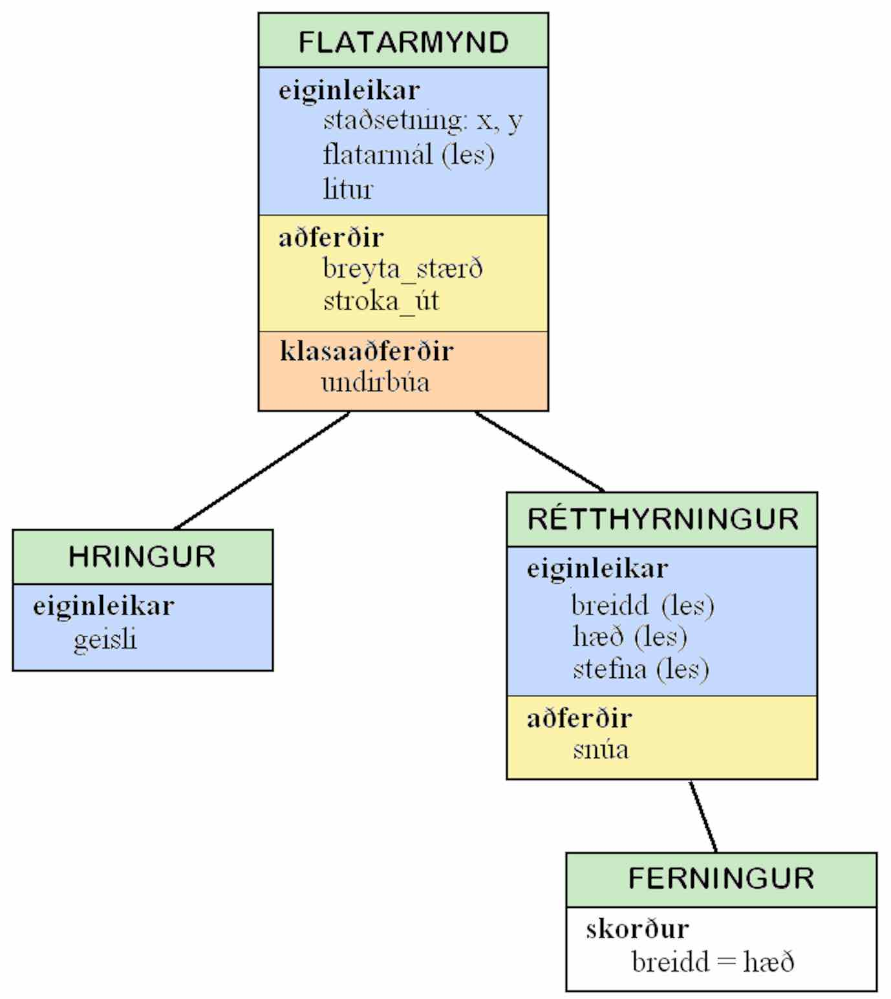
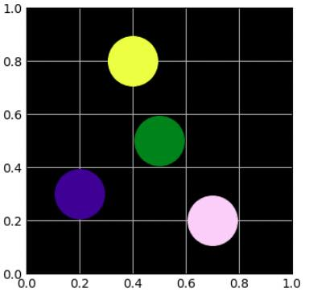
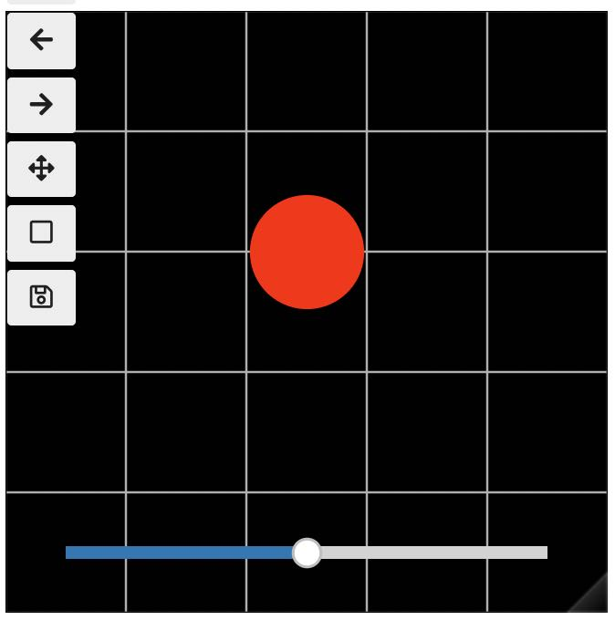

.. include:: rst-include

=====================
 Hlutbundin forritun
=====================

Um hlutbundna forritun
----------------------

Mikilvægt hugtak í ýmsum nútímaforritunarmálum er hlutbundin forritun (*object 
oriented programming*, *OOP*). Hlutbundin forritun var fyrst möguleg í Simula 67
(útgáfa af Simula búin til 1967), en mikilvægustu hlutbundnu forritunarmálin nú
eru C++, Python, Java og C#. Í hlutbundinni forritun koma m.a. við sögu hugtökin
*klasi*, *hlutur*, *tilvik*, *eiginleiki*, *aðferð*, *smiður* og *erfðir*.

.. rubric:: Byggingareiningar í hlutbundinni forritun

**Klasi** (*class*) er í raun gagnatag, og **hlutir** (*objects*) eru breytur af
viðkomandi tagi, eða **tilvik** (*instance*) af klasanum. Yfirleitt innihalda
klasar bæði **eiginleika** (*properties*, *attributes*), sem eru einskonar
breytur sem lýsa hlutnum, og **aðferðir** (*methods*), sem eru í raun föll eða
undirforrit (dæmi væri aðferð til að breyta eiginleika). Munurinn á eiginleikum
og aðferðum annarsvegar og breytum, föllum og undirforritum hinsvegar er að þau
fyrrnefndu eru ekki aðgengileg nema í gegnum hlutinn sem þau tilheyra.
**Klasaaðferðir** (*class methods*) tilheyra klasanum sjálfum en ekki einstökum
tilvikum, og sama gildir um **klasabreytur** (*class variables*). Ef gildi
þeirra breytast sjá allir hlutir breytinguna.

Sérstök tegund af aðferð er **smiður** (*constructor*), sem hefur það hlutverk
að búa til nýtt tilvik af klasanum. Hægt er að búa til klasa sem **erfir**
(*inherits*) eiginleika og aðferðir annars klasa og bætir við sínum eigin
(klasinn sem erfir er **undirklasi** (*subclass*) og hann erfir frá
**yfirklasa** (*superclass*)). Stundum setur undirklasi **skorður**
(*constraints*) á eiginleikana sem erfast.

Loks má geta hugtakanna **einka-** (*private*), **verndaður** (*protected*) og
**opinber** (*public*). Einkaaðferðir eru hjálparföll til að útfæra klasa og
aðeins aðgengilegar í (öðrum) aðferðum hans, verndaðar aðferðir eru einnig
aðgengilegar í undirklösum, og opinberar aðferðir eru aðgengilegar öllum sem
nota klasann. Hliðstætt gildir um einka-, verndaða, og opinbera eiginleika.

.. rubric:: Dæmi með erfðum
            
Tökum flatarmyndir og teikningar af þeim á skjá sem dæmi. Gerum ráð fyrir að
allar flatarmyndir hafi eiginleikana staðsetningu (t.d. hnit miðju), flatarmál
og lit og aðferðirnar stroka_út og breyta_stærð. Flatarmynd er grunnklasi, og
frá honum erfast klasarnir (sértilvikin) hringur og rétthyrningur. Hringur bætir
við eiginleikanum geisla og rétthyrningur bætir við eiginleikum breidd, hæð og
stefnu og auk þess aðferð, snúa (það hefur lítinn tilgang að snúa hring). Báðir
þessir erfðu klasar gætu endurskilgreint aðferðina breyta_stærð. Síðan mætti
láta ferning erfa frá rétthyrningi með skorðunni að breidd sé sama og hæð.
Erfðavenslin má túlka sem „er ein gerð af“. Ferningur er ein gerð af
rétthyrningi, hringur er ein gerð af flatarmynd og sömuleiðis rétthyrningur.
Myndin hér að neðan sýnir svonefnt klasarit af þessum erfðavenslum, ásamt
eiginleikum og aðferðum klasanna.

   Klasarit fyrir flatarmyndir

.. rubric:: Kostir og gallar

Kostur við hlutbundna forritun er hægt er að vinna staðbundið. Þegar klasi er
útfærður (þ.e. þegar eiginleikar hans eru skilgreindir og aðferðir hans búnar
til) þá þarf ekki að hafa allt forritið (eða forritakerfið) undir, heldur nægir
að horfa á næsta umhverfi: eiginleika og aðferðir klasans sem unnið er með og
(ef við á) klasans sem erft er frá. Annað mikilvægt atriði er svonefnd
upplýsingahuld (*information hiding*), sem felst í því að notandi hefur aðeins
(vitneskju um og) aðgang að tilteknum eiginleikum og aðferðum klasa, en hvorki
að nánari útfærslu þeirra né að öðrum eiginleikum og aðferðum klasans.

Að lokum má nefna að hlutir geta komið í stað uppflettitaflna undir vissum
kringumstæðum og táknmálið til að vísa í eiginleika er í mörgum forritunarmálum,
t.d. Python, styttra og einfaldara en uppfletting í töflu (:code:`hlutur.lykill`
í stað :code:`hlutur["lykill"]`)

En öll þessi gæði koma ekki alveg ókeypis. Hlutbundin forritakerfi geta oft
orðið stærri og flóknari en samsvarandi kerfi forrituð án klasa. Á `Wikipediu
<https://en.wikipedia.org/wiki/Object-oriented_programming#Criticism>`_ má lesa
meira um hvernig ýmsir fræðimenn hafa fjallað um slíka ókosti. Til dæmis skrifar
einn: *Þig vantar banana en færð í kaupbæti górillu sem heldur á honum og allan
frumskóginn með*.

Segja má að mikilvægast við góða hugbúnaðargerð sé að brjóta
forritin niður í litlar einingar, og  hvort það sé gert með hlutbundinni forritun
eða með öðrum hætti sé ekki aðalatriði.

.. rubric:: Það er nauðsynlegt að skilja klasa

Að lokum má nefna að mörg tölvukerfi, eru þannig að þau samanstanda af
fjölsrúðugu klasasafni, og notendur þeirra þurfa svo ýmist að búa til tilvik af
klösunum eða búa til nýja klasa sem erfa frá þeim innbyggðu með einföldum
viðbótum. Þetta á við um marga Python-pakka sem fjallað hefur verið um
í þessum nótum, m.a. NumPy, Matplotlib og Pandas. Því er gagnlegt að hafa
nokkurn skilning á hlutbundinni forritun þótt menn ætli sér ekki að smíða stór
og mikil hlutbundin forritakerfi frá grunni.

Hlutbundin forritun í Python
----------------------------

Skilgreining klasa
++++++++++++++++++

Klasaskilgreiningar í Python eiga ýmislegt sameiginlegt með skilgreiningu falla.
Þær má setja hvar sem framan við fyrsta stað þar sem klasinn er notaður.
Hefðbundið er að byrja nafn klasa á stórum staf. Hér er **sniðmát** sem algengt er
að nota fyrir klasa sem ekki á sér yfirklasa:

.. code:: python

   class Klasi:

       klasabreyta = 42   # skilgreiningar klasabreyta
       ...                #

       def __init__(self, stiki,...):        # smiður
           self.eiginleiki1 = stiki          #
           self.eiginleiki2 = gildi          #
           self._verndaðureiginleiki = gildi #
           self.__einkaeiginleiki = gildi    #
           ...                               #
           # engin return skipun             #

       def aðferð(self, stiki...)  # opinber aðferð
           skipanir                # nota má self.eiginleiki til að vísa í eiginleika
           return                  # má sleppa ef aðferð skilar engu

       def _vernduðaðferð(self, stiki...)  # vernduð aðferð, aðeins ætluð til 
           ...                             # notkunar í öðrum aðferðum klasans
           ...                             # og undirklasa hans
           
       def __einkaaðferð(self, stiki...)   # einkaaðferð, aðeins ætluð til
           ...                             # notkunar í klasanum sjálfum
           
       def __str__(self): # útskriftaraðferð
           skipanir       # ... sem búa til streng str úr self
           return str     # print(hlutur) kallar sjálfkrafa á þessa aðferð

       @classmethod                    # skilgreiningar klasaaðferða
       def klasaaðferð(cls, stiki...)  # (má sleppa)
           skipanir                    #

**Klasabreytur** eru sameiginlegar með öllum hlutum af klasataginu, gagnstætt
eiginleikum sem eru sérstakir fyrir hvern hlut (ef aðferð breytir klasabreytu þá
verður breytingin strax sýnileg í öðrum hlutum). Vísað er í klasabreytu með
punktrithætti og nafni klasans ``Klasi.klasabreyta``.
           
Eins og sést er **smiður** skilgreindur með því að nota sérstakt nafn,
``__init__``. Fyrsti stikinn í smiðnum, ``self``, er hluturinn sem á að smíða.
Hann er eiginleikalaus í byrjun, en í lokin á hann að vera fullsmíðaður hlutur
sem smiðurinn skilar. Smiðurinn ætti að gefa öllum **eiginleikum** gildi,
annaðhvort einhver föst sjálfgefin eða útfrá stikunum sem hann fær inn.

Venjulegar **aðferðir** hafa líka *self*-stika fremst. Hann fær gildi sem er
hluturinn sem viðkomandi aðferð tilheyrir. Í skilgreiningu aðferðarinnar er
vísað í eiginleika viðkomandi hlutar með forskeyti ``self.``, t.d.
``self.eiginleiki``.

**einkaeiginleikar** og **-aðferðir** eru eins og segir að framan aðeins
aðgengilegir innan klasans. **Verndaðar aðferðir** og **verndaðir eiginleikar**,
með nöfn sem byrja á einu undirstriki, eru auk þess aðgengileg í undirklösum. Í
flestum öðrum forritunarmálum eru slíkir hlutir ósýnilegir annarsstaðar. Það
gildir líka um einkahlutina í Python en hinsvegar ekki þá vernduðu; fyrir þá er
er treyst á að notandi virði bannið

Annað sérstakt nafn er ``__str__`` sem skilgreinir
**útskriftaraðferð**. Ef henni er sleppt koma bara upplýsingar um að um sé að
ræða hlut af taginu Klasi þegar hlutur er prentaður, en ekkert um innihald hans.

**Klasaaðferðir** hafa fyrsta stika ``cls``, og hann fær sjálfkrafa gildi sem er
klasatagið sjálft. Í skilgreiningu klasaaðferðar eru eiginleikar ekki
aðgengilegir eðli máls samkvæmt, en vísa má í klasabreytur með forskeyti
``cls.`` t.d. ``cls.klasabreyta``. Klasaaðferðir má t.d. nota til að gefa
klasabreytum gildi, eins og gert er í dimmer-dæminu í næsta kafla. Annað
notkunarsvið er að láta þær skila nýjum sérstökum hlutum af klasataginu með
tiltekna eiginleika. Um það má fræðast nánar `hér
<https://miguendes.me/design-patterns-that-make-sense-in-python-simple-factory>`_
og `þar <https://iscinumpy.gitlab.io/post/factory-classmethods-in-python/>`_ og
`víðar <https://csvelocity.wordpress.com/2021/04/05/class-methods-in-python/>`_
á netinu (fengið með leit að *python* *classmethod* *factory*).

Notkun klasa
++++++++++++

Hlutir eru búnir til með því að kalla á smiðinn, en það er gert með því
að nota nafn klasans: 

.. code:: python

   hlutur1 = Klasi(2, 3...)
   hlutur2 = Klasi(4, 5...)

Þótt hann hafi enga *return*-skipun virkar hann þannig að hann skilar nýjum hlut
af klasataginu þar sem eiginleikum hafa verið gefin gildi.

Náð er í klasabreytur og eiginleika hlutar með punkt-rithætti og sama gildir um
köll á aðferðir og klasaaðferðir:

.. code:: python

   e1 = hlutur1.eiginleiki1 # e1 fær gildið 2
   K = Klasi.klasabreyta    # K fær gildið 42
   hlutur2.aðferð(4, 5)     # í aðferð er self = hlutur2
   Klasi.klasaaðferð(6...)  # í klasaaðferð er cls = Klasi

Fyrsti stikinn í (klasa)aðferðum er sem sé giltur með því sem er fyrir framan
punktinn í kallinu og það eru einum færri viðföng en stikar.

.. admonition:: Sýnidæmi: Klasi fyrir starfsmann
   :class: synidaemi

   Hér er einfalt dæmi um klasa sem sýnir notkun smiðs og útskriftaraðferðar
   og aðferðar til að breyta eiginleika.
      
   .. code:: python

      class Starfsmaður:
          def __init__(self, nafn, laun):
              self.nafn = nafn
              self.laun = laun
          def __str__(self):
              str = (f"{self.nafn}\n"
                     f"   laun {self.laun:.0f} kr.")
              return str

          def hækka_laun(self, prósentuhækkun):
              self.laun *= 1 + prósentuhækkun/100

      stm = Starfsmaður("Jón Jónsson", 500000)
      stm.hækka_laun(prósentuhækkun=5)
      print(stm)
      
   Forritið prentar út:

   .. code:: text

      Jón Jónsson
         laun 525000 kr.

.. admonition:: Æfing: Launatengd gjöld
   :class: aefing

   a. Prófið klasann í sýnidæminu og búið til nýja starfsmenn. Bætið svo við
      aðferð sem reiknar og skilar launatengdum gjöldum sem eru 25.9% af launum.
      Prófið hana.

   b. Bætið nú við eiginleikum símanúmeri og heimilisfangi og látið
      útskriftaraðferðina skrifa út svona:

      .. code:: text

         Jón Jónsson
            heimili  Litlugötu 42, Litlabæ
            sími     8884444
            laun     525000 kr.

   c. Skrifið fall sem tekur inn lista af starfsmönnum og skilar samanlögðum
      launum þeirra og launatengdum gjöldum. Prófið.
         
Dæmi um hlutbundna forritun: Dimmer
+++++++++++++++++++++++++++++++++++

Í þessu dæmi verður líkt eftir þráðlausum fjarstýrðum ljósaperum eins og hægt er
að kaupa t.d. í IKEA. Ljósaperur eru táknaðar með lituðum hringskífum á svörtum
bakgrunni, og hægt er að skipta um lit og auka eða deyfa birtuna.

.. code:: python

   import matplotlib.pyplot as plt
   from colorsys import rgb_to_hls, hls_to_rgb
   from matplotlib.colors import to_rgb

   class Pera:

       ásar = None
       perustærð = 40

       def __init__(self, x, y, litur):  # x og y eru á bilinu [0, 5]
                                         # litur er litanafn eða (r,g,b)
          self.RGB = to_rgb(litur)    # (r,g,b)
          self.birta = 50             # 50%
          h = Pera.ásar.plot(x, y, 'o', c=litur, ms=Pera.perustærð)
          self._mynd = h[0]           # litaður hringur sem táknar peruna

       def stilla_birtu(self, birta):  # birta í prósentum
          (r,g,b) = self.RGB
          (hue, _, saturation) = rgb_to_hls(r, g, b)
          self.birta = max(0, min(1, birta/100))
          self._mynd.set_color(hls_to_rgb(hue, self.birta, saturation))

       def breyta_lit(self, litur):
          self.RGB = to_rgb(litur)
          self.stilla_birtu(self.birta*100)

       def skila_birtu(self):     # í prósentum
          return self.birta*100

       @classmethod
       def undirbúa(cls, figure):
           ásar = figure.add_axes([0, 0, 1, 1])  # hnitakerfi fyllir upp í mynd
           ásar.axis([0, 5, 0, 5])               # 5x5 hnitakerfi
           ásar.set_facecolor('black')
           ásar.tick_params(length=0)
           ásar.grid()
           cls.ásar = ásar               # gefa klasabreytunni ásar gildi

   figure = plt.figure(figsize = (3,3))
   Pera.undirbúa(figure)
   p1 = Pera(1, 1, 'red')
   p2 = Pera(3, 4, 'green')
   p3 = Pera(4, 2, 'violet')
   p4 = Pera(2, 3, 'yellow')
   p1.stilla_birtu(30)
   p3.stilla_birtu(90)
   p1.breyta_lit('blue')

Byrjað er á að nota Matplotlib til að búa til ferningslaga mynd, kallað er á
klasaaðferðina ``undirbúa`` sem fyllir upp í myndina með hnitakerfi með svörtum
bakgrunni og hnitum frá 0 til 5 bæði í x- og y-stefnu, og loks er klasabreytan
``ásar`` frumstillt með því. Hnitakerfið er síðan notað í smiðnum til að teikna í
það nýjar perur. Alls eru smíðaðar fjórar perur hver í sínum lit, og síðan er
rauða peran deyfð og birtan í þeirri fjólubláu aukin, og loks er lit þeirrar
rauðu breytt í bláan. Eftirfarandi mynd birtist:

   Nokkrar "perur", gul, græn, deyfð blá, og björt fjólublá.
   
.. admonition:: Athugasemd: Frekari skýringar
   :class: athugid

   Það eru tveir verndaðir eiginleikar, ``_mynd`` sem er Matplotlib-bendill á
   viðkomandi hringskífu, og ``_RGB`` sem er `RGB-þrennd
   <https://en.wikipedia.org/wiki/RGB_color_model#Numeric_representations>`_
   (þar sem rauður, grænn og blár litaþáttur fá hver um sig gildi á bilinu 0–1)
   og svo er opinber eiginleiki ``birta`` sem er tala á bilinu 0 (slökkt) til
   100 (hámarksbirta). Smiðurinn teiknar viðeigandi hringskífu og gefur
   eiginleikunum gildi: ``_mynd`` kemur úr plt.plot, ``_RGB`` úr stikanum
   ``litur``, og ``birta`` er sett 50%. Loks eru þrjár aðferðir, til að stilla
   og skila birtu (gefinni í prósentum), og til að breyta lit.

   Nokkur hjálparföll koma við sögu, ``to_rgb`` sem breytir litanafni í
   RGB-þrennd, ``rgb_to_hls`` sem breytir yfir í `HLS-þrennd
   <https://en.wikipedia.org/wiki/HSL_and_HSV>`_ (*hue*, *lightness*,
   *saturation*) og ``hls_to_rgb`` sem breytir til baka. Birtu peru er stýrt með
   *lightness* tilsvarandi HLS-þenndar. Einnig sést hvernig aðferð getur kallað
   á aðra aðferð: ``breyta_lit`` kallar á ``stilla_birtu``.

Lifandi Matplotlib mynd
+++++++++++++++++++++++

Hér er svo skemmtilegt tvist á notkun dimmer-klasans þar sem bætt er við sleða
(*slider*) og þar með líkt enn betur eftir raunverulegum dimmer. Til að fá
forritið til að virka í JupyterLab og verða lifandi þarf að nota annan bakenda á
Matplotlib teikningar en þann venjulega. Hér er miðað við svonefndan *widget*
bakenda sem opnar lifandi (*interactive*) mynd inni í vinnubókinni, en aðrir
bakendar eru m.a. *tk* og *qt* sem báðir teikna í sérstakan glugga á skjánum.
KJ hefur ekki tekist að fá þetta dæmi til að keyra í Google Colab.

.. code:: python

   %matplotlib widget

   def búa_til_sleða(p):
       from matplotlib.widgets import Slider
       def nota_dimmer(gildi):
           p.stilla_birtu(gildi)
       sleðaásar = plt.axes([0.1, 0.08, 0.8, 0.04], xticks=[], yticks=[])
       sleði = Slider(sleðaásar, '', valmin=0, valmax=100, valinit=50)
       sleði.on_changed(nota_dimmer)
       return sleði

   f = plt.figure(figsize = (3,3))
   Pera.undirbúa(f)
   p = Pera(2.5, 3, 'red')
   sleði = búa_til_sleða(p)

   Pera með sleða.
   
.. admonition:: Æfing: Líkt eftir dimmer
   :class: aefing

   a. Keyrið forritin í þessum kafla

   b. Prófið aðra liti, sbr. `litatöflu á
      Wikipedíu <https://en.wikipedia.org/wiki/Web_colors#Extended_colors>`_

   c. Prófið bakendana `qt` og `tk` (það þarf að núllstilla JupyterLab með *Restart
      Kernel* ef skipt er um bakenda)

Erfðir í Python
---------------

Sniðmát fyrir Python klasa sem erfist frá öðrum klasa er svona:

.. code:: python

   class undirklasi(yfirklasi):
       def __init__(self, x, y...):  # smiður
           super().__init__(x)       # kall á smið yfirklasa
           nýr_eiginleiki = y        # 

       def endurskilgreind_aðferð(...):
           ...

       def ný_aðferð(...): 
           ...

Grunnreglan er sú að allir eiginleikar og aðferðir klasa erfast til undirklasa,
en undirklasinn getur svo bæði endurskilgreint aðferðir og bætt við nýjum.
           
Hugtak nátengt erfðum er **afstrakt klasi** eða **hugrænn** (*abstract class*).
Það er klasi sem ekki er hægt að smíða tilvik af en aðrir klasar geta erft.
Slíkur klasi inniheldur þá eiginleika sem eru sameiginlegir með öllum erfingjum.
Aðferðir hans geta svo ýmist verið **afstrakt** (þær verður að endurskilgreina)
eða **konkret**. Hugmyndin á bak við afstrakt klasa er að búa til sniðmát fyrir
undirklasana. Afstrakt aðferðir geta t.d. haft ``pass`` sem sína einu skipun, og
afstrakt eiginleikum má gefa gildið ``None``.

Útfærsla flatarmyndaklasa
+++++++++++++++++++++++++

Sýnidæmin sem hér fylgja eru Python útfærslur á flatarmyndaklösunum sem kynntir
voru í kafla :numref:`um hlutbundna forritun`. Byrjað er á að skilgreina
afstrakt klasann ``Flatarmynd`` sem allar flatarmyndir erfa frá.

.. admonition:: Sýnidæmi: Flatarmynd
   :class: synidaemi

   .. code:: python

      from numpy import sin, cos, radians, pi
      import matplotlib.pyplot as plt, numpy as np

      class Flatarmynd:

          ásar = None

          def __init__(self, staðsetning, litur):
              self.staðsetning = staðsetning
              self.litur = litur
              self._polygon = None
              self._teikna()

          def breyta_stærð(self, margf):
              # Margfalda allar stærðir með margf
              pass

          @property
          def flatarmál(self):
              pass

          def stroka_út(self):
              # Aðeins stroka út í konkret klösum
              if self._polygon:
                  self._polygon.remove()

          def _teikna(self):
              self.stroka_út()
              (X, Y) = self._útlínur()
              p = self.ásar.fill(X, Y, self.litur)  # teikna
              self._polygon = p[0]  # af tagi Matplotlib Polygon

          def _útlínur(self):
              pass

          @classmethod
          def undirbúa(cls, figure):
              ásar = figure.add_axes([0,0,1,1])
              ásar.axis([0, 10, 0, 10])
              cls.ásar = ásar  # klasabreyta fær gildi

   Klasinn hefur eiginleikana sem sýndir eru í klasaritinu á mynd
   :numref:`%s<klasarit>`, ``staðsetning``, ``flatarmál`` og ``litur``, og auk
   þess verndaða eiginleikann ``_polygon`` sem er Matplotlib bendill á útlínur
   myndarinnar. Verndaða aðferðin ``_teikna`` býr til sjálfa teikninguna, og í
   seinni sýnidæmunum kemur í ljós að hana þarf ekki að endurskilgreina í
   undirklösunum, heldur er hægt að nýta hana óbreytta. Það sama gildir um
   ``stroka_út``. Hins vegar þurfa undirklasarnir að útfæra báðar afstrakt
   aðferðirnar ``breyta_stærð`` og ``_útlínur`` (sú seinni er vernduð).
   Flatarmálið sýnir hvernig hægt er að skilgreina leseiginleika, sem er ekki
   hægt að breyta beint, og það þarf auðvitað líka að útfæra í öllum
   undirklösunum (`vefsíða sem útskýrir leseiginleika nánar
   <https://www.pythontutorial.net/python-oop/python-readonly-property/>`_).
   Klasaskilgreiningin endar svo á klasaaðferðinni undirbúa sem er lík
   samsvarandi aðferð í kafla :numref:`Dæmi um hlutbundna forritun: Dimmer`.

``Hringur`` er undirklasi af ``Flatarmynd`` sem bætir við eiginleikanum
``geisli`` og skilgreinir auk þess konkret útfærslur á ``breyta_stærð``,
``flatarmál`` og ``_útlínur``.
   
.. admonition:: Sýnidæmi: Hringur
   :class: synidaemi

   Takið eftir að smiðurinn endar á að kalla á yfirsmiðinn öfugt við sniðmátið
   fremst í kafla :numref:`erfðir í python`. Þess þarf því að yfirsmiðurinn kallar á
   ``_teikna`` sem kallar á ``_útlínur`` sem gerir ráð fyrir að eiginleikinn
   ``geisli`` sé kominn.

   .. code:: python
             
      class Hringur(Flatarmynd):
          def __init__(self, staðsetning, litur, geisli):
              self.geisli = geisli
              super().__init__(staðsetning, litur)

          def breyta_stærð(self, margfaldari):
              self.geisli *= margfaldari
              self._teikna()

          @property
          def flatarmál(self):
              return self.geisli**2 * pi

          def _útlínur(self):
              a = np.linspace(0, 2*np.pi, 360)
              r = self.geisli
              (x,y) = self.staðsetning
              X = x + r*np.cos(a)
              Y = y + r*np.sin(a)
              return (X,Y)

``Rétthyrningur`` er líka undirklasi flatarmyndar. Hann bætir við ``breidd`` og ``hæð``
og útfærir sömu konkret aðferðirnar og ``Hringur``.

.. admonition:: Sýnidæmi: Rétthyrningur
   :class: synidaemi

   .. code:: python
             
      class Rétthyrningur(Flatarmynd):
          def __init__(self, staðsetning, litur, breidd, hæð):
              self.breidd = breidd
              self.hæð = hæð
              self.stefna = 0
              super().__init__(staðsetning, litur)

          @property
          def flatarmál(self):
              return self.breidd * self.hæð

          def breyta_stærð(self, margfaldari):
              self.breidd *= margfaldari
              self.hæð *= margfaldari
              self._teikna()

          def snúa(self, gráður):
              # Rangsælis
              self.stefna += gráður
              self._teikna()

          def _útlínur(self):
              (x, y) = self.staðsetning
              (b, h) = (self.breidd, self.hæð)
              s = np.radians(self.stefna)
              snúningsfylki = np.array([[cos(s),-sin(s)], [sin(s),cos(s)]])
              XY = snúningsfylki @ [[-b, b, b, -b, -b], [-h, -h, h, h, -h]]/2
              return (x + XY[0], y + XY[1])
              
Svo má skilgreina ferning sem undirklasa rétthyrnings. Hann sýnir enn betur
hvernig eiginleikar og aðferðir erfast frá yfirklösum. Hér er nánast
allt endurnýtt og aðeins þarf að búa til nýjan smið, sem auk þess nýtir sér smið
yfirklasans til að búa til hlut.
              
.. admonition:: Sýnidæmi: Ferningur
   :class: synidaemi

   .. code:: python

      class Ferningur(Rétthyrningur):
          def __init__(self, staðsetning, litur, breidd):
              super().__init__(staðsetning, litur, breidd, breidd)

Að lokum er hér sýnidæmi um einfalda notkun á þessum klösum. Þess er
gætt að myndin sem búin er til sé ferningslaga svo flatarmyndirnar verði ekki
bjagaðar.

.. admonition:: Sýnidæmi: Teikning flatarmynda
   :class: synidaemi

   .. code:: python

      figure = plt.figure(figsize=(3,3))
      Flatarmynd.undirbúa(figure) 
      R = Rétthyrningur((5,3), 'red', breidd=5, hæð=2)
      H = Hringur((3,7), 'blue', geisli=2)
      F = Ferningur((8,8), 'green', breidd=2)
      R.breyta_stærð(1.3)
      R.snúa(30)
      print(f'Flatarmál hrings = {H.flatarmál:.3f}')

   Forritsbúturinn prentar út:

       ``Flatarmál hrings = 12.566``

   og birtir eftirfarandi mynd:

   .. figure:: myndir/flatarmyndir.jpg
      :align: center
      :figwidth: 8cm

Rétthyrningur sem snýst
+++++++++++++++++++++++

Til gamans sýnum við hér að lokum notkun flatarmyndaklasans til að búa til
hreyfimynd. Eins og með myndina í kafla :numref:`lifandi matplotlib mynd` hefur
KJ ekki tekist að fá þessa til að birtast í Google Colab, aðeins í JupyterLab,
og þá annaðhvort með bakendanum *tk* eða með *qt* (*widget*, sem notað var í
kafla :numref:`lifandi matplotlib mynd` virkar ekki). Auk þess þarf e.t.v.
að gefa skipun ``conda install ipympl`` áður en keyrt er.

.. admonition:: Sýnidæmi: Snúningur
   :class: synidaemi

   Best er að setja eftirfarandi tvær skipanir í sér glugga sem aðeins þarf að
   keyra einu sinni. 

   .. code:: python

      %matplotlib tk
      f = plt.figure(figsize=(4,4))

   Hér er svo forrit sem býr til rétthyrning og lætur hann snúast í heilan
   hring. Það má keyra aftur og aftur.

   .. code:: python

      Flatarmynd.undirbúa(f) 
      R = Rétthyrningur((5,5), 'red', breidd=8, hæð=1)
      for i in range(180):
          plt.pause(0.01)
          R.snúa(2)
