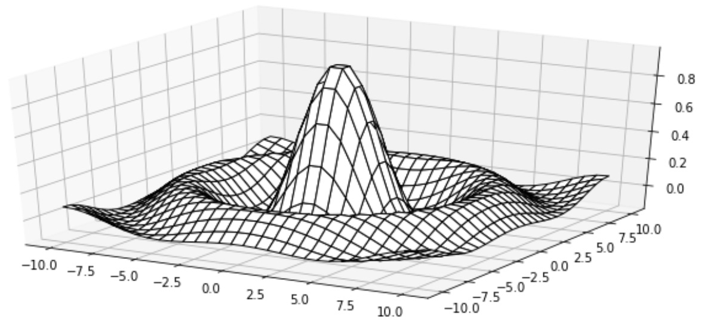
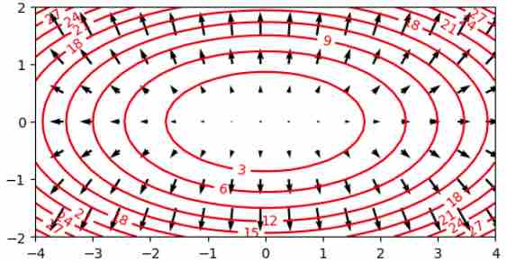
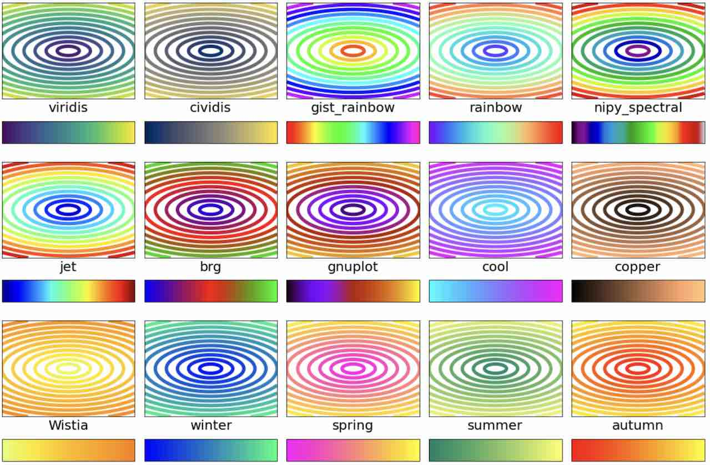
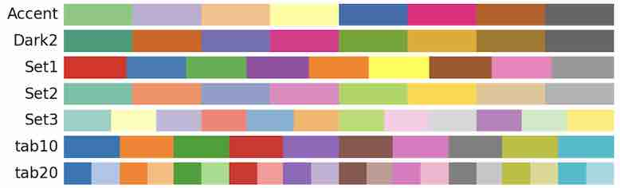

.. include:: rst-include

.. _vidauki-A:

VIÐAUKI A: Python-teikning tvívíðra falla
=========================================

A1. Hæðarlínu- og hæðarsvæðamyndir
----------------------------------

.. rubric:: Hæðarlínur með skipuninni *contour*

Aftast í kafla :numref:`myndir af tvívíðum föllum` var gefið dæmi um teikningu
hæðarlína (*contours*) falls með fallinu ``plt.contour``, þar sem flestir
stýristikar höfðu sjálfgefni gildi. Dæmið sýndi þó hvernig hægt er að tilgreina
litaskala og línubreidd: Litaskali sem heitir *rainbow* var valinn og ennfremur
þriggja punkta línubreidd (1 punktur = 1/72 tomma :math:`\approx` 3.5 mm). Hér
verða nokkrir fleiri stýrimöguleikar kynntir, en fyrst skoðað hvað stikarnir x,
y og z geyma og hvað fallið dularfulla ``np.meshgrid`` gerir.

Skipunin ``plt.contour(x, y, z)`` teiknar hæðarlínur fyrir yfirborð sem lýsir
tvívíðu falli :math:`f` þar sem

.. math::

   z_{ji} = f(x_i, y_j), i = 0,1,2..., j = 0,1,2...

Hér eru ``x`` og ``y`` vigrar með gildum sem spanna svæðið sem teikningin nær
yfir (t.d. úr ``np.linspace``) og ``z`` er fylki með gildum :math:`f` á svæðinu.
Hér hefur stærðfræðilegur ritháttur verið notaður fyrir fylkið og vigrana. Til
að gefa z gildi í Python mætti nota:

.. code:: python

   (nx,ny) = (len(x), len(y))
   z = np.zeros((ny,nx))
   for j in range(ny):
      for i in range(nx):
         z[j,i] = f(x[i], y[j])

Ástæða þess að vísað er í :math:`z_{ji}` en ekki :math:`z_{ij}` er sú að
hefðin býður að vísa í dálka fylkis (sem ganga frá vinstri til hægri) á
eftir línum þess (:math:`z_{ji}` er í :math:`j`-tu línu og :math:`i`-ta
dálki), en í tvívíðu hnitakerfi kemur :math:`x`-hnit (líka frá vinstri til
hægri) á undan :math:`y`-hniti.

Í staðinn fyrir ``for``-lykkjur má líka nota *comprehension*. 

.. code:: python

   z = [[f(xi,yj) for xi in x] for yj in y]

Þetta er bæði einfaldari kóði, og auk þess sleppur maður við að nota þessa
svolítið ruglingslegu röð: :code:`j,i`. Svo er enn einfaldari leið að skrifa:

.. code:: python

   (X,Y) = meshgrid(x,y)
   Z = f(X,Y)

og í framhaldi ``plt.contour(X, Y, Z)``. Til að það virki þarf að gæta þess að
forrita fallið ``f`` þannig að það geti tekið við vigur-viðföngum, sér í lagi
þarf að nota NumPy útgáfur af stærðfræðiföllum sbr. `kafla 10.3
<https://cs.hi.is/python/kafli10/#utreikningur-me-vigrum>`_ í Fyrirlestrarnótum
um Python.

.. rubric:: Stilling á útliti hæðarlínumynda
              
``plt.contour(x, y, z, stiki=gildi,...)`` teiknar hæðarlínur og setur ýmsa
stillingarstika. Helstu stikar eru:

    - ``levels`` tala með fjölda hæðarlína sem teiknaðar eru, eða vigur
      með gildum fallsins sem hæðarlínurnar eru teiknaðar fyrir.
    - ``colors`` litur til að lita allar hæðarlínurnar eins eða vigur af litum,
      t.d. ``['r', 'g', 'b']`` til að lita þær rauða, græna, bláa, rauða, græna,
      bláa,...
    - ``linewidths`` línubreiddir eða línubreidd
    - ``cmap`` tilgreinir litaskala (*colormap*) til að nota; sjá kafla A4.

``c = plt.contour(...)`` og ``plt.clabel(c, fmt="%.0f")`` merkir hverja
hæðarlínu með gildi fallsins á henni. Líka má merkja t.d. aðeins neðstu 5
línurnar með ``plt.clabel(c, c.levels[:5])``

Auk þess að nota stillingarviðföng í kalli á ``contour`` er hægt að stilla stærð
myndar, bæta við titli, merkingum á ása o.fl. með ýmsum Matplotlib- skipunum sem
lýst er í `9. kafla <https://cs.hi.is/python/kafli09/#teikning-me-matplotlib>`_
í Fyrirlestrarnótum um Python.
    
.. admonition:: Sýnidæmi: Hæðarlínur falls
   :class: synidaemi

   Eftirfarandi forrit teiknar hæðarlínur fallsins :math:`f(x,y) = x^2 + 4y^2` á
   rétthyrningnum :math:`[-3,3] \times [-2,2]`. Takið eftir hvernig snið merkinga í
   ``clabel`` er stillt með ``fmt``-stika og einnig skrefin á merkingum y-áss með
   ``plt.yticks``.

       .. code-block:: python
          :caption: Hæðarlínur
          :name: hæðarlínuforrit

          def f(x,y): return x**2 + 4*y**2

          plt.figure(figsize=(6,3))
          x = np.linspace(-4,4,100)
          y = np.linspace(-2,2,50)
          z = np.array([[f(xi,yj) for xi in x] for yj in y])
          c = plt.contour(x, y, z, 8, colors = 'brown')
          plt.clabel(c, fmt="%.0f");
          plt.yticks(np.arange(-2, 3))
          plt.axhline(c='k')
          plt.axvline(c='k');

   .. figure:: myndir/ellipsur.jpg
      :align: center
      :name: ellipsumynd
      :figwidth: 11cm

      Kvaðratískt fall með lággildi í (0,0)
       
.. rubric:: Hæðarsvæði með skipuninni *contourf*

**plt.contourf(x, y, z, stiki=gildi...)** teiknar tvívítt fall með því að lita
svæði eftir gildi þess. Svæði sem eru á milli tveggja samliggjandi hæðarlína sem
``plt.contour`` mundi teikna litast með sama lit og ``contour`` mundi lita neðri
línuna með. Stikarnir ``x, y, z`` eru eins og lýst er fyrir ``contour``, og
stillingarstikarnir ``levels`` og ``colors`` sömuleiðis. Hinsvegar er enginn
``linewidths`` stiki og ekki hægt að nota ``clabel``. 

Eftirfarandi mynd fæst með ``contourf`` í forriti sem er svipað og
:numref:`hæðarlínuforrit`. Öfugt við :numref:`mynd %s <ellipsumynd>` er ekki
hægt að sjá gildi fallsins á þessari mynd. Til þess þarf að bæta við litastiku,
en um þær er fjallað í kafla :ref:`A5 <litastikur>`.

.. figure:: myndir/litaellipsur.png
   :align: center
   :figwidth: 11cm

   Hæðarsvæðamynd

Hægt er að nota ``contourf`` til að búa til myndir þar sem litirnir breytast
samfellt (ekki ósvipað og á heimskortinu á :numref:`mynd %s <jarðarhiti>`) með því
nota hátt gildi á ``levels`` stika, t.d. á bilinu 100–200. Slíkar myndir má líka
búa til með fallinu ``imshow``, sbr. :ref:`fyrsta sýnidæmið <imshow-mynd>` í
kafla A5.

.. _fjarviddarmyndir:

A2. Fjarvíddarmyndir
--------------------

.. rubric:: Netmyndir með *plot_surface*

Til að teikna netmyndir þarf smá undirbúning: Í fyrsta lagi þarf að flytja inn
klasann (*class*) Axes3D í einingunni ``mpl_toolkits.mplot3d`` með skipuninni:

    ``from mpl_toolkits.mplot3d import Axes3D``,

í öðru lagi þarf að búa til fylki ``X`` og ``Y`` sem spanna teiknisvæðið
með skipuninni

    ``(X,Y) = np.meshgrid(x,y)``
    
þar sem ``x`` og ``y`` eru vigrar eins og í kafla A1 og í þriðja lagi þarf að
smíða sérstaklega þrívítt hnitakerfi (ása; *axes*) til að teikna í, með
skipuninni:

    ``ax = plt.subplot(projection = '3d')``

Teikniskipunin ``plot_surface`` sem teiknar sjálfa netmyndina er svo aðferð
(*method*) í ásunum ``ax`` þannig að það er kallað á hana með
``ax.plot_surface``. Þetta er sýnt er í eftirfarandi dæmi, sem teiknar fallið
sem gefið er aftast í kafla :numref:`Myndir af tvívíðum föllum`. Takið eftir að
eins og þegar einvíð föll voru teiknuð þarf að nota np-útgáfur af innbyggðu
föllunum, sem sé `np.sqrt` en ekki `math.sqrt`, til að fallsgildi allra staka í
vigrum reiknist í einu lagi.

    .. code-block:: python
       :caption: Netmynd
       :name: netmyndaforrit
              
       def f(x,y):
           r = np.sqrt(x**2 + y**2)
           return (1 + 4*np.sin(r))/(1 + 4*r)

       x = y = np.linspace(-10,10,30)
       Z = np.array([[f(xi,yj) for xi in x] for yj in y])
       (X,Y) = np.meshgrid(x, y)
       plt.figure(figsize=(12,5))
       ax = plt.subplot(projection='3d')
       ax.plot_surface(X, Y, Z, edgecolor='k', shade=False, color='w');

   Matplotlib netmynd
              
.. attention::
   Tæknilega eru ásarnir ``ax`` hlutur (*object*) af klasatagi (*class type*)
   ``Axes3DSubplot``, eða með öðrum orðum eintak af taginu ``Axes3DSubplot``,
   sem er klasi sem erfist frá klasanum ``Axes3D`` sem aftur erfist frá
   ``Axes``. Þegar klasi er fluttur inn eru skipanir í honum framkvæmdar og því
   getur innflutningur á klösum haft ýmsar hliðarverkanir. Að flytja inn klasann
   ``Axes3d`` hefur þá hliðarverkun að plt.subplot ræður við að smíða þrívíða
   ása.

.. rubric:: Upplýstar myndir með *plot_surface*

Skipunin sem notuð er til að teikna netmyndir, ``plot_surface`` nýtist líka til
að teikna upplýstar myndir. Eftirfarandi mynd fæst með forriti sem er eins og
:numref:`netmyndaforrit` fyrir utan að aftasti stikinn sem linspace fær er
100 og síðustu línunni er skipt út með:

    ``ax.plot_surface(X,Y,Z,color='wheat',rcount=100,ccount=100,antialiased=False)``

.. figure:: myndir/lýstur-hattur.jpg
   :align: center
   :figwidth: 13cm

   Upplýst hattfall
              
.. _teikning-stigla:

A3. Teikning stigla
-------------------
Eins og nefnt var aftast í kafla :numref:`stigull` má teikna stigla með fallinu
``quiver``.

.. admonition:: Sýnidæmi: Teikning stigla
   :class: synidaemi

   Forritið hér að neða teiknar hæðarlínur fallsins

   .. math:: f(x,y) = x^2 + 4y^2
          
   sem teiknað var í kafla A1, og jafnframt stigla þess í sérhverjum punkti í
   rétthyrndu neti.

.. sidebar:: Skýringar

   - ``fx`` og ``fy`` reikna hlutafleiður ``f`` og þar með stigulinn
     (quiver-skipunin vill fá x- og y-hnit vigranna sem á að teikna aðskilin
     í u og v)
   - ``X3`` og ``Y3`` eru með þriðja hvert stak úr ``X`` og ``Y``
     (til að teikna ekki of margar örvar)
   - Eins og í forritinu Netmynd (:numref:`netmyndaforrit`) þarf breytu með
     hnitakerfinu, ``ax``, og hér er náð í hana með ``plt.gca()`` (*get current
     axes*)
   - Með ``ax.set`` er hægt að stilla marga hluti í einu.
   - Nauðsynlegt er að setja ``aspect='equal'`` til að til að stefnur örvanna
     verði réttar. Hér fæst fyrir vikið stigull sem er hornréttur á
     hæðarlínurnar, eins og vera ber.

.. code-block:: python3
   :name: stiglaforrit

   def f(x,y):
       return x**2 + 4*y**2

   def fx(x,y):
       return 2*x

   def fy(x,y):
       return 8*y

   X = np.linspace(-4,4,50)
   Y = np.linspace(-2,2,25)
   X3 = X[::3]
   Y3 = Y[::3]

   z = np.array([[f(x,y) for x in X]
                         for y in Y])
   u = np.array([[fx(x,y) for x in X3]
                          for y in Y3])
   v = np.array([[fy(x,y) for x in X3]
                          for y in Y3])

   c = plt.contour(X, Y, z, 12, colors='red')

   ax = plt.gca()
   ax.set(aspect = 'equal',
          yticks = np.arange(-2,3,1))

   plt.clabel(c, fmt="%.0f");
   plt.quiver(X3, Y3, u, v);

           
.. attention:: Til að skoða lista yfir alla eiginleika (*properties*) sem hægt
   er að stilla með ``ax.set`` má gefa skipunina ``plt.getp(ax)``
           
.. Æfing
.. hint::
   1. Reiknið (á blaði) stigul falls Rosenbrocks

      .. math:: f(x_0, x_1) = (1 - x_0)^2 + 100(x_1 - x_0^2)^2

   2. Reiknið í framhaldi :math:`\nabla f(-1,1)`, :math:`\nabla f(0,1)` og
      :math:`\nabla f(1,1)`. Athugið hvort niðurstöðurnar rími
      við eftirfarandi hæðarlínumynd af fallinu, t.d. með því að
      rissa upp á blaðið stiglana þrjá og hæðarlínur í grennd við þá (styttið
      þá samt svo þeir komist fyrir á blaðinu..

.. figure:: myndir/rosen.jpg
   :figwidth: 13cm
   :name: rosenmynd
   :align: center

   Fall Rosenbrocks

.. _litaskalar:
   
A4. Litaskalar
--------------
Litaskalar (*colormaps*) í tölvugrafík eru ýmist notaðir til að sýna gildi á samfelldum breytum (föllum) eða á flokkunarbreytum sem geta tekið eitt af nokkrum gildum (oftast innan við tíu). Myndirnar sem um ræðir eru oft hæðarlitamyndir, en geta líka verið af annarri gerð, t.d. línurit, punktariti eða súluriti.

Matplotlib hjálpin geymir yfirlit yfir `innbyggða litaskala
<https://matplotlib.org/stable/gallery/color/colormap_reference.html>`_ og
myndir af þeim. Hjálpin flokkar litaskalana í nokkra yfir- og undirflokka.
Yfirflokkarnir eru:

- runu- (*sequential*)
- tvístefnu- (*diverging*)
- lotu- (*cyclic*)
- eigindlegir (*qualitative*)

Fyrstu þrír flokkarnir eru fyrir samfelldar breytur en sá síðasti fyrir
flokkunarbreytur. Tvístefnuskalar gætu e.t.v. hentað til að sýna föll með
tiltekinn núllpunkt (frost og hita), og þriðji flokkurinn fyrir lotubundin föll.
Auk fyrrnefndra fjögurra flokka er í hjálpinni flokkur með yfirskrift **Ýmsir
skalar** (*miscellaneous*) og þar á meðal eru nokkrir skalar sem henta fyrir
samfelldar breytur. Þeir eru settir í flokk með runuskölunum hér.

.. rubric:: Skipanir sem nota litaskala

Hægt er að tilgreina colormap með þeim skipunum sem geta litað gögn eftir
tölugildi. Meðal þessara skipana er skipunin ``plt.scatter`` sem fjallað er um í
9. kafla í `Fyrirlestrarnótum um Python <https://cs.hi.is/python>`_ og auk þess
skipanirnar í köflum A1–A3 hér á undan:

- plt.contour
- plt.contourf
- plt.quiver
- plot_surface

Hægt er að velja með hvaða skala er litað með skipuninni:

    ``plt.set_cmap(skali)``

þar sem ``skali`` er annaðhvort strengur með nafni litaskala eða hlutur af tagi
``Colormap`` (nánar tiltekið ``matplotlib.colors.Colormap``); sjá :ref:`forritið
<contour-dæmi>` aftast í kafla :numref:`myndir af tvívíðum föllum`. Önnur leið
er að tilgreina skalann um leið og teiknað er, en allar framangreindar skipanir
eru með valkvæðan stika, ``cmap`` sem nota má til að velja skalann.

.. rubric:: Samfelldir skalar

Sjálfgefni skalinn í Matplotlib kallast *viridis* og hér er mynd af honum:

.. figure:: myndir/viridis.jpg
   :figwidth: 7cm
   :align: center

   Viridis litaskalinn

Skalinn byrjar með dökkbláum lit og færir sig samfellt í gegn um bláa og græna
liti yfir í gulan. Hægt er að skipta samfelldu skölunum í tvo flokka: Þá sem eru
enda á hvítum lit eða a.m.k. mjög ljósum lit og þá sem enda á aðeins dekkri lit.
Skalarnir sem enda á (nánast) hvítum lit henta ekki til að teikna punktarit eða
línurit á hvítum bakgrunni, en gætu hentað fyrir hæðarlitamyndir (sbr. landakort
þar sem hæstu fjallatindar eru hvítir). Meðal hinna skalanna eru nokkrir
marglitir, sumir með liti í svipaðri röð og í regnboganum og nokkrir þar sem
allir litirnir hafa sama tón eða annan af tveimur. Eftirfarandi mynd sýnir
hæðarlínur fallsins :math:`f(x,y) = \sqrt{x^2 + 3y^2}` með 15 skölum í seinni
flokknum:

   Samfelldir litaskalar sem henta fyrir línurit og punktarit

(`vinnubók
<https://colab.research.google.com/drive/1r2pmaixKblROOM18OxNWYUFW5ZiEVs7l?usp=sharing>`_
til að búa myndina til). Af ein- og tvítóna skölum líta t.d. *copper*, *winter*
og *viridis* (sá sjálfgefni) vel út, en af litríkari skölum t.d. *gnuplot*,
*rainbow* og jafnvel *nipy_spectral*.

.. rubric:: Flokkunarskalar

Flokkunarskalarnir (þeir eigindlegu, *qualitative*) sem eru innbyggðir í
Matplotlib eru m.a. *Accent*, *Dark2* og *Set2* með 8 litum hver, *Set1* með 9
litum, tab10 með 10 litum, Set3 með 12 litum og tab20 með 20 litum. Litir
þessara skala eru misvel aðgreinanlegir, en Set1 er allgóður fyrir allt að 9
liti (með því að dekkja gula litinn í honum smávegis), og tab20 er þokkalega góður
óbreyttur fyrir allt að 20 liti.

   Nokkrir flokkunarskalar

Sá galli er á notkun þessara innbyggðu litaskala er að þeir duga illa nema
fjöldi hópa sem teikna skal sé nákvæmlega jafn fjöldanum í skölunum. Til að bæta
úr því má búa til litaskala með tilteknum litafjölda, allt að 20, með
eftirfarandi falli:

.. code:: Python
          
   def qcmap(n):
      # Fjölgun scatter-lita upp í allt að 20
      # Bætið viðfangi 'cmap=qcmap(n)' við plt.scatter kall
      import matplotlib.colors as clrs
      use_cmap = 'Set1' if n <= 9 else 'tab20' 
      cmap = plt.get_cmap(use_cmap)(range(n))
      if n > 5: cmap[5] = [0.95, 0.75, 0, 1]  # dekkja gula litinn
      return clrs.LinearSegmentedColormap.from_list("",cmap,n)

Dæmi um flokkun hópa og notkun þessa falls er í sýnidæminu aftast í næsta kafla.

.. _litastikur:

A5. Litastikur
--------------
Við höfum þegar séð nokkur dæmi um litastikur (*colorbars*), í `kafla 13.6 <https://cs.hi.is/python/kafli13/#id3>`_ og í `verkefni 15
<https://cs.hi.is/python/verkefni/?highlight=colorbar#hiti-og-urkoma>`_ í
Python-nótunum og aftast í kafla :numref:`myndir af tvívíðum föllum` í þessum
nótum. Hlutverk litastika er að sýna hvaða talnagildi eða fallsgildi samsvara
hvaða lit og að vissu leyti svara þau til merkinga x-ás og y-ás sem sýna hvar í
planinu tiltekin hnit eru. Til að setja litastiku með sjálfgefnum stillingum
hægra megin við þá mynd sem síðast var teiknuð má nota aðra af eftirfarandi skipunum:

    ``colorbar()`` |br|
    ``cb = colorbar()``

Hluturinn ``cb`` verður af taginu ``Colorbar``. Í hæðarsvæða- og hæðarlínumyndum
er sjálfkrafa notaður flokkunarskali (reyndar ekki einn af þeim sem taldir
eru í kaflanum á undan, heldur eru notaðir jafnt dreifir litir úr *viridis*
eða skala sem valinn hefur verið með ``plt.set_cmap``). Næstu töflur sýna nokkrar af
þeim stillingum sem í boði eru; sú fyrri sýnir stika í ``colorbar`` og sú seinni
stillingar sem nota ``cb``.

.. list-table:: Helstu stikar í ``colorbar``
   :widths: auto
   :align: center

   * - ``aspect=10``
     - breidd litastikunnar verður 1/10 af lengd hennar (sjálfgefið 1/20)

   * - ``fraction=0.1``
     - stillir stærð stiku (hlutfall stikubreiddar af breidd myndar).

   * - ``drawedges=True``
     - teiknar svartar línur á litamörkum í flokkunarskala 

   * - ``orientation='horizontal'``
     - sýna stikuna lárétta neðan við mynd

   * - ``pad=0.10``
     - stilla bil milli myndar og stiku (sjálfgefið 0.05 eða 0.15 fyrir undirstiku)

   * - ``label=strengur``
     - setur textaskýringu við stikuna

   * - ``ticks=[1,2,3,4]``
     - setja *tick*-merkingar við talnagildi 1, 2, 3, 4

   * - ``format="%.2f"``
     - sýna *tick* merkingar með 2 aukastöfum

.. list-table:: Litastikustillingar eftirá
   :widths: auto
   :align: center

   * - ``cb.set_ticklabels([1,2,3])`` |br|
       ``cb.set_ticklabels(["A","B","C"])``
     - *tick*-merkingar verða 1, 2, 3 eða A, B, C

   * - ``cb.ax.tick_params(size=0)``
     - lengd strika við *tick*-merkingar verða 0 punktar (þau hverfa)

   * - ``cb.ax.set_ylim(ybeg, yend)``
     - setja talnagildi þar sem stikan byrjar og endar

   * - ``cb.outline.set_visible(False)``  
     - fjarlægja ramma utan um stiku

Eftirfarandi sýnidæmi sýna ýmsar af framangreindum skipunum að verki. Notaðar
eru mismunadi aðferðir til að sýna fallið sem teiknað er á :numref:`mynd
%s<litaskalamynd>`, :math:`f(x,y) = \sqrt{x^2 + 3y^2}` (en reyndar ekki á sama
svæði og þar).

Skipanir sem búa til X, Y og Z fylki sem lýsa fallinu eru aðeins hafðar með í
fyrsta sýnidæminu, og vigur F með fallsgildum á hæðarlínum og mörkum
hæðarsvæða er líka bara búinn til þar. Gildi F eru einnig merkt inn á
tilheyrandi litastikur.

.. _imshow-mynd:

.. admonition:: Sýnidæmi: Samfelld litamynd með **imshow**
   :class: synidaemi

   .. code:: python

      def f(x,y):
          return np.sqrt(x**2 + 3*y**2)

      x = np.linspace(-2, 7, 100)
      y = np.linspace(-1, 6, 100)
      (X,Y) = np.meshgrid(x,y)
      Z = f(X,Y)
      zmax = np.max(Z)
      F = range(0, math.ceil(zmax)+1)

      plt.imshow(Z, cmap="gnuplot", extent=(-2,7,-1,6), origin='lower')
      plt.xticks(range(-2,8))
      plt.colorbar(aspect=15, ticks=F, fraction=0.05)
      plt.clim(0,zmax)

   .. figure:: myndir/imshow.jpg
      :figwidth: 10 cm
      :align: center

   Nokkur atriði þarfnast útskýringar:

   - Sjálfgefin mörk litaskala er spann Z-gildanna, en þar sem það nær ekki alveg
     niður í núll vegna afrúnningsskekkju er bætt við ``clim``-skipun (*color
     limits*) til að hafa núll með.

   - Án stillingarinnar ``origin='lower'`` mundi núllpunktur hnitakerfisins vera
     efst til vinstri og y-ásinn stefna niður. Það væri viðeigandi þegar
     skipunin ``imshow`` er notuð til að birta myndir úr myndaskrám (t.d.
     ljósmyndir).

   - Loks dugar ``fraction=0.05`` til að litastikan hafi rétta lengd. Þessi
     stilling er reyndar dálítið dularfull og öll gildi frá 0.05 til 0.12 gefa
     stikunni rétta lengd. Flóknari aðferð til að fá stiku af réttri lengd er
     rædd í þessu `stackoverflow-svari
     <https://stackoverflow.com/a/33505522/256368>`_.

.. admonition:: Sýnidæmi: Hæðarsvæðamynd með **contourf**
   :class: synidaemi

   .. code:: python

      plt.contourf(X, Y, Z, levels=F, cmap="gnuplot")
      plt.clim(0,zmax)
      plt.xticks(range(-2,8))
      cb = plt.colorbar(ticks=F, label='fallsgildi')

   Þetta forrit skýrir sig að mestu sjálft, og hér er myndin sem það býr til:
      
   .. figure:: myndir/contourf-litastika.jpg
      :figwidth: 10.5 cm
      :align: center
              
.. admonition:: Sýnidæmi: Hæðarlínumynd með **contour**
   :class: synidaemi

   .. code:: python

      lev = F[1:-1]
      plt.contour(X, Y, Z, levels=lev, cmap="gnuplot", linewidths=3)
      plt.xticks(range(-2,8))
      cb = plt.colorbar(aspect=15, ticks=lev)
      cb.outline.set_visible(False)
      cb.ax.tick_params(size=0)
      cb.ax.set_ylim(min(lev)-0.1, max(lev)+0.1);
      
   Í ``lev`` er bæði fyrsta og síðasta fallsgildinu í ``F`` sleppt. Þessi gildi
   þarf að hafa með í ``contourf``, því þau afmarka lægsta svæðið og það hæsta,
   en ekki í ``contour`` sem aðeins teiknar mörk milli svæða. Án öftustu
   línunnar mundu efstu og neðstu strikin í litastikunni verða of mjó.

   .. figure:: myndir/contour-litastika.jpg
      :figwidth: 10 cm
      :align: center

Hér er `Colab-vinnubók
<https://colab.research.google.com/drive/19Ug3yV0T4xLKec5lvGz7dTXuihVTzP2I?usp=sharing>`_
með framangreindum sýnidæmum. Í vinnubókinni eru tveir forritsbútar í viðbót sem
teikna sama fall, annar sýnir hvernig nota má contourf til að búa til samfellda
litamynd og hinn hvernig hægt er að afmarka hæðarsvæði með mjóum svörtum línum.

.. admonition:: Æfing: Litaskalar og -stikur
   :class: aefing

   Opnið vinnubókina með sýnidæmunum og prófið ykkur áfram með að breyta
   stillingum myndanna.

Aftast í vinnubókinni er svo eftirfarandi sýnidæmi sem sýnir notkun flokkunarskala og
fallsins ``qcmap`` sem gefið var aftast í kafla A4.

.. admonition:: Sýnidæmi: Flokkun ára eftir veðri
   :class: synidaemi

   .. code:: Python

      (ár,hiti,úrkoma) = np.loadtxt("http://cs.hi.is/python/hiti-urkoma.txt").T
      kóði = []
      for (h,ú) in zip(hiti,úrkoma):
        kóði.append(
          0 if h > 4.5 else 
          1 if h < 3.5 else 
          2 if ú > 700 else
          3)
      lbl = ['hlý ár', 'köld ár', 'blaut ár', 'þurr ár'];
      plt.scatter(hiti, úrkoma, c=kóði, cmap=qcmap(4))
      plt.xlabel('hiti'), plt.ylabel('úrkoma')
      cb = plt.colorbar(ticks=range(4))
      cb.set_ticklabels(lbl)
      cb.ax.tick_params(size=0)
      plt.clim(-0.5,4-0.5)
      plt.grid()

   .. figure:: myndir/flokkun.jpg
      :figwidth: 11 cm
      :align: center
      
.. admonition:: Æfing: 
   :class: aefing

   Breytið síðasta falli þannig árin séu flokkuð í 9 flokka.
              
.. admonition:: Æfing:
   :class: aefing

   Teiknið ýmsar myndir af fallinu sem gefið er aftast í kafla :numref:`myndir
   af tvívíðum föllum`:

   .. math:: f(x,y) = \dfrac{3}{1+(x-2)^2+(y-3)^2} - \dfrac{4}{1 + x^2 + y^2}
             
   (samfellt litaða mynd, hæðarsvæðamynd, hæðarlínumynd). Prófið nokkra
   litaskala, bætið við litastiku, fjölgið hæðarlínum, o.s.frv.
