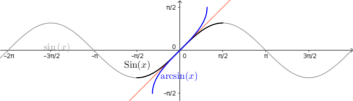

Torræð föll
===========

.. note::
	**Nauðsynleg undirstaða**
	
	- hornaföll

        - :ref:`andhverfur falla <andhverfa>`

*We are stuck with technology when what we really want is just stuff that works.*

\- Douglas Adams, The Salmon of Doubt

----------

Náttúrlegi logrinn
------------------

.. index::
    logri

Skilgreining: Náttúrlegi logrinn
~~~~~~~~~~~~~~~~~~~~~~~~~~~~~~~~

Látum :math:`A_{x_0}` tákna flatarmál svæðisins sem afmarkast af
:math:`x`-ás, grafinu :math:`y=\frac{1}{x}` og línunum :math:`x=1` og
:math:`x=x_0`. Þá skilgreinum við :hover:`náttúrlega logrann,náttúrlegur logri` með formúlunni

.. math::

   \ln x_0 =\left\{\begin{array}{ll}
   A_{x_0} & \text{ef }x_0 \geq 1,\\
   -A_{x_0} & \text{ef }0<x_0<1.
   \end{array}
   \right.

.. ggb:: j2UHkvOM
    :width: 700
    :height: 400
    :img: 01_ln.png
    :imgwidth: 12cm
    :zoom_drag: false

.. warning::
    Fallið :math:`\ln` er bara skilgreint fyrir jákvæðar rauntölur

    
Setning
~~~~~~~
Náttúrlegi logrinn er diffranlegur og afleiðan uppfyllir

.. math:: \frac{d}{dx}\ln x=\frac{1}{x}.

Af þessu fylgir að logrinn er samfellt fall. 

Setning
~~~~~~~

Fyrir allar tölur :math:`x,y>0` gildir að:

(i)   :math:`\ln(1) = 0`

(ii)  :math:`\ln(xy)=\ln x+\ln y`

(iii) :math:`\ln(1/x)=-\ln x`

(iv)  :math:`\ln(x/y)=\ln x-\ln y`

(v)   :math:`\ln (x^r)=r\ln x`, fyrir :math:`r \in mathbb Q`.

.. index::
    veldisvísisfallið

Veldisvísisfallið
-----------------

Setning
~~~~~~~

Fallið :math:`\ln x` er strangt vaxandi og þar með eintækt.

Skilgreining: Veldisvísisfallið
~~~~~~~~~~~~~~~~~~~~~~~~~~~~~~~

:hover:`Veldisvísisfallið,veldisvísisfall`, :math:`\exp x`, er skilgreint sem andhverfa fallsins
:math:`\ln x`. Skilgreiningarsvæði :math:`\exp x` er jafnt myndmengi
:math:`\ln x` sem er :math:`{{\mathbb  R}}`. Myndmengi :math:`\exp x` er
jafnt skilgreiningarsvæði :math:`\ln x` sem er bilið :math:`(0,\infty)`.

.. image:: ./myndir/kafli04/02_ln-exp.png
	:align: center
	:width: 12cm

.. index:: 
    e
    veldisvísisfallið; e

Skilgreining: Talan :math:`e`
~~~~~~~~~~~~~~~~~~~~~~~~~~~~~

Skilgreinum töluna með :math:`e=\exp 1`.

Það þýðir að :math:`\ln(e)=1`, og talan :math:`e` ákvarðast þess vegna
af því að flatarmál svæðisins milli :math:`x`-ás og grafs
:math:`\frac 1x` á bilinu :math:`[1,e]` sé 1.

.. image:: ./myndir/kafli04/02_ln-e.png
	:align: center
	:width: 12cm

.. note::
    **Hver er munurinn á** :math:`e^x` **og** :math:`\exp(x)` **?**

    :math:`e^x` er aðeins skilgreint þegar :math:`x` er ræð tala, en
    :math:`\exp(x)` er skilgreint fyrir allar rauntölur því logrinn,
    :math:`\ln:(0,\infty)\to {{\mathbb  R}}`, er átækur.

    Það er hins vegar hægt að sýna að 

    .. math::

        \exp(x)=\lim_{r\to x, r\text{ ræð tala}} e^r.

    Því er eðlilegt að rita fyrir rauntölu :math:`x`, hvort sem hún er ræð
    eða óræð, að :math:`e^x=\exp x`. Þannig að héðan í frá gerum við engan
    greinarmun á :math:`e^x` og :math:`\exp x`, við notum bara það sem lítur
    betur út fagurfræðilega.

.. note::
    Athugið að
    
    .. math::
    
        e^{\ln x}=x \text{ fyrir allar tölur }x>0\qquad \text{og}
        \qquad \ln(e^x)=x  \text{ fyrir allar tölur }x.

Eiginleikar veldisvísisfallsins
~~~~~~~~~~~~~~~~~~~~~~~~~~~~~~~

Út frá eiginleikum lograns fáum við svo eftirfarandi

(i)   :math:`e^0=1`,

(ii)  :math:`e^{x+y}=e^x e^y`,

(iii) :math:`e^{-x}=\frac{1}{e^x}`,

(iv)  :math:`e^{x-y}=\frac{e^x}{e^y}`,

(v)   :math:`\left(e^x\right)^y=e^{xy}`, fyrir :math:`y \in \mathbb Q`.

.. note::
    **Hænan eða eggið?** Hér höfum við nálgast :math:`\ln` og :math:`\exp`
    þannig að við byrjum á að skilgreina :math:`\ln` með heildi (flatarmáli)
    og finnum svo andhverfu lograns, :math:`\exp`.

    Einnig væri mögulegt að byrja á því að sýna að :math:`e^x` sé vel
    skilgreint, ekki bara fyrir ræð :math:`x` heldur einnig óræð. Það myndum
    við gera með því að nota markgildið 
    :math:`\exp(x)=\lim_{r\to x, r\text{ ræð tala}} e^r`
    hér að ofan, og taka þá :math:`e^x` sem
    skilgreiningu á :math:`\exp x` og finna svo andhverfuna, :math:`\ln`.

    Báðar þessar aðferðir hafa kosti og galla, en við notum þá fyrri vegna
    þess að hún gefur myndræna framsetningu á logranum.

Önnur veldisvísisföll og lograr
-------------------------------

.. index:: 
    veldisvísisfallið; grunntala

Skilgreining
~~~~~~~~~~~~

Fyrir tölu :math:`a>0` og rauntölu :math:`x` skilgreinum við

.. math:: a^x=e^{x\ln a}.

.. index::
    logri; grunntala

Skilgreining
~~~~~~~~~~~~

Andhverfa fallsins :math:`a^x` er kölluð *logri með grunntölu* :math:`a`
og táknuð með :math:`\log_a x`. Fallið :math:`\log_a x` er skilgreint
fyrir öll :math:`x>0`.

Athugasemd
~~~~~~~~~~

.. math::

   y =\log_a(x)\qquad \text{ þá og því aðeins að } \qquad x = a^y.

Setning
~~~~~~~

Fyrir rauntölu :math:`a>0` og allar rauntölur :math:`x,y` gildir að:

(i)   :math:`a^0=1`

(ii)  :math:`a^1=a`

(iii) :math:`a^{x+y}=a^xa^y`

(iv)  :math:`a^{-x}=\frac{1}{a^x}`

(v)   :math:`a^{x-y}=\frac{a^x}{a^y}`

(vi)  :math:`\big(a^x\big)^y=a^{xy}`

(vii) :math:`(ab)^x=a^xb^x` (hér er forsenda að :math:`b>0`).

Fyrir rauntölu :math:`a>0` og allar rauntölur :math:`x,y` gildir að:

(i)   :math:`\log_a 1=0`

(ii)  :math:`\log_a a = 1`

(iii) :math:`\log_a(xy)=\log_a x+\log_a y`

(iv)  :math:`\log_a (1/x)=-\log_a x`

(v)   :math:`\log_a (x/y)=\log_a x-\log_a y`

(vi)  :math:`\log_a (x^y)=y\log_a x`

(vii) :math:`\log_a x=\frac{\log_b x}{\log_b a}` (hér er forsenda að
      :math:`b>0`).

Eiginleikar veldisvísisfalla og logra
-------------------------------------

Setning
~~~~~~~

(i)   :math:`\frac{d}{dx}\ln x=\frac 1x`

(ii)  :math:`\frac{d}{dx}e^x=e^x`

(iii) :math:`\frac{d}{dx}a^x=(\ln a)a^x`

(iv)  :math:`\frac{d}{dx}\log_a x=\frac{1}{(\ln a)x}`

Setning
~~~~~~~

Ef :math:`a>0` þá er

(i)   :math:`\lim_{x\to \infty} \frac{x^a}{e^x} = 0`

(ii)  :math:`\lim_{x\to \infty} \frac{\ln(x)}{x^a} = 0`

(iii) :math:`\lim_{x\to -\infty} |x|^a e^x = 0`

(iv)  :math:`\lim_{x\to 0^+} x^a\, \ln(x) = 0`

.. note::
    Athugið að setningin að ofan gildir óháð því hversu stórt :math:`a` er
    (liðir 1 og 3) eða hversu lítið :math:`a` er (liðir 2 og 4).

    Með öðrum orðum:
    
    - Veldisvísisföll vaxa hraðar en allar margliður. 
    
    - Lograr vaxa hægar en allar margliður.

Andhverfur hornafalla
---------------------

Andhverfa sínus
~~~~~~~~~~~~~~~

Fallið :math:`\sin(x)` skilgreint á öllum rauntalnaásnum er ekki eintækt
og á sér því ekki andhverfu.

Við getum hins vegar takmarkað okkur við hálfa lotu, þ.e. skoðum bara
:math:`x\in [-\frac \pi 2, \frac \pi 2]`. :math:`\sin(x)` takmarkað við
þetta bil táknum við með :math:`{{\text{Sin}}}(x)`.
:math:`{{\text{Sin}}}` er strangt vaxandi og því eintækt á þessu bili,
og hefur þar af leiðandi andhverfu.

Skilgreining: arcsin
~~~~~~~~~~~~~~~~~~~~

*Andhverfa sínussins*, táknuð :math:`\arcsin(x)` (eða
:math:`\sin^{-1}(x)`), er andhverfa :math:`{{\text{Sin}}}` og hefur því
myndmengið :math:`[-\frac \pi 2, 
\frac \pi 2]` og skilgreiningarmengið :math:`[-1,1]`.

Andhverfa kósínus
~~~~~~~~~~~~~~~~~

Fallið :math:`\cos(x)` skilgreint á öllum rauntalnaásnum er ekki eintækt
og á sér því ekki andhverfu.

Við getum hins vegar takmarkað okkur við hálfa lotu, þ.e. skoðum bara
:math:`x\in [0, \pi]`. :math:`\cos(x)` takmarkað við þetta bil táknum
við með :math:`{{\text{Cos}}}(x)`. :math:`{{\text{Cos}}}` er strangt
minnkandi og því eintækt á þessu bili, og hefur þar af leiðandi
andhverfu.

Skilgreining: arccos
~~~~~~~~~~~~~~~~~~~~

*Andhverfa kósínussins*, táknuð :math:`\arccos(x)` (eða
:math:`\cos^{-1}(x)`), er andhverfa :math:`{{\text{Cos}}}` og hefur því
myndmengið :math:`[0,\pi]` og skilgreiningarmengið :math:`[-1,1]`.

.. image:: ./myndir/kafli04/05_arccos.png
	:align: center
	:width: 12cm

Andhverfa tangens
~~~~~~~~~~~~~~~~~

Fallið :math:`\tan(x) = \frac{\sin(x)}{\cos(x)}` skilgreint á
:math:`\{x \in {{\mathbb  R}}; x \neq \pi k + \frac \pi 2, k \in {{\mathbb Z}}\}`
er ekki eintækt og á sér því ekki andhverfu.

Við getum hins vegar takmarkað okkur við eina lotu, þ.e. skoðum bara
:math:`x\in (-\frac \pi 2, \frac \pi 2)`. Athugið að hér eru endapunktar
bilsins ekki með. :math:`\tan(x)` takmarkað við þetta bil táknum við með
:math:`{{\text{Tan}}}(x)`. :math:`{{\text{Tan}}}` er strangt vaxandi og
því eintækt á þessu bili, og hefur þar af leiðandi andhverfu.

Skilgreining: arctan
~~~~~~~~~~~~~~~~~~~~

*Andhverfa tangensins*, táknuð :math:`\arctan(x)` (eða
:math:`\tan^{-1}(x)`), er andhverfa :math:`{{\text{Tan}}}` og hefur því
myndmengið :math:`(-\frac \pi 2,
\frac \pi 2)` og skilgreiningarmengið :math:`(-\infty,\infty)`. Þar að
auki þá er
:math:`\lim_{x\to \infty} \arctan(x) = \frac \pi 2` og
:math:`\lim_{x\to -\infty} \arctan(x) = -\frac \pi 2`.

.. image:: ./myndir/kafli04/05_arctan.png
	:align: center
	:width: 12cm

Setning
~~~~~~~

(i)   :math:`\frac d{dx} \arcsin(x) = \frac 1{\sqrt{1-x^2}}`

(ii)  :math:`\frac d{dx} \arccos(x) = \frac {-1}{\sqrt{1-x^2}}`

(iii) :math:`\frac d{dx} \arctan(x) = \frac 1{1+x^2}`

Breiðbogaföll
-------------

Skilgreining: cosh og sinh
~~~~~~~~~~~~~~~~~~~~~~~~~~

Við skilgreinum :hover:`breiðbogasínus`, :math:`\sinh`, og :hover:`breiðbogakósínus`,
:math:`\cosh`, með eftirfarandi formúlum

.. math::

   \begin{aligned}
   \sinh(x) &= \frac{e^x - e^{-x}}2,\\
   \cosh(x) &= \frac{e^x + e^{-x}}2.\end{aligned}

.. image:: ./myndir/kafli04/06_sinh-cosh.png
	:align: center
	:width: 12cm

Setning
~~~~~~~

(i)  :math:`\frac d{dx} \sinh(x) = \cosh(x)`

(ii) :math:`\frac d{dx} \cosh(x) = \sinh(x)`

.. warning:: 
    Það er enginn mínus í afleiðu :math:`\cosh` eins og í afleiðu :math:`\cos`.

Setning
~~~~~~~

(i)    :math:`\sinh(0) = 0` og :math:`\cosh(0) = 1`

(ii)   :math:`\cosh^2(x) - \sinh^2(x) = 1`

(iii)  :math:`\sinh(-x) = -\sinh(x)`

(iv)   :math:`\cosh(-x) = \cosh(x)`

(v)    :math:`\sinh(x+y) = \sinh(x)\cosh(y) + \cosh(x)\sinh(y)`

(vi)   :math:`\cosh(x+y) = \cosh(x)\cosh(y) + \sinh(x)\sinh(y)`

(vii)  :math:`\cosh(2x) = \cosh^2(x) + \sinh^2(x) = 1+2\sinh^2(x) = 2\cosh^2(x)-1`

(viii) :math:`\sinh(2x) = 2\sinh(x)\cosh(x)`

Skilgreining: tanh
~~~~~~~~~~~~~~~~~~

Við skilgreinum :hover:`breiðbogatangens` með

.. math:: \tanh(x) = \frac{\sinh(x)}{\cosh(x)}

Setning
~~~~~~~

(i)   :math:`\tanh(x) = \frac{e^x-e^{-x}}{e^x+e^{-x}}`

(ii)  :math:`\frac d{dx} \tanh(x) = \frac{1}{\cosh^2(x)}`

(iii) :math:`\lim_{x\to \infty} \tanh(x) = 1`

(iv)  :math:`\lim_{x\to -\infty} \tanh(x) = -1`

Andhverfur breiðbogafalla
-------------------------

Andhverfa breiðbogasínussins og breiðbogatangensins
~~~~~~~~~~~~~~~~~~~~~~~~~~~~~~~~~~~~~~~~~~~~~~~~~~~

Af Setningum 4.6.2 (1) og 4.6.5 (2) sjáum við að afleiður :math:`\sinh` og
:math:`\tanh` eru jákvæðar og föllin því stranglega vaxandi. Þau eru þar
með eintæk og eiga sér andhverfur.

Skilgreining
~~~~~~~~~~~~

:hover:`Andhverfa breiðbogasínussins,andhverfur breiðbogasínus`, 
táknuð :math:`{{\text{arsinh}}}(x)` (eða
:math:`\sinh^{-1}(x)`), er andhverfa :math:`\sinh` og hefur myndmengið
:math:`(-\infty,\infty)` og skilgreiningarmengið
:math:`(-\infty,\infty)`. Þar að auki þá er

.. math:: {{\text{arsinh}}}(x) = \ln\left(x+\sqrt{x^2+1}\right)

.. todo:: 
    mynd

:hover:`Andhverfa breiðbogatangensins,andhverfur breiðbogatangens`, 
táknuð :math:`{{\text{artanh}}}(x)`
(eða :math:`\tanh^{-1}(x)`), er andhverfa :math:`\tanh` og hefur
myndmengið :math:`(-\infty,\infty)` og skilgreiningarmengið
:math:`(-1,1)`. Þar að auki þá er

.. math:: {{\text{artanh}}}(x) = \frac 12 \ln\left(\frac{1+x}{1-x}\right)

.. todo::
    mynd

Andhverfa breiðbogakósínussins
~~~~~~~~~~~~~~~~~~~~~~~~~~~~~~

Þar sem :math:`\cosh` er ekki eintækt fall þá verðum við að beita
svipuðum aðferðum eins og þegar við fundum :math:`\arcsin` til þess að
finna andhverfu þess. 
Það er, við þurfum að takmarka skilgreiningarmengi
þess.

Táknum :math:`\cosh(x)` takmarkað við bilið :math:`[0,\infty)` með
:math:`{{\text{Cosh}}}(x)`. Fallið :math:`{{\text{Cosh}}}` er strangt
vaxandi og því eintækt á þessu bili, og á sér þar með andhverfu.

Skilgreining
~~~~~~~~~~~~

:hover:`Andhverfa breiðbogakósínussins,andhverfur breiðbogakósínus`, táknuð :math:`{{\text{arcosh}}}(x)`
(eða :math:`\cosh^{-1}(x)`), er andhverfa :math:`{{\text{Cosh}}}` og
hefur því myndmengið :math:`[0,\infty)` og skilgreiningarmengið
:math:`[1,\infty)`. Þar að auki þá er

.. math:: {{\text{arcosh}}}(x) = \ln\left(x+\sqrt{x^2-1}\right)

.. image:: ./myndir/kafli04/07_arcosh.png 
	:align: center
	:width: 12cm

Í framtíðinni
~~~~~~~~~~~~~

Við höfum séð að veldisvísisfallið og logrinn tengjast breiðbogaföllunum
töluvert og það sama á við um hornaföllin. Seinna, nánar tiltekið í
Stærðfræðigreiningu III, þá sjáið þið að hornaföllin og breiðbogaföllin
eru bara mismunandi hliðar á veldisvísisfallinu.

.. image:: ./myndir/kafli04/07_exp.png
	:align: center
	:width: 10cm

