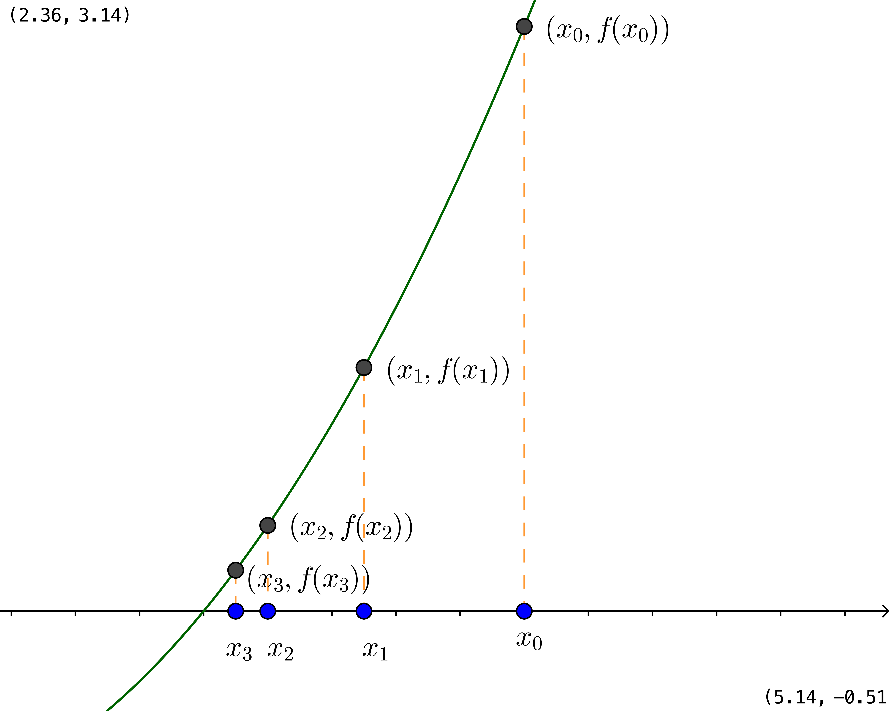

Hagnýting á diffrun
===================

.. admonition:: Nauðsynleg undirstaða
  :class: athugasemd

	- Föll

	- Markgildi

	- Afleiður

------

.. epigraph::

  *Then darkness took me, and I strayed out of thought and time, and I wandered
  far on roads that I will not tell. Naked I was sent back – for a brief time,
  until my task is done.*

  \– Gandalf, The Two Towers

------

Línulegar nálganir
------------------

Staðbundnar nálganir
~~~~~~~~~~~~~~~~~~~~

Skoðum diffranlegt fall :math:`f` í grennd um fastan punkt
:math:`a`. Látum :math:`x` vera punkt í grennd um :math:`a`.
Ef graf fallsins er ekki „mjög
sveigt“ þá er snertillinn við :math:`(a,f(a))` *næstum* samsíða
sniðlinum gegnum :math:`(a,f(a))` og :math:`(x,f(x))`.
Það þýðir að

.. math::
   \begin{aligned}
        \frac{f(x)-f(a)}{x-a} &\approx f'(a),\\
        f(x)-f(a) &\approx  f'(a)(x-a),\\
        f(x) &\approx f(a)+f'(a)(x-a).
   \end{aligned}

.. admonition:: Aðvörun
 :class: advorun

  Athugið að hér er :math:`a` fast en :math:`x` breytist.

.. admonition:: Athugasemd
  :class: athugasemd

  Einnig er hægt að skrifa þetta á eftirfarandi hátt.
  Setjum :math:`\Delta x = x-a` og
  :math:`\Delta y = f(x) - f(a)` þá þýðir þetta að
  :math:`\Delta y \approx \Delta x f'(a)`.

  Það er, breytingin á fallgildinum er um það bil breytingin í
  breytunni margfaldað við afleiðuna í punktinum.

Skilgreining: Línuleg nálgun
~~~~~~~~~~~~~~~~~~~~~~~~~~~~

.. admonition:: Skilgreining
  :class: skilgreining

  Línuleg nálgun á falli :math:`f` nálægt :math:`a`, eða 1. stigs
  Taylor-margliða :math:`f` (sjá kafla. 10 um Taylor-margliður) í :math:`a`, er gefin með
  :math:`y=f(a)+f'(a)(x-a)`.

Dæmi: Línuleg nálgun
~~~~~~~~~~~~~~~~~~~~

.. admonition:: Dæmi
  :class: daemi

  Finnum línulega nálgun fyrir fallið :math:`f(x)=\frac{1}{x}` í punktinum :math:`a=2`.

.. admonition:: Lausn
  :class: daemi, dropdown

  Athugum að :math:`f'(x)=-\frac{1}{x^2}` svo :math:`f'(2)=-\frac{1}{4}` og
  að :math:`f(a)=\frac{1}{2}`. Því fæst skv. skilgreiningu að línuleg nálgun
  fallsins í punktinum :math:`a=2` sé

  .. math:: y=\frac{1}{2}-{1}{4}(x-2).

Diffur
~~~~~~

Línulegar nálganir geta einnig verið notaðar til að ákvarða diffur, sem getur hjálpað
okkur að meta hve mikið fallgildið breytist við smáa breytingu á inntaki fallsins.
Þetta má gera með því að líta á Leibniz ritháttinn :math:`dy/dx` þannig að :math:`dy`
og :math:`dx` séu sjálfstæðar breytur (ekki bara táknræn fyrir afleiðuna). Þá
gildir fyrir fallið :math:`y=f(x)` að hægt er að taka afleiðuna hvoru megin og
fæst þá

.. math:: \frac{dy}{dx}=f'(x).

Þar sem við lítum á :math:`dy` og :math:`dx` sem breytur þá getum við margfaldað
í gegnum jöfnuna með :math:`dx` og fáum

.. math:: dy = f'(x)dx.

Mikilvægt er að athuga að hér er :math:`dy` fall af bæði :math:`x` og :math:`dx`.
Stæðurnar :math:`dy` og :math:`dx` eru kallaðar *diffur* eða *deildi*.

Dæmi: Diffur
~~~~~~~~~~~~

.. admonition:: Dæmi
  :class: daemi

  Við viljum ákveða diffrið :math:`dy` fyrir fallið :math:`y=x^4+2x^3+5x`.
  Athugum að :math:`f'(x)=2x+2` og því fæst að

  .. math:: dy = (4x^3+6x^2+5)dx.

Setning: Skekkjumat
~~~~~~~~~~~~~~~~~~~

.. admonition:: Setning
  :class: setning

  Gerum ráð fyrir að fallið :math:`y=L(x)` sé línulegt nálgunarfall fyrir fallið
  :math:`f(x)` (diffranlegt í :math:`a`) í punktinum :math:`a`. Ef :math:`x` breytist
  örlítið frá :math:`a` yfir í :math:`a+h`, táknum þessa breytingu með :math:`\Delta x`,
  þá má meta breytinguna í :math:`y`, táknað :math:`\Delta y`, með

  .. math:: \Delta y=f'(a)\Delta x.

.. admonition:: Athugasemd
  :class: athugasemd

  Athugið að hér kjósum við að nota frekar :math:`\Delta y` heldur en :math:`dx`,
  sem notað er í bókinni. Ástæðan er sú að almennt er litið á það sem svo að
  :math:`dx` sé örsmæð sem stefnir á 0 á meðan :math:`\Delta x` er einfaldlega
  breytingin á :math:`x`, sama hversu stór hún er. Við viljum að :math:`\Delta x`
  sé lítil en gerum ekki endilega kröfu um að hún stefni á 0.

Dæmi: Skekkjumat
~~~~~~~~~~~~~~~~

.. admonition:: Dæmi
  :class: daemi

  Höldum áfram með dæmi 4.13 hér að ofan, þar sem við komumst að því að línulegt nálgunarfall
  fyrir :math:`f(x)=\frac{1}{x}` í punktinum :math:`a=2` er

  .. math:: y=\frac{1}{2}-{1}{4}(x-2).

  Gerum nú ráð fyrir að vitað sé að :math:`\Delta x = \frac{1}{5}`. Metum skekkjuna
  í :math:`y`.

.. admonition:: Lausn
  :class: daemi, dropdown

  Við getum metið skekkjuna í :math:`y` með því að reikna.

  .. math:: \Delta y = f'(a) \Delta x = \frac{1}{2} \cdot \frac{1}{5} = \frac{1}{10}=0,1.

.. _utgildi:

Útgildi
-------

.. index::
    útgildi
    útgildi; hágildi
    útgildi; lággildi

Skilgreining: Útgildi
~~~~~~~~~~~~~~~~~~~~~

.. admonition:: Skilgreining
  :class: skilgreining

  Við segjum að fall :math:`f` hafi :hover:`staðbundið hágildi` í punktinum
  :math:`x_0` ef til er bil :math:`(a,b)` umhverfis :math:`x_0`, sem er
  þannig að

  .. math:: f(x) \leq f(x_0), \quad \text{ fyrir öll } x \in ]a,b[.

  Við segjum að fall 𝑓 hafi staðbundið lággildi í punktinum 𝑥0 ef til er bil (𝑎,𝑏) umhverfis 𝑥0, sem er þannig að

  .. math:: f(x) \geq f(x_0), \quad \text{ fyrir öll } x \in ]a,b[.

  Hér fyrir neðan má t.a.m. sjá að fallið :math:`y=-x^2+1` hefur hágildið
  :math:`y=1` þegar :math:`x=0`.

  .. image:: ./myndir/kafli04/PMA_max.png
    :align: center
    :width: 75%

  Við segjum að fall :math:`f` hafi :hover:`staðbundið lággildi` í punktinum
  :math:`x_0` ef til er bil :math:`(a,b)` umhverfis :math:`x_0`, sem er
  þannig að

  Hér fyrir neðan má t.a.m. sjá að fallið :math:`y=x^2+1` hefur lággildið
  :math:`y=1` þegar :math:`x=0`.

  .. image:: ./myndir/kafli04/PMA_min.png
    :align: center
    :width: 75%

  Við tölum um að fallið :math:`f` hafi :hover:`staðbundið útgildi` í punktinum
  :math:`x_0` ef það hefur staðbundið hágildi eða staðbundið lággildi þar.
  Ef hágildið/lággildið er stærsta/minnsta gildið sem fallið tekur á skilgreiningarmengi
  sínu þá kallast það *víðfemt* hágildi/lággildi (e. *global maxima/minima*).

Skilgreining: Stöðupunktur
~~~~~~~~~~~~~~~~~~~~~~~~~~

.. admonition:: Skilgreining
  :class: skilgreining

  Allir þeir punktar :math:`c` sem uppfylla að :math:`f'(c)=0` eða :math:`f'(c)` er ekki skilgreint
  kallast stöðupunktar (e. *critical points*) fallsins.

.. _`Setning_fermats`:

Setning Fermats
~~~~~~~~~~~~~~~~

.. admonition:: Setning Fermats
  :class: setning

  Ef fallið :math:`f` hefur staðbundið útgildi í punktinum :math:`x_0` og
  er diffranlegt þá er :math:`f'(x_0)=0`.

.. admonition:: Aðvörun
  :class: advorun

    Þó að :math:`f'(a)=0` þá er ekki víst að :math:`a` sé staðbundið útgildi.

    Til dæmis þá hefur fallið :math:`f(x) = x^3` ekkert staðbundið útgildi
    þrátt fyrir að :math:`f'(0) = 0` (:math:`f'(x) = 3x^2`).

Skilgreining: Beygjuskil og beygjuskilapunktur
~~~~~~~~~~~~~~~~~~~~~~~~~~~~~~~~~~~~~~~~~~~~~~~

.. admonition:: Skilgreining
  :class: skilgreining

  Beygjuskil eru þar sem sveigja falls breytist. Ef :math:`x_0` uppfyllir að
  beygjuskil fallsins :math:`f(x)` séu í :math:`f(x_0)` þá nefnist
  :math:`(x_0,f(x_0))` beygjuskilapunktur.

  Tvídiffranlegt fall uppfyllir að beygjuskil eru þar sem :math:`f''(x_0)=0`.
  Þrjár gerðir af beygjuskilum eru til. Þær eru:

    (i) Beygjuskil þar sem er *staðbundið hágildi*.

    .. figure:: ./myndir/kafli04/PMA_beygjuskil_H.png
      :width: 50%
      :align: center

    (ii) Beygjuskil þar sem er *staðbundið lággildi*.

    .. figure:: ./myndir/kafli04/PMA_beygjuskil_L.png
      :width: 50%
      :align: center

    (iii) Beygjuskil þar em er *söðulpunktur*.

    .. figure:: ./myndir/kafli04/PMA_beygjuskil_S.png
      :width: 50%
      :align: center

Annarar afleiðu prófið
~~~~~~~~~~~~~~~~~~~~~~~~~

(i)  Ef :math:`f'(x_0)=0` og :math:`f''(x_0)<0` þá er :math:`x_0`
     staðbundið hágildi.

(ii) Ef :math:`f'(x_0)=0` og :math:`f''(x_0)>0` þá er :math:`x_0`
     staðbundið lággildi.

.. admonition:: Aðvörun
  :class: advorun

    Athugið að ef :math:`f''(x_0)=0` þá getur :math:`x_0` verið hvort sem er
    staðbundið hágildi, staðbundið lággildi eða söðulpunktur.

Dæmi: Beygjuskilapunktur
~~~~~~~~~~~~~~~~~~~~~~~~

.. admonition:: Dæmi
  :class: daemi

  Finnum beygjuskil fallsins :math:`f(x)=x^3+3x^2+0.5x`.

.. admonition:: Lausn
  :class: daemi, dropdown

  Lítum á fallið :math:`f(x)=x^3 + 3x^2 + 0.5x`. Önnur afleiða þess er :math:`f''(x)=6x+6`.
  Samkvæmt annarrar afleiðu prófinu fæst að fallið hafi beygjuskil í

  .. math:: 6x + 6 = 0 \Leftrightarrow x=-1.

  Þá er ljóst að :math:`(-1,f(-1))=(-1,1.5)` er beygjuskilapunktur fallsins :math:`f`

  .. image:: ./myndir/kafli04/PMA_beygjuskilapunktur.png
    :align: center
    :width: 75%

Dæmi: Útgildi
~~~~~~~~~~~~~

.. admonition:: Lausn
  :class: daemi, dropdown

  Finnum öll útigildi fallsins :math:`f(x)=2 x^3 + 3 x^2 - 12 x + 1`.

.. admonition:: Lausn
  :class: daemi, dropdown

  Ef við viljum finna öll útgildi fallsins :math:`f(x)=2 x^3 + 3 x^2 - 12 x + 1`
  þá verðum við fyrst að finna hvaða gildi á :math:`c` uppfylla að
  :math:`f'(c)=0`.

  Við byrjum á því að reikna afleiðuna.

  .. math:: f'(x) = 6x^2+6x-12.

  Ef við leysum nú jöfnuna :math:`f'(x)=0` fæst

  .. math :: 6x^2+6x-12=0 \Leftrightarrow x^2+x-2 = 0.

  Athugum að við getum þáttað þessa annars stigs jöfnu í

  .. math:: (x+2)(x-1)=0

  sem hefur lausnina :math:`x=-2` og :math:`x=1`. Möguleg hágildi eru því í þessum
  tveimur punktum. Ef við skoðum graf fallsins sjáum við að fallið hefur staðbundið
  hágildi í :math:`x=-2` og staðbundið lággildi í :math:`x=1`. Fallið hefur engin
  víðfeðm útgildi þar sem :math:`\lim_{x \rightarrow -\infty} f(x) = -\infty` og
  :math:`\lim_{x \rightarrow \infty} f(x) = \infty`.

  .. image:: ./myndir/kafli04/PMA_utgildi.png
    :align: center
    :width: 75%

----------

Meðalgildissetningin
--------------------

.. index::
    setning Rolle

.. _`rolle`:

Setning Rolle
~~~~~~~~~~~~~

.. admonition:: Setning Rolle
  :class: setning

  Látum :math:`g:[a,b]\rightarrow{{\mathbb  R}}` vera samfellt fall. Gerum
  ráð fyrir að :math:`g` sé diffranlegt í öllum punktum bilsins :math:`]a,b[`.
  Ef :math:`g(a)=g(b)` þá er til punktur :math:`c` á bilinu
  :math:`]a,b[`. þannig að :math:`g'(c)=0`.

.. index::
    meðalgildissetningin

Meðalgildissetningin
~~~~~~~~~~~~~~~~~~~~

.. admonition:: Meðalgildissetningin
  :class: setning

  Látum :math:`f:[a,b]\rightarrow{{\mathbb  R}}` vera samfellt fall. Gerum
  ráð fyrir að :math:`f` sé diffranlegt í öllum punktum bilsins
  :math:`]a,b[`.. Þá er til punktur :math:`c` á bilinu :math:`]a,b[` þannig
  að

.. math:: \frac{f(b)-f(a)}{b-a}=f'(c).

.. admonition:: Athugasemd
  :class: athugasemd

    Niðurstöðuna úr :hover:`meðalgildissetningunni,meðalgildissetning` má orða svona:

    Í einhverjum punkti á bilinu er stundarbreytingin jöfn meðalbreytingunni
    yfir allt bilið.

.. index::
    meðalgildissetningin

Alhæfða meðalgildissetningin
~~~~~~~~~~~~~~~~~~~~~~~~~~~~

Gerum ráð fyrir að föllin :math:`f` og :math:`g` séu samfelld á lokaða
bilinu :math:`[a,b]` og diffranleg á opna bilinu :math:`]a,b[`. Gerum
auk þess ráð fyrir að fyrir allar tölur :math:`x` í :math:`(a,b)` sé
:math:`g'(x)\neq 0`. Þá er til tala :math:`c\in ]a,b[` þannig að

.. math:: \frac{f(b)-f(a)}{g(b)-g(a)}=\frac{f'(c)}{g'(c)}.

Hjálparsetning: Afleiður fastafalla
~~~~~~~~~~~~~~~~~~~~~~~~~~~~~~~~~~~~

.. admonition:: Hjálparsetning
  :class: setning

  Við vitum að ef :math:`f` er fastafall, það er :math:`f(x)=c`, þá er
  :math:`f'(x)=0` fyrir öll :math:`x` skv. einföldum afleiðureglum.

  Ef :math:`f` er diffranlegt fall á bili :math:`I` sem er þannig að
  :math:`f'(x) = 0` á :math:`I`, þá er :math:`f` fastafall,
  þ.e. \ :math:`f(x) = c` fyrir öll :math:`x\in I`.

Hjálparsetning
~~~~~~~~~~~~~~

.. admonition:: Hjálparsetning
  :class: setning

  Ef :math:`f` og :math:`g` eru diffranleg á bilinu :math:`I` og :math:`f'(x)=g'(x)`
  fyrir öll :math:`x \in I`, þá er :math:`f(x)=g(x)+C` fyrir einhvern fasta :math:`C`.

----------

.. _vaxandiminnkandi:

Afleiður og lögun grafs
------------------------

Afleiður geta sagt okkur til um lögun grafs falla, t.a.m. hvort fallið sé
vaxandi eða minnkandi.

.. index::
    fall; vaxandi/minnkandi

Skilgreining: Vaxandi/minnkandi
~~~~~~~~~~~~~~~~~~~~~~~~~~~~~~~~

.. admonition:: Skilgreining
  :class: skilgreining

  Fall :math:`f` er *vaxandi* á bili :math:`(a,b)` ef um
  alla punkta :math:`x_1` og :math:`x_2` á :math:`(a,b)` þannig að
  :math:`x_1 < x_2` gildir að

  .. math:: f(x_1) \leq f(x_2).

  Fall :math:`f` er *stranglega vaxandi* á bili :math:`(a,b)`
  ef um alla punkta :math:`x_1` og :math:`x_2` á :math:`(a,b)` þannig að
  :math:`x_1 < x_2` gildir að

  .. math:: f(x_1) < f(x_2).

  Fall :math:`f` er *minnkandi* á bili :math:`(a,b)` ef um
  alla punkta :math:`x_1` og :math:`x_2` á :math:`(a,b)` þannig að
  :math:`x_1 < x_2` gildir að

  .. math:: f(x_1) \geq f(x_2).

  Fall :math:`f` er *stranglega minnkandi* á bili
  :math:`(a,b)` ef um alla punkta :math:`x_1` og :math:`x_2` á
  :math:`(a,b)` þannig að :math:`x_1 < x_2` gildir að

  .. math:: f(x_1) > f(x_2).

.. _vaxandieoae:

.. admonition:: Aðvörun
  :class: advorun

  Athugið að þessi skilgreining er örlítið öðruvísi sett fram en sú í hjálparsetningu 3
  í kafla 4.4 í bókinni. Hér er t.a.m. gerður greinarmunur á vaxandi/minnkandi og
  stranglega vaxandi/minnkandi föllum, þar sem annað
  skilyrðið er sterkara en hitt. Einnig er vert að veita því eftirtekt en hér
  er fallið aðeins skilgreint vaxandi/minnkandki á opna en ekki lokaða bilinu.

Setning
~~~~~~~

.. admonition:: Setning
  :class: setning

  Látum :math:`f` vera diffranlegt fall á bili. Þá er :math:`f` vaxandi þá og því
  aðeins að :math:`f' \geq 0`.

.. _minnkandieoae:

Setning
~~~~~~~

.. admonition:: Setning
  :class: setning

  Látum :math:`f` vera diffranlegt fall á bili. Þá er :math:`f` minnkandi þá og
  því aðeins að :math:`f' \leq 0`.

Setning
~~~~~~~

.. admonition:: Setning
  :class: setning

  Látum :math:`f` vera diffranlegt fall á bili. Ef :math:`f'>0` þá er :math:`f`
  stranglega vaxandi.

Setning
~~~~~~~

.. admonition:: Setning
  :class: setning

  Látum :math:`f` vera diffranlegt fall á bili. Ef :math:`f'<0` þá er :math:`f`
  stranglega minnkandi.

.. admonition:: Aðvörun
  :class: advorun

    Diffranlegt fall getur verið stranglega vaxandi/minnkandi án þess að
    afleiðan sé alls staðar stærri/minni en 0. Til dæmis er afleiða :math:`f(x)=x^3` jöfn 0 í
    :math:`x=0` en fallið er stranglega vaxandi á öllum rauntalnaásnum.

Fyrstu afleiðu próf
~~~~~~~~~~~~~~~~~~~

.. admonition:: Athugasemd
  :class: athugasemd

  Gerum ráð fyrir að :math:`f(x)` sé samfellt fall á bilinu :math:`I` með stöðupunkt
  í :math:`c`. Ef :math:`f` er diffranlegt á :math:`I`, nema kannski í punktinum
  :math:`c`, þá er uppfyllir :math:`f(c)` eitt af eftirfarandi skilyrðum:

    #. Ef formerki :math:`f'` breytist frá því að vera jákvætt þegar :math:`x<c` yfir í að vera neikvætt þegar :math:`x>c`, þá er :math:`f(c)` staðbundið hágildi :math:`f`.

    #. Ef formerki :math:`f'` breytist frá því að vera neikvætt þegar :math:`x<c` yfir í að vera jákvætt þegar :math:`x>c`, þá er :math:`f(c)` staðbundið lággildi :math:`f`.

    #. Ef :math:`f'` hefur sama formerki fyrir :math:`x<c` og :math:`x>c`, þá er :math:`f(c)` hvorki hágildi né lággildi :math:`f`.

Kúpni
~~~~~~

Skilgreining: Kúpt og hvelft
~~~~~~~~~~~~~~~~~~~~~~~~~~~~

.. admonition:: Skilgreining
  :class: skilgreining

  Látum :math:`f` vera diffranlegt fall á opnu bili :math:`I`. Ef :math:`f'` er
  vaxandi á :math:`I` þá segjum við að fallið sé *kúpt*. ef :math:`f'` er *minnkandi*
  á :math:`I` segjum við að fallið sé hvelft. Talað er um að ákvarða *kúpni* falls
  þegar ákvarðað er á hvaða bilum það er kúpt og á hvaða bilum það er hvelft.

----------

Dæmi: Kúpt og hvelft
~~~~~~~~~~~~~~~~~~~~

.. admonition:: Dæmi
  :class: daemi

  .. image:: ./myndir/kafli04/PMA_kupt_hvelft.png
    :align: center
    :width: 75%

Annarrar afleiðu próf
~~~~~~~~~~~~~~~~~~~~~

.. admonition:: Athugasemd
  :class: athugasemd

  Látum :math:`f` vera tvídiffranlegt fall yfir bilið :math:`I`.

    #. Ef :math:`f''(x)>0` fyrir öll :math:`x \in I`, þá er :math:`f` kúpt á bilinu :math:`I`

    #. Ef :math:`f''(x)<0` fyrir öll :math:`x \in I`, þá er :math:`f` hvelft á bilinu :math:`I`

.. admonition:: Aðvörun
  :class: advorun

  Föll eru ekki alltaf annað hvort kúpt eða hvelft alls staðar. Alveg
  eins og það eru til föll sem eru sums staðar vaxandi og sums staðar
  minnkandi, þá eru mörg föll sums staðar kúpt og sums staðar hveld.
  Þetta á til dæmis við um hornaföllin.

Ábending: Jafngildi
~~~~~~~~~~~~~~~~~~~

.. admonition:: Athugasemd
  :class: athugasemd

  Fyrir tvídiffranlegt fall :math:`f` þá er eftirfarandi jafngilt:

  (i)   :math:`f` er kúpt

  (ii)  :math:`f'` er vaxandi

  (iii) :math:`f'' \geq 0`

  Og fyrir tvídiffranlegt fall :math:`g` þá er eftirfarandi jafngilt:

  (i)   :math:`g` er hvelft

  (ii)  :math:`g'` er minnkandi

  (iii) :math:`g'' \leq 0`

.. admonition:: Aðvörun
  :class: advorun

    Hvort fall er kúpt eða hvelft er **algjörlega óháð** því hvort það er
    vaxandi eða minnkandi. Til dæmis er :math:`f(x) = x^2` kúpt en það er
    vaxandi þegar :math:`x>0` og minnkandi þegar :math:`x<0`.

Samantekt
~~~~~~~~~

.. admonition:: Athugasemd
  :class: athugasemd

  .. csv-table:: Tafla til að ákvarða kúpni
    :widths: 50, 50, 50, 50

    "**Formerki** :math:`f'`", "**Formerki** :math:`f''`", "**Er** :math:`f` **vaxandi eða minnkandi?**", "**Kúpni**"
    "Jákvætt", "Jákvætt", "Vaxandi", "Kúpt"
    "Jákvætt", "Neikvætt", "Vaxandi", "Hvelft"
    "Neikvætt", "Jákvætt", "Minnkandi", "Kúpt"
    "Neikvætt", "Neikvætt", "Minnkandi", "Hvelft"

------

Aðfellur
---------

Afleiður eru nánast nauðsynlegt tól þegar kemur að því að teikna gröf falla.
Þær hjálpa okkur að vita hvenær fallið er vaxandi og minnkandi og hvernig
kúpni þess er. Annað tæki sem getur reynst mjög hjálplegt þegar graf falls er
teiknað eru aðfellur.

Aðfella fyrir fall er lína sem fallið leggst upp að og nálgast óendanlega mikið.
Til eru þrjár gerðir af aðfellum, þær eru *lóðfellur*, *láfellur*
og *skáfellur*.

Skilgreining: Lóðfella
~~~~~~~~~~~~~~~~~~~~~~~

.. admonition:: Skilgreining
  :class: skilgreining

  Ef fallið :math:`f(x)` er rætt fall með núllstöð :math:`a` í nefnara, sem er ekki
  afmáanlegur sérstöðupunktur, þá er :math:`x=a` lóðrétt aðfella eða *lóðfella* fyrir
  fallið :math:`f`.

Skilgreining: Láfella
~~~~~~~~~~~~~~~~~~~~~~

.. admonition:: Skilgreining
  :class: skilgreining

  Ef :math:`\lim_{x \rightarrow \infty} f(x)=L` eða :math:`\lim_{x \rightarrow -\infty} f(x)=L`
  segjum við að línan :math:`y=L` sé lárétt aðfella eða *láfella* fyrir :math:`f`.

Skilgreining: Skáfella
~~~~~~~~~~~~~~~~~~~~~~

.. admonition:: Skilgreining
  :class: skilgreining

  Ef um ræða fallið :math:`f(x)` gildir að :math:`\lim_{x \rightarrow \infty} f(x)=hx+k`
  eða :math:`\lim_{x \rightarrow -\infty} f(x)=hx+k` þar sem :math:`h,k \in \mathbb{R}`
  og :math:`h\neq 0` þá hefur fallið skáfellu í :math:`y=hx+k`. Þetta gerist einungis
  ef stig teljarans er einum hærra en stig nefnarans.

Dæmi: Lóðfella og láfella
~~~~~~~~~~~~~~~~~~~~~~~~~~

.. admonition:: Dæmi
  :class: daemi

  Finnum aðfellur fallsins :math:`f(x)=\frac{1}{x-2}-4`.

.. admonition:: Lausn
  :class: daemi, dropdown

  Fallið :math:`f(x)=\frac{1}{x-2}-4` hefur láfellu í :math:`y=-4` og lóðfellu í :math:`x=2`
  þar sem að :math:`x=2` er núllstöð í nefnara og

  .. math:: \lim_{x \rightarrow -\infty} f(x)=\lim_{x \rightarrow \infty} f(x)=-4.

  .. image:: ./myndir/kafli04/PMA_adfellur.png
    :align: center
    :width: 75%

Dæmi: Lóðfella og skáfella
~~~~~~~~~~~~~~~~~~~~~~~~~~

.. admonition:: Dæmi
  :class: daemi

  Finnum aðfellur fallsins :math:`f(x)=\frac{x^2}{x-2}`.

.. admonition:: Lausn
  :class: daemi, dropdown

  Fallið :math:`f(x)=\frac{x^2}{x-2}` hefur lóðfellu í :math:`x=2` og skáfellu í :math:`y=x+2`
  þar sem að :math:`x=2` er núllstöð í nefnara auk þess sem að fallið hefur teljara
  af einu hærra stigi en nefnarinn og

  .. math:: \lim_{x \rightarrow -\infty} f(x)=\lim_{x \rightarrow \infty} f(x)=x+2.

  .. image:: ./myndir/kafli04/PMA_skafella_lodfella.png
    :align: center
    :width: 75%

Ábending: Föll sem sveiflast og föll sem nálgast stöðugt
~~~~~~~~~~~~~~~~~~~~~~~~~~~~~~~~~~~~~~~~~~~~~~~~~~~~~~~~

Í sumum tilfellum snerta föll
láfellur sínar aldrei á meðan önnur sveiflast fram og til baka um láfelluna en
sveiflan verður sífellt minni og minni. Sem dæmi um þetta má líta á föllin
:math:`f(x)=\frac{\cos(x)}{x}+1` og :math:`g(x)=\frac{1}{x}+1` þar sem fallið
:math:`f` sveiflast fram og til baka um láfelluna :math:`y=1` á meðan fallið
:math:`g` nálgast láfelluna :math:`y=1` stöðugt en án þess þó nokkru sinni
að snerta hana.

+---------------------------------------------------------+----------------------------------------------------+
| .. _figaa:                                              | .. _figbb:                                         |
|                                                         |                                                    |
| .. image:: ./myndir/kafli04/PMA_sveiflandi_lafella.png  | .. image:: ./myndir/kafli04/PMA_stodug_lafella.png |
|    :width: 120%                                         |    :width: 120%                                    |
|    :align: center                                       |    :align: center                                  |
|                                                         |                                                    |
+---------------------------------------------------------+----------------------------------------------------+

.. only:: latex

    .. raw:: latex

        \newpage

Að teikna graf falls
--------------------

Þegar teikna á graf fallsins :math:`f` er gagnlegt að fara í gegnum atriðin á eftirfarandi lista:

1. Ákvarðið :math:`f'` og :math:`f''` og þáttið útkomurnar ef hægt er.
2. Kannið :math:`f` til að ákvarða skilgreiningarmengi þess auk eftirfarandi eiginleika:
    (a) Lóðréttar aðfellur. (Leitið að rótum nefnara)
    (b) Láréttar aðfellur og skáfellur. (Finnið :math:`\lim_{x \to \pm\infty}f(x)`.)
    (c) Samhverfa (er :math:`f` jafnstætt eða oddstætt?)
    (d) Skurðpunktar við ása (punktar með hnit :math:`(x,0)` eða :math:`(0,y)`), endapunktar skilgreiningamengisins eða aðrir punktar á grafinu þar sem einfalt er að reikna út bæði hnitin.
3. Kannið :math:`f'` til að ákvarða eftirfarandi:
    (a) Útgildispunkta.
    (b) Punktar þar sem :math:`f'` er ekki skilgreint (sérstöðupunktar, endapunktar skilgreiningarmengis :math:`f` og lóðréttar aðfellur)
    (c) Bilin þar sem :math:`f'` er jákvætt
        og neikvætt. Það er góð hugmynd að setja þessar upplýsingar fram í töflu. Á töfluna má svo líka merkja inn niðurstöður um hvar :math:`f` er vaxandi og minnkandi og hvort útgildispunktar séu staðbundin hágildi eða lággildi.
4. Kannið :math:`f''` til að ákvarða eftirfarandi:
    (a) Punktar þar sem :math:`f''(x)=0`.
    (b) Punktar þar sem :math:`f''` er ekki skilgreint (sérstöðupunktar, endapunktar skilgreiningarmengis :math:`f` og lóðréttar aðfellur, e.t.v. auk fleiri punkta þar sem :math:`f'` er skilgreint en ekki :math:`f''`.)
    (c) Bilin þar sem :math:`f''` er jákvætt og neikvætt og :math:`f` þar af leiðandi kúpt og hvelft. Hér er gagnlegt að útbúa töflu.
    (d) Beygjuskilapunktar.

-------

Hagnýtingar í bestun
--------------------

Afleiður má nota í bestun, þ.e. sú fræði sem snýr að því að hámarka eða lágmarka
einhverja útkomu.

Dæmi: Afleiður til að leysa bestunarverkefni
~~~~~~~~~~~~~~~~~~~~~~~~~~~~~~~~~~~~~~~~~~~~~

.. admonition:: Dæmi
  :class: daemi

  Pappakassi er brotinn saman úr flatri einingu sem má lýsa þannig að hún sé
  rétthyrningur, þar sem búið er að taka ferningingslaga sneiðar úr hornunum hans, með
  hliðarlengdirnar :math:`x`. Rétthyrningurinn er með breiddina 24 einingar en
  lengdina 36 einingar.

  .. image:: ./myndir/kafli04/PMA_bestun.png
    :align: center
    :width: 75%

  Finnum hvað stærsta mögulega rúmmál kassans.

.. admonition:: Lausn
  :class: daemi, dropdown

  Látum :math:`V` standa fyrir rúmmál kassans. Skv. formúlu fyrir rúmmál ferstrendings
  fæst að :math:`V` má lýsa með jöfnunni

  .. math:: V(x) = L\cdot B \cdot D=(36-2x)\cdot (24-2x)\cdot x = 4x^3 - 120x^2+864x.

  Ljóst er að lengd (:math:`L`), breidd (:math:`B`) og dýpt (:math:`D`) þurfa vera jákvæðar stærðir svo
  við sjáum það strax að :math:`x \in [0,12]`. Athugum nú að núllstöð fyrstu afleiðu segir okkur til um hvenær fall vex og
  hvenær það minnkar. Með því að finna hágildi fallsins :math:`V`, þ.e. það gildi
  fyrir :math:`x` þar sem rúmmálið hættir að vaxa og byrjar  að minnka, getum við
  funndið út hvert stærsta mögulega rúmmál hans er. Við skulum því finna afleiðu
  :math:`V`.

  .. math:: V'(x) = 12x^2-240x+864.

  Við getum notað lausnarformúlu annars stigs margliða til að leysa jöfnuna
  :math:`V'(x)=0` og fengið að

  .. math:: x = 10 \pm 2\sqrt{7}.

  Önnur afleiða fallsins er

  .. math:: V''(x) = 24x-240.

  Þar sem :math:`V''(10 + 2\sqrt{7}) \approx 127 >0` en :math:`V''(10 - 2\sqrt{7}) \approx  -127 <0`
  fæst samkvæmt annarrar afleiðu prófinu að :math:`10 + 2\sqrt{7}` er lággildi (þar sem fallið er kúpt)
  en :math:`10 - 2\sqrt{7}` hágildi :math:`V` (þar sem fallið er hvelft). Því er
  :math:`x = 10 - 2\sqrt{7}` það gildi á :math:`x` sem hámarkar rúmmál kassans.

  Við hefðum einnig getað útilokað :math:`10 + 2\sqrt{7}` sem lausn þar sem :math:`10 + 2\sqrt{7}) \approx 15,3`
  en hér að ofan komumst við að því að :math:`x \in [0,12]` og :math:`10 + 2\sqrt{7}`
  liggur ekki á því bili.

  Af þessu fæst að hámarksrúmmál kassans er

  .. math:: V(10 - 2\sqrt{7}) \approx 1825.3 \text{ rúmeiningar}.

  .. image:: ./myndir/kafli04/PMA_bestunarfall.png
    :align: center
    :width: 75%

.. index::
    regla l’Hôpital

------

Regla l’Hôpital
----------------

Regla l’Hôpital, einhliða útgáfa
~~~~~~~~~~~~~~~~~~~~~~~~~~~~~~~~~

.. admonition:: l’Hôpital, einhliða útgáfa
  :class: setning

  Gerum ráð fyrir að föllin :math:`f` og :math:`g` séu diffranleg á opnu
  bili :math:`]a,b[` og að :math:`g'(x)\neq 0` fyrir öll :math:`x\in ]a, b[`. Gerum enn
  fremur ráð fyrir að

  .. math::

     \lim_{x\rightarrow a^+}f(x)=0, \quad \lim_{x\rightarrow a^+}g(x)=0
     \quad\text{og}\quad \lim_{x\rightarrow a^+}\frac{f'(x)}{g'(x)}=L.

  (Hér má :math:`L` vera rauntala, :math:`\infty` eða :math:`-\infty`.)

  Þá er

  .. math:: \lim_{x\rightarrow a^+}\frac{f(x)}{g(x)}=L.

  Eins má skoða markgildi frá vinstri :math:`x\to a^-`.

Regla l’Hôpital
~~~~~~~~~~~~~~~~

.. admonition:: l’Hôpital
  :class: setning

  Gerum ráð fyrir að föllin :math:`f` og :math:`g` séu diffranleg á bilum
  :math:`]x_1, a[` og :math:`]a, x_2[` og að :math:`g'(x)\neq 0` fyrir öll
  :math:`x` í þessum bilum.
  Gerum enn fremur ráð fyrir að

  .. math::

     \lim_{x\rightarrow a}f(x)=0, \quad \lim_{x\rightarrow a}g(x)=0
     \quad\text{og}\quad \lim_{x\rightarrow a}\frac{f'(x)}{g'(x)}=L.

  (Hér má :math:`L` vera rauntala, :math:`\infty` eða :math:`-\infty`.)

  Þá er

  .. math:: \lim_{x\rightarrow a}\frac{f(x)}{g(x)}=L.

Dæmi: l’Hôpital
~~~~~~~~~~~~~~~~

.. admonition:: Dæmi
  :class: daemi

  Notum reglu l’Hôpital til að sýna að :math:`\lim_{x\to 0} \sin(x)/x = 1`.

.. admonition:: Lausn
  :class: daemi, dropdown

  Sjáum að :math:`f(x) = \sin(x)` og :math:`g(x)` eru diffranleg í grennd um 0
  og að :math:`g'(x) = 1 \neq 0`. Þá fæst að

  .. math::
      \lim_{x \to 0} \frac{\sin(x)}{x} = \lim_{x \to 0} \frac{\cos(x)}{1} = 1.

Regla l’Hôpital, :math:`\infty`-útgáfa
~~~~~~~~~~~~~~~~~~~~~~~~~~~~~~~~~~~~~~~~

.. admonition:: Regla l’Hôpital, :math:`\infty`-útgáfa
  :class: setning

  Gerum ráð fyrir að föllin :math:`f` og :math:`g` séu diffranleg á bilum
  :math:`]x_1, \infty[` og að :math:`g'(x)\neq 0` fyrir öll
  :math:`x\in ]x_1, \infty[`. Gerum enn fremur ráð fyrir að

  .. math::

     \lim_{x\rightarrow \infty}f(x)=0, \quad \lim_{x\rightarrow \infty}g(x)=0
     \quad\text{og}\quad \lim_{x\rightarrow \infty}\frac{f'(x)}{g'(x)}=L.

  (Hér má :math:`L` vera rauntala, :math:`\infty` eða :math:`-\infty`.)

  Þá er

  .. math:: \lim_{x\rightarrow \infty}\frac{f(x)}{g(x)}=L.

Regla l’Hôpital, tvíhliða útgáfa
~~~~~~~~~~~~~~~~~~~~~~~~~~~~~~~~~

.. admonition:: Regla l’Hôpital, :math:`\infty`-útgáfa
  :class: setning

  Gerum ráð fyrir að föllin :math:`f` og :math:`g` séu diffranleg á bilum
  :math:`(x_1, a)` og :math:`(a, x_2)` og að :math:`g'(x)\neq 0` fyrir öll
  :math:`x` í þessum bilum. Gerum enn fremur ráð fyrir að

  .. math::

     \lim_{x\rightarrow a}g(x)=\pm\infty
     \quad\text{og}\quad \lim_{x\rightarrow a}\frac{f'(x)}{g'(x)}=L.

  (Hér má :math:`L` vera rauntala, :math:`\infty` eða :math:`-\infty`.)

  Þá er

  .. math:: \lim_{x\rightarrow a}\frac{f(x)}{g(x)}=L.

------

Aðferð Newtons
--------------

Tölulegar vs. analytískar aðferðir
~~~~~~~~~~~~~~~~~~~~~~~~~~~~~~~~~~

Leiðum hugan að því algenga verkefni sem nemendur standa of frammi fyrir, að
finna núllstöðvar falla. Í grunn- og framhaldsskólum er kennt að finna núllstöðvar
fyrir fyrsta- og annars stigs margliður. Margir framhaldsskólar snerta einnig á
aðferðum fyrir þriðja- og fjórða stigs margliður. Eða hvað með 5. stigs margliður?
Eitthvað á borð við

.. math:: x^5+8x^4+4x^3-2x-7.

Raunin er sú að engin þekkt leið er til sem finnur núllstöðvar margliða af
stigi 5 eða hærra. Jafnvel formúlurnar sem til eru fyrir margliður af stigi 3 og 4 eru
svo flóknar að fæstir skólar hafa fyrir því að kenna þær. En hvað er þá gert
þegar okkur vantar að vita hverjar núllstöðvar margliða af hærra stigi eru?

Þegar analytískar aðferðum þ.e. aðferðir sem nota hefðbundna, stærðfræðilega
nálgun til að finna nákvæmar lausnir við stærðfræðilegum spurningum og verkefnum,
er ekki til að skipta, þá taka við tölulegar aðferðir, þ.e. aðferðir þar sem
fundin er góð *nálgun* á hinni raunverulegu lausn.

Jafnvel þótt fæstir kynnist hugtökunum *analytísk aðferð* og *töluleg aðferð* er
kennt nánast eingöngu að notast við analytískar aðferðir, þá höfum við öll rekist
á þær tölulegu, jafnvel þó við vitum ekki af því. Nánast allar tölvur, allir símar,
allar reiknivélar og allt sem notast við einhvers konar *tölvu lógík* notar
tölulegar aðferðir í útreikningum sínum. Þegar þú stimplar inn í reiknivélina þína
:math:`\cos(0)` og hún birtir á skjánum svarið :math:`1`, þá er það ekki af því að
vasareiknirinn reiknaði gildið :math:`\cos(0)`. Reiknivélin sótti einhvert
reiknirit sem nálgar gildi kósínus-fallsins upp á eitthvað ákveðið marga marktæka
aukastafi.

Aðferð Newtons er ein af þeim tölulegu aðferðum sem til eru sem finnur nálgunargildi
á núllstöðvar margliða.

Hvernig virkar aðferð Newtons?
~~~~~~~~~~~~~~~~~~~~~~~~~~~~~~

Aðferð Newtons virkar þannig að í byrjun er giskað á einhverja
núllstöð, köllum ágiskunina :math:`x_0`. Aðferðin notar svo reiknirit sitt til
þess að koma með aðra (yfirleitt) betri ágiskun, þ.e. :math:`x_1` út frá þeirri
fyrstu. Hún notar svo þá tölu til að búa til aðra ágiskun, og svo koll af kolli
þar til valið er að hætta af því nálgunin er *nógu góð*. Aðferðin fikrar sig því
sífellt nær réttu gildi en án þess þó endilega að vita nokkurn tímann hvert
hárrétt gildi er. Því betri sem upphafságiskunin er, því styttri tíma tekur að
fá þokkalega góða nálgun.

Setning: Aðferð Newtons
~~~~~~~~~~~~~~~~~~~~~~~

.. admonition:: Aðferð Newtons
  :class: setning

  Byrjað er á því að velja eina tölu :math:`x_0` sem fyrsta nálgunargildið.
  Næsta nálgunargildi á eftir er svo reiknað með því að nota

  .. math:: x_1 = x_0 - \frac{f(x_0)}{f'(x_0)}.

  Almennt gildir fyrir allara náttúrulegar tölur :math:`n\in \mathbb{N}` að nálgunargildi
  númer :math:`n`, þ.e. :math:`x_n` fæst með formúlunni

  .. math:: x_n = x_{n-1} - \frac{f(x_{n-1})}{f'(x_{n-1})}.

.. admonition:: Athugasemd
  :class: athugasemd

  Aðferð Newton er ekki takmörkuð við það að nálga núllstöðvar margliða. Aðferðina
  má nota til að nálga núllstöð nokkurn veginn hvaða falls sem er, þó svo að í sumum tilfellum
  virki hún betur en í öðrum. Það er þó nauðsynlegt að fallið sé að minnsta kosti
  einu sinni diffranlegt.

Dæmi: Aðferð Newtons
~~~~~~~~~~~~~~~~~~~~

.. admonition:: Dæmi
  :class: daemi

  Notum aðferð Newtons til þess að finna fimmta stigs nálgun (þ.e. :math:`x_5`) á núllstöð margliðunnar

  .. math:: f(x)=x^3-3x+1

  á bilinu :math:`[1,2]` þar sem upphafsgildið okkar er :math:`x_0=2`.

.. admonition:: Lausn
  :class: daemi, dropdown

  Athugum að fyrsta afleiða fallsins er

  .. math:: f'(x)=3x^2-3

  Við byrjum á að reikna fyrsta stigs nálgun núllstöðvarinnar:

  .. math:: x_1 = x_0 - \frac{f(x_0)}{f'(x_0)} = 2 - \frac{2^3-3\cdot 2 +1}{3\cdot 2^2-3} = 2-\frac{3}{9} \approx 1,666666667.

  Því næst finnum við annars stigs nálgun núllsöðvarinnar:

  .. math:: x_2 = x_1 - \frac{f(x_1)}{f'(x_1)} \approx 1,548611111.

  Höldum þessu áfram þar til við höfum fundið :math:`x_5`. Fáum að lokum að

  .. math::
    \begin{align}
      x_1 & \approx 1,666666667\\
      x_2 & \approx 1,548611111\\
      x_3 & \approx 1,532390162\\
      x_4 & \approx 1,532088989\\
      x_5 & \approx 1,532088886\\
    \end{align}

  Ef við hefðum haldið áfram hefði talan sem fékkst í :math:`x_5` endurtekið sig
  í :math:`x_6` og þá líklega ekki breyst eftir það, m.ö.o. aðferð Newtons hverfur
  þar náð hámarksnákvæmni sinni.

  Af myndinni má sjá að þetta er ágætis nálgun á núllstöðinni.

  .. image:: ./myndir/kafli04/PMA_newton_nalgun.png
    :align: center
    :width: 75%

  Það þarf að þysja ansi langt inn til að sjá að þetta er ekki raunveruleg núllstöð
  fallsins. Skekkjan virðist vera innan við 0,1.

  .. figure:: ./myndir/kafli04/PMA_zoom.png
    :align: center
    :width: 75%

Hvað gæti klikkað?
~~~~~~~~~~~~~~~~~~

  #. Á einhverjum tímapunkti fæst nálgunargildi :math:`x_n` þannig að :math:`f'(x_n)=0` en :math:`f(x_n) \neq 0`. Af þessu leiðir að snertillinn við :math:`f` í :math:`x_n` sker ekki :math:`x`-ásinn og þar með er ekki hægt að halda ferlinu áfram.

  #. Nálganirnar fikrast í átt að annarri rót en þeirri sem leitað var að. Ef fallið hefur fleiri en eina rót og leitað var af ákveðinni rót þarf að takmarka sig við leit á ákveðnu bili. Ef önnur rót slysast inn á bilið getur það gerst að aðferðin finni hana í staðinn.

  #. Aðferðin bregst algerlega og skilar gildi sem er ekki nálægt neinni rót. Þetta getur t.a.m. gerst þegar upphafságiskunin er ekki nægilega góð og ágiskanirnar sem koma í framhaldinu sveiflast á milli tveggja gilda.
