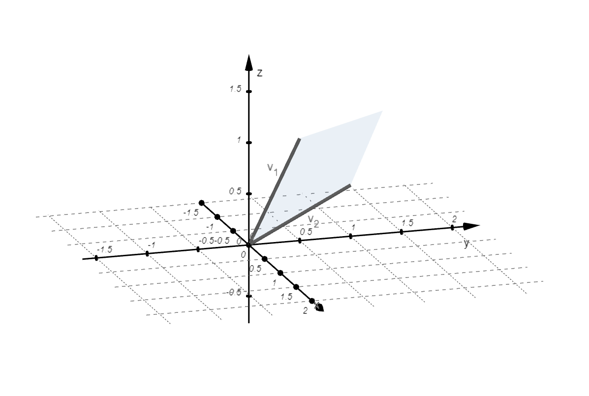

Línuleg jöfnuhneppi
====================

Línuleg Algebra er sú grein innan stærðfræðinnar sem fæst við línuleg jöfnuhneppi,
vigra, vigurrúm, línulegar varpanir og önnur tengd viðfangsefni. Í þessu námskeiði 
verður farið yfir helstu hugtök í línulegri algebru. Farið verður yfir: línuleg 
jöfnuhneppi, fylki, ákveður, vigra og vigurrúm, eiginvigra og eigingildi og innfeldi. 
Hagnýtingar línulegrar algebru má meðal annars finna innan verkfræðinnar, innan 
eðlisfræðinnar, í tölvugrafík, fjármálum og í tengslum við gervigreind.

Línuleg jöfnuhneppi
-------------------

Skilgreining: Línuleg jafna
~~~~~~~~~~~~~~~~~~~~~~~~~~~~

.. admonition:: Skilgreining
    :class: skilgreining

    Jafna af taginu 

    .. math:: a_1x_1+a_2x_2+\dots+a_nx_n=b 

    kallast **línuleg jafna** (e. linear equation).

    :math:`a_1,a_2,\dots,a_n` kallast **stuðlar** (e. coefficients) jöfnunnar.
    :math:`x_1,x_2,\dots,x_n` eru óþekktar stærðir, **breytur** (e. variables).

Skilgreining: Línulegt jöfnuhneppi 
~~~~~~~~~~~~~~~~~~~~~~~~~~~~~~~~~~~

.. admonition:: Skilgreining
    :class: skilgreining

    **Línulegt jöfnuhneppi** (e. system of linear equations, linear system)
    er safn af einni eða fleiri línulegum jöfnum og er oft sett fram á forminu

    .. math:: \begin{align}
        a_{11}x_1 + a_{12}x_2 + \cdots + a_{1n}x_n &= b_1 \\
        a_{21}x_1 + a_{22}x_2 + \cdots + a_{2n}x_n &= b_2 \\
        &\vdots \\
        a_{m1}x_1 + a_{m2}x_2 + \cdots + a_{mn}x_n &= b_m
        \end{align}

Setning: Fjöldi lausna
~~~~~~~~~~~~~~~~~~~~~~~~

.. admonition:: Setning 
    :class: setning

    Línulegt jöfnuhneppi getur haft:

        **(a)** Enga lausn.

        **(b)** Nákvæmlega eina lausn.

        **(c)** Óendanlega margar lausnir.
    
    Segjum að jöfnuhneppi sé **ósamkvæmt** (e. inconsistent) ef það hefur enga lausn.

    Jöfnuhneppi er sagt **samkvæmt** (e. consistent) ef það hefur að minnsta kosti eina lausn.

Sýnidæmi: Jöfnuhneppi sem hefur enga lausn
^^^^^^^^^^^^^^^^^^^^^^^^^^^^^^^^^^^^^^^^^^

.. admonition:: Dæmi
  :class: daemi

  Leysið jöfnuhneppið

  .. math:: \begin{align*}
    x-2y&=5 \\
    -2x+4y&= 6 
    \end{align*}

.. admonition:: Lausn
  :class: daemi, dropdown
  
  Margföldum efri jöfnuna með 2.
   
  .. math:: \begin{align*}
     2x-4y&=10 \\
     -2x+4y&= 6 
     \end{align*}

  Leggjum saman jöfnurnar og fáum :math:`0=16` svo jöfnuhneppið 
  hefur enga lausn. Við segjum því að jöfnuhneppið sé ósamkvæmt (e. inconsistent).

Sýnidæmi: Jöfnuhneppi sem hefur eina lausn
^^^^^^^^^^^^^^^^^^^^^^^^^^^^^^^^^^^^^^^^^^^

.. admonition:: Dæmi
  :class: daemi
  
  Leysið jöfuhneppið:  

    .. math:: \begin{aligned}
        x + 2y &= -3 \\
        x - y &= 6 
        \end{aligned}

.. admonition:: Lausn
  :class: daemi, dropdown
  
  Drögum neðri jöfnuna frá þeirri efri og fáum :math:`3y=-9` sem gefur
  :math:`y=-3`. Stingum inn í neðri jöfnuna og gefur :math:`x=3`. Þar 
  með er :math:`(x,y)=(3,-3)` lausn jöfnuhneppisins. 
  
  Þar sem jöfnuhneppið hefur lausn segjum við að jöfnuhneppið sé **samkvæmt** (e. consistent). 
  Þar sem jöfnuhneppið hefur aðeins eina lausn segjum við að lausnin sé 
  **ótvírætt ákvörðuð** (e. unique). **Stuðlar** (e. coefficients) jöfnuhneppisins, á **fylkjaformi**, eru: 

    .. math:: \begin{bmatrix}
        1 & 2  \\
        1 & -1 \\
        \end{bmatrix}

Sýnidæmi: Jöfnuhneppi sem hefur óendalega margar lausnir
^^^^^^^^^^^^^^^^^^^^^^^^^^^^^^^^^^^^^^^^^^^^^^^^^^^^^^^^

.. admonition:: Dæmi
  :class: daemi

  Leysið jöfnuhneppið

  .. math:: \begin{align*}
        x+y&=2 \\
        2x+2y&= 4 
        \end{align*}

.. admonition:: Lausn
  :class: daemi, dropdown

   Deilum í neðri jöfnuna með 2.
   
   .. math:: \begin{align*}
      x+y&=2 \\
      x+y&=2 
      \end{align*}

   Ef við drögum efri jöfnuna frá neðri jöfnunni fæst:

    .. math:: \begin{align*}
       x+y&=2 \\
       0 &= 0
       \end{align*}
    
   Lína :math:`0=0` kallast núllína. Athugum þá hvort jafnan 
   :math:`x+y=2` hafi einhverja lausn. Já, :math:`(x,y)=(1,1)` og 
   :math:`(x,y)=(2,0)` eru dæmi um lausnir. Jöfnuhneppið er 
   samkvæmt en lausnin er ekki ótvírætt ákvörðuð. Ef við veljum 
   til dæmis :math:`y=t` fæst :math:`x=2-t`. Svo allar tvenndir af
   gerð :math:`(x,y)=(2-t,t)` eru lausnir jöfnuhneppisins. 

Skilgreining: Lausnamengi
~~~~~~~~~~~~~~~~~~~~~~~~~~~

.. admonition:: Skilgreining
    :class: skilgreining

    Mengi allra launsa jöfnuhneppis kallast **lausnamengi** þess (e. solution set).

Skilgreining: Jafngild
~~~~~~~~~~~~~~~~~~~~~~~

.. admonition:: Skilgreining
    :class: skilgreining

    Tvö línuleg jöfnuhneppi kallast **jafngild** (e. equivalent) ef þau hafa sömu lausnir.

Einfaldar línuaðgerðir
----------------------
      
Eftirfarandi aðgerðir kallast **einfaldar línuaðgerðir** (e. elementary row operations) og 
þeim má beita á jöfnur  í línulegum jöfnuhneppum (eða línur í fylkjum):

Setning: Einfaldar línuaðgerðir
~~~~~~~~~~~~~~~~~~~~~~~~~~~~~~~~

.. admonition:: Setning
    :class: setning

    **(1)** Umskipting (e. replacement): að skipta út línu :math:`R_i` fyrir :math:`R_i+cR_j` þar sem :math:`R_j` er önnur lína og :math:`c` er fasti.

    **(2)** Víxlun (e. interchange): að víxla á línum :math:`R_i` og :math:`R_j`.

    **(3)** Skölun (e. scaling): að margfalda línu :math:`R_i` með fasta :math:`c\neq 0`

    Þessar aðgerðir eru andhverfanlegar og breyta ekki lausnamengi jöfnuhneppsins.

Skilgreining: Línujafngild
~~~~~~~~~~~~~~~~~~~~~~~~~~~

.. admonition:: Skilgreining
    :class: skilgreining

    Tvö jöfnuhneppi (eða fylki) eru **línujafngild** (e. row equivalent) ef öðru má breyta í hitt
    með einföldum línuaðgerðum.

Ef jöfnuhneppi eru línujafngild þá hafa þau sömu lausnir. Til eru dæmi 
um jöfnuhneppi sem hafa sömu lausnir en eru ekki línujafngild. 

Línulegu jöfnuhneppin 

.. math:: \begin{bmatrix} 
    x+y&=0\\ 
    0&=1
    \end{bmatrix} 
    \text{ og }
    \begin{bmatrix} 
    x-y&=0\\ 
    0&=1
    \end{bmatrix}

hafa sömu (engar) launsir en eru ekki línujafngild.

Sýnidæmi: Línuaðgerðir 
^^^^^^^^^^^^^^^^^^^^^^

.. admonition:: Dæmi
  :class: daemi

  Leysum jöfnuhneppið

  .. math:: 
    \begin{aligned}
     x_1 -3x_2 + 4x_3 =-4\\
     3x_1-7x_2+7x_3 =-8\\
    -4x_1+6x_2+2x_3=4
    \end{aligned}
    

.. admonition:: Lausn
  :class: daemi, dropdown
  
   Skrifum þetta á fylkjaformi.
   
  .. math:: \begin{alignat*}{2}
    \begin{bmatrix}
    1 & -3 & 4 & -4\\
    3 & -7 & 7 & -8\\
    -4 & 6 & 2 & 4
    \end{bmatrix} \quad
    &\overset{\substack{R_2-3R_1\\R_3+4R_1}}{\sim}
    &\quad&\begin{bmatrix}
    1 & -3 & 4 &-4\\
    0 & 2 & -5 & 4 \\
    0 & -6 & 18 & -12
    \end{bmatrix} \\
    &\overset{\substack{-\frac{1}{6}R_3}}{\sim}
    &&\begin{bmatrix}
    1 & -3 & 4 &-4\\
    0 & 2 & -5 & 4 \\
    0 & 1 & -3 & 2
    \end{bmatrix}  \\
    &\overset{\substack{
        R_2\leftrightarrow R_3}}{\sim}
    &&\begin{bmatrix}
    1 & -3 & 4 &-4\\
    0 & 1 & -3 & 2 \\
    0 & 2 & -5 & 4
    \end{bmatrix} \\
    &\overset{\substack{R_1+3R_2\\ R_3-2R_2
    }}
    {\sim}
    &&\begin{bmatrix}
    1 & 0 & -5 & 2\\
    0 & 1 & -3 & 2 \\
    0 & 0 & 1 & 0
    \end{bmatrix} \\
    &\overset{\substack{
    R_1+5R_3\\ R_2+3R_3}}{\sim}
    &&\begin{bmatrix}
    1 & 0 & 0 & 2\\
    0 & 1 & 0 & 2 \\
    0 & 0 & 1 & 0
    \end{bmatrix}
    \end{alignat*}

  Svo við fáum

  .. math:: \begin{align*}
    x_1\phantom{+x_2+x_3} &= 2 \\
    \phantom{x_1+} x_2 \phantom{+x_3} &= 2 \\
    \phantom{x_1+x_2+} x_3 &= 0
    \end{align*}
  
  og línulega jöfnuhneppið hefur eina lausn: :math:`(x_1,x_2,x_3)=(2,2,0)`. 

Um fylki
---------

Stærð fylkis
~~~~~~~~~~~~~

Látum 

.. math:: \begin{bmatrix}
    a_{11} &\dots  &a_{1n}\\
    \vdots &&\vdots\\
    a_{m1} &\dots  &a_{mn}\\  
    \end{bmatrix}

vera fylki með :math:`m` jöfnum og :math:`n` óþekktum breytum. Við segjum að :math:`A` sé :math:`{m\times n}` fylki.
Jafnframt er :math:`m\times n` kallað **stærð fylkisins**.

Skilgreining: Stuðlafylki og aukið fylki
~~~~~~~~~~~~~~~~~~~~~~~~~~~~~~~~~~~~~~~~~~

.. admonition:: Skilgreining
    :class: skilgreining

    Látum 

    .. math:: \begin{alignat*}{2}
            a_{11}x_{1}+&\dots+a_{1n}x_n &= b_1\\
            &\hspace{6.143162275pt}\vdots & \\
            a_{m1}x_{1}+&\dots+a_{mn}x_n &= b_m\\    
            \end{alignat*}
        
    vera línulegt jöfnuhneppi. Við köllum fylkin

    .. math:: \begin{bmatrix}
            a_{11} &\dots &a_{1n}\\
            \vdots&&\vdots\\
            a_{m1}&\dots &a_{mn}\\  
            \end{bmatrix}
            \text{ og }
            \begin{bmatrix}
            a_{11} &\dots &a_{1n} &b_1\\
            \vdots&&\vdots&\vdots\\
            a_{m1}&\dots &a_{mn} &b_m\\  
            \end{bmatrix}
        
    **Stuðlafylki** (e. coefficient matrix) og **aukið fylki** (e. augmented matrix) jöfnuhneppisins.

Efri stallagerð
~~~~~~~~~~~~~~~~~~~

**Línur** (e. rows) liggja lárétt og **dálkar** (e. columns) liggja lóðrétt.

**Núllína** (e. zero row) er lína þar sem allir stuðlarnir eru núll.

**Forystustuðull** (e. leading coeffcient) er fyrsti stuðull í hverrri línu sem er ekki núll.

Skoðum jöfnuhneppi

.. math:: \begin{array}{cccc}
        3x_1 &+ 7x_2 &- 2x_3 &= 9 \\
             & -5x_2 &+ 4x_3 &= 2 \\
             &        & 6x_3 &=-3 \\
      \end{array}

sjáum strax að jöfnuhneppið hefur lausn. 

.. math:: \begin{bmatrix}
    3 & 7 & -2 & 9 \\
    0 & -5 & 4 & 2 \\
    0 & 0 & 6 & -3 
    \end{bmatrix}

Aukna fylkið fyrir jöfnuhneppið er dæmi um fylki af *efri stallagerð* (e. echelon form).  

Skilgreining: Efri stallagerð
~~~~~~~~~~~~~~~~~~~~~~~~~~~~~~

.. admonition:: Skilgreining
    :class: skilgreining

    Fylki er sagt vera af **efri stallagerð** (e. echelon form) ef það uppfyllir
    eftirfarandi skilyrði.

        **1.** Núllínur liggja fyrir neðan aðrar línur.

        **2.** Forustustuðull hverrar línu er hægra megin við forustustuðul línunnar fyrir ofan.

        **3.** Allir stuðlar fyrir neðan forustustuðul eru núll.
    
    Öllum fylkjum má breyta í fylki af efri stallagerð með einföldum línuaðgerðum.

Sýnidæmi: Efri stallagerð
^^^^^^^^^^^^^^^^^^^^^^^^^

.. admonition:: Dæmi
  :class: daemi
  
  Breytum eftirfarandi :math:`{3\times 4}` fylki í fylki af efri stallagerð:

  .. math:: \begin{alignat*}{2}
    \begin{bmatrix}
    1 & 2 & 3 & 4 \\
    5 & 6 & 7 & 8 \\
    9 & 10 & 11 & 12
    \end{bmatrix} 
    &\overset{\substack{R_2 - 5R_1 \\
    R_3 - 9R_1}}{\sim} 
    &&\begin{bmatrix}
    1 & 2 & 3 & 4 \\
    0 & -4 & -8 & -12 \\
    0 & -8 & -16 & -24
    \end{bmatrix}\\  
    &\overset{\substack{R_3 - 2R_2}}{\sim}
    &&\begin{bmatrix}
    1 & 2 & 3 & 4 \\
    0 & -4 & -8 & -12 \\
    0 & 0 & 0 & 0
    \end{bmatrix}
    \end{alignat*}

  Er þetta fylki af neðri stallagerð?

  **1.** Núlllínur eru neðast. OK

  **2.** Forustustuðull hverrar línu er hægra megin við forustustuðul línunnar fyrir ofan. OK

  **3.** Allir stuðlar fyrir neðan forustustuðul eru núll. OK

Gauss-eyðing
------------

Línuleg jöfnuhneppi eru yfirleitt leyst með svokallaðri **Gauss-eyðingu** (e. Gauss-reduction).
Gauss-eyðing er reiknirit sem umbreytir fylki í fylki af efri stallagerð.

Reiknirit fyrir Gauss-eyðingu
~~~~~~~~~~~~~~~~~~~~~~~~~~~~~~

    **1.** Finnum dálkinn lengst til vinstri sem inniheldur ekki bara 0. Köllum þennan dálk „fyrsta vendidálk".

    **2.** Víxlum, ef þarf, á línum svo að efsta stak fyrsta vendidálks (vendistak) sé ekki núll.

    **3.** Núllum út stökin fyrir neðan vendistakið með því að draga margfeldi efstu línu frá línum fyrir neðan.

    **4.** Lítum nú framhjá efstu línu í fylkinu og endurtökum skref 1-4 á línurnar fyrir neðan.

.. admonition:: Athugasemd
  :class: athugasemd

  Það er ekki bannað að deila/margfalda til að vendistuðullinn verði 1. Það er ekki nauðsynlegt en það má ef það 
  einfaldar útreikingana. Sama gildi um það að víxla á línum til að fá þægilegri tölur til að vinna með.

Sýnidæmi: Gauss-eyðing
^^^^^^^^^^^^^^^^^^^^^^^^^^^^

.. admonition:: Dæmi
  :class: daemi

  Notið Gauss-eyðingu til að koma fylkinu yfir á efri stallagerð

  .. math:: 
    \begin{bmatrix}
    0 & 4 & 1 \\
    -1 & 3 & 2 \\
    5 & 6 & -3
    \end{bmatrix}

.. admonition:: Lausn
  :class: daemi, dropdown

  Beitum Gauss-eyðingu til að umbreyta fylkinu í fylki af efri stallagerð.

  .. math:: \begin{alignat*}{2}
    \begin{bmatrix}
    0 & 4 & 1 \\
    -1 & 3 & 2 \\
    5 & 6 & -3
    \end{bmatrix}
    &\overset{\substack{R_1 \leftrightarrow R_2}}{\sim} 
    &&\begin{bmatrix}
    -1 & 3 & 2 \\
    0 & 4 & 1 \\
    5 & 6 & -3
    \end{bmatrix} \\
    &\overset{\substack{R_3 + 5R_1}}{\sim} 
    &&\begin{bmatrix}
    -1 & 3 & 2 \\
    0 & 4 & 1 \\
    0 & 21 & 7
    \end{bmatrix}\\
    &\overset{\substack{-R_3-\frac{21}{4}R_2}}{\sim}
    &&\begin{bmatrix}
    -1 & 3 & 2 \\
    0 & 4 & 1 \\
    0 & 0 & \frac{7}{4}
    \end{bmatrix}
    \end{alignat*}

Skilgreining: Rudd efri stallagerð
~~~~~~~~~~~~~~~~~~~~~~~~~~~~~~~~~~~~

.. admonition:: Skilgreining
    :class: skilgreining

    Fylki er sagt vera af **ruddri efri stallagerð**  (e. reduced echeolon form) ef það er af efri 
    stallagerð og uppfyllir að auki eftirfarandi skilyrði:
    
    **1.** Forustustuðlar eru allir 1.

    **2.** Allir stuðlar fyrir ofan forustustuðul eru núll.

Sýnidæmi: Rudd efri stallagerð
^^^^^^^^^^^^^^^^^^^^^^^^^^^^^^

.. admonition:: Dæmi
  :class: daemi

  .. math:: \begin{align*}
    \begin{bmatrix}
      1 & 0 \\
      0 & 1 \\
    \end{bmatrix}
    &
    \begin{bmatrix}
      1 & 4 & 0 \\
      0 & 0 & 1 \\
      0 & 0 & 0 \\
    \end{bmatrix}
    &
    \begin{bmatrix}
      1 & 0 & 3 & 0 \\
      0 & 1 & 4 & 0 \\
      0 & 0 & 0 & 1 \\
    \end{bmatrix}
    &
    \begin{bmatrix}
      1 & 0 & 2 & 0 & 1 \\
      0 & 1 & 3 & 0 & 2 \\
      0 & 0 & 0 & 1 & 3 \\
    \end{bmatrix}
    &
    \\
    \begin{bmatrix}
      1 & 0 \\
      0 & 1 \\
    \end{bmatrix}
    &
    \begin{bmatrix}
      1 & * & 0 \\
      0 & 0 & 1 \\
      0 & 0 & 0 \\
    \end{bmatrix}
    &
    \begin{bmatrix}
      1 & 0 & * & 0 \\
      0 & 1 & * & 0 \\
      0 & 0 & 0 & 1 \\
    \end{bmatrix}
    &
    \begin{bmatrix}
      1 & 0 & * & 0 & * \\
      0 & 1 & * & 0 & * \\
      0 & 0 & 0 & 1 & * \\
    \end{bmatrix}
    \end{align*}

Við köllum forustustuðul í fylki af ruddri efri stallagerð **vendistuðul**. 
Við köllum þá dálka **vendidálka** sem innhalda vendistuðla.

.. admonition:: Athugasemd
    :class: athugasemd
    
    Við finnum rudda efri stallagerð með sama reikniriti og við finnum efri stallagerð. 
    Nema að til viðbótar þá gerum við eftirfarandi:

        **1.** Skölum forustustuðla þar sem við á til að þeir verði 1.
 
        **2.** Eyðum út stuðlum fyrir ofan forustustuðla.

Sýnidæmi: Rudd efri stallagerð
^^^^^^^^^^^^^^^^^^^^^^^^^^^^^^

.. admonition:: Dæmi
  :class: daemi

  Beitið reikniritinu til að koma fylkinu yfir á rudda efri stallagerð.

  .. math:: \begin{bmatrix}
    0 & 4 & 1 \\
    -1 & 3 & 2 \\
    5 & 6 & -3
    \end{bmatrix}

.. admonition:: Lausn
  :class: daemi, dropdown

  .. math:: \begin{eqnarray*}
    \begin{bmatrix}
    0 & 4 & 1 \\
    -1 & 3 & 2 \\
    5 & 6 & -3
    \end{bmatrix}
    &\sim
    \begin{bmatrix}
    -1 & 3 & 2 \\
    0 & 4 & 1 \\
    0 & 0 & \frac{7}{4}
    \end{bmatrix} \\
    &\sim
    \begin{bmatrix}
    1 & -3 & -2 \\
    0 & 1 & \frac{1}{4} \\
    0 & 0 & 1
    \end{bmatrix}\\ 
    &\sim
    \begin{bmatrix}
    1 & -3 & 0 \\
    0 & 1 & 0 \\
    0 & 0 & 1
    \end{bmatrix}
    \\&\sim\begin{bmatrix}
    1 & 0 & 0 \\
    0 & 1 & 0 \\
    0 & 0 & 1
    \end{bmatrix}
    \end{eqnarray*}
  
  og við fáum fylki af ruddri efri stallagerð.

Setning: Rudd efri stallagerð
~~~~~~~~~~~~~~~~~~~~~~~~~~~~~~~~~~~~~~~~~~~~~~

.. admonition:: Setning
  :class: setning

  Gefið er fylki :math:`A`. Fylkinu :math:`A` má með einföldum línuaðgerðum 
  umbreyta í eitt og aðeins eitt fylki af ruddri efri stallagerð. Með öðrum 
  orðum er rudd efri stallagerð fylkis ótvírætt ákvörðuð. 

Sýnidæmi: Frjálsar og háðar breytur
^^^^^^^^^^^^^^^^^^^^^^^^^^^^^^^^^^^

.. admonition:: Dæmi
  :class: daemi

  Leysið línulega jöfnuhneppið

  .. math:: \begin{align*}
    x_1+2x_2+3x_3=4\\
    5x_1+6x_2+7x_3=8\\    
    9x_1+10x_2+11x_3=12
    \end{align*}

.. admonition:: Lausn
  :class: daemi, dropdown

  Skoðum línulega jöfnuhneppið
  
  .. math:: \begin{align*}
    x_1+2x_2+3x_3=4\\
    5x_1+6x_2+7x_3=8\\    
    9x_1+10x_2+11x_3=12
    \end{align*} 
  
  Skv. sýnidæmi að ofan má umbreyta aukna fylki þess í
 
  .. math:: \begin{bmatrix}
    1 & 0 & -1 & -2 \\
    0 & 1 & 2 & 3 \\
    0 & 0 & 0 & 0
    \end{bmatrix} 
  
  sem jafngildir jöfnuhneppinu

  .. math::\begin{align*}
    x_1&-x_3=-2\\
    x_2&+2x_3=3
    \end{align*}

  Fáum að

  .. math:: \begin{align*}
    x_1&-x_3=-2\\
    x_2&+2x_3=3
    \end{align*}

  sem er jafngilt

  .. math:: \begin{align*}
    x_1&=x_3-2\\
    x_2&=-2x_3+3
    \end{align*}
  
  svo

  .. math:: \begin{align*}
    \begin{pmatrix}
    x_1\\
    x_2\\
    x_3
    \end{pmatrix}=
    \begin{pmatrix}
    x_3-2\\
    -2x_3+3\\
    x_3
    \end{pmatrix}
    \end{align*}

  þar sem :math:`x_3` er **frjáls breyta** (e. free variable) .

  Jöfnuhneppið er samkvæmt en lausnin ekki ótvírætt ákvörðuð.
  Breyturnar :math:`x_1`, :math:`x_2` eru hér kallaðar **háðar breytur** (e. basic variable). 

.. admonition:: Athugasemd
    :class: athugasemd

    Ef við umbreytum aukna fylki jöfnuhneppis yfir á (rudda) efri stallagerð getur eftirfarandi gerst:

    **1.** Dálkurinn lengst til hægri er vendidálkur. Í þeim tilfellum hefur jöfnuhneppið enga lausn. **Dæmi:**

    .. math:: \begin{bmatrix}
        1 & * & 0 \\
        0 & 0 & 1 \\
        \end{bmatrix}

    **2.** Allir dálkar nema dálkurinn lengst til hægri eru vendidálkar. Í þeim tilfellum hefur jöfnuhneppið nákvæmlega eina lausn. **Dæmi:**
    
    .. math:: \begin{bmatrix}
        1 & 0 & * \\
        0 & 1 & * \\
        \end{bmatrix}

    **3.** Dálkurinn lengst til hægri er ekki vendidálkur auk minnst eins annars til viðbótar. 
    Í þeim tilfellum hefur jöfnuhneppið óendanlega margar lausnir. **Dæmi:**
    
    .. math:: \begin{bmatrix}
        1 & 0 & * & * \\
        0 & 1 & * & * \\    
        \end{bmatrix}

Setning: Fjöldi frjálsa breyta
~~~~~~~~~~~~~~~~~~~~~~~~~~~~~~~

.. admonition:: Setning
  :class: setning

  Jöfnuhneppi hefur lausn ef og aðeins ef dálkurinn lengst til hægri í efra stallaformi
  inniheldur ekki forustustuðul, þ.e.a.s. ef efra stallaform aukna
  fylkisins inniheldur ekki línu á forminu 

  .. math:: [0\ \dots \ 0 \ b]

  þar sem :math:`b\neq 0`. 

  Ef jöfnuhneppið hefur lausn þá er annaðhvort

    **1.** nákvæmlega eina lausn, ef það er engin frjáls breyta.

    **2.** óendanlega margar lausnir, ef það eru ein eða fleiri frjálsar breytur.

Vigrar
------

Skilgreining: Vigur
~~~~~~~~~~~~~~~~~~~~~~

.. admonition:: Skilgreining
    :class: skilgreining

    Við köllum :math:`n \times 1` fylki **vigur** (e.vector).

Sýnidæmi: Dálkvigrar
^^^^^^^^^^^^^^^^^^^^

.. admonition:: Dæmi
    :class: daemi

    .. math:: \textbf{v}_1 = \begin{bmatrix}
        1 \\
        2 \\
        \end{bmatrix},
        \quad
        \textbf{v}_2 = \begin{bmatrix}
        -1 \\
        0 \\
        \end{bmatrix},
        \quad
        \textbf{v}_3 = \begin{bmatrix}
        4 \\
        -2 \\
        17\\
        \end{bmatrix},
        \quad
        \textbf{v}_4 = \begin{bmatrix}
        9
        \end{bmatrix}.
        
    Þetta eru allt dæmi um dálkvigra, vigra sem eru fylki sem eru bara einn dálkur.
  
Við feitletrum gjarnan breytur sem tákna vigra til að aðgreina þá frá rauntalnabreytum.
:math:`\textbf{u}, \textbf{v}, \textbf{v}_1, \textbf{v}_2, \textbf{b},`. Önnur leið er að nota 
örvar: :math:`\vec{u}, \vec{v}, \vec{v}_1, \vec{v}_2, \vec{b}` eða strik:
:math:`\bar{u}, \bar{v}, \bar{v}_1, \bar{v}_2, \bar{b}`. 

Einnig má skrifa dálkvigra svona til að spara pláss: 

.. math:: \begin{bmatrix}
    1 & 2 & 3 & 4 & 5
    \end{bmatrix}^T 
    \text{ eða } 
    (1,2,3,4,5) 
    \text{ í staðinn fyrir }
    \begin{bmatrix}
    1 \\ 2 \\ 3 \\ 4 \\ 5
    \end{bmatrix}.

.. admonition:: Athugasemd
    :class: athugasemd

    Tveir vigrar eru jafnir ef þeir eru að sömu vídd og öll hnit þeirra eru þau sömu.

Samlagning vigra 
~~~~~~~~~~~~~~~~~

Ef **u** og **v** eru vigrar þannig að 

.. math:: \textbf{u} = \begin{bmatrix}
    u_{1}\\
    \vdots\\
    u_{n}\\    
    \end{bmatrix}\quad
    \textbf{v} = \begin{bmatrix}
    v_{1}\\
    \vdots\\
    v_{n}\\    
    \end{bmatrix}

þá er skilgreinum við vigurinn :math:`\textbf{u} + \textbf{v}` sem 

.. math:: \textbf{u} + \textbf{v} =
    \begin{bmatrix}
    u_{1}+v_{1}\\
    \vdots\\
    u_{n}+v_{n}\\    
    \end{bmatrix}.

Stikamargöfldun vigra 
~~~~~~~~~~~~~~~~~~~~~~~

Ef :math:`c` er rauntala og **v** er vigur þannig að

.. math:: \textbf{v} = \begin{bmatrix}
    v_{1}\\
    \cdots\\
    v_{n}\\    
    \end{bmatrix}

þá skilgreinum við vigurinn :math:`c\textbf{v}` með

.. math:: c\textbf{v}=
    \begin{bmatrix}
    cv_{1}\\
    \cdots\\
    cv_{n}\\    
    \end{bmatrix}.

Sýnidæmi: Stikamargföldun vigra
^^^^^^^^^^^^^^^^^^^^^^^^^^^^^^^

.. admonition:: Dæmi
    :class: daemi

    .. math:: 2\cdot\begin{bmatrix}
        -1\\3
        \end{bmatrix}
        =
        \begin{bmatrix}
        2\cdot(-1)\\2\cdot 3
        \end{bmatrix}=
        \begin{bmatrix}
        -2\\6
        \end{bmatrix}

Sýnidæmi: Stikamargföldun vigra, frh.
^^^^^^^^^^^^^^^^^^^^^^^^^^^^^^^^^^^^^

.. admonition:: Dæmi
    :class: daemi

    Ef við margföldum vigur með 1 fáum við alltaf sama vigurinn aftur:

    .. math:: 1\cdot\begin{bmatrix}
        3\\0
        \end{bmatrix}
        =
        \begin{bmatrix}
        1\cdot 3\\1\cdot 0
        \end{bmatrix}=
        \begin{bmatrix}
        3\\ 0
        \end{bmatrix}

    EF við margöfldum með 0 fáum við núllvigruinn:

    .. math:: 0\cdot\begin{bmatrix}
        2\\-7
        \end{bmatrix}
        =
        \begin{bmatrix}
        0\cdot 2\\0\cdot (-7)
        \end{bmatrix}=
        \begin{bmatrix}
        0\\ 0
        \end{bmatrix}.

Reiknireglur fyrir vigra
~~~~~~~~~~~~~~~~~~~~~~~~~~

.. admonition:: Setning
    :class: setning

    Ef **u**, **v**, **w** eru vigrar í :math:`\mathbb{R}^n` og  *c* og  *d* eru
    rauntölur gildir eftirfarandi:

        **1.** :math:`\textbf{u} + \textbf{v}= \textbf{v} + \textbf{u}`

        **2.** :math:`(\textbf{u} + \textbf{v}) + \textbf{w} = \textbf{u} +  (\textbf{v} + \textbf{w})`

        **3.** :math:`\textbf{u} + \textbf{0}= \textbf{0} + \textbf{u} = \textbf{u}`

        **4.** :math:`\textbf{u} + (-\textbf{u})= \textbf{0}`

        **5.** :math:`c(\textbf{u} + \textbf{v})= c\textbf{u} + c\textbf{v}`

        **6.** :math:`(c+d)\textbf{u}= c\textbf{u} + d\textbf{u}`

        **7.** :math:`c(d\textbf{u})= (cd)\textbf{u}`

        **8.** :math:`1\textbf{u}= \textbf{u}`

.. admonition:: Aðvörun
    :class: advorun

    Almennt getum við ekki margfaldað saman tvo vigra og fengið nýjan vigur.
    Við getum heldur ekki deilt einum við vigri upp í annan. Stærðirnar 
    :math:`\textbf{v}_1\textbf{v}_2` og :math:`\frac{\textbf{v}_1}{\textbf{v}_2}`
    eru því almennt ekki skilgreindar.

Línuleg samantekt
-----------------

Skilgreining: Línuleg samantekt
~~~~~~~~~~~~~~~~~~~~~~~~~~~~~~~~~~

.. admonition:: Skilgreining
    :class: skilgreining

    Látum :math:`\textbf{v}_1, \textbf{v}_2, \dots, \textbf{v}_p` vera vigra í :math:`\mathbb{R}^n` og :math:`c_1, c_2, \dots, c_p` vera rauntölur. 
    Við segjum að vigurinn 

    .. math:: \textbf{y}=c_1\textbf{v}_1 +c_2\textbf{v}_2+ \dots+ c_p\textbf{v}_p
    
    sé **línuleg samantekt** af vigrunum :math:`\textbf{v}_1, \textbf{v}_2, \dots, \textbf{v}_p` með **vogstuðla** :math:`c_1, c_2, \dots, c_p`.

Sýnidæmi: Línulegar samantektir
^^^^^^^^^^^^^^^^^^^^^^^^^^^^^^^

.. admonition:: Dæmi
    :class: daemi

    Höfum vigrana 

    .. math:: \textbf{v}_1=
        \begin{bmatrix}
        1\\1\\
        \end{bmatrix}
        \text{ , }
        \textbf{v}_2 =
        \begin{bmatrix}
        0\\-1\\
        \end{bmatrix}
        \text{ og }
        \textbf{y}=\begin{bmatrix}
        3\\2\
        \end{bmatrix}

    Er vigurinn :math:`\textbf{y}` línuleg samantekt af :math:`\textbf{v}_1` og :math:`\textbf{v}_2`? 

.. admonition:: Lausn
    :class: daemi, dropdown

    Já, við getum skrifað

    .. math:: \textbf{y}=
        3\cdot\begin{bmatrix}
        1\\1\\
        \end{bmatrix}
        +1\cdot
        \begin{bmatrix}
        0\\-1\\
        \end{bmatrix}
    
    Svo vigurinn :math:`\ve y` er línuleg samanteky af :math:`\textbf{v}_1` og :math:`\textbf{v}_2` 
    með vogstuðlana 3 og 1.

.. admonition:: Athugasemd
    :class: athugasemd

    **1.**  Vigur :math:`\ve v` er línuleg samantekt af sjálfum sér því við getum skrifað :math:`\textbf{v}=1 \cdot \textbf{v}`.

    **2.**  Núllvigurinn er línuleg samantekt af hvaða vigrum sem er því við getum skrifað 

    .. math:: \textbf{0}=0 \cdot \textbf{v}_1+0 \cdot \textbf{v}_2+\dots+0 \cdot \textbf{v}_p

    **3.**  Ef :math:`\ve m` er meðaltal vigranna :math:`\textbf{v}_1, \textbf{v}_2, \dots, \textbf{v}_p` þá er :math:`\ve m` línuleg samantekt af :math:`\textbf{v}_1, \textbf{v}_2, \dots, \textbf{v}_p` því

    .. math:: \textbf{m}=\frac{1}{p} \textbf{v}_1 +\frac{1}{p} \textbf{v}_2 + \dots + \frac{1}{p} \textbf{v}_p

Sýnidæmi: Línulegar samantektir
^^^^^^^^^^^^^^^^^^^^^^^^^^^^^^^

.. admonition:: Dæmi
    :class: daemi

    Höfum vigrana 

    .. math:: \textbf{v}_1=
        \begin{bmatrix}
        1\\1\\1\\
        \end{bmatrix}
        \text{ , }
        \textbf{v}_2 =
        \begin{bmatrix}
        0\\2\\3\\
        \end{bmatrix}
        \text{ og }
        \textbf{y}=\begin{bmatrix}
        3\\7\\9\\
        \end{bmatrix}
    
    Er vigurinn **y** línuleg samantekt af :math:`\textbf{v}_1` og :math:`\textbf{v}_2`.

.. admonition:: Lausn
    :class: daemi, dropdown

    Leysum jöfnuna

    .. math:: x_1\begin{bmatrix}
        1\\1\\1\\
        \end{bmatrix}
        +x_2
        \begin{bmatrix}
        0\\2\\3\\
        \end{bmatrix}=\begin{bmatrix}
        3\\7\\9\\
        \end{bmatrix}
    
    sem jafngildir jöfnuhneppinu

    .. math:: \begin{eqnarray*}
        x_1 &=&3\\
        x_1 +2x_2&=&7\\
        x_1+3x_2&=&9
        \end{eqnarray*}
    
    Skrifum út aukna fylkið og leysum

    .. math:: \begin{align*}
        \begin{bmatrix}
            1 & 0 & 3\\
            1 & 2 & 7\\
            1 & 3 & 9
        \end{bmatrix}
        \sim
        \begin{bmatrix}
            1 & 0 & 3\\
            0 & 2 & 4\\
            0 & 3 & 6
        \end{bmatrix} \sim
        \begin{bmatrix}
            1 & 0 & 3\\
            0 & 1 & 2\\
            0 & 1 & 2
        \end{bmatrix} 
        \sim
        \begin{bmatrix}
            1 & 0 & 3\\
            0 & 1 & 2\\
            0 & 0 & 0
        \end{bmatrix}
        \end{align*}

    er jafngild

    .. math::\begin{eqnarray*}
        x_1=3\\
        x_2=2\\
        \end{eqnarray*}
    
    svo 

    .. math:: \textbf{y}=
        \begin{bmatrix}
        3\\7\\9\\
        \end{bmatrix} = 3\begin{bmatrix}
        1\\1\\1\\
        \end{bmatrix}
        +2
        \begin{bmatrix}
        0\\2\\3\\
        \end{bmatrix}=3\textbf{v}_1+2\textbf{v}_2
    
    og **y** er línuleg samantekt af :math:`\textbf{v}_1` og :math:`\textbf{v}_2`.

Sýnidæmi: Línulegar samantektir
^^^^^^^^^^^^^^^^^^^^^^^^^^^^^^^

.. admonition:: Dæmi
    :class: daemi

    Er vigurinn **y** línuleg samantekt af :math:`\textbf{v}_1` og :math:`\textbf{v}_2` þegar

    .. math::  \textbf{v}_1=
        \begin{bmatrix}
        1\\1\\1\\
        \end{bmatrix}
        \text{ , }
        \textbf{v}_2 =
        \begin{bmatrix}
        0\\2\\3\\
        \end{bmatrix}
        \text{ og }
        \textbf{y}=\begin{bmatrix}
        5\\10\\5\\
        \end{bmatrix}?

.. admonition:: Lausn
    :class: daemi, dropdown

    Leysum jöfnuna

    .. math:: x_1\begin{bmatrix}
        1\\1\\1\\
        \end{bmatrix}
        +x_2
        \begin{bmatrix}
        0\\2\\3\\
        \end{bmatrix}=\begin{bmatrix}
        5\\10\\5\\
        \end{bmatrix}

    Skrifum þetta sem aukið fylki
        
    .. math:: \begin{align*}
        \begin{bmatrix}
        1 & 0 & 5\\
        1 & 2 & 10\\
        1 & 3 & 5
        \end{bmatrix}
        \sim
        \begin{bmatrix}
        1 & 0 & 5\\
        0 & 2 & 5\\
        0 & 3 & 0
        \end{bmatrix} \sim
        \begin{bmatrix}
        1 & 0 & 3\\
        0 & 1 & 2\\
        0 & 1 & 0
        \end{bmatrix} 
        \sim
        \begin{bmatrix}
        1 & 0 & 3\\
        0 & 1 & 2\\
        0 & 0 & -2
        \end{bmatrix}
        \end{align*}

    Aukna fylkið hefur vendidálk lengst til hægri svo jafnan hefur enga lausn.
    Vigurinn **y** er ekki línuleg samantekt af :math:`\textbf{v}_1` og :math:`\textbf{v}_2`.

Línuleg spönn
-------------

Skilgreining: Línuleg spönn
~~~~~~~~~~~~~~~~~~~~~~~~~~~~

.. admonition:: Skilgreining
    :class: skilgreining

    Ef :math:`\textbf{v}_1,\dots,\textbf{v}_p` eru vigrar í :math:`\mathbb{R}^n` þá skilgreinum við :math:`\text{span}\{\textbf{v}_1,\dots,\textbf{v}_p\}` sem mengi allra vigra í 
    :math:`\mathbb{R}^n` sem eru línuleg samantekt af :math:`\textbf{v}_1,\dots,\textbf{v}_p`. Með öðrum orðum er :math:`\text{span}\{\textbf{v}_1,\dots,\textbf{v}_p\}` mengi 
    allra vigra sem skrifa má á forminu

    .. math:: c_1\textbf{v}_1+\dots+c_p\textbf{v}_p

    þar sem :math:`c_1, \dots, c_p` eru einhverjar rauntölur.
    Við köllum mengið :math:`\text{span}\{\textbf{v}_1,\dots,\textbf{v}_p\}` **línulega spönn** mengisins :math:`\{\textbf{v}_1,\dots,\textbf{v}_p\}`.

Línuleg spönn í :math:`\mathbb{R}^2`
~~~~~~~~~~~~~~~~~~~~~~~~~~~~~~~~~~~~~

.. figure:: myndir/linuleg_sponn.svg
    :align: center

Myndin sýnir vigrana :math:`\textbf{v}` og :math:`\textbf{u}`.
Bleika svæðið, allt :math:`\mathbb{R}^2` rúmið er línuleg spönn þessara vigra.

Á mynd má sjá vigurinn :math:`\ve v`. Línuleg spönn þessa vigurs eru allir vigrar með endapunkt á línunni
sem er framhald vigursins :math:`\ve v`, í báðar áttir.

Línuleg spönn í :math:`\mathbb{R}^3`
~~~~~~~~~~~~~~~~~~~~~~~~~~~~~~~~~~~~~~~

Látum :math:`\textbf{v}_1` og :math:`\textbf{v}_2` vera tvo vigra í :math:`\mathbb{R}^3`. Í þessu dæmi myndar
spönn þeirra sléttu sem fer í gegnum upphafspunkt hnitakerfisins.

Línuleg spönn í :math:`\mathbb{R}^3` getur líka verið: bara núllpunkturinn, 
lína í gegnum núllpunkt eða allt :math:`\mathbb{R}^3` rúmið.

Margfeldi fylkis og vigurs 
--------------------------

Skilgreining: Fylkjajafnan
~~~~~~~~~~~~~~~~~~~~~~~~~~~~~~

.. admonition:: Skilgreining
    :class: skilgreining

    Látum :math:`A` vera :math:`m\times n` fylki þar sem :math:`\textbf{a}_1, \dots, \textbf{a}_n` eru dálkar þess. 
    Látum **x** vera dálkvigur í :math:`\mathbb{R}^n`. Við skilgreinum margfeldið :math:`A \textbf{x}` með eftirfarandi hætti:

    .. math:: A\textbf{x} = \begin{bmatrix}\textbf{a}_1 \dots \textbf{a}_n\end{bmatrix}
        \begin{bmatrix}
        x_1\\\dots\\x_n
        \end{bmatrix}
        =x_1\textbf{a}_1 +\dots x_n\textbf{a}_n.

Til að margföldunin :math:`A\textbf{x}` sé framkvæmaleg þar fjöldi dálka :math:`A` vera jafn fjöldi lína **x**.

.. math:: \underbrace{\begin{bmatrix}
        a_{11} & a_{12} & \cdots & a_{1n} \\
        a_{21} & a_{22} & \cdots & a_{2n} \\
        \vdots & \vdots & \ddots & \vdots \\
        a_{m1} & a_{m2} & \cdots & a_{mn}
        \end{bmatrix}}_{n \text{ dálkar}}
        \left.\begin{bmatrix}
        x_1 \\
        x_2 \\
        \vdots \\
        x_n
        \end{bmatrix}\right\}n\text{ línur}

Margfeldið er þá

.. math:: \begin{bmatrix}
        a_{11}x_1 + a_{12}x_2 + \cdots + a_{1n}x_n \\
        a_{21}x_1 + a_{22}x_2 + \cdots + a_{2n}x_n \\
        \vdots    \\
        a_{m1}x_1 + a_{m2}x_2 + \cdots + a_{mn}x_n
        \end{bmatrix}\quad \begin{bmatrix}
        \rightarrow\\\\
        \end{bmatrix}[\downarrow]

Sýnidæmi: Margfeldi fylkis og vigurs
^^^^^^^^^^^^^^^^^^^^^^^^^^^^^^^^^^^^^^

.. admonition:: Dæmi
    :class: daemi

    Skoðum margfeldi fylkisins :math:`A` og vigursins **x**.

    .. math:: A = \begin{bmatrix}
        2 & 3 & -1 \\
        -1 & 4 & 6
        \end{bmatrix}
        \text{, } \quad
        \textbf{x} = \begin{bmatrix}
        5 \\
        -3 \\
        2
        \end{bmatrix}
        

.. admonition:: Lausn
    :class: daemi, dropdown

    Fáum

    .. math:: \begin{align*}
        A\textbf{x}
        =
        \begin{bmatrix}
        2 & 3 & -1 \\
        -1 & 4 & 6
        \end{bmatrix}
        \begin{bmatrix}
        5 \\
        -3 \\
        2
        \end{bmatrix}&=
        \begin{bmatrix}
        2 \cdot 5 + 3 \cdot (-3) + (-1) \cdot 2 \\
        (-1) \cdot 5 + 4 \cdot (-3) + 6 \cdot 2
        \end{bmatrix}
        \\&=
        \begin{bmatrix}
        10-9-2  \\
        -5-12+12
        \end{bmatrix}
        =
        \begin{bmatrix}
        -1  \\
        -5
        \end{bmatrix}
        \end{align*}

Sýnidæmi: Margfeldi fylkis og vigurs
^^^^^^^^^^^^^^^^^^^^^^^^^^^^^^^^^^^^^^

.. admonition:: Dæmi
    :class: daemi

    Skoðum margfeldi eftirfarandi tveggja fylkja og vigurs:

    .. math:: A = \begin{bmatrix}
        0 & 0 \\
        0 & 0 
        \end{bmatrix}
        \text{ , }\quad
        I = \begin{bmatrix}
        1 & 0 \\
        0 & 1 
        \end{bmatrix}
        \text{ , }\quad
        \textbf{x} = \begin{bmatrix}
        2 \\
        -7 \\
        \end{bmatrix}

.. admonition:: Launs
    :class: daemi, dropdown

    Fáum  

    .. math:: \begin{align*}
        A\textbf{x}
        =
        \begin{bmatrix}
        0 & 0 \\
        0 & 0 
        \end{bmatrix}
        \begin{bmatrix}
        2 \\
        -7 \\
        \end{bmatrix}=
        \begin{bmatrix}
        0\cdot 2 + 0\cdot (-7)\\
        0\cdot 2 + 0\cdot (-7)\\
        \end{bmatrix}=
        \begin{bmatrix}
        0\\
        0
        \end{bmatrix}
        \end{align*}

    og 

    .. math:: \begin{align*}
        I\textbf{x}
        =
        \begin{bmatrix}
        1 & 0 \\
        0 & 1 
        \end{bmatrix}
        \begin{bmatrix}
        2 \\
        -7 \\
        \end{bmatrix}=
        \begin{bmatrix}
        1\cdot 2 + 0\cdot (-7)\\
        0\cdot 2 + 1\cdot (-7)\\
        \end{bmatrix}=
        \begin{bmatrix}
        2\\
        -7
        \end{bmatrix}
        \end{align*}

    Fylkið :math:`I` kallast **einingarfylkið**. Það hefur þann eiginleika að 
    :math:`I \textbf{x}=\textbf{x}` gildir fyrir alla vigra **x**.

Fylkjajafnan
------------

Setning: Fylkjajafnan
~~~~~~~~~~~~~~~~~~~~~~~

.. admonition:: Setning
    :class: setning

    Látum :math:`A` vera :math:`m\times n` fylki með dálkvigrum :math:`\textbf{a}_1,\dots,\textbf{a}_n` og **b** vera dálkvigur í :math:`\mathbb{R}^n`. Táknum :math:`\textbf{x} = [x_1,\dots x_n]^T`. 
    Fylkjajafnan

    .. math:: A\textbf{x} =  \textbf{b}

    hefur sömu lausnir og jafnan

    .. math:: x_1\textbf{a}_1 +\dots + x_n \textbf{a}_n = \textbf{b}

    sem hefur sömu lausnir og fást með því að leysa jöfnhneppið sem svarar til aukna fylkisins

    .. math:: \begin{bmatrix}
        \textbf{a}_1 &\dots &\textbf{a}_n &\textbf b 
        \end{bmatrix}

.. admonition:: Athugasemd
    :class: athugasemd

    Fylkjajafnan :math:`A\textbf{x} = \textbf{b}` hefur lausn þá og því aðeins að 
    :math:`\textbf{b}` er línuleg samantekt af dálkum fylkis :math:`A`.

Sýnidæmi: Fylkjajafnan
^^^^^^^^^^^^^^^^^^^^^^

.. admonition:: Dæmi
    :class: daemi

    Fyrir hvaða :math:`b_1` og :math:`b_2` hefur eftirfarandi jöfnuhneppi lausn?

    .. math:: \begin{eqnarray*}
        x_1+x_2 = b_1\\
        x_1-x_2 = b_2
        \end{eqnarray*}

.. admonition:: Launs
    :class: daemi, dropdown

    Lítum á aukna fylkið og einföldum það með línuaðgerðum. Fáum

    .. math:: \begin{bmatrix}
        1 & 1 & b_1\\
        1& -1 & b_2
        \end{bmatrix}\sim 
        \begin{bmatrix}
        1 & 1 & b_1\\
        0& -2 & b_2-b_1
        \end{bmatrix}
    
    Með því að líta á vendistökin

    .. math:: \begin{bmatrix}
        \blacksquare & * & *\\
        0& \blacksquare & *
        \end{bmatrix}
    
    Má sjá að dálkurinn lengst til hægri er ekki vendidálkur svo jöfnuhneppið hefur alltaf lausn.

Sýnidæmi: Fylkjajafnan
^^^^^^^^^^^^^^^^^^^^^^

.. admonition:: Dæmi
    :class: daemi

    Fyrir hvaða :math:`b_1,b_2,b_3` hefur eftirfarandi jöfnuhneppi lausn?

    .. math:: \begin{eqnarray*}
        x_1+2x_2+3x_3 = b_1\\
        4x_1+5x_2+6x_3 = b_2\\
        7x_1+8x_2+9x_3 = b_3
        \end{eqnarray*}

.. admonition:: Launs
    :class: daemi, dropdown

    Skoðum aukna fylkið og fáum

    .. math:: \begin{align*}
        \begin{bmatrix}
        1 & 2 & 3 &b_1\\
        4 & 5 & 6 &b_2\\
        7 & 8 & 9 &b_3\\
        \end{bmatrix}&\sim
        \begin{bmatrix}
        1 & 2 & 3& b_1\\
        0 & -3 & -6 &b_2 -4b_1\\
        0 & -6 & -12 &b_3-7b_1\\
        \end{bmatrix}\\&\sim
        \begin{bmatrix}
        1 & 2 & 3& b_1\\
        0 & -3 & -6 &b_2 -4b_1\\
        0 & 0 & 0 &b_3-7b_1-2(b_2-4b_1)\\
        \end{bmatrix}
        \end{align*}

    Einföldum stakið neðst til hægri og fáum :math:`b_3-7b_1-2(b_2-4b_1) = b_1-2b_2+b_3`.
    Við erum því með aukna fylkið

    .. math:: \begin{bmatrix}
        1 & 2 & 3& b_1\\
        0 & -3 & -6 &b_2 -4b_1\\
        0 & 0 & 0 &b_1-2b_2+b_3\\
        \end{bmatrix}

    Aukna fylkið á efri ruddri stallagerð hefur því formin

    .. math:: \begin{bmatrix}
        \blacksquare & * & *&*\\
        0& \blacksquare & * &*\\
        0& 0& 0& \blacksquare
        \end{bmatrix}
        \text{ eða }
        \begin{bmatrix}
        \blacksquare & * & *&*\\
        0& \blacksquare & * &*\\
        0& 0& 0& 0
        \end{bmatrix}  

    allt eftir því hvort stærðin :math:`b_1-2b_2+b_3` sé núll eða ekki. 
    Jöfnuhneppið okkar hefur lausn þá og því aðeins að dálkurinn lengst til hægri sé ekki vendidálkur.
    Jöfnuhneppið því því lausn þá og því aðeins að :math:`b_1-2b_2+b_3=0`.

Setning: Fullyrðingar um fylkjajöfnuna
~~~~~~~~~~~~~~~~~~~~~~~~~~~~~~~~~~~~~~~

.. admonition:: Setning
    :class: setning

    Látum :math:`A` vera :math:`m\times n` fylki. Eftirfarandi fullyrðingar eru jafngildar.

        **1.** Jafnan :math:`A \textbf{x} = \textbf{b}` hefur lausn fyrir sérhvert :math:`\textbf{b} \in \mathbb{R}^m`.

        **2.** Sérhvert :math:`\textbf{b} \in \mathbb{R}^m` er línuleg samantekt af dálkum fylkisins :math:`A`.

        **3.** Dálkar fylkisins :math:`A` spanna :math:`\mathbb{R}^m`.

        **4.** :math:`A` hefur vendistak í hverri línu.

Setning: Um fylki og dálkvigur
~~~~~~~~~~~~~~~~~~~~~~~~~~~~~~~~~

.. admonition:: Setning
    :class: setning

    Látum :math:`A` vera :math:`m\times n` fylki, látum :math:`\textbf{u}` og :math:`\textbf{v}` vera 
    dálkvigra í :math:`\mathbb{R}^n` og látum :math:`c` vera rauntölu. Þá gildir:

        **1.** :math:`A(\textbf{u} + \textbf{v}) = A\textbf{u} + A\textbf{v}`.

        **2.** :math:`A(c\textbf{u}) = cA\textbf{u}`

Óhliðruð jöfnuhneppi
~~~~~~~~~~~~~~~~~~~~

Línulegt jöfnuhneppi sem skrifa má á forminu :math:`A\textbf{x}=\textbf{0}` er sagt *óhliðrað* (e. homogeneous).
Slíkt jöfnuhneppi hefur núlllausnina alltaf sem lausn því

.. math:: A\left.\begin{bmatrix}
    0 \\ 0\\ \vdots \\ 0
    \end{bmatrix}\right\}n =\left. \begin{bmatrix}
    0 \\ \vdots \\ 0
    \end{bmatrix}\right\}m

Þessi lausn er kölluð *augljósa lausnin* (e. trivial solution). Ef aðrar launsir eru til eru 
þær kallaðar *óaugljósa lausninirnar* (e. nontrivial solutions).

Sýnidæmi: Óhliðrað jöfnuhneppi
^^^^^^^^^^^^^^^^^^^^^^^^^^^^^^^^^

.. admonition:: Dæmi
    :class: daemi

    Leysið

    .. math:: \begin{eqnarray*}
        x_1+2x_2+3x_3 = 0\\
        4x_1+5x_2+6x_3 =0\\
        7x_1+8x_2+9x_3 =0
        \end{eqnarray*}

.. admonition:: Lausn
    :class: daemi, dropdown

    Fáum að 

    .. math:: \begin{bmatrix}
        1 & 2 & 3 &0\\
        4 & 5 & 6 &0\\
        7 & 8 & 9 &0\\
        \end{bmatrix} 
        \sim
        \begin{bmatrix}
        1 & 2 & 3& 0\\
        0 & -3 & -6 &0\\
        0 & 0 & 0 &0\\
        \end{bmatrix}
        \sim
        \begin{bmatrix}
        1 & 2 & 3& 0\\
        0 & 1 & 2 &0\\
        0 & 0 & 0 &0\\
        \end{bmatrix} \\
        \sim
        \begin{bmatrix}
        1 & 0 & -1& 0\\
        0 & 1 & 2 &0\\
        0 & 0 & 0 &0\\
        \end{bmatrix}
    
    Sem jafngildir

    .. math:: \begin{aligned}
        x_1 -x_3 =0\\
        x_2+2x_3=0
        \end{aligned}
    
    Þetta má umrita sem 

    .. math:: \begin{aligned}
        x_1 =x_3\\
        x_2=-2x_3
        \end{aligned}

    
    Eða

    .. math:: \textbf{x} =\begin{bmatrix}
        x_1\\x_2\\x_3
        \end{bmatrix}=\mathop{\begin{bmatrix}
        x_3\\-2x_3\\x_3
        \end{bmatrix}}_{\textstyle x_3 \text{ er frjáls}} =
        x_3\begin{bmatrix}
        1\\-2\\1
        \end{bmatrix}
    
    Með því að setja :math:`x_3=t` má rita allar lausnir á forminu
    :math:`\textbf{x} = t \textbf{v}` þar sem 
    :math:`\textbf{v} = \begin{bmatrix} 1\\-2\\1 \end{bmatrix}\text{ og } t\in \mathbb{R}`.
    Ef við setjum :math:`t=1` fæst að :math:`\textbf{x} = \begin{bmatrix} 1\\-2\\1\end{bmatrix}` 
    er lausn á jöfnuhneppinu svo jöfnuhneppið hefur óaugljósa lausn.

.. admonition:: Athugasemd
    :class: athugasemd

        **1.** Óhliðraða jöfnuhneppið :math:`A\textbf{x} = \textbf{0}` hefur alltaf lausn.

        **2.** Óhliðraða jöfnuhneppið :math:`A\textbf{x} = \textbf{0}` hef óaugljósa lausn þá og því aðeins að það hafi minnst eina frjálsa breytu.
 
Fólgin og stikuð framsetning
~~~~~~~~~~~~~~~~~~~~~~~~~~~~~

Sýnidæmi: Stikuð framsetning
^^^^^^^^^^^^^^^^^^^^^^^^^^^^

.. admonition:: Dæmi
    :class: daemi

    Leysið eftirfarandi jöfnuhneppi með einni jöfnu

    .. math:: \begin{align*}
        x_1-2x_2-3x_3=0\end{align*}
    
.. admonition:: Lausn
    :class: daemi, dropdown

    Fáum að :math:`x_1 = 2x_2 +3x_3` þar sem :math:`x_2` og :math:`x_3` eru frjálsar breytur. 
    Þannig fæst

    .. math:: \textbf{x} = \begin{bmatrix}
        x_1\\x_2\\x_3 
        \end{bmatrix}= 
        \begin{bmatrix}
        2x_2+3x_3\\x_2\\x_3 
        \end{bmatrix}=
        \begin{bmatrix}
        2x_2\\x_2\\0 
        \end{bmatrix}+
        \begin{bmatrix}
        3x_3\\0\\x_3 
        \end{bmatrix}
        =x_2\begin{bmatrix}
        2\\1\\0 
        \end{bmatrix}+
        x_3\begin{bmatrix}
        3\\0\\1 
        \end{bmatrix}

    Getum því skrifað :math:`\textbf{x} = s\text{u} + t \textbf{v}` með 
    :math:`\textbf{u} =\begin{bmatrix} 2&1&0 \end{bmatrix}^T`  og 
    :math:`\textbf{v}= \begin{bmatrix} 3&0&1 \end{bmatrix}^T` og 
    :math:`s,t \in \mathbb{R}`
    Þetta er dæmi um **stikaða framsetningu** (e. parametric form) á lausn.

**Fólgin framsetning** (e. implicit form)
    **Slétta**   :math:`\quad\quad\quad\quad\quad\quad\quad\begin{aligned} x_1-2x_2-3x_3=0\end{aligned}`
    
    **Lína**     :math:`\quad\quad\quad\quad\quad\quad\quad\begin{aligned} x_1+2x_2+3x_3 = 0\\ 4x_1+5x_2+6x_3 =0\\\end{aligned}`

**Stikuð framsetning** (e. parametric form)
    **Slétta** 
    
    .. math:: \textbf{x} = s\begin{bmatrix}
        2\\1\\0 
        \end{bmatrix} + t\begin{bmatrix}
        3\\0\\1 
        \end{bmatrix}, s,t\in \mathbb{R}$.
    
   
    **Lína**

    .. math:: \textbf{x} = t \begin{bmatrix}
        1\\-2\\1
        \end{bmatrix}, t\in \mathbb{R}$. 

Hliðrað jöfnuhneppi
~~~~~~~~~~~~~~~~~~~~

Jöfnuhneppi sem sett er fram á forminnu :math:`A \textbf{x}=\textbf{b}` 
þar sem :math:`\textbf{b} \neq 0` kallast *hliðrað* (e. non-homogeneus).

Sýnidæmi: Hliðrað jöfnuhneppi
^^^^^^^^^^^^^^^^^^^^^^^^^^^^^

.. admonition:: Dæmi
    :class: daemi

    Leysum löfnuhneppið

    .. math:: \begin{eqnarray*}
        x_1+2x_2+3x_3 = 0\\
        4x_1+5x_2+6x_3 =1\\
        7x_1+8x_2+9x_3 =2
        \end{eqnarray*}

.. admonition:: Lausn
    :class: daemi, dropdown

    Fáum

    .. math:: \begin{align*}
        \begin{bmatrix}
        1 & 2 & 3 &0\\
        4 & 5 & 6 &1\\
        7 & 8 & 9 &2\\
        \end{bmatrix} &\sim
        \begin{bmatrix}
        1 & 2 & 3& 0\\
        0 & -3 & -6 &1\\
        0 & -6 & -12 &2\\
        \end{bmatrix}
        \sim 
        \begin{bmatrix}
        1 & 2 & 3& 0\\
        0 & -3 & -6 &1\\
        0 & 0 & 0 &0\\
        \end{bmatrix}
        \\&\sim 
        \begin{bmatrix}
        1 & 2 & 3& 0\\
        0 & 1 & 2 &-\frac{1}{3}\\
        0 & 0 & 0 &0\\
        \end{bmatrix}
        \sim 
        \begin{bmatrix}
        1 & 0 & -1& \frac{2}{3}\\
        0 & 1 & 2 &-\frac{1}{3}\\
        0 & 0 & 0 &0\\
        \end{bmatrix} 
        \end{align*}

    Úr 

    .. math:: \begin{bmatrix}
        1 & 0 & -1& \frac{2}{3}\\
        0 & 1 & 2 &-\frac{1}{3}\\
        0 & 0 & 0 &0\\
        \end{bmatrix} 
    
    fæst 

    .. math:: \textbf{x} = \begin{bmatrix}
        x_1\\x_2\\x_3
        \end{bmatrix}
        = \begin{bmatrix}
        x_3+\frac{2}{3}\\-2x_3-\frac{1}{3}\\x_3
        \end{bmatrix}=
        x_3\begin{bmatrix}
        1\\-2\\1
        \end{bmatrix}+
        \begin{bmatrix}
        \frac{2}{3}\\-\frac{1}{3}\\0
        \end{bmatrix}
    
    Við sjáum við að lausnarmengið er það sama og fyrir óhliðraða 
    jöfnuhneppið nema að við bætist vigur :math:`\begin{bmatrix}\frac{2}{3}\\-\frac{1}{3}\\0\end{bmatrix}`.
    Við getum því skrifað allar lausnir á forminu :math:`\textbf{x} = t\textbf{v} + \textbf{p}` þar sem er almenn lausn 
    á óhliðruðu jöfnunni og  **p** ein lausn á þeirri hliðruðu.

Setning: Lausnamengi fylkjajöfnunnar
~~~~~~~~~~~~~~~~~~~~~~~~~~~~~~~~~~~~~~

.. admonition:: Setning
    :class: setning

    Gerum ráð fyrir að fylkjajafnan :math:`A\textbf{x} = \textbf{b}` 
    hafi lausn fyrir gefið **b** og látum **p** vera slíka lausn. 
    Þá gildir að öll stök í lausnamengi :math:`A\textbf{x} = \textbf{b}` 
    má rita á forminu :math:`\textbf{w} = \textbf{p} + \textbf{v}_h` þar sem :math:`\textbf{v}_h` 
    er lausn óhliðruðu jöfnunnar :math:`A\textbf{x} = \textbf{0}`.

Til að finna stikaða framsetningu á lausnum línulegs jöfnuhneppis þarf að:

    **1.** Koma aukna fylkinu á  (rudda) efri stallagerð.

    **2.** Rita háðu breyturnar með hinum frjálsum.

    **3.** Umrita lausnavigurinn og sýna hann sem samantekt af einhverjum vigrum, með frjálsu breytunum sem stika. 

Sýnidæmi: Lausnir prófaðar
^^^^^^^^^^^^^^^^^^^^^^^^^^^^

.. admonition:: Dæmi
    :class: daemi

    Skoðum aftur jöfnuhneppið 

    .. math:: \begin{eqnarray*}
        x_1+2x_2+3x_3 = 0\\
        4x_1+5x_2+6x_3 =1\\
        7x_1+8x_2+9x_3 =2
        \end{eqnarray*}
    
    og hugsum það á forminu :math:`A \textbf{x}=\textbf{b}`. 
    Við fundum að lausnin var á forminu

    .. math:: \textbf{x} = 
        t\begin{bmatrix}
        1\\-2\\1
        \end{bmatrix}+
        \begin{bmatrix}
        \frac{2}{3}\\-\frac{1}{3}\\0
        \end{bmatrix}
    
    Prófið lausnina til að staðfesta að hún séu rétt.

.. admonition:: Lausn
    :class: daemi, dropdown

    Prófum lausnina

    .. math:: \begin{align*}
        A\textbf{x} &=
        A\left(t\begin{bmatrix}
        1\\-2\\1
        \end{bmatrix}+
        \begin{bmatrix}
        \frac{2}{3}\\-\frac{1}{3}\\0
        \end{bmatrix} \right) \\
        &=
        tA
        \begin{bmatrix}
        1\\-2\\1
        \end{bmatrix}
        +A
        \begin{bmatrix}
        \frac{2}{3}\\-\frac{1}{3}\\0\end{bmatrix}\\
        &=t
        \begin{bmatrix}
        1 & 2 & 3\\
        4 & 5 & 6\\
        7 & 8 & 9\\
        \end{bmatrix}
        \begin{bmatrix}
        1\\-2\\1
        \end{bmatrix}
        +
        \begin{bmatrix}
        1 & 2 & 3\\
        4 & 5 & 6\\
        7 & 8 & 9\\
        \end{bmatrix}
        \begin{bmatrix}
        \frac{2}{3}\\-\frac{1}{3}\\0
        \end{bmatrix}\\&=
        t     \begin{bmatrix}
        0\\0\\0
        \end{bmatrix}+
        \begin{bmatrix}
        0\\1\\2
        \end{bmatrix}=t\textbf{0} + \textbf{b}\ = \textbf{b}
        \end{align*}

Línulega óháð/háð mengi
-----------------------

Skilgreining: Línulega óháð/háð mengi
~~~~~~~~~~~~~~~~~~~~~~~~~~~~~~~~~~~~~~

.. admonition:: Skilgreining
    :class: skilgreining

    Mengi af vigrum :math:`\{\textbf{v}_1, \dots ,\textbf{v}_p\}` er sagt vera **línulega óháð** ef jafnan
    
    .. math:: x_1\text{v}_1 + \dots + x_p\textbf{v}_p = \textbf{0}

    hefur einungis augljósu lausnina. Að sama skapi er mengið :math:`\{\textbf{v}_1, \dots ,\textbf{v}_p\}` sagt vera **línulega háð** ef það er ekki línulega óháð.
    Þar með vitum við að  :math:`\{\textbf{v}_1, \dots ,\textbf{v}_p\}` er línulega háð ef og aðeins ef til eru :math:`c_1,\dots,c_p`, ekki öll jöfn 0, þannig að 

    .. math:: c_1\textbf{v}_1 + \dots+ c_p\textbf{v}_p = \textbf{0}.

    Ef mengið :math:`\{\textbf{v}_1, \dots ,\textbf{v}_p\}` er línulega óháð/háð þá tölum 
    við líka um að vigrarnir :math:`\textbf{v}_1, \dots ,\textbf{v}_p` séu línulega óháðir/háðir. 

Sýnidæmi: Línulega óháðir vigrar
^^^^^^^^^^^^^^^^^^^^^^^^^^^^^^^^

.. admonition:: Dæmi
    :class: daemi

    Skoðum vigrana

    .. math:: \textbf{v}_1 = \begin{bmatrix}
        1\\1
        \end{bmatrix},
        \textbf{v}_2=\begin{bmatrix}
        0\\1
        \end{bmatrix},
        \textbf{v}_3 = \begin{bmatrix}
        2\\1
        \end{bmatrix},
    
    Er mengið :math:`\{\textbf{v}_1 ,\textbf{v}_2,\textbf{v}_3\}` línulega óháð?

.. admonition:: Launs
    :class: daemi, dropdown

    Þar sem 

    .. math:: 2\begin{bmatrix}
        1\\1
        \end{bmatrix}
        -\begin{bmatrix}
        0\\1
        \end{bmatrix}
        - \begin{bmatrix}
        2\\1
        \end{bmatrix}=\textbf{0}

    eru vigrarnir þrír línulega háðir.

Sýnidæmi: Línulega óháðir vigrara
^^^^^^^^^^^^^^^^^^^^^^^^^^^^^^^^^

.. admonition:: Dæmi
    :class: daemi

    Eru vigrarnir 

    .. math:: \textbf{v}_1 = \begin{bmatrix}
        1\\0\\0
        \end{bmatrix},
        \textbf{v}_2=\begin{bmatrix}
        0\\1\\1
        \end{bmatrix},
        \textbf{v}_3 = \begin{bmatrix}
        2\\2\\1
        \end{bmatrix},

    línulega óháðir?

.. admonition:: Lausn
    :class: daemi, dropdown

    Skoðum hvort 

    .. math:: x_1 \begin{bmatrix}
        1\\0\\0
        \end{bmatrix}+
        x_2\begin{bmatrix}
        0\\1\\1
        \end{bmatrix}+
        x_3 \begin{bmatrix}
        2\\2\\1
        \end{bmatrix} = \begin{bmatrix}
        0\\0\\0
        \end{bmatrix}
    
    Hefur lausn sem er ekki augljós. Þetta jafngildir

    .. math:: \begin{bmatrix}
        1&0&2\\
        0&1&2\\
        0&1&1
        \end{bmatrix}
        \begin{bmatrix}
        x_1\\x_2\\x_3
        \end{bmatrix} = \begin{bmatrix}
        0\\0\\0
        \end{bmatrix}
    
    Fáum nú

    .. math:: \begin{bmatrix}
        1&0&2&0\\
        0&1&2&0\\
        0&1&1&0
        \end{bmatrix}\sim
        \begin{bmatrix}
        1&0&2&0\\
        0&1&2&0\\
        0&0&-1&0
        \end{bmatrix}.

    Síðasta aukna fylkið er af efri stallagerð og hefur vendistak 
    í hverjum dálki nema þeim lengst til hægri. Því hefur þetta jöfnuhneppi
    aðeins eina lausn, augljósu lausnina :math:`x_1=x_2=x_3=0` og vigrarnir 
    sem um ræðir eru línulega óháðir.

Setning: Línulega óháð
~~~~~~~~~~~~~~~~~~~~~~~~~

.. admonition:: Setning
    :class: setning

    Dálkar í fylki :math:`A` eru línulega óháðir þá og því aðeins að jafnan 
    :math:`A\textbf{x} = \textbf{0}` hafi einungis augljósu lausnina (núllausnina) sem lausn.

.. admonition:: Athugasemd
    :class: athugasemd

    Þetta er almenna aðferðin sem við notum til að athuga hvort vigrar
    séu línulega háðir eða óháðir.

Setning: Núllvigurinn
~~~~~~~~~~~~~~~~~~~~~~~~~

.. admonition:: Setning
    :class: setning

    Ef núllvigurinn **0** liggur í mengi þá er mengið línulega háð.

.. admonition:: Rökstuðningur
    :class: setning, dropdown

    Látum mengið vera :math:`\{\textbf{0}, \textbf{v}_2, \dots, \text{v}_p\}`.
    Skrifum:

    .. math:: 1\cdot \text{0} + 0\cdot \textbf{v}_2 + \dots+0\cdot \text{v}_p=\textbf{0}

    sem sýnir að mengið er línulega háð.

Setning: Línulega háður vigur
~~~~~~~~~~~~~~~~~~~~~~~~~~~~~~~~~~

.. admonition:: Setning
    :class: setning

    Ef mengi inniheldur aðeins einn vigur :math:`\textbf{v}_1` er það línulega 
    óháð þá og því aðeins að :math:`\textbf{v}_1 \neq \textbf{0}`.

.. admonition:: Rökstuðningur
    :class: setning, dropdown

    Út frá skilgreiningunni þurfum við að athuga hvenær jafnan 
    :math:`x_1 \textbf{v}_1= \textbf{0}` hefur aðeins augljósu lausnina.
    Það er ljóst að ef :math:`x_1 \textbf{v}_1= \textbf{0}` 
    og :math:`\textbf{v}_1 \neq \textbf{0}` verður :math:`x_1` að vera núll.
    Jafnframt er mengið :math:`\{ \textbf{v}_1\}` línulega háð ef :math:`\textbf{v}_1` 
    er núllvigur samkvæmt síðustu setningu.

Setning: Línulega háðir vigrar
~~~~~~~~~~~~~~~~~~~~~~~~~~~~~~~

.. admonition:: Setning
    :class: setning

    Ef mengi inniheldur nákvæmlega tvo vigra :math:`\textbf{v}_1` og
    :math:`\textbf{v}_2` er það línulega háð þá og því aðeins að einn
    vigurinn sé margfeldi af hinum.

.. admonition:: Rökstuðningur
    :class: setning, dropdown

    Ef :math:`\textbf{v}_1,\textbf{v}_2` eru línulega háðir eru til rauntölur :math:`x_1,x_2` ekki báðar núll, þannig að

    .. math:: x_1 \textbf{v}_1 + x_2 \textbf{v}_2 =0

    Megum gera ráð fyrir að :math:`x_1\neq 0`. Fáum

    .. math:: \textbf{v}_1= -\frac{x_2}{x_1}\textbf{v}_2

    sem sýnir það sem átti að sanna. Ef annar vigurinn er margfeldi af 
    hinum getum við t.d. skrifað :math:`\textbf{v}_1 = c\textbf{v}_2` 
    þar sem c er einhver rauntala. Þá er:

    .. math:: 1\cdot \textbf{v}_1+(-c)\cdot \textbf{v}_2=0

    svo  :math:`\textbf{v}_1,\textbf{v}_2` eru línulega háðir.

Setning: Línuleg samantekt
~~~~~~~~~~~~~~~~~~~~~~~~~~~~~

.. admonition:: Setning
    :class: setning

    Mengi af vigrum er línulega háð þá og því aðeins að til er vigur í menginu sem má skrifa 
    sem línulega samantekt af hinum vigrunum. 

Setning: Línulega háð mengi
~~~~~~~~~~~~~~~~~~~~~~~~~~~~

.. admonition:: Setning
    :class: setning

    Látum :math:`\textbf{v}_1, \dots, \textbf{v}_p` vera vigra í :math:`\mathbb{R}^n`. 
    Ef :math:`p>n` er mengið :math:`\textbf{v}_1, \dots, \textbf{v}_p` línulega háð.

Setningin segir að ef við höfum fleiri vigra en eru hnit í hverjum vigri eru
vigrarnir línulega háðir.

Línulegar varpanir
------------------

Við segjum að *vörpun* (e. map, mapping, transformation) frá :math:`A` yfir í :math:`B` er „regla" 
sem úthlutar sérhverju staki úr A nákvmlega einu staki úr B.
Vörpun frá :math:`A` yfir í :math:`B` er yfirleitt táknuð :math:`f: A \rightarrow  B`. 
Mengið A köllum við **formengi** og B **bakmengi** vörpunarinnar f.

Látum :math:`A` vera :math:`m \times n` fylki. Skilgreinum vörpun :math:`T: \mathbb{R}^n \rightarrow \mathbb{R}^m`
þannig að fyrir :math:`\textbf{x} \in \mathbb{R}^n` þá er

.. math:: T(x)=A\textbf{x}.

(formengið er :math:`\mathbb{R}^n` og bakmengið er :math:`\mathbb{R}^m`)
Oft er hentugt að segja að vörpunin sé skilgreind sem :math:`\textbf{x} \rightarrow A\textbf{x}`.
Ef vigur **x** varpast í :math:`T(\textbf{x})` þá segjum við að
:math:`T(\textbf{x})` sé mynd vigursins :math:`x` með tillit til :math:`T`. 
Mengi allra slíkra mynda kallast *myndmengi* T eða mynd T. 

Skilgreining: Línuleg vörpun
~~~~~~~~~~~~~~~~~~~~~~~~~~~~~

.. admonition:: Skilgreining
    :class: skilgreining

    Vörpun :math:`T:\mathbb{R}^n\rightarrow\mathbb{R}^m` 
    er sögð **línuleg** ef um öll :math:`\textbf{u}, \textbf{v} \in \mathbb{R}^n` og
    allar rauntölur :math:`c` gildir:
    
        **1.** :math:`T(\textbf{u} + \textbf{v})= T(\textbf{u}) + T(\textbf{v})`
        
        **2.** :math:`T(c\textbf{u}) = cT(\textbf{u})`.

Setning: Línulegar varpanir 
~~~~~~~~~~~~~~~~~~~~~~~~~~~~~~

.. admonition:: Setning
    :class: setning

    Látum :math:`T:\mathbb{R}^n\rightarrow\mathbb{R}^m` vera línuleg vörpun. Þá gildir:

        **1.** :math:`T(\textbf{0})=\textbf{0}`

        **2.** Ef :math:`\textbf{u},\textbf{v}` eru vigrar í :math:`\mathbb{R}^n` og :math:`c, d` eru
        rauntölur þá er 
               
            .. math:: T(c\textbf{u}+d\textbf{v})=cT(\textbf{u})+dt(\textbf{v}).

        **3.** Ef :math:`\textbf{u}_1,\textbf{u}_2,\dots,\textbf{u}_p` 
        er rupptalning á vigrum og :math:`c_1, c_2, \dots, c_p`
        er upptalning á tölum þá er 

        .. math:: T(c_1\textbf{u}_1+c_2\textbf{u}_2+\cdots+c_p\textbf{u}_p)=c_1T(\textbf{u}_1)+c_2T(\textbf{u}_2)+\cdots+c_pT(\textbf{u}_p). 

Línulegar varpanir :math:`\mathbb{R}^2\rightarrow \mathbb{R}^2` 
~~~~~~~~~~~~~~~~~~~~~~~~~~~~~~~~~~~~~~~~~~~~~~~~~~~~~~~~~~~~~~~~~

Sýnidæmi: Eiginvigrar línulegra varpana
^^^^^^^^^^^^^^^^^^^^^^^^^^^^^^^^^^^^^^^

.. admonition:: Dæmi
    :class: daemi

    Segjum að við höfum línulega vörpun  :math:`T \text{:} \mathbb{R}^2 \rightarrow \mathbb{R}^2`
    þannig að 

    .. math:: T(\textbf{e}_1)=T\left(\begin{bmatrix}
        1\\0
        \end{bmatrix}\right) = \begin{bmatrix}
        -2\\-1
        \end{bmatrix} \text { og }
        T(\textbf{e}_2) =T\left(\begin{bmatrix}
        0\\1
        \end{bmatrix}\right) = \begin{bmatrix}
        3\\0
        \end{bmatrix}.
    
    Hvað er :math:`T\left(\begin{bmatrix} 4\\5\end{bmatrix}\right)`?

.. admonition:: Launs
    :class: daemi, dropdown

    Notum að vörpunin :math:`T` er línuleg og fáum

    .. math:: \begin{align*}
        T\left(\begin{bmatrix}
        4\\5
        \end{bmatrix}\right) &= T\left(4\begin{bmatrix}
        1\\0
        \end{bmatrix} +5\begin{bmatrix}
        0\\1
        \end{bmatrix}\right) =4T\left(\begin{bmatrix}
        1\\0
        \end{bmatrix}\right) +5T\left(\begin{bmatrix}
        0\\1
        \end{bmatrix}\right) \\&
        = 4\cdot \begin{bmatrix}
        -2\\-1
        \end{bmatrix}+5\cdot\begin{bmatrix}
        3\\0
        \end{bmatrix}=\begin{bmatrix}
        4(-2)+5\cdot 3\\ 4(-1) + 5\cdot 0
        \end{bmatrix}=\begin{bmatrix}
        7\\ -4
        \end{bmatrix}
        \end{align*}

Línulegar varpanir :math:`\mathbb{R}^n\rightarrow\mathbb{R}^m`
~~~~~~~~~~~~~~~~~~~~~~~~~~~~~~~~~~~~~~~~~~~~~~~~~~~~~~~~~~~~~~~~~~~

Setning: Línulegar varpanir :math:`\mathbb{R}^n\rightarrow\mathbb{R}^m`
~~~~~~~~~~~~~~~~~~~~~~~~~~~~~~~~~~~~~~~~~~~~~~~~~~~~~~~~~~~~~~~~~~~~~~~~

.. admonition:: Setning
    :class: setning

    Látum :math:`T` vera línulega vörpun :math:`\mathbb{R}^n\rightarrow\mathbb{R}^m`.
    Þá er til nákvæmlega eitt :math:`m \times n` fylki :math:`A` þannig að
    :math:`T(\textbf{x})=A\textbf{x}` fyrir öll :math:`\textbf{x} \in \mathbb{R}^n`.
    Jafnframt gildir að :math:`A=\begin{bmatrix} T(\textbf{e}_1) &\dots& T(\textbf{e}_n) \end{bmatrix}`
    Við köllum fylkið :math:`A` gjarnan *venjulega* fylkið (e. standard matrix) fyrir :math:`T`
    og segjum að línulega vörpunin :math:`T` sé gefin með fylkinu :math:`A`.

Dæmi um línulegar varpanir  
^^^^^^^^^^^^^^^^^^^^^^^^^^^^^^

Speglanir
~~~~~~~~~

Speglun um x-ás: :math:`\begin{bmatrix} 1 & 0 \\ 0 &-1 \end{bmatrix}`

Speglun um y-ás: :math:`\begin{bmatrix} -1 & 0 \\ 0 & 1 \end{bmatrix}`

Speglun um línuna x=y :math:`\begin{bmatrix} 0 & 1 \\ 1 & 0 \end{bmatrix}`

Speglun um línuna y=-x :math:`\begin{bmatrix} 0 & -1 \\ -1 & 0 \end{bmatrix}`

Speglun um núllpunkturinn :math:`\begin{bmatrix} -1 & 0 \\ 0 &-1 \end{bmatrix}`

.. figure:: myndir/speglun_0.svg
    :align: center
    :scale: 75%

Stríkkanir
~~~~~~~~~~

Lárétt stríkkun :math:`\begin{bmatrix} k & 0 \\ 0 & 1 \end{bmatrix}`

.. figure:: myndir/larett_strikkun.svg
    :align: center
    :scale: 75%

og

.. figure:: myndir/larett_strikkun_2.svg
    :align: center
    :scale: 75%

Lóðrétt stríkkun :math:`\begin{bmatrix} 1 & 0 \\ 0 & k \end{bmatrix}`

.. figure:: myndir/lodrett_strikkun.svg
    :align: center
    :scale: 75%

og

Skekkingar
~~~~~~~~~~

Lárétt skekking :math:`\begin{bmatrix} 1 & k \\ 0 & 1 \end{bmatrix}`

Lóðrétt skekking :math:`\begin{bmatrix} 1 & 0 \\ k & 1 \end{bmatrix}`

Ofanvörp
~~~~~~~~~

Ofanvarp á x-ás :math:`\begin{bmatrix} 1 & 0 \\ 0 & 0 \end{bmatrix}`

Ofanvarp á y-ás :math:`\begin{bmatrix} 0 & 0 \\ 0 & 1 \end{bmatrix}`

.. figure:: myndir/ovanvarp_y.svg
    :align: center
    :scale: 75%

Eintækar og átækar varpanir
---------------------------

Skilgreining: Átæk vörpun
~~~~~~~~~~~~~~~~~~~~~~~~~~

.. admonition:: Skilgreinig
    :class: skilgreining

    Vörpun :math:`T\text{:}\mathbb{R}^n\rightarrow\mathbb{R}^m` er sögð 
    **átæk** (e. onto) ef öll :math:`\textbf{b} \in \mathbb{R}^m` 
    liggja í myndmengi :math:`T`. Með öðrum orðum er vörpun átæk ef bakmengi hennar er jafnt myndmenginu.

Skilgreining: Eintæk vörpun
~~~~~~~~~~~~~~~~~~~~~~~~~~~~~

.. admonition:: Skilgreining
    :class: skilgreining

    Vörpun :math:`T\text{:}\mathbb{R}^n\rightarrow\mathbb{R}^m` er sögð
    **eintæk** (e. one-to-one) ef sérhvert :math:`\textbf{b} \in \mathbb{R}^m`
    er mynd í mesta lagi eins staks í :math:`\mathbb{R}^n` með tillit til :math:`T`.
    Með öðrum orðum varpa eintækar varpanir ólíkum stökum í ólík stök.

.. admonition:: Athugasemd
    :class: athugasemd

    Varpanir sem eru bæði eintækar og átækar kallast *gagntækar* (e. bijective).

Setning: Eintæk línuleg vörpun
~~~~~~~~~~~~~~~~~~~~~~~~~~~~~~~~

.. admonition:: Setning
    :class: setning

    Látum :math:`T\text{:}\mathbb{R}^n\rightarrow\mathbb{R}^m` vera línulega vörpun.
    Þá er :math:`T` eintæk þá og því aðeins að :math:`T(\textbf{0}=\textbf{0})` hafi
    aðeins augljósu lausnina.

Setning: Átækar og eintækar línulegar varpanir 
~~~~~~~~~~~~~~~~~~~~~~~~~~~~~~~~~~~~~~~~~~~~~~~

.. admonition:: Setning
    :class: setning

    Látum :math:`T\text{:}\mathbb{R}^n\rightarrow\mathbb{R}^m` vera línulega vörpun og
    :math:`A` vera venjulega fylkið fyrir :math:`T`. Þá gildir

        **1.** :math:`T` er átæk þá og því aðeins að dálkar :math:`A` spanni allt :math:`\mathbb{R}^m`.

        **2.** :math:`T` er eintækt þá og því aðeins að dálkar :math:`A` séu línulega óháðir.
