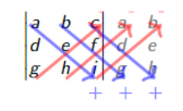
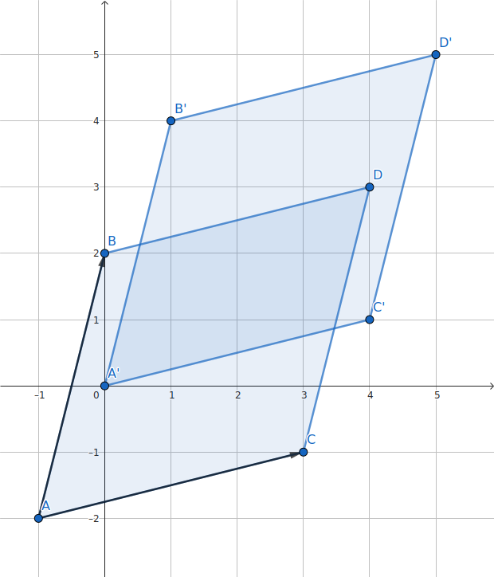

Ákveður
=====================
Ákveða (e. determinant) er fall frá :math:`\mathbb{R}^{n \times n}\rightarrow \mathbb{R}` sem úthlutar :math:`n \times n` fylki :math:`A` tölu :math:`\det(A)`.
Ákveða er einungis skilgreind fyrir ferningsfylki. Hana má nota t.d. til þess að segja til um hvort fylki sé andhverfanlegt. Ef ákveða fylkis er :math:`0` er fylkið ekki andhverfanlegt.

Ákveður :math:`2 \times 2` fylkja
---------------------------------

Skilgreining: Ákveða :math:`2 \times 2` fylkis
~~~~~~~~~~~~~~~~~~~~~~~~~~~~~~~~~~~~~~~~~~~~~~
.. admonition:: Skilgreining
  :class: skilgreining

  **Ákveða** :math:`2 \times 2` fylkis :math:`A=\begin{bmatrix}a & b\\ c & d \end{bmatrix}` er talan
  
  .. math:: \det(A) =\begin{vmatrix}
            a & b \\
            c & d 
            \end{vmatrix} =ad-bc.

.. admonition:: Athugasemd
    :class: athugasemd

    Athugið að ákveða :math:`2 \times 2` fylkis :math:`A` kemur fyrir í andhverfu fylkisins

     .. math:: A^{-1} =\frac{1}{ad-bc}\begin{bmatrix}
            d & -b \\
            -c & a 
            \end{bmatrix}.

    Við sjáum að fylkið :math:`A^{-1}` er ekki skilgreint fyrir :math:`ad-bc=0`, m.ö.o. fylkið :math:`A` er andhverfanlegt ef og aðeins ef :math:`\det(A)\neq 0`.  

Ákveður :math:`n \times n` fylkja
---------------------------------

Skilgreining: Hlutfylki
~~~~~~~~~~~~~~~~~~~~~~~
.. admonition:: Skilgreining
  :class: skilgreining

  Látum :math:`A` vera :math:`n \times n` fylki. Fylkið sem fæst með því að fjarlægja :math:`i`-tu línu og :math:`j`-ta dálk :math:`A` 
  kallast **hlutfylki**, :math:`A_{ij}`, og hefur stærð :math:`(n-1)\times (n-1)`.

Sýnidæmi: Hlutfylki
^^^^^^^^^^^^^^^^^^^

.. admonition:: Dæmi
  :class: daemi
    
  Hver eru hlutfylki, :math:`A_{ij}`, fylkisins
  
  .. math:: A =\begin{bmatrix}
            3 & 6 & 1\\
            5 & 2 & 0\\
            1 & 9 & 4\\
            \end{bmatrix}.
        
.. admonition:: Lausn
  :class: daemi, dropdown

  :math:`A` hefur eftirfarandi hlutfylki
  
  .. math:: A_{11} =\begin{bmatrix}
        2 & 0\\
        9 & 4\\
        \end{bmatrix},\quad
        A_{12} =\begin{bmatrix}
        5 & 0\\
        1 & 4\\
        \end{bmatrix},\quad
        A_{13} =\begin{bmatrix}
        5 & 2 \\
        1 & 9\\
        \end{bmatrix},
        \newline
        A_{21} =\begin{bmatrix}
        6 & 1\\
        9 & 4\\
        \end{bmatrix}, \quad
        A_{22} =\begin{bmatrix}
        3 & 1\\
        1 & 4\\
        \end{bmatrix}, \quad
        A_{23} =\begin{bmatrix}
        3 & 6\\
        1 & 9\\
        \end{bmatrix}.

        

Skilgreining: Ákveða :math:`n \times n` fylkis
~~~~~~~~~~~~~~~~~~~~~~~~~~~~~~~~~~~~~~~~~~~~~~
.. admonition:: Skilgreining
  :class: skilgreining

  **Ákveða** :math:`n \times n` fylkis :math:`A` er skilgreind
  
  .. math:: \det(A)=
            a_{11}\det(A_{11})-a_{12}\det(A_{12})+...+ (-1)^{1+n} a_{1n}\det(A_{1n})\\
            = \sum_{j=1}^{n}(-1)^{1+j}a_{1j}\det(A_{1j})

Sýnidæmi: Ákveða :math:`3 \times 3` fylkis
^^^^^^^^^^^^^^^^^^^^^^^^^^^^^^^^^^^^^^^^^^

.. admonition:: Dæmi
  :class: daemi
    
  Finnum ákveðu :math:`3 \times 3` fylkis
  
  .. math:: A =\begin{bmatrix}
            1 & 2 & 3\\
            4 & 5 & 6\\
            7 & 8 & 9\\
            \end{bmatrix}.
    
  með því að nota skilgreininguna.

        
.. admonition:: Lausn
  :class: daemi, dropdown

  Fáum
  
  .. math:: \det(A)=\begin{vmatrix}
        1 & 2 & 3\\
        4 & 5 & 6\\
        7 & 8 & 9\\
        \end{vmatrix}=
        1\det\begin{bmatrix}
        5 & 6 \\
        8 & 9
        \end{bmatrix}
        -2\det\begin{bmatrix}
        4 & 6 \\
        7 & 9
        \end{bmatrix}
        +3\det\begin{bmatrix}
        4 & 5 \\
        7 & 8
        \end{bmatrix}
        \newline
        =1(45-48) -2(36-42)+3(32-35)
        =-3+12-9=0

Þessi aðferð kallast að *liða eftir línu eða dálk* eftir því sem við á. Í dæminu hér að ofan var liðað eftir línu 1.
Athugið að velja má hvaða línu/dálk liðað er eftir og hentugast er að velja þá línu/dálk sem hefur flest :math:`0`.
Við sjáum að ákveða fylkis sem hefur núllínu eða núlldálk er alltaf :math:`0`.

.. admonition:: Athugasemd
    :class: athugasemd

    Formerkin í liðun eftir línu eða dálk fylgja mynstri sem minnir á skákborð

     .. math:: \begin{bmatrix}
            + & - & + & \dots\\
            - & + & - & \dots\\
            + & - & + & \dots\\
            \vdots & \vdots & \vdots & \ddots
            \end{bmatrix}.

Skilgreining: Önnur aðferð til þess að reikna ákveðu :math:`3 \times 3` fylkis
~~~~~~~~~~~~~~~~~~~~~~~~~~~~~~~~~~~~~~~~~~~~~~~~~~~~~~~~~~~~~~~~~~~~~~~~~~~~~~
.. admonition:: Skilgreining
  :class: skilgreining

  Reikna má ákveðu :math:`3 \times 3` fylkist með því að endurtaka fyrstu tvo dálka hægra megin við fylkið og leggja saman og draga frá þær 6 hornalínur sem þannig myndast.

Engin sambærileg regla gildir fyrir :math:`n \geq 4`.

Ákveður hornalínufylkja
-----------------------

Setning: Ákveða hornalínufylkja 
~~~~~~~~~~~~~~~~~~~~~~~~~~~~~~~~~~

.. admonition:: Setning
    :class: setning

    Ef :math:`A` er hornalínufylki þá er ákveða þess margfeldi stakanna á hornalínunni.

Sýnidæmi: Ákveður hornalínufylkja
^^^^^^^^^^^^^^^^^^^^^^^^^^^^^^^^^

.. admonition:: Dæmi
  :class: daemi
    
  Finna á ákveður eftirfarandi
  
  .. math:: A =\begin{bmatrix}
            2 & 2 & 3\\
            0 & -4 & 6\\
            0 & 0 & -1\\
            \end{bmatrix}, \quad
            B =\begin{bmatrix}
            1 & 0 & 0\\
            0 & -2 & 0\\
            6 & 0 & 5\\
            \end{bmatrix}, \quad
            C =\begin{bmatrix}
            2 & 0 & 0\\
            0 & 6 & 0\\
            0 & 0 & 7\\
            \end{bmatrix}.

        
.. admonition:: Lausn
  :class: daemi, dropdown

  Fáum með liðun eftir dálk 1
  
  .. math:: \det(A)=\begin{vmatrix}
            2 & 2 & 3\\
            0 & -4 & 6\\
            0 & 0 & -1\\
            \end{vmatrix}=
            2\cdot \begin{vmatrix}
            -4 & 6\\
            0 & -1\\
            \end{vmatrix}= 2\cdot -4\cdot \begin{vmatrix}
            -1\end{vmatrix}=8.
    
  Fáum með liðun eftir línu 1
  
  .. math:: \det(B) =\begin{vmatrix}
            1 & 0 & 0\\
            0 & -2 & 0\\
            6 & 0 & 5\\
            \end{vmatrix}=
            1\cdot\begin{vmatrix}
            -2 & 0\\
            0 & 5\\
            \end{vmatrix}
            =1\cdot -2\cdot\begin{vmatrix} 5 \end{vmatrix}=-10.

  Fáum beint
  
  .. math:: \det(C)=\begin{vmatrix}
            2 & 0 & 0\\
            0 & 6 & 0\\
            0 & 0 & 7\\
            \end{vmatrix}=2 \cdot 6 \cdot 7= 84.

Ákveður frumfylkja
------------------
Frumfylki eru þau fylki sem fást þegar einni einfaldri línuaðgerð er beitt á einingarfylki.

.. admonition:: Aðvörun
    :class: advorun

    Línuaðgerðir varðveita almennt ekki ákveður, heldur breyta þeim með mjög reglulegum hætti.
 

Setning: Ákveða frumfylkja 
~~~~~~~~~~~~~~~~~~~~~~~~~~~~

.. admonition:: Setning
    :class: setning

    Látum :math:`E` vera frumfylki. Ákveða frumfylkis er

    .. math:: \det(E)= \begin{cases}
        1 \quad \text{ef}\ E\ \text{er umskipting},\\
        -1 \quad \text{ef}\ E\ \text{er víxlun},\\
        k \quad \text{ef}\ E\ \text{er skölun með tölu}\ k.
        \end{cases}

Sýnidæmi: Ákveður frumfylkja
^^^^^^^^^^^^^^^^^^^^^^^^^^^^
.. admonition:: Dæmi
  :class: daemi

  **1**. Umskipting. Látum :math:`E` vera frumfylkið sem fæst með því að leggja margfeldi af einni línu við aðra, þ.e.a.s umskipting.
  Frumfylki af þessari gerð eru öll hornalínufylki, t.d.
  
  .. math:: \begin{bmatrix}
        1 & k\\
        0 & 1\\ 
        \end{bmatrix},\quad
        \begin{bmatrix}
        1 & 0 & 0\\
        0 & 1 & 0\\
        k & 0 & 1\\
        \end{bmatrix},\quad
        \begin{bmatrix}
        1 & 0 & k & 0\\
        0 & 1 & 0 & 0\\
        0 & 0 & 1 & 0\\
        0 & 0 & 0 & 1\\
        \end{bmatrix}.

  Ákveðan er margföldun stakanna á hornalínunni, :math:`\det(E)=1`.

  **2**. Víxlun. Látum :math:`E` vera frumfylkið sem fæst með því að víxla á línu :math:`i` og :math:`j`, t.d.
  
  .. math:: \begin{bmatrix}
        0 & 1\\
        1 & 0\\ 
        \end{bmatrix},\quad
        \begin{bmatrix}
        1 & 0 & 0\\
        0 & 0 & 1\\
        0 & 1 & 0
        \end{bmatrix},\quad
        \begin{bmatrix}
        0 & 0 & 1\\
        0 & 1 & 0\\
        1 & 0 & 0
        \end{bmatrix}.
        
    
  Með einföldum útreiningum er auðvelt að sannfæra sig um að :math:`\det(E)=-1`.

  **3**. Skölun. Látum :math:`E` vera frumfylkið sem fæst með því að margalda línu með tölu, t.d.
  
  .. math:: \begin{bmatrix}
        1 & 0\\
        0 & \pi
        \end{bmatrix},\quad
        \begin{bmatrix}
        1 & 0 & 0\\
        0 & k & 0\\
        0 & 0 & 1
        \end{bmatrix},\quad
        \begin{bmatrix}
        16 & 0 & 0 & 0\\
        0 & 1 & 0 & 0\\
        0 & 0 & 1 & 0\\
        0 & 0 & 0 & 1
        \end{bmatrix}.

  Við sjáum með því að margafalda hornalínuna að ákveðan er :math:`\det(E)=\pi`, :math:`\det(E)=k` og :math:`\det(E)=16` fyrir þessi þrjú fylki.

Í mörgum dæmum koma fyrir nokkrar umskiptingar, víxlanir og/eða skalanir. Til dæmis er alltaf hægt að koma ferningsfylki yfir á efri stallagerð með því að nota einungis umskiptingar og víxlanir.
Ef :math:`U` er efri stallagerð :math:`A`, sem fékkst með því að nota aðeins þessar tvær aðgerðir, gildir að :math:`\det(A)=\pm \det(U)`. Þetta má setja fram sem hjálparsetningu.

Hjálparsetning 
~~~~~~~~~~~~~~

.. admonition:: Setning
    :class: setning

    Ef ferningsfylki :math:`A` má umbreyta í fylki af efri stallagerð :math:`U` með umskiptingu og víxlunum og

    .. math:: \det(A)=\begin{cases}
        (-1)^r (\text{margfeldi vendistaka } U) \quad \text{ef } A\  \text{er andhverfanlegt}\\
        0 \quad \text{annars}
        \end{cases}
    
    þar sem :math:`r` er fjöldi víxlana sem notaðar voru við að breyta :math:`A` í :math:`U`.

Þessi niðurstaða gefur af sér reiknirit fyrir ákveðu. Fyrst er fylki komið yfir á efra stallaform með umskiptingu og víxlunum, síðan eru víxlanir taldar og ákveða
efra þríhyrningsfylkisins reiknuð með því að margfalda stökin á hornalínunni.  

Hjálparsetning 
~~~~~~~~~~~~~~

.. admonition:: Setning
    :class: setning

    Ef ferningsfylki :math:`A` hefur tvær eins línur :math:`i=j` þá er :math:`\det(A)=0`.
    Ennfremur, ef ein lína í :math:`A` er margfeldi af annarri þá er :math:`\det(A)=0`.

Eiginleikar ákveða
-------------------

Setning: Eiginleikar ákveða
~~~~~~~~~~~~~~~~~~~~~~~~~~~~

.. admonition:: Setning
    :class: setning

    Látum A og B vera :math:`n \times n` fylki. Þá gildir

        **1**. :math:`\det(A^T)=\det(A)`

        **2**. :math:`\det(AB)=\det(A)\cdot\det(B)`

        **3**. :math:`\det(A^{-1})=\frac{1}{\det(A)}`

1 er sannað með þrepun. 2 fæst með því að nota að annað fylkið, sem er andhverfanlegt, er línu-jafngilt einingafylkinu.
Jafnan helst einning ef annað fylkið er ekki andhverfanlegt, þá er ákveðan :math:`AB` einfaldlega :math:`0`. 3 leiðir beint af 2.

.. admonition:: Athugasemd
  :class: athugasemd

  Um tvö ferningsfylki :math:`A` og :math:`B` gildir almennt **ekki** að :math:`\det(A+B)=\det(A)+\det(B)`.

Skilgreining: Hjáþáttafylki
~~~~~~~~~~~~~~~~~~~~~~~~~~~
.. admonition:: Skilgreining
  :class: skilgreining

  Fyrir hlutfylki :math:`A_{ij}` skilgreinum við **hjáþátt** :math:`C_{ij}` í sæti :math:`(i,j)` með
  
  .. math:: C_{ij}=(-1)^{i+j}\det A_{ij}
    
  og **hjáþáttafylki** (e. cofactor matrix) :math:`A` með
  
  .. math::
        C=\begin{bmatrix}
        C_{11} & C_{12} & \dots & C_{1n}\\
        C_{21} & C_{22} & \dots & C_{21}\\
        \vdots & \vdots & \ddots & \vdots\\
        C_{n1} & C_{n2} & \dots & C_{nn}
        \end{bmatrix}

Skilgreining: Aðoka fylki
~~~~~~~~~~~~~~~~~~~~~~~~~~

.. admonition:: Skilgreining
  :class: skilgreining

  Látum :math:`C` vera hjáþáttafylki :math:`A`. Þá skilgreinum við **aðoka fylkið**
  :math:`\text{adj}A` (e. adjoint matrix) með
  
  .. math:: \text{adj}A = C^T

Setning: Andhverfujafna
~~~~~~~~~~~~~~~~~~~~~~~~~~

.. admonition:: Setning
    :class: setning

    Látum :math:`A` vera andhverfanlegt :math:`n \times n` fylki þá er

    .. math:: A^{-1} = \frac{\text{adj}A}{\det A}

Þessi formúla fyrir andhverfu fylkis er tímafrek og almenn leið til þess að reikna andhverfu :math:`n \times n` fylkis oftast hagnýtari. 

Regla Cramers
-------------

Regla Cramers er fræðileg niðurstaða sem gefur beina lausn á :math:`A \textbf{x} = \textbf{b}`. Þó er oftast fljótlegra að leysa jöfnuhneppi beint heldur en að nota hana.

Ritháttur
~~~~~~~~~

.. admonition:: Ritháttur
    :class: setning

    Látum :math:`A=[\bf{a}_1\dots\bf{a}_n]` vera :math:`n \times n` fylki og :math:`\textbf{b}\in \mathbb{R}^n` vera vigur.
    Þá skilgreinum við :math:`A_j(\textbf{b})` sem fylkið þar sem :math:`j`-ta dálkvigur fylkisins er skipt út fyrir :math:`\textbf{b}`, þ.e.
    
    .. math::
        A_j(\textbf{b})=[\bf{a}_1\dots\bf{a}_{j-1} \bf{b}\ \bf{a}_{j+1}\dots\bf{a}_n]

Setning: Regla Cramers
~~~~~~~~~~~~~~~~~~~~~~

.. admonition:: Setning
    :class: setning

    Látum :math:`A` vera andhverfanlegt :math:`n \times n` fylki, og :math:`\textbf{b}\in \mathbb{R}^n` vera vigur.
    Þá er lausnin á jöfnunni :math:`A \textbf{x} = \textbf{b}` gefin með formúlunni

    .. math:: \textbf{x}_i = \frac{\det A_i(\textbf{b})}{\det(A)}

Sýnidæmi: Leysa jöfnuhneppi með reglu Cramers
^^^^^^^^^^^^^^^^^^^^^^^^^^^^^^^^^^^^^^^^^^^^^
.. admonition:: Dæmi
  :class: daemi

  Leysið eftirfarandi jöfnuhneppi með því að nota reglu Cramers
  
  .. math:: 
        4x+2y-z=0,\\
        x+3y+7z=1,\\
        -3x-y+2z=1

.. admonition:: Lausn
  :class: daemi, dropdown

  Fylkjaframsetning jöfhnuhneppisins er
  
  .. math:: A= \left(
        \begin{array}{ccc}
        4 & 2 & -1 \\
        1 & 3 & 7 \\
        -3 & -1 & 2 \\
        \end{array}
        \right), \quad \textbf{b}=\left(
        \begin{array}{c}
        0 \\
        1 \\
        1 \\
        \end{array}
        \right),

  með 
  
  .. math::
        A_1 (\textbf{b}) = \left(
        \begin{array}{ccc}
        0 & 2 & -1 \\
        1 & 3 & 7 \\
        1 & -1 & 2 \\
        \end{array}
        \right), \
        A_2(\textbf{b})=\left(
        \begin{array}{ccc}
        4 & 0 & -1 \\
        1 & 1 & 7 \\
        -3 & 1 & 2 \\
        \end{array}
        \right), \
        A_3(\textbf{b})=\left(
        \begin{array}{ccc}
        4 & 2 & 0 \\
        1 & 3 & 1 \\
        -3 & -1 & 1 \\
        \end{array}
        \right)

  Athugum að :math:`\det A=-2`, :math:`\det A_1(\textbf{b})=14`, :math:`\det A_2(\textbf{b})=-24` og :math:`\det A_3(\textbf{b})=8`. Með reglu Cramers fæst því
  
  .. math::
        x_1 = \frac{\det A_1(\textbf{b})}{\det A}=-7,\ \
        x_2 = \frac{\det A_2(\textbf{b})}{\det A}=12,\ \
        x_3 = \frac{\det A_3(\textbf{b})}{\det A}=-4.
        
  Nú er um að gera að prófa lausnina með því að stinga inn fyrir :math:`\textbf{x}` í :math:`A \textbf{x}=\textbf{b}`.

Ákveður og rúmfræði
-------------------

Skilgreining: Samsíðungur
~~~~~~~~~~~~~~~~~~~~~~~~~
.. admonition:: Skilgreining
    :class: skilgreining

    Látum :math:`u=(u_1,u_2)` og :math:`v=(v_1,v_2)` vera tvo vigra í :math:`\mathbb{R}^2`.  **Samsíðungurinn** (e. paralellogram) sem vigrarnir ákvarða er ferhyrningurinn með hornpunkta :math:`(0,0), (u_1,u_2), (v_1,v_2),`
    og :math:`(u_1+v_1,u_2+v_2)`.

Skilgreining: Samhliðungur
~~~~~~~~~~~~~~~~~~~~~~~~~~
.. admonition:: Skilgreining
    :class: skilgreining

    Látum :math:`u=(u_1,u_2,u_3), v=(v_1,v_2,v_3)` og :math:`w=(w_1,w_2,w_3)` vera vigra í :math:`\mathbb{R}^3`.
    **Samhliðungurinn** (e. parallelepiped) sem vigrarnir ákvarða er rúmmálið með hornpunkta

    .. math:: (0,0,0), (u_1,u_2,u_3), (v_1,v_2,v_3), (w_1,w_2,w_3),
        (u_1+v_1,u_2+v_2,u_3+v_3),\\
        (u_1+w_1,u_2+w_2,u_3+w_3),
        (v_1+w_1,v_2+w_2,v_3+w_3),\\
        (u_1+v_1+w_1,u_2+v_2+w_2,u_3+v_3+w_3)

Setning: Flatarmál og rúmmál
~~~~~~~~~~~~~~~~~~~~~~~~~~~~~

.. admonition:: Setning
    :class: setning

    **1.** Látum :math:`A` vera :math:`2 \times 2` fylki. Flatarmál samsíðungana sem dálkvigrar :math:`A` ákvarða er :math:`\det A`.
    
    **2.** Látum :math:`A` vera :math:`3 \times 3` fylki. Rúmmál samhliðungsins sem dálkvigrar :math:`A` ákvarða er :math:`\det A`.

INSERT MYND

Ryfjum upp að mynd mengis :math:`S \subseteq \R` er mengið :math:`T(S)=\{T(s) : s \in S\}`.

Setning: Mynd varpanna
~~~~~~~~~~~~~~~~~~~~~~~~~

.. admonition:: Setning
    :class: setning

    **1.** Látum :math:`T: \R^2 \rightarrow \R^2` vera línulega vörpun og :math:`S` vera samsíðunginn sem ákvarðast af :math:`u` og :math:`v` í :math:`\R^2`.
    Þá er myndin :math:`T(S)` samsíðungurinn sem ákvarðast af vigrunum :math:`T(u)` og :math:`T(v)`.

    **2.** Látum :math:`T: \R^3 \rightarrow \R^3` vera línulega vörpun og :math:`S` vera samhliðunginn sem ákvarðast af :math:`u, v` og :math:`w` í :math:`\R^3`.
    Þá er myndin :math:`T(S)` samhliðungurinn sem ákvarðast af vigrunum :math:`T(u), T(v)` og :math:`T(w)`.

Setning: Flatarmál og rúmmál línulegra varpanna 
~~~~~~~~~~~~~~~~~~~~~~~~~~~~~~~~~~~~~~~~~~~~~~~~~~

.. admonition:: Setning
    :class: setning

    **1.** Gerum ráð fyrir að :math:`T: \R^2 \rightarrow \R^2` sé línuleg vörpun með fylki :math:`A`, og :math:`S` vera samsíðunginn sem ákvarðast af :math:`u` og :math:`v` í :math:`\R^2`.
    Þá er

    .. math:: \{ \text{flatarmál} \ T(S) \} = |\det A | \cdot \{ \text{flatarmál} \ S \}

    **2.** Gerum ráð fyrir að :math:`T: \R^3 \rightarrow \R^3` sé línuleg vörpun með fylki :math:`A`, og :math:`S` vera samhliðungurinn sem ákvarðast af :math:`u, v` og :math:`w` í :math:`\R^3`.
    Þá er

    .. math:: \{ \text{rúmmál} \ T(S)\} = |\det A | \cdot \{ \text{rúmmál} \ S \}

Sýnidæmi: Flatarmál samsíðungs
^^^^^^^^^^^^^^^^^^^^^^^^^^^^^^
.. admonition:: Dæmi
  :class: daemi

  Reikna á flatarmál samsíðungsins sem ákvarðaður er af hornpunktunum :math:`(-1,-2), (0,2), (3,-1)` og :math:`(4,3)`.

.. admonition:: Lausn
  :class: daemi, dropdown

  Við byrjum á því að hliðra hornpunktunum þannig að einn þeirra sé í miðju hnitakerfisins :math:`(0,0)`.
  Nýju hnitin sem fást eru :math:`(-1+1,-2+2)=(0,0), (0+1,2+2)=(1,4),` :math:`(3+1,-1+2)=(4,1)`
  og :math:`(4+1,3+2)=(5,5)`.
        
  Samsíðungurinn er ákvarðaður af dálkvigrum fylkisins
  
  .. math:: 
        A= \begin{bmatrix}
        1 & 4\\
        4 & 1
        \end{bmatrix}

  Þar sem :math:`|\det A| = |-15|` er flatarmál samsíðungsins :math:`15`.

