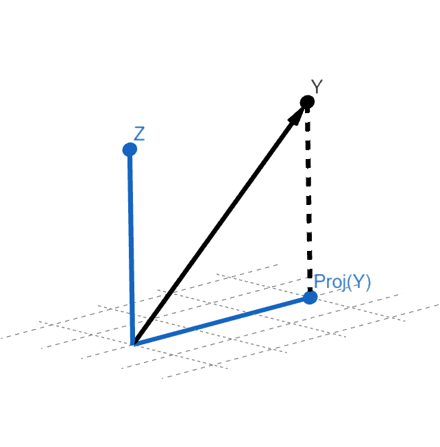

Innfeldi og hornrétt ofanvörp
==============================

Innfeldi
--------

Skilgreining: Innfeldi
~~~~~~~~~~~~~~~~~~~~~~
.. admonition:: Skilgreining
    :class: skilgreining

    Látum :math:`\textbf{u}=(u_1,u_2,\dots,u_n)` og :math:`\textbf{v}=(v_1,v_2,\dots,v_n)` vera vigra í :math:`\R^n`. 
    **Innfeldi** (e. inner product) er vörpun :math:`\R^n \times \R^n\ \rightarrow \R` sem tekur inn tvo vigra :math:`\bf u` og :math:`\bf v` og skilar tölunni :math:`\bf u^T v`.
    Oftast ritað
    
    .. math:: \textbf{u} \cdot \textbf{v}=\left(
        \begin{array}{cccc}
        u_1 & u_2 & \dots & u_n \\
        \end{array}
        \right)
        \cdot
        \left(
        \begin{array}{c}
        v_1 \\
        v_2 \\
        \dots \\
        v_n \\
        \end{array}
        \right)=
        u_1 v_1 + u_2 v_2 + ... u_n v_n.

Skilgreina má innfeldi fyrir almenn vigurrúm, ekki bara :math:`\R^n`. Stundum er innfeldið á :math:`\R^n` kallað *depilmargfeldi*.

Sýnidæmi: Innfeldi
^^^^^^^^^^^^^^^^^^^

.. admonition:: Dæmi
  :class: daemi

  Látum :math:`\textbf{u}=\begin{bmatrix} 1 \\ 2 \end{bmatrix}` og
  :math:`\textbf{v}=\begin{bmatrix} 3 \\ 4 \end{bmatrix}` reiknið innfeldið.

.. admonition:: Lausn
  :class: daemi, dropdown

  .. math:: \textbf{u} \cdot \textbf{v} = 1 \cdot 3 + 2 \cdot 4 = 3+8=11

Reiknireglur um innfeldi á :math:`\R^n`
~~~~~~~~~~~~~~~~~~~~~~~~~~~~~~~~~~~~~~~
.. admonition:: Setning
    :class: setning

    Látum :math:`\bf u,v` og :math:`\bf w` vera vigra í :math:`\R^n` og :math:`c \in \R`. Þá gildir

    **1.** :math:`\bf u \cdot v = \bf v \cdot u`.

    **2.** :math:`(\ve u+ \ve v)\cdot \ve w = \bf u \cdot w + v \cdot u`.

    **3.** :math:`(c \ve u)\cdot  \ve v = c ( \ve u\cdot \ve v)= \ve u \cdot (c \ve v)`.

    **4.** :math:`\ve u \cdot \ve u \geq 0`, og :math:`\ve u \cdot \ve u = 0` ef og aðeins ef :math:`\bf u=0`.

Lengd
-----

Skilgreining: Lengd
~~~~~~~~~~~~~~~~~~~
.. admonition:: Skilgreining
    :class: skilgreining

    Látum :math:`\textbf{u}=(u_1,u_2,\dots,u_n)` vera vigur í :math:`\R^n`. **Lengd**, stundum kallað *staðall* eða *norm*, vigursins :math:`\bf u` er talan

    .. math:: ||\ve u||:=\sqrt{\ve u \cdot \ve u}=\sqrt{u_1^2+u_2^2+\dots + u_n^2}

Sýnidæmi: Lengd vigurs
^^^^^^^^^^^^^^^^^^^^^^^

.. admonition:: Dæmi
  :class: daemi

  Reiknið lengd vigursins :math:`\textbf{u} = \begin{bmatrix} 1 \\ 2 \\ 3 \end{bmatrix}`

.. admonition:: Lausn
  :class: daemi, dropdown 

  .. math:: ||\textbf{u}|| = ||(1,2,3)||=\sqrt{1^2+2^2+3^2}=\sqrt{1+4+9}=\sqrt{14}

Reiknireglur um lengd 
~~~~~~~~~~~~~~~~~~~~~
.. admonition:: Setning
    :class: setning

    Látum :math:`\bf u` og :math:`\bf v` vera vigra í :math:`\R^n` og :math:`c \in \R`. Þá gildir

    **1.** :math:`||\ve u||\geq 0` og :math:`||\ve u||=0` ef og aðeins ef :math:`\ve u=\ve 0`.

    **2.** :math:`|| \ve u + \ve v || \leq ||\ve u|| + ||\ve v||`.

    **3.** :math:`|| c \ve u|| = |c| ||\ve u||`.

    **4.** :math:`|\ve u \cdot\ve v | \leq ||\ve u || || \ve v ||`

Skilgreining: Einingarvigur
~~~~~~~~~~~~~~~~~~~~~~~~~~~
.. admonition:: Skilgreining
    :class: skilgreining

    Vigur :math:`\ve u \in \R^n` sem hefur lengdina :math:`||\ve u||=1` kallast **einingarvigur** (e. unit vector). Stundum ritað :math:`\hat{\ve u}`.

Sérhvern vigur :math:`\ve u \in \R^n` (að undanskildum núllvigri) má *staðla*, þ.e. gera að einingarvigri, með því að deila með lengdinni, :math:`\hat{\ve u} = \ve u / || \ve u ||`.

Fjarlægðir í :math:`\R^n`
--------------------------

Skilgreining: Fjarlægð milli punkta í :math:`\R^n`
~~~~~~~~~~~~~~~~~~~~~~~~~~~~~~~~~~~~~~~~~~~~~~~~~~
.. admonition:: Skilgreining
    :class: skilgreining

    Látum :math:`\ve u` og :math:`\ve v` vera vigra í :math:`\R^n`. **Fjarlægðin** milli :math:`\ve u` og :math:`\ve v` er skilgreind sem lengdin á vigrinum :math:`\ve u- \ve v`, þ.e.

    .. math:: d(\ve u, \ve v):=||\ve u - \ve v || = \sqrt{(u_1-v_1)^2 + (u_2-v_2)^2 + \dots + (u_n-v_n)^2}.

Í skilgreiningunni hér að ofan hugsum við um :math:`\ve u` og :math:`\ve v` ýmist sem vigra eða punkt í :math:`\R^n`. Á eftirfarandi mynd má sjá fjarlægð milli tveggja vigra.

MYND

Sýnidæmi: Fjarlægð milli punkta
^^^^^^^^^^^^^^^^^^^^^^^^^^^^^^^^^

.. admonition:: Dæmi
  :class: daemi

  Reiknum fjarlæð milli :math:`\begin{bmatrix} 1 \\ 2 \end{bmatrix}` og  :math:`\begin{bmatrix} -3 \\ 4 \end{bmatrix}`

.. admonition:: Lausn
  :class: daemi, dropdown

  .. math:: \sqrt{(1-(-3))^2+(2-4)^2}=\sqrt{4^2+(-2)^2}=\sqrt{16+4}=\sqrt{20}

Reiknireglur um fjarlægðir 
~~~~~~~~~~~~~~~~~~~~~~~~~~
.. admonition:: Setning
    :class: setning

    Látum :math:`\ve u, \ve v` og :math:`\ve w` vera puntka í :math:`\R^n`. Þá gildir
        **1.** :math:`d(\ve u, \ve v) \geq 0` og :math:`d(\ve u, \ve v)=0` ef og aðeins ef :math:`\ve u= \ve v`

        **2.** :math:`d(\ve u, \ve v) = d(\ve v, \ve u)`

        **3.** :math:`d(\ve u, \ve w) \leq d(\ve u + \ve v) + d(\ve v + \ve w)` 

Fall :math:`d: \R^n \times \R^n \rightarrow \R` sem uppfyllir þessi þrjú skilyrði kallast *firð* (e. metric).

Hornréttir vigrar
-----------------

Skilgreining: Hornrétt
~~~~~~~~~~~~~~~~~~~~~~~

.. admonition:: Skilgreining
  :class: skilgreining

  Látum :math:`\ve u` og :math:`\ve v` vera vigra í :math:`\mathbb{R}^n`.
  Vigrarnir :math:`\ve u` og :math:`\ve v` eru sagðir **hornréttir** (á hvorn annan) (e. orthogonal)  
  ef :math:`\ve u \cdot \ve v=0`

Skilgreinig: Hornið milli
~~~~~~~~~~~~~~~~~~~~~~~~~~~~~

.. admonition:: Skilgreinig
  :class: skilgreining

  Ef :math:`\ve u` og :math:`\ve v` eru vigrar í  :math:`\mathbb{R}^n`, sem er hvorugur núll, þá
  skilgerinum við **hornið milli** (e. angle between) þeirra sem töluna 

  .. math:: \theta = \arccos\big(\frac{\textbf{u}\cdot\textbf{v}}{||\textbf{u}|| ||\textbf{v}||}\big)

Regla Pýþagórasar
~~~~~~~~~~~~~~~~~

.. admonition:: Setning
  :class: setning

  Vigrarnir :math:`\ve u` og :math:`\ve v` eru hornréttir hvor á annan þá 
  og því aðeins að

  .. math:: ||\ve u||^2+||\ve v||^2=||\ve u + \ve v||^2

Hornrétt fyllirúm 
--------------------

Skilgreining: Hornrétt fyllirúm 
~~~~~~~~~~~~~~~~~~~~~~~~~~~~~~~~~~

.. admonition:: Skilgreining
  :class: skilgreining

    Látum :math:`W` vera mengi vigra í :math:`\R^n`. *Hornrétt fyllirúm* (e. orthogonal complement) er mengi :math:`W^{\perp}` allra þeirra vigra í :math:`\R^n` sem eru hornréttir á sérhvern vigur í :math:`W`, þ.e.

        .. math:: W^{\perp}=\{ z \in \R^n : z \cdot w =0\ \text{fyrir alla vigra}\ w \in W \}

Setning: Hornrétt fyllirúm
~~~~~~~~~~~~~~~~~~~~~~~~~~
.. admonition:: Setning
    :class: setning

    **a.** Látum :math:`W` vera hlutmengi í :math:`\R^n`. Hornrétta fyllirúmið :math:`W^{\perp}` er hlutrúm í :math:`\R^n`.

    **b.** Ef :math:`W` er hlutrúm í :math:`\R^n` þá :math:`W \cap W^{\perp}=\{\ve 0\}` og :math:`(W^{\perp})^{\perp}=W`.

    **c.** Látum :math:`W=\text{Span}\{v_1,...,v_p\}`. Vigur :math:`x` er í :math:`W^{\perp}` ef og aðeins ef hann er hornréttur á sérhvern vigranna :math:`v_1,...,v_p`.

    **d.** Látum :math:`A` vera :math:`m \times n` fylki. Þá er :math:`\text{Row}(A)^{\perp}=\text{Nul}(A)` og :math:`\text{Col}(A)^{\perp}=\text{Nul}(A^{T})`.

Sönnum **a.** í setningunni hér að ofan. 

.. admonition:: Athugasemd
    :class: athugasemd

    Látum :math:`W` vera hlutmengi í :math:`\mathbb{R}^n`.

        **1.** Vigurinn :math:`\ve 0` er hornréttur á öll stök í :math:`W` svo :math:`\ve 0 \in W^\perp`.

        **2.** Látum :math:`\ve u, \ve v \in W^\perp` og látum :math:`\ve w` vera hvaða vigur sem er í :math:`W`. 
        Þá er 

        .. math::(\ve u + \ve v)\cdot\ve w = \ve u \cdot \ve w + \ve v \ cdot \ve w=0+0=0
        
        svo :math:`(\ve u+\ve v)` er hornrétt á alla vigra :math:`W` og því er :math:`(\ve u + \ve v) \in W^\perp`.

        **3.** Látum :math:`\ve u \in W^\perp`, :math:`\ve w` vera hvaða vigru sem er í :math:`W` og :math:`c` vera raunrölu. Þá er 

        .. math:: (c\textbf{u})\cdot \textbf{w} = c\ve u \cdot \ve w = c \cdot 0 = 0 
        
        svo :math:`c\ve u` er hornréttu á alla vigra í :math:`W` og því er :math:`c\ve u\in W^\perp`.

    Þetta sýnir að :math:`W^\perp` er hlutrúm í :math:`\mathbb{R}^n`.

Þverstæð og þverstöðluð mengi
-----------------------------

Skilgreining: Þverstæð og þverstöðluð mengi
~~~~~~~~~~~~~~~~~~~~~~~~~~~~~~~~~~~~~~~~~~~~~
.. admonition:: Skilgreining
    :class: skilgreining

    Mengi :math:`W` í :math:`\R^n` er *þverstætt* (e. orthogonal) ef sérhverjir tveir vigrar í menginu eru hornréttir hvor á annan.
    Mengið er sagt *þverstaðlað* (e. orthonormal) ef það er þverstætt og allir vigrarnir í :math:`W` hafa lengdina 1.

Sýnidæmi: Þverstæð og þverstöðluð mengi
^^^^^^^^^^^^^^^^^^^^^^^^^^^^^^^^^^^^^^^
.. admonition:: Dæmi
  :class: daemi
  
  **1.** Venjulegi grunnurinn :math:`\{\ve e_1, \dots, \ve e_n \}` í :math:`\R^n` er þverstaðlað mengi. Þeir hafa allir lengdina einn þar sem þeir eru einingarvigrar og þeir eru hornréttir samkvæmt skilgreiningu.

  **2.** :math:`\{v_1, v_2, v_3 \}` þar sem :math:`v_1=(3,1,1), v_2=(-1,2,1)` og :math:`v_3=(-1/2,-2,7/2)` er þverstætt mengi. Það má auðveldlega sannfæra sig að svo sé með því að sýna fram á að öll infeldin :math:`v_1 \cdot v_2, v_1 \cdot v_3` og :math:`v_2 \cdot v_3` séu núll, og lengdir vigranna eru ekki 1.

Sýnidæmi: Þverstæð mengi
^^^^^^^^^^^^^^^^^^^^^^^^^^^

.. admonition:: Dæmi
  :class: daemi

  Finnið dæmi um þrjá vigra sem mynda þverstætt mengi og þrjá vigra sem gera það ekki, af eftirfarandi vigurm.

    
    .. math:: \ve u=\begin{bmatrix} 1 \\ -2 \\ 0 \end{bmatrix}, 
        \ve v=\begin{bmatrix} 2 \\ 1 \\ 3 \end{bmatrix}, 
        \ve w=\begin{bmatrix} 1 \\ 1 \\ -1 \end{bmatrix},
        \ve q=\begin{bmatrix} 0 \\ 0 \\ 3 \end{bmatrix}.

.. admonition:: Lausn
  :class: daemi, dropdown

  Athugum fyrst :math:`\ve u, \ve v` og :math:`\ve w`.

    .. math:: \ve u \cdot \ve v = (1)(2)+(-2)(1)+(0)(3)=0

    .. math:: \ve v \cdot \ve w = (2)(1)+(1)(1)+(3)(-1)=0
        
    .. math:: \ve u \cdot \ve w = (1)(1)+(-2)(1)+(0)(-1)=-1
    
  Þar sem innfeldið er ekki 0 í öllum tilfellum svo vigrarir mynda ekki þverstætt mengi.

  Athugum því næst :math:`\ve u, \ve v` og :math:`\ve q`.
    
    .. math:: \ve u \cdot \ve v = (1)(2)+(-2)(1)+(0)(3)=0
    
    .. math:: \ve v \cdot \ve q = (2)(0)+(1)(0)+(0)(3)=0
    
    .. math:: \ve u \cdot \ve q = (1)(0)+(-2)(0)+(0)(3)=0
  
  Þar sem innfeldið er 0 í öllum tilfellum mynda vigrarnir þverstætt mengi.

MYND

Setning: Þverstæð mengi eru línulega óháð
~~~~~~~~~~~~~~~~~~~~~~~~~~~~~~~~~~~~~~~~~
.. admonition:: Setning
    :class: setning

    Látum :math:`S=\{\ve u_1, \dots, \ve u_p\}` vera þverstætt hlutmengi í :math:`\R^n` sem inniheldur engan núllvigur. Þá er :math:`S` línulega óháð og er því grunnur fyrir hlutmengið spannað af :math:`S`.

Þverstæðir og þverstaðlaðir grunnar
-----------------------------------

Skilgreining: Þverstæðir og þverstaðlaðir grunnar
~~~~~~~~~~~~~~~~~~~~~~~~~~~~~~~~~~~~~~~~~~~~~~~~~~
.. admonition:: Skilgreining
    :class: skilgreining

    Látum :math:`W` vera hlutrúm í :math:`\R^n` og :math:`\{\ve u_1, \dots, \ve u_p \}` vera grunn fyrir :math:`W`.
    
    **1.** Grunnurinn fyrir :math:`W` er *þverstæður* (e. orthogonal basis) ef sérhverjir tveir ólíkir vigrar í grunninum eru hornréttir hvor á annan, m.o.ö.

        .. math:: u_i \cdot u_j =0\  \forall \ i \neq j.
    
    **2.** Grunnurinn  fyrir :math:`W` er *þverstaðlaður* (e. orthonormal basis) ef sérhverjir tveir vigrar í grunninum eru hornréttir hvor og annan og allir vigrarnir eru einingarvigrar, m.ö.o.

        .. math:: u_i \cdot u_j = \begin{cases}
            0\ \forall \ i \neq j \\
            1\ \forall \ i = j
            \end{cases}

Sýnidæmi :math:`\bf 6.6.1.1.` um þverstæð og þverstöðluð mengi er einnig dæmi um þverstæða og þverstaðlaða grunna.

.. admonition:: Athugasemd
    :class: athugasemd

    Ef mengið :math:`\{\ve v_1, \dots, \ve v_p \}` er þverstæður grunnur fyrir hlutrúm :math:`W` í :math:`\R^n` þá er mengið 

    .. math:: \Big\{ \frac{\ve v_1}{|| \ve v_1 ||}, \dots, \frac{\ve v_p}{|| \ve v_p ||} \Big\}
    
    þverstaðlaður grunnur fyrir :math:`W`. Niðurstaðan er sú að ef við höfum þverstæðan grunn er hægt að búa til þverstaðlaðan grunn.

Skilgreining: Hnit m.t.t. þverstæðra og þverstaðlaða grunna
~~~~~~~~~~~~~~~~~~~~~~~~~~~~~~~~~~~~~~~~~~~~~~~~~~~~~~~~~~~
.. admonition:: Skilgreining
    :class: skilgreining

    Látum :math:`W` vera hlutrúm í :math:`\R^n` og :math:`\mathcal{B}=\{\ve u_1, \dots, \ve u_p \}` vera grunn fyrir :math:`W`.

    **1.** Ef :math:`\ve y \in W` og :math:`\mathcal{B}` er þverstaæður þá er 

    .. math:: \ve y = c_1 \ve u_1 + \dots + c_p \ve u_p

    þar sem 

    .. math:: c_j = \frac{\ve y \cdot \ve u_j}{\ve u_j \cdot \ve u_j},\ \text{fyrir}\ j=1,...,p.
    
    Þ.e., hnitavigur :math:`\ve y` m.t.t. grunnsins :math:`\mathcal{B}` er

    .. math:: [\ve y]_{\mathcal{B}} = \Big(\frac{\ve y \cdot \ve u_1}{\ve u_1 \cdot \ve u_1}, \dots, \frac{\ve y \cdot \ve u_p}{\ve u_p \cdot \ve u_p} \Big).
    
    **2.** Ef :math:`\ve y \in W` og :math:`\mathcal{B}` er þverstaðlaður þá er

    .. math:: \ve y = c_1 \ve u_1 + \dots + c_p \ve u_p

    þar sem 

    .. math:: c_j = \ve y \cdot \ve u_j,\ \text{fyrir}\ j=1,...,p.

    Þ.e., hnitavigur :math:`\ve y` m.t.t. grunnsins :math:`\mathcal{B}` er

    .. math:: [\ve y]_{\mathcal{B}} = \Big(\ve y \cdot \ve u_1, \dots, \ve y \cdot \ve u_p \Big).
    
  
Sýnidæmi: Hnit vigurs m.t.t. grunns
^^^^^^^^^^^^^^^^^^^^^^^^^^^^^^^^^^^^^^
.. admonition:: Dæmi
  :class: daemi

  Reikna á hint vigursins :math:`\ve v = (3,-2)` m.t.t. grunnanna :math:`\mathcal{B}=\{(1,1),(-1,1) \}` og :math:`\mathcal{C}=\{\frac{1}{\sqrt{2}}(1,1), \frac{1}{\sqrt{2}}(-1,1) \}` fyrir :math:`\R^2`.

.. admonition:: Lausn
  :class: daemi, dropdown

  **1.** Hnit :math:`\ve v` m.t.t. þverstæða grunnsins :math:`\mathcal{B}` eru
  
  .. math:: c_1 = \frac{(3,-2)\cdot (1,1)}{(1,1)\cdot (1,1)}=\frac{1}{2},

  og

  .. math:: c_2 = \frac{(3,-2)\cdot(-1,1)}{(-1,1)\cdot (-1,1)}=\frac{-5}{2},

  svo

  .. math:: (3,-2)=c_1 (1,1)+ c_2 (-1,1)=\frac{1}{2}(1,1) - \frac{5}{2}(-1,1)

  svo

  .. math:: [(3,-2)]_{\mathcal{B}}=(\frac{1}{2},\frac{-5}{2}).

  **2.** Hnit :math:`\ve v` m.t.t. þverstaðlaða grunnsins :math:`\mathcal{C}` eru

  .. math:: c_1 = (3,-2)\cdot \big(\frac{1}{\sqrt{2}}(1,1) \big)= \frac{1}{\sqrt{2}}

  og

  .. math:: c_2 = (3,-2)\cdot \big(\frac{1}{\sqrt{2}}(-1,1) \big)= \frac{-5}{\sqrt{2}}

  svo

  .. math:: [(3,-2)]_{\mathcal{C}}=(\frac{1}{\sqrt{2}},\frac{-5}{\sqrt{2}}).

Sýnidæmi: Annað dæmi um hnit vigurs m.t.t. grunns
^^^^^^^^^^^^^^^^^^^^^^^^^^^^^^^^^^^^^^^^^^^^^^^^^^^^^

.. admonition:: Dæmi
  :class: daemi

  Finnið hnit puktsins :math:`\ve y=(1,1,1)` með tilliti til þverstæða grunnsins

  .. math:: \mathcal{B}=
    \left\{
    \begin{bmatrix} 1 \\ -2 \\ 0 \end{bmatrix}, \begin{bmatrix} 2 \\ 1 \\ 0 \end{bmatrix}, \begin{bmatrix} 0 \\ 0 \\ 3 \end{bmatrix}
    \right\}

.. admonition:: Lausn
  :class: daemi, dropdown

  Fáum að

  .. math:: c_1 = \frac{(1,1,1)\cdot (1,-2,0)}{(1,-2,0)\cdot (1,-2,0)}=
    \frac{1-2+0}{1+(-2)^2+0^2}=-\frac{1}{5}

  .. math:: c_2 = \frac{(1,1,1)\cdot (2,1,0)}{(2,1,0)\cdot (2,1,0)}=
    \frac{2+1+0}{2^2+1^2+0^2}=\frac{3}{5}
  
  .. math:: c_3 = \frac{(1,1,1)\cdot (0,0,3)}{(0,0,3)\cdot(0,0,3)}=
    \frac{0+0+3}{0^2+0^2+3^2}=\frac{3}{9}=\frac{1}{3}
  
  Svo

  .. math:: [\ve y]_\mathcal{B}=\left(-\frac{1}{5}, \frac{3}{5}, \frac{1}{3}\right)

Hornrétt ofanvarp
-------------------
    

Skilgreining: Hornrétt ofanvarp
~~~~~~~~~~~~~~~~~~~~~~~~~~~~~~~~

.. admonition:: Skilgreining
  :class: skilgreining

  Látum :math:`\ve u \neq \ve 0` og :math:`\ve y` vera vigra í :math:`\mathbb{R}^n`.
  Við skilgreium 

  .. math:: \hat{\ve y} = \frac{\ve y \cdot \ve u}{\ve u \cdot \ve u}\cdot \ve u

  sem *hornrétt ofanvarp* (e. orthogonal projection) :math:`\ve y` á :math:`\ve u`. Stundum er ofanvarp táknað með proj(:math:`\ve y`). 

Liða má vigur :math:`\ve y \in \R` upp í samsíðan og hornréttan þátt, þ.e. :math:`\ve y=\hat{\ve y}+\ve z`, eins og sjá má á eftirfarandi mynd.

Punkturinn :math:`\hat{\ve y}` er sá punktur á línunni í planinu sem er í minnstri fjarlægð frá punktinum :math:`\ve y`.

Sýnidæmi: Hornrétt ofanvarp
^^^^^^^^^^^^^^^^^^^^^^^^^^^^^^^^^

.. admonition:: Dæmi
  :class: daemi

  Reikna á hornrétt 
  ofanvarp :math:`\ve u=(3,1)` á :math:`\ve y=(1,3)`, þverþáttinn :math:`\ve z` og :math:`||\ve z ||`.

.. admonition:: Lausn
  :class: daemi, dropdown

  Fáum

  .. math:: \hat{\ve y} = \frac{\ve y \cdot \ve u}{\ve u \cdot \ve u}=\frac{(3,1)\cdot(1,3)}{(3,1)\cdot(3,1)}\begin{bmatrix} 3 \\ 1 \end{bmatrix}=\frac{6}{10}\begin{bmatrix} 3 \\ 1 \end{bmatrix}=\frac{3}{5}\begin{bmatrix} 3 \\ 1 \end{bmatrix}=\begin{bmatrix} \frac{9}{5} \\ \frac{3}{5} \end{bmatrix},

  og 

  .. math:: \ve z = \ve y - \hat{\ve y}=\begin{bmatrix}1 \\3 \end{bmatrix}-\begin{bmatrix} \frac{9}{5} \\ \frac{3}{5} \end{bmatrix}=\begin{bmatrix} -\frac{4}{5} \\ \frac{12}{5} \end{bmatrix}.

  Í kjölfarið finnum við fjarlægð :math:`\ve y` frá rúminu sem :math:`\ve u` spannar, þ.e.
  :math:`||\ve z||`, með

  .. math:: \sqrt{\left(-\frac{4}{5}\right)^2+\left(\frac{12}{5}\right)^2}=\sqrt{\frac{16}{25}+\frac{144}{25}}=\sqrt{32}.

.. admonition:: Lausnir prófaðar
  :class: daemi, dropdown

  Við fengum að
  :math:`\hat{\ve y}=\begin{bmatrix} \frac{9}{5} \\ \frac{3}{5} \end{bmatrix}` og 
  :math:`\hat{\ve z}=\begin{bmatrix} -\frac{4}{5} \\ \frac{12}{5} \end{bmatrix}`. Prófum þessar lausnir 
  
    **1.**  :math:`\ve y` er summan af  :math:`\hat{\ve y}` og  :math:`\ve z`
    
    .. math:: \hat{\ve y}+\ve z =\begin{bmatrix} \frac{9}{5} \\ \frac{3}{5} \end{bmatrix}+\begin{bmatrix} -\frac{4}{5} \\ \frac{12}{5} \end{bmatrix}=\begin{bmatrix} 1 \\ 3 \end{bmatrix}.

    Já.
    
    **2.**  :math:`\hat{\ve y}` er samsíða :math:`\ve u` því

    .. math:: \hat{\ve y} = \begin{bmatrix} \frac{9}{5} \\ \frac{3}{5} \end{bmatrix} = \frac{3}{5} \begin{bmatrix} 3 \\ 1 \end{bmatrix} = \frac{3}{5} \ve u.

    Já.
     
    **3.**  :math:`\ve z` er hornrétt á :math:`\ve u`

    .. math:: \ve z \cdot \ve u = \begin{bmatrix} -\frac{4}{5} \\ \frac{12}{5} \end{bmatrix} \cdot \begin{bmatrix} 3 \\1 \end{bmatrix} = -\frac{12}{3}+\frac{12}{3}=0.

    Já.

Skilgreining: Hornrétt ofanvarp á hlutrúm
~~~~~~~~~~~~~~~~~~~~~~~~~~~~~~~~~~~~~~~~~~~

.. admonition:: Skilgreining
  :class: skilgreining

  Látum :math:`W` vera hlutrúm og :math:`\ve y` vera vigur í :math:`\R^n`. Við skilgreinum hornrétt ofanvarp á hlutrúm :math:`W` sem
  :math:`\text{proj}_W: \R^n \rightarrow \R^n` þannig að :math:`\text{proj}_W \ve y = \hat{\ve y}\in W` er hornrétt ofanvarp vigurs :math:`\ve y` á :math:`W` og
  :math:`\ve z=\ve y - \hat{\ve y} \in W^{\perp}`.

  
Eiginleikar ofanvarps
~~~~~~~~~~~~~~~~~~~~~~

.. admonition:: Setning
  :class: setning

  Látum :math:`W` vera hlutrúm í :math:`\R^n`.

    **1.** Fyrir sérhvern vigur :math:`\ve y \in \R^n` þá er :math:`\text{proj}_W(\ve y) \in W`.

    **2.** Ef :math:`\ve y \in W` þá er :math:`\text{proj}_W \ve y=\ve y`.

    **3.** Ef :math:`\ve y \in W^\perp` þá er :math:`\text{proj}_W \ve y=\ve 0`
    
    **4.** Fyrir sérhvern vigur :math:`\ve y \in \mathbb{R}^n` gildir að :math:`\text{proj}_W(\text{proj}_W \ve y)=\text{proj}_W \ve y` svo
    um vörpunina :math:`\text{proj}_W` gildir því að :math:`\text{proj}_W \circ  \text{proj}_W = \text{proj}_W`

Setning: Hornréttir grunnar fyrir hlutrúm
~~~~~~~~~~~~~~~~~~~~~~~~~~~~~~~~~~~~~~~~~~~~~

.. admonition:: Setning
  :class: setning

  Látum :math:`W` vera hlutrúm í :math:`\R^n`. Ef :math:`\{ \ve u_1, \ve u_2, \cdots, \ve u_p \}` er þverstæður grunnur fyrir :math:`W` þá er

    **1.** :math:`W=\text{span}\{\ve u_1, \cdots \ve u_p\}`.

    **2.** Mengið :math:`\{\ve u_1, \cdots \ve u_p\}` er línulega óháð.

    **3.** Ef :math:`i \neq j` þá eru :math:`\ve u_i` og  :math:`\ve u_j` hornréttir horn á annan, m.ö.o.  :math:`\ve u_i \cdot \ve u_j =0`.

Setning: Hornrétt liðun (e. orthogonal decomposition)
~~~~~~~~~~~~~~~~~~~~~~~~~~~~~~~~~~~~~~~~~~~~~~~~~~~~~~~~~~~~~~~~~~~

.. admonition:: Setning
  :class: setning

  Látum :math:`W` vera hlutrúm og :math:`\ve y` vera vigur í :math:`\R^n`. Þá er til ótvírætt ákvarðaður vigur :math:`\hat{\ve y}\in W` þannig að :math:`\ve z = \ve y - \hat{\ve y}\in W^{\perp}`.
  Ef :math:`\{ \ve u_1, \ve u_2, \cdots, \ve u_p \}` er þverstæður grunnur fyrir :math:`W` þá er

  .. math:: \hat{\ve y} = \frac{\ve y \cdot \ve u_1}{\ve u_1 \cdot \ve u_1} \ve u_1 + \frac{\ve y \cdot \ve u_2}{\ve u_2 \cdot \ve u_2} \ve u_2 + \cdots + \frac{\ve y \cdot \ve u_p}{\ve u_p \cdot \ve u_p} \ve u_p.

  Eins ef :math:`\{ \ve u_1, \ve u_2, \cdots, \ve u_p \}` er þverstaðlaður grunnur fyrir :math:`W` þá er

  .. math:: \hat{\ve y} = (\ve y \cdot \ve u_1)\ve u_1 + (\ve y \cdot \ve u_2)\ve u_2 + \cdots + (\ve y \cdot \ve u_p)\ve u_p.

Skilgreinig: Fylki fyrir ofanvarp
~~~~~~~~~~~~~~~~~~~~~~~~~~~~~~~~~~~~~

.. admonition:: Skilgreinig
  :class: skilgreining

  Látum :math:`W` vera hlutrúm í :math:`\mathbb{R}^n` og gerum ráð fyrir að 
  :math:`\{ \ve u_1, \ve u_2, \cdots, \ve u_p \}` sé þverstaðlaður grunnur fyrir
  :math:`W`. Skilgreinum :math:`n \times p` fylkið 

  .. math:: U = \begin{bmatrix} \ve u_1 & \ve u_2 & \cdots & \ve u_p \end{bmatrix}

  Fyrir sérhvern vigur :math:`\ve y \in \mathbb{R}^n` er 

  .. math:: \text{proj}_W \ve y = UU^T \ve y.

  Fylkið :math:`P_W=UU^T` er af stærð :math:`n \times n` og er kallað *ofanvarpsfylkið* (e. projection matrix) á hlutrúmið :math:`W`.

Gram-Schmidt
--------------

Aðferð Gram-Schmidt er reiknirit til þess að búa til þverstæðan eða þverstaðlaðan grunn fyrir hlutrúm, að undanskildu núllrúmi, í :math:`\R^n`.

Setning: Aðferð Gram-Schmidt
~~~~~~~~~~~~~~~~~~~~~~~~~~~~~~

.. admonition:: Setning
  :class: setning

  Látum :math:`\{\ve x_1, \cdots, \ve x_p\}` vera grunn fyrir hlutrúm :math:`W` ( og :math:`W \neq {\ve 0}`)
  í :math:`\mathbb{R}^n`. Setjum

  .. math:: \ve v_1 = \ve x_1

  .. math:: \ve v_2 = \ve x_2 - \frac{\ve x_2 \cdot \ve v_1}{\ve v_1 \cdot \ve v_1}\ve v_1

  .. math:: \ve v_3 = \ve x_3 - \frac{\ve x_3 \cdot \ve v_1}{\ve v_1 \cdot \ve v_1}\ve v_1 - \frac{\ve x_3 \cdot \ve v_2}{\ve v_2 \cdot \ve v_2}\ve v_2

  .. math:: \vdots
  
  .. math:: \ve v_p = \ve x_p- \frac{\ve x_p \cdot \ve v_1}{\ve v_1 \cdot \ve v_1}\ve v_1
     - \frac{\ve x_p \cdot \ve v_2}{\ve v_2 \cdot \ve v_2}\ve v_2 - 
     \cdots - \frac{\ve x_p \cdot \ve v_{p-1}}{\ve v_{p-1} \cdot \ve v_{p-1}}\ve v_{p-1}

  Þá er :math:`\{\ve v_1, \cdots, \ve v_p\}` þverstæður grunnur fyrir :math:`W` og 

  .. math:: \text{Span}(\{\ve v_1, \cdots, \ve v_p\})=\text{Span}(\{\ve x_1, \cdots, \ve x_p\})
  
  fyrir :math:`k=1, \cdots, p`.

Sýnidæmi: Gram-Schmidt
^^^^^^^^^^^^^^^^^^^^^^^^^^^^^^^^^

.. admonition:: Dæmi
  :class: daemi

  Finna á þverstæðan og þverstaðlaðan grunn fyrir 
  
  .. math:: W=\text{Span}\left\{\begin{bmatrix} 1 \\ 3 \\ 1 \\ 1 \end{bmatrix}, 
    \begin{bmatrix} 1 \\ 1 \\ 1 \\ 1 \end{bmatrix}, \begin{bmatrix}
    -1 \\ 5 \\ 2 \\ 2 \end{bmatrix}\right\} \subseteq \mathbb{R}^4.
  

.. admonition:: Lausn
  :class: daemi, dropdown

  Notum reiknirit Gram-Schmidt

  **Skref 1:** Við sjáum að vigrarnir :math:`\ve x_1=(1,3,1,1), \ve x_2=(1,1,1,1) \text{ og } \ve x_3=(-1,5,2,2)` 
  eru línulega óháðir og mynda því grunn fyrir :math:`W`.

  **Skref 2:** Setjum :math:`\ve v_1=\ve x_1=(1,3,1,1)`. Svo setjum við

  .. math:: \ve v_2 = \ve x_2 - \frac{\ve x_2 \cdot \ve v_1}{\ve v_1 \cdot \ve v_1}\ve v_1

  .. math:: = (1,1,1,1)- 
    \frac{(1,1,1,1) 
    \cdot (1,3,1,1)}{(1,3,1,1)
    \cdot (1,3,1,1)}
    (1,3,1,1)

  .. math:: (1,1,1,1) - \frac{6}{12}(1,3,1,1)
    = (1/2, -1/2, 1/2, 1/2)
    = \frac{1}{2}(1,-1,1,1).

  Prófun sýnir að :math:`\ve v_2` er hornréttur á :math:`\ve v_1`. Að lokum setjum við

  .. math:: \ve v_3 = \ve x_3 - \frac{\ve x_3 \cdot \ve v_1}{\ve v_1 \cdot \ve v_1}\ve v_1 - \frac{\ve x_3 \cdot \ve v_2}{\ve v_2 \cdot \ve v_2}\ve v_2 

  .. math:: = (-1,5,2,2)- 
    \frac{(-1,5,2,2) \cdot (1,3,1,1)}
    {(1,3,1,1) \cdot (1,3,1,1)}
    (1,3,1,1)
  
  .. math:: - \frac{(-1,5,2,2) \cdot \frac{1}{2}(1,-1,1,1)}
    {\frac{1}{2}(1,-1,1,1) \cdot \frac{1}{2}(1,-1,1,1)}
    \frac{1}{2}(1,-1,1,1)

  .. math:: = (-1,5,2,2)-(18/12(1,3,1,1)-\frac{1}{2}(1,-1,1,1))
    
  .. math:: =(-2,0,1,1)

  Prófun sýnir að :math:`\ve v_3` er hornréttur á :math:`\ve v_1` og :math:`\ve v_2`. Vigrarnir :math:`\ve v_1, \ve v_2, \ve v_3` mynda þverstæðan grunn fyrir :math:`W`.

  
  **Skref 3:** Þverstaðlaður grunnur fyrir :math:`W` fæst með

  .. math:: \left\{\frac{(1,3,1,1)}{||(1,3,1,1)||}, \frac{\frac{1}{2}(1,-1,1,1)}{||(1,-1,1,1)||}, \frac{-2,0,1,1}{||(-2,0,1,1)||}\right\}
    
  .. math:: = \left\{\frac{(1,3,1,1)}{2\sqrt{3}}, \frac{1}{2}(1,-1,1,1), \frac{-2,0,1,1}{\sqrt{6}}\right\}

Að finna þverstaðlaðan grunn fyrir hlutrúm :math:`W`
^^^^^^^^^^^^^^^^^^^^^^^^^^^^^^^^^^^^^^^^^^^^^^^^^^^^^^^^^^^^^^^^^^

**Skref 1.** Byrjum á því að finna einhvern grunn fyrir :math:`W`.

**Skref 2.** Notum aðferð Gram-Schmidt til að finna þverstæðan grunn fyrir :math:`W`.

**Skref 3.** Staðla grunninn :math:`\{\ve v_1, \ve v_2, \cdots, \ve v_p\}` sem fékkst í skrefi 2, ef hann var ekki þverstaðlaður nú þegar, með því að deila með lengdinni

.. math:: \left\{\frac{\ve v_1}{||\ve v_1||}, \frac{\ve v_2}{||\ve v_2||}, \cdots, \frac{\ve v_p}{||\ve v_p||}\right\}.

Aðferð minnstu kvaðrata 
-------------------------

Aðferð minnstu kvarðrata (e. least squares) snýst um að finna nálgunarlausn á :math:`A \ve x = \ve b` þegar ekki er til nákvæm lausn. Heitið kemur frá því að ef við höfum
:math:`\ve b = (\ve b_1, \cdots, \ve b_n)` og :math:`A \ve x = (\ve y_1, \cdots, \ve y_n)` og setjum :math:`\ve x = \hat{\ve x}` þá er summa minnstu kvarðatanna
 
.. math:: ||\ve b - A \ve x ||^2=(\ve b_1 - \ve y_1)^2+ \cdots + (\ve b_n - \ve y_n)^2.

eins lítil og mögulegt er.

MYND

Skilgreining: Aðferð minnstu kvaðrata
~~~~~~~~~~~~~~~~~~~~~~~~~~~~~~~~~~~~~~

.. admonition:: Skilgreinig
  :class: skilgreining

  Látum :math:`A` vera :math:`m \times n` fylki og :math:`\ve b\in \R^m`. *Minnstu kvaðrata lausn* (e. least squares solution) á :math:`A \ve x = \ve b` er vigur
  :math:`\hat{\ve x}` þannig að

  .. math:: ||\ve b - A \hat{\ve x} || \leq || \ve b - A \hat{\ve x}||
  
  fyrir alla vigra :math:`\ve x \in \R^n`.

.. admonition:: Athugasemd
  :class: athugasemd

  Ef engin lasun er til á :math:`A \ve x = \ve b` þá er :math:`\ve b \notin \text{Col}(A)`. Aðferð minnstu kvaðrata er notuð til þess að finna hvaða punktur í dálkrúminu er næstur :math:`\ve b`. Það er punkturinn :math:`\hat{\ve b}` sem er hornrétta ofanvarpið af :math:`\ve b` á dálkrúm :math:`A`.

Setning: Lausnarmengi aðferð minnstu kvaðrata
~~~~~~~~~~~~~~~~~~~~~~~~~~~~~~~~~~~~~~~~~~~~~~~~

Þessi niðurstaða er mjög gagnleg í útreikningum!

.. admonition:: Setning
  :class: setning

  Látum :math:`A` vera :math:`m \times n` fylki og :math:`\ve b \in \R^m`. Mengi minnstu kvaðrata lausna :math:`A\ve x = \ve b` er jafnt lausnarmengi :math:`A^T A \ve x = A^T \ve b` sem hefur alltaf lausn.

.. admonition:: Fylgisetning
  :class: setning

  Látum :math:`A` vera :math:`m \times n` fylki og :math:`\ve b \in \R^m`. Ef dálkvigrar :math:`A` eru línulega óháðir þá er fylkið :math:`A^T A` andhverfanlegt og minnstu kvaðrata lausn :math:`A \ve x = \ve b` er

  .. math:: \hat{\ve x} = \left(A^T A\right)^{-1} A^T \ve b.
  
Sýnidæmi: Aðferð minnstu kvaðrata
^^^^^^^^^^^^^^^^^^^^^^^^^^^^^^^^^^

.. admonition:: Sýnidæmi
  :class: daemi

  Finna á nálgunarlausn á eftirfarandi jöfnuhneppi

  .. math:: A=