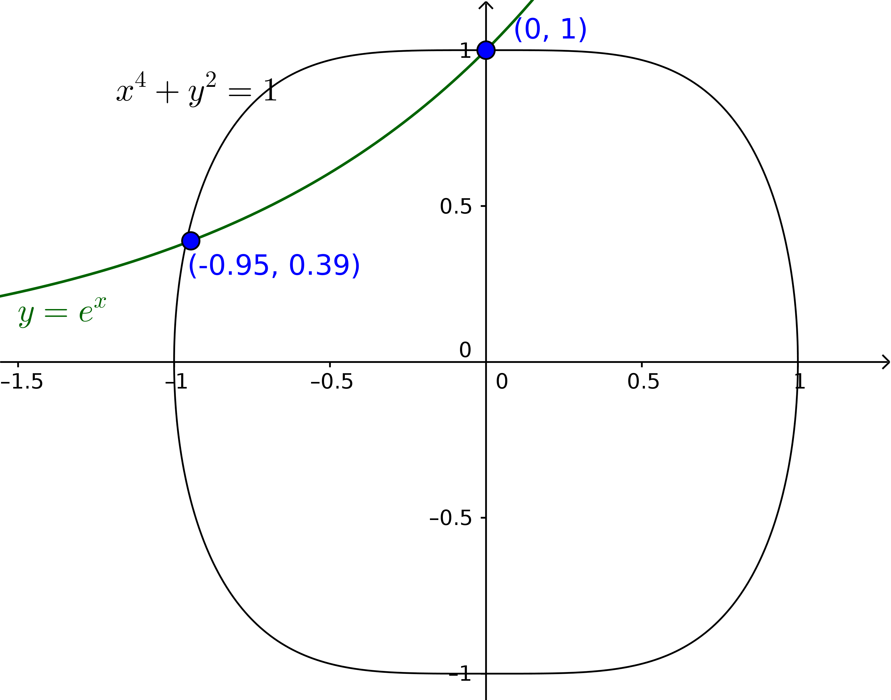

.. _upphafsgildisverkefni:

.. index::
    jöfnuhneppi

Jöfnuhneppi
===========

*Why do you go away? So that you can come back. So that you can see the place you came from with new eyes and extra colors. And the people there see you differently, too. Coming back to where you started is not the same as never leaving.*
-- Terry Pratchett

Línuleg jöfnuhneppi
-------------------

Verkefnið
~~~~~~~~~

Verkefnið í þessum kafla er eftirfarandi. 
Gefið :math:`n\times n` fylki :math:`A` og :math:`n`-vigur
:math:`\mbox{${\bf b}$}` þá leitum við að vigri :math:`\mbox{${\bf x}$}`
þannig að

.. math:: A\mbox{${\bf x}$}= \mbox{${\bf b}$}.

Lausnir
~~~~~~~

Við höfum almennt tvær leiðir til þess að leysa línuleg jöfnuhneppi:

-  `Gauss-eyðing <https://en.wikipedia.org/wiki/Gaussian_elimination>`_ og innsetning.

-  Reikna andhverfu :math:`A`, :math:`A^{-1}`, en þá er

   .. math:: \mbox{${\bf x}$}= A^{-1}\mbox{${\bf b}$}.

.. index::
    jöfnuhneppi; fjöldi aðgerða

Fjöldi aðgerða
~~~~~~~~~~~~~~

-  Gauss-eyðing fyrir :math:`n\times n` fylki krefst um það bil
   :math:`\frac 23n^3` reikniaðgerða.
   Innsetningin krefst svo :math:`n^2` aðgerða til viðbótar. Samanlagður
   fjöldi aðgerða er því

   .. math:: \frac 23n^3+\frac 32n^2 -\frac 76n.

-  Það að reikna :math:`A^{-1}` krefst hins vegar :math:`2n^3-2n^2+n`
   aðgerða og margföldunin :math:`A^{-1}b`, krefst :math:`2n^2-n`
   aðgerða til viðbótar. Samanlagður fjöldi aðgerða er því

   .. math:: 2n^3.

Hér er greinilega gáfulegra að nota Gauss-eyðingu. Auk þess er ekki skynsamlegt 
að ætla að reikna andhverfuna ef ákveða fylkisins er 0 eða nálægt 0. 
Almennt þá forðumst við eins og mögulegt er að reikna :math:`A^{-1}`. 

.. todo::
	sýna hvernig fjöldinn er fenginn, sjá Bradie bls. 155

Vandamál með stöðugleika
~~~~~~~~~~~~~~~~~~~~~~~~

Skoðum jöfnuhneppið

.. math::

   \left[\begin{array}{ll}
   \varepsilon& 1\\
   1 & 1
   \end{array}\right] \left[\begin{array}{l}
   x_1\\
   x_2
   \end{array}\right] 
   =\left[\begin{array}{l}
   1\\
   2
   \end{array}\right]

Nákvæm lausn er :math:`x_1=1+\frac{\varepsilon}{1-\varepsilon}, 
x_2=1-\frac{\varepsilon}{1-\varepsilon}`.

Ef hins vegar :math:`\varepsilon` er minna en nákvæmnin í tölvunni sem
erum að vinna á, þá gefur Gauss-eyðing í tölvu, þar sem eytt er með
1. línu, svarið :math:`x_1 = 0, x_2 = 1`.

Ef línunum væri víxlað, þá gæfi tölvan hins vegar :math:`x_1=1, x_2=1`
sem er miklu nær réttu svari. 

.. warning::
    Það er alveg ljóst að megum ekki framkvæma Gauss-eyðingu blindandi því
    þá geta magnast upp styttingarskekkjur sem skemma lausnina okkar.

.. todo::
    Lagfæra og bæta inn dæmi, 257 C&K

.. index::
    jöfnuhneppi; vending

Vending (e. pivoting)
---------------------

Inngangur
~~~~~~~~~

Það sem olli vandræðum í dæminu hér á undan var það að forystustuðull
fyrstu línunnar var hlutfallslega miklu minni en forystustuðull annarrar
línu.

Lausnin felst í því að víxla á línum þannig að við þurfum ekki að notast
við litla forystustuðla.

.. index::
    jöfnuhneppi; hlutvending

Hlutvending (e. partial pivoting)
~~~~~~~~~~~~~~~~~~~~~~~~~~~~~~~~~

Í grófum dráttum: Í umferð :math:`i` í Gauss-eyðingunni þá athugum við
hvort tölugildi forystustuðla línanna fyrir neðan línu :math:`i` eru
stærri en forystustuðull línu :math:`i`, ef svo er þá víxlum við á
þeirri línu og línu :math:`i`.

Það er, í :math:`i`-tu ítrun Gauss-eyðingar þá látum við
:math:`M_i = \max_{i\leq j \leq n} |a_{ji}|`. Ef :math:`|a_{ii}| < M_i`
þá víxlum við á línu :math:`i` og fyrstu línunni fyrir neðan sem hefur
forystustuðul með tölugildi jafnt og :math:`M_i`. Það er, ef
:math:`j_0 = \min\{ j ; i \leq j\leq n \text{ og } a_{ji} = M_i \}` þá
víxlum við á línu :math:`i` og :math:`j_0`.

Vankantar
~~~~~~~~~

Hlutvending virkar oft vel en getur búið til skekkju þar sem hún tekur
bara tillit til forystustuðlanna í hverri línu.

.. begin-toggle::
    :label: Dæmi þar sem hlutvending virkar illa

Ef jöfnuhneppið 

.. math::
    \begin{aligned}
    0.7 x_1 + 1725 x_2 &= 1739\\
    0.4352 x_1 - 5.433 x_2 = 3.271
    \end{aligned}
    
er leyst með fjögra stafa nákvæmni og hlutvendingu þá fæst 
:math:`x_2=1.001` og :math:`x_1=17.14` en rétt
svar er :math:`x_2=1` og :math:`x_1=20`. Það er því ljóst að hlutvending 
tekst ekki alltaf til að halda skekkju í skefjum.

.. end-toggle::

.. index::
    jöfnuhneppi; sköluð hlutvending

Sköluð hlutvending (e. scaled partial pivoting)
~~~~~~~~~~~~~~~~~~~~~~~~~~~~~~~~~~~~~~~~~~~~~~~

Ein leið til að koma í veg fyrir þessi vandræði er sköluð hlutvending.

Skilgreinum vigurinn :math:`\mbox{${\bf s}$}` sem heldur utan um
,,stærð'' línanna í :math:`A`,

.. math:: s_i = \max_{1\leq j \leq n} |a_{ij}|.

Látum dálkvigurinn :math:`\mbox{${\bf r}$}` halda utan um það hvernig
við umröðum línunum í :math:`A`. Byrjum með

.. math:: \mbox{${\bf r}$}= [1\ 2\ 3\ 4\ \ldots\ n]^T.

Athugasemd
~~~~~~~~~~

Við munum uppfæra :math:`\mbox{${\bf r}$}` eftir þörfum en breytum ekki
:math:`\mbox{${\bf s}$}` (of dýrt ef :math:`n` er stórt).

Í ítrun :math:`i` þá látum við

.. math:: M_i = \max_{i \leq j \leq n} \frac{|a_{{r_j}i}|}{s_{r_j}},

og látum :math:`j_0` vera minnsta :math:`j` þannig að hámarkinu er náð,

.. math:: \frac{ |a_{r_{j_0}i}|}{s_{r_{j_0}}} = M_i.

Ef :math:`i < j_0` þá skiptum við á línum :math:`i` og :math:`j_0`, þ.e.

.. math::

   \mbox{${\bf r}$}= [\ldots\ i\ \ldots\ j_0\ \ldots]^T \text{ breytist í }
   \mbox{${\bf r}$}= [\ldots\ j_0\ \ldots\ i\ \ldots]^T.

Þannig að í ítrun :math:`i` þá segir :math:`i`-ta stakið í 
:math:`\bf r` okkur hvaða línu við eigum að eyða með.

.. warning::
    Athugið að hér umröðum við ekki línunum í fylkinu því það er miklu ódýrara
    að nota vigurinn :math:`\bf r` til þess að halda utanum í hvaða röð á
    að framkvæma Gauss-eyðinguna.

.. index::
    fylkjastaðall

Fylkjastaðall
-------------

Að mæla fjarlægð milli hluta
~~~~~~~~~~~~~~~~~~~~~~~~~~~~

Á rauntalnalínunni þá mælum við fjarlægð með tölugildinu, þannig að
fjarlægðin á milli :math:`x` og :math:`y` er gefin með
:math:`d(x,y)=|x-y|`.

Í :math:`\mathbb R^n` þá finnst okkur evklíðski staðallinn
náttúrulegur, enda svarar hann til þess að mæla fjarlægð milli punkta
með reglustiku;

.. math:: d(\mbox{${\bf x}$},\mbox{${\bf y}$}) = \sqrt{ (x_1-y_1)^2 + \ldots + (x_n-y_n)^2 }.

Þetta er hins vegar ekki eina leiðin til þess mæla fjarlægð í
:math:`{\mathbb  R}^n` og, eins og við sjáum fljótlega, ekki endilega
réttari en aðrar aðferðir.

Almennt viljum við geta mælt ,,fjarlægð'' á milli allra þeirra hluta
sem við erum skoða, hvort sem það eru margliður, föll eða fylki.
Tilgangurinn er að geta metið hversu langt nálgunin okkar er frá réttu
gildi og hversu stór skekkjan er í samanburði við stærð hlutarins sem
við erum að vinna með.

.. index::
    vigurstaðall

.. _vigurstadall:

Vigurstaðall
~~~~~~~~~~~~

Fall :math:`\| \cdot\|:{\mathbb  R}^n \to {\mathbb  R}` kallast
*vigurstaðall* (e. vector norm) ef fyrir öll
:math:`\mbox{${\bf x}$},\mbox{${\bf y}$}\in {\mathbb  R}^n` og
:math:`\alpha \in {\mathbb  R}` gildir eftirfarandi:

#. :math:`\|\mbox{${\bf x}$}\| \geq 0`

#. :math:`\|\mbox{${\bf x}$}\| = 0` ef og aðeins ef
   :math:`\mbox{${\bf x}$}= 0`

#. :math:`\|\alpha\mbox{${\bf x}$}\| = |\alpha|\|\mbox{${\bf x}$}\|`

#. :math:`\|\mbox{${\bf x}$}+\mbox{${\bf y}$}\| \leq \|\mbox{${\bf x}$}\| + \|\mbox{${\bf y}$}\|`

.. note::
    Tölugildisfallið á :math:`{\mathbb  R}` er greinilega staðall.

Dæmi um staðla
~~~~~~~~~~~~~~

* :math:`\ell_2` staðallinn: Einnig kallaður evklíðska fjarlægðin, er gefinn með

    .. math:: 
        \|\mbox{${\bf x}$}\|_2 = \left( \sum_{j=1}^n x_j^2 \right)^{\frac 12} = 
        \sqrt{\mbox   {${\bf x}$}\cdot \mbox{${\bf x}$}}.

* :math:`\ell_\infty` staðallinn: 

    .. math:: \|\mbox{${\bf x}$}\|_\infty = \max_{1\leq j \leq n} |x_j|.

* :math:`\ell_p` staðlar: Almennt ef :math:`1\leq p < \infty` þá skilgreinum við

    .. math:: \|\mbox{${\bf x}$}\|_p = \left( \sum_{j=1}^n |x_j|^p \right)^{\frac 1p}.

.. index::
    fylkjastaðall

Fylkjastaðall
~~~~~~~~~~~~~

*Fylkjastaðall* (e. matrix norm) er fall
:math:`\|\cdot\|:{\mathbb  R}^{n\times n} \to {\mathbb  R}`, þannig að
fyrir öll :math:`A,B \in {\mathbb  R}^{n\times n}` og
:math:`\alpha \in {\mathbb  R}` gildir

#. :math:`\|A\| \geq 0`

#. :math:`\|A\| = 0` ef og aðeins ef :math:`A=0`

#. :math:`\| \alpha A\| = |\alpha|\|A\|`

#. :math:`\|A+B\| \leq \|A\| + \|B\|`

#. :math:`\|AB\| \leq \|A\|\|B\|`

.. note::
    Ef þessi skilgreining er borin saman við skilgreininguna á :ref:`vigurstaðli <vigurstadall>`
    fyrir vigurrúm þá sjáum við að eini raunverulegi munurinn er skilyrði 5.

.. index::
    fylkjastaðall; út frá vigurstaðli

Fylkjastaðall skilgreindur út frá vigurstaðli
~~~~~~~~~~~~~~~~~~~~~~~~~~~~~~~~~~~~~~~~~~~~~

Látum :math:`\|\cdot\|` vera vigurstaðal. Fallið
:math:`\|\cdot\|:{\mathbb  R}^{n\times n} \to {\mathbb  R}` sem
skilgreint er með

.. math:: 
    \|A\| = \max_{\|\mbox{${\bf x}$}\| \neq 0} 
    \frac{\|A\mbox{${\bf x}$}\|}{\|\mbox{${\bf x}$}\|},

kallast *náttúrulegi fylkjastaðallinn* sem :math:`\|\cdot\|` gefur af
sér.

.. note:: 
    Það þarf að sýna, og er ekki mjög erfitt, að þessi fylkjastaðall
    uppfyllir öll skilyrðin í skilgreiningu hér á undan og er því sannarlega
    fylkjastaðall.

.. note::
    Ef :math:`\|\cdot\|` er náttúrulegur fylkjastaðall þá gildir að fyrir
    öll fylki :math:`A` og alla vigra :math:`\mbox{${\bf x}$}` að

    .. math::

       \underbrace{\|A\mbox{${\bf x}$}\|}_{\text{vigurstaðll}} 
       \leq \underbrace{\|A\|}_{\text{fylkjastaðall}} \ \cdot \
       \underbrace{\|\mbox{${\bf x}$}\|}_{\text{vigurstaðall}}

Dæmi um fylkjastaðal
~~~~~~~~~~~~~~~~~~~~

Fyrir sérhvern :math:`\ell_p` staðal fáum við fylkjastaðal
:math:`\|\cdot\|_p`.

:math:`\|\cdot\|_\infty`: 
Einfaldastur er staðallinn sem tilheyrir :math:`\ell_\infty`, en hann uppfyllir

.. math:: \|A\|_\infty = \max_{1\leq i \leq n} \sum_{j=1}^n |a_{ij}|.

.. index::
    eigingildi

Eigingildi
~~~~~~~~~~

Látum :math:`A` vera fylki. Ef tala :math:`\lambda` (hugsanlega
tvinntala) og vigur :math:`\mbox{${\bf x}$}` uppfylla

.. math:: A\mbox{${\bf x}$}= \lambda \mbox{${\bf x}$},

þá kallast :math:`\lambda` *eigingildi* :math:`A`, og
:math:`\mbox{${\bf x}$}` *eiginvigur* :math:`A`.

Athugið að eigingildi :math:`A` eru nákvæmlega rætur kennimargliðu
:math:`A`, :math:`t \mapsto \det(A-It)`.

.. index::
    rófgeisli

Róf og rófgeisli
~~~~~~~~~~~~~~~~

Mengi allra eigingilda :math:`A` er kallað *róf* :math:`A` (e. spectrum)
og er táknað með :math:`\sigma(A)`.

*Rófgeisli* (e. spectral radius) fylkisins :math:`A` er talan

.. math:: \rho(A) = \max_{\lambda \in \sigma(A)} |\lambda|.

.. _`rofgeisli`:

Setning um rófgeisla
~~~~~~~~~~~~~~~~~~~~

Látum :math:`A` vera fylki, þá gildir eftirfarandi

-  :math:`\|A\|_2 = \sqrt{\rho(A^T A)}`

-  :math:`\rho(A) \leq \|A\|` fyrir sérhvern náttúrulegan fylkjastaðal
   :math:`\|\cdot\|`

-  Fyrir sérhvert :math:`\varepsilon>0` þá er til náttúrulegur
   fylkjastaðall :math:`\|\cdot\|` þannig að
   :math:`\|A\| \leq \rho(A) + \varepsilon`.

.. index::
    skekkjumat
    

Skekkjumat og ástandstala
-------------------------

Hvernig á að mæla skekkju
~~~~~~~~~~~~~~~~~~~~~~~~~

Gerum ráð fyrir að :math:`A` sé andhverfanlegt fylki,
:math:`\mbox{${\bf b}$}` vigur og að við séum að leita að lausn
:math:`\mbox{${\bf x}$}` á

.. math:: A{\bf x}= {\bf b}.

Ef við höfum nálgun :math:`\tilde {\bf x}` þannig að *leifin*
(e. residual) :math:`{\bf r} = A\tilde {\bf x}- {\bf b}` er
lítil, hvað getum við þá sagt um *skekkjuna* (e. error)
:math:`{\bf e}= {\bf x}-\tilde {\bf x}`? Er hún endilega lítil?

Sjáum að svo er ekki, skekkjan getur verið hlutfallslega miklu meiri
heldur en leifin.

.. begin-toggle::
    :label: Dæmi

Skoðum jöfnuhneppið 

.. math::

   \left[\begin{matrix}
        1& 2 \\
        0.99 & 1.99
     \end{matrix}\right] 
     \mathbf{x} = 
   \left[\begin{matrix}
        1 \\
        1
     \end{matrix}\right]

Sjáum að rétt lausn er :math:`[-1 \ 1]^T`. Ef við skilgreinum
:math:`\tilde x = [1 \ 0]^T` þá er 

.. math::

    \mathbf{e} = [-2 \ 1]^T \qquad \|\mathbf{e}\|_\infty = 2.
    
Hins vegar þá er leifin 

.. math::

   \mathbf{r} = A\mathbf{\tilde x} -\mathbf{b} = \left[\begin{matrix}
        1& 2 \\
        0.99 & 1.99
     \end{matrix}\right] 
   \left[\begin{matrix}
        1\\
        0
     \end{matrix}\right] -
   \left[\begin{matrix}
        1 \\
        1
     \end{matrix}\right]
   \left[\begin{matrix}
        0 \\
        -0.01
     \end{matrix}\right]

þannig að :math:`\|\mathbf{e}\|_\infty = 0.01`. Hér er skekkjan 200 sinnum
stærri en leifin sem sýnir að lítil leif þarf ekki endilega að hafa í för með sér
litla skekkju. 

.. end-toggle::

.. index::
    jöfnuhneppi; skekkjumat
    jöfnuhneppi; ástandstala

Skekkjumat
~~~~~~~~~~

Við höfum fjórar jöfnur

.. math::

   \mbox{${\bf b}$}=A\mbox{${\bf x}$}, \quad \mbox{${\bf x}$}=A^{-1}\mbox{${\bf b}$}, \quad 
   \mbox{${\bf r}$}=A(\mathbf{\tilde x}-\mbox{${\bf x}$})=A\mbox{${\bf e}$}, \quad \text{ og } \quad
   \mbox{${\bf e}$}=A^{-1}\mbox{${\bf r}$}

\ og þær gefa okkur fjórar ójöfnur fyrir tilsvarandi staðal:

.. math::

   \|\mbox{${\bf b}$}\|\leq \|A\|\|\mbox{${\bf x}$}\|, \quad  \|\mbox{${\bf x}$}\|\leq \|A^{-1}\|\|\mbox{${\bf b}$}\|, 
   \quad  
   \|\mbox{${\bf r}$}\|\leq \|A\|\|\mbox{${\bf e}$}\|, \quad  \|\mbox{${\bf e}$}\|\leq \|A^{-1}\|\|\mbox{${\bf r}$}\|

Við getum tengt tvær síðustu ójöfnurnar saman í mat á skekkjunni

.. math::

   \dfrac 1{\|A\|}\cdot  \|\mbox{${\bf r}$}\|
   \leq  \|\mbox{${\bf e}$}\| \leq 
   \|A^{-1}\| \|\mbox{${\bf r}$}\|

\ og með því að nota fyrstu tvær ójöfnurnar fæst mat á hlutfallslegri
skekkju

.. math::

   \dfrac 1{\|A\|\|A^{-1}\|}\dfrac{ \|\mbox{${\bf r}$}\|}{\|\mbox{${\bf b}$}\|} 
   \leq \dfrac{\|\mbox{${\bf e}$}\|}{\|\mbox{${\bf x}$}\|} \leq 
   \|A\|\|A^{-1}\|\dfrac{\|\mbox{${\bf r}$}\|}{\|\mbox{${\bf b}$}\|}

Nú skilgreinum við *ástandstölu fylkisins* :math:`A` með

.. math:: \kappa(A)=\|A\|\|A^{-1}\|.

Ástandstala fylkis og mat á hlutfallslegri skekkju
~~~~~~~~~~~~~~~~~~~~~~~~~~~~~~~~~~~~~~~~~~~~~~~~~~

Með ástandstölunni verður mat okkar á hlutfallslegu skekkjunum að

.. math::

   \dfrac 1{\kappa(A)}\cdot \dfrac{ \|\mbox{${\bf r}$}\|}{\|\mbox{${\bf b}$}\|} 
   \leq \dfrac{\|\mbox{${\bf e}$}\|}{\|\mbox{${\bf x}$}\|} \leq 
   \kappa(A)\cdot \dfrac{\|\mbox{${\bf r}$}\|}{\|\mbox{${\bf b}$}\|}

Þetta segir okkur að ef ástandstala fylkisins er stór er mögulegt að 
skekkjan verði miklu stærri en leifin, samanber dæmið hér á undan
þar sem ástandstalan er 1197.

.. warning::
    Athugið að skilgreiningin

    .. math:: \kappa(A)=\|A\|\|A^{-1}\|.

    er *mjög* háð því hvaða staðal við veljum. Þó höfum við að fyrir
    alla fylkjastaðla gildir

    .. math:: 1=\|I\|=\|AA^{-1}\|\leq \|A\|\|A^{-1}\|=\kappa(A)

.. index::
    jöfnuhneppi; gagnaskekkja

Áhrif gagnaskekkju
~~~~~~~~~~~~~~~~~~

Hugsum okkur nú að við viljum leysa jöfnuhneppi
:math:`A\mbox{${\bf x}$}=\mbox{${\bf b}$}`, en vegna skekkju í stuðlum
jöfnuhneppisins leysum við annað hneppi
:math:`\tilde A\mathbf {\tilde x}=\mathbf{\tilde b}`.

Við skilgreinum *gagnaskekkjur* :math:`\delta A=\tilde A-A` og
:math:`\delta\mbox{${\bf b}$}=\mathbf{\tilde b}-\mbox{${\bf b}$}` og
ætlum að nota þær til þess að meta skekkjuna
:math:`\mbox{${\bf e}$}=\delta\mbox{${\bf x}$}=\mathbf{\tilde x}-\mbox{${\bf x}$}`.

Við verðum að gera ráð fyrir að :math:`\|\delta A\|\leq 1/\|A^{-1}\|`
sem tryggir að fylkið :math:`\tilde A` sé andhverfanlegt.

Nú stillum við upp jöfnuhneppinu
:math:`\tilde A\mathbf{\tilde x}=\mathbf{\tilde  b}` á forminu

.. math:: (A+\delta A)(\mbox{${\bf x}$}+\delta \mbox{${\bf x}$})=(\mbox{${\bf b}$}+\delta\mbox{${\bf b}$})

sem jafngildir

.. math:: \delta\mbox{${\bf x}$}=A^{-1}\big(\delta\mbox{${\bf b}$}-(\delta A)\mbox{${\bf x}$}-(\delta A)(\delta x)\big)

Af þessari jöfnu leiðir ójafnan

.. math::

   \|\delta\mbox{${\bf x}$}\|\leq 
   \|A^{-1}\|\big(\|\delta\mbox{${\bf b}$}\|+\|\delta A\|\|\mbox{${\bf x}$}\|+\|\delta A\|\|\delta \mbox{${\bf x}$}\|\big)

Einangrum nú :math:`\|\delta \mbox{${\bf x}$}\|`,

.. math::

   \|\delta\mbox{${\bf x}$}\|\leq 
   \dfrac{\|A^{-1}\|}{1-\|A^{-1}\|\|\delta A\|}\cdot 
   \big(\|\delta\mbox{${\bf b}$}\|+\|\delta A\|\|\mbox{${\bf x}$}\|\big)

\ deilum með :math:`\|\mbox{${\bf x}$}\|` báðum megin, margföldum síðan
með :math:`\|A\|` í teljara og nefnara í hægri hliðinni,

.. math::

   \dfrac{\|\delta\mbox{${\bf x}$}\|} {\|\mbox{${\bf x}$}\|}\leq 
   \dfrac{\|A\|\|A^{-1}\|}{1-\|A^{-1}\|\|\delta A\|}\cdot 
   \bigg(\dfrac{\|\delta\mbox{${\bf b}$}\|}{\|A\|\|\mbox{${\bf x}$}\|}+
   \dfrac{\|\delta A\|}{\|A\|}\bigg)

Samkvæmt skilgreiningu er :math:`\kappa(A)=\|A\|\|A^{-1}\|` og við höfum
auk þess ójöfnuna
:math:`\|\mbox{${\bf b}$}\|\leq \|A\|\|\mbox{${\bf x}$}\|`, en það gefur
matið á hlutfallslegu skekkjunni sem við sækjumst eftir

.. math::

   \dfrac{\|\delta\mbox{${\bf x}$}\|} {\|\mbox{${\bf x}$}\|}\leq 
   \dfrac{\kappa(A)}{1-\kappa(A)\cdot(\|\delta A\|/\|A\|)}\cdot 
   \bigg(\dfrac{\|\delta\mbox{${\bf b}$}\|}{\|\mbox{${\bf b}$}\|}+
   \dfrac{\|\delta A\|}{\|A\|}\bigg).

.. index::
    lu-þáttun
    þríhyrningsfylki
    bandfylki

LU-þáttun
---------

Nokkrar skilgreiningar
~~~~~~~~~~~~~~~~~~~~~~

#. Fylkið :math:`A` nefnist *neðra þríhyrningsfylki* ef öll stök fyrir
   ofan hornalínuna í :math:`A` eru :math:`0`, þ.e. \ :math:`a_{ij}=0`
   ef :math:`i<j`.

#. Fylkið :math:`A` nefnist *efra þríhyrningsfylki* ef öll stökin neðan
   við hornalínuna eru :math:`0`, þ.e. \ :math:`a_{ij}=0` ef
   :math:`i>j`.

#. Fylkið :math:`A` nefnist *bandfylki* (e. striped matrix) ef til er
   :math:`\beta \leq n-2` þannig að :math:`a_{ij}=0` ef
   :math:`|i-j|>\beta`. Minnsta talan :math:`\beta` sem uppfyllir þetta
   skilyrði kallst á *bandvídd* fylkisins :math:`A`.

#. Ef :math:`A` er bandfylki með bandvíddina :math:`1`, þá nefnist
   :math:`A` *þríhornalínufylki*.

#. Fylkið :math:`A` er sagt vera *samhverft* ef :math:`a_{ij}=a_{ji}`
   fyrir öll :math:`i` og :math:`j`.

#. Fylkið :math:`A` er sagt vera *jákvætt ákvarðað* ef
   :math:`\mbox{${\bf x}$}^TA\mbox{${\bf x}$}>0` gildir fyrir alla vigra
   :math:`\mbox{${\bf x}$}\neq 0` í :math:`{\mathbb  R}^n`.

Úrlausn á jöfnuhneppi með neðra þríhyrningsfylki
~~~~~~~~~~~~~~~~~~~~~~~~~~~~~~~~~~~~~~~~~~~~~~~~

Ef :math:`A` er neðra þríhyrningsfylki, þá er úrlausn jöfnuhneppisins
:math:`A\mbox{${\bf x}$}= \mbox{${\bf b}$}` auðveld, því hneppið er þá
af gerðinni

.. math::

   \begin{aligned}
       &a_{11}x_1&&=b_1,\\
       &a_{21}x_1+a_{22}x_2&&=b_2,\\
       &a_{31}x_1+a_{32}x_2+a_{33}x_3&&=b_3,\\
       &\vdots \qquad \qquad   \vdots \qquad 
       \qquad \vdots& \qquad& \vdots\\
       &a_{n1}x_1+a_{n2}x_2+a_{n3}x_3\cdots+a_{nn}x_n&&=b_n,\end{aligned}

Við getum rakið okkur niður línurnar og leyst út stærðirnar
:math:`x_1,\dots,x_n` hverja á eftir annarri

.. math::

   \begin{aligned}
       x_1& = b_1/a_{11},\\
       x_2& = (b_2-a_{21}x_1)/a_{22},\\
       x_3& = (b_3-a_{31}x_1-a_{32}x_2)/a_{33}\\
       &\vdots \qquad \qquad \vdots \qquad \qquad \vdots\\
       x_n& = (b_n-a_{n1}x_1-a_{n2}x_2-\cdots
           -a_{n,n-1}x_{n-1})/a_{nn}.\end{aligned}

Fjöldi aðgerða
~~~~~~~~~~~~~~

Nú skulum við telja saman fjölda reikningsaðgerða sem þarf til þess að
framkvæma þessa útreikninga.

Við lítum á samlagningu og frádrátt sem sömu aðgerðina. Við þurfum enga
samlagningu til að reikna út :math:`x_1`, eina til þess að reikna út
:math:`x_2`, tvær til þess að reikna :math:`x_3` og þannig áfram upp í
:math:`n-1` samlagningu til þess að reikna út :math:`x_n`.

Heildarfjöldinn er því

.. math::

   1 + 2 + \cdots + n-1 = \tfrac 12 n(n-1) = 
       \tfrac 12n^2-\tfrac 12 n.

Fjöldi margfaldana er sá sami.

Við þurfum hins vegar aðeins eina deilingu til þess að reikna út hverja
af stærðunum :math:`x_1,\dots,x_n`.

Heildarfjöldi reikniaðgerða við úrlausn á línulegu jöfnuhneppi
:math:`Ax=b`, þar sem :math:`A` er neðra þríhyrningsfylki er því

.. math::

   \tfrac 12 n^2 - \tfrac 12 n
   + \tfrac 12 n^2 - \tfrac 12 n +n = n^2.

Úrlausn á jöfnuhneppi með efra þríhyrningsfylki
~~~~~~~~~~~~~~~~~~~~~~~~~~~~~~~~~~~~~~~~~~~~~~~

Hugsum okkur nú að :math:`A` sé efra þríhyrningsfylki. Þá verður
jöfnuhneppið

.. math::

   \begin{aligned}
       a_{11}x_1+a_{12}x_2+a_{13}x_3+\cdots+a_{1n}x_n& = b_1,\\
       a_{22}x_2+a_{23}x_3+\cdots+a_{2n}x_n& = b_2,\\
       a_{33}x_3+\cdots+a_{3n}x_n& = b_3,\\
       \vdots\quad& \quad \vdots\\
       a_{nn}x_n& = b_n,\end{aligned}

Við getum rakið okkur upp línurnar og fundið
:math:`x_n,x_{n-1},\dots,x_1` hverja af annarri

.. math::

   \begin{aligned}
       x_n& = b_n/a_{nn},\\
       x_{n-1}& = (b_{n-1}-a_{n-1,n}x_n)/a_{n-1,n-1},\\
       \vdots&\qquad \vdots\qquad \qquad \vdots\\
       x_1& = (b_1-a_{12}x_2-a_{13}x_3-\cdots
       -a_{1,n}x_{n})/a_{11}.\end{aligned}

Aðgerðafjöldinn er sá sami og í úrlausn neðra þríhyrningshneppisins.

Línuaðgerðir
~~~~~~~~~~~~

Gerum ráð fyrir að við séum að ryðja :math:`4\times 4` fylki með
Gauss-eyðingu og að við séum búin með fyrsta dálkinn. Næsta skref er að
nota línu 2 til þess að losna við stökin í sætum (3,2) og (4,2).

.. math::

   A=
   \left[\begin{array}{llll}
   1 & \cdot & \cdot & \cdot\\
   0 & a & \cdot & \cdot\\
   0 & b & \cdot & \cdot\\
   0 & c & \cdot & \cdot
   \end{array}\right]

Lína 3, :math:`l_3`, verður þá að :math:`l_3 - \frac ba l_2`, og
lína 4, :math:`l_4`, verður að :math:`l_4 - \frac ca l_2`.

Þessar tvær aðgerðir má einnig framkvæma með því að margfalda fylkið að
ofan frá vinstri með fylkinu

.. math::

   M_2 = \left[
   \begin{array}{llll}
   1 & 0 & 0 & 0\\
   0 & 1 & 0 & 0\\
   0 & -\frac ba & 1 & 0\\
   0 & -\frac ca & 0 & 1
   \end{array}
   \right]

Ný sýn á Gauss-eyðingu
~~~~~~~~~~~~~~~~~~~~~~

Það að ryðja fylkið eins og hér á undan, felst því í því að margfalda
:math:`A` frá vinstri með þremur fylkjum :math:`M_1, M_2` og :math:`M_3`
sem eru þannig að :math:`M_i` er einingafylkið nema í sætum
:math:`(i+1,i),\ldots,(n,i)` eru tölur sem eru hugsanlega frábrugðnar 0.
Fylkið :math:`M_i` sér þá um að eyða í dálk :math:`i`.

Athugum að Gauss-eyðing skilar fylki :math:`U` á efra þríhyrningsformi.

Við getum því skrifað

.. math:: M_3 M_2 M_1 A = U

Almennt, fyrir :math:`n \times n` fylki þá getum við skrifað

.. math:: M_{n-1}\cdots M_2 M_1 A = U,

þar sem :math:`M_i` eru fylki eins og lýst er hér að ofan.

Nánar um :math:`M_i`
~~~~~~~~~~~~~~~~~~~~

Við sjáum að ef

.. math::

   M_i = \left[
   \begin{array}{ccccccc}
   1 &   &   &   &   &   &  \\
     & . &   &   &   &   &  \\
     &   & 1 &   &   &   &  \\
     &   & m_{i+1,i} & 1 &   &   &  \\
     &   & . &   & . &   &  \\
     &   & . &   &   & . &  \\
     &   & m_{n,i} &   &   &   & 1
   \end{array}\right],

þá er

.. math::

   M_i^{-1} = \left[
   \begin{array}{ccccccc}
   1 &   &   &   &   &   &  \\
     & . &   &   &   &   &  \\
     &   & 1 &   &   &   &  \\
     &   & -m_{i+1,i} & 1 &   &   &  \\
     &   & . &   & . &   &  \\
     &   & . &   &   & . &  \\
     &   & -m_{n,i} &   &   &   & 1
   \end{array}\right].

Eins þá er auðvelt að sjá að

.. math::

   M_i^{-1} M_j^{-1} = \left[
   \begin{array}{cccccccc}
   1 &   &   &   &   &   &   &  \\
     & . &   &   &   &   &   &  \\
     &   & 1 &   &   &   &   &  \\
     &   & -m_{i+1,i} & . &   &   &   &  \\
     &   & . &   & 1 &   &   &  \\
     &   & . &   & -m_{j+1,j} & . &   &  \\
     &   & . &   & . &   & . &  \\
     &   & -m_{n,i} &   & -m_{n,j} &   &   & 1
   \end{array}
   \right]

\ Það er

.. math::

   M_1^{-1} M_2^{-1} \cdots M_{n-1}^{-1} = \left[
   \begin{array}{cccccc}
   1 &   &   &   &   &     \\
   -m_{2,1} & 1 &   &   &     &  \\
   -m_{3,1} & -m_{3,2} & 1 &    &   &  \\
     & -m_{4,2} & -m_{4,3} & 1   &   &  \\
     & . &   &   & . &    \\
   -m_{n,1} & -m_{n,2} & -m_{n,3} & . & -m_{n,n-1}  & 1
      \end{array}
   \right]

.. index::
    LU-þáttun

LU-þáttun
~~~~~~~~~~

Þetta hefur í för með sér að ef við skilgreinum
:math:`L = M_1^{-1} M_2^{-1} \cdots M_{n-1}^{-1}` þá er

.. math:: A = LU

\ eða

.. math::

   A = \left[\begin{array}{cccccccc}
   1 &   &   &   &   &   &   &  \\
   -m_{2,1} & 1 &   &   &   &   &   &  \\
   -m_{3,1} & -m_{3,2} & 1 &   &   &   &   &  \\
     & -m_{4,2} & -m_{4,3} & 1 &   &   &   &  \\
     & . &   &   & . &   &   &  \\
     & . &   &   &   & . &   &  \\
     & . &   &   &   &   & . &  \\
   -m_{n,1} & -m_{n,2} & -m_{n,3} & . & . & . & -m_{n,n-1} & 1
      \end{array}\right] U

Þannig að með því að framkvæma Gauss-eyðingu á :math:`A` og halda
utanum aðgerðirnar (:math:`M_i`\ ’in) og niðurstöðuna :math:`U` þá fæst
:math:`LU`-þáttun á :math:`A`.

:math:`LU`-þáttun og sköluð hlutvending
~~~~~~~~~~~~~~~~~~~~~~~~~~~~~~~~~~~~~~~

Aðferðin hér að framan gerði ráð fyrir að stak :math:`a_{i,i}` yrði
aldrei 0 (þá getum við ekki notað þá línu til þess að eyða). Eins
hugsuðum við ekkert út í styttingarskekkjur sem við búum til.

Ef við framkvæmum Gauss-eyðinguna með skalaðri hlutvendingu þá ráðum við
bót á báðum þessum atriðum, því þá veljum við aldrei línu með
forystustuðul 0 og við minnkum skekkjuna eins og hefur komið fram áður.

.. warning::
    Þegar við notum skalaða hlutvendingu þá uppfylla fylkin :math:`L` og
    :math:`U` ekki endilega :math:`LU=A`. Þess í stað
    fæst

    .. math:: LU =PA

    þar sem fylkið :math:`P` umraðar línunum í :math:`A` í samræmi við
    umröðunarvigrinn :math:`\mbox{${\bf r}$}`. Það er, stökin í :math:`P`
    eru 0, nema :math:`p_{i,r_i} = 1`.

.. todo::
    Bæta við dæmi

.. index::
    jöfnuhneppi; lausn með LU-þáttun

Jöfnuhneppi leyst með LU-þáttun
~~~~~~~~~~~~~~~~~~~~~~~~~~~~~~~

Við skiptum nú úrlausnarferlinu á
:math:`A\mbox{${\bf x}$}=\mbox{${\bf b}$}` í þrjú skref

(i) :math:`LU` **-þáttun:** Reiknum út neðra þríhyrningsfylki :math:`L`
og efra þríhyrningsfylki :math:`U` með skalaðri hlutvendingu. Höldum
utanum :math:`\mbox{${\bf r}$}` (og þar með :math:`P`). Þá er

.. math:: LU=PA.

(ii) **Forinnsetning:** Leysum
:math:`L\mbox{${\bf y}$}=P\mbox{${\bf b}$}`.

(iii) **Endurinnsetning:** Leysum
:math:`U\mbox{${\bf x}$}=\mbox{${\bf y}$}`.

Lausnin sem við leitum að er þá :math:`\mbox{${\bf x}$}`, því

.. math:: P\mbox{${\bf b}$}= L\mbox{${\bf y}$}= UL\mbox{${\bf x}$}= PA\mbox{${\bf x}$},

sem er jafngilt því að :math:`\mbox{${\bf b}$}=A\mbox{${\bf x}$}`

Fjöldi reikniaðgerða fyrir :math:`LU`-þáttun
~~~~~~~~~~~~~~~~~~~~~~~~~~~~~~~~~~~~~~~~~~~~

Heildarfjöldi reikningsaðgerða til þess að framkvæma
:math:`LU`-þáttunina er

.. math:: \frac 23n^3-\frac 12n^2-\frac 76 n.

Liðir (ii) og (iii) krefjast svo :math:`n^2 + n^2 = 2n^2` aðgerða til
viðbótar. Samanlagður fjöldi aðgerða er því

.. math:: \frac 23n^3+\frac 32n^2-\frac 76 n.

Ef :math:`n` er stór tala, segjum :math:`n=1000`, þá er fyrsti liðurinn
lang stærstur og við getum slegið á aðgerðafjöldann með
:math:`\tfrac 23n^3`.

Þetta er töluvert betra heldur en að reikna :math:`A^{-1}` og svo
:math:`\mbox{${\bf x}$}=A^{-1}\mbox{${\bf b}$}`, en þá er heildafjöldi
aðgerða :math:`2n^3`.

Mörg jöfnuhneppi
~~~~~~~~~~~~~~~~

Ef við þurfum að leysa mörg jöfnuhneppi með sama stuðlafylkið þá koma
kostir :math:`LU`-þáttunar vel í ljós.

Gefið :math:`A` og :math:`\mbox{${\bf b}$}_1,\ldots,\mbox{${\bf b}$}_m`
þá leitum við að vigrum
:math:`\mbox{${\bf x}$}_1,\ldots,\mbox{${\bf x}$}_m` þannig að

.. math:: A\mbox{${\bf x}$}_i = \mbox{${\bf b}$}_i, \qquad \text{fyrir } i = 1,\ldots,m.

Við þurfum bara að framkvæma :math:`LU`-þáttunina einu sinni, en
innsetningarnar í lið (ii) og (iii) framkvæmum við :math:`m`-sinnum.
Heildar fjöldi aðgerða er þá

.. math:: \frac 23n^3+(2m-\frac 12)n^2- (m-\frac 16) n.

.. index::
    fastapunktsaðferð; fyrir línuleg jöfnuhneppi

Fastapunktsaðferðir fyrir línuleg jöfnuhneppi
---------------------------------------------

Ítrekunaraðferðir til þess að leysa línuleg jöfnuhneppi
~~~~~~~~~~~~~~~~~~~~~~~~~~~~~~~~~~~~~~~~~~~~~~~~~~~~~~~

Munum að samanlagður fjöldi reikniaðgerða sem þarf til þess að leysa
:math:`n\times n` línulegt jöfnuhneppi
:math:`A\mbox{${\bf x}$}=\mbox{${\bf b}$}` með Gauss-eyðingu, for- og
endurinnsetningu er :math:`\sim \tfrac 23 n^3`.

Ef jöfnuhneppið er jafngilt hneppinu

.. math:: \mbox{${\bf x}$}=T\mbox{${\bf x}$}+\mbox{${\bf c}$}

þá getum við sett upp fastapunktsferð til þess að leysa þetta hneppi með
því að giska á eitthvert nálgunargildi :math:`\mbox{${\bf x}$}^{(0)}`
fyrir lausnina og ítra síðan með formúlunni

.. math:: \mbox{${\bf x}$}^{(k+1)}=T\mbox{${\bf x}$}^{(k)}+\mbox{${\bf c}$}, \qquad k=0,1,2,\dots,

í þeirri von að runan :math:`(\mbox{${\bf x}$}^{(k)})` stefni á réttu
lausnina :math:`\mbox{${\bf x}$}` á upprunalega jöfnuhneppinu.

Það þarf :math:`n^2-n` aðgerðir til þess að reikna út margfeldið
:math:`T\mbox{${\bf v}$}` fyrir vigur
:math:`\mbox{${\bf v}$}\in {\mathbb  R}^n` og því getum við komist upp
með að taka :math:`\approx \tfrac 23 n` ítrekanir áður en
heildaraðgerðafjöldinn er kominn upp fyrir aðgerðafjöldann í
Gauss-eyðingu, ásamt for- og endurinnsetningu.

Fastapunktsítrekun til þess að leysa línuleg jöfnuhneppi
~~~~~~~~~~~~~~~~~~~~~~~~~~~~~~~~~~~~~~~~~~~~~~~~~~~~~~~~

Við ætlum nú að gera ráð fyrir að jafnan
:math:`A\mbox{${\bf x}$}=\mbox{${\bf b}$}` sé jafngild

.. math:: \mbox{${\bf x}$}=T\mbox{${\bf x}$}+\mbox{${\bf c}$}

giskum á eitthvert nálgunargildi :math:`\mbox{${\bf x}$}^{(0)}` fyrir
lausnina :math:`\mbox{${\bf x}$}` og skilgreinum síðan rununa

.. math:: \mbox{${\bf x}$}^{(k+1)}=T\mbox{${\bf x}$}^{(k)}+\mbox{${\bf c}$}, \qquad k=0,1,2,\dots,

Allt er nú undir því komið að :math:`n\times n` fylkið :math:`T` sé vel
valið.

Fastapunktsítrekun - skekkjumat
~~~~~~~~~~~~~~~~~~~~~~~~~~~~~~~

Við skilgreinum nú skekkjuna í :math:`k`-ta ítrekunarskrefinu
:math:`\mbox{${\bf e}$}^{(k)}=\mbox{${\bf x}$}-\mbox{${\bf x}$}^{(k)}`.
Þá gildir formúlan

.. math:: \mbox{${\bf e}$}^{(k)}=T\mbox{${\bf e}$}^{(k-1)}=T^2\mbox{${\bf e}$}^{(k-2)}=\cdots=T^{k}\mbox{${\bf e}$}^{(0)}

sem við höfum áður séð í athugun okkar á fastapunktsaðferðinni.

Nú beitum við

.. math:: \|\mbox{${\bf e}$}^{(k)}\| \leq \|T^{k}\|\|\mbox{${\bf e}$}^{(0)}\|\leq \|T\|^{k}\|\mbox{${\bf e}$}^{(0)}\|

Við höfum
:math:`\mbox{${\bf x}$}^{(1)}-\mbox{${\bf x}$}^{(0)}=T\mbox{${\bf x}$}^{(0)}+\mbox{${\bf c}$}-\mbox{${\bf x}$}^{(0)}`
og :math:`\mbox{${\bf c}$}=\mbox{${\bf x}$}-T\mbox{${\bf x}$}` og þar
með

.. math::

   \mbox{${\bf x}$}^{(1)}-\mbox{${\bf x}$}^{(0)}=T(\mbox{${\bf x}$}^{(0)}-\mbox{${\bf x}$})-(\mbox{${\bf x}$}^{(0)}-\mbox{${\bf x}$})=
   -(\mbox{${\bf e}$}^{(0)}-T\mbox{${\bf e}$}^{(0)})=-(I-T)\mbox{${\bf e}$}^{(0)}.

Þetta gefur jöfnuna

.. math:: \mbox{${\bf e}$}^{(0)}=-(I-T)^{-1} \big(\mbox{${\bf x}$}^{(1)}-\mbox{${\bf x}$}^{(0)}\big).

Með smá útreikningi má sýna fram á að ef :math:`\|T\|<1`, þá er

.. math:: \|(I-T)^{-1}\|\leq \dfrac 1{1-\|T\|}.

Við vorum komin með ójöfnurnar

.. math:: \|\mbox{${\bf e}$}^{(k)}\| \leq \|T\|^{k}\|\mbox{${\bf e}$}^{(0)}\|

og niðurstaðan verður því

.. math::

   \|\mbox{${\bf e}$}^{(k)}\| \leq \dfrac{\|T\|^{k}}{1-\|T\|} 
   \|\mbox{${\bf x}$}^{(1)}-\mbox{${\bf x}$}^{(0)}\|

Sem þýðir að fastapunktsaðferðin er samleitin þegar :math:`\|T\|<1`.

Skilyrði fyrir samleitni
~~~~~~~~~~~~~~~~~~~~~~~~

Munum nú að :math:`\rho(T)` er rófgeisli fylkisins :math:`T` sem er
samkvæmt skilgreiningu tölugildi á stærsta eigingildi fylkisins
:math:`T`.

Rifjum líka upp að samkvæmt :ref:`setningu um rófgeisla <rofgeisli>` gildir 
fyrir sérhvern náttúrlegan fylkjastaðal 
:math:`\|\cdot\|` að :math:`\rho(T) \leq \|T\|` og að fyrir sérhvert
:math:`\varepsilon>0` gildir að hægt er að finna náttúrlegan
fylkjastaðal þannig að

.. math:: \|T\|\leq \rho(T)+\varepsilon.

Sérstaklega gildir í tilfellinu :math:`\rho(T)<1` að til er náttúrlegur
fylkjastaðall :math:`\|\cdot\|` þannig að :math:`\|T\|<1`.

Þetta þýðir að fastapunktsaðferðin er samleitin ef :math:`\rho(T) < 1`.

.. index::
    fastapunktsaðferð; skiptingaraðferð

Skiptingaraðferð (e. splitting method)
~~~~~~~~~~~~~~~~~~~~~~~~~~~~~~~~~~~~~~

Við viljum setja upp fastapunktsaðferð til þess að leysa línulega
jöfnuhneppið :math:`A\mbox{${\bf x}$}=\mbox{${\bf b}$}` með því að
umrita jöfnuna yfir í jafngilda línulega jöfnu

.. math:: \mbox{${\bf x}$}=T\mbox{${\bf x}$}+\mbox{${\bf c}$}.

Gerum ráð fyrir að :math:`A=M-N` þar sem :math:`M` er andhverfanlegt
fylki. Þá jafngildir :math:`A\mbox{${\bf x}$}=\mbox{${\bf b}$}` jöfnunni
:math:`M\mbox{${\bf x}$}=N\mbox{${\bf x}$}+\mbox{${\bf b}$}` og
fastapunktsjafnan er

.. math:: \mbox{${\bf x}$}=M^{-1}N\mbox{${\bf x}$}+M^{-1}\mbox{${\bf b}$},

þar sem :math:`T = M^{-1}N` og
:math:`\mbox{${\bf c}$}= M^{-1}\mbox{${\bf b}$}`.

Þessi leið til þess að umrita línulega jöfnuhneppið
:math:`A\mbox{${\bf x}$}=\mbox{${\bf b}$}` yfir í jafngilda hneppið
:math:`\mbox{${\bf x}$}=T\mbox{${\bf x}$}+\mbox{${\bf c}$}` nefnist
*skiptingaraðferð* fyrir línulega jöfnuhneppið
:math:`A\mbox{${\bf x}$}=\mbox{${\bf b}$}`.

.. index::
    fastapunktsaðferð; Jacobi-aðferð

Jacobi-aðferð
~~~~~~~~~~~~~

Við skrifum :math:`A=D-L-U`, þar sem :math:`D` er hornalínufylkið með
hornalínu :math:`A`, :math:`L` er neðra þríhyrningsfylki og :math:`U` er
efra þríhyrningsfylki

Við tökum :math:`M=D` og :math:`N=L+U` og fáum þá :math:`T=D^{-1}(L+U)`
og :math:`\mbox{${\bf c}$}=D^{-1}\mbox{${\bf b}$}`.

Þessi skiptingaraðferð er nefnd *Jacobi-aðferð*.

Rakningarformúlan er

.. math:: \mbox{${\bf x}$}^{(k+1)}=D^{-1}(L+U)\mbox{${\bf x}$}^{(k)}+D^{-1}\mbox{${\bf b}$}.

Ef við skrifum hana hnit fyrir hnit, þá fáum við fyrir
:math:`i=1,2,\dots,n`,

.. math::

   x_i^{(k+1)}=\dfrac 1{a_{i,i}}\bigg(
   b_i-\sum_{j=1}^{i-1}a_{i,j}x_j^{(k)}-\sum_{j=i+1}^n a_{i,j}x_j^{(k)}\bigg)

.. index::
    fastapunktsaðferð; Gauss-Seidel-aðferð

Gauss-Seidel-aðferð
~~~~~~~~~~~~~~~~~~~

Augljós endurbót á Jacobi-aðferðinni er að nota gildið
:math:`x_i^{(k+1)}` fyrir :math:`i<j` um leið og það hefur verið
reiknað.

Við það breytist rakningarformúlan í Jacobi-aðferð í

.. math::

   x_i^{(k+1)}=\dfrac 1{a_{i,i}}\bigg(
   b_i-\sum_{j=1}^{i-1}a_{i,j}x_j^{(k+1)}-\sum_{j=i+1}^n a_{i,j}x_j^{(k)}\bigg)

Þetta svarar til þess að við veljum skiptingu á :math:`A` með
:math:`M=D-L` og :math:`N=U` og þar með að

.. math:: T=(D-L)^{-1}U \qquad \text{ og } \qquad \mbox{${\bf c}$}=(D-L)^{-1} \mbox{${\bf b}$}

.. index::
    fastapunktsaðferð; SOR-aðferð

SOR-aðferð (e. successive over-relaxation)
~~~~~~~~~~~~~~~~~~~~~~~~~~~~~~~~~~~~~~~~~~

Það er hægt að hraða samleitni í Gauss-Seidel-aðferð með því að taka
vegið meðaltal af gildinu :math:`x_i^{(k+1)}` sem kemur út úr
Gauss-Seidel reikniritinu og næsta gildi á undan með vægisstuðli sem við
táknum með :math:`\omega`.

Formúlan verður

.. math::

   x_i^{(k+1)}=(1-\omega)x_i^{(k)}+\dfrac \omega{a_{i,i}}\bigg(
   b_i-\sum_{j=1}^{i-1}a_{i,j}x_j^{(k+1)}-\sum_{j=i+1}^n a_{i,j}x_j^{(k)}\bigg)

Þetta svarar til þess að við veljum

.. math::

   M=\dfrac 1\omega D-L \quad { og } \quad   
   N=\bigg(\dfrac 1\omega -1\bigg) D+U

og þar með að

.. math::

   T=\bigg(\dfrac 1\omega D-L\bigg)^{-1}
   \bigg(\bigg(\dfrac 1\omega-1\bigg)D+ U\bigg) 
   \quad \text{ og } \quad \mbox{${\bf c}$}=\bigg(\dfrac 1\omega D-L\bigg)^{-1} \mbox{${\bf b}$}

Setning um samleitni Gauss-Seidel-aðferðarinnar
~~~~~~~~~~~~~~~~~~~~~~~~~~~~~~~~~~~~~~~~~~~~~~~

-  Gerum ráð fyrir að :math:`A` sé samhverft rauntölufylki með öll
   hornalínustökin jákvæð. Þá er Gauss-Seidel aðferðin samleitin ef og
   aðeins ef :math:`A` er jákvætt ákvarðað.

-  Ef fylkið :math:`A` er jákvætt ákvarðað, þá er Gauss-Seidel-aðferð
   samleitin fyrir sérhvert val á upphafságiskun
   :math:`\mbox{${\bf x}$}^{(0)}`.

.. index::
    jöfnuhneppi; Newton-aðferð
    

Newton-aðferð fyrir jöfnuhneppi
-------------------------------

Að lokum þá skulum við skoða aðeins ólínuleg jöfnuhneppi.

Látum :math:`f_k : I \to {\mathbb  R}`, :math:`k = 1, \ldots, n`, þar
sem :math:`I` er svæði í :math:`{\mathbb  R}^n` vera samfelld föll. Það
getur komið sér vel að geta leyst ólínuleg jöfnuhneppi af gerðinni

.. math::

   \left\{ \begin{array}{c}
           f_1(x_1, \ldots, x_n) = 0 \\
           f_2(x_1, \ldots, x_n) = 0 \\
           \vdots \\
           f_n(x_1, \ldots, x_n) = 0 \\
       \end{array} \right.

Svo heppilega vill til að aðferð Newtons virkar næstum óbreytt fyrir
slík hneppi.

.. index:: 
    Jacobi-fylki

Jacobi-fylki
~~~~~~~~~~~~

Skilgreinum :math:`\mbox{${\bf f}$}: I \to R^n` með

.. math::

   \mbox{${\bf f}$}(\mbox{${\bf x}$}) = \left(f_1(\mbox{${\bf x}$}),\ldots,f_n(\mbox{${\bf x}$})\right)
         

og gerum ráð fyrir að allar hlutafleiðurnar :math:`\dfrac{\partial f_k}{\partial x_j}` séu til og séu samfelldar.

Táknum Jacobi-fylki :math:`\mbox{${\bf f}$}` með
:math:`\mbox{${\bf f}$}'`, það er

.. math::

   \mbox{${\bf f}$}'(\mbox{${\bf x}$}) = \begin{pmatrix}
           \frac{\partial f_1}{\partial x_1}(\mbox{${\bf x}$})
           & \frac{\partial f_1}{\partial x_2}(\mbox{${\bf x}$})
           & \cdots
           & \frac{\partial f_1}{\partial x_n}(\mbox{${\bf x}$}) \\
           \vdots & \vdots & \ddots & \vdots \\
           \frac{\partial f_n}{\partial x_1}(\mbox{${\bf x}$})
           & \frac{\partial f_n}{\partial x_2}(x)
           & \cdots
           & \frac{\partial f_n}{\partial x_n}(\mbox{${\bf x}$})
       \end{pmatrix}

Aðferð Newtons fyrir hneppi
~~~~~~~~~~~~~~~~~~~~~~~~~~~

Lausn á hneppinu hér að ofan er vigur :math:`\mbox{${\bf r}$}` þannig að
:math:`\mbox{${\bf f}$}(\mbox{${\bf r}$}) =0`.

Ef :math:`\mbox{${\bf r}$}` er lausn hneppisins og
:math:`\mbox{${\bf x}$}_0 \in {\mathbb  R}^n` er upphafságiskun á
:math:`\mbox{${\bf r}$}` má sjá að runan :math:`(\mbox{${\bf x}$}_n)`,
þar sem

.. math:: \mbox{${\bf x}$}_{n+1} = \mbox{${\bf x}$}_n + \mbox{${\bf h}$}_n^T

og :math:`\mbox{${\bf h}$}_n^T` er lausn á jöfnuhneppinu

.. math:: \mbox{${\bf f}$}'(\mbox{${\bf x}$}_n) \mbox{${\bf h}$}_n^T = -\mbox{${\bf f}$}(\mbox{${\bf x}$}_n)

stefnir á lausnina :math:`\mbox{${\bf r}$}`.

Við getum metið skekkjuna með

.. math:: \mbox{${\bf e}$}_{n+1} \approx \| \mbox{${\bf x}$}_{n+1} - \mbox{${\bf x}$}_n \|

og forritið okkar helst næstum óbreytt, við þurfum aðeins að skipta abs
út fyrir skipunina norm.

Matlab-forrit fyrir hneppi
~~~~~~~~~~~~~~~~~~~~~~~~~~

::

    function x = newtonNullHneppi(f,df,x0,epsilon)
    %
    %   x = newtonNullHneppi(f,df,x0,epsilon)
    %
    % Nálgar núllstöð fallsins f:Rn --> Rn með aðferð Newtons.
    % Fallið df er Jacobi-fylki f, x0 er upphafságiskun 
    % á núllstöð og epsilon er tilætluð nákvæmni.
    % x0 verður að vera dálkvigur og f verður að 
    % skila dálkvigrum

    x = x0; mis = -df(x)\f(x); 
    % Ítrum meðan ástæða er til
    while (norm(mis) >= epsilon) 
        x = x + mis; 
        mis = -df(x)\f(x);
    end

.. begin-toggle::
    :label: Dæmi

Grafið :math:`y=e^x` sker lokaða ferilinn sem gefinn er með jöfnunni
:math:`x^4+y^2=1` í tveimur punktum. Notið aðferð Newtons til þess að
nálga hnit þeirra með 5 aukastafa nákvæmni.

Það er alveg augljóst að punkturinn :math:`{\mathbf r}=(0,1)` gefur
lausn á jöfnuhneppinu. Við látum eins og ekkert sé og giskum á
:math:`{\mathbf x}^{(0)}=(0.5,0.75)`

Hér er 

.. math::
	{\bf f}({\bf x}) = \begin{bmatrix}
	y - e^x\\
	x^4+y^2-1 \end{bmatrix}

og

.. math::
	{\bf f'}({\bf x}) = \begin{bmatrix}
	-e^x & 1 \\
	4x^3 & 2y \end{bmatrix}

Forritið hér að ofan gefur svo eftirfarandi töflu.

+-------------+----------------------+---------------------+---------------------------------------------------+
| :math:`n`   | :math:`x^{(n)}`      | :math:`y^{(n)}`     | :math:`\|{\mathbf x}^{(n+1)}-{\mathbf x}^{(n)}\|` |
+=============+======================+=====================+===================================================+
| 0           | 0.50000000000000     | 0.75000000000000    |                                                   |
+-------------+----------------------+---------------------+---------------------------------------------------+
| 1           | 0.17270262414568     | 1.10909912528477    | 0.18447541668198                                  |
+-------------+----------------------+---------------------+---------------------------------------------------+
| 2           | 0.01946538693088     | 1.00638822766059    | 0.02028257413953                                  |
+-------------+----------------------+---------------------+---------------------------------------------------+
| 3           | 0.00020831857772     | 1.00002048613263    | 0.00020930163934                                  |
+-------------+----------------------+---------------------+---------------------------------------------------+
| 4           | 0.00000002190660     | 1.00000000020984    | 0.00000002190761                                  |
+-------------+----------------------+---------------------+---------------------------------------------------+
| 5           | 0.00000000000000     | 1.00000000000000    | 0.00000000000000                                  |
+-------------+----------------------+---------------------+---------------------------------------------------+
| 6           | -0.00000000000000    | 1.00000000000000    | 0.00000000000000                                  |
+-------------+----------------------+---------------------+---------------------------------------------------+

Tökum nú fyrir hinn skurðpunktinn og notum upphafságiskun :math:`(-0.8,0.25)`.

+-------------+----------------------+---------------------+---------------------------------------------------+
| :math:`n`   | :math:`x^{(n)}`      | :math:`y^{(n)}`     | :math:`\|{\mathbf x}^{(n+1)}-{\mathbf x}^{(n)}\|` |
+=============+======================+=====================+===================================================+
| 0           | -0.80000000000000    | 0.25000000000000    |                                                   |
+-------------+----------------------+---------------------+---------------------------------------------------+
| 1           | -1.03486380522268    | 0.34379785380788    | 0.07380487278262                                  |
+-------------+----------------------+---------------------+---------------------------------------------------+
| 2           | -0.96968875917544    | 0.37842981331349    | 0.00919771982977                                  |
+-------------+----------------------+---------------------+---------------------------------------------------+
| 3           | -0.96137076039507    | 0.38235523639344    | 0.00014098927991                                  |
+-------------+----------------------+---------------------+---------------------------------------------------+
| 4           | -0.96124395918305    | 0.38241687590740    | 0.00000003252214                                  |
+-------------+----------------------+---------------------+---------------------------------------------------+
| 5           | -0.96124392995056    | 0.38241689016050    | 0.00000000000000                                  |
+-------------+----------------------+---------------------+---------------------------------------------------+
| 6           | -0.96124392995055    | 0.38241689016050    | 0.00000000000000                                  |
+-------------+----------------------+---------------------+---------------------------------------------------+

Nálgun okkar á skurðpunkti ferlanna í vinstra hálfplaninu er
:math:`(-0.96124392995055, 0.38241689016050)`

Í töfluna var ekki hægt að koma fyrir athugun á samleitnistiginu en
hlutfallið 

.. math::

   \dfrac{\|e_{n+1}\|}{\|e_n\|^2}
   \approx\dfrac{\|{\mathbf x}^{(n+1)}-{\mathbf x}^{(n)}\|}{\|{\mathbf
     x}^{(n)}-{\mathbf x}^{(n-1)}\|^2}
   =1.6

fyrir fjögur síðustu gildin.

.. end-toggle::
